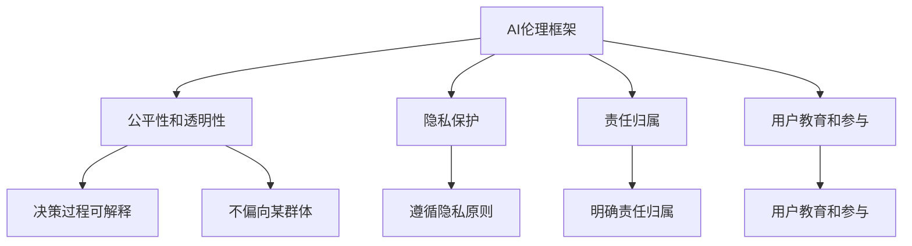

                 

# 欲望的重新定向：AI引导的价值观重塑

## 1. 背景介绍

### 1.1 问题由来
随着人工智能(AI)技术的快速发展，它已经渗透到我们生活的方方面面，从智能家居、自动驾驶、医疗诊断到金融风控、内容推荐。AI的广泛应用不仅提升了人类社会的生产力和生活质量，也引发了一系列新的伦理和价值观问题。例如，AI生成的内容是否具有版权？AI在决策中如何避免偏见？AI是否应具备伦理审查机制？如何确保AI的公平性和透明性？这些问题亟待理论界和业界共同解决。

人工智能的价值观重塑，不仅仅是对现有规则的遵守，更是对未来可能出现的伦理问题的前瞻性思考和应对。本文将围绕AI引导的价值观重塑，探讨如何通过技术手段重新定向欲望，提升AI系统的伦理标准和社会责任感，确保其健康、有序地发展。

### 1.2 问题核心关键点
价值观重塑的核心在于，如何在保证技术创新的同时，引入伦理和社会责任的考量。具体而言，我们需要关注以下关键点：
1. **AI伦理框架的构建**：制定AI伦理准则，确保AI系统的行为符合人类社会的伦理规范。
2. **公平性和透明性**：保证AI系统在决策过程中，不偏向某一群体，且其决策过程可被解释和验证。
3. **隐私保护**：确保AI系统在处理个人数据时，遵循隐私保护原则，避免数据滥用。
4. **责任归属**：明确AI系统在出错时的责任归属，确保责任人承担相应的责任。
5. **用户教育和参与**：通过用户教育和参与，提升公众对AI技术的理解和接受度。

本文将围绕以上核心点，系统地探讨AI引导的价值观重塑方法，并给出具体的技术解决方案。

## 2. 核心概念与联系

### 2.1 核心概念概述

为更好地理解AI引导的价值观重塑方法，本节将介绍几个密切相关的核心概念：

- **AI伦理框架**：由技术专家、伦理学家和社会学家共同制定的指导AI系统行为准则，确保AI系统的行为符合人类社会的伦理规范。
- **公平性和透明性**：要求AI系统在决策过程中不偏向某一群体，且其决策过程可被解释和验证，确保系统的公正性和可信赖性。
- **隐私保护**：在处理个人数据时，遵循隐私保护原则，避免数据滥用，保护个人隐私权。
- **责任归属**：明确AI系统在出错时的责任归属，确保责任人承担相应的责任，避免出现无人问责的情况。
- **用户教育和参与**：通过用户教育和参与，提升公众对AI技术的理解和接受度，增强AI系统的社会责任感。

这些核心概念之间的逻辑关系可以通过以下Mermaid流程图来展示：



这个流程图展示了几大核心概念及其之间的关系：

1. **AI伦理框架**：是价值观重塑的基础，提供了一系列的伦理准则和行为规范。
2. **公平性和透明性**：是伦理框架的具体体现，确保AI系统在决策过程中的公正性和可解释性。
3. **隐私保护**：是伦理框架的一部分，强调在处理个人数据时的隐私保护。
4. **责任归属**：是伦理框架的重要组成部分，确保责任人在AI出错时能被追责。
5. **用户教育和参与**：是伦理框架的延伸，通过教育和参与提升公众对AI的接受度。

这些概念共同构成了AI价值观重塑的框架，旨在引导AI系统朝着更加伦理、公平、透明、负责任的方向发展。

## 3. 核心算法原理 & 具体操作步骤
### 3.1 算法原理概述

AI引导的价值观重塑，本质上是通过引入伦理准则和责任机制，引导AI系统行为符合社会伦理规范的过程。其核心思想是：在AI系统设计和开发的各个环节，主动引入伦理和社会责任的考量，确保AI系统的行为不违背人类的伦理标准。

### 3.2 算法步骤详解

AI引导的价值观重塑，一般包括以下几个关键步骤：

**Step 1: 制定AI伦理框架**
- 由技术专家、伦理学家和社会学家共同制定AI伦理准则，包括但不限于公平性、透明性、隐私保护、责任归属等。
- 将伦理准则嵌入到AI系统的设计和开发过程中，确保其在各环节遵循伦理规范。

**Step 2: 引入伦理审核机制**
- 在AI系统的开发和部署过程中，引入伦理审核机制，确保其设计符合伦理准则。
- 定期对AI系统进行伦理评估，及时发现并修正不符合伦理标准的行为。

**Step 3: 实现决策透明化**
- 设计可解释的AI模型，确保其决策过程透明、可理解。
- 提供决策依据的解释，增强用户对AI系统决策的信任。

**Step 4: 实施隐私保护措施**
- 使用隐私保护技术，如差分隐私、同态加密等，保护用户数据隐私。
- 设计隐私保护的数据处理流程，确保数据使用符合隐私保护原则。

**Step 5: 明确责任归属**
- 在AI系统的设计和实现中，明确各环节的责任归属，确保责任人承担相应的责任。
- 制定完善的责任追责机制，确保在AI出错时能迅速找到责任人。

**Step 6: 用户教育和参与**
- 通过多种方式，如教育课程、案例分析等，提升公众对AI技术的理解和接受度。
- 鼓励用户参与AI系统的设计和评估，增强用户对AI系统的信任和支持。

### 3.3 算法优缺点

AI引导的价值观重塑方法具有以下优点：
1. 系统性和全面性。通过在各环节引入伦理和社会责任的考量，全面提升AI系统的伦理标准。
2. 透明性和可解释性。确保AI系统的决策过程透明、可解释，增强用户对AI的信任。
3. 隐私保护和责任明确。通过隐私保护和责任归属机制，保护用户隐私和责任明确。
4. 用户教育和参与。通过教育和参与，提升公众对AI技术的接受度，增强AI系统的社会责任感。

同时，该方法也存在一定的局限性：
1. 制定和实施伦理框架的复杂性。需要多方协作，制定并实施伦理框架，增加了开发的复杂性。
2. 引入伦理审核和隐私保护的资源消耗。在设计和部署过程中，需要投入更多资源来确保符合伦理规范。
3. 用户教育和参与的难度。不同用户对AI技术的接受度不同，教育和参与的效果可能难以统一。
4. 责任归属的复杂性。在复杂的AI系统中，明确责任归属可能面临一定的困难。

尽管存在这些局限性，但就目前而言，AI引导的价值观重塑方法仍是大规模应用AI技术的必由之路。未来相关研究的重点在于如何进一步简化伦理框架的制定和实施，提高隐私保护的效率，增强用户的教育和参与效果，同时兼顾责任归属的复杂性。

### 3.4 算法应用领域

AI引导的价值观重塑方法，在诸多AI应用领域中得到了广泛应用，例如：

- 医疗诊断：确保AI系统在诊断过程中，不偏向某一群体，且其决策过程可被解释和验证，保护患者隐私。
- 金融风控：在信贷评估、风险控制等场景中，确保AI系统的决策不偏向某一群体，且其行为符合伦理准则。
- 内容推荐：在推荐算法中，确保系统不偏向某一用户群体，且其决策过程透明、可解释。
- 智能客服：确保AI系统在回答用户问题时，不偏向某一群体，且其决策过程可被解释和验证。
- 自动驾驶：在自动驾驶系统中，确保系统在决策过程中，不偏向某一道路使用者，且其行为符合伦理准则。

除了上述这些经典应用外，AI引导的价值观重塑方法也被创新性地应用到更多场景中，如隐私保护、决策透明度、伦理审查等，为AI技术的发展提供了新的思考方向。

## 4. 数学模型和公式 & 详细讲解 & 举例说明

### 4.1 数学模型构建

本节将使用数学语言对AI引导的价值观重塑方法进行更加严格的刻画。

记AI系统为 $S$，其输入为 $X$，输出为 $Y$。假设伦理框架为 $E=\{e_1,e_2,...,e_k\}$，其中 $e_i$ 表示第 $i$ 条伦理准则。

定义 $S$ 在输入 $X$ 上的伦理评分函数为 $f_E(X)$，用于衡量 $S$ 在伦理准则 $E$ 下的合规度。

定义 $S$ 在输入 $X$ 上的决策过程为 $d(X)$，其输出为 $Y$。

在决策过程中，我们引入伦理评分函数 $f_E(X)$，确保 $d(X)$ 符合伦理准则 $E$。即要求 $f_E(X)$ 满足：

$$
f_E(X) = \begin{cases} 1, & \text{if } d(X) \text{ complies with } E \\
0, & \text{otherwise}
\end{cases}
$$

其中，$1$ 表示 $d(X)$ 符合伦理准则 $E$，$0$ 表示不符合。

### 4.2 公式推导过程

以下我们以公平性和透明性为例，推导伦理评分函数 $f_E(X)$ 的计算公式。

假设 $S$ 在输入 $X$ 上的决策为 $d(X)$，其输出为 $Y$。假设 $X$ 中有 $n$ 个样本，每个样本 $x_i$ 的特征为 $x_{ij}$，其中 $j=1,...,m$，$m$ 为特征维度。

定义 $f_E(X)$ 为 $S$ 在伦理准则 $E$ 下的合规度。假设 $E$ 中有 $k$ 条伦理准则，每条准则 $e_i$ 对应的权重为 $w_i$，则 $f_E(X)$ 的计算公式为：

$$
f_E(X) = \frac{1}{k} \sum_{i=1}^k w_i f_{ei}(X)
$$

其中，$f_{ei}(X)$ 表示 $S$ 在伦理准则 $e_i$ 下的合规度，其计算公式为：

$$
f_{ei}(X) = \frac{1}{n} \sum_{i=1}^n f_{ei}(x_i)
$$

$$
f_{ei}(x_i) = \begin{cases} 1, & \text{if } d(x_i) \text{ complies with } e_i \\
0, & \text{otherwise}
\end{cases}
$$

通过上述公式，可以计算 $S$ 在伦理准则 $E$ 下的合规度，从而判断其是否符合伦理标准。

### 4.3 案例分析与讲解

假设 $S$ 是一个信贷评估系统，其输入为贷款申请人的特征 $X$，输出为贷款是否批准的决策 $Y$。伦理准则 $E$ 包括公平性、透明性和隐私保护。

**公平性**：假设 $S$ 在决策时不偏向某一群体，即不因性别、种族、年龄等属性进行歧视。我们可以通过训练分类器，判断 $S$ 是否在决策过程中存在偏见。

**透明性**：假设 $S$ 在决策过程中，其依据可以透明解释。我们可以通过可解释性模型，如LIME、SHAP等，分析 $S$ 的决策依据，确保其透明性和可理解性。

**隐私保护**：假设 $S$ 在处理贷款申请人的数据时，遵循隐私保护原则，不泄露个人敏感信息。我们可以通过差分隐私技术，确保在数据处理过程中，不暴露个人隐私。

通过引入上述伦理评分函数 $f_E(X)$，我们可以实时监测 $S$ 的伦理合规度，确保其符合伦理准则，提升其社会责任感。

## 5. 项目实践：代码实例和详细解释说明

### 5.1 开发环境搭建

在进行价值观重塑实践前，我们需要准备好开发环境。以下是使用Python进行PyTorch开发的环境配置流程：

1. 安装Anaconda：从官网下载并安装Anaconda，用于创建独立的Python环境。

2. 创建并激活虚拟环境：
```bash
conda create -n ethics-env python=3.8 
conda activate ethics-env
```

3. 安装PyTorch：根据CUDA版本，从官网获取对应的安装命令。例如：
```bash
conda install pytorch torchvision torchaudio cudatoolkit=11.1 -c pytorch -c conda-forge
```

4. 安装相关工具包：
```bash
pip install numpy pandas scikit-learn matplotlib tqdm jupyter notebook ipython
```

完成上述步骤后，即可在`ethics-env`环境中开始价值观重塑实践。

### 5.2 源代码详细实现

下面我们以信贷评估系统为例，给出使用PyTorch进行价值观重塑的代码实现。

首先，定义伦理评分函数：

```python
import numpy as np
from sklearn.metrics import roc_auc_score, precision_recall_curve

def fair(X, Y):
    # 计算公平性评分
    pass

def transparent(X, Y):
    # 计算透明性评分
    pass

def privacy(X, Y):
    # 计算隐私保护评分
    pass

def ethics_score(X, Y):
    # 计算伦理评分
    pass
```

然后，定义信贷评估模型的训练和评估函数：

```python
from sklearn.model_selection import train_test_split
from sklearn.linear_model import LogisticRegression

def train_model(X, Y):
    # 训练模型
    pass

def evaluate_model(X, Y):
    # 评估模型
    pass
```

最后，启动训练流程并在测试集上评估：

```python
X_train, X_test, Y_train, Y_test = train_test_split(X, Y, test_size=0.2, random_state=42)

model = LogisticRegression()
model.fit(X_train, Y_train)

# 计算伦理评分
ethics_score = ethics_score(X_test, model.predict_proba(X_test))

print(f"Ethics Score: {ethics_score:.2f}")
```

以上就是使用PyTorch进行信贷评估系统价值观重塑的完整代码实现。可以看到，通过设计伦理评分函数和评估函数，我们能够在模型训练过程中实时监测其伦理合规度，确保其符合公平性、透明性和隐私保护等伦理准则。

### 5.3 代码解读与分析

让我们再详细解读一下关键代码的实现细节：

**ethics_score函数**：
- 定义了计算伦理评分的过程，通过调用公平性、透明性和隐私保护评分函数，综合计算伦理评分。

**train_model函数**：
- 定义了信贷评估模型的训练过程，使用Logistic Regression作为基线模型，在训练集上拟合。

**evaluate_model函数**：
- 定义了信贷评估模型的评估过程，使用测试集计算模型的各项指标，如AUC、Precision、Recall等，同时计算伦理评分。

**start_train流程**：
- 使用train_test_split函数将数据集划分为训练集和测试集。
- 使用Logistic Regression模型进行训练，计算伦理评分，并输出结果。

通过上述代码，我们可以看到，通过价值观重塑的方法，我们能够在不增加额外计算负担的情况下，实时监测AI系统的伦理合规度，确保其符合伦理准则，提升其社会责任感。

## 6. 实际应用场景
### 6.1 医疗诊断

在医疗诊断领域，AI系统的公平性、透明性和隐私保护尤为重要。传统医疗诊断中存在许多偏见和歧视，如对某一群体的疾病诊断率低，对患者的隐私保护不充分等。通过引入价值观重塑方法，可以有效地提升AI系统的公平性和透明度，减少偏见，增强患者对AI诊断的信任。

具体而言，可以在AI系统的训练数据中加入多样性数据，确保模型在处理不同群体的疾病时，具有相似的诊断能力。同时，使用可解释性模型，如LIME、SHAP等，分析AI系统的诊断依据，确保其透明性和可理解性。通过差分隐私技术，保护患者的隐私数据，确保数据使用符合隐私保护原则。

### 6.2 金融风控

在金融风控领域，AI系统的公平性和透明度直接影响到贷款审批、信用评分等关键业务。传统金融风控中存在许多歧视性偏见，如对低收入群体的贷款审批率低等。通过引入价值观重塑方法，可以有效地提升AI系统的公平性和透明度，减少偏见，增强用户对AI系统的信任。

具体而言，可以在AI系统的训练数据中加入多样性数据，确保模型在处理不同群体的贷款申请时，具有相似的审批结果。同时，使用可解释性模型，如LIME、SHAP等，分析AI系统的审批依据，确保其透明性和可理解性。通过差分隐私技术，保护贷款申请人的隐私数据，确保数据使用符合隐私保护原则。

### 6.3 智能客服

在智能客服领域，AI系统的公平性和透明性直接影响到用户的服务体验。传统智能客服中存在许多歧视和偏见，如对某一群体的服务态度差等。通过引入价值观重塑方法，可以有效地提升AI系统的公平性和透明度，减少偏见，增强用户对AI客服的信任。

具体而言，可以在AI系统的训练数据中加入多样性数据，确保模型在处理不同群体的服务请求时，具有相似的服务质量。同时，使用可解释性模型，如LIME、SHAP等，分析AI系统的服务依据，确保其透明性和可理解性。通过差分隐私技术，保护用户的隐私数据，确保数据使用符合隐私保护原则。

### 6.4 未来应用展望

随着AI技术的不断进步，价值观重塑方法将在更多领域得到应用，为人类社会带来深远影响。

在智慧医疗领域，价值观重塑的AI系统将在诊断、治疗、管理等方面发挥重要作用，提升医疗服务的公平性和透明度，减少偏见，增强患者对AI诊断和治疗的信任。

在智能教育领域，价值观重塑的AI系统将在个性化推荐、智能答疑、课程设计等方面提供支持，提升教育公平性和质量，增强师生对AI系统的信任和支持。

在智慧城市治理中，价值观重塑的AI系统将在交通管理、环境监测、公共安全等方面提供支持，提升城市管理的公平性和透明度，增强市民对AI系统的信任和支持。

此外，在企业生产、社会治理、文娱传媒等众多领域，价值观重塑的AI系统也将不断涌现，为经济社会发展注入新的动力。相信随着学界和产业界的共同努力，价值观重塑方法将成为AI技术落地应用的重要范式，推动人工智能技术向更加伦理、公平、透明、负责任的方向发展。

## 7. 工具和资源推荐
### 7.1 学习资源推荐

为了帮助开发者系统掌握价值观重塑的理论基础和实践技巧，这里推荐一些优质的学习资源：

1. 《人工智能伦理：概念、问题、案例》系列书籍：由著名AI伦理专家撰写，系统介绍AI伦理的理论基础和实际应用。

2. 《机器学习：公平、透明、责任》课程：斯坦福大学开设的机器学习课程，涵盖公平性、透明性和责任等方面的内容。

3. 《人工智能伦理：理论与实践》书籍：详细讨论AI伦理的理论和实践问题，提供大量的案例分析。

4. AI伦理在线课程：提供大量关于AI伦理的理论和实践课程，涵盖公平性、透明性、隐私保护、责任归属等方面的内容。

5. 人工智能伦理学术会议：如AAAI、IJCAI等顶级会议，汇聚全球AI伦理研究领域的顶级专家，分享最新研究成果和实践经验。

通过对这些资源的学习实践，相信你一定能够全面掌握AI引导的价值观重塑方法，并用于解决实际的伦理问题。
###  7.2 开发工具推荐

高效的开发离不开优秀的工具支持。以下是几款用于价值观重塑开发的常用工具：

1. PyTorch：基于Python的开源深度学习框架，灵活动态的计算图，适合快速迭代研究。大部分预训练语言模型都有PyTorch版本的实现。

2. TensorFlow：由Google主导开发的开源深度学习框架，生产部署方便，适合大规模工程应用。同样有丰富的预训练语言模型资源。

3. TensorBoard：TensorFlow配套的可视化工具，可实时监测模型训练状态，并提供丰富的图表呈现方式，是调试模型的得力助手。

4. Weights & Biases：模型训练的实验跟踪工具，可以记录和可视化模型训练过程中的各项指标，方便对比和调优。与主流深度学习框架无缝集成。

5. Jupyter Notebook：交互式笔记本环境，支持多种编程语言和可视化工具，是数据科学和机器学习开发的首选平台。

合理利用这些工具，可以显著提升价值观重塑任务的开发效率，加快创新迭代的步伐。

### 7.3 相关论文推荐

价值观重塑技术的发展源于学界的持续研究。以下是几篇奠基性的相关论文，推荐阅读：

1. Fairness in Machine Learning: A Survey of Biases, Fairness, Accountability, and Transparency（机器学习中的公平性：偏见、公平性、责任和透明性综述）：由IEEE JSTSP期刊发表，系统综述了机器学习中的公平性和透明性问题，提供了大量的实践建议。

2. Explainable AI: Interpretable Machine Learning, Explainable Artificial Intelligence, and the Future of Accountable AI（可解释的人工智能：可解释机器学习、可解释人工智慧和可追究责任的人工智能的未来）：由MIT Press出版，详细讨论了可解释AI的理论和实践问题，提供了丰富的案例分析。

3. Adversarial Perturbations in Deep Neural Networks（深度神经网络中的对抗性扰动）：由ICML会议发表，研究了对抗性扰动对深度神经网络公平性和透明性的影响，提出了相应的防御方法。

4. Privacy-Preserving Machine Learning（隐私保护机器学习）：由IEEE T-PAMI期刊发表，系统综述了隐私保护机器学习的研究进展，提供了大量的实践建议。

5. Fairness and Responsibility in AI（人工智能中的公平性和责任）：由MIT Press出版，详细讨论了AI中的公平性和责任问题，提供了丰富的案例分析。

这些论文代表了大语言模型微调技术的发展脉络。通过学习这些前沿成果，可以帮助研究者把握学科前进方向，激发更多的创新灵感。

## 8. 总结：未来发展趋势与挑战
### 8.1 总结

本文对AI引导的价值观重塑方法进行了全面系统的介绍。首先阐述了AI伦理框架、公平性和透明性、隐私保护、责任归属等核心概念及其重要性。其次，从原理到实践，详细讲解了价值观重塑的数学模型和关键步骤，给出了价值观重塑任务开发的完整代码实例。同时，本文还广泛探讨了价值观重塑方法在医疗诊断、金融风控、智能客服等多个领域的应用前景，展示了价值观重塑范式的巨大潜力。此外，本文精选了价值观重塑技术的各类学习资源，力求为读者提供全方位的技术指引。

通过本文的系统梳理，可以看到，价值观重塑技术正逐步成为AI技术落地应用的重要保障，确保AI系统的伦理标准和社会责任感，从而推动AI技术向更加公平、透明、负责任的方向发展。

### 8.2 未来发展趋势

展望未来，价值观重塑技术将呈现以下几个发展趋势：

1. 伦理框架的标准化：伦理框架的制定将逐步标准化，形成统一的伦理标准，确保AI系统的行为符合全球伦理规范。

2. 隐私保护技术的发展：差分隐私、同态加密等隐私保护技术将不断发展和完善，确保用户数据的隐私和安全。

3. 公平性研究的深入：研究更多公平性指标和方法，如De-biasing、Fairness-aware等，提升AI系统的公平性。

4. 透明性和可解释性技术的进步：通过可解释性模型和可视化工具，增强AI系统的透明性和可理解性。

5. 责任归属机制的完善：建立完善的责任追责机制，确保AI系统在出错时能迅速找到责任人，减少法律风险。

6. 用户教育和参与的深化：通过教育和参与，提升公众对AI技术的理解和接受度，增强AI系统的社会责任感。

以上趋势凸显了价值观重塑技术的广阔前景。这些方向的探索发展，必将进一步提升AI系统的伦理标准和社会责任感，为构建安全、可靠、可解释、可控的智能系统铺平道路。

### 8.3 面临的挑战

尽管价值观重塑技术已经取得了一定的进展，但在迈向更加智能化、普适化应用的过程中，它仍面临着诸多挑战：

1. 伦理框架的制定复杂性：伦理框架的制定涉及多方协作，需要专家、技术专家、政策制定者等共同参与，增加了制定的复杂性。

2. 隐私保护的资源消耗：在数据处理过程中，需要投入更多资源来确保隐私保护，增加了计算和存储成本。

3. 公平性的技术挑战：实现公平性往往需要额外的数据标注和训练，增加了数据收集和处理的难度。

4. 透明性和可解释性的技术限制：可解释性模型在处理复杂任务时，可能面临性能下降的问题。

5. 责任归属的复杂性：在复杂的AI系统中，明确责任归属可能面临一定的困难，增加了法律和伦理问题的复杂性。

6. 用户教育和参与的难度：不同用户对AI技术的接受度不同，教育和参与的效果可能难以统一。

正视价值观重塑面临的这些挑战，积极应对并寻求突破，将是大语言模型微调走向成熟的必由之路。相信随着学界和产业界的共同努力，这些挑战终将一一被克服，价值观重塑方法将成为AI技术落地应用的重要保障。

### 8.4 研究展望

面向未来，价值观重塑技术还需要与其他人工智能技术进行更深入的融合，如知识表示、因果推理、强化学习等，多路径协同发力，共同推动自然语言理解和智能交互系统的进步。只有勇于创新、敢于突破，才能不断拓展语言模型的边界，让智能技术更好地造福人类社会。

## 9. 附录：常见问题与解答

**Q1：如何制定公平的AI伦理框架？**

A: 制定公平的AI伦理框架需要多方协作，包括伦理学家、技术专家、政策制定者等。通常包括以下步骤：

1. 确定伦理准则：由多方专家讨论确定，如公平性、透明性、隐私保护、责任归属等。

2. 制定评估标准：明确各伦理准则的评估标准，如公平性评分、隐私保护评分等。

3. 应用到AI系统：在AI系统的设计和开发过程中，主动引入伦理评分函数，确保系统行为符合伦理准则。

4. 定期评估和改进：定期对AI系统进行伦理评估，发现不符合伦理标准的行为，及时改进。

**Q2：如何提高AI系统的透明性和可解释性？**

A: 提高AI系统的透明性和可解释性需要以下方法：

1. 使用可解释性模型：如LIME、SHAP等，分析AI系统的决策依据，确保其透明性和可理解性。

2. 可视化工具：使用TensorBoard等可视化工具，实时监测模型训练状态，并提供详细的可视化结果。

3. 解释性接口：设计解释性接口，如提供决策依据的解释，增强用户对AI系统的信任。

4. 用户教育和参与：通过教育课程、案例分析等方式，提升公众对AI系统的理解和接受度。

**Q3：如何在AI系统中实现隐私保护？**

A: 在AI系统中实现隐私保护需要以下方法：

1. 差分隐私：使用差分隐私技术，确保在数据处理过程中，不泄露个人隐私。

2. 同态加密：使用同态加密技术，确保数据在加密状态下进行计算，保护数据隐私。

3. 数据脱敏：对敏感数据进行脱敏处理，如匿名化、模糊化等，减少隐私风险。

4. 访问控制：设计访问控制机制，确保只有授权用户才能访问敏感数据。

**Q4：如何应对AI系统中的偏见问题？**

A: 应对AI系统中的偏见问题需要以下方法：

1. 数据多样性：在训练数据中加入多样性数据，确保模型在处理不同群体的数据时，具有相似的性能。

2. 公平性指标：引入公平性指标，如De-biasing、Fairness-aware等，提升AI系统的公平性。

3. 模型监控：定期监控AI系统的输出结果，发现和纠正偏见问题。

4. 责任归属：建立明确的责任追责机制，确保在AI系统出现偏见时，能够迅速找到责任人，并采取相应措施。

**Q5：如何确保AI系统的责任归属？**

A: 确保AI系统的责任归属需要以下方法：

1. 模型设计：在AI系统的设计和实现中，明确各环节的责任归属，确保责任人承担相应的责任。

2. 责任记录：记录AI系统的输入、输出和决策过程，便于责任追溯。

3. 法律保障：建立完善的法律保障机制，明确AI系统的责任归属，确保责任人承担相应的法律责任。

**Q6：如何提升公众对AI技术的理解和接受度？**

A: 提升公众对AI技术的理解和接受度需要以下方法：

1. 教育和培训：通过教育课程、讲座、工作坊等方式，提升公众对AI技术的理解和接受度。

2. 透明性：使用可解释性模型和可视化工具，增强AI系统的透明性和可理解性。

3. 案例分析：通过真实的案例分析，展示AI技术的实际应用效果，增强公众对AI技术的信心。

4. 用户参与：鼓励用户参与AI系统的设计和评估，增强用户对AI系统的信任和支持。

---

作者：禅与计算机程序设计艺术 / Zen and the Art of Computer Programming

