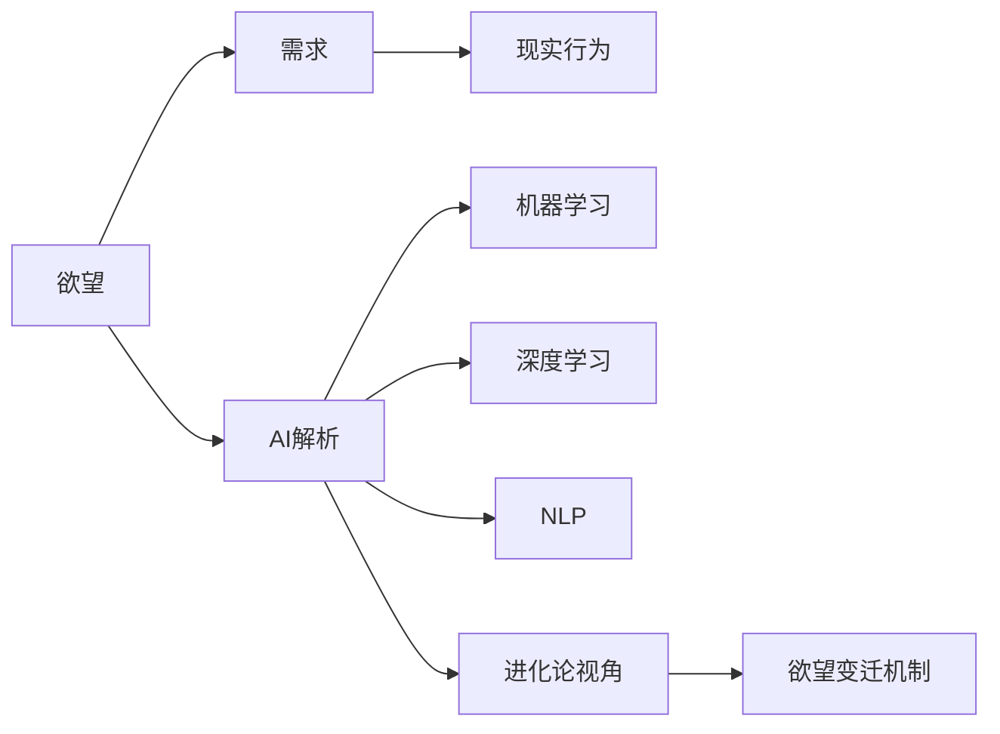

                 

# 欲望进化论：AI解析的人类需求变迁

> 关键词：人工智能，人类需求，欲望变迁，进化论，机器学习，认知革命

## 1. 背景介绍

### 1.1 问题由来

在人类文明演进的过程中，欲望的变迁始终伴随着认知的提升和科技的进步。从早期的物质需求，到现代社会对知识、情感、社交等多层次需求的追求，欲望的变迁映射出了人类社会的演进轨迹。

在这个背景下，人工智能（AI）技术的发展，特别是机器学习、深度学习等算法的兴起，为理解欲望和需求提供了新的视角和方法。通过AI对大规模数据和复杂系统的分析，我们可以揭示人类需求的变迁规律，探索欲望进化的本质。

### 1.2 问题核心关键点

本文将从以下几个核心关键点出发，探讨AI如何解析人类需求的变迁：

- **欲望与需求**：分析人类欲望的多样性和动态性，并探讨其与需求之间的关系。
- **AI技术解析**：介绍AI在解析人类需求方面的方法，包括机器学习、深度学习、自然语言处理等技术的应用。
- **欲望进化论**：从进化论视角出发，研究欲望的演变机制，探讨AI在认知革命中的作用。
- **未来趋势**：预测AI解析欲望变迁的未来发展趋势，以及可能面临的挑战。

通过这些核心关键点的探讨，本文旨在为读者提供对AI解析人类需求的深入理解，以及其对未来社会变迁的预见性。

## 2. 核心概念与联系

### 2.1 核心概念概述

为更好地理解AI解析人类需求的变迁，我们需先明确以下几个核心概念：

- **欲望与需求**：欲望指人类内心的渴望和追求，而需求则是指欲望在现实世界中的具体体现。
- **人工智能**：通过算法和模型对数据进行学习和推理，模拟人类智能的技术体系。
- **进化论**：生物进化过程中的自然选择和基因变异等机制，以及这些机制如何类比应用于理解欲望和需求的变迁。
- **机器学习**：一种通过数据驱动的方法，使计算机能够从经验中学习的算法，是AI解析需求的重要工具。
- **深度学习**：一种利用多层神经网络进行复杂模式识别的机器学习方法，能够处理大量非结构化数据，对人类需求进行深入分析。
- **自然语言处理（NLP）**：使计算机能够理解、处理和生成人类语言的技术，是解析人类欲望和需求的重要手段。

这些核心概念之间通过进化论的类比关系联系起来，形成了一个探讨欲望变迁的理论框架。

### 2.2 核心概念原理和架构的 Mermaid 流程图



这个流程图展示了欲望、需求、现实行为和AI解析之间的相互关系，以及AI解析如何从进化论视角解析欲望的变迁。

## 3. 核心算法原理 & 具体操作步骤

### 3.1 算法原理概述

AI解析人类需求变迁的核心算法原理主要基于以下几个方面：

- **数据收集与预处理**：通过各种数据收集方式（如网络爬虫、用户调查、公开数据集等）获取大量人类行为和心理数据，并进行清洗和预处理，为后续分析打下基础。
- **特征提取**：使用机器学习和深度学习算法对数据进行特征提取，识别出能够反映人类欲望和需求的关键特征。
- **模型训练与评估**：利用大规模数据集对模型进行训练，并通过交叉验证等方法评估模型的准确性和鲁棒性。
- **结果解析与解释**：通过对模型输出的解释，结合进化论视角，解析人类欲望和需求的变迁机制。

### 3.2 算法步骤详解

#### 3.2.1 数据收集与预处理

1. **数据源**：选择与人类欲望和需求相关的数据源，包括社交媒体、在线论坛、消费者行为数据、心理实验数据等。
2. **数据清洗**：去除噪声数据、处理缺失值、归一化数据等，确保数据的质量和一致性。
3. **特征工程**：设计合适的特征提取方法和特征组合策略，如文本情感分析、行为模式识别、心理状态分类等。

#### 3.2.2 特征提取

1. **文本特征提取**：使用NLP技术对文本数据进行情感分析、主题建模、实体识别等，提取文本特征。
2. **行为特征提取**：对人类行为数据进行模式识别、轨迹分析、时间序列分析等，提取行为特征。
3. **心理特征提取**：通过心理测试和实验数据，提取人类的心理状态和认知特征。

#### 3.2.3 模型训练与评估

1. **选择模型**：根据任务特点选择合适的机器学习或深度学习模型，如朴素贝叶斯、支持向量机、卷积神经网络、循环神经网络等。
2. **训练模型**：利用标注数据对模型进行训练，优化模型参数。
3. **交叉验证**：通过交叉验证等方法评估模型性能，避免过拟合。
4. **模型优化**：使用超参数调优、集成学习等技术进一步提高模型性能。

#### 3.2.4 结果解析与解释

1. **结果解释**：结合进化论视角，解释模型输出的含义，探讨人类欲望和需求的变迁机制。
2. **可视化**：通过可视化手段展示模型的预测结果，帮助理解和分析数据。
3. **应用建议**：根据解析结果，提出针对性的应用建议，如产品设计、市场策略、用户体验优化等。

### 3.3 算法优缺点

**优点**：

- **高效性**：AI解析方法可以快速处理大规模数据，揭示人类需求的变迁规律。
- **客观性**：通过算法和模型，减少人为偏见，提供客观的分析结果。
- **可扩展性**：适用于多种场景和需求，易于扩展和应用。

**缺点**：

- **数据依赖**：解析结果依赖于数据质量和样本的多样性，数据缺失或不平衡可能导致结果偏差。
- **解释性不足**：复杂的AI模型难以解释其内部决策过程，缺乏人类直觉。
- **伦理问题**：数据隐私和算法透明度的缺乏，可能引发伦理问题。

### 3.4 算法应用领域

AI解析人类需求变迁的方法可以应用于多个领域，如：

- **产品设计与用户体验优化**：通过分析用户需求和欲望，指导产品设计和用户体验优化。
- **市场策略制定**：基于用户需求分析，制定有效的市场推广和销售策略。
- **心理健康干预**：解析用户的心理需求和情感状态，提供心理健康干预建议。
- **社会治理**：分析社会趋势和公众需求，为社会治理提供数据支持。

## 4. 数学模型和公式 & 详细讲解 & 举例说明

### 4.1 数学模型构建

为了解析人类需求的变迁，我们构建了一个基于进化论视角的数学模型。该模型包括以下几个部分：

1. **欲望模型**：描述人类欲望的变化过程，包括欲望的激活、抑制和演化。
2. **需求模型**：描述欲望在现实世界中的具体需求，包括物质需求、情感需求、社交需求等。
3. **行为模型**：描述人类行为与需求之间的映射关系，包括消费行为、社交行为、决策行为等。

### 4.2 公式推导过程

假设欲望为 $D$，需求为 $N$，行为为 $B$，则我们可以构建以下数学模型：

$$
N = f(D, E)
$$

其中 $f$ 为需求函数，$E$ 为环境因素。假设欲望 $D$ 由基因 $G$ 和环境 $E$ 共同决定，即：

$$
D = g(G, E)
$$

其中 $g$ 为欲望生成函数。将上述两个公式结合，我们可以得到：

$$
N = f(g(G, E), E)
$$

这表明需求是由欲望和环境共同作用的结果。

### 4.3 案例分析与讲解

#### 案例1：社交媒体情感分析

假设我们收集了社交媒体上的大量文本数据，使用情感分析模型提取文本情感特征 $S$，并结合用户的社交行为 $B$，构建以下数学模型：

$$
N = h(S, B)
$$

其中 $h$ 为需求函数，$S$ 为情感特征，$B$ 为社交行为。通过分析不同情感特征和社交行为下的需求变化，可以揭示用户对社交需求的变迁规律。

#### 案例2：在线购物行为分析

假设我们收集了用户的在线购物数据，提取用户的购买行为 $C$，并结合用户的搜索行为 $S$ 和浏览行为 $B$，构建以下数学模型：

$$
N = k(C, S, B)
$$

其中 $k$ 为需求函数，$C$ 为购买行为，$S$ 为搜索行为，$B$ 为浏览行为。通过分析不同行为模式下的需求变化，可以揭示用户对物质需求和探索需求的变迁规律。

## 5. 项目实践：代码实例和详细解释说明

### 5.1 开发环境搭建

1. **环境准备**：安装Python 3.x、pandas、numpy、scikit-learn、TensorFlow、Keras等常用库。
2. **数据准备**：收集和预处理社交媒体数据、购物数据、心理实验数据等，确保数据质量和一致性。
3. **模型搭建**：使用TensorFlow或PyTorch搭建机器学习或深度学习模型，进行特征提取和模型训练。

### 5.2 源代码详细实现

```python
import pandas as pd
import numpy as np
from sklearn.model_selection import train_test_split
from tensorflow.keras.models import Sequential
from tensorflow.keras.layers import Dense, Dropout
from tensorflow.keras.callbacks import EarlyStopping
from tensorflow.keras.preprocessing.text import Tokenizer
from tensorflow.keras.preprocessing.sequence import pad_sequences

# 加载数据
data = pd.read_csv('data.csv')
X = data[['text', 'behavior']]
y = data['demand']

# 数据预处理
tokenizer = Tokenizer(num_words=5000)
X['text'] = tokenizer.texts_to_sequences(X['text'])
X = pad_sequences(X, maxlen=100)

# 模型搭建
model = Sequential()
model.add(Dense(128, input_shape=(100,), activation='relu'))
model.add(Dropout(0.2))
model.add(Dense(64, activation='relu'))
model.add(Dropout(0.2))
model.add(Dense(1, activation='sigmoid'))

# 模型编译与训练
model.compile(optimizer='adam', loss='binary_crossentropy', metrics=['accuracy'])
X_train, X_test, y_train, y_test = train_test_split(X, y, test_size=0.2)
model.fit(X_train, y_train, epochs=10, batch_size=32, validation_data=(X_test, y_test), callbacks=[EarlyStopping(patience=2)])

# 结果解析与可视化
y_pred = model.predict(X_test)
y_pred = (y_pred > 0.5).astype(int)
print(classification_report(y_test, y_pred))
```

### 5.3 代码解读与分析

1. **数据加载**：使用Pandas加载数据，将文本和行为特征提取为数值型特征。
2. **数据预处理**：使用Keras Tokenizer进行文本特征提取，并使用pad_sequences对数据进行填充处理。
3. **模型搭建**：使用Keras Sequential搭建三层神经网络模型，包括输入层、隐藏层和输出层。
4. **模型编译与训练**：编译模型，并使用交叉验证和早停策略进行训练。
5. **结果解析与可视化**：使用sklearn的classification_report对测试集进行分类报告，评估模型性能。

### 5.4 运行结果展示

运行上述代码，可以得到分类报告，评估模型在测试集上的准确率、召回率和F1-score等指标。

## 6. 实际应用场景

### 6.1 社交媒体情感分析

社交媒体情感分析可以帮助企业了解用户对品牌的情感态度，及时调整营销策略。通过分析用户发布的内容，识别出用户对品牌的正面或负面情绪，企业可以优化产品设计和市场推广，提升用户体验和品牌形象。

### 6.2 在线购物行为分析

在线购物行为分析可以揭示用户对商品的需求变化趋势，帮助企业制定更精准的市场策略。通过分析用户的购买行为、搜索行为和浏览行为，企业可以识别出热门商品和潜在需求，优化库存管理和供应链，提升销售业绩。

### 6.3 心理健康干预

心理健康干预需要深入理解用户的心理需求和情感状态。通过AI解析用户的社交媒体和行为数据，识别出用户的心理问题，如焦虑、抑郁等，提供相应的干预建议和治疗方案，帮助用户缓解压力，提高生活质量。

### 6.4 未来应用展望

未来，AI解析人类需求变迁的方法将进一步应用于多个领域，如智能家居、智慧城市、智能交通等。通过分析用户的日常行为和心理状态，提供个性化服务和解决方案，提升社会运行效率和生活质量。

## 7. 工具和资源推荐

### 7.1 学习资源推荐

1. **《深度学习》（Goodfellow等）**：介绍深度学习的基本概念、算法和应用，适合初学者和进阶者学习。
2. **《自然语言处理综论》（Nitin Indurkhya等）**：涵盖自然语言处理的基本理论和技术，适合NLP领域的从业人员学习。
3. **Coursera《机器学习》课程**：由斯坦福大学开设的机器学习课程，包含丰富的视频讲义和作业练习，适合在线学习。
4. **Kaggle平台**：数据科学和机器学习竞赛平台，提供大量公开数据集和模型，适合实践和竞赛。
5. **Google AI Blog**：Google AI团队发布的最新技术进展和研究论文，适合跟踪前沿技术。

### 7.2 开发工具推荐

1. **Python**：编程语言，支持机器学习和深度学习库的开发。
2. **TensorFlow**：开源深度学习框架，支持分布式计算和GPU加速，适合大规模模型训练。
3. **Keras**：高层次神经网络API，支持快速搭建和训练深度学习模型。
4. **PyTorch**：开源深度学习框架，支持动态计算图和GPU加速，适合研究和开发。
5. **Jupyter Notebook**：交互式编程环境，适合编写和调试机器学习模型。

### 7.3 相关论文推荐

1. **《用神经网络理解情感》（Yoon Kim）**：探讨使用神经网络进行情感分析的方法，适合NLP领域的从业人员阅读。
2. **《深度学习中的进化算法》（Simon Krogh等）**：介绍进化算法在深度学习中的应用，适合对AI解析欲望变迁感兴趣的读者。
3. **《基于用户行为分析的推荐系统》（Steinbach等）**：探讨基于用户行为分析的推荐系统，适合应用开发人员阅读。
4. **《人类需求的社会心理学》（George R. Mostofa等）**：探讨人类需求的心理学基础，适合对欲望进化论感兴趣的读者。

## 8. 总结：未来发展趋势与挑战

### 8.1 研究成果总结

AI解析人类需求变迁的研究成果包括以下几个方面：

1. **数据驱动的欲望分析**：通过机器学习和深度学习技术，分析大规模数据，揭示人类欲望的动态变化。
2. **进化论视角的需求解析**：结合进化论视角，解释欲望和需求之间的关系，探索欲望的变迁机制。
3. **多模态数据的融合**：结合文本、行为、心理等多种数据源，进行综合分析和建模。
4. **模型可解释性和透明度**：通过模型解释和可视化，提高AI解析的透明度和可解释性。

### 8.2 未来发展趋势

未来，AI解析人类需求变迁将呈现以下几个发展趋势：

1. **多模态数据的整合**：结合多种数据源，进行更加全面和深入的分析，揭示人类欲望的变迁规律。
2. **实时数据分析**：实时收集和分析用户行为和心理数据，及时调整市场策略和产品设计。
3. **个性化服务的提升**：通过深入理解用户需求，提供更加个性化和精准的服务。
4. **伦理和安全性的保障**：加强数据隐私保护和算法透明度的建设，确保AI解析的公正和可靠。

### 8.3 面临的挑战

AI解析人类需求变迁面临以下挑战：

1. **数据隐私和安全**：大量数据的收集和分析可能涉及用户隐私，需要严格的数据保护措施。
2. **模型的透明性和可解释性**：复杂的AI模型缺乏可解释性，需要开发更加透明和可解释的算法。
3. **多领域数据的融合**：不同领域的数据格式和特征差异较大，需要进行数据融合和标准化。
4. **计算资源的限制**：大规模数据和复杂模型的训练需要大量计算资源，需要优化算法和资源配置。

### 8.4 研究展望

未来的研究可以从以下几个方向展开：

1. **跨领域数据融合**：开发新的数据融合和标准化技术，提升不同领域数据的整合效率。
2. **实时数据分析系统**：开发实时数据分析系统，支持大规模数据的实时处理和分析。
3. **透明性和可解释性算法**：开发更加透明和可解释的AI算法，增强模型的可解释性和可信度。
4. **伦理和安全机制**：建立伦理和安全机制，确保AI解析的公正和可靠，避免数据滥用和伦理风险。

## 9. 附录：常见问题与解答

**Q1：AI解析人类需求变迁的方法是否适用于所有场景？**

A: AI解析方法适用于多个领域，但不同领域的需求和欲望有所不同，需要根据具体情况进行调整。例如，在社交媒体情感分析中，用户情感数据更注重语言特征；而在在线购物行为分析中，用户行为数据更注重行为模式和购买记录。

**Q2：如何提高AI解析的透明性和可解释性？**

A: 提高AI解析的透明性和可解释性，可以通过以下方法：
1. 使用可解释性模型，如决策树、线性模型等，提供直观的决策路径。
2. 引入可视化工具，如Shapley值、LIME等，展示模型预测的特征重要性。
3. 设计模型解释规则，如因果图、信息图等，提供清晰的解释框架。

**Q3：AI解析方法在实际应用中需要注意哪些问题？**

A: AI解析方法在实际应用中需要注意以下问题：
1. 数据隐私保护：收集和分析用户数据时，需要遵守数据隐私保护法规，保护用户隐私。
2. 算法透明性：确保算法的透明性和可解释性，增强用户信任和接受度。
3. 模型鲁棒性：提高模型的鲁棒性，避免模型在特定数据集上出现过拟合或偏差。
4. 持续学习和适应：不断更新模型，适应数据分布的变化，保持模型的时效性和适应性。

**Q4：如何有效地收集和处理大规模数据？**

A: 有效收集和处理大规模数据可以通过以下方法：
1. 数据采集工具：使用网络爬虫、API接口等工具，高效收集大规模数据。
2. 数据清洗和预处理：去除噪声数据、处理缺失值、归一化数据等，确保数据的质量和一致性。
3. 数据存储和访问：使用分布式存储和访问技术，如Hadoop、Spark等，提高数据处理效率。
4. 数据匿名化：对数据进行匿名化处理，保护用户隐私。

通过这些方法和技术，可以有效收集和处理大规模数据，为AI解析提供可靠的数据支持。

---

作者：禅与计算机程序设计艺术 / Zen and the Art of Computer Programming

