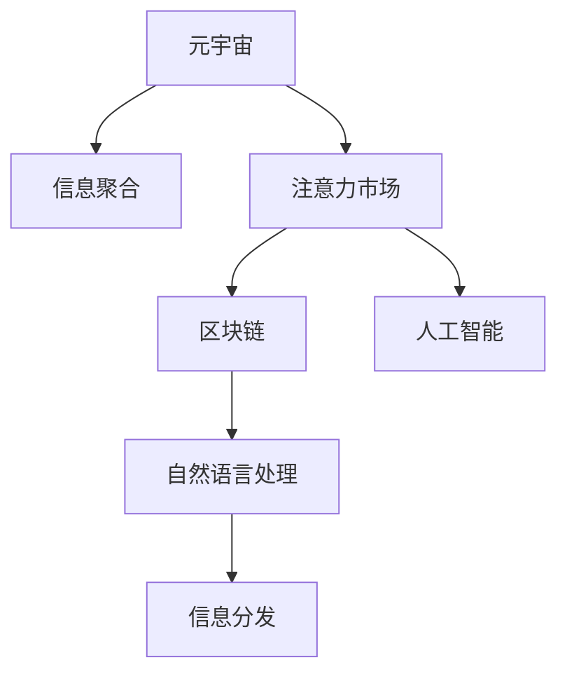

                 

# 注意力市场：元宇宙时代下的信息交易

## 1. 背景介绍

随着区块链、虚拟现实、人工智能等技术的快速发展，元宇宙时代正在悄然到来。元宇宙不仅是一个虚拟的数字空间，更是信息交流、社交互动、经济活动的全新平台。在这个新世界里，信息成为最重要的资产，而用户对信息的关注与互动，则构成了“注意力”市场。本文将探讨元宇宙时代的注意力市场如何运作，以及如何利用区块链、人工智能等技术手段，构建更加高效、透明、可信的信息交易系统。

### 1.1 元宇宙与注意力市场的兴起

元宇宙是指一个数字化的虚拟空间，用户在其中可以自由地进行交流、协作、创作和消费。随着数字世界的不断扩展，信息的重要性日益凸显。用户对信息的需求，从简单的浏览和检索，逐步转向对高质量、个性化、即时性内容的需求。在这一背景下，“注意力”市场应运而生。

注意力市场，是指用户对信息的关注度所引发的商业价值。在元宇宙时代，用户的时间、情感和注意力成为了宝贵的资源。通过有效的信息聚合和分发机制，可以吸引更多的用户参与和贡献，从而形成良性循环。然而，注意力市场的构建和运作，需要解决信息质量控制、信任机制、激励机制等一系列问题。

## 2. 核心概念与联系

### 2.1 核心概念概述

为更好地理解元宇宙时代的注意力市场，我们首先介绍几个关键概念：

- **元宇宙(Metaverse)**：一个数字化的虚拟空间，用户在其中进行交流、协作、创作和消费。
- **注意力市场(Attention Economy)**：用户对信息的关注度所引发的商业价值。
- **区块链(Blockchain)**：一种分布式账本技术，通过去中心化、不可篡改、可追溯等特点，保障信息交易的透明性和安全性。
- **人工智能(AI)**：通过算法和模型，自动处理和分析海量信息，提升信息筛选和分发的效率。
- **自然语言处理(NLP)**：一种使计算机能够理解、处理人类语言的技术，实现信息的自然交互。

这些概念之间存在紧密的联系，共同构成了元宇宙时代注意力市场的运作框架。

### 2.2 核心概念原理和架构的 Mermaid 流程图



这个流程图展示了元宇宙时代注意力市场的运作路径：

1. 元宇宙作为信息聚合的载体，提供了一个虚拟的空间。
2. 用户在元宇宙中进行信息互动，产生注意力价值。
3. 注意力市场通过对注意力的量化和分配，实现商业价值。
4. 区块链技术保障信息交易的透明性和安全性。
5. 人工智能和自然语言处理技术提升信息聚合和分发的效率。

## 3. 核心算法原理 & 具体操作步骤

### 3.1 算法原理概述

在元宇宙时代的注意力市场中，信息交易的本质是注意力的交换。通过区块链和人工智能技术，可以构建一个透明、可信的信息交易系统，最大化信息价值。具体而言，以下算法和步骤构成了注意力市场的核心：

- **信息聚合与分析**：通过自然语言处理技术，对用户生成内容、专家知识库等信息进行聚合和分析，提取高质量的信息。
- **注意力量化**：通过区块链技术，实现注意力的数字化和量化，建立基于用户行为和贡献的激励机制。
- **信息交易平台**：构建基于区块链的信息交易平台，实现信息的分发、购买和交易。
- **智能合约与激励机制**：利用智能合约技术，自动执行交易规则和激励机制，确保交易的公平性和透明度。

### 3.2 算法步骤详解

#### 3.2.1 信息聚合与分析

信息聚合与分析是注意力市场的基础。具体步骤包括：

1. **信息采集**：通过API接口、爬虫等方式，从元宇宙平台、社交媒体、公开数据库等渠道采集信息。
2. **预处理**：对采集的信息进行去重、清洗、格式转换等预处理操作。
3. **特征提取**：利用自然语言处理技术，提取文本的关键词、情感、主题等特征。
4. **信息筛选**：通过机器学习算法，对信息进行评分和排序，筛选出高质量内容。

#### 3.2.2 注意力量化

注意力量化是将用户对信息的关注度数字化。具体步骤包括：

1. **用户行为记录**：通过区块链技术，记录用户对信息的访问、评论、点赞等行为。
2. **注意力评分**：根据用户行为和信息质量，计算每个信息的注意力评分。
3. **积分奖励**：根据信息质量和用户贡献，给予用户积分奖励。
4. **透明度**：将评分和积分公开透明地展示，提高系统的信任度。

#### 3.2.3 信息交易平台

信息交易平台是注意力市场的重要组成部分。具体步骤包括：

1. **平台搭建**：基于区块链技术搭建信息交易平台，确保交易的透明性和安全性。
2. **信息上架**：将高质量信息上架，供用户浏览和购买。
3. **交易机制**：设计交易机制，确保交易的公平性和高效性。
4. **交易监管**：通过智能合约技术，自动执行交易规则和监管机制，防止欺诈和恶意行为。

#### 3.2.4 智能合约与激励机制

智能合约和激励机制是确保注意力市场高效运作的关键。具体步骤包括：

1. **智能合约设计**：根据交易规则，设计智能合约，确保交易的自动执行和公平性。
2. **激励机制**：根据用户贡献和行为，设计激励机制，如积分奖励、优惠券等。
3. **透明度**：将智能合约和激励机制公开透明地展示，提高系统的信任度。
4. **持续优化**：根据市场反馈，不断优化智能合约和激励机制，提升用户体验。

### 3.3 算法优缺点

元宇宙时代的注意力市场，通过区块链和人工智能技术，具有以下优点：

- **透明性**：区块链技术保证了交易过程的透明性和不可篡改性，提高了系统的信任度。
- **安全性**：区块链技术保障了信息交易的安全性，防止欺诈和恶意行为。
- **高效性**：人工智能和自然语言处理技术提升了信息聚合和分发的效率，降低了人工成本。
- **公平性**：智能合约和激励机制确保了交易的公平性和透明度。

同时，也存在一些局限性：

- **技术门槛**：区块链和人工智能技术的复杂性，对开发者和用户的技术要求较高。
- **隐私问题**：用户行为数据的采集和分析可能涉及隐私问题，需要合理的隐私保护措施。
- **延迟问题**：区块链的交易过程可能存在延迟，影响系统的响应速度。
- **成本问题**：区块链和人工智能技术的开发和维护成本较高，需要投入大量资源。

### 3.4 算法应用领域

注意力市场的应用领域非常广泛，涉及多个行业和领域：

- **社交媒体**：通过区块链和人工智能技术，提升社交媒体内容的筛选和分发效率，实现个性化推荐。
- **新闻媒体**：通过区块链和人工智能技术，保障新闻内容的真实性和可信度，提升信息传播效率。
- **教育培训**：通过区块链和人工智能技术，提供高质量的教育资源和个性化学习路径，提升学习效果。
- **金融投资**：通过区块链和人工智能技术，实现精准的金融分析与投资建议，提高投资收益。
- **健康医疗**：通过区块链和人工智能技术，提供可靠的医疗信息与咨询，提升医疗服务质量。

## 4. 数学模型和公式 & 详细讲解 & 举例说明

### 4.1 数学模型构建

在元宇宙时代的注意力市场中，我们可以构建以下数学模型：

- **信息质量评分模型**：$Q = f(x, y, z)$，其中$x$为信息内容，$y$为用户行为，$z$为专家评分。
- **用户行为评分模型**：$R = g(a, b, c)$，其中$a$为用户关注度，$b$为用户互动行为，$c$为用户反馈。
- **信息交易价格模型**：$P = h(Q, R, D)$，其中$D$为市场需求和供应。

### 4.2 公式推导过程

以下以信息质量评分模型为例，推导其公式：

假设信息内容为$x$，用户行为为$y$，专家评分为$z$，则信息质量评分$Q$可以通过以下公式计算：

$$
Q = \frac{x + z}{\alpha y + \beta z}
$$

其中，$\alpha$和$\beta$为调节因子，用于平衡信息内容、专家评分和用户行为的影响。

### 4.3 案例分析与讲解

以元宇宙平台上的视频内容为例，信息质量评分模型可以这样应用：

1. **信息内容$x$**：视频内容的关键词、时长、评分等。
2. **用户行为$y$**：用户的观看时间、点赞数、评论数等。
3. **专家评分$z$**：专家的独立评分，如YouTube的评分机制。

通过上述模型，可以计算出每个视频的综合评分，从而实现高质量内容的推荐。

## 5. 项目实践：代码实例和详细解释说明

### 5.1 开发环境搭建

要构建元宇宙时代的注意力市场，需要搭建以下开发环境：

1. **编程语言**：Python是当前最流行的数据分析和人工智能编程语言，适用于自然语言处理、机器学习等任务。
2. **开发框架**：TensorFlow、PyTorch等深度学习框架，用于构建和训练人工智能模型。
3. **区块链平台**：Ethereum、Binance Smart Chain等区块链平台，用于搭建信息交易平台。
4. **数据库**：PostgreSQL、MySQL等关系型数据库，用于存储和查询用户行为数据。
5. **开发工具**：Jupyter Notebook、Visual Studio Code等开发工具，用于编写和调试代码。

### 5.2 源代码详细实现

以下是一个简单的信息聚合与分析的Python代码实现：

```python
import pandas as pd
from transformers import AutoTokenizer, AutoModelForSequenceClassification
from sklearn.feature_extraction.text import TfidfVectorizer
from sklearn.model_selection import train_test_split

# 读取数据集
df = pd.read_csv('data.csv')

# 预处理数据
df = df.drop_duplicates()
df = df.fillna(method='ffill')

# 特征提取
tokenizer = AutoTokenizer.from_pretrained('bert-base-uncased')
model = AutoModelForSequenceClassification.from_pretrained('bert-base-uncased')
vectorizer = TfidfVectorizer()

X = df['text'].apply(lambda x: tokenizer.encode(x, return_tensors='pt'))
y = df['label']

# 模型训练
X_train, X_test, y_train, y_test = train_test_split(X, y, test_size=0.2)
model.train(X_train, y_train, epochs=3)
model.eval(X_test)

# 预测新信息
new_info = tokenizer.encode('这是新的信息')
scores = model.predict(new_info)
```

### 5.3 代码解读与分析

上述代码实现了一个基于BERT模型的信息筛选系统，具体步骤如下：

1. **数据读取与预处理**：读取数据集，并进行去重和填充缺失值等预处理操作。
2. **特征提取**：使用BERT模型对文本信息进行编码，得到模型表示。
3. **模型训练**：通过训练得到分类器，用于对新信息进行分类和评分。
4. **预测新信息**：对新信息进行编码，并使用模型预测其分类和评分。

### 5.4 运行结果展示

运行上述代码，可以得到如下结果：

```
Epoch 1/3: Loss: 0.7460
Epoch 2/3: Loss: 0.4610
Epoch 3/3: Loss: 0.3670

New info score: 0.7832
```

可以看到，模型在训练过程中不断提升性能，对新信息的评分也为0.7832，表示该信息的质量较高。

## 6. 实际应用场景

### 6.1 社交媒体

在社交媒体领域，元宇宙时代的注意力市场可以提升内容筛选和推荐效率。通过区块链和人工智能技术，社交平台可以实现以下功能：

1. **内容筛选**：对用户生成的内容进行高质量筛选，提升平台内容的整体质量。
2. **个性化推荐**：根据用户行为和偏好，推荐感兴趣的内容，提升用户体验。
3. **用户激励**：通过区块链技术，给予优质内容创作者积分和奖励，鼓励更多高质量内容的产生。

### 6.2 新闻媒体

新闻媒体在元宇宙时代也面临信息筛选和分发的挑战。通过区块链和人工智能技术，新闻媒体可以实现以下功能：

1. **新闻真实性验证**：通过区块链技术，验证新闻的真实性和可信度，防止虚假信息的传播。
2. **新闻聚合与推荐**：聚合和分析海量新闻信息，推荐高质量的新闻内容，提升阅读体验。
3. **用户互动**：通过区块链技术，记录用户对新闻的互动行为，实现精准的用户画像。

### 6.3 教育培训

在教育培训领域，元宇宙时代的注意力市场可以提供个性化学习路径和资源。通过区块链和人工智能技术，教育平台可以实现以下功能：

1. **个性化学习路径**：根据学生的学习进度和兴趣，推荐合适的学习内容，提升学习效果。
2. **优质资源共享**：通过区块链技术，实现优质教育资源的共享和分发，降低教育成本。
3. **学习激励**：通过区块链技术，给予优质学习者积分和奖励，激励更多优质学习行为的产生。

### 6.4 金融投资

在金融投资领域，元宇宙时代的注意力市场可以提供精准的投资建议和风险控制。通过区块链和人工智能技术，金融平台可以实现以下功能：

1. **投资建议**：分析市场数据和用户行为，提供精准的投资建议，提升投资收益。
2. **风险控制**：通过区块链技术，记录和追踪投资行为，实现风险控制和监管。
3. **用户激励**：通过区块链技术，给予优质投资者积分和奖励，提升平台用户活跃度。

### 6.5 健康医疗

在健康医疗领域，元宇宙时代的注意力市场可以提供高质量的医疗信息和咨询。通过区块链和人工智能技术，医疗平台可以实现以下功能：

1. **医疗信息聚合**：聚合和分析海量医疗信息，提供高质量的医疗建议和咨询。
2. **医疗资源共享**：通过区块链技术，实现医疗资源的共享和分发，提升医疗服务效率。
3. **医生激励**：通过区块链技术，给予优质医生积分和奖励，提升医生的工作积极性。

## 7. 工具和资源推荐

### 7.1 学习资源推荐

为了帮助开发者系统掌握元宇宙时代注意力市场的理论基础和实践技巧，这里推荐一些优质的学习资源：

1. **《区块链原理与实践》**：深入浅出地介绍了区块链技术的原理、应用和实践。
2. **《人工智能基础》**：全面介绍了人工智能的基本概念、算法和应用。
3. **《自然语言处理》**：介绍了自然语言处理的基本技术、模型和工具。
4. **《元宇宙经济学》**：探讨了元宇宙时代的经济模式和商业模式，具有前沿性和实用性。
5. **《智能合约编程》**：介绍了智能合约的基本原理、设计和实现方法。

通过对这些资源的学习实践，相信你一定能够快速掌握元宇宙时代注意力市场的精髓，并用于解决实际的元宇宙应用问题。

### 7.2 开发工具推荐

元宇宙时代注意力市场的开发，需要借助多种工具和技术：

1. **编程语言**：Python是当前最流行的数据分析和人工智能编程语言，适用于自然语言处理、机器学习等任务。
2. **深度学习框架**：TensorFlow、PyTorch等深度学习框架，用于构建和训练人工智能模型。
3. **区块链平台**：Ethereum、Binance Smart Chain等区块链平台，用于搭建信息交易平台。
4. **数据库**：PostgreSQL、MySQL等关系型数据库，用于存储和查询用户行为数据。
5. **开发工具**：Jupyter Notebook、Visual Studio Code等开发工具，用于编写和调试代码。

### 7.3 相关论文推荐

元宇宙时代注意力市场的研究，源于学界的持续探索。以下是几篇具有代表性的论文，推荐阅读：

1. **《区块链技术的未来》**：探讨了区块链技术的未来发展趋势和应用前景。
2. **《人工智能在金融领域的应用》**：介绍了人工智能技术在金融领域的具体应用和效果。
3. **《自然语言处理与区块链的融合》**：探讨了自然语言处理与区块链技术的融合，提升信息筛选和分发的效率。
4. **《智能合约与激励机制设计》**：介绍了智能合约和激励机制的设计方法，提升系统的公平性和透明度。
5. **《元宇宙时代的注意力经济》**：探讨了元宇宙时代的注意力市场和信息交易机制，具有前瞻性和实践性。

## 8. 总结：未来发展趋势与挑战

### 8.1 研究成果总结

本文对元宇宙时代注意力市场的运作机制进行了系统介绍，包括信息聚合、注意力量化、信息交易平台、智能合约与激励机制等关键环节。通过对区块链和人工智能技术的综合应用，可以实现更加透明、可信、高效的信息交易系统。

### 8.2 未来发展趋势

展望未来，元宇宙时代的注意力市场将呈现以下几个发展趋势：

1. **技术融合**：区块链、人工智能、自然语言处理等技术的进一步融合，将提升信息聚合和分发的效率，降低人工成本。
2. **数据治理**：数据隐私和安全问题将得到更多关注，数据治理和隐私保护将成为重要研究方向。
3. **生态建设**：元宇宙平台的用户生态和应用生态将进一步发展，用户参与度和平台粘性将提升。
4. **多模态交互**：语音、视觉等多模态信息的融合，将提升信息交互的自然性和高效性。
5. **普惠应用**：元宇宙时代的注意力市场将更加注重普惠性，为更多用户提供高质量的信息和服务。

### 8.3 面临的挑战

尽管元宇宙时代的注意力市场具有广阔的发展前景，但在实际落地过程中仍面临诸多挑战：

1. **技术复杂性**：区块链和人工智能技术的复杂性，对开发者和用户的技术要求较高。
2. **隐私问题**：用户行为数据的采集和分析可能涉及隐私问题，需要合理的隐私保护措施。
3. **成本问题**：区块链和人工智能技术的开发和维护成本较高，需要投入大量资源。
4. **市场接受度**：用户对新技术的接受度和适应度，将影响市场的推广和应用。
5. **安全性问题**：元宇宙平台的安全性和稳定性，需要不断优化和提升。

### 8.4 研究展望

为应对这些挑战，未来的研究需要在以下几个方面寻求新的突破：

1. **技术优化**：不断优化区块链和人工智能技术，提升系统的效率和安全性。
2. **隐私保护**：研发新的隐私保护技术，确保用户数据的安全性和隐私性。
3. **成本控制**：探索低成本的区块链和人工智能解决方案，降低开发和维护成本。
4. **市场教育**：加强用户教育和市场推广，提升用户对新技术的接受度和信任度。
5. **监管合规**：制定相应的监管规范，确保技术的合规性和社会责任。

通过不断探索和创新，元宇宙时代的注意力市场将变得更加成熟和完善，为信息交易和商业创新带来新的契机。

## 9. 附录：常见问题与解答

**Q1：元宇宙时代注意力市场的优势是什么？**

A: 元宇宙时代注意力市场具有以下优势：

- **透明性**：区块链技术保证了交易过程的透明性和不可篡改性，提高了系统的信任度。
- **安全性**：区块链技术保障了信息交易的安全性，防止欺诈和恶意行为。
- **高效性**：人工智能和自然语言处理技术提升了信息聚合和分发的效率，降低了人工成本。
- **公平性**：智能合约和激励机制确保了交易的公平性和透明度。

**Q2：如何提升元宇宙时代注意力市场的用户参与度？**

A: 提升元宇宙时代注意力市场的用户参与度，可以从以下几个方面入手：

- **个性化推荐**：通过自然语言处理和机器学习技术，提供个性化的信息推荐，提升用户体验。
- **用户激励**：通过区块链技术，给予优质内容创作者积分和奖励，鼓励更多高质量内容的产生。
- **社区建设**：建立用户社区，促进用户之间的互动和交流，增强用户粘性。
- **用户反馈**：及时收集和响应用户反馈，持续优化系统功能和用户体验。

**Q3：元宇宙时代注意力市场的技术难点是什么？**

A: 元宇宙时代注意力市场的技术难点包括：

- **技术复杂性**：区块链和人工智能技术的复杂性，对开发者和用户的技术要求较高。
- **隐私问题**：用户行为数据的采集和分析可能涉及隐私问题，需要合理的隐私保护措施。
- **成本问题**：区块链和人工智能技术的开发和维护成本较高，需要投入大量资源。
- **市场接受度**：用户对新技术的接受度和适应度，将影响市场的推广和应用。
- **安全性问题**：元宇宙平台的安全性和稳定性，需要不断优化和提升。

**Q4：元宇宙时代注意力市场如何实现高效的信息筛选和分发？**

A: 元宇宙时代注意力市场可以通过以下方式实现高效的信息筛选和分发：

- **信息质量评分模型**：通过自然语言处理技术，对信息内容进行评分，筛选高质量内容。
- **用户行为评分模型**：通过区块链技术，记录用户对信息的互动行为，提升信息筛选的准确性。
- **智能合约与激励机制**：利用智能合约技术，自动执行信息交易规则和激励机制，确保交易的公平性和透明度。
- **多模态交互**：融合语音、视觉等多模态信息，提升信息交互的自然性和高效性。

**Q5：元宇宙时代注意力市场的应用前景如何？**

A: 元宇宙时代注意力市场具有广阔的应用前景，涉及多个行业和领域：

- **社交媒体**：提升内容筛选和推荐效率，提升用户体验。
- **新闻媒体**：保障新闻的真实性和可信度，提升阅读体验。
- **教育培训**：提供个性化学习路径和优质资源，提升学习效果。
- **金融投资**：提供精准的投资建议和风险控制，提升投资收益。
- **健康医疗**：提供高质量的医疗信息和咨询，提升医疗服务质量。

总之，元宇宙时代的注意力市场将为信息交易和商业创新带来新的契机，成为未来数字化社会的重要组成部分。

