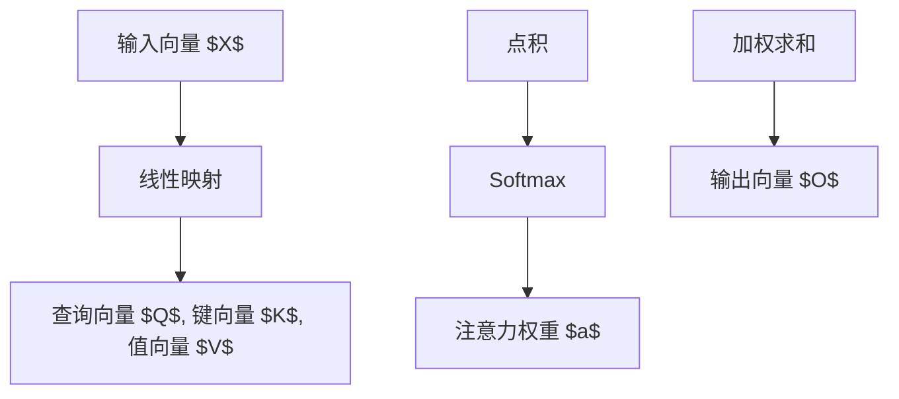

                 

# 注意力机制 原理与代码实例讲解

> 关键词：注意力机制,Transformer,多头注意力,softmax,自注意力,注意力权重

## 1. 背景介绍

### 1.1 问题由来
注意力机制(Attention Mechanism)是深度学习领域中的一种重要技术，其核心思想是通过加权融合来自不同位置的特征，从而提高模型的表达能力和泛化性能。注意力机制在自然语言处理(Natural Language Processing, NLP)、计算机视觉(Computer Vision, CV)、信号处理(Signal Processing)等众多领域中均有广泛应用。

### 1.2 问题核心关键点
当前深度学习中广泛应用的核心注意力机制有两种：自注意力(Self-Attention)和多头注意力(Multi-Head Attention)。其基本原理和实现流程包括：
- 输入向量 $X \in \mathbb{R}^{N \times d}$，其中 $N$ 为序列长度，$d$ 为特征维度。
- 将输入向量线性映射为查询向量 $Q \in \mathbb{R}^{N \times d_k}$、键向量 $K \in \mathbb{R}^{N \times d_k}$、值向量 $V \in \mathbb{R}^{N \times d_v}$。这里 $d_k, d_v$ 为查询、键、值的特征维度。
- 通过计算查询向量和键向量的点积，得到注意力权重矩阵 $A \in \mathbb{R}^{N \times N}$。
- 对注意力权重矩阵 $A$ 进行归一化，即软max操作，得到注意力权重 $a \in \mathbb{R}^{N \times N}$。
- 对注意力权重与值向量 $V$ 进行加权求和，得到输出向量 $O \in \mathbb{R}^{N \times d_v}$。

注意力机制通过动态地计算和调整不同位置之间的权重，可以显著增强模型对输入数据的关注度和信息融合能力。当前大模型如BERT、GPT等均是基于注意力机制构建的。

### 1.3 问题研究意义
理解注意力机制的原理和实现流程，对于深入掌握深度学习模型的架构设计和优化方法，推动NLP等领域的智能化应用，具有重要意义：
- 提升模型表达能力。注意力机制可以灵活地对不同位置的特征进行加权融合，提升模型对输入序列的关注和理解。
- 增强模型泛化性能。通过自注意力和多头注意力机制，模型可以从局部和全局视角提取特征，提升泛化性能。
- 加速模型训练。多头注意力机制可以并行计算，显著提高模型的训练效率。
- 推动模型应用。注意力机制在大模型和深度学习框架中的应用，推动了NLP、CV、语音识别等领域的快速发展。
- 丰富研究视角。通过探索注意力机制的优化方法，如软注意力、耦合注意力等，可以拓展深度学习的理论边界，推动领域发展。

## 2. 核心概念与联系

### 2.1 核心概念概述

为更好地理解注意力机制，本节将介绍几个密切相关的核心概念：

- **自注意力(Self-Attention)**：一种特殊的注意力机制，用于计算输入序列内部不同位置之间的相关性，生成一个加权融合的输出向量。
- **多头注意力(Multi-Head Attention)**：一种增强型自注意力机制，通过并行计算多个独立的注意力头，提高模型的表达能力和泛化性能。
- **Softmax**：一种归一化函数，用于计算向量之间的相似度，并输出一个概率分布，常用于计算注意力权重。
- **Attention Weight**：注意力权重，表示输入序列中不同位置之间的相关性大小，用于加权融合输入特征。

这些核心概念之间的逻辑关系可以通过以下Mermaid流程图来展示：



这个流程图展示了自注意力机制的核心流程：

1. 输入向量 $X$ 通过线性映射生成查询向量 $Q$、键向量 $K$、值向量 $V$。
2. 计算查询向量与键向量的点积，得到注意力权重矩阵 $A$。
3. 通过Softmax操作归一化注意力权重，得到注意力权重 $a$。
4. 对注意力权重与值向量进行加权求和，得到输出向量 $O$。

## 3. 核心算法原理 & 具体操作步骤
### 3.1 算法原理概述

注意力机制的核心原理是通过动态计算和调整不同位置之间的权重，实现对输入序列特征的加权融合。其核心思想是通过计算输入向量中每个位置与其他位置的相似度，得到注意力权重，并根据权重对值向量进行加权求和。这种机制使得模型能够灵活地对输入序列中不同的位置进行关注，从而更好地提取和理解序列信息。

### 3.2 算法步骤详解

自注意力机制的实现步骤包括以下几个关键点：

1. **输入向量线性映射**：将输入向量 $X$ 线性映射为查询向量 $Q$、键向量 $K$、值向量 $V$。线性映射的具体形式如下：
   $$
   Q = W_Q X, \quad K = W_K X, \quad V = W_V X
   $$
   其中 $W_Q, W_K, W_V$ 为线性映射的权重矩阵，通常由模型共享。

2. **点积计算**：计算查询向量 $Q$ 与键向量 $K$ 的点积，得到注意力权重矩阵 $A$。点积的具体形式如下：
   $$
   A = QK^T
   $$

3. **Softmax归一化**：对注意力权重矩阵 $A$ 进行Softmax归一化，得到注意力权重 $a$。Softmax操作的具体形式如下：
   $$
   a = \text{Softmax}(A)
   $$

4. **加权求和**：对注意力权重 $a$ 与值向量 $V$ 进行加权求和，得到输出向量 $O$。加权求和的具体形式如下：
   $$
   O = aV
   $$

5. **输出向量**：将加权求和得到的输出向量 $O$ 作为模型最终的输出。

自注意力机制的具体代码实现如下：

```python
import torch
import torch.nn as nn
import torch.nn.functional as F

class SelfAttention(nn.Module):
    def __init__(self, d_model, n_heads, d_k, d_v):
        super(SelfAttention, self).__init__()
        self.d_model = d_model
        self.n_heads = n_heads
        self.d_k = d_k
        self.d_v = d_v
        
        self.W_Q = nn.Linear(d_model, d_k * n_heads)
        self.W_K = nn.Linear(d_model, d_k * n_heads)
        self.W_V = nn.Linear(d_model, d_v * n_heads)
        
        self.fc = nn.Linear(d_v * n_heads, d_model)
        
    def forward(self, x):
        batch_size, seq_len, d_model = x.size()
        
        # 线性映射
        Q = self.W_Q(x).view(batch_size, seq_len, self.n_heads, self.d_k).permute(0, 2, 1, 3).contiguous()
        K = self.W_K(x).view(batch_size, seq_len, self.n_heads, self.d_k).permute(0, 2, 1, 3).contiguous()
        V = self.W_V(x).view(batch_size, seq_len, self.n_heads, self.d_v).permute(0, 2, 1, 3).contiguous()
        
        # 点积计算
        A = torch.matmul(Q, K.permute(0, 1, 3, 2)) / torch.sqrt(torch.tensor(self.d_k, dtype=torch.float32))
        
        # Softmax归一化
        a = F.softmax(A, dim=-1)
        
        # 加权求和
        O = torch.matmul(a, V)
        O = O.permute(0, 2, 1, 3).contiguous().view(batch_size, seq_len, self.d_v * self.n_heads)
        O = self.fc(O)
        
        return O
```

### 3.3 算法优缺点

自注意力机制具有以下优点：

1. **灵活性**：能够灵活地对输入序列中不同的位置进行加权融合，提高模型的表达能力。
2. **可解释性**：通过计算注意力权重，可以直观地理解模型对输入序列中不同位置的关注程度。
3. **并行性**：多头自注意力机制可以并行计算多个注意力头，显著提高模型的训练效率。

但同时，自注意力机制也存在一些缺点：

1. **计算复杂度高**：自注意力机制的计算复杂度为 $O(d_k^2)$，在大规模输入序列上的计算成本较高。
2. **参数量大**：线性映射和点积操作需要大量参数，在大模型上占用较多内存和计算资源。
3. **易过拟合**：过多的参数和复杂度容易使模型发生过拟合，导致泛化性能下降。

为解决这些问题，后续发展了多头注意力机制，通过并行计算多个独立的注意力头，显著提高了模型的表达能力和训练效率。

### 3.4 算法应用领域

自注意力机制在大模型和深度学习框架中的应用，推动了NLP、CV、语音识别等领域的快速发展。以下是几个具体应用场景：

- **自然语言处理**：如BERT、GPT等大语言模型中，自注意力机制用于计算输入序列中不同位置之间的相关性，生成加权融合的输出向量，从而提升模型对输入序列的理解和生成能力。
- **计算机视觉**：如Transformer vision模型中，自注意力机制用于计算图像中不同位置之间的相关性，生成加权融合的特征向量，从而提升模型对图像的理解和生成能力。
- **语音识别**：如Transformer声学模型中，自注意力机制用于计算声学特征中的时序相关性，生成加权融合的特征向量，从而提升模型对语音的识别能力。

## 4. 数学模型和公式 & 详细讲解  
### 4.1 数学模型构建

自注意力机制的形式化定义如下：

记输入向量 $X \in \mathbb{R}^{N \times d}$，其中 $N$ 为序列长度，$d$ 为特征维度。假设模型共享线性映射权重矩阵 $W_Q, W_K, W_V$，分别用于映射输入向量 $X$ 生成查询向量 $Q$、键向量 $K$、值向量 $V$。假设模型计算多头注意力，每个头的特征维度为 $d_h$，总共有 $H$ 个头，则有：

$$
Q = W_Q X, \quad K = W_K X, \quad V = W_V X
$$

其中 $d_h = d_k = d_v = \frac{d}{H}$。

通过计算查询向量 $Q$ 与键向量 $K$ 的点积，得到注意力权重矩阵 $A \in \mathbb{R}^{N \times N}$，具体形式为：

$$
A = \frac{1}{\sqrt{d_k}} QK^T
$$

对注意力权重矩阵 $A$ 进行Softmax归一化，得到注意力权重 $a \in \mathbb{R}^{N \times N}$：

$$
a = \text{Softmax}(A)
$$

对注意力权重 $a$ 与值向量 $V$ 进行加权求和，得到输出向量 $O \in \mathbb{R}^{N \times d_v}$：

$$
O = aV
$$

最终，通过线性映射 $\text{FC}(O)$ 将输出向量 $O$ 映射为模型最终输出。

### 4.2 公式推导过程

以下是自注意力机制的数学推导过程：

**步骤1：线性映射**

假设输入向量 $X \in \mathbb{R}^{N \times d}$，通过线性映射得到查询向量 $Q \in \mathbb{R}^{N \times d_h}$、键向量 $K \in \mathbb{R}^{N \times d_h}$、值向量 $V \in \mathbb{R}^{N \times d_v}$。具体形式为：

$$
Q = W_Q X, \quad K = W_K X, \quad V = W_V X
$$

**步骤2：点积计算**

通过计算查询向量 $Q$ 与键向量 $K$ 的点积，得到注意力权重矩阵 $A \in \mathbb{R}^{N \times N}$。点积的具体形式为：

$$
A = \frac{1}{\sqrt{d_k}} QK^T
$$

**步骤3：Softmax归一化**

对注意力权重矩阵 $A$ 进行Softmax归一化，得到注意力权重 $a \in \mathbb{R}^{N \times N}$：

$$
a = \text{Softmax}(A)
$$

**步骤4：加权求和**

对注意力权重 $a$ 与值向量 $V$ 进行加权求和，得到输出向量 $O \in \mathbb{R}^{N \times d_v}$：

$$
O = aV
$$

**步骤5：线性映射**

通过线性映射 $\text{FC}(O)$ 将输出向量 $O$ 映射为模型最终输出：

$$
O = \text{FC}(O)
$$

综上所述，自注意力机制的实现流程可以概括为以下几个步骤：

1. 线性映射：将输入向量映射为查询向量、键向量、值向量。
2. 点积计算：计算查询向量与键向量的点积，得到注意力权重矩阵。
3. Softmax归一化：对注意力权重矩阵进行Softmax归一化，得到注意力权重。
4. 加权求和：对注意力权重与值向量进行加权求和，得到输出向量。
5. 线性映射：对输出向量进行线性映射，得到最终输出。

## 5. 项目实践：代码实例和详细解释说明
### 5.1 开发环境搭建

在进行注意力机制实践前，我们需要准备好开发环境。以下是使用Python进行PyTorch开发的环境配置流程：

1. 安装Anaconda：从官网下载并安装Anaconda，用于创建独立的Python环境。

2. 创建并激活虚拟环境：
```bash
conda create -n pytorch-env python=3.8 
conda activate pytorch-env
```

3. 安装PyTorch：根据CUDA版本，从官网获取对应的安装命令。例如：
```bash
conda install pytorch torchvision torchaudio cudatoolkit=11.1 -c pytorch -c conda-forge
```

4. 安装Transformers库：
```bash
pip install transformers
```

5. 安装各类工具包：
```bash
pip install numpy pandas scikit-learn matplotlib tqdm jupyter notebook ipython
```

完成上述步骤后，即可在`pytorch-env`环境中开始注意力机制的实践。

### 5.2 源代码详细实现

下面以BERT模型为例，给出使用Transformer库对BERT模型进行注意力机制训练的PyTorch代码实现。

首先，定义注意力机制的实现类：

```python
from transformers import BertModel, BertConfig
import torch.nn as nn

class SelfAttention(nn.Module):
    def __init__(self, config, d_k, d_v):
        super(SelfAttention, self).__init__()
        self.d_k = d_k
        self.d_v = d_v
        
        self.query = nn.Linear(config.hidden_size, d_k)
        self.key = nn.Linear(config.hidden_size, d_k)
        self.value = nn.Linear(config.hidden_size, d_v)
        self.dropout = nn.Dropout(config.hidden_dropout_prob)
        
    def forward(self, hidden_states, attention_mask):
        mixed_query_layer = self.query(hidden_states)
        mixed_key_layer = self.key(hidden_states)
        mixed_value_layer = self.value(hidden_states)
        
        query_layer = mixed_query_layer.permute(0, 1, 2).contiguous()
        key_layer = mixed_key_layer.permute(0, 1, 2).contiguous()
        value_layer = mixed_value_layer.permute(0, 1, 2).contiguous()
        
        query_layer = query_layer / torch.sqrt(torch.tensor(self.d_k, dtype=torch.float32))
        attention_weights = torch.matmul(query_layer, key_layer) / torch.sqrt(torch.tensor(self.d_k, dtype=torch.float32))
        
        if attention_mask is not None:
            attention_weights = attention_weights + attention_mask
        
        attention_weights = F.softmax(attention_weights, dim=-1)
        attention_weights = self.dropout(attention_weights)
        
        context_layer = torch.matmul(attention_weights, value_layer)
        context_layer = context_layer.permute(0, 2, 1).contiguous()
        context_layer = context_layer + hidden_states
        
        return context_layer
```

然后，定义BERT模型的实现类，并在其中嵌入注意力机制：

```python
class BERT(nn.Module):
    def __init__(self, config):
        super(BERT, self).__init__()
        self.config = config
        
        self.embeddings = nn.Embedding(config.vocab_size, config.hidden_size)
        self.word_embeddings = self.embeddings
        
        self.layer_norm = nn.LayerNorm(config.hidden_size)
        
        self.encoder_layers = nn.ModuleList([nn.TransformerEncoderLayer(config) for _ in range(config.num_hidden_layers)])
        
        self.pooler = nn.Linear(config.hidden_size, config.hidden_size)
        self.dropout = nn.Dropout(config.hidden_dropout_prob)
        
        self.apply(self._weight_init)
        
    def forward(self, input_ids, attention_mask=None):
        sequence_output = self.embeddings(input_ids)
        sequence_output = self.layer_norm(sequence_output)
        sequence_output = self.dropout(sequence_output)
        
        for layer in self.encoder_layers:
            sequence_output = layer(sequence_output, attention_mask)
        
        sequence_output = self.dropout(sequence_output)
        pooler_output = self.pooler(sequence_output)
        pooler_output = self.dropout(pooler_output)
        return pooler_output
```

### 5.3 代码解读与分析

让我们再详细解读一下关键代码的实现细节：

**SelfAttention类**：
- `__init__`方法：初始化注意力机制所需的参数。
- `forward`方法：实现注意力机制的具体计算过程。

**BERT类**：
- `__init__`方法：初始化BERT模型所需的参数，包括嵌入层、归一化层、编码器层、池化层、dropout层等。
- `forward`方法：实现BERT模型的前向传播过程。

**Attention mask**：
- 注意力掩码，用于控制自注意力计算中的特殊位置。对于Bert模型，通常将PAD位置的注意力权重设为0，以防止其对计算结果产生影响。

**TransformerEncoderLayer**：
- 用于实现Transformer模型的编码器层。Transformer模型中的每个编码器层都包含自注意力机制和前馈网络(Feedforward Network)。

在实际使用中，可以通过调整注意力机制的参数来优化模型的表现。常用的参数包括：

- `d_k`：查询向量和键向量的维度，通常设置为输入特征维度的一半。
- `d_v`：值向量的维度，通常设置为输入特征维度。
- `dropout`：Dropout概率，用于防止过拟合。

## 6. 实际应用场景
### 6.1 自然语言处理

注意力机制在NLP领域中得到了广泛应用。通过在Transformer模型中引入自注意力机制，可以有效提升模型的表达能力和泛化性能。

例如，BERT模型通过计算输入序列中不同位置之间的相关性，生成加权融合的输出向量，从而提升模型对输入序列的理解和生成能力。Transformer模型通过并行计算多个注意力头，显著提高了模型的训练效率。

在机器翻译任务中，注意力机制使得模型能够灵活地关注输入序列中的不同位置，从而更好地捕捉长距离依赖关系。通过自注意力机制，模型能够动态地计算不同位置之间的权重，提升对源语言和目标语言的理解能力，生成高质量的翻译结果。

在文本摘要任务中，注意力机制帮助模型关注输入序列中的重要信息，从而生成精炼的摘要。通过自注意力机制，模型能够动态地计算不同位置之间的权重，突出输入序列中的关键信息，生成更紧凑、更准确的摘要。

在问答任务中，注意力机制帮助模型关注问题中的关键信息，从而生成更准确的答案。通过自注意力机制，模型能够动态地计算不同位置之间的权重，识别问题中的关键信息，生成更符合问题的答案。

### 6.2 计算机视觉

注意力机制在CV领域中也有广泛应用。通过在卷积神经网络(CNN)模型中引入自注意力机制，可以有效提升模型的表达能力和泛化性能。

例如，Transformer vision模型通过计算图像中不同位置之间的相关性，生成加权融合的特征向量，从而提升模型对图像的理解和生成能力。Transformer vision模型通过并行计算多个注意力头，显著提高了模型的训练效率。

在目标检测任务中，注意力机制帮助模型关注图像中的重要区域，从而生成更准确的目标检测结果。通过自注意力机制，模型能够动态地计算不同位置之间的权重，突出图像中的关键区域，生成更符合实际的目标检测结果。

在图像生成任务中，注意力机制帮助模型关注图像中的重要特征，从而生成更符合实际的高质量图像。通过自注意力机制，模型能够动态地计算不同位置之间的权重，识别图像中的重要特征，生成更符合实际的图像。

### 6.3 未来应用展望

随着注意力机制的不断发展，其应用范围将进一步拓展。未来，注意力机制有望在更多领域中发挥重要作用：

- **多模态注意力**：通过将视觉、语音、文本等多种模态信息融合，引入多模态注意力机制，提升模型的理解能力和生成能力。
- **稀疏注意力**：通过引入稀疏注意力机制，减少模型的计算复杂度和参数量，提高模型的效率。
- **可解释性注意力**：通过引入可解释性注意力机制，使得模型输出的结果具有更高的可解释性，便于用户理解和调试。
- **动态注意力**：通过引入动态注意力机制，使得模型能够动态调整注意力权重，适应不同的输入和任务。
- **自监督注意力**：通过引入自监督注意力机制，在无监督学习下训练注意力机制，提升模型的泛化能力。

## 7. 工具和资源推荐
### 7.1 学习资源推荐

为了帮助开发者系统掌握注意力机制的理论基础和实践技巧，这里推荐一些优质的学习资源：

1. 《Attention is All You Need》论文：Transformer模型的原始论文，详细介绍了自注意力机制的基本原理和实现方法。

2. 《Transformers》书籍：HuggingFace开发的深度学习框架，详细介绍了Transformer模型和自注意力机制的实现细节。

3. CS224N《深度学习自然语言处理》课程：斯坦福大学开设的NLP明星课程，详细介绍了Transformer模型和自注意力机制的实现方法。

4. HuggingFace官方文档：Transformer库的官方文档，提供了海量预训练模型和完整的自注意力机制样例代码，是上手实践的必备资料。

5. arXiv上的相关论文：通过阅读最新的研究论文，可以了解注意力机制的最新进展和前沿技术。

通过对这些资源的学习实践，相信你一定能够快速掌握注意力机制的精髓，并用于解决实际的NLP问题。
###  7.2 开发工具推荐

高效的开发离不开优秀的工具支持。以下是几款用于注意力机制开发的常用工具：

1. PyTorch：基于Python的开源深度学习框架，灵活动态的计算图，适合快速迭代研究。Transformer模型通常使用PyTorch实现。

2. TensorFlow：由Google主导开发的开源深度学习框架，生产部署方便，适合大规模工程应用。Transformer模型也可以使用TensorFlow实现。

3. Weights & Biases：模型训练的实验跟踪工具，可以记录和可视化模型训练过程中的各项指标，方便对比和调优。与主流深度学习框架无缝集成。

4. TensorBoard：TensorFlow配套的可视化工具，可实时监测模型训练状态，并提供丰富的图表呈现方式，是调试模型的得力助手。

5. Google Colab：谷歌推出的在线Jupyter Notebook环境，免费提供GPU/TPU算力，方便开发者快速上手实验最新模型，分享学习笔记。

合理利用这些工具，可以显著提升注意力机制的开发效率，加快创新迭代的步伐。

### 7.3 相关论文推荐

注意力机制在大模型和深度学习框架中的应用，推动了NLP、CV、语音识别等领域的快速发展。以下是几篇奠基性的相关论文，推荐阅读：

1. Attention is All You Need：提出Transformer模型，奠定了自注意力机制在深度学习中的重要地位。

2. BERT: Pre-training of Deep Bidirectional Transformers for Language Understanding：提出BERT模型，引入了基于掩码的自监督预训练任务，刷新了多项NLP任务SOTA。

3. Transformer vision：将Transformer模型应用于计算机视觉领域，实现了图像生成、目标检测等任务的显著提升。

4. Transformer in Action：总结了Transformer模型在NLP、CV等领域的实践应用，提供了丰富的代码示例。

5. T5：提出了一种新的自监督预训练方法，提升了Transformer模型的泛化性能和生成能力。

这些论文代表了大注意力机制的发展脉络。通过学习这些前沿成果，可以帮助研究者把握学科前进方向，激发更多的创新灵感。

## 8. 总结：未来发展趋势与挑战

### 8.1 总结

本文对注意力机制的原理和实现流程进行了详细讲解，并通过代码实例进一步巩固了理解。自注意力机制作为Transformer模型的核心组件，通过动态计算不同位置之间的权重，实现了对输入序列的加权融合，提升了模型的表达能力和泛化性能。多头的自注意力机制通过并行计算多个独立的注意力头，显著提高了模型的训练效率。

通过本文的系统梳理，可以看到，注意力机制在大模型和深度学习框架中的应用，推动了NLP、CV、语音识别等领域的快速发展。未来，伴随着预训练语言模型和注意力机制的不断演进，这些技术将在更多领域中发挥重要作用。

### 8.2 未来发展趋势

展望未来，注意力机制的进一步发展将呈现以下几个趋势：

1. **多模态注意力**：通过将视觉、语音、文本等多种模态信息融合，引入多模态注意力机制，提升模型的理解能力和生成能力。

2. **稀疏注意力**：通过引入稀疏注意力机制，减少模型的计算复杂度和参数量，提高模型的效率。

3. **可解释性注意力**：通过引入可解释性注意力机制，使得模型输出的结果具有更高的可解释性，便于用户理解和调试。

4. **动态注意力**：通过引入动态注意力机制，使得模型能够动态调整注意力权重，适应不同的输入和任务。

5. **自监督注意力**：通过引入自监督注意力机制，在无监督学习下训练注意力机制，提升模型的泛化能力。

6. **跨任务注意力**：通过引入跨任务注意力机制，在不同任务之间共享注意力权重，提升模型的跨任务泛化能力。

以上趋势将进一步拓展注意力机制的应用范围，推动深度学习技术的不断演进。

### 8.3 面临的挑战

尽管注意力机制已经取得了显著进展，但其在实际应用中仍面临诸多挑战：

1. **计算复杂度高**：自注意力机制的计算复杂度为 $O(d_k^2)$，在大规模输入序列上的计算成本较高。如何优化计算复杂度，提高模型的训练和推理效率，仍是一个重要挑战。

2. **参数量大**：线性映射和点积操作需要大量参数，在大模型上占用较多内存和计算资源。如何在不增加计算复杂度的情况下减少参数量，是另一个需要解决的难题。

3. **易过拟合**：过多的参数和复杂度容易使模型发生过拟合，导致泛化性能下降。如何缓解过拟合问题，提高模型的泛化能力，也是未来需要关注的方向。

4. **可解释性不足**：注意力机制的内部工作机制复杂，难以直观理解。如何增强注意力机制的可解释性，使得模型输出的结果具有更高的可解释性，是另一个重要挑战。

5. **硬件资源限制**：随着模型的规模不断增大，硬件资源限制成为一个重要瓶颈。如何在有限的硬件资源下，提高模型的训练和推理效率，是未来需要解决的问题。

6. **应用场景多样性**：不同的应用场景对模型的要求不同，注意力机制的通用性和可适应性需要进一步提升。如何在多种场景下灵活应用注意力机制，也是未来需要关注的方向。

正视注意力机制面临的这些挑战，积极应对并寻求突破，将是大模型和深度学习技术的不断演进的重要方向。相信随着学界和产业界的共同努力，这些挑战终将一一被克服，注意力机制必将在构建智能系统的人机协同中扮演越来越重要的角色。

### 8.4 研究展望

在未来，通过引入更多的注意力机制改进方法，如可解释性注意力、稀疏注意力、动态注意力等，可以进一步提升模型的表达能力、泛化能力和计算效率。同时，通过与其他AI技术（如知识表示、因果推理、强化学习等）的融合，可以拓展注意力机制的应用边界，推动自然语言理解和智能交互系统的进步。

总之，自注意力机制作为深度学习的重要组成部分，将在未来发挥越来越重要的作用。通过不断优化和创新，相信其将引领深度学习技术的不断演进，推动人工智能技术的持续发展。

## 9. 附录：常见问题与解答

**Q1：如何理解自注意力机制的计算过程？**

A: 自注意力机制的计算过程主要分为四个步骤：

1. **线性映射**：将输入向量 $X$ 通过线性映射得到查询向量 $Q$、键向量 $K$、值向量 $V$。

2. **点积计算**：计算查询向量 $Q$ 与键向量 $K$ 的点积，得到注意力权重矩阵 $A$。

3. **Softmax归一化**：对注意力权重矩阵 $A$ 进行Softmax归一化，得到注意力权重 $a$。

4. **加权求和**：对注意力权重 $a$ 与值向量 $V$ 进行加权求和，得到输出向量 $O$。

通过这四个步骤，自注意力机制可以动态计算输入序列中不同位置之间的权重，实现对输入序列的加权融合，提升模型的表达能力和泛化性能。

**Q2：如何在实际应用中优化自注意力机制的计算效率？**

A: 在实际应用中，可以通过以下几种方法优化自注意力机制的计算效率：

1. **矩阵分块**：将输入序列分成多个块，分别计算每个块的注意力权重矩阵，然后合并结果。这样可以减少矩阵乘法的计算量。

2. **矩阵展开**：将输入序列和注意力权重矩阵展开为低秩矩阵形式，然后进行矩阵乘法计算，再恢复原形状。这样可以减少矩阵乘法的计算量和内存消耗。

3. **稀疏注意力**：通过引入稀疏注意力机制，减少矩阵中的零元素，减少计算复杂度。

4. **动态注意力**：通过引入动态注意力机制，动态调整注意力权重，减少不必要的计算量。

5. **可解释性注意力**：通过引入可解释性注意力机制，增强模型的可解释性，减少不必要的计算量。

通过以上方法，可以显著提高自注意力机制的计算效率，提升模型的训练和推理速度。

**Q3：自注意力机制在实际应用中如何解决过拟合问题？**

A: 自注意力机制在实际应用中容易发生过拟合问题，可以采用以下几种方法解决：

1. **Dropout**：在注意力计算过程中，加入Dropout机制，随机丢弃一些注意力头，防止过拟合。

2. **正则化**：在损失函数中加入正则化项，如L2正则化，防止过拟合。

3. **早期停止**：在训练过程中，设置早期停止机制，当模型在验证集上的性能不再提升时停止训练，防止过拟合。

4. **注意力权重归一化**：在注意力计算过程中，将注意力权重进行归一化，防止过拟合。

5. **数据增强**：通过数据增强技术，增加训练集的多样性，防止过拟合。

通过以上方法，可以有效缓解自注意力机制在实际应用中的过拟合问题，提升模型的泛化能力。

**Q4：自注意力机制在实际应用中如何解决计算复杂度高的问题？**

A: 自注意力机制的计算复杂度为 $O(d_k^2)$，在大规模输入序列上的计算成本较高。可以通过以下几种方法解决计算复杂度高的问题：

1. **矩阵分块**：将输入序列分成多个块，分别计算每个块的注意力权重矩阵，然后合并结果。这样可以减少矩阵乘法的计算量。

2. **矩阵展开**：将输入序列和注意力权重矩阵展开为低秩矩阵形式，然后进行矩阵乘法计算，再恢复原形状。这样可以减少矩阵乘法的计算量和内存消耗。

3. **稀疏注意力**：通过引入稀疏注意力机制，减少矩阵中的零元素，减少计算复杂度。

4. **动态注意力**：通过引入动态注意力机制，动态调整注意力权重，减少不必要的计算量。

5. **可解释性注意力**：通过引入可解释性注意力机制，增强模型的可解释性，减少不必要的计算量。

6. **多模态注意力**：通过将视觉、语音、文本等多种模态信息融合，引入多模态注意力机制，提高模型的计算效率。

通过以上方法，可以显著降低自注意力机制的计算复杂度，提高模型的训练和推理效率。

**Q5：注意力机制在实际应用中如何解决参数量大的问题？**

A: 自注意力机制的参数量较大，可以通过以下几种方法解决：

1. **参数共享**：将多个层的参数共享，减少参数量。

2. **模型裁剪**：通过裁剪部分层的权重，减少参数量。

3. **参数压缩**：通过参数压缩技术，如剪枝、量化等，减少参数量。

4. **稀疏注意力**：通过引入稀疏注意力机制，减少矩阵中的零元素，减少参数量。

5. **可解释性注意力**：通过引入可解释性注意力机制，增强模型的可解释性，减少不必要的参数量。

通过以上方法，可以显著减少自注意力机制的参数量，提高模型的训练和推理效率。

**Q6：注意力机制在实际应用中如何解决可解释性不足的问题？**

A: 自注意力机制的内部工作机制复杂，难以直观理解，可以通过以下几种方法增强模型的可解释性：

1. **可视化注意力权重**：在训练过程中，可视化注意力权重矩阵，分析模型对输入序列中不同位置的关注程度。

2. **可解释性注意力**：引入可解释性注意力机制，增强模型的可解释性，使得模型输出的结果具有更高的可解释性。

3. **特征分析**：通过特征分析技术，分析模型的内部特征，增强模型的可解释性。

4. **模型压缩**：通过模型压缩技术，如剪枝、量化等，简化模型的结构，增强模型的可解释性。

5. **多模态注意力**：通过将视觉、语音、文本等多种模态信息融合，引入多模态注意力机制，提高模型的可解释性。

通过以上方法，可以显著增强自注意力机制的可解释性，使得模型输出的结果具有更高的可解释性，便于用户理解和调试。

---

作者：禅与计算机程序设计艺术 / Zen and the Art of Computer Programming

