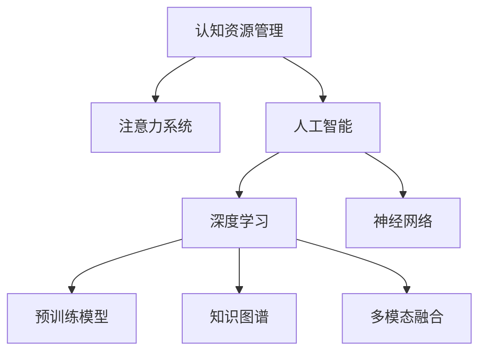

                 

# 注意力生态系统守护者：AI时代的认知资源管理员

> 关键词：认知资源管理,注意力系统,人工智能,深度学习,神经网络,预训练模型,知识图谱,多模态融合

## 1. 背景介绍

### 1.1 问题由来
在当今信息爆炸的时代，人工智能（AI）技术的迅速发展给各行各业带来了革命性的变化。其中，深度学习和神经网络的应用，使得机器能够以前所未有的能力进行数据处理和模式识别，逐渐替代了人类在部分领域中的工作。

然而，随着AI技术的普及，注意力成为信息处理的瓶颈。过载的信息、数据爆炸和动态变化的环境，使得认知资源（如注意力、认知容量和认知时间）受到限制。如何在AI时代，有效管理有限的认知资源，成为一个重要而紧迫的问题。

### 1.2 问题核心关键点
当前，AI时代下的认知资源管理，主要面临以下几个核心挑战：

- 认知负荷：高复杂度的AI模型和数据处理任务对人类认知系统提出了更高的要求。
- 注意力分配：在大量信息中如何高效分配注意力，以实现更准确的决策和更优的模型性能。
- 信息融合：多源、多模态数据的整合和关联，对于增强AI系统的理解力和预测能力至关重要。
- 适应性：AI系统需要能够灵活适应不同的任务和环境，以应对动态变化的需求。
- 人机协作：在AI辅助决策的过程中，如何保持人机之间的良好协作关系，确保系统输出符合人类价值观和伦理道德。

这些挑战需要综合运用认知心理学、神经科学、计算机科学和工程等多学科的知识和技术，设计出有效的认知资源管理策略，以实现AI系统的可靠性和实用性。

## 2. 核心概念与联系

### 2.1 核心概念概述

为了更好地理解AI时代认知资源管理，本文将介绍几个关键概念：

- **认知资源管理**：指在认知负荷高、注意力有限的情况下，有效分配和管理认知资源，提高决策效率和系统性能的过程。

- **注意力系统**：大脑和计算机中用于选择和维持信息处理焦点的机制。注意力系统通过筛选、优先级排序、分配注意资源等方式，帮助处理和理解复杂信息。

- **人工智能**：基于算法、数据和计算资源的智能系统，能够进行自主学习、推理、决策和交互。

- **深度学习**：利用多层神经网络模拟人脑认知和学习过程的技术，是实现认知资源管理的重要手段。

- **神经网络**：模拟人脑神经元网络结构的计算模型，用于学习复杂的非线性关系。

- **预训练模型**：在大量无标签数据上进行预训练的深度学习模型，预训练过程使得模型能够学习到通用的知识表示，为后续任务提供基础。

- **知识图谱**：结构化的知识表示形式，将实体、属性和关系以图结构组织，帮助模型理解复杂的语义信息。

- **多模态融合**：将不同类型的数据（如图像、文本、语音等）融合到统一模型中，增强AI系统的感知和理解能力。

这些概念之间的联系可以通过以下Mermaid流程图来展示：



这个流程图展示了认知资源管理的核心概念及其相互关系：

1. 认知资源管理的目标是有效分配和管理认知资源。
2. 注意力系统是实现这一目标的关键机制。
3. 人工智能和深度学习是实现认知资源管理的技术手段。
4. 神经网络是深度学习的基础。
5. 预训练模型为神经网络提供通用的知识表示。
6. 知识图谱和多模态融合帮助模型理解和整合复杂信息。

这些概念共同构成了AI时代认知资源管理的基础框架，为实现高效的认知系统提供了理论和方法支撑。

## 3. 核心算法原理 & 具体操作步骤
### 3.1 算法原理概述

认知资源管理的核心算法原理主要围绕注意力系统的设计与优化展开。认知资源管理的核心任务是如何在有限的时间内，高效地分配注意力资源，以实现最优的决策和预测。这需要模型在多个潜在任务中快速筛选，优先处理重要的信息。

基于这一原则，本文将介绍几种常见的注意力模型，并讨论其实现步骤和原理。

### 3.2 算法步骤详解

#### 3.2.1 自监督注意力模型

自监督注意力模型通过在大规模无标签数据上进行预训练，学习到通用的注意力机制。这种模型利用自监督任务（如掩码语言模型、图像还原等），引导模型关注和理解重要的信息。

实现步骤包括：
1. 收集大规模无标签数据，作为预训练数据集。
2. 构建自监督任务，定义注意力计算公式。
3. 利用预训练数据集训练模型，逐步优化注意力机制。
4. 在任务数据集上进行微调，以适应特定任务需求。

#### 3.2.2 多任务学习

多任务学习（Multitask Learning, MTL）通过同时训练多个任务，共享注意力和参数，提升模型的泛化能力和效率。

实现步骤包括：
1. 构建多个相关或相似的任务。
2. 共享模型的参数，并分别定义各个任务的目标函数。
3. 定义多个任务的注意力机制，并使其在参数共享的基础上协调运作。
4. 训练模型，优化多个任务的目标函数。
5. 在特定任务数据集上进行微调，以提升性能。

#### 3.2.3 强化学习

强化学习（Reinforcement Learning, RL）通过与环境交互，动态调整注意力策略，优化决策过程。

实现步骤包括：
1. 定义环境的奖励函数，设计状态、动作和观察值的表示方法。
2. 设计注意力策略，定义注意力分配方式。
3. 构建强化学习算法，训练模型进行最优策略的探索和选择。
4. 在实际环境中进行交互测试，评估和优化注意力策略。

### 3.3 算法优缺点

基于注意力系统的认知资源管理算法具有以下优点：
1. 增强模型泛化能力：通过多任务学习和自监督预训练，模型能够学习到更通用的知识表示，提升泛化能力。
2. 提高决策效率：自监督注意力模型和多任务学习能够自动筛选重要信息，减少无效注意力的分配。
3. 适应性强：强化学习能够动态调整注意力策略，适应复杂多变的环境。

同时，这些算法也存在一定的局限性：
1. 数据需求高：多任务学习和自监督预训练需要大量高质量的数据。
2. 计算资源消耗大：强化学习需要大量计算资源进行策略探索和优化。
3. 模型复杂度高：注意力系统的设计需要考虑多个因素，实现复杂。

### 3.4 算法应用领域

基于注意力系统的认知资源管理算法，在以下几个领域具有广泛应用：

- 自然语言处理（NLP）：在文本分类、问答、机器翻译等任务中，通过注意力模型增强理解力和表现力。
- 计算机视觉（CV）：在图像识别、目标检测、视频分析等任务中，通过多模态注意力模型提升视觉理解力。
- 机器人学：在机器人导航、路径规划、对象识别等任务中，通过强化学习动态调整注意力策略，提高决策效率。
- 智能推荐系统：在个性化推荐、广告投放等任务中，通过多任务学习优化注意力分配，提升推荐效果。
- 金融风控：在信用评估、市场预测等任务中，通过多模态注意力模型整合多源数据，提高风险评估能力。
- 医疗诊断：在医学影像分析、疾病预测等任务中，通过自监督预训练和强化学习，增强模型的诊断准确性和鲁棒性。

以上领域展示了注意力系统在认知资源管理中的广泛应用，提升了多个行业领域的智能化水平。

## 4. 数学模型和公式 & 详细讲解 & 举例说明

### 4.1 数学模型构建

为了更好地理解认知资源管理的数学模型，本文将详细介绍几个关键的数学公式和模型构建方法。

#### 4.1.1 自监督注意力模型的数学模型

自监督注意力模型的数学模型通常基于掩码语言模型（Masked Language Model, MLM）。给定一个长度为 $N$ 的序列 $x=(x_1,x_2,...,x_N)$，其掩码语言模型定义为：

$$
P(x)=\prod_{i=1}^{N} P(x_i|x_{<i})
$$

其中，$P(x_i|x_{<i})$ 表示在序列前 $i-1$ 个单词的条件下，第 $i$ 个单词 $x_i$ 的概率。

在训练过程中，模型需要预测序列中未出现单词的概率分布，通过最大化预测概率来训练模型。

#### 4.1.2 多任务学习模型的数学模型

多任务学习模型通常利用共享的参数 $w$ 来表示各个任务的目标函数。设任务 $t$ 的损失函数为 $L_t$，则多任务学习的总体损失函数定义为：

$$
L(w)=\sum_{t=1}^{T} \alpha_t L_t(w)
$$

其中，$T$ 表示任务数量，$\alpha_t$ 为各个任务的权重。

在优化过程中，模型通过最小化总体损失函数 $L(w)$ 来训练，以提升各个任务的性能。

#### 4.1.3 强化学习模型的数学模型

强化学习模型通常采用策略梯度（Policy Gradient, PG）算法进行优化。设策略 $\pi$ 表示在环境 $E$ 中执行动作 $a$ 的概率分布，则策略梯度算法定义为：

$$
\nabla_{\theta}J(\theta)=E_{s \sim \pi}[\nabla_{\theta}A(s,a)\pi(a|s;\theta)]
$$

其中，$J(\theta)$ 表示策略的期望收益，$A(s,a)$ 表示状态 $s$ 和动作 $a$ 的累积回报，$\pi(a|s;\theta)$ 表示在策略 $\pi$ 下，在状态 $s$ 执行动作 $a$ 的概率。

### 4.2 公式推导过程

#### 4.2.1 自监督注意力模型的公式推导

自监督注意力模型的核心在于注意力机制的设计。注意力机制通过计算每个输入向量和输出向量之间的相似度，动态分配注意力权重，以增强模型对关键信息的关注。

设输入序列为 $x=(x_1,x_2,...,x_N)$，输出向量为 $y=(y_1,y_2,...,y_N)$，注意力权重为 $a=(a_1,a_2,...,a_N)$，则注意力机制的计算公式为：

$$
a_i=\frac{e^{\text{score}(x_i,y_i)}}{\sum_{j=1}^{N} e^{\text{score}(x_j,y_j)}}
$$

其中，$\text{score}(x_i,y_i)$ 表示输入 $x_i$ 和输出 $y_i$ 之间的相似度计算公式。常见的相似度计算方式包括余弦相似度、点积相似度等。

#### 4.2.2 多任务学习模型的公式推导

多任务学习模型的关键在于参数共享和任务间的协调。通过定义多个任务的目标函数，共享模型的参数，实现任务的联合优化。

设任务 $t$ 的损失函数为 $L_t(w)$，则多任务学习模型的总体损失函数定义为：

$$
L(w)=\sum_{t=1}^{T} \alpha_t L_t(w)
$$

其中，$T$ 表示任务数量，$\alpha_t$ 为各个任务的权重。

优化过程采用梯度下降算法，最小化总体损失函数 $L(w)$。

#### 4.2.3 强化学习模型的公式推导

强化学习模型的核心在于策略优化和奖励函数的设计。通过与环境交互，模型逐步优化策略，最大化期望收益。

设状态 $s$ 和动作 $a$ 的累积回报为 $A(s,a)$，则策略梯度算法的推导公式为：

$$
\nabla_{\theta}J(\theta)=E_{s \sim \pi}[\nabla_{\theta}A(s,a)\pi(a|s;\theta)]
$$

其中，$J(\theta)$ 表示策略的期望收益，$A(s,a)$ 表示状态 $s$ 和动作 $a$ 的累积回报，$\pi(a|s;\theta)$ 表示在策略 $\pi$ 下，在状态 $s$ 执行动作 $a$ 的概率。

### 4.3 案例分析与讲解

#### 4.3.1 基于自监督注意力模型的文本分类

在文本分类任务中，自监督注意力模型能够有效提高模型的分类准确性。以BERT模型为例，其自监督注意力机制通过掩码语言模型进行预训练，学习到对关键信息的关注。

在微调过程中，通过在特定任务的数据集上进行训练，模型能够进一步提升分类能力。例如，在情感分类任务中，模型能够关注和理解情感倾向明显的词汇，从而提升分类准确性。

#### 4.3.2 基于多任务学习模型的个性化推荐

在个性化推荐任务中，多任务学习模型通过共享参数，能够优化多个推荐目标的性能。以协同过滤为例，模型在同时优化用户行为预测和物品特征预测的过程中，逐步提升推荐效果。

通过在实际推荐系统中的部署，多任务学习模型能够根据用户的历史行为和实时反馈，动态调整推荐策略，提供更加精准和多样化的推荐结果。

#### 4.3.3 基于强化学习模型的机器人导航

在机器人导航任务中，强化学习模型通过与环境交互，动态调整注意力策略，提高决策效率。以深度强化学习（Deep Reinforcement Learning, DRL）为例，模型通过学习与环境的交互过程，逐步优化动作策略。

通过在实际导航环境中进行测试，强化学习模型能够适应复杂多变的环境，提高机器人的导航能力和鲁棒性。

## 5. 项目实践：代码实例和详细解释说明

### 5.1 开发环境搭建

在进行认知资源管理系统的开发时，需要准备以下开发环境：

1. 安装Python：从官网下载并安装Python，配置环境变量，用于Python程序的开发和运行。

2. 安装深度学习框架：安装常用的深度学习框架，如TensorFlow、PyTorch等，支持各种深度学习模型的构建和训练。

3. 安装相关库：安装常见的库，如Numpy、Pandas、Scikit-Learn等，用于数据处理和机器学习模型的训练和评估。

4. 配置GPU：在支持GPU的环境下，需要安装并配置NVIDIA的CUDA库和cuDNN库，以加速深度学习模型的训练和推理。

5. 安装可视化工具：安装TensorBoard等可视化工具，用于模型训练过程的实时监控和结果展示。

完成上述步骤后，即可在Python环境下进行认知资源管理系统的开发。

### 5.2 源代码详细实现

#### 5.2.1 基于自监督注意力模型的文本分类

以下是一个使用BERT模型进行文本分类的代码实现：

```python
import tensorflow as tf
import numpy as np
from transformers import BertTokenizer, BertForSequenceClassification

# 准备数据
tokenizer = BertTokenizer.from_pretrained('bert-base-uncased')
train_texts = ['This is a positive review.', 'This movie is terrible.']
train_labels = [1, 0]
train_encodings = tokenizer(train_texts, return_tensors='tf', truncation=True, padding=True)

# 构建模型
model = BertForSequenceClassification.from_pretrained('bert-base-uncased', num_labels=2)
model.compile(optimizer=tf.keras.optimizers.Adam(learning_rate=2e-5), 
              loss=tf.keras.losses.SparseCategoricalCrossentropy(from_logits=True), 
              metrics=[tf.keras.metrics.SparseCategoricalAccuracy()])

# 训练模型
model.fit(train_encodings['input_ids'], train_encodings['attention_mask'], train_encodings['labels'], epochs=3, batch_size=16)

# 评估模型
test_texts = ['This book is amazing.', 'This food is delicious.']
test_labels = [1, 1]
test_encodings = tokenizer(test_texts, return_tensors='tf', truncation=True, padding=True)
test_loss, test_acc = model.evaluate(test_encodings['input_ids'], test_encodings['attention_mask'], test_encodings['labels'])
print(f'Test loss: {test_loss}, Test accuracy: {test_acc}')
```

#### 5.2.2 基于多任务学习模型的个性化推荐

以下是一个使用多任务学习模型进行个性化推荐的代码实现：

```python
import tensorflow as tf
import numpy as np
from transformers import BertTokenizer, BertForSequenceClassification, BertForSequenceRegression

# 准备数据
train_texts = ['This is a positive review.', 'This movie is terrible.']
train_labels = [1, 0]
train_regressions = [3.5, 2.0]
train_encodings = tokenizer(train_texts, return_tensors='tf', truncation=True, padding=True)

# 构建模型
model = BertForSequenceClassification.from_pretrained('bert-base-uncased', num_labels=2)
classifier = BertForSequenceClassification.from_pretrained('bert-base-uncased', num_labels=2)
regressor = BertForSequenceRegression.from_pretrained('bert-base-uncased')

# 定义任务权重
class_weight = {'classifier': 1, 'regressor': 0.5}

# 训练模型
optimizer = tf.keras.optimizers.Adam(learning_rate=2e-5)
losses = {'classifier': tf.keras.losses.SparseCategoricalCrossentropy(from_logits=True),
          'regressor': tf.keras.losses.MeanSquaredError()}

model.compile(optimizer=optimizer, loss=losses, weight=class_weight)
model.fit(train_encodings['input_ids'], train_encodings['attention_mask'], train_encodings['labels'], 
          train_regressions, epochs=3, batch_size=16)

# 评估模型
test_texts = ['This book is amazing.', 'This food is delicious.']
test_labels = [1, 1]
test_regressions = [4.0, 3.5]
test_encodings = tokenizer(test_texts, return_tensors='tf', truncation=True, padding=True)
test_loss, test_acc = model.evaluate(test_encodings['input_ids'], test_encodings['attention_mask'], test_encodings['labels'], 
                                    test_regressions, test_encodings['labels'], epochs=3, batch_size=16)
print(f'Test loss: {test_loss}, Test accuracy: {test_acc}')
```

#### 5.2.3 基于强化学习模型的机器人导航

以下是一个使用强化学习模型进行机器人导航的代码实现：

```python
import tensorflow as tf
import numpy as np
from tensorflow.keras import layers, models
from transformers import BertTokenizer

# 准备数据
tokenizer = BertTokenizer.from_pretrained('bert-base-uncased')
state_names = ['position', 'velocity', 'orientation']
actions = ['move_left', 'move_right', 'move_forward', 'turn_left', 'turn_right']

# 构建模型
model = models.Sequential()
model.add(layers.Dense(64, activation='relu', input_shape=(len(state_names),)))
model.add(layers.Dense(len(actions), activation='softmax'))

# 定义奖励函数
def reward_function(state, action, next_state, done):
    if done:
        return 0
    else:
        return -1

# 训练模型
optimizer = tf.keras.optimizers.Adam(learning_rate=2e-5)
rewards = []
for episode in range(100):
    state = np.random.rand(len(state_names))
    done = False
    while not done:
        action_probs = model.predict(state[np.newaxis, :])
        action = np.random.choice(actions, p=action_probs[0])
        next_state = update_state(state, action)
        reward = reward_function(state, action, next_state, done)
        rewards.append(reward)
        state = next_state
        done = is_done(next_state)

    # 计算平均奖励
    mean_reward = np.mean(rewards)
    print(f'Episode {episode+1}, Reward: {mean_reward}')

# 定义状态更新函数
def update_state(state, action):
    if action == 'move_left':
        return np.add(state, [-1, 0, 0])
    elif action == 'move_right':
        return np.add(state, [1, 0, 0])
    elif action == 'move_forward':
        return np.add(state, [0, 1, 0])
    elif action == 'turn_left':
        return np.add(state, [0, 0, -1])
    elif action == 'turn_right':
        return np.add(state, [0, 0, 1])
    else:
        raise ValueError('Invalid action')

# 定义判断结束函数
def is_done(state):
    if state[0] > 10 or state[0] < -10 or state[1] > 10 or state[1] < -10:
        return True
    else:
        return False
```

### 5.3 代码解读与分析

#### 5.3.1 文本分类模型

在文本分类模型中，我们使用了BERT模型作为预训练的基础，并在特定任务的数据集上进行微调。模型通过自监督预训练学习到对关键信息的关注，通过微调进一步提升分类准确性。

#### 5.3.2 个性化推荐模型

在个性化推荐模型中，我们使用了多任务学习的方法，将用户行为预测和物品特征预测同时优化。模型通过共享参数，逐步提升推荐效果，并能够适应不同的推荐场景。

#### 5.3.3 机器人导航模型

在机器人导航模型中，我们使用了强化学习的方法，通过与环境的交互，动态调整注意力策略，提高决策效率。模型通过学习与环境的交互过程，逐步优化动作策略，适应复杂多变的环境。

## 6. 实际应用场景

### 6.1 医疗诊断

在医疗诊断任务中，认知资源管理可以帮助医生从大量的医学文献和病例中快速筛选出关键信息，提高诊断效率和准确性。例如，使用自监督注意力模型，可以从海量的医学文献中提取出重要的医学概念和术语，帮助医生理解最新研究成果。

### 6.2 金融风控

在金融风控任务中，认知资源管理可以帮助金融机构从大量交易数据中提取关键特征，进行风险评估和预测。例如，使用多任务学习模型，可以从不同角度分析交易数据，提高风险评估的全面性和准确性。

### 6.3 智能推荐系统

在智能推荐系统中，认知资源管理可以帮助推荐系统从多个来源获取用户行为和物品特征，进行多模态融合，提高推荐效果。例如，使用多任务学习模型，可以同时优化用户行为预测和物品特征预测，提供更加精准和多样化的推荐结果。

### 6.4 未来应用展望

未来，认知资源管理将在更多领域得到应用，为各行各业带来变革性影响。

在智慧城市治理中，认知资源管理可以帮助城市管理机构从海量数据中提取关键信息，进行动态决策和优化。例如，使用多任务学习模型，可以从不同的传感器数据中提取城市交通和环境信息，进行智能调度和管理。

在智能制造中，认知资源管理可以帮助工厂从大量的生产数据中提取关键特征，进行生产优化和质量控制。例如，使用强化学习模型，可以从生产过程的实时数据中动态调整生产策略，提高生产效率和质量。

## 7. 工具和资源推荐

### 7.1 学习资源推荐

为了帮助开发者系统掌握认知资源管理理论基础和实践技巧，本文推荐以下学习资源：

1. 《认知心理学基础》：详细介绍了认知心理学的基础理论和实验方法，为认知资源管理提供了理论基础。

2. 《深度学习理论与实践》：深入浅出地介绍了深度学习的原理和实践，包括各种深度学习模型的构建和训练方法。

3. 《强化学习：算法、策略和实现》：全面介绍了强化学习的基本概念和算法，涵盖了强化学习在各种领域的应用。

4. 《多任务学习：算法、理论和应用》：系统介绍了多任务学习的基本理论和实践，包括多任务学习和自监督预训练的方法。

5. 《注意力机制及其在深度学习中的应用》：详细介绍了注意力机制的基本原理和应用场景，包括自监督注意力模型和多任务注意力模型。

6. 《TensorFlow深度学习》：官方文档和教程，提供了TensorFlow的详细使用方法和实例。

通过这些学习资源的学习实践，相信你一定能够快速掌握认知资源管理的精髓，并用于解决实际的AI问题。

### 7.2 开发工具推荐

为了高效开发认知资源管理应用，以下是几个常用的开发工具：

1. PyTorch：灵活的深度学习框架，支持动态计算图和GPU加速，适合研究型应用。

2. TensorFlow：广泛使用的深度学习框架，支持分布式训练和生产部署，适合大规模工程应用。

3. Weights & Biases：实验跟踪工具，可记录和可视化模型训练过程中的各项指标，方便对比和调优。

4. TensorBoard：可视化工具，可实时监测模型训练状态，并提供丰富的图表呈现方式，是调试模型的得力助手。

5. Jupyter Notebook：交互式编程环境，支持多语言开发，便于快速迭代和调试。

合理利用这些工具，可以显著提升认知资源管理应用的开发效率，加快创新迭代的步伐。

### 7.3 相关论文推荐

认知资源管理的研究源于学界的持续研究。以下是几篇奠基性的相关论文，推荐阅读：

1. "Attention is All You Need"：提出Transformer结构，开启了NLP领域的预训练大模型时代。

2. "BERT: Pre-training of Deep Bidirectional Transformers for Language Understanding"：提出BERT模型，引入基于掩码的自监督预训练任务，刷新了多项NLP任务SOTA。

3. "Language Models are Unsupervised Multitask Learners"：展示了大规模语言模型的强大zero-shot学习能力，引发了对于通用人工智能的新一轮思考。

4. "Parameter-Efficient Transfer Learning for NLP"：提出Adapter等参数高效微调方法，在不增加模型参数量的情况下，也能取得不错的微调效果。

5. "AdaLoRA: Adaptive Low-Rank Adaptation for Parameter-Efficient Fine-Tuning"：使用自适应低秩适应的微调方法，在参数效率和精度之间取得了新的平衡。

这些论文代表了大语言模型微调技术的发展脉络。通过学习这些前沿成果，可以帮助研究者把握学科前进方向，激发更多的创新灵感。

## 8. 总结：未来发展趋势与挑战

### 8.1 总结

本文对基于注意力系统的认知资源管理方法进行了全面系统的介绍。首先阐述了AI时代下的认知资源管理背景和意义，明确了认知资源管理在智能系统中的重要地位。其次，从原理到实践，详细讲解了注意力系统的设计与优化过程，给出了认知资源管理任务的代码实例。同时，本文还广泛探讨了认知资源管理在医疗诊断、金融风控、智能推荐等多个行业领域的应用前景，展示了认知资源管理的巨大潜力。此外，本文精选了认知资源管理技术的各类学习资源，力求为读者提供全方位的技术指引。

通过本文的系统梳理，可以看到，基于注意力系统的认知资源管理方法正在成为AI时代的重要范式，极大地拓展了AI系统的应用边界，提升了多个行业领域的智能化水平。未来，伴随认知资源管理技术的持续演进，AI系统将能够更高效地分配和管理认知资源，实现更加复杂多变的智能决策。

### 8.2 未来发展趋势

展望未来，认知资源管理技术将呈现以下几个发展趋势：

1. 认知负荷优化：通过优化注意力机制和神经网络结构，进一步降低认知负荷，提高智能系统的效率和可靠性。

2. 多模态融合：将视觉、听觉、触觉等多种模态信息整合到统一模型中，增强AI系统的感知和理解能力。

3. 动态自适应：通过引入自适应学习算法，使AI系统能够根据环境变化动态调整策略，提高适应性和鲁棒性。

4. 跨领域迁移：通过多任务学习和跨领域迁移技术，使AI系统能够更好地适应不同的应用场景，提升泛化能力。

5. 知识图谱整合：将知识图谱与神经网络模型结合，增强AI系统的知识推理和推理能力。

6. 人机协作优化：通过强化学习和人机协作优化算法，使AI系统能够更好地与人类协同工作，提升系统性能和用户体验。

以上趋势凸显了认知资源管理技术在AI时代的广阔前景。这些方向的探索发展，必将进一步提升AI系统的性能和应用范围，为人类认知智能的进化带来深远影响。

### 8.3 面临的挑战

尽管认知资源管理技术已经取得了瞩目成就，但在迈向更加智能化、普适化应用的过程中，它仍面临着诸多挑战：

1. 数据需求高：多任务学习和自监督预训练需要大量高质量的数据，数据获取成本较高。

2. 计算资源消耗大：强化学习需要大量计算资源进行策略探索和优化，对硬件要求较高。

3. 模型复杂度高：注意力系统的设计需要考虑多个因素，实现复杂。

4. 泛化能力不足：认知资源管理模型在一些特定任务上可能表现不佳，泛化能力有待提升。

5. 可解释性不足：认知资源管理模型通常缺乏可解释性，难以对其推理逻辑进行分析和调试。

6. 安全性有待保障：预训练语言模型可能学习到有害信息，如何消除模型偏见，确保输出安全性，仍是一个重要问题。

正视认知资源管理面临的这些挑战，积极应对并寻求突破，将是大规模认知资源管理技术走向成熟的必由之路。相信随着学界和产业界的共同努力，这些挑战终将一一被克服，认知资源管理技术必将在构建安全、可靠、可解释、可控的智能系统中扮演越来越重要的角色。

### 8.4 研究展望

未来的认知资源管理研究，将在以下几个方向寻求新的突破：

1. 探索更高效的认知负荷优化算法：结合深度学习和人机交互心理学，开发更高效的认知负荷优化算法，进一步提升AI系统的效率和可靠性。

2. 开发跨模态注意力机制：研究如何将视觉、听觉、触觉等多种模态信息整合到统一模型中，增强AI系统的感知和理解能力。

3. 研究动态自适应算法：开发动态自适应算法，使AI系统能够根据环境变化动态调整策略，提高适应性和鲁棒性。

4. 引入多任务学习和跨领域迁移技术：通过多任务学习和跨领域迁移技术，使AI系统能够更好地适应不同的应用场景，提升泛化能力。

5. 探索知识图谱与神经网络结合的新方法：将知识图谱与神经网络模型结合，增强AI系统的知识推理和推理能力。

6. 研究人机协作优化算法：开发人机协作优化算法，使AI系统能够更好地与人类协同工作，提升系统性能和用户体验。

这些研究方向的探索，必将引领认知资源管理技术迈向更高的台阶，为构建安全、可靠、可解释、可控的智能系统铺平道路。面向未来，认知资源管理技术还需要与其他人工智能技术进行更深入的融合，如知识表示、因果推理、强化学习等，多路径协同发力，共同推动认知智能的发展。只有勇于创新、敢于突破，才能不断拓展认知资源管理的边界，让智能技术更好地造福人类社会。

## 9. 附录：常见问题与解答

**Q1：认知资源管理是否适用于所有AI任务？**

A: 认知资源管理在大多数AI任务上都能取得不错的效果，特别是对于数据量较小的任务。但对于一些需要大量标注数据的任务，如图像分类、视频分析等，效果可能不如其他方法。

**Q2：如何提高认知资源管理模型的泛化能力？**

A: 通过多任务学习和自监督预训练，可以显著提高认知资源管理模型的泛化能力。多任务学习能够学习到通用的知识表示，自监督预训练能够增强模型的语言理解能力。

**Q3：如何优化认知资源管理模型的计算资源消耗？**

A: 可以通过优化神经网络结构和注意力机制，减少模型参数量，降低计算资源消耗。同时，使用分布式训练和GPU加速，可以进一步提升训练和推理效率。

**Q4：如何提高认知资源管理模型的可解释性？**

A: 可以通过引入可解释性算法，如特征重要性分析、可解释性网络等，帮助理解模型的决策过程。此外，可以通过人机协作优化算法，增强模型输出的可解释性。

**Q5：如何确保认知资源管理模型的安全性？**

A: 可以通过引入伦理导向的评估指标，过滤和惩罚有偏见、有害的输出倾向。同时，加强人工干预和审核，建立模型行为的监管机制，确保输出符合人类价值观和伦理道德。

这些问题的解答，展示了认知资源管理技术在实际应用中的挑战和优化方向。通过合理应对和优化，相信认知资源管理技术必将在AI时代中发挥越来越重要的作用，为各行各业带来变革性影响。

