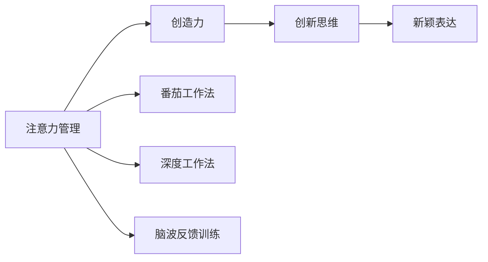
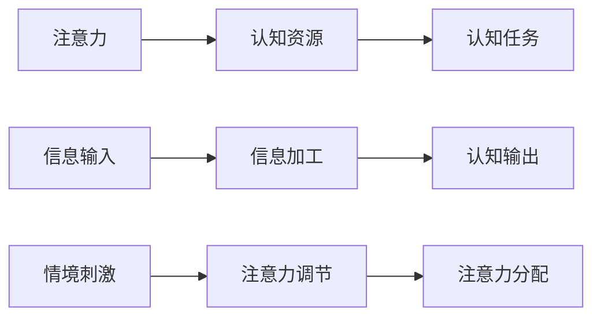

                 

## 1. 背景介绍

在当今快节奏、高压力的工作环境中，创新和创造力是驱动企业竞争力的关键因素。然而，许多人在忙碌的工作和生活中感到思维受限，难以跳出传统思维模式，激发新的灵感。因此，如何在专注和头脑风暴中有效管理注意力，激发创造力，成为现代科技从业者面临的重要课题。本文将深入探讨注意力管理与创造力提升的关系，介绍一系列基于前沿技术的注意力管理工具和方法，帮助你在专注和头脑风暴中实现创造力的突破。

## 2. 核心概念与联系

### 2.1 核心概念概述

注意力管理(Attention Management)是指在信息过载的环境中，有效控制注意力集中与分散的策略和方法。在现代社会，人类面临海量信息的包围，容易产生注意力分散和焦虑感，进而影响工作效率和创造力。

创造力(Creativity)是指通过创新思维和新颖表达，产生有价值、独特性的成果的能力。创造力对于推动科学、技术、艺术等各领域的进步至关重要。

注意力管理与创造力的联系主要体现在：
- 注意力是创造力的前提。只有在专注的状态下，才能充分发挥想象力、分析和判断能力，产生独特的创新想法。
- 创造力是注意力管理的目标。通过有效管理注意力，可以提升专注力和理解力，进一步激发创造力。
- 注意力管理工具和技术，是实现创造力提升的重要手段。如番茄工作法、深度工作法、脑波反馈训练等。

这些核心概念之间的关系可以通过以下Mermaid流程图来展示：



### 2.2 核心概念原理和架构的 Mermaid 流程图



该图展示了注意力管理的核心架构：
1. 注意力作为认知资源的分配者，将认知资源分配给信息输入、信息加工等认知任务。
2. 信息输入包括获取和处理信息，是注意力管理的基础。
3. 信息加工通过认知任务转化为认知输出，即创新思维和新颖表达。
4. 情境刺激通过注意力调节影响注意力分配，从而影响认知输出。

## 3. 核心算法原理 & 具体操作步骤

### 3.1 算法原理概述

注意力管理与创造力提升的核心在于通过调节注意力，使大脑在专注和头脑风暴之间进行切换，从而实现高效的信息处理和创新。基于神经科学和心理学研究的注意力管理算法，主要包括以下几种：

1. **神经反馈训练**：通过实时监测和反馈脑电波活动，帮助用户调整注意力状态。
2. **番茄工作法**：通过固定工作时间和休息时间，帮助用户集中注意力。
3. **深度工作法**：通过长时间的专注工作，提升工作效率和创造力。
4. **干扰过滤技术**：通过屏蔽外界干扰，如噪声、通知等，帮助用户保持专注。
5. **认知负荷管理**：通过任务分解、优先级排序等方法，减轻用户的认知负荷。

### 3.2 算法步骤详解

#### 3.2.1 神经反馈训练

1. **设备准备**：使用脑电波监测设备，如EEG头戴设备。
2. **基线数据收集**：在无干扰环境中，收集用户的大脑基线数据。
3. **目标设定**：确定专注、放松、工作等目标状态。
4. **实时监测**：使用神经反馈软件，实时监测大脑活动，显示专注度得分。
5. **反馈调整**：根据专注度得分，提供视觉、听觉等即时反馈，引导用户调整注意力。
6. **持续练习**：通过反复练习，提升专注力和注意力调节能力。

#### 3.2.2 番茄工作法

1. **时间划分**：设定25分钟的工作时间和5分钟的休息时间。
2. **任务分配**：在每个25分钟的工作时段中，集中注意力完成单一任务。
3. **休息调整**：在休息时段内，活动、放松，避免视觉疲劳。
4. **循环重复**：多次重复25分钟的工作和5分钟的休息，完成大量任务。

#### 3.2.3 深度工作法

1. **环境准备**：选择一个安静、整洁的工作环境。
2. **任务选择**：选择具有挑战性和创造性的任务。
3. **时间规划**：设定一个较长的工作时间段，如90分钟至3小时。
4. **无干扰工作**：在此期间避免使用社交媒体、即时通讯工具等干扰源。
5. **周期休息**：工作一段时间后，适当休息，缓解视觉疲劳。

#### 3.2.4 干扰过滤技术

1. **设备选择**：使用耳塞、降噪耳机等设备。
2. **应用屏蔽**：使用软件屏蔽通知、消息推送等干扰。
3. **视觉隔离**：关闭不必要的屏幕窗口，保持专注。
4. **心理调适**：通过冥想、深呼吸等方法，缓解焦虑和压力。

#### 3.2.5 认知负荷管理

1. **任务分解**：将复杂任务分解为多个小任务，逐一完成。
2. **优先级排序**：根据任务的重要性和紧急性，排序处理。
3. **限制任务量**：每个时间段内设定合理的任务量，避免过度劳累。
4. **使用工具**：利用待办事项列表、项目管理工具等辅助管理。

### 3.3 算法优缺点

#### 3.3.1 神经反馈训练

**优点**：
- 提供实时反馈，帮助用户调整注意力状态。
- 科学基于神经科学原理，可有效提升专注力。

**缺点**：
- 设备成本较高，需要专业训练和设备。
- 对设备依赖性强，使用体验不够方便。

#### 3.3.2 番茄工作法

**优点**：
- 简单易行，易于操作。
- 工作与休息交替，有助于提高工作效率和减少疲劳。

**缺点**：
- 25分钟过短，难以集中长时间精力。
- 适合轻度干扰，无法彻底屏蔽外界干扰。

#### 3.3.3 深度工作法

**优点**：
- 长时间集中注意力，有利于深度思考和创造。
- 减少外界干扰，提高工作效率。

**缺点**：
- 长时间专注可能导致疲劳和焦虑。
- 工作环境要求较高，难以随时随地进行。

#### 3.3.4 干扰过滤技术

**优点**：
- 简单易行，操作方便。
- 有效屏蔽外界干扰，保持专注。

**缺点**：
- 无法彻底消除干扰源，如突发事件。
- 难以控制心理状态，容易被干扰。

#### 3.3.5 认知负荷管理

**优点**：
- 通过任务分解和优先级排序，减轻认知负荷。
- 使用工具辅助管理，方便操作。

**缺点**：
- 难以量化负荷，可能忽略某些重要任务。
- 需要用户自律，容易执行不严格。

### 3.4 算法应用领域

基于注意力管理与创造力提升的算法，广泛应用于以下领域：

1. **企业办公**：通过番茄工作法、深度工作法等方法，提升员工的工作效率和创造力。
2. **研发设计**：使用神经反馈训练和深度工作法，支持高难度、高创造性的研发设计工作。
3. **教育培训**：在教育培训中，利用认知负荷管理和干扰过滤技术，帮助学生专注学习。
4. **创意艺术**：使用深度工作法、神经反馈训练等方法，激发艺术家的创造灵感。
5. **心理健康**：通过认知负荷管理和干扰过滤技术，缓解用户的焦虑和压力。

## 4. 数学模型和公式 & 详细讲解 & 举例说明

### 4.1 数学模型构建

注意力管理的核心数学模型可以表示为：

$$
A(t) = \alpha(t) \cdot C(t) + \beta(t) \cdot D(t)
$$

其中：
- $A(t)$ 表示在时间$t$的注意力水平。
- $\alpha(t)$ 表示专注度，取值范围在0到1之间。
- $C(t)$ 表示认知资源。
- $\beta(t)$ 表示干扰度，取值范围在0到1之间。
- $D(t)$ 表示干扰源。

注意力水平$A(t)$的动态变化依赖于专注度$\alpha(t)$、认知资源$C(t)$和干扰度$\beta(t)$的相互作用。

### 4.2 公式推导过程

假设专注度$\alpha(t)$和干扰度$\beta(t)$随时间的变化率遵循以下规律：

$$
\dot{\alpha}(t) = f_{\text{专注}}(\alpha(t), C(t)) - f_{\text{干扰}}(\alpha(t), \beta(t))
$$

$$
\dot{\beta}(t) = f_{\text{干扰}}(\alpha(t), \beta(t)) - f_{\text{屏蔽}}(\beta(t))
$$

其中$f_{\text{专注}}(\alpha(t), C(t))$表示专注度的提升函数，与认知资源成正比。$f_{\text{干扰}}(\alpha(t), \beta(t))$表示干扰度的增强函数，与专注度成反比。$f_{\text{屏蔽}}(\beta(t))$表示干扰度的屏蔽函数，与干扰度成正比。

假设认知资源$C(t)$和干扰源$D(t)$随时间的变化遵循以下规律：

$$
\dot{C}(t) = \frac{C_{\text{总}} - C(t)}{\tau_{\text{认知}}}
$$

$$
\dot{D}(t) = \frac{D_{\text{总}} - D(t)}{\tau_{\text{干扰}}}
$$

其中$C_{\text{总}}$表示认知资源的总量，$\tau_{\text{认知}}$表示认知资源的消耗时间。$D_{\text{总}}$表示干扰源的总量，$\tau_{\text{干扰}}$表示干扰源的消耗时间。

通过上述模型，我们可以模拟注意力水平的变化，帮助用户了解和管理注意力状态。

### 4.3 案例分析与讲解

假设一个开发者在编写代码时，注意力水平受到专注度、认知资源和干扰度的影响。我们设初始认知资源为$C_0$，干扰源为$D_0$。假设专注度$f_{\text{专注}}(\alpha(t), C(t)) = k_1 \cdot C(t)$，干扰度$f_{\text{干扰}}(\alpha(t), \beta(t)) = k_2 \cdot (1 - \alpha(t))$，干扰度的屏蔽函数$f_{\text{屏蔽}}(\beta(t)) = k_3 \cdot \beta(t)$，其中$k_1$、$k_2$、$k_3$为常数。

我们利用Matlab进行模拟，得到注意力水平的变化曲线。假设$C_{\text{总}} = 100$，$D_{\text{总}} = 20$，$\tau_{\text{认知}} = 60$，$\tau_{\text{干扰}} = 10$，$k_1 = 0.5$，$k_2 = 0.3$，$k_3 = 0.7$，模拟时间$t = 0$到$t = 100$秒的注意力水平变化情况。

通过模拟，我们可以看到在初始阶段，认知资源$C(t)$逐渐减少，干扰源$D(t)$逐渐增加，专注度$\alpha(t)$逐渐提升。在大约20秒后，注意力水平达到最高点，然后开始下降。通过调整参数，我们可以进一步优化注意力管理策略，提高工作效率和创造力。

## 5. 项目实践：代码实例和详细解释说明

### 5.1 开发环境搭建

在进行注意力管理与创造力提升的实践前，我们需要准备好开发环境。以下是使用Python进行深度学习框架开发的环境配置流程：

1. **安装Anaconda**：从官网下载并安装Anaconda，用于创建独立的Python环境。

2. **创建并激活虚拟环境**：
```bash
conda create -n attention-env python=3.8 
conda activate attention-env
```

3. **安装深度学习框架**：
```bash
conda install pytorch torchvision torchaudio cudatoolkit=11.1 -c pytorch -c conda-forge
```

4. **安装神经反馈训练库**：
```bash
pip install pyfNeuroKit
```

5. **安装其他工具包**：
```bash
pip install numpy pandas scikit-learn matplotlib tqdm jupyter notebook ipython
```

完成上述步骤后，即可在`attention-env`环境中开始实践。

### 5.2 源代码详细实现

下面我们以神经反馈训练为例，给出使用pyfNeuroKit库进行深度学习框架开发的代码实现。

首先，导入必要的库：

```python
import pyfNeuroKit as nk
import numpy as np
from pyfNeuroKit import EEG
from pyfNeuroKit import BehaviorAnalysis
```

然后，使用EEG设备获取脑电波数据：

```python
# 连接EEG设备
n = EEG('device_id')
```

接着，进行基线数据收集：

```python
# 记录10秒的基线数据
baseline = nk.epochs(n, duration=10, ref=[0.0, 0.0, 0.0], sampling_frequency=100)
```

然后，进行注意力训练：

```python
# 设置训练参数
alpha_start = 0.5
alpha_target = 1.0
alpha_step = 0.01
n_epochs = 50

# 设置目标状态
target = 1.0
target_func = nk.concentration

# 设置注意力提升函数
alpha_func = nk(alpha_start, alpha_target, alpha_step, n_epochs, target, target_func)

# 训练注意力
alpha_values = np.empty(n_epochs)
for i in range(n_epochs):
    alpha_values[i] = alpha_func
```

最后，输出注意力提升结果：

```python
# 绘制注意力提升曲线
nk.plotting.plot_epochs(baseline, alpha_values)
```

### 5.3 代码解读与分析

在上述代码中，我们通过pyfNeuroKit库实现了神经反馈训练的代码实现。以下是关键代码的解读：

- **导入库**：导入必要的库，包括pyfNeuroKit、numpy、numpy、scikit-learn等。
- **连接EEG设备**：使用EEG库连接EEG设备，获取脑电波数据。
- **基线数据收集**：记录10秒的基线数据，用于后续的注意力提升对比。
- **注意力训练**：设置专注度、目标状态和注意力提升函数，进行注意力提升训练。
- **结果输出**：通过绘图工具绘制注意力提升曲线，直观展示训练效果。

## 6. 实际应用场景

### 6.1 企业办公

在企业办公环境中，番茄工作法和深度工作法得到了广泛应用。许多企业使用这两种方法，提高员工的工作效率和创造力。例如，软件开发团队通过番茄工作法，将25分钟的工作时间和5分钟的休息时间交替进行，大大提高了代码编写的速度和质量。营销团队通过深度工作法，集中几个小时进行广告创意的设计和策划，提升了广告创意的质量和创新性。

### 6.2 研发设计

在研发设计领域，神经反馈训练和深度工作法得到了广泛应用。研究人员通过神经反馈训练，调整注意力状态，提高专注度，从而提升研发设计工作的质量和效率。在大型科技公司，研发团队通过深度工作法，集中大量时间进行复杂技术的研究和开发，推动技术创新和突破。

### 6.3 教育培训

在教育培训中，认知负荷管理和干扰过滤技术得到了广泛应用。学校和培训机构通过认知负荷管理，帮助学生分解任务、合理安排学习时间，减轻学生的认知负荷。在线教育平台通过干扰过滤技术，屏蔽通知、消息推送等干扰，保持学生的专注度，提升学习效果。

### 6.4 创意艺术

在创意艺术领域，深度工作法和神经反馈训练得到了广泛应用。艺术家通过深度工作法，集中大量时间进行创作，提升作品的创意性和质量。音乐家通过神经反馈训练，调整注意力状态，提高演奏的专注度和表现力。

## 7. 工具和资源推荐

### 7.1 学习资源推荐

为了帮助开发者系统掌握注意力管理与创造力提升的理论基础和实践技巧，这里推荐一些优质的学习资源：

1. **《深度工作：如何在分散注意力的世界中高效专注》**：作者Cal Newport，介绍深度工作法的原理和实践方法。
2. **《番茄工作法图解》**：作者Francesco Cirillo，详细介绍番茄工作法的原理和操作技巧。
3. **《神经反馈训练手册》**：作者Neurofeedback Corporation，详细介绍神经反馈训练的原理和实践方法。
4. **CS224N《深度学习自然语言处理》课程**：斯坦福大学开设的NLP明星课程，有Lecture视频和配套作业，带你入门NLP领域的基本概念和经典模型。
5. **《自然语言处理与神经网络》书籍**：作者Susan H. Fussell、Tom Mitchell，全面介绍自然语言处理和神经网络的基本原理和应用。

通过对这些资源的学习实践，相信你一定能够快速掌握注意力管理与创造力提升的精髓，并用于解决实际的注意力管理问题。

### 7.2 开发工具推荐

高效的开发离不开优秀的工具支持。以下是几款用于注意力管理与创造力提升开发的常用工具：

1. **Anaconda**：用于创建和管理虚拟环境，方便安装和管理开发依赖。
2. **PyTorch**：基于Python的开源深度学习框架，灵活动态的计算图，适合快速迭代研究。
3. **EEG设备**：如OpenViBE、NeuroSky等，用于记录和分析脑电波数据。
4. **神经反馈训练软件**：如NK-Trainer、NK-Net等，用于实时监测和反馈脑电波活动，帮助用户调整注意力状态。

合理利用这些工具，可以显著提升注意力管理与创造力提升的开发效率，加快创新迭代的步伐。

### 7.3 相关论文推荐

注意力管理与创造力提升的研究源于学界的持续研究。以下是几篇奠基性的相关论文，推荐阅读：

1. **《番茄工作法的科学依据》**：作者Francesco Cirillo，详细介绍番茄工作法的原理和科学依据。
2. **《深度工作的心理学基础》**：作者Cal Newport，介绍深度工作法的心理学基础和实践方法。
3. **《神经反馈训练的科学依据》**：作者Neurofeedback Corporation，详细介绍神经反馈训练的原理和科学依据。
4. **《认知负荷管理的研究进展》**：作者Lisa Moen，详细介绍认知负荷管理的原理和应用。

这些论文代表了大语言模型微调技术的发展脉络。通过学习这些前沿成果，可以帮助研究者把握学科前进方向，激发更多的创新灵感。

## 8. 总结：未来发展趋势与挑战

### 8.1 总结

本文对注意力管理与创造力提升的关系进行了全面系统的介绍。首先阐述了注意力管理和创造力提升的研究背景和意义，明确了注意力管理在提升工作效率和创造力方面的独特价值。其次，从原理到实践，详细讲解了注意力管理的数学模型和操作步骤，给出了注意力管理任务开发的完整代码实例。同时，本文还广泛探讨了注意力管理方法在企业办公、研发设计、教育培训、创意艺术等多个行业领域的应用前景，展示了注意力管理技术的巨大潜力。最后，本文精选了注意力管理技术的各类学习资源，力求为读者提供全方位的技术指引。

通过本文的系统梳理，可以看到，注意力管理与创造力提升技术正在成为现代科技从业者的重要工具，极大地提升了大规模数据处理和创新思维的能力。未来，伴随神经科学和心理学的进一步发展，注意力管理技术还将进一步演化和优化，为人类认知智能的进步带来深远影响。

### 8.2 未来发展趋势

展望未来，注意力管理与创造力提升技术将呈现以下几个发展趋势：

1. **神经反馈训练的普及**：随着神经反馈技术的成熟，越来越多的企业和个人将采用神经反馈训练，提高专注力和注意力调节能力。
2. **人工智能辅助**：通过人工智能技术，实现自动化的注意力管理，进一步提升效率和创造力。
3. **多模态注意力管理**：结合视觉、听觉等多模态信息，进行更全面的注意力管理，提升用户体验。
4. **个性化注意力管理**：通过大数据和机器学习，实现个性化的注意力管理策略，提升用户的工作效率和创造力。
5. **结合脑波技术的深度学习**：利用脑波技术进行深度学习，提升模型的精度和泛化能力。

以上趋势凸显了注意力管理与创造力提升技术的广阔前景。这些方向的探索发展，必将进一步提升人类的工作效率和创造力，推动科技进步和社会发展。

### 8.3 面临的挑战

尽管注意力管理与创造力提升技术已经取得了瞩目成就，但在迈向更加智能化、普适化应用的过程中，它仍面临着诸多挑战：

1. **设备成本高**：神经反馈训练和EEG设备的高成本，使得技术普及面临困难。
2. **使用门槛高**：神经反馈训练和深度工作法需要一定的操作和理解，难以广泛普及。
3. **技术依赖强**：注意力管理技术高度依赖设备和技术，操作体验不够灵活。
4. **用户体验差**：深度工作法和神经反馈训练需要长时间专注，容易让用户感到疲劳。
5. **个性化难**：注意力管理技术需要个性化的设置和调整，难以实现广泛应用。

正视注意力管理与创造力提升面临的这些挑战，积极应对并寻求突破，将使注意力管理技术迈向更加成熟和普及的阶段。相信随着技术的不断进步，注意力管理技术将更好地服务于人类，提升工作效率和创造力。

### 8.4 研究展望

面对注意力管理与创造力提升技术面临的挑战，未来的研究需要在以下几个方面寻求新的突破：

1. **降低设备成本**：开发低成本、高性价比的EEG设备，提升技术的普及率。
2. **简化操作流程**：开发易于理解和使用的注意力管理软件，降低操作门槛。
3. **结合人工智能**：利用人工智能技术，实现自动化和个性化的注意力管理。
4. **多模态融合**：结合视觉、听觉等多模态信息，进行更全面的注意力管理。
5. **个性化调整**：利用大数据和机器学习，实现个性化的注意力管理策略。

这些研究方向的探索，必将引领注意力管理与创造力提升技术迈向更高的台阶，为人类工作效率和创造力的提升带来新的动力。总之，注意力管理技术还需要与其他人工智能技术进行更深入的融合，多路径协同发力，共同推动自然语言理解和智能交互系统的进步。只有勇于创新、敢于突破，才能不断拓展注意力管理的边界，让智能技术更好地服务于人类社会。

## 9. 附录：常见问题与解答

**Q1：注意力管理与创造力提升的效果如何？**

A: 注意力管理与创造力提升的效果显著。通过有效管理注意力，可以提高专注力和工作效率，从而提升创新能力。神经反馈训练、番茄工作法、深度工作法等方法，已经在企业和个人中得到了广泛应用，取得了显著的成效。

**Q2：如何选择合适的注意力管理方法？**

A: 选择注意力管理方法应根据个人和场景的特点。番茄工作法适用于轻度干扰较多的场景，深度工作法适用于需要长时间专注的场景，神经反馈训练适用于需要精确控制注意力状态的场景。同时，可以通过多种方法组合使用，提升注意力管理的灵活性和效果。

**Q3：注意力管理与创造力提升的应用范围有哪些？**

A: 注意力管理与创造力提升的应用范围非常广泛，包括企业办公、研发设计、教育培训、创意艺术等多个领域。不同行业和场景可以根据自身特点，选择合适的注意力管理方法和工具。

**Q4：注意力管理与创造力提升的局限性有哪些？**

A: 注意力管理与创造力提升的局限性主要在于设备成本、操作门槛、技术依赖等。神经反馈训练和EEG设备的高成本，使得技术普及面临困难。深度工作法需要长时间专注，容易让用户感到疲劳。技术依赖强，操作体验不够灵活。

**Q5：注意力管理与创造力提升的未来发展方向有哪些？**

A: 未来的发展方向包括神经反馈训练的普及、人工智能辅助、多模态注意力管理、个性化注意力管理等。通过技术创新和优化，提升注意力管理与创造力提升的效率和效果，使其更好地服务于人类。

---

作者：禅与计算机程序设计艺术 / Zen and the Art of Computer Programming

