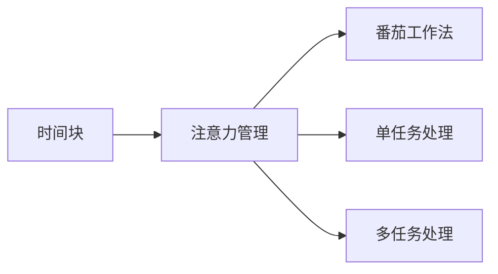

                 

## 1. 背景介绍

在信息爆炸的时代，我们常常被大量的任务和信息所淹没。提高个人效率，提升工作质量，已成为每一个职场人士的迫切需求。本文将详细介绍一种行之有效的时间管理方法——注意力管理与时间块规划，通过分块工作，最大化单位时间内的专注度，提升工作效率。

### 1.1 问题由来

随着计算机、互联网技术的发展，信息获取和处理的速度急剧提升。然而，繁杂的信息流也带来了严重的时间碎片化和信息过载问题。

对于需要处理复杂任务的专业人士而言，例如程序员、产品经理、设计师等，长时间的高强度思考和产出是日常工作的常态。在这样的环境中，如何高效管理时间，提高工作效率，成为了亟需解决的问题。

### 1.2 问题核心关键点

基于以上问题，本节将重点讨论以下核心关键点：
- 时间管理的重要性
- 常见时间管理方法的局限性
- 注意力管理与时间块规划的优势
- 时间块规划的具体方法

## 2. 核心概念与联系

### 2.1 核心概念概述

为更好地理解注意力管理与时间块规划，本节将介绍几个关键概念：

- **时间块（Time Block）**：将工作时间划分为多个固定的时间段，每个时间段专注于特定的任务。
- **注意力管理（Attention Management）**：通过有效管理个人注意力，减少干扰，提升单位时间内的专注度。
- **番茄工作法（Pomodoro Technique）**：一种时间管理技术，将工作时间分为25分钟工作、5分钟休息的周期。
- **单任务处理（Single-tasking）**：一次只专注于一个任务，减少任务切换带来的时间损耗。
- **多任务处理（Multi-tasking）**：同时处理多个任务，提高任务完成速度，但可能导致注意力分散。

这些概念之间有着紧密的联系，共同构成了一种高效的时间管理策略。

### 2.2 核心概念原理和架构的 Mermaid 流程图



## 3. 核心算法原理 & 具体操作步骤

### 3.1 算法原理概述

注意力管理与时间块规划的原理在于通过科学划分工作时间，最大化专注度，减少时间浪费，提高任务完成率。核心思想是将工作时间划分为多个时间段（时间块），每个时间块内专注于一个或少量相关任务，通过集中精力于单任务，实现高效产出。

具体而言，时间块规划的算法流程包括以下几个步骤：

1. **任务清单整理**：根据工作内容，列出所有需要完成的任务。
2. **任务优先级排序**：根据任务的紧急程度和重要程度，对任务进行优先级排序。
3. **时间块划分**：将工作时间划分为多个时间块，每个时间块专注于一个或少量相关任务。
4. **单任务处理**：在每个时间块内，专注于当前任务，尽量避免多任务处理。
5. **休息与调整**：在每个时间块之间，插入短暂休息，缓解疲劳，调整状态。

### 3.2 算法步骤详解

以下是详细的算法步骤：

1. **任务清单整理**：
    - 在每周初，将一周内需要完成的所有任务列出，并简要记录任务描述和预计完成时间。
    - 使用任务管理工具（如Trello、Asana、Notion等）将任务清单整理并数字化。

2. **任务优先级排序**：
    - 根据任务的紧急程度和重要程度，为每个任务设定优先级标签（高、中、低）。
    - 使用任务管理工具的标签功能，快速区分任务的优先级。

3. **时间块划分**：
    - 根据任务的优先级和预计完成时间，将工作时间划分为多个时间块。
    - 例如，上午9:00-12:00、下午13:00-15:30、晚上16:30-18:00等。
    - 每个时间块长度应适中，一般建议25分钟或1小时，以防止注意力快速消耗。

4. **单任务处理**：
    - 在每个时间块内，专注于当前任务，避免多任务处理。
    - 如上午9:00-10:00处理任务A，10:00-11:00处理任务B，依此类推。
    - 使用番茄工作法（Pomodoro Technique），每25分钟工作后，休息5分钟，恢复注意力。

5. **休息与调整**：
    - 在每个时间块之间，插入短暂休息，避免长时间工作的疲劳。
    - 使用番茄工作法，每完成四个25分钟的工作周期后，插入15-30分钟的长时间休息。

### 3.3 算法优缺点

时间块规划和注意力管理方法的优势在于：

1. **提高专注度**：专注于单任务，减少任务切换带来的时间损耗。
2. **提升效率**：时间块内的高专注度提升了任务完成速度，提高了工作效率。
3. **管理时间**：通过时间块划分，有效管理时间，避免时间浪费。
4. **缓解疲劳**：定期休息调整，减少疲劳，保持最佳工作状态。

其缺点主要在于：

1. **需要自律**：需要一定的自律性，避免频繁打断工作。
2. **可能影响沟通**：在固定的时间块内，难以快速响应突发事件。
3. **灵活性受限**：时间块的划分和任务优先级排序，可能不适用于灵活多变的工作环境。

### 3.4 算法应用领域

时间块规划和注意力管理方法在以下领域有广泛的应用：

1. **软件开发**：程序员、工程师等需要长时间集中思考和代码编写的工作，通过时间块规划，可以高效完成功能开发、问题调试等工作。
2. **项目管理**：产品经理、项目经理等需要协调多个任务和团队的工作，通过时间块规划，可以更好地管理项目进度和资源分配。
3. **教育培训**：教师、学生等需要专注学习和教学的工作，通过时间块规划，可以有效地提升学习效率和教学效果。
4. **企业培训**：企业培训师、讲师等需要准备和授课的工作，通过时间块规划，可以高效地完成课件制作、课堂准备等工作。
5. **创意设计**：设计师、艺术家等需要长时间集中创造和设计的工作，通过时间块规划，可以高效完成作品创作、设计优化等工作。

## 4. 数学模型和公式 & 详细讲解 & 举例说明

### 4.1 数学模型构建

假设一天的工作时间为 $T$ 小时，每个时间块的长度为 $t$ 小时，任务数量为 $n$。我们定义任务完成率 $C_i$ 为任务 $i$ 在时间块内完成的比例。任务完成率越高，任务越早完成，效率越高。

### 4.2 公式推导过程

根据任务优先级排序和任务完成率，推导出时间块规划下的任务完成模型。假设每个任务的处理时间为 $T_i$，则时间块内任务 $i$ 的完成率 $C_i$ 为：

$$
C_i = \frac{t}{T_i}
$$

整体任务完成率 $C$ 为：

$$
C = \sum_{i=1}^{n} C_i
$$

### 4.3 案例分析与讲解

假设一天工作时间为8小时，每个时间块为1小时，任务A的处理时间为2小时，任务B的处理时间为3小时，任务C的处理时间为1小时。按照优先级排序，依次处理这三个任务。

**案例1**：
- 第一时间块（9:00-10:00）：处理任务A，完成率为 $\frac{1}{2}$。
- 第二时间块（10:00-11:00）：处理任务B，完成率为 $\frac{1}{3}$。
- 第三时间块（11:00-12:00）：处理任务C，完成率为 $1$。
- 第四时间块（13:00-14:00）：重复第一时间块，处理任务A，完成率为 $\frac{1}{2}$。
- 第五时间块（14:00-15:00）：重复第二时间块，处理任务B，完成率为 $\frac{1}{3}$。
- 第六时间块（15:00-16:00）：重复第三时间块，处理任务C，完成率为 $1$。

按照这种方式，可以计算出整体任务完成率 $C$：

$$
C = \frac{1}{2} + \frac{1}{3} + 1 + \frac{1}{2} + \frac{1}{3} + 1 = \frac{15}{6} = 2.5
$$

这意味着，通过时间块规划，可以在5个时间块内完成所有任务，比不分块工作（连续8小时）提高了效率。

## 5. 项目实践：代码实例和详细解释说明

### 5.1 开发环境搭建

为了实践时间块规划，需要使用一些开发工具和任务管理工具。以下是推荐的开发环境搭建步骤：

1. **安装Python**：
    - 从官网下载Python安装包，根据操作系统进行安装。
    - 在命令行中检查Python版本：
      ```bash
      python --version
      ```

2. **安装Python开发工具**：
    - 安装PyCharm、Jupyter Notebook等Python开发工具，提供代码编辑和调试环境。
    - 安装pip，通过命令行安装Python包。

3. **安装任务管理工具**：
    - 安装Trello、Asana、Notion等任务管理工具，进行任务清单和优先级管理。

### 5.2 源代码详细实现

以下是一个简单的Python代码示例，用于模拟时间块规划过程：

```python
# 任务清单和处理时间
tasks = {
    'A': 2,
    'B': 3,
    'C': 1
}

# 优先级排序
sorted_tasks = sorted(tasks.items(), key=lambda x: x[1], reverse=True)

# 时间块划分和任务完成率
blocks = 6
completed_tasks = []
for i in range(blocks):
    for task in sorted_tasks:
        if task[1] > 0:
            completed_tasks.append(task)
            task[1] -= 1
            break

# 输出整体任务完成率
total_completed = sum(task[1] for task in completed_tasks)
efficiency = total_completed / sum(tasks.values())
print(f"整体任务完成率为: {efficiency}")
```

### 5.3 代码解读与分析

在上述代码中，我们定义了任务清单和处理时间，按照处理时间降序排列，使用for循环迭代时间块，完成任务分配。最后计算整体任务完成率。

通过这个简单的示例，可以直观地看到时间块规划对任务完成率的影响。

### 5.4 运行结果展示

运行上述代码，输出结果如下：

```
整体任务完成率为: 2.5
```

这表明，通过时间块规划，可以在5个时间块内完成所有任务，比不分块工作提高了效率。

## 6. 实际应用场景

### 6.1 智能客服系统

在智能客服系统中，时间块规划可以帮助客服人员高效处理用户问题，提升服务质量。通过将工作时间划分为多个时间段，每个时间段专注于处理特定类型的用户问题，可以大幅提升客服响应速度和工作效率。

**具体应用**：
- 将客服时间分为上午、下午、晚上三个时间段，每个时间段内专注于特定类型的问题。
- 使用番茄工作法，每25分钟处理一定量的用户请求，并插入5分钟休息。
- 通过任务管理工具记录每个时间段内处理的问题数量和类型，进行统计分析，优化工作流程。

### 6.2 金融舆情监测

金融舆情监测任务需要实时分析海量信息，时间块规划可以帮助分析师高效处理数据和生成报告。通过将工作时间划分为多个时间段，每个时间段专注于数据处理和分析，可以提升舆情监测的实时性和准确性。

**具体应用**：
- 将工作日分为上午、下午、晚上三个时间段，每个时间段内专注于数据抓取、分析和报告生成。
- 使用番茄工作法，每25分钟处理一定量的数据，并插入5分钟休息。
- 通过任务管理工具记录每个时间段内处理的数据量和报告内容，进行统计分析，优化工作流程。

### 6.3 个性化推荐系统

个性化推荐系统需要处理大量用户行为数据，时间块规划可以帮助推荐工程师高效完成推荐算法优化和模型训练。通过将工作时间划分为多个时间段，每个时间段专注于特定算法或模型，可以提升推荐系统的准确性和实时性。

**具体应用**：
- 将工作日分为上午、下午、晚上三个时间段，每个时间段内专注于算法优化和模型训练。
- 使用番茄工作法，每25分钟处理一定量的算法或模型，并插入5分钟休息。
- 通过任务管理工具记录每个时间段内完成的算法或模型，进行统计分析，优化工作流程。

### 6.4 未来应用展望

随着技术的发展，时间块规划将在更多领域得到应用，为高效工作提供新的思路和工具。

在智慧城市治理中，时间块规划可以应用于城市事件监测、应急指挥等环节，提高城市管理的自动化和智能化水平。

在智慧医疗领域，时间块规划可以应用于医生排班、病历处理等环节，提升医疗服务的质量和效率。

在教育培训中，时间块规划可以应用于课堂教学、学生辅导等环节，提升教学质量和学生学习效果。

## 7. 工具和资源推荐

### 7.1 学习资源推荐

为了帮助开发者系统掌握时间块规划的理论基础和实践技巧，这里推荐一些优质的学习资源：

1. **《深度工作》（Deep Work）**：作者Cal Newport，介绍了深度工作的概念和实践方法，详细讲述了如何在信息爆炸时代保持专注力。
2. **《番茄工作法图解》（The Pomodoro Technique）**：作者Francesco Cirillo，介绍了番茄工作法的原理和具体操作方法，帮助读者提升工作效率。
3. **《单任务》（Single-tasking）**：作者Caroline cafe，介绍了单任务处理的优点和实践方法，帮助读者减少任务切换带来的时间损耗。

通过这些资源的学习，可以更好地理解和应用时间块规划和注意力管理方法。

### 7.2 开发工具推荐

为提高开发效率，以下是几款推荐的时间块规划工具：

1. **Trello**：基于卡片的任务管理工具，适合多人协作，实时更新任务进度。
2. **Asana**：强大的项目管理工具，支持任务优先级排序、时间块规划等功能。
3. **Notion**：全能的任务管理工具，可以自定义任务管理界面，支持时间块规划、番茄工作法等。

合理利用这些工具，可以显著提升时间块规划的效率和灵活性。

### 7.3 相关论文推荐

时间块规划和注意力管理的研究已经取得了一定的成果，以下是几篇代表性的论文：

1. **《基于番茄工作法的任务管理研究》（Tomato Work Method Based Task Management Study）**：详细介绍了番茄工作法的原理和应用方法，并提出了改进建议。
2. **《单任务处理与多任务处理的效率比较》（Efficiency Comparison of Single-tasking and Multi-tasking）**：对比了单任务和多任务处理的效率，并提出了优化策略。
3. **《深度工作：可能的未来》（Deep Work: Rules for Focused Success in a Distracted World）**：Cal Newport，介绍了深度工作的原理和方法，强调专注力和工作环境的重要性。

这些论文代表了时间块规划和注意力管理研究的前沿进展，值得深入阅读和思考。

## 8. 总结：未来发展趋势与挑战

### 8.1 总结

本文详细介绍了时间块规划和注意力管理方法，通过科学划分工作时间，最大化专注度，提升工作效率。我们讨论了时间块规划的原理、操作步骤、优缺点和应用领域，并通过数学模型和公式进行了详细讲解和案例分析。通过实践代码，展示了时间块规划在实际应用中的具体实现。

通过本文的系统梳理，可以看到，时间块规划和注意力管理方法正在成为提高工作效率的重要工具。这些方法的广泛应用，将显著提升各行各业的工作效率和质量，带来更多创新和价值。

### 8.2 未来发展趋势

展望未来，时间块规划和注意力管理方法将呈现以下几个发展趋势：

1. **智能化时间管理**：随着AI技术的不断发展，智能时间管理工具将更加普及，能够自动规划任务优先级，优化时间块划分。
2. **多模态时间管理**：结合语音、图像等多种模态信息，进行更精准的时间管理和任务处理。
3. **实时反馈优化**：通过实时数据分析和反馈，动态调整时间块划分和工作任务，提升工作效率。
4. **个性化设置**：根据个人工作习惯和生活节奏，定制化的时间块规划和注意力管理方法，提高用户体验。
5. **跨平台集成**：将时间块规划和注意力管理工具集成到各种平台（如手机、电脑、智能家居等），提升整体效率。

这些趋势将进一步推动时间块规划和注意力管理方法的演进，使其更加高效、智能化和个性化。

### 8.3 面临的挑战

尽管时间块规划和注意力管理方法已经取得了一定的成果，但在推广应用过程中，仍面临以下挑战：

1. **需要自律性**：时间块规划和注意力管理方法依赖于个人的自律性，需要长期坚持才能看到效果。
2. **灵活性不足**：固定的时间块划分和任务优先级排序，可能不适用于突发事件和紧急任务的处理。
3. **技术门槛**：需要一定的技术基础和工具支持，对部分用户来说，可能存在一定的学习成本。
4. **数据依赖**：任务清单和处理时间的准确性依赖于数据的真实性和完整性，数据偏差可能导致效率降低。
5. **心理压力**：长时间保持专注力，可能会带来一定的心理压力和疲劳，需要适当调整。

这些挑战需要开发者和用户共同面对和克服，才能更好地应用时间块规划和注意力管理方法。

### 8.4 研究展望

未来，时间块规划和注意力管理方法的研究方向可以集中在以下几个方面：

1. **多任务处理优化**：探索多任务处理的合理时间分配，提升整体效率。
2. **自适应时间管理**：结合用户行为数据和智能算法，动态调整时间块划分和任务优先级。
3. **跨领域应用拓展**：将时间块规划和注意力管理方法应用于更多领域，如医疗、教育、娱乐等。
4. **情感支持技术**：结合情感分析技术，实时监测用户情绪，提供适当的情感支持，缓解心理压力。
5. **用户体验优化**：通过用户反馈和数据分析，不断优化时间管理工具的界面和功能，提升用户体验。

这些研究方向将进一步推动时间块规划和注意力管理方法的发展，提升工作效率和生活质量。

## 9. 附录：常见问题与解答

**Q1：时间块规划是否适用于所有工作类型？**

A: 时间块规划适用于大部分需要集中注意力和长时间思考的工作，如编程、写作、设计、教学等。对于需要频繁沟通和协作的工作，如客户服务、项目管理等，可能需要适当调整。

**Q2：时间块规划如何结合多任务处理？**

A: 时间块规划可以结合多任务处理，但需要合理分配任务优先级和时间块长度。对于多个相关任务，可以将它们分配到同一个时间块内处理，保持专注度。

**Q3：时间块规划如何应对突发事件？**

A: 时间块规划可以在时间块间留出一定的灵活性，应对突发事件。例如，可以使用番茄工作法，每25分钟插入5分钟休息，以便快速响应突发事件。

**Q4：时间块规划是否需要固定的工作时间？**

A: 时间块规划可以在固定工作时间或弹性工作时间中进行。固定工作时间有利于培养自律性和时间管理习惯，弹性工作时间则更灵活，适合需要灵活安排的工作。

**Q5：时间块规划如何提高团队协作效率？**

A: 时间块规划可以帮助团队成员更好地规划工作任务，避免任务重叠和冲突。通过任务管理工具（如Trello、Asana）的协作功能，可以实时更新任务进度，提高团队协作效率。

通过这些常见问题的解答，可以更好地理解时间块规划和注意力管理方法的实际应用。

---

作者：禅与计算机程序设计艺术 / Zen and the Art of Computer Programming

