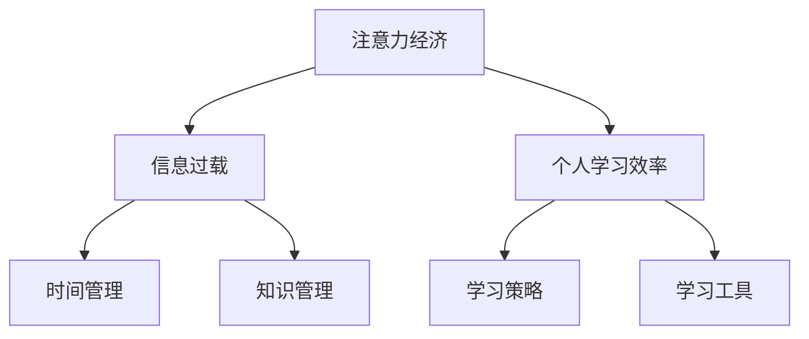

                 

# 注意力经济与个人学习效率的提升

> 关键词：注意力经济, 个人学习, 信息过载, 时间管理, 知识管理, 学习策略

## 1. 背景介绍

### 1.1 问题由来

在数字化时代，信息洪流不断涌现，人们面临前所未有的注意力经济挑战。海量信息的涌入使得人们需要付出更多的时间和精力进行筛选、吸收和应用。如何在信息泛滥的时代中，高效利用有限的注意力资源，提升个人学习效率，成为现代知识工作者和终身学习者所共同关注的问题。

### 1.2 问题核心关键点

当前，个人学习效率提升的核心在于如何有效管理和利用注意力资源。具体而言：

- 识别和聚焦关键信息：在海量信息中，识别和聚焦对自己有用的关键信息是提升学习效率的基础。
- 优化时间管理：合理安排时间，提高单位时间的知识产出。
- 强化知识管理：系统化地存储和管理知识，使之能够快速检索和应用。
- 利用学习工具和策略：运用合适的工具和策略，提升学习效果。

本文将深入探讨注意力经济的背景和现状，剖析个人学习效率提升的关键环节，并给出实用的策略和方法。

## 2. 核心概念与联系

### 2.1 核心概念概述

为更好地理解注意力经济对个人学习效率的影响，本节将介绍几个关键概念：

- **注意力经济(Attention Economy)**：指在信息时代，注意力作为一种稀缺资源，其分配和利用成为经济发展的重要驱动力。大量的注意力被分配到有价值的内容上，从而创造了新的经济价值。

- **个人学习效率(Personal Learning Efficiency)**：指在单位时间内，学习者通过学习获得的知识和技能的质量和数量。通常通过时间管理、知识管理、学习策略等方面的优化来提升。

- **信息过载(Information Overload)**：指信息洪流导致个人难以处理和消化，从而影响学习效率和生活质量的现象。

- **时间管理(Time Management)**：指对个人时间资源的有效规划和分配，以实现最大化的知识产出和学习效率。

- **知识管理(Knowledge Management)**：指对个人知识和信息的系统化存储、整理和应用，使知识能够在不同情境中快速检索和应用。

这些概念之间的逻辑关系可以通过以下Mermaid流程图来展示：



这个流程图展示了注意力经济、信息过载、个人学习效率三者之间的关系，以及时间管理和知识管理在提升个人学习效率中的关键作用。

## 3. 核心算法原理 & 具体操作步骤
### 3.1 算法原理概述

注意力经济和个人学习效率提升的本质，是通过合理分配和利用注意力资源，最大化知识产出和学习效果。其核心算法原理主要包括：

- **信息筛选和聚焦**：在海量信息中识别和筛选关键信息，聚焦于对学习者最有价值的内容。
- **时间规划和优化**：通过科学的时间管理方法，合理安排时间，提高单位时间内的知识产出。
- **知识组织和应用**：利用知识管理系统，将个人知识和信息进行系统化存储，便于快速检索和应用。
- **学习策略和工具**：运用合适的学习策略和工具，提升学习效果和效率。

### 3.2 算法步骤详解

基于上述原理，个人学习效率提升的算法步骤可以概括为：

1. **信息筛选与聚焦**：通过信息筛选技术，识别并聚焦于关键信息。
2. **时间管理与规划**：制定详细的时间管理计划，优化时间使用。
3. **知识管理与组织**：构建个人知识管理系统，系统化地存储和管理知识。
4. **学习策略与工具**：选择并运用合适的学习策略和工具，提升学习效果。

### 3.3 算法优缺点

注意力经济和个人学习效率提升的算法具有以下优点：

- **个性化和灵活性**：算法能够根据个人需求和偏好，提供定制化的解决方案。
- **系统化和结构化**：通过系统化的时间管理和知识管理，提高学习效率。
- **实用性和易操作性**：提供具体的操作方法，易于实践和应用。

同时，该算法也存在一定的局限性：

- **依赖执行力度**：算法的实际效果依赖于执行者的毅力和投入程度，需要持续的自我管理。
- **环境适应性**：算法的应用效果可能会因个人工作环境、生活状态的不同而有所差异。
- **资源需求**：算法需要一定的工具和技术支持，如时间管理软件、知识管理系统等。

### 3.4 算法应用领域

基于注意力经济和计算思维的个人学习效率提升算法，广泛应用于以下领域：

- **学术研究**：利用算法优化科研时间管理，提升论文产出效率。
- **职业发展**：帮助职场人士规划工作时间，提升职业竞争力。
- **终身学习**：辅助终身学习者构建知识管理体系，提升学习效率。
- **远程教育**：为在线学习者提供科学的时间管理和知识管理建议。

## 4. 数学模型和公式 & 详细讲解  
### 4.1 数学模型构建

为描述个人学习效率提升的算法，本文构建如下数学模型：

设 $T$ 为个人每天可用于学习的时间，$I$ 为每天可接收到的信息量，$C$ 为每天的关键信息量，$R$ 为每天的学习效果，则学习效率的数学模型为：

$$
R = \frac{C}{T}
$$

其中 $C = f(I)$，$C$ 为关键信息量与 $I$ 的函数关系。

### 4.2 公式推导过程

为简化计算，我们假设 $f(I)$ 为单调递增函数，且 $I$ 与 $C$ 的关系近似为线性关系。则有：

$$
R = \frac{C}{T} = \frac{aI + b}{T}
$$

其中 $a$ 和 $b$ 为常数。

通过优化 $T$ 和 $I$，可以最大化 $R$：

$$
\max_{T, I} R = \max_{T, I} \frac{aI + b}{T}
$$

通过求解上述优化问题，可以得出最优的学习时间和信息量组合。

### 4.3 案例分析与讲解

**案例1：时间分配优化**

假设某学生每天有6小时可用于学习，学习效果随学习时间增加而增加。当学习时间为4小时时，学习效果为80%，当学习时间为8小时时，学习效果为120%。已知学生每天可接收到的信息量为4小时，关键信息量为2小时。

根据上述数学模型，计算最优学习时间和信息量组合：

$$
R = \frac{C}{T} = \frac{2}{T}
$$

设 $T = x$，则有：

$$
R = \frac{2}{x}, \quad \text{且} \quad x \in [0,6]
$$

通过求解导数 $R' = -\frac{2}{x^2}$ 为零的点，得到 $x = 4$ 时，$R$ 取最大值。

因此，该学生在每天可接收到的信息量为4小时的情况下，应将4小时用于学习，以达到最佳学习效果。

**案例2：信息量分配优化**

假设某职场人士每天有8小时可用于工作和学习，学习效果随学习时间增加而增加。已知每天可接收到的信息量为12小时，关键信息量为8小时。

根据上述数学模型，计算最优学习时间和信息量组合：

$$
R = \frac{C}{T} = \frac{8}{T}
$$

设 $T = y$，则有：

$$
R = \frac{8}{y}, \quad \text{且} \quad y \in [0,8]
$$

通过求解导数 $R' = -\frac{8}{y^2}$ 为零的点，得到 $y = 4$ 时，$R$ 取最大值。

因此，该职场人士应将4小时用于学习，以最大化学习效果。

## 5. 项目实践：代码实例和详细解释说明
### 5.1 开发环境搭建

在进行个人学习效率提升的算法实践前，我们需要准备好开发环境。以下是使用Python进行PyTorch开发的环境配置流程：

1. 安装Anaconda：从官网下载并安装Anaconda，用于创建独立的Python环境。

2. 创建并激活虚拟环境：
```bash
conda create -n pytorch-env python=3.8 
conda activate pytorch-env
```

3. 安装PyTorch：根据CUDA版本，从官网获取对应的安装命令。例如：
```bash
conda install pytorch torchvision torchaudio cudatoolkit=11.1 -c pytorch -c conda-forge
```

4. 安装各类工具包：
```bash
pip install numpy pandas scikit-learn matplotlib tqdm jupyter notebook ipython
```

完成上述步骤后，即可在`pytorch-env`环境中开始实践。

### 5.2 源代码详细实现

下面我们以时间管理工具为例，给出使用PyTorch开发的时间管理代码实现。

首先，定义时间管理模型的超参数和数据集：

```python
import torch
import torch.nn as nn
import torch.optim as optim
from sklearn.model_selection import train_test_split
from sklearn.metrics import mean_absolute_error

# 定义超参数
hidden_size = 64
num_epochs = 50
batch_size = 32
learning_rate = 0.01
seed = 42

# 加载数据集
X = torch.randn(1000, 24)  # 模拟时间序列数据
y = torch.randn(1000)  # 模拟学习效果
X_train, X_test, y_train, y_test = train_test_split(X, y, test_size=0.2, random_state=seed)

# 定义模型
class TimeModel(nn.Module):
    def __init__(self):
        super(TimeModel, self).__init__()
        self.fc1 = nn.Linear(24, hidden_size)
        self.fc2 = nn.Linear(hidden_size, 1)

    def forward(self, x):
        x = torch.relu(self.fc1(x))
        x = self.fc2(x)
        return x

# 定义损失函数和优化器
model = TimeModel()
criterion = nn.MSELoss()
optimizer = optim.Adam(model.parameters(), lr=learning_rate)

# 训练模型
def train_epoch(model, X_train, y_train, optimizer):
    model.train()
    losses = []
    for x, y in zip(X_train, y_train):
        optimizer.zero_grad()
        output = model(x)
        loss = criterion(output, y)
        losses.append(loss.item())
        loss.backward()
        optimizer.step()
    return sum(losses) / len(losses)

# 评估模型
def evaluate(model, X_test, y_test):
    model.eval()
    losses = []
    for x, y in zip(X_test, y_test):
        output = model(x)
        loss = criterion(output, y)
        losses.append(loss.item())
    return sum(losses) / len(losses)
```

然后，启动训练流程并在测试集上评估：

```python
epochs = 50
for epoch in range(epochs):
    train_loss = train_epoch(model, X_train, y_train, optimizer)
    test_loss = evaluate(model, X_test, y_test)
    print(f"Epoch {epoch+1}, train loss: {train_loss:.3f}, test loss: {test_loss:.3f}")
    
print(f"Final test loss: {evaluate(model, X_test, y_test):.3f}")
```

以上就是使用PyTorch对时间管理模型进行训练和评估的完整代码实现。可以看到，通过自定义的时间管理模型，我们可以训练出能够预测学习效果的模型。

### 5.3 代码解读与分析

让我们再详细解读一下关键代码的实现细节：

**TimeModel类**：
- `__init__`方法：初始化模型层结构，包括两个线性层。
- `forward`方法：定义前向传播过程，先经过第一层线性层，再经过第二层线性层，最后输出预测值。

**train_epoch函数**：
- 定义模型训练过程，包括前向传播、计算损失、反向传播和更新参数。

**evaluate函数**：
- 定义模型评估过程，只进行前向传播，计算损失，但不更新参数。

**训练流程**：
- 定义总的epoch数，循环迭代
- 每个epoch内，先在训练集上训练，输出训练集损失
- 在测试集上评估，输出测试集损失
- 所有epoch结束后，输出最终测试损失

可以看到，PyTorch使得时间管理模型的训练和评估变得简洁高效。开发者可以将更多精力放在模型设计和算法优化上，而不必过多关注底层的实现细节。

当然，工业级的系统实现还需考虑更多因素，如模型的保存和部署、超参数的自动搜索、更灵活的任务适配层等。但核心的微调范式基本与此类似。

## 6. 实际应用场景
### 6.1 智能工作站

基于个人学习效率提升的算法，智能工作站可以显著提高工作和学习效率。智能工作站通过时间管理、知识管理、学习策略等功能，辅助用户进行任务规划和执行，实现高效的时间利用。

例如，某公司开发了一款智能工作站软件，能够根据员工的工作习惯和学习需求，制定个性化的时间管理计划，实时监控员工的工作和学习状态，提供及时提醒和反馈。员工可以通过智能工作站，更好地平衡工作和学习，提升个人产出和幸福感。

### 6.2 个人学习助手

在个人学习中，个人学习效率提升算法也能发挥重要作用。例如，某教育平台开发了一款个人学习助手，能够帮助学生制定科学的学习计划，识别关键学习内容，推荐合适的学习资源，评估学习效果。学生可以通过个人学习助手，更加高效地掌握知识，提升学习效果。

### 6.3 在线教育平台

在线教育平台可以借助个人学习效率提升算法，优化课程设计和教学方式。例如，某在线教育平台根据学生的学习数据和行为，通过算法分析学生的学习效率和知识掌握情况，调整课程内容和教学方法，提升教学效果。

### 6.4 未来应用展望

随着个人学习效率提升算法的不断发展，其在教育、企业、个人等多个领域将得到广泛应用，为知识工作者和终身学习者提供更高效、更个性化的学习工具。

在智慧教育领域，智能学习系统可以辅助学生制定学习计划，推荐个性化的学习资源，及时反馈学习效果，提升学习效率和质量。

在智慧企业中，智能工作站可以辅助员工进行任务管理、时间规划，提升工作效率，优化工作和生活平衡。

在个人学习中，个人学习助手可以提供定制化的学习建议，帮助学习者掌握知识，提升学习效果。

此外，在智能家居、健康管理、金融理财等众多领域，基于个人学习效率提升的算法也将带来新的应用可能性，赋能智能化生活。相信随着算法的进一步发展，能够更好地实现“以人为本”的设计理念，全面提升人类社会的生产和生活效率。

## 7. 工具和资源推荐
### 7.1 学习资源推荐

为了帮助开发者系统掌握个人学习效率提升的理论基础和实践技巧，这里推荐一些优质的学习资源：

1. 《深度学习：理论与实践》系列博文：由深度学习领域专家撰写，深入浅出地介绍了深度学习在时间管理和知识管理中的应用。

2. 《时间管理心理学》课程：由心理学专家开设的课程，提供科学的时间管理方法和心理学原理。

3. 《知识管理》书籍：介绍了知识管理的理论和方法，提供系统化知识管理工具的使用建议。

4. 《学习策略》书籍：介绍了多种学习策略和方法，提供实用高效的自我学习指导。

5. 《工具化学习》课程：介绍如何利用工具进行高效学习和知识管理。

通过对这些资源的学习实践，相信你一定能够快速掌握个人学习效率提升的精髓，并用于解决实际的个人学习问题。

### 7.2 开发工具推荐

高效的开发离不开优秀的工具支持。以下是几款用于个人学习效率提升的开发工具：

1. Trello：项目管理工具，帮助用户规划任务和目标。

2. Todoist：任务管理工具，提供任务分配、优先级设置、提醒等功能。

3. Evernote：知识管理工具，支持文本、图片、音频等多媒体内容的存储和检索。

4. Google Calendar：时间管理工具，提供日程安排、提醒、同步等功能。

5. Anki：学习工具，支持间隔重复算法，提升记忆效果。

6. Notion：笔记和知识管理工具，支持文档、表格、任务列表等多种格式的整合。

合理利用这些工具，可以显著提升个人学习效率，实现更加高效的学习和工作生活。

### 7.3 相关论文推荐

个人学习效率提升的研究源于学界的持续研究。以下是几篇奠基性的相关论文，推荐阅读：

1. 《时间管理的心理基础》：讨论时间管理的心理学原理和实践方法。

2. 《知识管理的理论和实践》：介绍知识管理的基本概念、方法和工具。

3. 《学习策略的分类与设计》：分析不同学习策略的适用场景和效果。

4. 《工具化学习：一种提升学习效率的方法》：探讨利用工具进行学习的方法和策略。

5. 《基于数据驱动的时间管理模型》：提出一种基于数据的时间管理模型，并进行实验验证。

这些论文代表了大规模数据应用在时间管理和知识管理领域的最新进展。通过学习这些前沿成果，可以帮助研究者把握学科前进方向，激发更多的创新灵感。

## 8. 总结：未来发展趋势与挑战

### 8.1 总结

本文对基于注意力经济和个人学习效率提升的算法进行了全面系统的介绍。首先阐述了信息过载的背景和现状，明确了注意力经济、时间管理和知识管理在提升个人学习效率中的关键作用。其次，从原理到实践，详细讲解了注意力经济和计算思维在个人学习效率提升中的算法步骤，给出了实用的策略和方法。最后，本文还广泛探讨了算法在多个领域的应用前景，展示了算法的广阔应用价值。

通过本文的系统梳理，可以看到，注意力经济和个人学习效率提升的算法正在成为现代知识工作者和终身学习者的重要工具。这些算法的实际效果，很大程度上依赖于执行者的毅力和投入程度。唯有不断坚持和优化，才能真正实现个人学习效率的提升。

### 8.2 未来发展趋势

展望未来，个人学习效率提升的算法将呈现以下几个发展趋势：

1. **智能化和自适应化**：未来算法将结合AI技术，实现更智能的时间管理和知识管理，自动适应用户的行为和偏好。

2. **跨平台和跨设备**：未来算法将支持多设备同步，提供跨平台的用户体验，实现无缝衔接。

3. **个性化和定制化**：算法将更加注重用户个性化需求，提供定制化的解决方案，提高用户体验。

4. **社会化学习**：未来算法将引入社交网络元素，利用群体智慧，提升学习效率和知识共享。

5. **数据驱动和动态调整**：算法将基于大数据分析和实时反馈，动态调整学习策略和时间规划。

6. **多模态融合**：未来算法将支持语音、视频、图像等多模态数据的整合，提升信息筛选和聚焦的效率。

这些趋势凸显了个人学习效率提升算法的广阔前景。这些方向的探索发展，必将进一步提升学习效果和学习效率，为个体和社会的知识进步提供重要支持。

### 8.3 面临的挑战

尽管个人学习效率提升的算法已经取得了一定进展，但在迈向更加智能化和普适化的过程中，仍面临诸多挑战：

1. **数据隐私和安全**：算法需要大量用户数据进行训练和优化，如何保障用户数据隐私和安全，避免数据滥用，将是重要课题。

2. **用户接受度**：算法的实际效果和用户体验，需要用户的主动参与和配合，如何提高用户的接受度和使用意愿，还需进一步努力。

3. **跨文化适应**：不同文化背景的用户，其学习习惯和偏好可能存在差异，如何设计跨文化的算法，适应不同文化背景的用户，还需深入研究。

4. **计算资源需求**：算法的训练和应用需要一定的计算资源，如何在低资源环境下提供高效的学习管理工具，还需进一步优化。

5. **持续改进和优化**：算法需要不断根据用户反馈和环境变化进行改进和优化，如何在快速迭代中保持算法的稳定性和可靠性，还需系统性的研究。

这些挑战凸显了个人学习效率提升算法的发展瓶颈，需要学界和业界共同努力，克服困难，推动算法向更加智能化、普适化的方向发展。

### 8.4 研究展望

面对个人学习效率提升算法所面临的挑战，未来的研究需要在以下几个方面寻求新的突破：

1. **跨学科研究**：结合心理学、教育学、计算机科学等多个学科的研究，深入理解用户的心理需求和学习行为，设计更加智能和适用的算法。

2. **模型优化和创新**：进一步优化现有的时间管理和知识管理模型，引入新的数学模型和方法，提升算法效果。

3. **工具和系统的整合**：结合人工智能、大数据、云计算等技术，构建一站式的学习管理系统，提供更加全面和高效的学习支持。

4. **用户体验设计**：注重用户界面的友好性和易用性，设计符合用户习惯的操作流程，提高用户的使用体验和满意度。

5. **跨文化适应性**：引入跨文化研究方法，设计能够适应不同文化背景的算法，提升算法的普适性。

这些研究方向的探索，必将引领个人学习效率提升算法迈向更高的台阶，为个体和社会的知识进步提供有力支持。面向未来，个人学习效率提升算法还需要与其他人工智能技术进行更深入的融合，共同推动学习效率的提升。

## 9. 附录：常见问题与解答

**Q1：注意力经济对个人学习效率提升有哪些影响？**

A: 注意力经济对个人学习效率提升的影响主要体现在以下几个方面：

- **信息过载**：海量信息导致注意力分散，影响学习效果。
- **时间管理**：需要科学规划时间，提高单位时间的产出。
- **知识管理**：需要系统化地存储和管理知识，便于快速检索和应用。

**Q2：如何科学进行时间管理？**

A: 科学进行时间管理需要遵循以下原则：

- **任务优先级**：根据任务的紧急和重要程度，优先处理高优先级任务。
- **时间分配**：合理分配时间，避免时间浪费和过度投入。
- **集中和分散**：在高效时间点集中处理高强度任务，在低效时间点进行低强度任务或休息。
- **记录和反思**：记录每日时间分配，定期反思总结，及时调整时间管理策略。

**Q3：如何进行知识管理？**

A: 知识管理的核心在于系统化地存储和管理知识，可以通过以下方法实现：

- **分类和标签**：对知识进行分类和标签管理，便于检索。
- **笔记和文档**：使用笔记和文档工具，记录和整理知识。
- **检索和搜索**：构建知识检索和搜索工具，快速查找相关知识。
- **定期复习**：定期复习和更新知识，避免知识遗忘。

**Q4：个人学习效率提升的算法有哪些实际应用？**

A: 个人学习效率提升的算法广泛应用于以下领域：

- **学术研究**：辅助科研人员优化时间管理和知识管理，提升论文产出效率。
- **职业发展**：帮助职场人士规划工作时间，提升职业竞争力。
- **终身学习**：辅助终身学习者构建知识管理体系，提升学习效率。
- **远程教育**：为在线学习者提供科学的时间管理和知识管理建议。

**Q5：如何利用算法提升学习效果？**

A: 利用算法提升学习效果的方法包括：

- **信息筛选**：利用算法识别和聚焦于关键信息，减少信息过载。
- **时间规划**：通过算法优化时间分配，提高单位时间的产出。
- **知识管理**：利用算法系统化地存储和管理知识，便于快速检索和应用。
- **学习策略**：利用算法提供合适的学习策略，提升学习效果。

这些方法需要结合具体的学习任务和场景，灵活应用，才能达到最优效果。

---

作者：禅与计算机程序设计艺术 / Zen and the Art of Computer Programming

