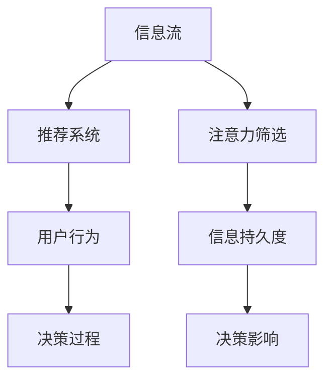

                 

# 注意力经济与个人消费决策的变化

在数字化时代，个人消费决策过程发生了深刻变化，这些变化受到“注意力经济”的影响尤为显著。文章将从“注意力经济”的核心概念出发，探讨其对个人消费行为和决策过程的影响，并展望未来的发展趋势和面临的挑战。

## 1. 背景介绍

### 1.1 问题由来

随着互联网和数字技术的迅猛发展，信息过载问题日益严重。个人每天都会接触到海量的信息流，如何从中筛选出最相关、最有价值的信息，成为了一个重要课题。“注意力经济”这一概念便应运而生，旨在探讨如何合理配置和分配个体的注意力资源，以提高信息消费的效率和效果。

### 1.2 问题核心关键点

- 注意力经济：指在信息过载的背景下，个人选择和分配注意力的过程。
- 信息筛选：消费者从海量的信息流中筛选出对自己有益的信息。
- 决策过程：消费者基于筛选的信息做出购买、使用等决策。
- 推荐系统：利用算法向用户推荐相关信息，辅助决策过程。
- 注意力持久度：信息对消费者注意力的保持和影响程度。

## 2. 核心概念与联系

### 2.1 核心概念概述

“注意力经济”的核心是信息筛选和决策过程。在这一过程中，消费者的注意力资源成为关键因素，而推荐系统则是利用算法帮助用户筛选信息、辅助决策的重要工具。

“注意力经济”与“个人消费决策”的联系在于，后者是在前者的基础上进行的。推荐系统通过对用户行为数据的分析，能够预测用户的兴趣和需求，从而提供更加个性化的信息，辅助用户做出更有信息量的决策。

### 2.2 核心概念原理和架构的 Mermaid 流程图



该图展示了“注意力经济”的基本流程：信息流通过推荐系统，经过注意力筛选后，影响用户的决策过程。同时，信息持久度对决策结果也有重要影响。

## 3. 核心算法原理 & 具体操作步骤

### 3.1 算法原理概述

推荐系统是一种利用算法向用户推荐相关信息，辅助其决策的技术。基于用户的行为数据和兴趣偏好，推荐系统通过协同过滤、内容推荐、混合推荐等算法，为用户定制个性化的信息流。

### 3.2 算法步骤详解

1. **数据收集**：收集用户的历史行为数据，包括浏览、购买、评价等行为。
2. **特征提取**：从行为数据中提取用户的兴趣特征，如浏览历史、购买记录、评价反馈等。
3. **算法建模**：利用协同过滤、内容推荐等算法构建推荐模型，预测用户对不同信息的偏好。
4. **推荐输出**：根据模型预测结果，向用户推荐相关信息，辅助决策。
5. **反馈循环**：根据用户的反馈数据，不断调整推荐算法，提高推荐效果。

### 3.3 算法优缺点

**优点**：
- 个性化强：推荐系统能够根据用户的历史行为，提供高度个性化的信息。
- 决策辅助：通过信息筛选，辅助用户做出更有信息量的决策。
- 提升效率：推荐系统能够显著提高用户获取信息的效率。

**缺点**：
- 信息过载：推荐系统可能导致信息过载，使消费者难以选择。
- 隐私问题：用户行为数据的收集和分析可能涉及隐私问题。
- 模型偏见：推荐算法的模型设计可能存在偏见，影响公平性。

### 3.4 算法应用领域

推荐系统广泛应用于电商、社交媒体、视频网站、新闻平台等多个领域。通过个性化推荐，提升用户体验，提高转化率和满意度。

## 4. 数学模型和公式 & 详细讲解 & 举例说明

### 4.1 数学模型构建

推荐系统通常采用协同过滤和基于内容的推荐算法。协同过滤算法包括基于用户的协同过滤和基于物品的协同过滤，前者通过用户之间的相似度，推荐相似用户喜欢的物品；后者通过物品之间的相似度，推荐相似物品。

### 4.2 公式推导过程

假设用户对物品 $i$ 的评分向量为 $\mathbf{r}_i$，物品向量为 $\mathbf{v}_i$。基于用户的协同过滤算法可以表示为：

$$
\hat{r}_{iu} = \mathbf{r}_u \cdot \mathbf{v}_i / (\|\mathbf{r}_u\| \cdot \|\mathbf{v}_i\|)
$$

其中，$\cdot$ 表示向量点乘，$\|\cdot\|$ 表示向量范数。

### 4.3 案例分析与讲解

以电商推荐系统为例，用户通过浏览、购买、评价等行为，生成评分数据。推荐系统通过协同过滤算法，计算用户对每个商品的评分预测，并根据预测结果进行推荐。

假设用户 $u$ 对商品 $i$ 的评分向量为 $[4, 2, 3]$，商品 $i$ 的向量为 $[1, 2, 3]$，则预测用户对商品 $i$ 的评分 $\hat{r}_{iu}$ 为：

$$
\hat{r}_{iu} = \frac{4 \times 1 + 2 \times 2 + 3 \times 3}{\sqrt{4^2 + 2^2 + 3^2} \times \sqrt{1^2 + 2^2 + 3^2}} = \frac{14}{5 \times 5} = 0.56
$$

根据预测评分，推荐系统将商品 $i$ 推荐给用户 $u$。

## 5. 项目实践：代码实例和详细解释说明

### 5.1 开发环境搭建

1. 安装 Python 3.8 和 pip：
   ```bash
   sudo apt-get update
   sudo apt-get install python3.8
   sudo apt-get install pip3.8
   ```

2. 安装推荐系统相关库：
   ```bash
   pip3 install scipy
   pip3 install numpy
   pip3 install pandas
   pip3 install scikit-learn
   ```

3. 安装 TensorFlow 和 TensorFlow Recommenders：
   ```bash
   pip3 install tensorflow
   pip3 install tensorflow-recommenders
   ```

### 5.2 源代码详细实现

以下是一个简单的基于协同过滤的推荐系统实现：

```python
import tensorflow as tf
from tensorflow_recommenders.layers import embedding, dot_product

# 定义协同过滤模型
class CollaborativeFiltering(tf.keras.Model):
    def __init__(self, num_users, num_items, embedding_dim):
        super(CollaborativeFiltering, self).__init__()
        self.user_embedding = embedding.Embedding(num_users, embedding_dim)
        self.item_embedding = embedding.Embedding(num_items, embedding_dim)
        self.dot_product = dot_product.DotProduct()

    def call(self, user, item):
        user_embedding = self.user_embedding(user)
        item_embedding = self.item_embedding(item)
        dot_product = self.dot_product(user_embedding, item_embedding)
        return dot_product

# 训练推荐模型
model = CollaborativeFiltering(num_users=1000, num_items=1000, embedding_dim=64)

# 定义损失函数和优化器
loss_fn = tf.keras.losses.MeanSquaredError()
optimizer = tf.keras.optimizers.Adam(learning_rate=0.01)

# 准备数据集
num_samples = 10000
train_data = tf.random.normal(shape=(num_samples, 2))
train_labels = tf.random.normal(shape=(num_samples, 1))

# 训练模型
for epoch in range(10):
    with tf.GradientTape() as tape:
        predictions = model(train_data[:, 0], train_data[:, 1])
        loss = loss_fn(predictions, train_labels)
    gradients = tape.gradient(loss, model.trainable_variables)
    optimizer.apply_gradients(zip(gradients, model.trainable_variables))

# 使用训练好的模型进行推荐
user_index = 0
item_index = 0
user_embedding = model.user_embedding(user_index)
item_embedding = model.item_embedding(item_index)
dot_product = model.dot_product(user_embedding, item_embedding)
predictions = dot_product.numpy()
print(predictions)
```

### 5.3 代码解读与分析

在上述代码中，我们定义了一个简单的协同过滤模型，包含用户嵌入层、物品嵌入层和点积层。模型通过预测用户对物品的评分，进行推荐。在训练过程中，我们使用随机生成的数据集进行训练，并使用Adam优化器进行模型更新。训练完成后，我们通过模型对指定的用户和物品进行评分预测。

## 6. 实际应用场景

### 6.1 电商推荐

电商推荐系统通过分析用户的历史购物行为，向用户推荐可能感兴趣的商品。推荐系统可以显著提升用户的购物体验，增加用户的复购率。

### 6.2 社交媒体推荐

社交媒体平台通过分析用户的兴趣和互动行为，向用户推荐可能感兴趣的内容。推荐系统不仅提高了用户的粘性，还提升了平台的流量和广告效果。

### 6.3 视频网站推荐

视频网站通过分析用户的观看历史和评分数据，向用户推荐可能感兴趣的视频。推荐系统能够提高用户的观看时长，增加网站的广告收入。

### 6.4 新闻平台推荐

新闻平台通过分析用户的阅读行为，向用户推荐可能感兴趣的新闻。推荐系统能够提高用户的阅读量，增加网站的流量和广告收入。

## 7. 工具和资源推荐

### 7.1 学习资源推荐

1. 《推荐系统实践》：介绍推荐系统的基本原理、算法和实现。
2. 《机器学习实战》：详细介绍了推荐系统在电商、社交媒体等领域的实际应用。
3. 《深度学习推荐系统》：介绍深度学习在推荐系统中的应用。
4. 《Python推荐系统》：使用Python实现推荐系统，包括协同过滤、基于内容的推荐等。

### 7.2 开发工具推荐

1. TensorFlow：强大的深度学习框架，提供了丰富的推荐系统库。
2. TensorFlow Recommenders：提供了多种推荐算法的实现。
3. PyTorch：灵活的深度学习框架，适用于推荐系统的开发。
4. Keras：简单易用的深度学习框架，适用于推荐系统的快速实现。

### 7.3 相关论文推荐

1. "A Survey on Matrix Factorization Techniques and Alternative Models in Recommender Systems"（J.doi.org/10.1002/9780470289957.ch4）：介绍矩阵分解在推荐系统中的应用。
2. "Collaborative Filtering for Implicit Feedback Datasets"（J.stanford.edu/cgi-bin/collection/cf）：介绍协同过滤算法在推荐系统中的应用。
3. "A Neural Approach for Collaborative Filtering"（J.arxiv.org/abs/1602.04378）：介绍神经网络在推荐系统中的应用。

## 8. 总结：未来发展趋势与挑战

### 8.1 研究成果总结

随着推荐系统的不断发展，其在电商、社交媒体、视频网站等领域得到了广泛应用。推荐系统通过分析用户行为数据，提供个性化的信息推荐，显著提升了用户体验和平台的价值。

### 8.2 未来发展趋势

1. 个性化推荐：随着算法的不断优化，推荐系统将更加精准地满足用户的个性化需求。
2. 多模态推荐：结合用户的多模态数据，如图片、视频等，提高推荐的准确性和多样性。
3. 冷启动问题：解决新用户和新物品的推荐问题，提升推荐系统的覆盖率。
4. 实效性推荐：实时更新推荐模型，确保推荐的即时性和相关性。

### 8.3 面临的挑战

1. 数据隐私：用户数据的收集和使用可能涉及隐私问题，需要采取相应的隐私保护措施。
2. 模型偏见：推荐算法的设计可能存在偏见，影响公平性。
3. 信息过载：推荐系统可能导致信息过载，使消费者难以选择。
4. 推荐鲁棒性：如何确保推荐系统在面对噪声数据和异常情况时依然能够稳健运行，是未来的研究方向。

### 8.4 研究展望

未来的推荐系统将更加注重个性化和实效性，通过结合多种数据源和多模态信息的融合，提供更加精准的推荐。同时，如何在保护隐私和确保推荐公平性之间找到平衡点，将是推荐系统面临的重要挑战。

## 9. 附录：常见问题与解答

**Q1: 推荐系统的算法有哪些？**

A: 推荐系统常见的算法包括协同过滤、基于内容的推荐、混合推荐、深度学习推荐等。

**Q2: 推荐系统在电商推荐中有哪些应用？**

A: 电商推荐系统通过分析用户的历史购物行为，向用户推荐可能感兴趣的商品。推荐系统可以显著提升用户的购物体验，增加用户的复购率。

**Q3: 推荐系统的优缺点有哪些？**

A: 推荐系统的优点包括个性化强、决策辅助、提升效率等；缺点包括信息过载、隐私问题、模型偏见等。

**Q4: 推荐系统如何使用深度学习？**

A: 深度学习可以通过神经网络模型，对用户行为数据进行建模，从而提高推荐的准确性和效果。

**Q5: 推荐系统在实际应用中需要注意哪些问题？**

A: 推荐系统需要注意数据隐私、模型偏见、信息过载、推荐鲁棒性等问题。

---

作者：禅与计算机程序设计艺术 / Zen and the Art of Computer Programming

