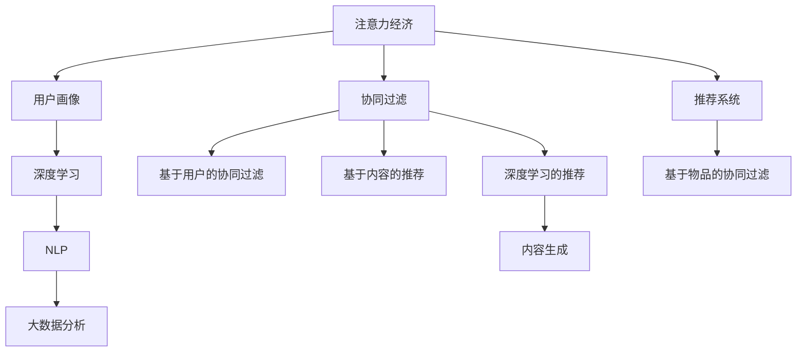

                 

# 注意力经济与个性化营销技术：为受众创建定制、有针对性的体验

在数字化时代，注意力成为一种稀缺资源，如何有效获取和利用用户注意力，是企业竞争的关键。个性化营销技术通过深度学习和自然语言处理，结合推荐系统和大数据技术，为受众提供定制化的体验，提高用户满意度和转化率。本文将深入探讨注意力经济与个性化营销技术的基本原理、核心算法和操作步骤，并结合实际案例进行详细分析，展望未来发展趋势，提供相关的学习资源、开发工具和研究论文推荐。

## 1. 背景介绍

### 1.1 问题由来

随着移动互联网和数字技术的迅猛发展，信息爆炸已成为不争的事实。海量的信息使消费者难以从中获取有价值的内容，注意力经济成为当前营销领域的焦点。如何吸引并保持用户的注意力，成为企业在数字化转型中面临的核心问题。

在过去的广告时代，企业依靠传统媒体和直接推销，以数量取胜。但这种策略越来越难以为继，消费者的注意力被分散到各种平台上，品牌曝光难度大。随着个性化和互动营销的兴起，企业需要深入了解用户需求，提供量身定制的内容和服务，才能在激烈的竞争中脱颖而出。

### 1.2 问题核心关键点

个性化营销技术是通过深度学习和大数据算法，对用户行为进行建模，分析其兴趣偏好和需求，从而推送最相关的内容和产品。其核心关键点包括：

- **用户画像构建**：通过对用户历史行为数据的分析，建立详细的用户画像，了解其兴趣、偏好和行为模式。
- **内容推荐算法**：使用协同过滤、基于内容的推荐、深度学习等算法，对用户画像进行建模，预测其最有可能感兴趣的内容。
- **效果评估和优化**：持续收集用户反馈和行为数据，实时评估推荐效果，优化推荐模型，提升用户体验和转化率。

这些关键点共同构成了一个完整的个性化营销技术框架，使得企业能够提供更加精准、有针对性的内容和服务。

## 2. 核心概念与联系

### 2.1 核心概念概述

为更好地理解个性化营销技术的原理和应用，本节将介绍几个核心概念及其之间的联系。

- **注意力经济**：指在信息过载的背景下，通过吸引和保持用户的注意力，实现商业价值的经济活动。注意力经济的核心在于通过精准、个性化地满足用户需求，提升用户满意度和忠诚度。

- **用户画像**：通过对用户行为数据的分析，构建用户的基本特征、兴趣偏好、行为模式等信息，形成详细的用户画像，用于指导内容推荐和市场营销策略。

- **协同过滤**：基于用户历史行为数据的相似度匹配，推荐用户可能感兴趣的其他内容或商品。协同过滤算法包括基于用户的协同过滤和基于物品的协同过滤。

- **推荐系统**：通过算法对用户画像进行分析，推荐符合用户兴趣的内容或商品。推荐系统是注意力经济的重要实现手段，广泛应用于电商、视频、音乐等平台。

- **深度学习**：通过神经网络模型对用户行为数据进行非线性建模，提升推荐的准确性和个性化程度。深度学习在个性化营销中的应用包括基于内容的推荐、协同过滤等。

- **自然语言处理(NLP)**：通过自然语言处理技术，从文本数据中提取和分析用户需求和情感信息，指导内容推荐和情感分析。

- **大数据分析**：通过大数据技术对用户行为数据进行存储、处理和分析，构建用户画像和推荐模型，提升营销效果。

这些核心概念通过一定的技术手段和算法框架，构建了一个完整的个性化营销技术体系，使得企业能够更好地利用用户注意力，实现商业价值。

### 2.2 核心概念原理和架构的 Mermaid 流程图



这个流程图展示了注意力经济、用户画像、协同过滤、推荐系统、深度学习、NLP和大数据分析之间的联系。注意力经济的核心在于利用用户注意力，通过用户画像构建、协同过滤、推荐系统、深度学习等技术手段，实现个性化内容的推荐，提升用户体验和商业价值。

## 3. 核心算法原理 & 具体操作步骤

### 3.1 算法原理概述

个性化营销技术的核心算法是推荐系统，其目的是根据用户的历史行为和兴趣，预测其未来可能感兴趣的内容。推荐系统主要包括基于内容的推荐、协同过滤和深度学习推荐三种方法。

1. **基于内容的推荐**：通过分析用户历史浏览、点击、购买等行为，提取用户最感兴趣的内容特征，将其与库中相似内容进行匹配推荐。

2. **协同过滤**：基于用户行为数据，通过相似用户或相似物品的推荐，进行内容推荐。协同过滤包括基于用户的协同过滤和基于物品的协同过滤。

3. **深度学习推荐**：通过神经网络模型对用户行为数据进行非线性建模，提升推荐的准确性和个性化程度。

### 3.2 算法步骤详解

**Step 1: 数据收集与预处理**

- 收集用户历史行为数据，包括浏览记录、点击记录、购买记录等。
- 对数据进行清洗和预处理，去除噪音和异常数据。

**Step 2: 用户画像构建**

- 通过数据挖掘和机器学习技术，构建用户画像，包含用户的基本信息、兴趣偏好、行为模式等。
- 对用户画像进行特征工程，提取有价值的信息，构建用户画像向量。

**Step 3: 推荐模型训练**

- 选择合适的推荐算法，如协同过滤、深度学习等。
- 使用用户画像向量作为输入，对推荐模型进行训练，优化模型参数。

**Step 4: 推荐结果排序**

- 对推荐结果进行排序，根据用户行为数据和模型预测结果，确定最相关的推荐内容。

**Step 5: 效果评估与优化**

- 收集用户反馈和行为数据，实时评估推荐效果。
- 根据评估结果，优化推荐模型和算法，提升用户体验和转化率。

### 3.3 算法优缺点

个性化营销技术的推荐系统具有以下优点：

- **精准性高**：通过深度学习和协同过滤等技术，能够精准地预测用户需求和偏好，提高推荐的准确性。
- **个性化强**：能够根据用户画像和行为数据，提供定制化的推荐内容，提升用户体验。
- **可扩展性好**：能够处理大规模数据，支持多用户、多物品推荐。

但同时也存在以下缺点：

- **数据依赖性强**：推荐系统的效果高度依赖于用户行为数据的质量和数量，缺乏数据的系统可能无法取得理想效果。
- **冷启动问题**：对于新用户或新物品，推荐系统可能无法提供有价值的内容，需要进行人工干预。
- **复杂度较高**：深度学习模型的复杂度较高，需要大量计算资源和时间进行训练和优化。

### 3.4 算法应用领域

个性化营销技术广泛应用于电商、社交媒体、视频平台等诸多领域，能够显著提升用户体验和转化率。

- **电商推荐系统**：根据用户浏览、购买记录，推荐最相关的商品。电商推荐系统是典型的大数据推荐系统，能够通过协同过滤、深度学习等技术，提升商品推荐效果。

- **社交媒体推荐系统**：根据用户浏览、点赞、评论等行为数据，推荐感兴趣的内容。社交媒体推荐系统需要处理海量的用户行为数据，使用协同过滤、深度学习等算法，提高内容推荐的准确性和个性化程度。

- **视频平台推荐系统**：根据用户观看历史、评分、评论等数据，推荐最相关的视频内容。视频平台推荐系统需要处理大量视频数据，使用协同过滤、深度学习等算法，提高推荐效果。

以上几个应用领域展示了个性化营销技术的广泛应用场景，不同领域的推荐系统在算法选择和模型优化方面存在一定的差异。

## 4. 数学模型和公式 & 详细讲解 & 举例说明

### 4.1 数学模型构建

基于内容的推荐系统主要使用朴素贝叶斯算法和协同过滤算法。下面以协同过滤算法为例，介绍其数学模型构建。

设用户画像向量为 $X \in \mathbb{R}^d$，物品特征向量为 $Y \in \mathbb{R}^d$，用户对物品的评分向量为 $R \in \mathbb{R}^{N \times M}$，其中 $N$ 为用户数量，$M$ 为物品数量。协同过滤的目标是最小化预测评分与实际评分的差异，即：

$$
\min_{\theta} ||R_{\theta} - R||_F^2
$$

其中 $R_{\theta} = WX + BY + D$，$W \in \mathbb{R}^{N \times d}$ 为用户画像权重矩阵，$B \in \mathbb{R}^{M \times d}$ 为物品特征权重矩阵，$D \in \mathbb{R}^{N \times M}$ 为常数矩阵，$\theta = (W, B, D)$ 为模型参数。

### 4.2 公式推导过程

对于基于用户的协同过滤算法，目标函数为：

$$
\min_{\theta} ||\hat{R} - R||_F^2
$$

其中 $\hat{R} = X^T W + Y^T B + D$，$X \in \mathbb{R}^{N \times d}$ 为用户画像向量，$Y \in \mathbb{R}^{M \times d}$ 为物品特征向量，$D \in \mathbb{R}^{N \times M}$ 为常数矩阵，$\theta = (W, B, D)$ 为模型参数。

对目标函数进行梯度下降优化，得到参数更新公式为：

$$
\theta \leftarrow \theta - \eta \frac{\partial \mathcal{L}(\theta)}{\partial \theta}
$$

其中 $\eta$ 为学习率。通过迭代优化，可以得到最小化目标函数的参数值。

### 4.3 案例分析与讲解

以电商推荐系统为例，其基本流程如下：

1. 收集用户浏览、购买、评分等行为数据。
2. 对数据进行预处理，去除噪音和异常数据。
3. 构建用户画像，提取用户的基本信息和兴趣偏好。
4. 构建物品特征向量，描述物品的属性和特点。
5. 使用协同过滤算法，对用户画像和物品特征进行匹配，预测用户对物品的评分。
6. 对推荐结果进行排序，选择最相关物品推荐给用户。

## 5. 项目实践：代码实例和详细解释说明

### 5.1 开发环境搭建

在进行个性化推荐系统的开发前，我们需要准备好开发环境。以下是使用Python进行PyTorch开发的环境配置流程：

1. 安装Anaconda：从官网下载并安装Anaconda，用于创建独立的Python环境。

2. 创建并激活虚拟环境：
```bash
conda create -n pytorch-env python=3.8 
conda activate pytorch-env
```

3. 安装PyTorch：根据CUDA版本，从官网获取对应的安装命令。例如：
```bash
conda install pytorch torchvision torchaudio cudatoolkit=11.1 -c pytorch -c conda-forge
```

4. 安装相关库：
```bash
pip install pandas numpy matplotlib scikit-learn
```

5. 安装Spark：用于大数据处理和机器学习，需要安装Spark及其依赖库。

6. 安装相关工具：
```bash
pip install jupyter notebook ipython
```

完成上述步骤后，即可在`pytorch-env`环境中开始个性化推荐系统的开发。

### 5.2 源代码详细实现

下面我们以电商推荐系统为例，给出使用PyTorch进行推荐算法开发的PyTorch代码实现。

首先，定义推荐系统的数据结构：

```python
import torch
from torch.nn import nn, Embedding, Linear, ReLU

class RecommendationSystem(nn.Module):
    def __init__(self, n_users, n_items, n_factors, n_neurons):
        super(RecommendationSystem, self).__init__()
        self.W = nn.Embedding(n_users, n_factors)
        self.B = nn.Embedding(n_items, n_factors)
        self.linear1 = Linear(n_factors * 2, n_neurons)
        self.linear2 = Linear(n_neurons, 1)
        
    def forward(self, user_embed, item_embed):
        user_item = self.W(user_embed) + self.B(item_embed)
        user_item = torch.cat([user_item, user_item], dim=1)
        user_item = ReLU(self.linear1(user_item))
        prediction = torch.sigmoid(self.linear2(user_item))
        return prediction
```

然后，定义数据集和推荐算法：

```python
import numpy as np
from sklearn.datasets import make_blobs
from sklearn.metrics import mean_absolute_error

def generate_data(n_users, n_items, n_factors, n_neurons):
    X, Y = make_blobs(n_samples=n_users * n_items, n_features=n_factors, random_state=42)
    user_index = np.random.randint(0, n_users, n_items)
    item_index = np.random.randint(0, n_items, n_items)
    R = np.dot(X[user_index], X[item_index].T)
    R = R / np.sqrt(n_factors)
    R = (R - np.mean(R)) / np.std(R)
    return R, user_index, item_index

n_users = 1000
n_items = 1000
n_factors = 50
n_neurons = 100

R, user_index, item_index = generate_data(n_users, n_items, n_factors, n_neurons)
```

接着，训练推荐模型：

```python
from torch.utils.data import TensorDataset, DataLoader
from torch.optim import Adam

# 定义模型
model = RecommendationSystem(n_users, n_items, n_factors, n_neurons)

# 定义优化器
optimizer = Adam(model.parameters(), lr=0.01)

# 定义数据集
train_dataset = TensorDataset(torch.tensor(R), torch.tensor(user_index), torch.tensor(item_index))
test_dataset = TensorDataset(torch.tensor(R), torch.tensor(user_index), torch.tensor(item_index))

# 定义训练循环
for epoch in range(100):
    model.train()
    for user_index, item_index in train_dataset:
        optimizer.zero_grad()
        user_embed = torch.tensor(user_index)
        item_embed = torch.tensor(item_index)
        prediction = model(user_embed, item_embed)
        loss = nn.MSELoss()(prediction, torch.tensor(R[user_index, item_index]))
        loss.backward()
        optimizer.step()
        
    # 每10个epoch输出一次测试集误差
    if epoch % 10 == 0:
        model.eval()
        test_loss = []
        for user_index, item_index in test_dataset:
            user_embed = torch.tensor(user_index)
            item_embed = torch.tensor(item_index)
            prediction = model(user_embed, item_embed)
            loss = nn.MSELoss()(prediction, torch.tensor(R[user_index, item_index]))
            test_loss.append(loss.item())
        
        print("Epoch {}, Test Loss: {:.4f}".format(epoch, np.mean(test_loss)))
```

最后，评估推荐模型：

```python
from sklearn.metrics import mean_absolute_error

# 计算测试集误差
model.eval()
test_loss = []
for user_index, item_index in test_dataset:
    user_embed = torch.tensor(user_index)
    item_embed = torch.tensor(item_index)
    prediction = model(user_embed, item_embed)
    loss = nn.MSELoss()(prediction, torch.tensor(R[user_index, item_index]))
    test_loss.append(loss.item())

print("Test Loss: {:.4f}".format(np.mean(test_loss)))
```

以上就是使用PyTorch对推荐系统进行开发的完整代码实现。可以看到，在数据生成、模型定义、训练和评估等方面，PyTorch提供了非常强大的支持和便利。

### 5.3 代码解读与分析

让我们再详细解读一下关键代码的实现细节：

**RecommendationSystem类**：
- `__init__`方法：定义模型结构，包括用户画像和物品特征的嵌入层、两个线性层和ReLU激活函数。
- `forward`方法：定义前向传播过程，将用户画像和物品特征进行匹配，并通过多层神经网络得到预测评分。

**generate_data函数**：
- 使用Scikit-learn生成随机数据，生成用户-物品评分矩阵。
- 对数据进行标准化处理，确保数据符合模型要求。

**训练循环**：
- 在每个epoch内，对训练集数据进行迭代，计算损失函数，更新模型参数。
- 每10个epoch输出一次测试集误差，监控模型训练效果。
- 在训练完成后，计算测试集误差，评估模型效果。

可以看到，通过PyTorch的灵活和强大，我们可以用相对简洁的代码实现推荐系统模型的训练和评估。当然，在实际应用中，还需要针对具体场景进行优化和改进，如模型裁剪、模型并行、数据增强等，才能进一步提升模型的性能和效率。

## 6. 实际应用场景

### 6.1 智能客服系统

基于个性化推荐技术的智能客服系统，能够根据用户的历史咨询记录和当前问题，快速推荐最相关的答案或服务流程。智能客服系统能够24小时不间断服务，提升客户满意度，减少人力成本。

在技术实现上，可以收集用户的历史咨询记录和问题，构建用户画像，使用协同过滤或深度学习等算法进行推荐。系统根据推荐结果，动态生成应答或服务流程，提升服务质量。

### 6.2 在线教育平台

在线教育平台可以通过个性化推荐技术，根据学生的学习历史、测试成绩和兴趣偏好，推荐最适合的课程和学习材料。个性化推荐技术能够帮助学生发现适合自己的学习内容，提升学习效果。

在技术实现上，可以收集学生的学习数据和行为数据，构建详细的用户画像，使用协同过滤或深度学习等算法进行推荐。平台根据推荐结果，推荐最相关的课程和学习材料，提升学生学习体验。

### 6.3 电商推荐系统

电商推荐系统能够根据用户的历史浏览、购买记录，推荐最相关的商品。推荐系统能够提升用户购物体验，增加用户粘性和购买转化率。

在技术实现上，可以收集用户的历史数据和行为数据，构建详细的用户画像，使用协同过滤或深度学习等算法进行推荐。系统根据推荐结果，推荐最相关的商品，提升用户购物体验。

### 6.4 未来应用展望

随着个性化推荐技术的不断进步，未来的推荐系统将更加智能和高效，能够更好地利用用户注意力，提升用户体验和商业价值。以下是几个未来应用的展望：

1. **跨领域推荐**：未来的推荐系统能够跨领域进行推荐，将不同领域的内容和产品进行关联，提升推荐效果。例如，将音乐推荐与电影推荐进行关联，提升用户的多样化体验。

2. **实时推荐**：未来的推荐系统能够实时进行推荐，根据用户当前的即时行为数据，实时调整推荐内容。例如，根据用户在视频平台的即时浏览记录，实时推荐相关视频内容。

3. **多模态推荐**：未来的推荐系统能够融合视觉、听觉、文本等多种模态的数据，进行综合推荐。例如，将视频推荐与文本推荐进行融合，提升推荐效果。

4. **个性化广告**：未来的推荐系统能够根据用户的兴趣和行为数据，实时推荐个性化的广告内容，提升广告效果和用户体验。

## 7. 工具和资源推荐

### 7.1 学习资源推荐

为了帮助开发者系统掌握个性化推荐技术的理论基础和实践技巧，这里推荐一些优质的学习资源：

1. 《推荐系统实战》书籍：详细介绍了推荐系统的基本原理、算法和应用，适合初学者和进阶者。

2. 《深度学习》书籍：介绍了深度学习的基本原理和应用，推荐系统中深度学习算法的讲解非常详细。

3. 《推荐系统》课程：斯坦福大学开设的推荐系统课程，涵盖推荐系统理论和算法，适合深入学习。

4. Kaggle：数据科学和机器学习竞赛平台，推荐系统相关的竞赛和数据集，适合实践练习。

5. Udacity推荐系统纳米学位：在线学习平台，提供推荐系统的理论和实践课程，适合系统学习。

通过对这些资源的学习实践，相信你一定能够快速掌握个性化推荐技术的精髓，并用于解决实际的推荐问题。

### 7.2 开发工具推荐

高效的开发离不开优秀的工具支持。以下是几款用于推荐系统开发的常用工具：

1. PyTorch：基于Python的开源深度学习框架，灵活动态的计算图，适合快速迭代研究。

2. TensorFlow：由Google主导开发的开源深度学习框架，生产部署方便，适合大规模工程应用。

3. Scikit-learn：Python科学计算库，提供简单易用的机器学习算法和工具，适合推荐系统的特征工程和模型训练。

4. Apache Spark：大数据处理引擎，适合推荐系统的大数据处理和分布式计算。

5. Apache Flink：高性能流处理引擎，适合实时推荐系统的构建。

6. Jupyter Notebook：交互式开发环境，适合数据分析和模型训练。

合理利用这些工具，可以显著提升推荐系统的开发效率，加快创新迭代的步伐。

### 7.3 相关论文推荐

个性化推荐技术的不断发展得益于学界的持续研究。以下是几篇奠基性的相关论文，推荐阅读：

1. Matrix Factorization Techniques for Recommender Systems：提出基于矩阵分解的推荐算法，为推荐系统奠定了基础。

2. Collective Matrix Factorization：提出基于协同过滤的推荐算法，通过用户-物品矩阵进行推荐。

3. Deep Recommendations Using Deep Learning：介绍深度学习在推荐系统中的应用，提升推荐准确性和个性化程度。

4. Multi-Task Learning for Recommendation with Side Information：提出多任务学习框架，融合多种信息进行推荐，提升推荐效果。

5. TensorFlow Recommenders：TensorFlow官方推荐系统工具库，提供多种推荐算法和工具，适合实际应用开发。

这些论文代表了个性化推荐技术的进展脉络。通过学习这些前沿成果，可以帮助研究者把握学科前进方向，激发更多的创新灵感。

## 8. 总结：未来发展趋势与挑战

### 8.1 总结

本文对基于深度学习和大数据技术的个性化推荐技术进行了全面系统的介绍。首先阐述了个性化推荐技术在数字化经济中的重要性，明确了推荐系统的核心原理和操作步骤。其次，从原理到实践，详细讲解了推荐系统的数学模型和算法实现，给出了推荐系统开发的完整代码实例。同时，本文还广泛探讨了推荐系统在智能客服、在线教育、电商等多个领域的应用前景，展示了推荐技术在多个场景下的广阔应用空间。此外，本文精选了推荐技术的各类学习资源，力求为读者提供全方位的技术指引。

通过本文的系统梳理，可以看到，基于深度学习和大数据技术的个性化推荐系统正在成为企业数字化转型的重要工具，极大地提升了用户满意度、体验和转化率。未来，伴随推荐技术的不断发展，推荐系统将更加智能和高效，在更多领域大放异彩，为数字化经济的增长注入新的动力。

### 8.2 未来发展趋势

展望未来，个性化推荐技术将呈现以下几个发展趋势：

1. **跨领域推荐**：未来的推荐系统能够跨领域进行推荐，将不同领域的内容和产品进行关联，提升推荐效果。

2. **实时推荐**：未来的推荐系统能够实时进行推荐，根据用户当前的即时行为数据，实时调整推荐内容。

3. **多模态推荐**：未来的推荐系统能够融合视觉、听觉、文本等多种模态的数据，进行综合推荐。

4. **个性化广告**：未来的推荐系统能够根据用户的兴趣和行为数据，实时推荐个性化的广告内容，提升广告效果和用户体验。

5. **内容生成**：未来的推荐系统能够根据用户的行为数据，生成更加个性化、多样化的内容，提升用户的多样化体验。

6. **可解释性**：未来的推荐系统能够提供更加透明、可解释的推荐过程，提升用户信任和满意度。

以上趋势凸显了个性化推荐技术的广阔前景。这些方向的探索发展，必将进一步提升推荐系统的性能和应用范围，为数字化经济的增长注入新的动力。

### 8.3 面临的挑战

尽管个性化推荐技术已经取得了瞩目成就，但在迈向更加智能化、普适化应用的过程中，它仍面临诸多挑战：

1. **冷启动问题**：对于新用户或新物品，推荐系统可能无法提供有价值的内容，需要进行人工干预。

2. **数据依赖性强**：推荐系统的效果高度依赖于用户行为数据的质量和数量，缺乏数据的系统可能无法取得理想效果。

3. **隐私保护**：收集和处理用户数据时，需要注意隐私保护，确保数据安全。

4. **计算资源消耗**：深度学习推荐模型的复杂度较高，需要大量计算资源和时间进行训练和优化。

5. **模型泛化能力**：在实际应用中，推荐模型需要具备良好的泛化能力，避免过拟合和泛化能力不足的问题。

6. **用户行为建模**：建立准确的、多维度的用户行为模型是推荐系统的核心，需要结合多种数据源进行建模。

正视推荐面临的这些挑战，积极应对并寻求突破，将是个性化推荐技术走向成熟的必由之路。相信随着学界和产业界的共同努力，这些挑战终将一一被克服，推荐系统必将在构建智慧商业生态中扮演越来越重要的角色。

### 8.4 研究展望

面对个性化推荐技术所面临的挑战，未来的研究需要在以下几个方面寻求新的突破：

1. **融合多源数据**：结合多种数据源，如社交网络数据、文本数据、图像数据等，建立更加全面、准确的用户行为模型。

2. **引入先验知识**：将符号化的先验知识，如知识图谱、逻辑规则等，与神经网络模型进行巧妙融合，引导推荐过程学习更准确、合理的用户行为模型。

3. **多任务学习**：结合多个任务，如推荐、情感分析、内容生成等，进行联合训练，提升推荐系统的综合性能。

4. **实时学习**：引入在线学习算法，能够实时更新推荐模型，适应用户行为的变化。

5. **用户可控性**：增加用户对推荐结果的可控性，提供个性化推荐界面，让用户自行调整推荐策略。

6. **隐私保护**：引入隐私保护算法，确保用户数据的安全和隐私保护。

这些研究方向的探索，必将引领个性化推荐技术迈向更高的台阶，为构建智慧商业生态提供新的技术路径。面向未来，个性化推荐技术还需要与其他人工智能技术进行更深入的融合，如知识表示、因果推理、强化学习等，多路径协同发力，共同推动智慧商业的发展。

## 9. 附录：常见问题与解答

**Q1：个性化推荐技术有哪些优点？**

A: 个性化推荐技术的优点主要包括：

1. **精准性高**：通过深度学习和协同过滤等技术，能够精准地预测用户需求和偏好，提高推荐的准确性。

2. **个性化强**：能够根据用户画像和行为数据，提供定制化的推荐内容，提升用户体验。

3. **可扩展性好**：能够处理大规模数据，支持多用户、多物品推荐。

4. **实时性好**：能够实时进行推荐，根据用户当前的即时行为数据，实时调整推荐内容。

5. **多模态融合**：能够融合视觉、听觉、文本等多种模态的数据，进行综合推荐。

**Q2：个性化推荐技术的推荐系统有哪些类型？**

A: 个性化推荐技术的推荐系统主要包括以下几种类型：

1. **基于内容的推荐**：通过分析用户历史行为数据，提取用户最感兴趣的内容特征，将其与库中相似内容进行匹配推荐。

2. **协同过滤推荐**：基于用户行为数据，通过相似用户或相似物品的推荐，进行内容推荐。

3. **深度学习推荐**：通过神经网络模型对用户行为数据进行非线性建模，提升推荐的准确性和个性化程度。

4. **混合推荐**：结合多种推荐算法，综合多种信息进行推荐，提升推荐效果。

**Q3：个性化推荐技术面临哪些挑战？**

A: 个性化推荐技术面临的主要挑战包括：

1. **冷启动问题**：对于新用户或新物品，推荐系统可能无法提供有价值的内容，需要进行人工干预。

2. **数据依赖性强**：推荐系统的效果高度依赖于用户行为数据的质量和数量，缺乏数据的系统可能无法取得理想效果。

3. **隐私保护**：收集和处理用户数据时，需要注意隐私保护，确保数据安全。

4. **计算资源消耗**：深度学习推荐模型的复杂度较高，需要大量计算资源和时间进行训练和优化。

5. **模型泛化能力**：在实际应用中，推荐模型需要具备良好的泛化能力，避免过拟合和泛化能力不足的问题。

6. **用户行为建模**：建立准确的、多维度的用户行为模型是推荐系统的核心，需要结合多种数据源进行建模。

**Q4：如何优化个性化推荐系统的推荐效果？**

A: 优化个性化推荐系统的推荐效果可以从以下几个方面进行：

1. **数据收集和处理**：收集和处理更多、更准确的用户行为数据，进行数据清洗和预处理，提升数据质量。

2. **模型选择和优化**：选择合适的推荐算法和模型，进行模型调参和优化，提升推荐效果。

3. **特征工程**：进行特征提取和特征工程，提升特征表达能力和模型性能。

4. **实时学习**：引入在线学习算法，能够实时更新推荐模型，适应用户行为的变化。

5. **多模态融合**：融合多种数据源，如社交网络数据、文本数据、图像数据等，提升推荐系统的综合性能。

6. **隐私保护**：采用隐私保护算法，确保用户数据的安全和隐私保护。

以上方法可以结合具体应用场景，灵活应用，进一步提升推荐系统的推荐效果。

---

作者：禅与计算机程序设计艺术 / Zen and the Art of Computer Programming

