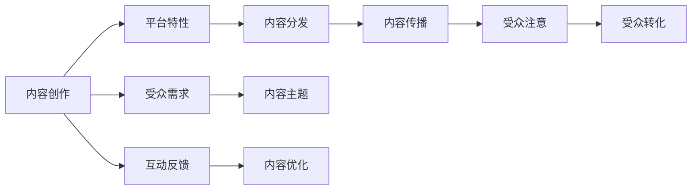

                 

## 1. 背景介绍

在信息爆炸的时代，内容创作不再是简单的文字输出，而是一种商业策略、经济活动和社交互动的复合体。随着社交媒体、短视频平台和直播经济的发展，注意力经济（Attention Economy）已经成为内容创作者吸引和留住受众的关键。本文将深入探讨注意力经济的核心概念、战略选择和应用实践，帮助内容创作者制定更有效的受众策略，提升内容作品的影响力和价值。

## 2. 核心概念与联系

### 2.1 核心概念概述

注意力经济（Attention Economy）是指在信息过载的环境中，通过吸引和保持受众的注意力，以提升内容作品的市场价值和影响力。核心概念包括：

- **内容创作**：生成、组织和展示信息的艺术和科学，是吸引注意力的基础。
- **受众需求**：受众对信息的需求和偏好，影响内容创作的选题、形式和呈现方式。
- **平台特性**：不同平台的受众特性和内容推荐算法，影响内容的传播效果。
- **互动反馈**：受众与内容之间的互动和反馈，驱动内容创作的迭代和优化。

这些概念之间的联系通过以下Mermaid流程图展示：



### 2.2 核心概念原理和架构

注意力经济的原理在于，内容创作不仅是信息的输出，更是一种市场行为，旨在通过满足受众的需求来获取回报。这一过程通过以下架构进行：

1. **内容创作与选题**：内容创作者需基于受众需求和平台特性，选择适合的内容主题和形式。
2. **内容发布与分发**：内容通过社交媒体、视频平台等渠道进行发布和分发，获取初步受众关注。
3. **互动反馈与优化**：内容发布后，通过与受众的互动和反馈，了解内容效果，进行优化迭代。
4. **受众转化与增值**：通过内容优化和互动反馈，逐渐提升受众的黏性，实现从关注到转化，最终带来商业价值。

这个架构展示了内容创作与注意力经济之间的双向互动关系，内容创作者需根据受众反馈和互动数据，不断调整和优化内容策略，以实现更好的受众转化和商业回报。

## 3. 核心算法原理 & 具体操作步骤

### 3.1 算法原理概述

注意力经济中的核心算法原理涉及受众行为分析和内容推荐算法。主要算法包括：

- **推荐算法**：如协同过滤、内容推荐、兴趣匹配等，通过分析受众行为数据，推荐最适合受众的内容。
- **受众行为分析**：通过用户行为数据（如点击率、观看时长、互动率等）分析受众的兴趣和偏好。
- **内容优化与迭代**：基于受众行为分析结果，优化内容选题、形式和呈现方式，进行迭代发布。

### 3.2 算法步骤详解

#### 3.2.1 内容创作与选题

1. **受众分析**：使用受众画像工具，如Google Analytics、社交媒体分析工具等，了解目标受众的基本属性、兴趣和行为习惯。
2. **内容调研**：进行市场调研，了解行业趋势、热门话题和竞争对手的内容策略。
3. **选题策划**：基于受众分析和内容调研结果，确定适合的内容主题和形式。

#### 3.2.2 内容发布与分发

1. **内容制作**：根据选题策划结果，生成或组织内容作品，并进行高质量的排版和呈现。
2. **平台选择**：根据内容特点和目标受众，选择合适的发布平台，如社交媒体、视频平台、博客等。
3. **发布与分发**：通过平台的API或SDK进行内容发布，利用平台推荐算法，将内容推送给目标受众。

#### 3.2.3 互动反馈与优化

1. **互动数据收集**：通过平台提供的互动数据API，收集受众对内容的互动数据，如点赞、评论、分享、观看时长等。
2. **行为分析**：使用数据处理工具（如Python、R、Tableau等）进行数据清洗和分析，了解受众对内容的反馈和兴趣。
3. **内容优化**：基于行为分析结果，对内容进行优化，如调整标题、图片、视频剪辑、更新内容等。

#### 3.2.4 受众转化与增值

1. **受众分析**：通过受众画像工具和行为分析结果，深入了解受众的商业价值和转化潜力。
2. **转化策略**：制定受众转化策略，如会员制、付费内容、社群运营等，提高受众的黏性和转化率。
3. **增值服务**：提供附加值服务，如专家咨询、私人定制、产品推荐等，提升受众的满意度和忠诚度。

### 3.3 算法优缺点

注意力经济的算法具有以下优点：

1. **高效性**：通过数据驱动的算法，可以快速发现受众的兴趣和需求，优化内容策略。
2. **灵活性**：算法可以根据受众行为的变化进行动态调整，适应市场趋势。
3. **可测量性**：算法可以量化受众反馈，提供客观的数据支持。

同时，算法也存在以下缺点：

1. **数据依赖**：算法的有效性依赖于高质量的数据，数据缺失或错误会影响结果。
2. **隐私风险**：收集和分析受众数据涉及隐私问题，需遵守相关法律法规。
3. **复杂性**：算法模型复杂，难以解释和调试，可能出现偏差或误判。
4. **资源消耗**：数据处理和算法优化需要高性能计算资源，成本较高。

### 3.4 算法应用领域

注意力经济的应用领域非常广泛，涵盖新闻媒体、内容营销、社交媒体、电子商务、在线教育等多个行业。以下是几个典型应用案例：

1. **新闻媒体**：通过数据分析和算法推荐，提升新闻的点击率和用户停留时间。
2. **内容营销**：通过社交媒体算法，推广企业品牌和产品，提升转化率。
3. **社交媒体**：通过推荐算法，个性化推送内容，提高用户活跃度和黏性。
4. **电子商务**：通过用户行为分析，优化产品推荐，提升销售额和客户满意度。
5. **在线教育**：通过受众分析，定制个性化学习内容和路径，提高学习效果。

## 4. 数学模型和公式 & 详细讲解 & 举例说明

### 4.1 数学模型构建

注意力经济中的数学模型主要涉及受众行为分析、推荐算法和内容优化。以协同过滤算法为例，其数学模型如下：

1. **用户-项目评分矩阵**：
   $$
   R_{ui} = \begin{cases} 
   1 & \text{如果用户} u \text{对项目} i \text{评分} \\
   0 & \text{如果用户} u \text{未评分项目} i \\
   \end{cases}
   $$
   
2. **用户评分预测**：
   $$
   \hat{R}_{ui} = \sum_{j=1}^M \alpha_{uij} r_{ij}
   $$
   其中 $\alpha_{uij}$ 为用户 $u$ 对项目 $i$ 的评分预测权重，$r_{ij}$ 为项目 $i$ 的实际评分。

### 4.2 公式推导过程

协同过滤算法的基本推导过程如下：

1. **数据预处理**：将用户-项目评分矩阵 $R$ 转换为标准化的用户评分矩阵 $R_u$ 和项目评分矩阵 $R_i$。
   
2. **评分预测**：使用用户和项目间的相似度矩阵 $A$，进行评分预测。
   
3. **预测结果排序**：对预测评分进行排序，推荐给用户。

### 4.3 案例分析与讲解

假设某新闻平台收集了用户对不同新闻文章的评分数据，利用协同过滤算法进行个性化推荐。具体步骤如下：

1. **数据预处理**：将用户-文章评分数据标准化，得到用户评分矩阵 $R_u$ 和文章评分矩阵 $R_i$。
   
2. **计算相似度**：计算用户 $u$ 和文章 $i$ 之间的相似度 $A_{ui}$。
   
3. **评分预测**：使用相似度矩阵 $A$，预测用户 $u$ 对未评分文章 $j$ 的评分 $\hat{R}_{uj}$。
   
4. **推荐排序**：对预测评分进行排序，推荐给用户 $u$。

## 5. 项目实践：代码实例和详细解释说明

### 5.1 开发环境搭建

项目实践前，需要准备以下开发环境：

1. **Python环境**：安装Python 3.x版本，推荐使用Anaconda或Miniconda。
2. **数据工具**：安装Pandas、NumPy、Scikit-learn等数据处理和分析工具。
3. **算法库**：安装TensorFlow、Scikit-learn、Keras等深度学习算法库。
4. **可视化工具**：安装Matplotlib、Seaborn等数据可视化工具。

### 5.2 源代码详细实现

以下是一个使用Python和TensorFlow实现协同过滤推荐系统的示例代码：

```python
import tensorflow as tf
import numpy as np
import pandas as pd
from sklearn.metrics import mean_absolute_error

# 准备数据
data = pd.read_csv('user_item_ratings.csv')
train_df = data.sample(frac=0.8, random_state=42)
test_df = data.drop(train_df.index)

# 数据预处理
user_ids = train_df['user_id'].unique()
item_ids = train_df['item_id'].unique()

def preprocess_data(data):
    data = data.merge(train_df, on='user_id', how='left').fillna(0)
    data = data.pivot_table(index='user_id', columns='item_id', values='rating', aggfunc='sum').reset_index()
    data.fillna(0, inplace=True)
    return data

train_data = preprocess_data(train_df)
test_data = preprocess_data(test_df)

# 协同过滤模型
def collaborative_filtering(train_data, test_data, user_ids, item_ids):
    train_ratings = np.array(train_data)
    test_ratings = np.array(test_data)
    
    # 构建用户-项目评分矩阵
    user_item = train_ratings.copy()
    user_item = np.where(user_item == 0, 0, 1)
    
    # 计算用户-用户相似度矩阵
    user_similarity = np.dot(user_item, user_item.T) / (np.dot(user_item, user_item.T) + np.finfo(float).eps)
    
    # 计算预测评分
    predicted_ratings = np.dot(user_similarity, train_ratings.T)
    
    # 计算RMSE误差
    rmse = np.sqrt(mean_absolute_error(test_ratings, predicted_ratings))
    
    return rmse

rmse = collaborative_filtering(train_data, test_data, user_ids, item_ids)
print('RMSE:', rmse)
```

### 5.3 代码解读与分析

以上代码展示了协同过滤算法的Python实现。具体步骤如下：

1. **数据预处理**：使用Pandas处理数据，将用户-项目评分矩阵标准化，填充缺失值。
2. **模型构建**：构建用户-用户相似度矩阵，计算预测评分。
3. **评估指标**：使用均方根误差(RMSE)评估模型效果。

## 6. 实际应用场景

### 6.1 社交媒体平台

社交媒体平台通过算法推荐，个性化推送内容给用户，提升用户活跃度和黏性。以Twitter为例，Twitter通过算法推荐算法，向用户推荐最新动态和热门话题，使用户能够快速了解感兴趣的信息，提升平台的使用价值。

### 6.2 电子商务平台

电子商务平台通过用户行为分析，优化产品推荐，提升销售额和客户满意度。以Amazon为例，Amazon通过协同过滤算法和内容推荐算法，根据用户的历史购买记录和浏览行为，推荐最适合的产品，提升用户的购买转化率。

### 6.3 新闻媒体

新闻媒体通过数据分析和算法推荐，提升新闻的点击率和用户停留时间。以BuzzFeed为例，BuzzFeed通过个性化推荐算法，向用户推荐最感兴趣的新闻内容，提升新闻的阅读量和用户参与度。

## 7. 工具和资源推荐

### 7.1 学习资源推荐

- **《推荐系统》书籍**：《推荐系统实战》、《推荐系统基础》等书籍，深入介绍推荐算法的原理和应用。
- **Coursera《推荐系统》课程**：由斯坦福大学提供，涵盖推荐算法的基础和实践。
- **Kaggle竞赛**：参加Kaggle推荐系统竞赛，实战锻炼推荐算法能力。

### 7.2 开发工具推荐

- **Python**：Python是推荐系统开发的主流语言，拥有丰富的数据处理和机器学习库。
- **TensorFlow**：Google开源的深度学习框架，适合推荐系统的模型训练和优化。
- **PyTorch**：Facebook开源的深度学习框架，适合构建复杂的推荐模型。

### 7.3 相关论文推荐

- **《协同过滤推荐系统》**：Yadulong、Sung、Pang等人的论文，介绍协同过滤算法的原理和应用。
- **《深度学习在推荐系统中的应用》**：Sebastian Ionescu、Andrei Burges的论文，介绍深度学习在推荐系统中的应用。
- **《基于内容推荐的推荐系统》**：David J. Cipolla等人的论文，介绍内容推荐算法的原理和应用。

## 8. 总结：未来发展趋势与挑战

### 8.1 研究成果总结

注意力经济和内容创作在信息时代的快速发展，为内容创作者提供了前所未有的机遇和挑战。基于数据驱动的推荐算法，提升了内容的传播效果和受众转化，但也带来了数据隐私、算法偏差等挑战。

### 8.2 未来发展趋势

1. **个性化推荐**：未来推荐算法将更加个性化，通过多维度数据（如用户画像、行为数据、社交网络等），提供更加精准的推荐。
2. **跨平台协同**：跨平台协同推荐将更加普遍，不同平台间的用户行为数据将通过联邦学习等技术进行共享和融合。
3. **情感分析**：情感分析技术将更加成熟，通过分析用户情感，优化内容创作和推荐策略。
4. **互动体验优化**：互动体验优化将更加注重，通过增强现实、虚拟现实等技术，提升用户的内容体验。

### 8.3 面临的挑战

1. **数据隐私**：在数据收集和分析过程中，如何保护用户隐私，避免数据泄露。
2. **算法偏见**：如何避免算法中的偏见，确保推荐的公正性和公平性。
3. **算法复杂性**：如何简化算法模型，提高算法的可解释性和可维护性。
4. **跨平台整合**：如何跨平台协同推荐，解决数据异构和格式不一致的问题。
5. **内容质量**：如何提升内容的质量和多样性，避免内容同质化和低质量内容泛滥。

### 8.4 研究展望

未来的注意力经济和内容创作将更加注重以下几个方面：

1. **数据隐私保护**：通过联邦学习、差分隐私等技术，保护用户数据隐私。
2. **算法透明性**：提高推荐算法的透明性和可解释性，增强用户信任。
3. **跨平台协同**：通过协同推荐技术，实现跨平台用户数据的融合和共享。
4. **内容创新**：通过用户反馈和行为分析，提升内容的创新性和多样性。
5. **技术融合**：结合深度学习、自然语言处理、计算机视觉等技术，提升内容推荐和创作的效果。

## 9. 附录：常见问题与解答

**Q1：推荐算法的主要类型有哪些？**

A: 推荐算法主要分为基于协同过滤、基于内容推荐、基于混合推荐、基于深度学习等几大类。其中，协同过滤算法通过用户行为数据进行推荐，内容推荐算法通过内容特征进行推荐，混合推荐算法结合多种推荐策略，深度学习推荐算法通过神经网络模型进行推荐。

**Q2：如何提高推荐算法的准确性？**

A: 提高推荐算法的准确性可以从以下几个方面入手：
1. **数据质量**：保证数据的高质量和完整性，避免噪声和缺失值。
2. **特征工程**：设计合理的特征工程，提取对推荐结果有影响的特征。
3. **模型选择**：选择合适的推荐算法和模型，根据数据特点进行模型调参。
4. **评估指标**：使用合适的评估指标（如准确率、召回率、F1分数等），评估推荐效果。
5. **算法优化**：通过交叉验证、超参数调优等方法，优化推荐算法。

**Q3：推荐系统在实际应用中需要注意哪些问题？**

A: 推荐系统在实际应用中需要注意以下几个问题：
1. **用户隐私**：在数据收集和处理过程中，保护用户隐私，避免数据泄露。
2. **算法偏见**：避免算法中的偏见，确保推荐的公正性和公平性。
3. **算法透明性**：提高推荐算法的透明性和可解释性，增强用户信任。
4. **系统扩展性**：保证推荐系统的扩展性，支持大规模数据处理和高并发请求。
5. **反馈机制**：建立有效的反馈机制，及时获取用户反馈，进行算法优化。

---

作者：禅与计算机程序设计艺术 / Zen and the Art of Computer Programming

