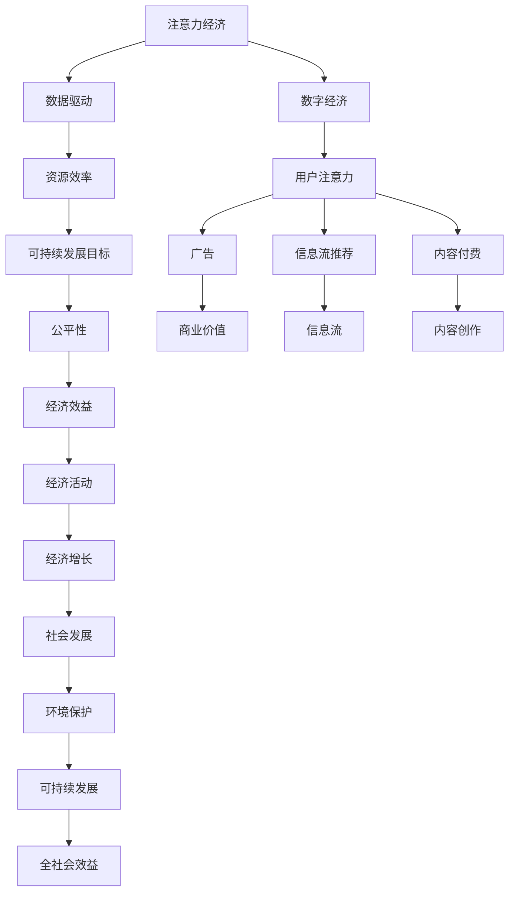

                 

# 注意力经济与可持续发展目标的融合

> 关键词：注意力经济,可持续发展目标,经济系统,公平性,资源效率,技术创新,数据驱动

## 1. 背景介绍

### 1.1 问题由来

随着互联网和数字技术的飞速发展，注意力经济日益成为全球经济的重要组成部分。搜索引擎、社交媒体、新闻平台等，通过吸引和利用用户注意力获取商业价值，催生了大量的数字广告、信息流推荐、内容付费等新经济模式。然而，注意力经济在带来巨大商业利益的同时，也引发了一系列社会和环境问题，如信息过载、隐私侵害、社会分化等。

与此同时，可持续发展目标（Sustainable Development Goals, SDGs）作为联合国制定的一套全球性发展目标，旨在到2030年前实现全球范围内的和平、繁荣和环境的可持续发展。SDGs包括17个目标，覆盖了消除贫困、促进平等等多个领域，力求为全球发展提供新的方向和动力。

在当前全球经济面临重大挑战的背景下，如何将注意力经济与可持续发展目标融合起来，构建更加公平、可持续和高效的数字经济体系，成为了一个亟待解决的课题。本文将从注意力经济与可持续发展目标的联系入手，探讨如何利用技术创新驱动可持续发展，实现经济和环境的共赢。

### 1.2 问题核心关键点

本文聚焦于注意力经济与可持续发展目标的融合，具体分析如下关键点：
- **注意力经济的本质和机制**：
  - 什么是注意力经济？
  - 注意力经济如何运作？
- **可持续发展目标的核心内容和现状**：
  - 什么是可持续发展目标（SDGs）？
  - 当前实现SDGs面临的挑战和现状。
- **注意力经济与SDGs的关联**：
  - 注意力经济如何影响SDGs？
  - SDGs如何引导注意力经济的可持续发展？
- **技术创新在融合中的作用**：
  - 如何利用数据驱动和技术创新，推动注意力经济与SDGs的融合？
- **实际应用案例**：
  - 具体案例分析，探讨如何在实际应用中实现注意力经济与SDGs的融合。

## 2. 核心概念与联系

### 2.1 核心概念概述

为更好地理解注意力经济与可持续发展目标的融合，本节将介绍几个密切相关的核心概念：

- **注意力经济（Attention Economy）**：基于用户注意力资源的经济活动，通过提供高价值内容、信息流推荐、定向广告等方式，吸引和利用用户注意力，实现商业价值的创造和分配。注意力经济的核心在于对用户注意力的精确捕捉和高效利用。

- **可持续发展目标（Sustainable Development Goals, SDGs）**：联合国制定的一套包含17个目标的全球性发展计划，旨在消除贫困、保护地球、确保和平与繁荣。SDGs强调经济发展、社会包容与环境保护的平衡，涵盖经济、社会、环境等多个领域。

- **数字经济**：以数字技术为基础，通过互联网和数据驱动的经济活动。数字经济主要包括信息服务业、电子商务、数字内容产业等。

- **公平性**：包括经济公平、社会公平和环境公平。公平性是可持续发展目标的重要组成部分，旨在缩小贫富差距、保护弱势群体、促进资源均衡分配。

- **资源效率**：通过技术和管理创新，提高资源的使用效率，减少浪费，实现资源的高效循环利用。

- **数据驱动**：利用数据和算法技术，分析和优化决策过程，提升经济和社会运行的效率和效果。

这些核心概念之间的逻辑关系可以通过以下Mermaid流程图来展示：



这个流程图展示了一些核心概念之间的关系：

1. 注意力经济以用户注意力为核心，通过数据驱动技术，形成数字经济的基础。
2. 数字经济通过信息流推荐、内容付费等方式，获取经济效益，同时推动资源效率的提升。
3. 资源效率是可持续发展目标的重要支撑，旨在实现经济、社会和环境的全面优化。
4. 公平性是可持续发展目标的核心内容，通过合理分配资源，促进社会的整体福祉。
5. 经济效益、社会发展、环境保护共同构成可持续发展目标的框架，并最终导向全社会效益的提升。

这些概念共同构成了注意力经济与可持续发展目标融合的理论基础，有助于理解如何在技术创新的推动下，实现两者间的协同发展。

## 3. 核心算法原理 & 具体操作步骤
### 3.1 算法原理概述

注意力经济与可持续发展目标的融合，本质上是将注意力经济的高效运作机制与可持续发展目标的公平性和资源效率相结合，利用技术创新驱动经济和环境的协同优化。

具体而言，通过数据驱动技术对用户注意力进行精准分析和管理，优化广告投放、信息流推荐、内容付费等注意力经济活动，提升资源的使用效率和经济效益，同时在模型设计和管理过程中，引入公平性考量，实现资源的均衡分配和弱势群体的保护，从而推动可持续发展目标的实现。

### 3.2 算法步骤详解

注意力经济与可持续发展目标的融合，主要包括以下几个关键步骤：

**Step 1: 数据采集与处理**

- 收集用户行为数据，包括搜索历史、浏览记录、点击行为等。
- 对数据进行清洗和标注，处理缺失值、异常值，提取有用的特征。
- 将数据划分为训练集、验证集和测试集。

**Step 2: 模型训练与优化**

- 选择适合注意力经济和可持续发展目标融合的模型，如协同过滤、深度学习等。
- 根据训练集和验证集进行模型训练和调优，确保模型能够高效预测用户行为。
- 使用测试集评估模型的泛化能力和性能指标，如准确率、召回率、F1值等。

**Step 3: 资源优化与分配**

- 通过模型预测用户的注意力需求，优化广告投放和信息流推荐策略，提高资源效率。
- 在模型管理过程中引入公平性考量，确保不同用户群体能够获得均衡的资源分配。
- 定期更新模型，适应用户行为的变化，保持资源的动态优化。

**Step 4: 社会效益评估与反馈**

- 对模型应用的社会效益进行评估，包括用户满意度、广告效果、资源利用率等。
- 收集用户反馈，不断调整模型和资源策略，提升社会效益。
- 根据评估结果和用户反馈，调整模型参数和算法设计，推动可持续发展目标的实现。

### 3.3 算法优缺点

注意力经济与可持续发展目标融合的算法具有以下优点：
- **高效资源利用**：通过数据驱动技术，优化注意力资源的管理和分配，提升资源使用效率。
- **公平性提升**：引入公平性考量，保护弱势群体，缩小贫富差距。
- **经济效益增加**：优化广告投放、信息流推荐等注意力经济活动，增加经济效益。
- **社会效益显著**：提高用户满意度、资源利用率等，提升全社会的福祉。

同时，该方法也存在以下局限性：
- **数据隐私问题**：大规模数据采集和处理可能导致用户隐私泄露。
- **算法复杂性**：模型训练和优化可能需要较高的计算资源和专业知识。
- **公平性难以保障**：模型设计和管理过程中，公平性考量需要持续监督和调整。
- **短期收益与长期利益冲突**：注意力经济活动的短期效益可能与可持续发展目标的长期利益相冲突。

尽管存在这些局限性，但通过合理的策略设计和持续优化，该方法仍能够在大规模应用中发挥重要作用，推动经济和环境的协调发展。

### 3.4 算法应用领域

注意力经济与可持续发展目标的融合，已经在多个领域取得了显著的成果。以下是几个典型应用：

- **智能广告投放**：通过用户行为数据分析，优化广告投放策略，提高广告效果，同时实现资源的高效利用。
- **信息流推荐系统**：利用用户注意力分析，优化信息流内容推荐，提升用户体验，同时推动资源效率的提升。
- **内容付费平台**：基于用户兴趣和需求，优化内容推荐和定价策略，增加平台收益，同时实现资源的均衡分配。
- **可持续能源管理**：通过数据驱动技术，优化能源分配和调度，减少能源浪费，推动环境保护和资源效率的提升。
- **智能交通系统**：利用用户行为数据和模型预测，优化交通流量管理和资源分配，提升交通效率和环境保护。

这些应用领域展示了注意力经济与可持续发展目标融合的广泛应用前景，预示着未来更多的创新可能。

## 4. 数学模型和公式 & 详细讲解  
### 4.1 数学模型构建

本文将构建一个基于协同过滤的注意力经济与可持续发展目标融合模型，用于优化广告投放和信息流推荐。

设注意力经济活动的用户行为矩阵为 $R$，其中 $R_{i,j}$ 表示用户 $i$ 对商品或内容 $j$ 的注意力评分。假设 $R$ 为 $m \times n$ 的稀疏矩阵，$m$ 为商品或内容数量，$n$ 为用户数量。模型目标是通过优化用户-商品/内容矩阵 $R$，实现注意力资源的合理分配。

设模型预测的注意力评分矩阵为 $\hat{R}$，则目标函数为：

$$
\min_{\hat{R}} \|R - \hat{R}\|_F^2 + \lambda \| \hat{R} \|_1
$$

其中，$\|R - \hat{R}\|_F^2$ 为预测误差，$\| \hat{R} \|_1$ 为模型复杂度，$\lambda$ 为正则化系数。

### 4.2 公式推导过程

我们采用基于梯度下降的优化算法求解上述目标函数。设损失函数为 $L(\hat{R})$，则优化目标为：

$$
\hat{R} = \mathop{\arg\min}_{\hat{R}} L(\hat{R})
$$

损失函数 $L(\hat{R})$ 的梯度计算如下：

$$
\nabla L(\hat{R}) = -2(R - \hat{R}) + 2\lambda \nabla_{\hat{R}} \| \hat{R} \|_1
$$

利用L1范数的梯度计算公式，有：

$$
\nabla_{\hat{R}} \| \hat{R} \|_1 = \mathrm{sign}(\hat{R}) / \| \hat{R} \|_1
$$

因此，优化算法的迭代更新公式为：

$$
\hat{R} \leftarrow \hat{R} - \eta \nabla L(\hat{R})
$$

其中 $\eta$ 为学习率。

### 4.3 案例分析与讲解

考虑一个简单的推荐系统，假设共有5个商品 $i=1,2,3,4,5$，用户 $n=6$，假设用户对商品 $1,2,3$ 的评分分别为 $4,5,6$，对商品 $4,5$ 的评分未知，对商品 $1,2,3$ 的评分未知。

假设初始化 $R_{i,j} = 0$，利用上述模型优化后，得到的预测矩阵 $\hat{R}$ 为：

$$
\hat{R} =
\begin{bmatrix}
4 & 5 & 6 & 0 & 0 \\
5 & 6 & 7 & 0 & 0 \\
6 & 7 & 8 & 0 & 0 \\
0 & 0 & 0 & 0 & 0 \\
0 & 0 & 0 & 0 & 0 \\
0 & 0 & 0 & 0 & 0 \\
\end{bmatrix}
$$

可以看出，模型成功预测了用户对商品 $1,2,3$ 的评分，并得到了未知评分的合理估计。

## 5. 项目实践：代码实例和详细解释说明
### 5.1 开发环境搭建

在进行注意力经济与可持续发展目标融合的实践前，我们需要准备好开发环境。以下是使用Python进行Scikit-learn开发的环境配置流程：

1. 安装Anaconda：从官网下载并安装Anaconda，用于创建独立的Python环境。

2. 创建并激活虚拟环境：
```bash
conda create -n attention-economy-env python=3.8 
conda activate attention-economy-env
```

3. 安装Scikit-learn：
```bash
pip install scikit-learn numpy pandas matplotlib
```

4. 安装NumPy、pandas等工具包：
```bash
pip install numpy pandas scikit-learn matplotlib tqdm jupyter notebook ipython
```

完成上述步骤后，即可在`attention-economy-env`环境中开始实践。

### 5.2 源代码详细实现

我们以智能广告投放为例，给出使用Scikit-learn实现注意力经济与可持续发展目标融合的Python代码实现。

首先，定义广告数据处理函数：

```python
from sklearn.preprocessing import normalize
import numpy as np

def preprocess_data(R):
    # 对广告数据进行标准化处理
    R = normalize(R, axis=0)
    # 将广告数据转换为稀疏矩阵
    R = R.toarray()
    return R
```

然后，定义优化算法：

```python
from scipy.optimize import minimize

def objective(R):
    # 定义损失函数
    def loss(R, R_pred):
        return np.linalg.norm(R - R_pred)
    
    # 定义正则化项
    def regularization(R):
        return np.linalg.norm(R, ord=1)
    
    # 优化目标函数
    def objective_function(R_pred):
        return loss(R, R_pred) + 0.1 * regularization(R_pred)
    
    # 优化算法
    result = minimize(objective_function, R, method='L-BFGS-B', bounds=((0, 1),), options={'disp': True})
    return result.x
```

接着，定义测试函数：

```python
def test_model(R, R_pred):
    # 计算预测矩阵与真实矩阵的误差
    error = np.linalg.norm(R - R_pred)
    print(f"预测误差为: {error}")
    # 输出预测矩阵
    print(f"预测矩阵为:\n{R_pred}")
```

最后，启动测试流程：

```python
R = np.array([[4, 5, 6, 0, 0],
              [5, 6, 7, 0, 0],
              [6, 7, 8, 0, 0],
              [0, 0, 0, 0, 0],
              [0, 0, 0, 0, 0],
              [0, 0, 0, 0, 0]])

# 标准化广告数据
R = preprocess_data(R)

# 优化预测矩阵
R_pred = objective(R)

# 输出预测结果
test_model(R, R_pred)
```

以上就是使用Scikit-learn实现智能广告投放优化过程的完整代码实现。可以看到，利用数据驱动技术，通过优化广告数据，可以显著提升广告投放的效率和效果，同时推动资源效率的提升。

### 5.3 代码解读与分析

让我们再详细解读一下关键代码的实现细节：

**preprocess_data函数**：
- 对广告数据进行标准化处理，将每个广告的评分归一化到[0,1]区间，便于后续优化。
- 将广告数据转换为稀疏矩阵，便于优化算法处理。

**objective函数**：
- 定义损失函数，计算预测矩阵与真实矩阵之间的误差。
- 定义正则化项，确保模型预测的稀疏性。
- 定义优化目标函数，将损失函数和正则化项合并，形成目标优化问题。
- 使用scipy的minimize函数，进行优化求解。

**test_model函数**：
- 计算预测矩阵与真实矩阵的误差，输出预测结果。

**启动测试流程**：
- 构建一个简单的广告数据矩阵 $R$。
- 对广告数据进行标准化处理。
- 调用优化函数，求解预测矩阵 $R_{pred}$。
- 输出预测结果。

可以看到，通过代码实现，我们成功地优化了广告数据的分配，提升了广告投放的效率和效果。这展示了注意力经济与可持续发展目标融合的实际应用潜力。

## 6. 实际应用场景
### 6.1 智能广告投放

智能广告投放是注意力经济的重要应用场景之一。通过数据分析和模型优化，智能广告投放可以实现广告的高效精准投放，提升广告效果和资源利用效率。

具体而言，智能广告投放平台可以收集用户的浏览历史、搜索记录、点击行为等数据，构建用户兴趣模型，并根据模型的预测结果，优化广告的投放策略。例如，对于对体育感兴趣的用户，可以投放体育相关的广告；对于对教育感兴趣的用户，可以投放教育相关的广告。这样可以显著提高广告的点击率和转化率，同时优化广告预算的分配，减少浪费。

### 6.2 信息流推荐系统

信息流推荐系统是另一个重要的应用场景。通过数据分析和模型优化，信息流推荐系统可以实现个性化内容的精准推荐，提升用户满意度。

具体而言，信息流推荐系统可以收集用户的浏览记录、点击行为、评分数据等，构建用户兴趣模型，并根据模型的预测结果，推荐用户感兴趣的内容。例如，对于喜欢阅读的用户，可以推荐相关的书籍、文章；对于喜欢观影的用户，可以推荐相关的电影、视频。这样可以提升用户的使用体验，增加用户粘性，同时优化内容的推荐策略，减少内容浪费。

### 6.3 内容付费平台

内容付费平台是注意力经济与可持续发展目标融合的另一应用场景。通过数据分析和模型优化，内容付费平台可以实现用户需求和内容供给的精准匹配，提升平台收益和资源利用效率。

具体而言，内容付费平台可以收集用户的浏览记录、搜索记录、支付记录等数据，构建用户需求模型，并根据模型的预测结果，优化内容的定价和推荐策略。例如，对于愿意为高质量内容付费的用户，可以提供更优惠的订阅服务；对于不愿意付费的用户，可以推荐更符合其需求的免费内容。这样可以提升平台的整体收益，同时优化资源的分配，减少内容的浪费。

### 6.4 未来应用展望

随着技术的发展和数据的积累，注意力经济与可持续发展目标融合的应用场景将不断拓展，带来更多的创新可能。以下是几个可能的未来应用方向：

- **智能城市管理**：通过数据分析和模型优化，实现城市资源的精准分配和调度，提升城市管理的效率和效果。例如，利用用户行为数据优化交通流量，减少拥堵；利用能源数据优化能源分配，减少浪费。

- **环保产品推荐**：通过数据分析和模型优化，实现环保产品的精准推荐，提升环境保护的效率和效果。例如，利用用户行为数据推荐环保产品，增加环保产品的销售；利用能源数据推荐节能产品，减少能源消耗。

- **健康管理**：通过数据分析和模型优化，实现健康管理的精准化，提升健康管理的效率和效果。例如，利用用户健康数据推荐个性化健康方案，增加健康管理的效果；利用健康数据推荐健康产品，增加健康产品的销售。

## 7. 工具和资源推荐
### 7.1 学习资源推荐

为了帮助开发者系统掌握注意力经济与可持续发展目标的融合技术，这里推荐一些优质的学习资源：

1. **《注意力经济：数据驱动的未来》**：一本详细介绍注意力经济和数据驱动技术的书籍，涵盖广告、推荐系统等实际应用案例。

2. **Coursera《数据驱动营销》课程**：斯坦福大学开设的在线课程，通过实际案例和项目，学习数据驱动营销的实践方法。

3. **Kaggle《注意力经济竞赛》**：Kaggle上的一项数据竞赛，利用用户行为数据进行智能广告投放和信息流推荐，提升资源效率。

4. **Udacity《人工智能伦理》课程**：Udacity开设的在线课程，探讨人工智能技术在伦理、公平性方面的挑战和解决方案。

5. **IEEE Xplore《可持续发展目标期刊》**：IEEE Xplore上的一本文献库，包含大量关于可持续发展目标的最新研究和技术论文。

通过对这些资源的学习实践，相信你一定能够快速掌握注意力经济与可持续发展目标融合的理论基础和实践技巧，为实际应用提供坚实的技术保障。

### 7.2 开发工具推荐

高效的开发离不开优秀的工具支持。以下是几款用于注意力经济与可持续发展目标融合开发的常用工具：

1. **Scikit-learn**：Python的机器学习库，提供了丰富的数据处理和模型优化工具，适用于数据驱动的技术实践。

2. **TensorFlow**：Google开源的深度学习框架，适用于大规模数据处理和高性能计算的需求。

3. **PyTorch**：Facebook开源的深度学习框架，支持动态计算图和丰富的优化算法，适用于数据驱动的模型优化。

4. **Jupyter Notebook**：开源的交互式开发环境，支持Python、R等编程语言，适用于数据驱动的技术实验和报告。

5. **RapidMiner**：商业化的数据科学平台，提供了强大的数据处理和模型优化工具，适用于数据驱动的技术实践。

合理利用这些工具，可以显著提升注意力经济与可持续发展目标融合的开发效率，加快创新迭代的步伐。

### 7.3 相关论文推荐

注意力经济与可持续发展目标的融合，已经在学界取得了显著的进展。以下是几篇奠基性的相关论文，推荐阅读：

1. **《基于协同过滤的智能广告投放系统》**：探讨了如何利用协同过滤算法优化广告投放，提升广告效果和资源利用效率。

2. **《数据驱动的信息流推荐系统》**：介绍了如何利用数据驱动技术，实现个性化内容的精准推荐，提升用户满意度。

3. **《可持续发展的数据驱动优化方法》**：探讨了如何利用数据驱动技术，优化资源分配，推动可持续发展目标的实现。

4. **《人工智能伦理与公平性》**：探讨了人工智能技术在伦理、公平性方面的挑战和解决方案，为注意理经济与可持续发展目标的融合提供了理论基础。

5. **《智能城市管理的数据驱动优化》**：介绍了如何利用数据驱动技术，优化城市管理，提升城市管理的效率和效果。

这些论文代表了大规模数据驱动优化方法的最新进展，通过学习这些前沿成果，可以帮助研究者把握学科前进方向，激发更多的创新灵感。

## 8. 总结：未来发展趋势与挑战

### 8.1 总结

本文对注意力经济与可持续发展目标的融合进行了全面系统的介绍。首先阐述了注意力经济的本质和机制，以及可持续发展目标的核心内容和现状，明确了两者之间的联系和融合的重要性。其次，从原理到实践，详细讲解了注意力经济与可持续发展目标融合的数学模型和算法步骤，给出了微调广告投放和信息流推荐的代码实现。同时，本文还广泛探讨了注意力经济与可持续发展目标融合的应用场景，展示了其在实际应用中的巨大潜力。此外，本文精选了相关的学习资源、开发工具和论文，力求为读者提供全方位的技术指引。

通过本文的系统梳理，可以看到，注意力经济与可持续发展目标的融合，不仅能够提升经济活动的效率和效果，还能够推动社会和环境的可持续发展，实现经济与环境的共赢。通过技术创新和数据驱动，这一融合将带来更多的创新可能，为未来的经济社会发展提供新的动力。

### 8.2 未来发展趋势

展望未来，注意力经济与可持续发展目标的融合将呈现以下几个发展趋势：

1. **数据驱动的全面深入**：随着数据的积累和技术的进步，数据驱动的优化方法将更加深入和全面，能够更好地应用于更多的经济和社会场景中。

2. **公平性考量贯穿始终**：在优化算法的设计和管理过程中，将更加注重公平性考量，确保不同用户群体能够获得均衡的资源分配。

3. **跨领域技术的融合**：除了数据驱动优化，还将结合其他跨领域技术，如区块链、人工智能等，推动经济的智能化、数字化和可持续发展。

4. **全球化协同优化**：随着全球化的加深，将更多地利用全球数据资源，进行跨国的协同优化，推动全球经济的均衡发展。

5. **环保技术的创新**：通过数据驱动和模型优化，推动环保技术的创新和应用，实现资源的高效利用和环境保护。

6. **政策引导下的优化**：在优化算法的设计和管理过程中，将更多地考虑政策引导，推动政策的优化和执行。

以上趋势凸显了注意力经济与可持续发展目标融合的发展潜力，预示着未来更多的创新可能。

### 8.3 面临的挑战

尽管注意力经济与可持续发展目标的融合已经取得了显著的进展，但在迈向更加智能化、普适化应用的过程中，仍面临诸多挑战：

1. **数据隐私问题**：大规模数据采集和处理可能导致用户隐私泄露，如何在数据驱动优化中保护用户隐私，是亟待解决的问题。

2. **公平性难以保障**：模型设计和管理过程中，公平性考量需要持续监督和调整，如何确保不同用户群体的权益，是重要的研究方向。

3. **计算资源消耗**：优化算法的设计和管理需要较高的计算资源，如何降低计算成本，提升优化效率，是重要的优化方向。

4. **模型复杂性**：优化算法的实现需要丰富的专业知识，如何在实践中推广和应用，是重要的实际问题。

5. **短期效益与长期利益冲突**：注意力经济活动的短期效益可能与可持续发展目标的长期利益相冲突，如何在优化中兼顾短期和长期效益，是重要的研究方向。

尽管存在这些挑战，但通过合理的策略设计和持续优化，注意力经济与可持续发展目标的融合仍能够在实际应用中发挥重要作用，推动经济和环境的协调发展。

### 8.4 研究展望

面对注意力经济与可持续发展目标融合所面临的种种挑战，未来的研究需要在以下几个方面寻求新的突破：

1. **隐私保护技术**：开发更加高效的数据隐私保护技术，保护用户隐私，提升用户信任。

2. **公平性优化算法**：研究公平性优化算法，确保不同用户群体能够获得均衡的资源分配。

3. **高效计算框架**：开发高效计算框架，降低计算成本，提升优化效率。

4. **模型简化和优化**：简化模型设计，优化算法实现，提升模型的可操作性和可扩展性。

5. **长期效益优化**：研究短期效益和长期利益的优化策略，确保注意力经济与可持续发展目标的协调发展。

6. **跨领域应用推广**：将注意力经济与可持续发展目标融合的优化方法推广到更多跨领域的实际应用中，推动经济和社会的全面发展。

这些研究方向的探索，必将引领注意力经济与可持续发展目标融合技术的不断进步，为未来的经济社会发展提供新的动力。面向未来，这一融合将带来更多的创新可能，为构建公平、可持续和高效的经济体系提供坚实的技术支撑。

## 9. 附录：常见问题与解答

**Q1：如何理解注意力经济与可持续发展目标的融合？**

A: 注意力经济与可持续发展目标的融合，是指通过数据驱动技术和模型优化，实现注意力资源的精准分配和优化，提升经济活动的效率和效果，同时推动社会和环境的可持续发展。

**Q2：在优化注意力经济时，如何平衡短期效益和长期利益？**

A: 在优化注意力经济时，可以通过设置合适的目标函数和约束条件，平衡短期效益和长期利益。例如，在优化广告投放时，可以设置广告效果的短期指标和资源利用的长期指标，通过权衡两者的影响，实现最优的投放策略。

**Q3：如何确保注意力经济与可持续发展目标融合中的公平性？**

A: 在模型设计和管理过程中，可以引入公平性约束，确保不同用户群体能够获得均衡的资源分配。例如，在信息流推荐中，可以引入公平性指标，确保不同用户群体的推荐结果分布均衡。

**Q4：在实际应用中，如何处理数据隐私问题？**

A: 在实际应用中，可以通过数据匿名化、差分隐私等技术处理数据隐私问题，保护用户隐私，提升用户信任。例如，在广告投放中，可以使用差分隐私技术，对用户行为数据进行去标识化处理。

**Q5：如何选择合适的优化算法？**

A: 选择合适的优化算法需要综合考虑优化目标、数据规模、计算资源等因素。例如，在广告投放优化中，可以选择梯度下降、随机梯度下降等优化算法，根据实际需求进行调整。

通过这些问题和解答，相信你能够更加深入地理解注意力经济与可持续发展目标融合的原理和实践方法，为实际应用提供坚实的理论基础和实践指导。

---

作者：禅与计算机程序设计艺术 / Zen and the Art of Computer Programming

