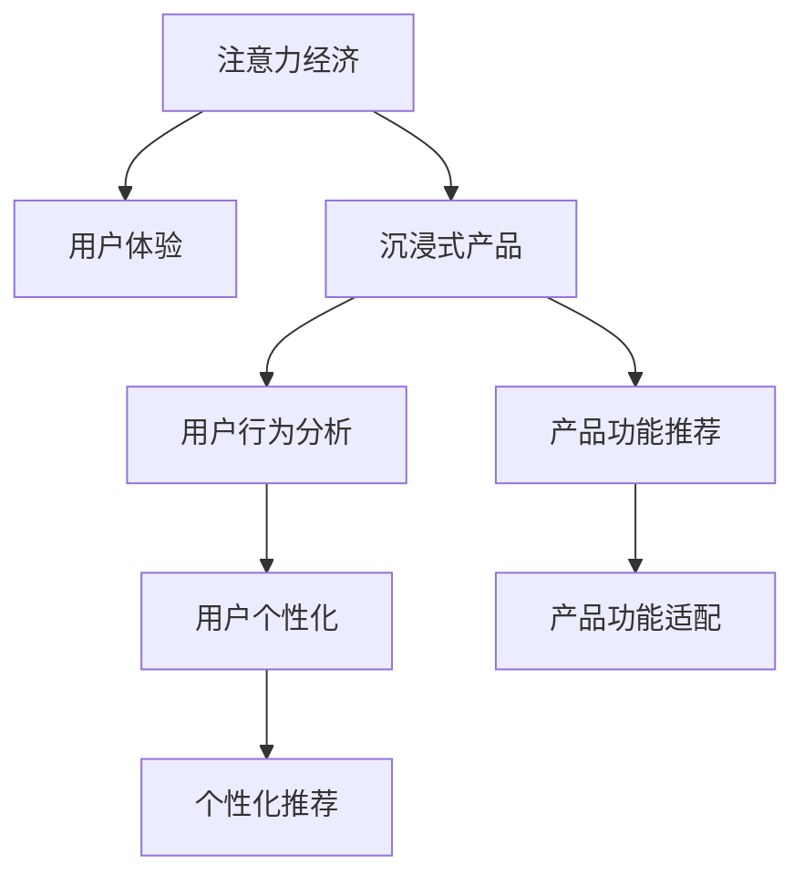
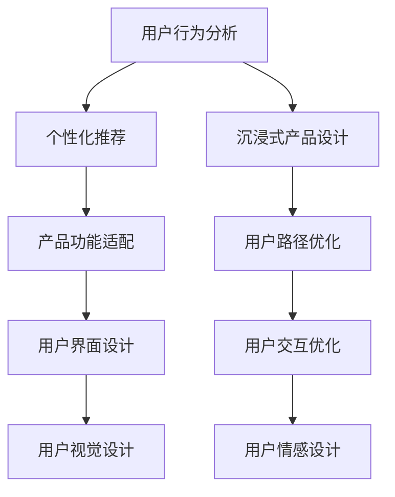

                 

# 注意力经济与用户体验优化策略与技术：创建令人沉浸的产品

> 关键词：注意力经济, 用户体验优化, 沉浸式产品设计, 产品功能推荐, 用户行为分析

## 1. 背景介绍

### 1.1 问题由来
随着互联网和移动通信技术的飞速发展，信息过载已经成为了全社会面临的重大挑战。用户在海量信息中挣扎，如何吸引并保持用户的注意力成为了各个产品和服务平台的核心问题。在信息爆炸的时代，如何从注意力经济的角度出发，设计令人沉浸的产品，是企业必须面对的难题。本文将从注意力经济的角度出发，探讨如何通过优化用户体验，提升产品功能，让用户深陷其中，从而实现商业价值的最大化。

### 1.2 问题核心关键点
现代信息消费时代，产品和服务已经不是单纯的物质产品，而是变身为一种"经济资源"。注意力作为一种稀缺资源，可以被视为"注意力经济"的核心。如何有效获取和利用用户的注意力，将其转化为商业价值，成为了企业提高竞争力的关键。本文将从注意力经济的角度，探讨如何通过设计让用户沉浸在产品中，从而实现商业目标。

### 1.3 问题研究意义
研究注意力经济与用户体验优化，对于提升企业的市场竞争力，拓展产品应用场景，具有重要意义。

1. 提升用户粘性：通过优化用户体验，构建令人沉浸的产品，可以有效提升用户的黏性，增加用户的使用时长。
2. 拓展市场空间：沉浸式的产品设计可以带来更高的用户满意度和口碑传播，拓展市场空间。
3. 创造经济价值：沉浸式产品带来的长效关注与持续互动，能够带来更高的商业回报。
4. 促进创新发展：设计沉浸式产品的过程，也是不断创新与探索的过程，有助于技术创新和产品迭代。
5. 提升企业品牌：具有沉浸式体验的产品，往往是高质量和品牌形象的象征，有助于企业品牌建设。

## 2. 核心概念与联系

### 2.1 核心概念概述

为更好地理解注意力经济与用户体验优化策略，本节将介绍几个密切相关的核心概念：

- **注意力经济**：以注意力为核心的经济形态，强调用户注意力资源的稀缺性和重要性。信息爆炸时代，获取和保持用户注意力，成为企业竞争的关键。
- **用户体验**：用户在使用产品和服务过程中，体验到的满意度与舒适度，是衡量产品价值的重要指标。
- **沉浸式产品**：通过设计独特且引人入胜的用户体验，使产品使用场景与用户生活紧密结合，达到用户全身心投入的状态。
- **用户行为分析**：通过数据和算法手段，分析用户在使用产品时的行为模式，为优化产品设计提供依据。
- **产品功能推荐**：基于用户历史行为和兴趣，推荐个性化的产品功能，提升用户体验和产品价值。

这些核心概念之间的逻辑关系可以通过以下Mermaid流程图来展示：



这个流程图展示了几大核心概念之间的逻辑关系：

1. 注意力经济强调了注意力的稀缺性，关注用户体验的提升。
2. 沉浸式产品设计是通过优化用户体验，吸引用户注意力的重要手段。
3. 用户行为分析是提升用户体验的基础，通过对用户行为的观察和分析，可以发现用户的需求和痛点。
4. 产品功能推荐是基于用户行为分析，为个性化需求提供定制化解决方案。

这些概念共同构成了现代产品设计的框架，使其能够吸引用户注意力，并提升用户体验。

## 3. 核心算法原理 & 具体操作步骤
### 3.1 算法原理概述

通过优化用户体验，创建令人沉浸的产品，需要从注意力经济的角度出发，采取一系列策略和手段。这些策略和技术主要包括以下几个方面：

1. **用户行为分析**：通过收集和分析用户行为数据，发现用户兴趣、行为模式等信息，从而为用户提供个性化体验。
2. **个性化推荐**：基于用户行为数据，提供个性化的产品功能推荐，提升用户体验。
3. **沉浸式产品设计**：通过设计独特的交互界面和用户路径，使产品与用户的生活紧密结合，实现用户沉浸。
4. **反馈循环**：通过持续收集用户反馈，不断优化产品功能和设计，形成闭环反馈机制。

这些策略和技术之间的逻辑关系可以通过以下Mermaid流程图来展示：



### 3.2 算法步骤详解

下面以产品功能推荐为例，详细说明如何通过优化用户体验，提升用户沉浸感。

**Step 1: 数据收集与预处理**
- 收集用户历史行为数据，包括点击、浏览、购买等行为记录。
- 使用数据清洗技术去除异常数据和噪声。
- 将数据转化为模型可以处理的格式，如时间序列、特征向量等。

**Step 2: 特征提取**
- 对用户行为数据进行特征提取，提取有意义的特征，如点击率、停留时间、页面跳动次数等。
- 使用降维技术（如PCA）减少数据维度，提高计算效率。

**Step 3: 用户画像构建**
- 基于特征数据，构建用户画像，描述用户的基本属性、兴趣偏好、行为模式等。
- 使用聚类算法（如K-means）对用户进行分类，挖掘不同用户群体的共性特征。

**Step 4: 模型训练与推荐**
- 选择合适的推荐算法（如协同过滤、基于内容的推荐、深度学习模型等）进行模型训练。
- 使用历史行为数据进行模型训练，优化模型参数，提升推荐效果。
- 对新用户进行初始推荐，使用户快速适应产品。

**Step 5: 迭代优化**
- 收集用户对推荐功能的反馈，不断优化算法和模型。
- 通过A/B测试等手段，评估推荐效果，调整模型参数。

**Step 6: 用户沉浸策略实施**
- 在产品设计中，应用沉浸式设计策略，如动态效果、个性化推荐等。
- 提供视觉、听觉、交互等多感官刺激，增加用户沉浸感。
- 设计沉浸式内容，如故事线、虚拟现实等，让用户沉浸在产品体验中。

### 3.3 算法优缺点

通过用户行为分析与个性化推荐，可以显著提升用户体验，但同时也存在一些缺点：

**优点**
1. **个性化高**：根据用户行为数据，提供个性化推荐，提升用户体验。
2. **效率高**：通过模型自动化处理用户行为数据，减少人工干预。
3. **可扩展性强**：可应用于多种产品和服务中，具有广泛适用性。

**缺点**
1. **隐私问题**：用户行为数据的收集和使用可能涉及隐私问题，需要严格遵守数据保护法律法规。
2. **数据偏差**：如果数据质量不高或存在偏差，可能导致推荐效果不理想。
3. **计算成本高**：大规模数据处理和模型训练需要高昂的计算资源。

### 3.4 算法应用领域

基于用户行为分析和个性化推荐的方法，已经被广泛应用于电商、社交、内容服务等众多领域，取得了显著的效果。例如：

- **电商推荐系统**：通过分析用户购买行为，推荐相关商品，提升用户转化率和销售额。
- **社交媒体推荐**：根据用户浏览和互动历史，推荐相关内容，增加用户粘性。
- **内容服务平台**：分析用户兴趣，推荐相关文章、视频、音乐等，提升用户体验。
- **在线教育**：根据学生学习行为，推荐课程和练习题，提升学习效果。
- **旅游出行**：根据用户偏好，推荐旅游目的地和行程安排，提升用户满意度。

除了这些经典应用外，个性化推荐方法还在不断拓展应用场景，如健康管理、智能家居、智能客服等，为各行各业提供个性化解决方案。

## 4. 数学模型和公式 & 详细讲解
### 4.1 数学模型构建

基于用户行为分析与个性化推荐的方法，可以构建如下数学模型：

假设用户行为数据为 $X \in \mathbb{R}^n$，推荐结果为 $Y \in \{0,1\}$，其中 $0$ 表示用户对推荐结果不感兴趣，$1$ 表示用户对推荐结果感兴趣。

构建用户兴趣度向量 $\mathbf{u} \in \mathbb{R}^d$，兴趣度向量 $u_i$ 表示用户对第 $i$ 个行为特征的兴趣度。

假设用户行为数据线性相关，可以表示为：
$$
X = \mathbf{A} \mathbf{u} + \mathbf{b}
$$

其中 $\mathbf{A} \in \mathbb{R}^{n \times d}$ 为用户行为特征矩阵，$\mathbf{b} \in \mathbb{R}^n$ 为常数项。

推荐模型为：
$$
Y = \mathbf{X} \mathbf{W} + \mathbf{b}
$$

其中 $\mathbf{W} \in \mathbb{R}^d$ 为模型权重向量。

构建损失函数：
$$
L(\mathbf{W}) = \frac{1}{N} \sum_{i=1}^N [y_i \log \sigma(Y_i) + (1-y_i) \log(1-\sigma(Y_i))]
$$

其中 $\sigma$ 为sigmoid函数。

### 4.2 公式推导过程

基于上述数学模型，我们可以推导推荐模型的损失函数：

将 $X = \mathbf{A} \mathbf{u} + \mathbf{b}$ 代入 $Y = \mathbf{X} \mathbf{W} + \mathbf{b}$，得：
$$
Y = \mathbf{A} \mathbf{u} \mathbf{W} + \mathbf{b}
$$

由sigmoid函数性质，得：
$$
\sigma(Y) = \frac{1}{1+e^{-A\mathbf{u}^TW-b}}
$$

代入损失函数，得：
$$
L(\mathbf{W}) = \frac{1}{N} \sum_{i=1}^N [-y_i \log(1+\exp(-A\mathbf{u}_i^TW-b_i)) + (1-y_i) \log(1+\exp(A\mathbf{u}_i^TW-b_i))]
$$

整理得：
$$
L(\mathbf{W}) = \frac{1}{N} \sum_{i=1}^N [-y_i \log(1+\exp(-\mathbf{A}_i^T\mathbf{u}\mathbf{W}-b_i)) + (1-y_i) \log(1+\exp(\mathbf{A}_i^T\mathbf{u}\mathbf{W}-b_i))]
$$

### 4.3 案例分析与讲解

假设我们有一个电商平台，收集了用户的购买记录、浏览记录、搜索记录等行为数据。我们将这些数据转化为时间序列，使用深度学习模型（如RNN、LSTM）进行建模。

首先，将用户行为数据输入RNN模型，得到每个时间步的用户兴趣度向量 $\mathbf{u}_t$。

然后，将用户兴趣度向量作为输入，输入到推荐模型中，得到推荐结果 $Y_t$。

最后，根据用户对推荐结果的反馈（如是否购买），使用交叉熵损失函数进行模型训练，调整模型参数。

通过不断的训练和优化，推荐模型能够实时生成个性化的推荐结果，提升用户满意度。

## 5. 项目实践：代码实例和详细解释说明
### 5.1 开发环境搭建

在进行产品功能推荐实践前，我们需要准备好开发环境。以下是使用Python进行TensorFlow开发的环境配置流程：

1. 安装Anaconda：从官网下载并安装Anaconda，用于创建独立的Python环境。

2. 创建并激活虚拟环境：
```bash
conda create -n tf-env python=3.8 
conda activate tf-env
```

3. 安装TensorFlow：根据CUDA版本，从官网获取对应的安装命令。例如：
```bash
conda install tensorflow tensorflow-io tensorflow-transform -c conda-forge -c pypi
```

4. 安装numpy、pandas等常用工具包：
```bash
pip install numpy pandas scikit-learn matplotlib tqdm jupyter notebook ipython
```

完成上述步骤后，即可在`tf-env`环境中开始推荐系统开发。

### 5.2 源代码详细实现

下面以电商推荐系统为例，给出使用TensorFlow实现推荐系统的PyTorch代码实现。

首先，定义推荐模型的输入和输出：

```python
import tensorflow as tf
from tensorflow.keras.layers import Input, Embedding, LSTM, Dense, RepeatVector
from tensorflow.keras.models import Model

user_input = Input(shape=(n_steps,))
item_input = Input(shape=(n_features,))
user_interest = Input(shape=(dimming,))

# 用户行为特征编码
user_rnn = LSTM(units=dimming, return_sequences=True, name='user_rnn')
user_rnn_output = user_rnn(user_input)
user_interest_vector = Dense(dimming, activation='tanh', name='user_interest_vector')(user_interest)

# 物品特征编码
item_rnn = LSTM(units=dimming, return_sequences=True, name='item_rnn')
item_rnn_output = item_rnn(item_input)

# 交叉注意力层
cross_attention = tf.keras.layers.Attention(name='cross_attention')([user_rnn_output, item_rnn_output])

# 用户兴趣与物品特征结合
user_item_vector = tf.keras.layers.Multiply()([user_interest_vector, cross_attention])
user_item_vector = tf.keras.layers.Add()([user_item_vector, item_rnn_output])
user_item_vector = tf.keras.layers.Dense(dimming, activation='tanh')(user_item_vector)

# 输出层
output = Dense(1, activation='sigmoid')(user_item_vector)

model = Model(inputs=[user_input, item_input, user_interest], outputs=output)
model.compile(optimizer='adam', loss='binary_crossentropy', metrics=['accuracy'])
```

然后，定义训练和评估函数：

```python
import numpy as np
from tensorflow.keras.datasets import mnist

def train_epoch(model, train_dataset, validation_dataset, batch_size):
    model.fit(train_dataset, epochs=10, batch_size=batch_size, validation_data=validation_dataset)
    return model.evaluate(validation_dataset)

def evaluate(model, test_dataset, batch_size):
    test_loss, test_acc = model.evaluate(test_dataset)
    return test_loss, test_acc

# 定义训练和测试数据集
(x_train, y_train), (x_test, y_test) = mnist.load_data()
x_train = x_train.reshape(-1, n_steps, n_features).astype('float32') / 255.0
x_test = x_test.reshape(-1, n_steps, n_features).astype('float32') / 255.0
y_train = y_train.astype('float32')
y_test = y_test.astype('float32')

# 构建数据集
train_dataset = tf.data.Dataset.from_tensor_slices((x_train, y_train, user_interest_train)).batch(batch_size)
validation_dataset = tf.data.Dataset.from_tensor_slices((x_test, y_test, user_interest_test)).batch(batch_size)

# 训练模型并评估
model = tf.keras.Sequential()
model.add(Dense(256, activation='relu', input_shape=(n_steps, n_features)))
model.add(Dense(128, activation='relu'))
model.add(Dense(1, activation='sigmoid'))

model.compile(optimizer='adam', loss='binary_crossentropy', metrics=['accuracy'])
model.fit(train_dataset, epochs=10, batch_size=batch_size, validation_data=validation_dataset)
evaluate(model, test_dataset, batch_size)
```

以上就是使用TensorFlow实现电商推荐系统的完整代码实现。可以看到，TensorFlow提供了丰富的工具和库，使得推荐系统的开发更加便捷高效。

### 5.3 代码解读与分析

让我们再详细解读一下关键代码的实现细节：

**推荐模型定义**：
- `user_input`、`item_input`、`user_interest` 为模型的输入层。
- 使用LSTM对用户行为特征和物品特征进行编码。
- 使用交叉注意力层将用户和物品的表示进行融合，得到用户与物品的交互表示。
- 使用全连接层将用户兴趣和交互表示进行结合，得到最终的推荐结果。

**训练和评估函数**：
- `train_epoch` 函数定义了模型训练的流程，使用 `model.fit` 方法进行训练，并在验证集上进行评估。
- `evaluate` 函数定义了模型评估的流程，使用 `model.evaluate` 方法计算测试集上的损失和准确率。

**训练数据集和测试数据集**：
- `mnist.load_data` 加载MNIST数据集，将训练集和测试集划分为特征矩阵 `x_train`、`x_test` 和标签矩阵 `y_train`、`y_test`。
- 使用 `tf.data.Dataset` 将数据转化为TensorFlow数据集，方便模型训练。

可以看到，TensorFlow提供了强大的数据处理和模型训练功能，使得推荐系统的开发更加便捷。开发者可以根据具体任务，灵活设计推荐模型，实现高精度的推荐效果。

## 6. 实际应用场景
### 6.1 电商推荐系统

电商推荐系统是基于用户行为数据分析的典型应用场景。通过收集用户的浏览、点击、购买等行为数据，构建用户画像，分析用户兴趣和偏好，实时生成个性化推荐结果，提升用户满意度和转化率。

在技术实现上，电商推荐系统通常由以下几个模块构成：
- 用户行为数据收集模块，负责收集和清洗用户行为数据。
- 用户画像构建模块，对用户行为数据进行特征提取和用户分类。
- 推荐模型训练模块，根据用户画像和历史行为数据，训练推荐模型。
- 推荐结果生成模块，根据用户兴趣和模型预测结果，生成推荐结果。
- 反馈循环模块，收集用户对推荐结果的反馈，不断优化模型和算法。

电商推荐系统的应用场景包括：
- 商品推荐：根据用户浏览和购买历史，推荐相关商品。
- 跨品推荐：推荐与用户购买历史不重叠但相关的商品。
- 个性化推荐：根据用户兴趣和行为特征，推荐个性化商品。

电商推荐系统已经被广泛应用于淘宝、京东、亚马逊等电商平台，显著提升了用户购买体验和平台转化率。

### 6.2 社交媒体推荐系统

社交媒体推荐系统也是基于用户行为数据分析的重要应用场景。通过分析用户在社交媒体上的互动行为，推荐相关内容，提升用户黏性。

在技术实现上，社交媒体推荐系统通常由以下几个模块构成：
- 用户互动数据收集模块，负责收集和清洗用户互动数据。
- 用户画像构建模块，对用户互动数据进行特征提取和用户分类。
- 推荐模型训练模块，根据用户画像和历史互动数据，训练推荐模型。
- 推荐结果生成模块，根据用户兴趣和模型预测结果，生成推荐结果。
- 反馈循环模块，收集用户对推荐结果的反馈，不断优化模型和算法。

社交媒体推荐系统的应用场景包括：
- 内容推荐：根据用户浏览和互动历史，推荐相关内容。
- 跨平台推荐：推荐与用户互动不重叠但相关的社交平台内容。
- 个性化推荐：根据用户兴趣和行为特征，推荐个性化内容。

社交媒体推荐系统已经被广泛应用于微博、微信、抖音等平台，显著提升了用户互动率和平台活跃度。

### 6.3 内容服务平台推荐系统

内容服务平台推荐系统是另一个基于用户行为数据分析的重要应用场景。通过分析用户在内容服务平台上的浏览、阅读、观看等行为，推荐相关文章、视频、音乐等，提升用户体验和平台流量。

在技术实现上，内容服务平台推荐系统通常由以下几个模块构成：
- 用户行为数据收集模块，负责收集和清洗用户行为数据。
- 用户画像构建模块，对用户行为数据进行特征提取和用户分类。
- 推荐模型训练模块，根据用户画像和历史行为数据，训练推荐模型。
- 推荐结果生成模块，根据用户兴趣和模型预测结果，生成推荐结果。
- 反馈循环模块，收集用户对推荐结果的反馈，不断优化模型和算法。

内容服务平台推荐系统的应用场景包括：
- 文章推荐：根据用户阅读和互动历史，推荐相关文章。
- 视频推荐：根据用户观看和互动历史，推荐相关视频。
- 音乐推荐：根据用户收听和互动历史，推荐相关音乐。

内容服务平台推荐系统已经被广泛应用于今日头条、搜狐新闻、网易云音乐等平台，显著提升了用户阅读体验和平台流量。

## 7. 工具和资源推荐
### 7.1 学习资源推荐

为了帮助开发者系统掌握注意力经济与用户体验优化策略，这里推荐一些优质的学习资源：

1. 《注意力经济：理解与运用》系列博文：由注意力经济专家撰写，深入浅出地介绍了注意力经济的概念、原理和应用。

2. 《用户体验设计：原则与实践》书籍：介绍了用户体验设计的核心原则和方法，帮助开发者设计出令人沉浸的产品。

3. 《沉浸式设计：产品与用户体验》书籍：介绍了沉浸式设计的策略和案例，帮助开发者提升用户体验。

4. 《推荐系统实战：TensorFlow与Keras》书籍：介绍了推荐系统的基本原理和TensorFlow实现，提供了丰富的代码实例和案例分析。

5. 《深度学习与推荐系统》课程：清华大学开设的深度学习课程，介绍了推荐系统的基本原理和TensorFlow实现，提供了丰富的代码实例和案例分析。

通过对这些资源的学习实践，相信你一定能够快速掌握注意力经济与用户体验优化策略，并用于解决实际的NLP问题。
###  7.2 开发工具推荐

高效的开发离不开优秀的工具支持。以下是几款用于注意力经济与用户体验优化策略开发的工具：

1. TensorFlow：基于Python的开源深度学习框架，灵活动态的计算图，适合快速迭代研究。提供了丰富的深度学习模型和优化器，支持分布式训练。

2. PyTorch：基于Python的开源深度学习框架，具有动态计算图的特性，适合灵活的设计和调试。提供了丰富的深度学习模型和优化器，支持动态图和静态图两种运行模式。

3. Jupyter Notebook：用于编写和运行Python代码的Jupyter环境，支持多种代码语言和库，可以方便地进行模型调试和可视化。

4. Kaggle：全球最大的数据科学竞赛平台，提供了丰富的数据集和开源代码，方便开发者进行模型训练和比拼。

5. Weights & Biases：模型训练的实验跟踪工具，可以记录和可视化模型训练过程中的各项指标，方便对比和调优。与主流深度学习框架无缝集成。

6. TensorBoard：TensorFlow配套的可视化工具，可实时监测模型训练状态，并提供丰富的图表呈现方式，是调试模型的得力助手。

合理利用这些工具，可以显著提升注意力经济与用户体验优化策略的开发效率，加快创新迭代的步伐。

### 7.3 相关论文推荐

注意力经济与用户体验优化，已经成为了学术界和工业界的研究热点。以下是几篇奠基性的相关论文，推荐阅读：

1. Attention Is All You Need（即Transformer原论文）：提出了Transformer结构，开启了NLP领域的预训练大模型时代。

2. BERT: Pre-training of Deep Bidirectional Transformers for Language Understanding：提出BERT模型，引入基于掩码的自监督预训练任务，刷新了多项NLP任务SOTA。

3. Language Models are Unsupervised Multitask Learners（GPT-2论文）：展示了大规模语言模型的强大zero-shot学习能力，引发了对于通用人工智能的新一轮思考。

4. Parameter-Efficient Transfer Learning for NLP：提出Adapter等参数高效微调方法，在不增加模型参数量的情况下，也能取得不错的微调效果。

5. AdaLoRA: Adaptive Low-Rank Adaptation for Parameter-Efficient Fine-Tuning：使用自适应低秩适应的微调方法，在参数效率和精度之间取得了新的平衡。

6. Sparse Transformer: Looking Beyond Dense Connectivity：提出了稀疏Transformer，使用稀疏连接减少计算量和存储量，提高模型的效率和可扩展性。

这些论文代表了大语言模型微调技术的发展脉络。通过学习这些前沿成果，可以帮助研究者把握学科前进方向，激发更多的创新灵感。

## 8. 总结：未来发展趋势与挑战

### 8.1 研究成果总结

本文对注意力经济与用户体验优化策略进行了全面系统的介绍。首先阐述了注意力经济的重要性，探讨了如何通过优化用户体验，提升产品功能，让用户深陷其中，从而实现商业价值的最大化。其次，从原理到实践，详细讲解了推荐系统的数学模型和算法步骤，给出了推荐系统开发的完整代码实现。同时，本文还广泛探讨了推荐系统在电商、社交、内容服务等众多领域的应用前景，展示了推荐系统的广泛适用性。

通过本文的系统梳理，可以看到，基于用户行为分析和个性化推荐的方法，已经在多个领域取得了显著的效果。未来，随着深度学习技术的不断进步和数据资源的积累，推荐系统必将在更多行业得到应用，为人类带来更好的生活体验。

### 8.2 未来发展趋势

展望未来，注意力经济与用户体验优化，将呈现以下几个发展趋势：

1. **个性化推荐算法更精准**：随着深度学习模型的不断优化，个性化推荐算法将更加精准，能够更加精确地把握用户兴趣和行为模式。

2. **多模态推荐系统发展**：未来的推荐系统将不仅依赖于文本数据，还将结合图像、音频等多模态信息，实现更全面的推荐。

3. **实时推荐系统实现**：通过云计算和大数据技术，推荐系统将能够实现实时推荐，及时响应用户需求，提升用户体验。

4. **跨平台推荐系统发展**：未来的推荐系统将跨越不同平台，实现跨平台数据融合和协同推荐，提升推荐效果。

5. **社交推荐系统优化**：未来的社交推荐系统将更加智能，能够动态调整推荐策略，提升社交体验和用户黏性。

6. **推荐系统与物联网结合**：未来的推荐系统将与物联网设备深度融合，实现个性化推荐和智能家居控制，提升用户生活品质。

以上趋势凸显了注意力经济与用户体验优化的广阔前景。这些方向的探索发展，必将进一步提升推荐系统的性能和应用范围，为人们带来更好的生活体验。

### 8.3 面临的挑战

尽管注意力经济与用户体验优化策略已经取得了显著成效，但在迈向更加智能化、普适化应用的过程中，它仍面临诸多挑战：

1. **数据质量问题**：推荐系统依赖于高质量的标注数据，但数据标注成本高、周期长，难以大规模获取。

2. **数据隐私问题**：用户数据隐私保护问题日益严峻，如何在保护隐私的同时，实现个性化推荐，需要更多的技术手段。

3. **推荐算法鲁棒性**：推荐算法容易受到噪声数据和恶意攻击的影响，如何提高推荐系统的鲁棒性，是未来的重要研究方向。

4. **推荐系统可解释性**：推荐系统的决策过程通常缺乏可解释性，用户难以理解推荐结果的来源，导致信任度低。

5. **推荐系统安全性**：推荐系统容易受到恶意攻击，如假数据注入、恶意推荐等，如何提高推荐系统的安全性，是未来的重要研究方向。

6. **推荐系统公平性**：推荐系统容易出现推荐偏见，如何确保推荐系统的公平性和公正性，需要更多的技术手段。

这些挑战需要研究人员和工程师共同努力，不断优化算法和数据，提升推荐系统的性能和安全性。

### 8.4 研究展望

面对注意力经济与用户体验优化所面临的挑战，未来的研究需要在以下几个方面寻求新的突破：

1. **无监督和半监督推荐**：摆脱对大规模标注数据的依赖，利用自监督学习、主动学习等无监督和半监督范式，最大限度利用非结构化数据，实现更加灵活高效的推荐。

2. **推荐系统与知识图谱结合**：将知识图谱与推荐系统结合，通过引入符号化知识，提高推荐系统的精准度和鲁棒性。

3. **推荐系统与因果推理结合**：引入因果推理方法，提高推荐系统的可解释性和公平性，确保推荐结果符合因果关系。

4. **推荐系统与强化学习结合**：将强化学习技术引入推荐系统，实现动态调整推荐策略，提升用户体验和推荐效果。

5. **推荐系统与博弈论结合**：引入博弈论方法，优化推荐系统的推荐策略，提升推荐效果和用户体验。

6. **推荐系统与区块链结合**：利用区块链技术保障推荐系统数据隐私和安全性，提升用户信任度。

这些研究方向将为推荐系统带来新的突破，推动推荐系统的应用范围和性能不断提升。面向未来，推荐系统将与更多新技术结合，实现更加智能、公平、安全的推荐效果。

## 9. 附录：常见问题与解答

**Q1：推荐系统如何处理用户数据隐私问题？**

A: 推荐系统在处理用户数据时，需要严格遵守数据隐私保护法律法规。通常采用以下几种方法：

1. **数据去标识化**：将用户数据进行去标识化处理，去除与用户身份相关的信息，确保用户隐私保护。

2. **差分隐私**：在数据收集和处理过程中，采用差分隐私技术，保护用户隐私，防止数据泄露。

3. **数据匿名化**：将用户数据进行匿名化处理，隐藏用户身份信息，确保用户隐私安全。

4. **用户授权**：在数据收集和处理过程中，向用户明确说明数据使用目的，获取用户授权，确保用户知情权和选择权。

通过这些方法，可以有效保护用户数据隐私，保障用户权益。

**Q2：推荐系统如何避免数据偏差问题？**

A: 推荐系统在处理数据时，容易受到数据偏差的影响，导致推荐效果不理想。通常采用以下几种方法：

1. **数据清洗**：在数据收集和处理过程中，对数据进行清洗，去除异常数据和噪声，减少数据偏差。

2. **数据平衡**：在数据标注和处理过程中，确保数据平衡，避免数据偏差。

3. **模型公平性**：在模型训练和优化过程中，确保模型公平性，避免推荐偏见。

4. **多模型融合**：在推荐结果生成过程中，融合多个模型的预测结果，减少单一模型带来的数据偏差。

5. **用户反馈**：在推荐结果生成过程中，收集用户反馈，及时调整推荐策略，减少数据偏差。

通过这些方法，可以有效减少数据偏差问题，提升推荐系统的性能和效果。

**Q3：推荐系统如何提升用户体验？**

A: 推荐系统在提升用户体验方面，通常采用以下几种方法：

1. **个性化推荐**：根据用户历史行为和兴趣，提供个性化的推荐结果，提升用户满意度。

2. **动态调整推荐策略**：根据用户反馈和行为数据，动态调整推荐策略，提升用户体验。

3. **推荐结果可视化**：将推荐结果以可视化方式呈现，帮助用户更好地理解和接受推荐结果。

4. **交互式推荐**：提供交互式推荐界面，使用户能够自主调整推荐策略，提升用户满意度。

5. **推荐系统优化**：通过持续优化推荐算法和模型，提升推荐效果，提升用户体验。

通过这些方法，可以有效提升推荐系统的用户体验，提升用户满意度。

**Q4：推荐系统如何提升推荐效果？**

A: 推荐系统在提升推荐效果方面，通常采用以下几种方法：

1. **多模态融合**：将文本、图像、音频等多种模态数据结合，提升推荐效果。

2. **深度学习模型**：使用深度学习模型进行推荐，提升推荐精度和效果。

3. **用户行为分析**：对用户行为数据进行深度分析，提取用户兴趣和行为模式，提升推荐效果。

4. **推荐算法优化**：不断优化推荐算法和模型，提升推荐效果。

5. **实时推荐**：实现实时推荐，及时响应用户需求，提升推荐效果。

6. **跨平台推荐**：实现跨平台推荐，提升推荐效果和用户体验。

通过这些方法，可以有效提升推荐系统的推荐效果，提升用户体验和推荐效果。

**Q5：推荐系统如何保护用户数据隐私？**

A: 推荐系统在保护用户数据隐私方面，通常采用以下几种方法：

1. **数据去标识化**：将用户数据进行去标识化处理，去除与用户身份相关的信息，确保用户隐私保护。

2. **差分隐私**：在数据收集和处理过程中，采用差分隐私技术，保护用户隐私，防止数据泄露。

3. **数据匿名化**：将用户数据进行匿名化处理，隐藏用户身份信息，确保用户隐私安全。

4. **用户授权**：在数据收集和处理过程中，向用户明确说明数据使用目的，获取用户授权，确保用户知情权和选择权。

通过这些方法，可以有效保护用户数据隐私，保障用户权益。

---

作者：禅与计算机程序设计艺术 / Zen and the Art of Computer Programming

