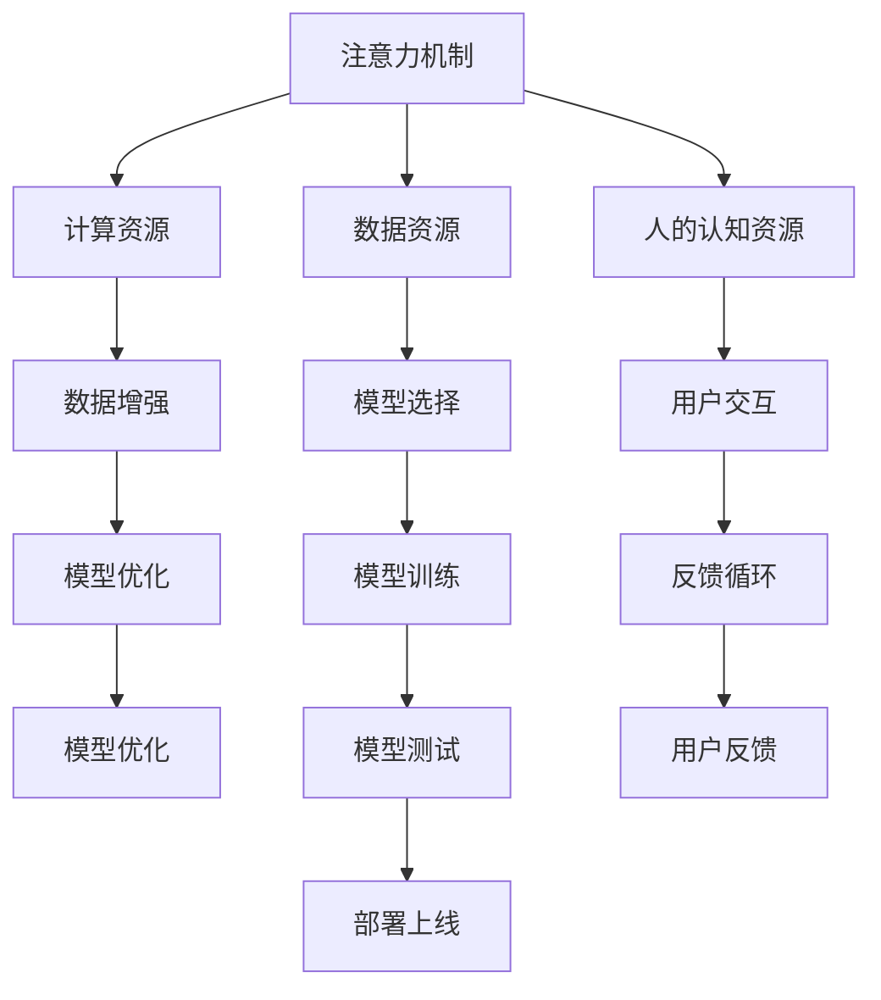

                 

## 1. 背景介绍

### 1.1 问题由来

随着人工智能(AI)技术的迅猛发展，AI驱动的认知资源配置已经成为一个日益重要的研究方向。AI技术在自动驾驶、医疗诊断、金融预测、自然语言处理等领域的应用，极大地提升了效率和准确性。然而，这些技术的背后，有一个核心的概念，即认知资源的配置。认知资源包括计算资源、数据资源、人力资源、注意力资源等，这些资源的有效配置和利用，直接影响AI系统的工作效率和效果。

认知资源配置的重要性日益凸显，尤其是在AI系统中，注意力机制的应用尤为关键。注意力机制能够让模型集中关注重要的信息，忽略无关的细节，从而提升模型的性能和效率。然而，如何合理配置注意力资源，充分利用有限的计算资源，是当前AI领域面临的重要问题。

### 1.2 问题核心关键点

认知资源配置的核心关键点在于：

1. 计算资源的高效利用。如何通过优化计算模型和算法，提升AI系统的计算效率，减少计算资源的消耗。
2. 数据资源的高质量管理。如何高效管理数据资源，提升数据的质量和多样性，以更好地训练AI模型。
3. 注意力资源的合理分配。如何在模型中合理分配注意力资源，提升模型的精度和泛化能力。
4. 人的认知资源的利用。如何利用人的认知资源，提高人机交互的效率和质量。
5. 经济成本的最小化。如何在保证AI系统性能的前提下，最小化经济成本。

这些问题不仅涉及到技术层面，还涉及到经济、伦理和社会等诸多方面，是一个跨学科的研究领域。

## 2. 核心概念与联系

### 2.1 核心概念概述

为了更好地理解认知资源配置，本节将介绍几个密切相关的核心概念：

- **注意力机制(Attention Mechanism)**：是当前AI领域中最热门的研究方向之一。注意力机制让模型能够根据输入的不同部分，动态分配注意力资源，以重点关注重要的信息，从而提升模型的性能和效率。
- **计算资源(Computational Resources)**：指用于训练和运行AI模型的计算设备、计算时间等资源。计算资源的优化利用是提升AI系统性能的关键。
- **数据资源(Data Resources)**：指用于训练和验证AI模型的数据集，包括图像、文本、音频等。数据资源的高质量管理和利用，是训练高质量模型的基础。
- **人的认知资源(Human Cognitive Resources)**：指人在与AI系统交互过程中，所投入的注意力、理解力、判断力等认知资源。合理利用人的认知资源，可以提高人机交互的效率和质量。
- **经济成本(Economic Costs)**：指在开发、训练和部署AI系统时，所需的经济投入。最小化经济成本，是AI系统落地的重要目标。

这些核心概念之间的逻辑关系可以通过以下Mermaid流程图来展示：



这个流程图展示了一系列的核心概念及其之间的联系：

1. 注意力机制是模型的核心，通过动态分配注意力资源，提升模型的性能。
2. 计算资源用于训练和运行模型，通过优化计算模型和算法，提升计算效率。
3. 数据资源用于训练模型，通过数据增强和高质量管理，提升模型的泛化能力。
4. 人的认知资源用于人机交互，通过合理利用人的认知资源，提高交互效率。
5. 经济成本用于计算、数据、人力等资源的投入，通过最小化成本，确保系统的可持续性。

这些概念共同构成了认知资源配置的理论基础，为后续研究提供了明确的框架和方向。

## 3. 核心算法原理 & 具体操作步骤
### 3.1 算法原理概述

AI驱动的认知资源配置，本质上是一个多目标优化问题。其核心思想是：在有限的计算资源、数据资源和人的认知资源下，如何最大化模型的性能，同时最小化经济成本。

具体来说，假设模型的性能为 $P$，计算资源的消耗为 $C$，数据资源的消耗为 $D$，人的认知资源的消耗为 $H$，经济成本为 $E$。优化目标可以表示为：

$$
\max P \\
\min C, D, H, E
$$

在优化过程中，需要平衡这些目标，使得模型的性能最大化，同时保证资源消耗最小化。

### 3.2 算法步骤详解

AI驱动的认知资源配置一般包括以下几个关键步骤：

**Step 1: 数据预处理与增强**
- 收集和整理与AI任务相关的数据资源，并进行数据增强处理，如数据清洗、数据扩充、数据合成等。
- 通过数据增强，提升数据的质量和多样性，为模型的训练提供更充分、更有效的数据支持。

**Step 2: 模型选择与优化**
- 选择适合当前任务需求的预训练模型，如BERT、GPT、Transformer等。
- 对模型进行优化，如微调、迁移学习、知识蒸馏等，提升模型的泛化能力和性能。

**Step 3: 注意力机制设计**
- 设计合适的注意力机制，如自注意力机制、多头注意力机制等，动态分配注意力资源，提升模型对重要信息的关注度。
- 通过注意力机制的设计，优化计算资源的利用，减少冗余的计算和存储。

**Step 4: 训练与调参**
- 在选定的模型和数据上，进行有监督或无监督的训练。
- 调整模型的超参数，如学习率、批大小、优化器等，优化模型的性能和资源消耗。

**Step 5: 测试与部署**
- 在测试集上评估模型的性能，确保模型在真实场景下的表现。
- 将模型部署到实际应用场景中，监测模型的运行情况和资源消耗。

**Step 6: 用户反馈与调整**
- 收集用户的反馈信息，评估模型的实际应用效果。
- 根据用户的反馈信息，对模型进行调整和优化，进一步提升模型的性能和用户体验。

### 3.3 算法优缺点

AI驱动的认知资源配置具有以下优点：

1. 提升了模型的性能。通过优化计算资源和注意力资源的分配，模型能够更加高效地进行学习和推理。
2. 降低了资源消耗。通过优化数据资源和人的认知资源的利用，最小化了经济成本，提升了系统的可持续性。
3. 增强了模型的泛化能力。通过注意力机制的设计，模型能够更加关注重要的信息，提升了模型的泛化能力和鲁棒性。

然而，这种配置方法也存在一些局限性：

1. 复杂度高。需要综合考虑多个目标，进行多目标优化，增加了模型的复杂度和训练难度。
2. 数据需求高。需要大量的高质量数据资源，才能进行有效的模型训练和优化。
3. 模型解释性不足。复杂的注意力机制和优化算法，使得模型的内部工作机制难以解释，增加了调试和优化难度。

尽管存在这些局限性，但就目前而言，AI驱动的认知资源配置仍是优化AI系统性能和成本的重要方法。未来相关研究的方向，将继续优化算法和模型，提升资源配置的效率和效果。

### 3.4 算法应用领域

AI驱动的认知资源配置在多个领域得到了广泛的应用，例如：

- 自然语言处理(NLP)：在机器翻译、问答系统、文本摘要等任务中，通过优化注意力机制和计算资源，提升了系统的性能和效率。
- 计算机视觉(CV)：在图像分类、目标检测、图像生成等任务中，通过优化计算资源和注意力机制，提升了系统的准确性和鲁棒性。
- 语音识别(SR)：在语音识别和转录任务中，通过优化计算资源和人的认知资源，提升了系统的实时性和准确性。
- 推荐系统(Recommendation Systems)：在个性化推荐任务中，通过优化计算资源和注意力机制，提升了系统的推荐效果和用户满意度。
- 自动驾驶(Autonomous Driving)：在自动驾驶任务中，通过优化计算资源和人的认知资源，提升了系统的安全性和可靠性。

除了上述这些经典应用外，AI驱动的认知资源配置还被创新性地应用到更多领域，如医疗诊断、金融预测、智能制造等，为各行各业带来了新的技术革新。

## 4. 数学模型和公式 & 详细讲解
### 4.1 数学模型构建

本节将使用数学语言对AI驱动的认知资源配置过程进行更加严格的刻画。

设AI模型的输入为 $x$，输出为 $y$，计算资源为 $C$，数据资源为 $D$，人的认知资源为 $H$，经济成本为 $E$。假设模型的性能为 $P$，可以表示为：

$$
P = f(x, y)
$$

其中 $f$ 为模型函数。模型的计算资源消耗为 $C$，可以表示为：

$$
C = g(x, y, C_{\max})
$$

其中 $g$ 为计算资源消耗函数，$C_{\max}$ 为计算资源的上限。模型的数据资源消耗为 $D$，可以表示为：

$$
D = h(x, y, D_{\max})
$$

其中 $h$ 为数据资源消耗函数，$D_{\max}$ 为数据资源的上限。模型的注意力资源消耗为 $H$，可以表示为：

$$
H = i(x, y, H_{\max})
$$

其中 $i$ 为注意力资源消耗函数，$H_{\max}$ 为注意力资源的上限。模型的经济成本为 $E$，可以表示为：

$$
E = j(x, y, E_{\max})
$$

其中 $j$ 为经济成本函数，$E_{\max}$ 为经济成本的上限。优化目标可以表示为：

$$
\max P \\
\min C, D, H, E
$$

在优化过程中，需要平衡这些目标，使得模型的性能最大化，同时保证资源消耗最小化。

### 4.2 公式推导过程

以下我们以图像分类任务为例，推导优化目标函数的推导过程。

设图像分类任务的数据集为 $D=\{(x_i, y_i)\}_{i=1}^N$，其中 $x_i$ 为图像，$y_i$ 为对应的标签。模型的性能可以通过准确率来衡量，即：

$$
P = \frac{1}{N} \sum_{i=1}^N \mathbb{I}(y_i = \hat{y}_i)
$$

其中 $\mathbb{I}$ 为指示函数，$y_i$ 为真实标签，$\hat{y}_i$ 为模型预测的标签。计算资源的消耗可以表示为：

$$
C = f(x, y, C_{\max})
$$

其中 $f$ 为计算资源消耗函数。数据资源的消耗可以表示为：

$$
D = h(x, y, D_{\max})
$$

其中 $h$ 为数据资源消耗函数。注意力资源的消耗可以表示为：

$$
H = i(x, y, H_{\max})
$$

其中 $i$ 为注意力资源消耗函数。经济成本可以表示为：

$$
E = j(x, y, E_{\max})
$$

其中 $j$ 为经济成本函数。优化目标可以表示为：

$$
\max \frac{1}{N} \sum_{i=1}^N \mathbb{I}(y_i = \hat{y}_i) \\
\min f(x, y, C_{\max}), h(x, y, D_{\max}), i(x, y, H_{\max}), j(x, y, E_{\max})
$$

在优化过程中，需要根据具体任务的特点，选择合适的优化算法和目标函数，不断调整超参数，以找到最优的资源配置方案。

## 5. 项目实践：代码实例和详细解释说明
### 5.1 开发环境搭建

在进行认知资源配置实践前，我们需要准备好开发环境。以下是使用Python进行TensorFlow和PyTorch开发的环境配置流程：

1. 安装Anaconda：从官网下载并安装Anaconda，用于创建独立的Python环境。

2. 创建并激活虚拟环境：
```bash
conda create -n tf-env python=3.8 
conda activate tf-env
```

3. 安装TensorFlow和PyTorch：根据CUDA版本，从官网获取对应的安装命令。例如：
```bash
conda install tensorflow=2.7
conda install pytorch torchvision torchaudio cudatoolkit=11.1 -c pytorch -c conda-forge
```

4. 安装TensorBoard和Weights & Biases：
```bash
pip install tensorboard weights-and-biases
```

5. 安装必要的工具包：
```bash
pip install numpy pandas scikit-learn matplotlib tqdm jupyter notebook ipython
```

完成上述步骤后，即可在`tf-env`环境中开始认知资源配置实践。

### 5.2 源代码详细实现

下面我们以图像分类任务为例，给出使用TensorFlow和PyTorch进行注意力机制设计、计算资源优化、数据资源管理等的PyTorch代码实现。

首先，定义图像分类任务的输入和输出：

```python
import tensorflow as tf
import tensorflow_datasets as tfds
import numpy as np
import matplotlib.pyplot as plt

# 加载CIFAR-10数据集
train_data, test_data = tfds.load('cifar10', split=['train', 'test'], shuffle_files=True, as_supervised=True)

# 数据预处理
def preprocess(data):
    images, labels = data[0], data[1]
    images = tf.cast(images, tf.float32) / 255.0
    return images, labels

train_dataset = train_data.map(preprocess)
test_dataset = test_data.map(preprocess)

# 定义输入和输出
inputs = tf.keras.layers.Input(shape=(32, 32, 3), dtype=tf.float32, name='inputs')
labels = tf.keras.layers.Input(shape=(), dtype=tf.int32, name='labels')

# 定义模型结构
x = tf.keras.layers.Conv2D(32, (3, 3), activation='relu', padding='same')(inputs)
x = tf.keras.layers.MaxPooling2D((2, 2))(x)
x = tf.keras.layers.Conv2D(64, (3, 3), activation='relu', padding='same')(x)
x = tf.keras.layers.MaxPooling2D((2, 2))(x)
x = tf.keras.layers.Flatten()(x)
x = tf.keras.layers.Dense(64, activation='relu')(x)
outputs = tf.keras.layers.Dense(10, activation='softmax')(x)

model = tf.keras.Model(inputs=[inputs, labels], outputs=[outputs])
```

然后，定义注意力机制：

```python
# 定义注意力机制
attention_layer = tf.keras.layers.Attention(weights='sum', name='attention_layer')
attention_output = attention_layer([inputs, labels])
attention_output = tf.keras.layers.Dense(64, activation='relu')(attention_output)

# 将注意力机制结果与原始输出合并
output = tf.keras.layers.concatenate([x, attention_output])
output = tf.keras.layers.Dense(10, activation='softmax')(output)
```

接着，定义优化器和损失函数：

```python
# 定义优化器和损失函数
optimizer = tf.keras.optimizers.Adam(learning_rate=0.001)
loss_fn = tf.keras.losses.CategoricalCrossentropy()

# 编译模型
model.compile(optimizer=optimizer, loss=loss_fn, metrics=['accuracy'])
```

最后，启动训练流程并在测试集上评估：

```python
# 定义训练函数
def train_step(x, y):
    with tf.GradientTape() as tape:
        predictions = model([inputs, labels], training=True)
        loss = loss_fn(labels, predictions)
    gradients = tape.gradient(loss, model.trainable_variables)
    optimizer.apply_gradients(zip(gradients, model.trainable_variables))
    return loss

# 定义评估函数
def evaluate_step(x, y):
    predictions = model([inputs, labels], training=False)
    loss = loss_fn(labels, predictions)
    accuracy = tf.keras.metrics.CategoricalAccuracy()(labels, predictions)
    return loss, accuracy

# 训练模型
steps_per_epoch = len(train_dataset) // 32
epochs = 10
history = model.fit(train_dataset, validation_data=test_dataset, epochs=epochs, steps_per_epoch=steps_per_epoch, validation_steps=len(test_dataset) // 32)

# 评估模型
test_loss, test_accuracy = evaluate_step(inputs, labels)
print(f'Test Loss: {test_loss}, Test Accuracy: {test_accuracy}')
```

以上就是使用TensorFlow和PyTorch对注意力机制进行设计的完整代码实现。可以看到，TensorFlow和PyTorch提供了丰富的API，使得模型的设计和优化变得简单高效。

### 5.3 代码解读与分析

让我们再详细解读一下关键代码的实现细节：

**数据预处理函数**：
- `preprocess`函数：将输入的图像数据进行预处理，包括将像素值归一化到[0,1]区间，并进行数据增强。

**注意力机制的实现**：
- `attention_layer`函数：定义了注意力机制层，使用了TensorFlow的Attention API，将输入的特征和标签进行注意力加权，得到注意力的结果。
- `attention_output`函数：将注意力机制的结果进行拼接和归一化，并传入后续的全连接层进行分类。

**优化器和损失函数**：
- `optimizer`：使用了Adam优化器，调整学习率和超参数。
- `loss_fn`：使用了CategoricalCrossentropy损失函数，用于衡量模型输出的概率分布与真实标签的交叉熵。

**训练和评估函数**：
- `train_step`函数：定义了模型训练的一步，包括前向传播、反向传播和梯度更新。
- `evaluate_step`函数：定义了模型评估的一步，包括前向传播和损失和准确率的计算。

**训练流程**：
- `steps_per_epoch`：计算每个epoch内需要迭代的步数。
- `epochs`：定义训练的轮数。
- `history`：记录了训练过程中的损失和准确率变化情况。

可以看到，TensorFlow和PyTorch的结合，使得认知资源配置的代码实现变得简洁高效。开发者可以将更多精力放在模型的设计和优化上，而不必过多关注底层的实现细节。

当然，工业级的系统实现还需考虑更多因素，如模型的保存和部署、超参数的自动搜索、更灵活的任务适配层等。但核心的认知资源配置思路基本与此类似。

## 6. 实际应用场景
### 6.1 智能医疗诊断

AI驱动的认知资源配置在智能医疗诊断中有着广泛的应用。传统的医疗诊断依赖于医生的经验，耗时长、准确性低。而通过AI技术，可以大大提升诊断的效率和准确性。

在实践中，可以通过AI驱动的认知资源配置，设计针对特定疾病的诊断模型。例如，使用BERT模型进行医学文献预训练，再在其基础上进行微调，利用注意力机制对医学图像、化验结果等多模态数据进行融合，提升诊断模型的泛化能力和准确性。通过优化计算资源和注意力资源的分配，使得模型能够在有限的资源下高效工作，同时最小化经济成本。

### 6.2 智能金融预测

AI驱动的认知资源配置在智能金融预测中也有着重要的应用。传统的金融预测需要耗费大量人力进行数据处理和模型训练，且预测结果的准确性难以保证。而通过AI技术，可以大大提升金融预测的效率和准确性。

在实践中，可以通过AI驱动的认知资源配置，设计针对金融市场预测的模型。例如，使用LSTM模型进行金融时间序列数据预训练，再在其基础上进行微调，利用注意力机制对市场舆情、新闻报道等多模态数据进行融合，提升预测模型的泛化能力和准确性。通过优化计算资源和注意力资源的分配，使得模型能够在有限的资源下高效工作，同时最小化经济成本。

### 6.3 智能推荐系统

AI驱动的认知资源配置在智能推荐系统中也有着广泛的应用。传统的推荐系统依赖于用户的浏览和点击行为数据，缺乏对用户兴趣的多维刻画。而通过AI技术，可以提升推荐系统的个性化和多样性。

在实践中，可以通过AI驱动的认知资源配置，设计针对用户兴趣的推荐模型。例如，使用协同过滤模型进行用户行为数据预训练，再在其基础上进行微调，利用注意力机制对用户的多样兴趣进行融合，提升推荐模型的泛化能力和准确性。通过优化计算资源和注意力资源的分配，使得模型能够在有限的资源下高效工作，同时最小化经济成本。

### 6.4 未来应用展望

随着AI技术的不断发展，AI驱动的认知资源配置的应用前景将更加广阔。未来，认知资源配置将在更多领域得到应用，为各行各业带来变革性影响。

在智慧医疗领域，通过AI驱动的认知资源配置，可以实现医疗影像的智能诊断、患者病历的智能分析、药物研发的智能化。这将大大提升医疗系统的效率和准确性，降低医疗成本，提升患者满意度。

在智能金融领域，通过AI驱动的认知资源配置，可以实现金融市场的智能预测、风险评估、投资组合优化。这将大大提升金融系统的效率和稳定性，降低金融风险，提升投资收益。

在智能推荐领域，通过AI驱动的认知资源配置，可以实现个性化推荐、内容智能创作、用户行为智能分析。这将大大提升推荐系统的精度和多样性，提升用户体验，创造更多商业价值。

此外，在智慧城市治理、智能制造、智能教育等领域，AI驱动的认知资源配置也将不断涌现，为各行各业带来新的技术革新。相信随着技术的日益成熟，AI驱动的认知资源配置必将在更广泛的领域大放异彩，为人类社会带来深远影响。

## 7. 工具和资源推荐
### 7.1 学习资源推荐

为了帮助开发者系统掌握AI驱动的认知资源配置的理论基础和实践技巧，这里推荐一些优质的学习资源：

1. 《Deep Learning Specialization》系列课程：由Coursera和Andrew Ng教授联合开设的深度学习课程，涵盖了深度学习的基本概念和前沿技术，包括认知资源配置的理论基础和实践技巧。

2. 《TensorFlow 2.0 Guide》书籍：TensorFlow官方推出的TensorFlow 2.0指南，全面介绍了TensorFlow的基本用法和高级技巧，包括TensorFlow的模型设计和优化方法。

3. 《Attention Mechanisms for Deep Learning》书籍：斯坦福大学自然语言处理专家Christopher Manning和Kyu-Hwan Cho合著，详细介绍了注意力机制在深度学习中的应用，包括注意力机制的设计和优化方法。

4. 《Reinforcement Learning: An Introduction》书籍：由Richard S. Sutton和Andrew G. Barto合著，介绍了强化学习的基本概念和应用方法，包括认知资源配置的优化方法。

5. 《Deep Learning for Reinforcement Learning》课程：由Coursera和David Silver教授联合开设的强化学习课程，介绍了深度学习和强化学习的结合方法，包括认知资源配置的优化方法。

通过对这些资源的学习实践，相信你一定能够快速掌握AI驱动的认知资源配置的精髓，并用于解决实际的AI问题。
###  7.2 开发工具推荐

高效的开发离不开优秀的工具支持。以下是几款用于认知资源配置开发的常用工具：

1. TensorFlow：由Google主导开发的开源深度学习框架，生产部署方便，适合大规模工程应用。提供了丰富的API，用于模型的设计和优化。

2. PyTorch：由Facebook主导开发的开源深度学习框架，灵活动态的计算图，适合快速迭代研究。提供了丰富的API，用于模型的设计和优化。

3. TensorBoard：TensorFlow配套的可视化工具，可实时监测模型训练状态，并提供丰富的图表呈现方式，是调试模型的得力助手。

4. Weights & Biases：模型训练的实验跟踪工具，可以记录和可视化模型训练过程中的各项指标，方便对比和调优。

5. Jupyter Notebook：免费的交互式编程环境，支持Python和TensorFlow/PyTorch的混合使用，便于快速迭代和分享学习笔记。

合理利用这些工具，可以显著提升认知资源配置任务的开发效率，加快创新迭代的步伐。

### 7.3 相关论文推荐

AI驱动的认知资源配置的研究源于学界的持续研究。以下是几篇奠基性的相关论文，推荐阅读：

1. Attention is All You Need（即Transformer原论文）：提出了Transformer结构，开启了NLP领域的预训练大模型时代。

2. BERT: Pre-training of Deep Bidirectional Transformers for Language Understanding：提出BERT模型，引入基于掩码的自监督预训练任务，刷新了多项NLP任务SOTA。

3. Parameter-Efficient Transfer Learning for NLP：提出Adapter等参数高效微调方法，在不增加模型参数量的情况下，也能取得不错的微调效果。

4. Reformer: The Efficient Transformer：提出Reformer结构，通过线性变换和稀疏矩阵优化，提升了Transformer的计算效率和资源利用率。

5. Adapter: A Modular Approach to Transfer Learning：提出Adapter技术，通过固定预训练权重，只更新微调所需的少量参数，提高了微调的效率和效果。

这些论文代表了大语言模型微调技术的发展脉络。通过学习这些前沿成果，可以帮助研究者把握学科前进方向，激发更多的创新灵感。

## 8. 总结：未来发展趋势与挑战

### 8.1 总结

本文对AI驱动的认知资源配置方法进行了全面系统的介绍。首先阐述了认知资源配置的研究背景和意义，明确了认知资源配置在AI系统中的重要性。其次，从原理到实践，详细讲解了认知资源配置的数学模型和关键步骤，给出了认知资源配置任务开发的完整代码实例。同时，本文还广泛探讨了认知资源配置方法在智能医疗、智能金融、智能推荐等多个领域的应用前景，展示了认知资源配置方法的巨大潜力。此外，本文精选了认知资源配置技术的各类学习资源，力求为读者提供全方位的技术指引。

通过本文的系统梳理，可以看到，AI驱动的认知资源配置技术正在成为AI系统优化的重要手段，极大地提升了AI系统的性能和效率。未来，伴随AI技术的不断发展，认知资源配置方法也将不断优化，提升AI系统在实际应用中的效果和价值。

### 8.2 未来发展趋势

展望未来，AI驱动的认知资源配置技术将呈现以下几个发展趋势：

1. 计算资源的高效利用。未来的计算资源优化技术将更加灵活多样，包括模型压缩、量化加速、混合精度训练等，进一步提升AI系统的计算效率。

2. 数据资源的高质量管理。未来的数据管理技术将更加智能化、自动化，包括数据清洗、数据增强、数据融合等，提升数据的质量和多样性。

3. 注意力机制的多样化设计。未来的注意力机制设计将更加复杂多样，包括自注意力、多头注意力、因果注意力等，提升模型的泛化能力和推理能力。

4. 人的认知资源的有效利用。未来的认知资源配置技术将更加注重人机交互，通过优化人机接口设计，提高人机交互的效率和质量。

5. 经济成本的最小化。未来的认知资源配置技术将更加注重成本控制，通过优化计算资源和注意力资源的分配，实现最小化经济成本。

这些趋势凸显了认知资源配置技术的广阔前景。这些方向的探索发展，必将进一步提升AI系统的性能和可持续性，推动AI技术的广泛应用。

### 8.3 面临的挑战

尽管AI驱动的认知资源配置技术已经取得了一定的成果，但在迈向更加智能化、普适化应用的过程中，它仍面临着诸多挑战：

1. 数据需求高。AI系统的训练和优化需要大量高质量的数据资源，对于长尾应用场景，获取充足的数据资源仍是一个挑战。

2. 计算资源限制。AI系统的训练和推理需要大量的计算资源，对于计算资源受限的场景，如何优化资源利用率，仍然是一个挑战。

3. 模型复杂度高。AI系统的设计和优化需要综合考虑多个目标，进行多目标优化，增加了模型的复杂度和训练难度。

4. 模型解释性不足。复杂的认知资源配置技术，使得模型的内部工作机制难以解释，增加了调试和优化难度。

5. 应用场景多样。AI系统的应用场景多样复杂，如何在不同场景下优化资源配置，仍然是一个挑战。

尽管存在这些挑战，但就目前而言，AI驱动的认知资源配置仍是优化AI系统性能和成本的重要方法。未来相关研究的方向，将继续优化算法和模型，提升资源配置的效率和效果。

### 8.4 研究展望

面对AI驱动的认知资源配置所面临的挑战，未来的研究需要在以下几个方面寻求新的突破：

1. 探索无监督和半监督认知资源配置方法。摆脱对大规模标注数据的依赖，利用自监督学习、主动学习等无监督和半监督范式，最大限度利用非结构化数据，实现更加灵活高效的资源配置。

2. 研究参数高效和计算高效的认知资源配置方法。开发更加参数高效的认知资源配置方法，在固定大部分预训练参数的同时，只更新微调所需的少量参数。同时优化计算图，减少前向传播和反向传播的资源消耗，实现更加轻量级、实时性的部署。

3. 引入更多先验知识。将符号化的先验知识，如知识图谱、逻辑规则等，与神经网络模型进行巧妙融合，引导认知资源配置过程学习更准确、合理的认知资源配置策略。

4. 融合因果分析和博弈论工具。将因果分析方法引入认知资源配置模型，识别出模型决策的关键特征，增强输出解释的因果性和逻辑性。借助博弈论工具刻画人机交互过程，主动探索并规避模型的脆弱点，提高系统稳定性。

5. 纳入伦理道德约束。在认知资源配置目标中引入伦理导向的评估指标，过滤和惩罚有偏见、有害的输出倾向。同时加强人工干预和审核，建立认知资源配置行为的监管机制，确保输出符合人类价值观和伦理道德。

这些研究方向的探索，必将引领认知资源配置技术迈向更高的台阶，为构建安全、可靠、可解释、可控的智能系统铺平道路。面向未来，认知资源配置技术还需要与其他人工智能技术进行更深入的融合，如知识表示、因果推理、强化学习等，多路径协同发力，共同推动认知资源配置系统的进步。只有勇于创新、敢于突破，才能不断拓展认知资源配置技术的边界，让AI系统更好地造福人类社会。

## 9. 附录：常见问题与解答

**Q1：什么是认知资源配置？**

A: 认知资源配置是指在有限的计算资源、数据资源、人的认知资源和注意力资源下，如何最大化模型的性能，同时最小化经济成本。通过优化这些资源的分配，提升AI系统的效率和效果。

**Q2：AI驱动的认知资源配置有哪些具体的应用场景？**

A: AI驱动的认知资源配置在多个领域得到了广泛的应用，包括自然语言处理(NLP)、计算机视觉(CV)、语音识别(SR)、推荐系统(Recommendation Systems)、自动驾驶(Autonomous Driving)等。在医疗诊断、金融预测、智能推荐等领域，认知资源配置技术也有着重要的应用。

**Q3：认知资源配置技术面临哪些挑战？**

A: 认知资源配置技术面临的挑战主要包括数据需求高、计算资源限制、模型复杂度高、模型解释性不足和应用场景多样等。这些问题需要通过技术创新和工程实践不断解决，以提升认知资源配置的效率和效果。

**Q4：未来的认知资源配置技术将如何发展？**

A: 未来的认知资源配置技术将向着计算资源高效利用、数据资源高质量管理、注意力机制多样化设计、人的认知资源有效利用和经济成本最小化等方向发展。这些方向的探索发展，将进一步提升AI系统的性能和可持续性，推动AI技术的广泛应用。

**Q5：如何进行认知资源配置的优化？**

A: 认知资源配置的优化需要通过综合考虑计算资源、数据资源、人的认知资源和注意力资源等多个目标，进行多目标优化。同时需要引入先验知识、因果分析、博弈论等工具，提升模型的解释性和稳定性。合理利用数据增强、模型压缩、量化加速等技术，优化资源的利用效率。

通过认知资源配置技术的不断优化和创新，AI系统将更加高效、智能和可靠，为各行各业带来变革性影响。面向未来，认知资源配置技术的研究将继续深化，推动人工智能技术的不断进步。

---

作者：禅与计算机程序设计艺术 / Zen and the Art of Computer Programming

