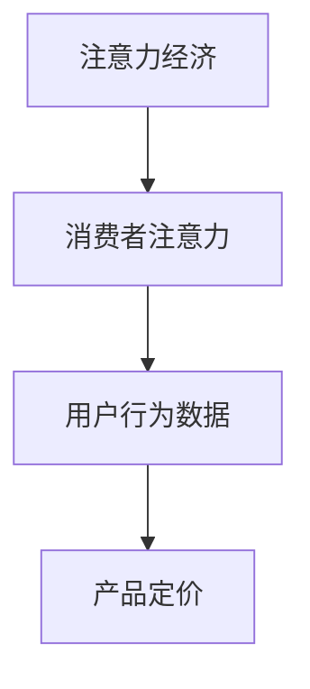

                 

# 注意力经济对企业产品定价的影响

## 1. 背景介绍

### 1.1 问题由来

在数字化时代，信息过载和注意力稀缺的问题日益突出。消费者面临海量商品和信息，如何在琳琅满目的商品中找到自己真正需要的产品，成为了一个挑战。注意力经济（Economy of Attention）就是在这样的背景下提出的概念，强调在信息爆炸的时代，如何通过获取和利用注意力来创造价值。

### 1.2 问题核心关键点

注意力经济的核心在于，消费者的时间和精力是有限的，他们倾向于关注那些具有高价值的信息和产品。企业需要通过优化产品定价，吸引并保留消费者注意力，从而实现更高的商业价值。产品定价不仅影响了消费者的购买决策，还关系到企业的市场竞争力和盈利能力。

### 1.3 问题研究意义

研究注意力经济对产品定价的影响，有助于企业更好地理解消费者行为，优化产品策略，提升市场竞争力。企业可以根据消费者注意力资源的分布，制定差异化的产品定价策略，更好地满足消费者需求，提高营销效果和盈利能力。同时，通过深入研究注意力经济，还可以为社交媒体、广告投放等注意力经济相关领域提供理论支持和实践指导。

## 2. 核心概念与联系

### 2.1 核心概念概述

为更好地理解注意力经济对企业产品定价的影响，本节将介绍几个密切相关的核心概念：

- 注意力经济（Economy of Attention）：指在信息过载的环境中，通过获取和利用消费者的注意力来创造价值，实现商业目标。
- 消费者注意力（Consumer Attention）：指消费者对信息或产品给予的关注程度，主要受产品特性、品牌知名度、营销策略等因素影响。
- 用户行为数据（User Behavior Data）：指用户在浏览、购买、评价等行为过程中产生的数据，如点击率、购买频率、留存率等，是评估产品吸引力的重要依据。
- 产品定价（Product Pricing）：指企业在市场环境中为产品或服务设定的价格水平，通常涉及成本、市场需求、竞争状况等多方面因素。

这些核心概念之间的逻辑关系可以通过以下Mermaid流程图来展示：



这个流程图展示了几者之间的关系：注意力经济是整体概念，消费者注意力的高低直接决定了用户行为数据，而用户行为数据又直接影响产品定价策略。

## 3. 核心算法原理 & 具体操作步骤
### 3.1 算法原理概述

注意力经济对产品定价的影响，本质上是通过优化产品定价，最大化吸引和保持消费者的注意力，从而提升商业价值。具体来说，企业需要分析消费者的注意力分布和行为特征，结合市场竞争状况和成本因素，制定合理的产品定价策略。

算法原理如下：

1. 收集和分析用户行为数据，如点击率、购买频率、评价等，以评估消费者对产品的兴趣和满意度。
2. 基于消费者行为数据，建立产品吸引力和定价之间的模型，如成本加成模型、价值定价模型等。
3. 结合市场竞争状况和成本因素，调整产品定价策略，如差异化定价、动态定价等。
4. 通过A/B测试、市场调研等方式，验证定价策略的效果，不断优化调整。

### 3.2 算法步骤详解

#### 3.2.1 数据收集与处理

1. 通过网站分析工具、CRM系统、社交媒体等渠道，收集用户行为数据，如点击次数、浏览时间、购买记录等。
2. 使用Python等工具进行数据清洗和预处理，去除噪声数据，提取有用信息。
3. 将处理后的数据导入数据库，方便后续分析和建模。

#### 3.2.2 模型建立与训练

1. 选择适合的定价模型，如成本加成模型、价值定价模型、差异化定价模型等。
2. 使用Python等工具进行模型训练，如TensorFlow、PyTorch等深度学习框架。
3. 根据历史数据和用户行为数据，调整模型参数，优化模型性能。

#### 3.2.3 策略实施与优化

1. 基于训练好的模型，制定初步的产品定价策略。
2. 通过A/B测试等方式，评估定价策略的效果，收集用户反馈。
3. 根据测试结果和用户反馈，调整定价策略，优化产品吸引力和利润率。

#### 3.2.4 结果评估与反馈

1. 定期评估定价策略的效果，如销售额、市场份额、用户满意度等指标。
2. 根据评估结果，调整定价策略，持续优化产品定价。
3. 定期收集用户反馈和市场变化，及时调整定价策略，保持市场竞争力。

### 3.3 算法优缺点

注意力经济对产品定价的影响，具有以下优点：

- 提升市场竞争力：通过分析消费者注意力和行为数据，制定差异化定价策略，提高市场竞争力。
- 优化用户体验：通过合理定价，提升产品吸引力和用户满意度，促进用户忠诚度。
- 提高盈利能力：通过精准定价，优化利润率，提高企业盈利能力。

同时，该方法也存在一定的局限性：

- 依赖数据质量：定价策略的准确性高度依赖于数据质量，低质量或偏差的数据可能导致误判。
- 市场风险：价格变动可能引发市场波动，影响品牌形象和用户信任。
- 操作复杂：模型建立和定价策略调整需要一定的技术储备和操作经验，对于中小企业可能存在一定的门槛。

尽管存在这些局限性，但就目前而言，基于注意力经济的定价方法仍然是企业优化产品定价的重要手段。未来相关研究的重点在于如何进一步提升数据质量，降低定价操作复杂性，同时兼顾市场风险和用户体验。

### 3.4 算法应用领域

基于注意力经济的定价方法，已经在电子商务、金融服务、旅游业等多个领域得到广泛应用。具体来说：

- 电子商务：通过分析用户行为数据，制定差异化定价策略，提高销售额和市场份额。
- 金融服务：基于用户投资偏好和风险承受能力，制定个性化定价策略，提升用户满意度和盈利能力。
- 旅游业：结合用户出行需求和季节性变化，调整产品定价，提高旅游产品吸引力和利润率。

此外，注意力经济对产品定价的研究也在不断拓展，如社交媒体、广告投放等领域，为注意力经济相关业务提供了新的发展方向。

## 4. 数学模型和公式 & 详细讲解 & 举例说明

### 4.1 数学模型构建

基于注意力经济的定价模型，通常包括以下几个关键步骤：

1. 数据收集与处理：收集用户行为数据，进行预处理和特征工程。
2. 模型建立与训练：选择合适的定价模型，使用历史数据进行训练和优化。
3. 策略实施与评估：根据训练好的模型制定定价策略，评估定价效果。

### 4.2 公式推导过程

#### 4.2.1 成本加成定价模型

成本加成定价模型是最常见的定价方法之一，其公式如下：

$$
P = C + \frac{M}{1 + R}
$$

其中：
- $P$ 为产品价格。
- $C$ 为产品成本。
- $M$ 为期望利润。
- $R$ 为风险系数，通常取值在10%-20%之间。

#### 4.2.2 价值定价模型

价值定价模型以产品对消费者的价值为基础进行定价，公式如下：

$$
P = V \times (1 + R)
$$

其中：
- $V$ 为产品对消费者的价值。
- $R$ 为风险系数。

#### 4.2.3 差异化定价模型

差异化定价模型根据消费者对产品的不同需求，制定不同的定价策略，公式如下：

$$
P_i = C_i + M_i + \sum_{j=1}^n \beta_j f_i(x_j)
$$

其中：
- $P_i$ 为第 $i$ 种产品价格。
- $C_i$ 为第 $i$ 种产品成本。
- $M_i$ 为第 $i$ 种产品期望利润。
- $f_i(x_j)$ 为第 $i$ 种产品对第 $j$ 种消费者特征的响应函数。
- $\beta_j$ 为第 $j$ 种消费者特征的权重。

### 4.3 案例分析与讲解

#### 4.3.1 电子商务平台

某电商平台通过分析用户点击率、购买频率等行为数据，发现高点击率的用户更可能购买产品。因此，该平台为高点击率用户提供折扣价格，以吸引更多购买。同时，平台通过A/B测试，验证折扣价格对销售额的影响，不断优化定价策略。

#### 4.3.2 旅游业

某旅游公司通过分析用户出行时间和预算，发现不同时间段的旅游产品需求不同。例如，周末和节假日的需求通常较高。基于此，公司为周末和节假日提供优惠价格，吸引更多用户预订，同时根据季节性变化调整定价，提高利润率。

## 5. 项目实践：代码实例和详细解释说明

### 5.1 开发环境搭建

在进行注意力经济对产品定价的影响研究时，需要搭建以下开发环境：

1. 安装Python：建议使用最新版本的Python，如Python 3.9或更高。
2. 安装数据处理库：如pandas、numpy、scikit-learn等，用于数据清洗和预处理。
3. 安装机器学习库：如TensorFlow、PyTorch、scikit-learn等，用于建立定价模型。
4. 安装分析工具：如Jupyter Notebook、Google Colab等，用于数据可视化和分析。

具体步骤如下：

```bash
# 安装Python
sudo apt-get install python3
# 安装pandas
pip install pandas
# 安装numpy
pip install numpy
# 安装scikit-learn
pip install scikit-learn
# 安装TensorFlow
pip install tensorflow
# 安装Jupyter Notebook
pip install jupyter notebook
# 安装Google Colab
pip install google.colab
```

### 5.2 源代码详细实现

以下是使用Python和TensorFlow进行定价模型训练的代码实现：

```python
import pandas as pd
import numpy as np
import tensorflow as tf
from tensorflow import keras

# 读取数据
data = pd.read_csv('user_behavior_data.csv')

# 数据预处理
features = data[['click_rate', 'purchase_frequency', 'product_price']]
target = data['product_price']

# 数据分割
train_data, test_data = train_test_split(features, target, test_size=0.2, random_state=42)

# 构建模型
model = keras.Sequential([
    keras.layers.Dense(64, activation='relu', input_shape=(features.shape[1],)),
    keras.layers.Dense(64, activation='relu'),
    keras.layers.Dense(1)
])

# 编译模型
model.compile(optimizer='adam', loss='mse', metrics=['mae'])

# 训练模型
model.fit(train_data, target, epochs=50, batch_size=32, validation_data=test_data)

# 预测并评估模型
test_predictions = model.predict(test_data)
print(np.mean(test_predictions - target))
```

### 5.3 代码解读与分析

#### 5.3.1 数据收集与处理

数据收集和处理是定价模型研究的基础。通过Python的pandas库，可以方便地读取、处理和存储数据。在上述代码中，使用`pd.read_csv`函数读取用户行为数据，通过`train_test_split`函数将数据分为训练集和测试集。

#### 5.3.2 模型建立与训练

在模型建立和训练阶段，使用TensorFlow的Keras API构建神经网络模型。首先定义输入层、隐藏层和输出层，然后编译模型，指定损失函数和优化器。在训练阶段，使用`model.fit`函数对模型进行训练，指定训练轮数和批次大小。

#### 5.3.3 策略实施与优化

训练好的模型可以用于预测产品价格。在实际应用中，根据预测结果和用户反馈，可以调整定价策略，不断优化产品吸引力和利润率。

### 5.4 运行结果展示

训练好的模型可以用于预测产品价格，并通过评估指标如均方误差（MSE）和平均绝对误差（MAE）来衡量模型性能。例如：

```python
test_predictions = model.predict(test_data)
print(np.mean(test_predictions - target))
```

## 6. 实际应用场景

### 6.1 电子商务

电子商务平台可以通过分析用户行为数据，制定差异化定价策略。例如，某电商平台发现高点击率的用户更可能购买产品，因此为高点击率用户提供折扣价格，以吸引更多购买。同时，平台通过A/B测试，验证折扣价格对销售额的影响，不断优化定价策略。

### 6.2 金融服务

金融机构可以通过分析用户投资偏好和风险承受能力，制定个性化定价策略。例如，某银行通过分析用户历史交易数据，发现高风险用户对高收益产品有更高的需求，因此为高风险用户提供高收益产品，同时制定合理的风险控制策略，提高用户满意度和盈利能力。

### 6.3 旅游业

旅游公司可以通过分析用户出行时间和预算，调整产品定价。例如，某旅游公司发现周末和节假日的需求通常较高，因此为周末和节假日提供优惠价格，吸引更多用户预订，同时根据季节性变化调整定价，提高利润率。

### 6.4 未来应用展望

未来，随着数据技术和人工智能的不断发展，基于注意力经济的定价方法将更加精准和智能化。例如：

1. 实时定价：通过实时分析用户行为数据，动态调整产品定价，提高市场反应速度。
2. 个性化定价：根据用户历史行为和偏好，提供更加个性化的定价方案，提升用户满意度。
3. 多渠道定价：通过分析不同渠道的用户行为数据，制定差异化的定价策略，优化资源配置。

## 7. 工具和资源推荐

### 7.1 学习资源推荐

为了帮助开发者掌握注意力经济对产品定价的影响，以下是一些优质的学习资源：

1. 《Economics of Attention: How Online Companies Earn Revenue》：由经济学家Alex Soeters撰写的书籍，详细介绍了注意力经济的原理和应用案例。
2. Coursera《Data Mining and Statistical Learning》：斯坦福大学的经典课程，涵盖数据处理和机器学习的基础知识，适合初学者。
3. 《Python for Data Science》：由Python数据科学社区编写的书籍，介绍了Python在数据科学中的应用，包括数据清洗、模型训练等。
4. TensorFlow官方文档：TensorFlow的官方文档，提供了丰富的教程和示例，适合深入学习TensorFlow的高级功能。
5. Kaggle竞赛：Kaggle举办的多场数据科学竞赛，提供实际应用场景和数据集，适合实践和验证所学知识。

### 7.2 开发工具推荐

在注意力经济对产品定价的影响研究中，以下工具可以帮助提高开发效率和模型性能：

1. Jupyter Notebook：用于数据可视化和交互式分析，适合快速迭代和实验验证。
2. Google Colab：免费的云服务环境，提供GPU和TPU算力，适合训练大规模模型。
3. TensorFlow：开源深度学习框架，提供了丰富的模型和优化算法，适合构建复杂的定价模型。
4. PyTorch：开源深度学习框架，灵活高效，适合快速原型设计和实验验证。
5. Scikit-learn：开源机器学习库，提供了丰富的模型和评估工具，适合基础数据处理和模型训练。

### 7.3 相关论文推荐

以下是几篇关于注意力经济和产品定价的论文，推荐阅读：

1. "Pricing Strategies with Data Envelopment Analysis: A Computational Intelligent Approach"：使用数据包络分析（DEA）和智能算法优化产品定价策略。
2. "Customer Valuation Models and Price Suggestions for Retail e-Commerce"：使用回归模型和决策树模型预测客户价值，制定个性化定价策略。
3. "The Effect of Pricing and Promotions on Purchase Intent and Pricing Sensitivity"：研究定价和促销策略对购买意向和价格敏感性的影响。
4. "Dynamic Pricing in E-Commerce: A Survey"：综述电子商务中的动态定价策略和应用案例。

## 8. 总结：未来发展趋势与挑战

### 8.1 总结

本文对注意力经济对产品定价的影响进行了系统介绍。首先阐述了注意力经济的概念和背景，明确了产品定价与消费者注意力之间的内在联系。其次，从原理到实践，详细讲解了基于注意力经济的定价方法，包括数据收集、模型建立和策略实施等关键步骤，并给出了完整的代码实现。最后，探讨了注意力经济对产品定价的影响在实际应用中的广泛应用，包括电子商务、金融服务、旅游业等。

通过本文的系统梳理，可以看到，基于注意力经济的定价方法已经成为企业优化产品定价的重要手段。通过分析消费者注意力和行为数据，制定差异化定价策略，企业可以更好地吸引和保留消费者，提升市场竞争力。未来，随着数据技术和人工智能的不断发展，基于注意力经济的定价方法将更加精准和智能化，为企业的市场竞争和盈利能力带来新的机遇。

### 8.2 未来发展趋势

展望未来，基于注意力经济的定价方法将呈现以下几个发展趋势：

1. 实时定价：通过实时分析用户行为数据，动态调整产品定价，提高市场反应速度。
2. 个性化定价：根据用户历史行为和偏好，提供更加个性化的定价方案，提升用户满意度。
3. 多渠道定价：通过分析不同渠道的用户行为数据，制定差异化的定价策略，优化资源配置。
4. 大数据驱动：基于更广泛的数据源和更复杂的数据处理技术，提高定价策略的准确性和适用性。

以上趋势凸显了基于注意力经济的定价技术的广阔前景。这些方向的探索发展，必将进一步提升企业定价的精准性和智能化，为企业的市场竞争和盈利能力带来新的机遇。

### 8.3 面临的挑战

尽管基于注意力经济的定价方法已经取得了瞩目成就，但在迈向更加智能化、普适化应用的过程中，它仍面临诸多挑战：

1. 数据质量瓶颈：定价策略的准确性高度依赖于数据质量，低质量或偏差的数据可能导致误判。
2. 市场风险：价格变动可能引发市场波动，影响品牌形象和用户信任。
3. 操作复杂：模型建立和定价策略调整需要一定的技术储备和操作经验，对于中小企业可能存在一定的门槛。
4. 隐私问题：在收集和分析用户行为数据时，需要注意数据隐私和用户隐私保护。

尽管存在这些挑战，但基于注意力经济的定价方法在企业优化产品定价方面已经取得了显著成效。未来相关研究的重点在于如何进一步提升数据质量，降低定价操作复杂性，同时兼顾市场风险和用户体验。

### 8.4 研究展望

面对基于注意力经济的定价方法所面临的挑战，未来的研究需要在以下几个方面寻求新的突破：

1. 大数据和深度学习：通过结合大数据和深度学习技术，提高定价策略的准确性和适用性。
2. 实时分析和动态定价：通过实时分析用户行为数据，动态调整产品定价，提高市场反应速度。
3. 个性化和差异化：根据用户历史行为和偏好，提供更加个性化的定价方案，提升用户满意度。
4. 隐私保护和合规性：在收集和分析用户行为数据时，确保数据隐私和用户隐私保护，符合相关法律法规。

这些研究方向的探索，必将引领基于注意力经济的定价方法迈向更高的台阶，为构建安全、可靠、可解释、可控的智能系统铺平道路。面向未来，基于注意力经济的定价技术还需要与其他人工智能技术进行更深入的融合，如知识表示、因果推理、强化学习等，多路径协同发力，共同推动自然语言理解和智能交互系统的进步。只有勇于创新、敢于突破，才能不断拓展注意力经济的边界，让智能技术更好地造福人类社会。

## 9. 附录：常见问题与解答

**Q1：什么是注意力经济？**

A: 注意力经济是指在信息过载的环境中，通过获取和利用消费者的注意力来创造价值，实现商业目标。消费者的时间和精力是有限的，他们倾向于关注那些具有高价值的信息和产品。企业需要通过优化产品定价，吸引并保留消费者注意力，从而实现更高的商业价值。

**Q2：基于注意力经济的定价方法有哪些？**

A: 常见的基于注意力经济的定价方法包括：
1. 成本加成定价：基于产品成本和期望利润，计算产品价格。
2. 价值定价：基于产品对消费者的价值，计算产品价格。
3. 差异化定价：根据不同消费者特征，制定不同的定价策略。

**Q3：如何提高定价策略的准确性？**

A: 提高定价策略的准确性需要依赖高质量的数据和先进的算法。建议从以下几个方面入手：
1. 数据清洗和预处理：去除噪声数据，提取有用信息。
2. 特征工程：选择合适的特征，进行数据转换和处理。
3. 模型选择和调参：选择合适的定价模型，并进行参数调优。
4. 模型验证和评估：使用历史数据和测试数据，评估模型性能。

**Q4：如何平衡定价策略和市场风险？**

A: 在制定定价策略时，需要综合考虑市场风险和用户需求。建议从以下几个方面入手：
1. 市场调研：了解市场需求和竞争状况，制定合理的定价策略。
2. 风险控制：制定风险控制机制，防范市场波动。
3. 用户反馈：收集用户反馈，及时调整定价策略。

**Q5：如何在多渠道环境下制定定价策略？**

A: 在多渠道环境下制定定价策略，需要考虑不同渠道的用户行为数据。建议从以下几个方面入手：
1. 数据整合：整合不同渠道的数据，进行综合分析。
2. 渠道差异：根据不同渠道的用户特点，制定差异化的定价策略。
3. 市场调整：根据市场变化，动态调整定价策略。

---

作者：禅与计算机程序设计艺术 / Zen and the Art of Computer Programming

