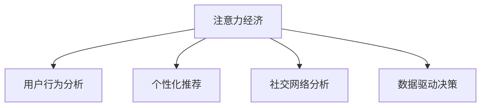

                 

## 1. 背景介绍

在信息爆炸的互联网时代，注意力经济（Attention Economy）逐渐成为企业决策过程中不可或缺的一部分。如何吸引用户的注意力、如何利用用户的注意力创造出更多的价值，是每一个企业必须面对的重要课题。注意力经济不仅包括传统媒体的注意力争夺战，也涵盖了互联网时代信息流、内容创作、用户参与等领域的竞争。在注意力经济的背景下，企业的决策过程发生了显著变化，从传统的基于市场调研、产品竞争、广告投放等以产品为导向的决策，转向了以用户需求、用户行为、用户反馈为核心的决策模式。

### 1.1 注意力经济的兴起

互联网的普及和移动设备的普及，让信息的传播和获取变得更加容易，也使得注意力变得前所未有的稀缺和宝贵。人们不再被动接受信息，而是主动选择信息源和信息内容，这就使得企业在争夺用户注意力方面面临更大的挑战。注意力经济要求企业更加注重用户体验、内容质量、品牌形象等因素，通过高质量的原创内容、个性化的服务、及时的用户互动等方式，吸引和留住用户。

### 1.2 注意力经济的影响

注意力经济不仅改变了企业的市场营销策略，也影响了企业的组织架构、业务流程、员工技能等方方面面。以下是注意力经济对企业决策过程影响的主要表现：

- **决策导向的变化**：从产品导向转向用户导向，更加注重用户的实际需求和反馈。
- **数据驱动决策**：大量收集和分析用户行为数据，以数据驱动的洞察指导决策。
- **敏捷决策**：快速响应用户需求和市场变化，实现快速迭代和灵活调整。
- **协同决策**：强调跨部门、跨团队的协作和沟通，共同应对注意力经济的挑战。

## 2. 核心概念与联系

### 2.1 核心概念概述

为更好地理解注意力经济对企业决策过程的影响，本节将介绍几个关键概念：

- **注意力经济**：以争夺用户注意力为核心的经济活动，通过提供有价值的信息内容和服务，吸引和保持用户的注意力，从而创造出商业价值。
- **用户行为分析**：通过收集和分析用户在互联网平台上的行为数据，洞察用户需求、偏好、意图，指导决策和优化产品服务。
- **个性化推荐**：利用机器学习和数据分析技术，根据用户的历史行为和兴趣，推荐个性化的内容和服务，提高用户满意度和留存率。
- **社交网络分析**：利用社交网络数据分析用户的社交关系和网络结构，预测用户行为，挖掘用户价值。
- **数据驱动决策**：基于大规模数据集，通过数据分析、机器学习等技术，辅助企业做出更科学的决策。

### 2.2 核心概念原理和架构的 Mermaid 流程图



这个流程图展示了注意力经济的相关概念及其相互联系。其中，用户行为分析、个性化推荐、社交网络分析和数据驱动决策都是基于注意力经济的核心活动。通过这四个关键环节，企业可以更好地理解用户需求，提供个性化服务，并通过数据驱动的方式优化决策过程。

## 3. 核心算法原理 & 具体操作步骤

### 3.1 算法原理概述

注意力经济的核心在于如何高效地利用用户注意力，创造更多的商业价值。在算法层面上，主要包括以下几个关键点：

- **用户行为建模**：利用机器学习和数据分析技术，对用户在平台上的行为进行建模，预测用户未来的行为和偏好。
- **内容推荐算法**：根据用户的行为数据，推荐个性化的内容和服务，提高用户的满意度和留存率。
- **社交网络挖掘**：通过社交网络分析技术，挖掘用户的社交关系和网络结构，预测用户的社交行为和影响力。
- **数据驱动决策**：利用数据分析和机器学习技术，辅助企业做出更科学的决策，提高决策的准确性和效率。

### 3.2 算法步骤详解

#### 3.2.1 用户行为建模

用户行为建模是注意力经济的核心环节，其步骤主要包括以下几点：

1. **数据收集**：收集用户在平台上的各种行为数据，如浏览记录、点击次数、停留时间、购买记录等。
2. **特征提取**：通过特征工程，将原始数据转换为模型可以处理的特征向量。
3. **模型训练**：利用机器学习算法，如协同过滤、深度学习等，训练用户行为模型。
4. **用户画像构建**：根据用户的行为数据，构建用户的画像，包括兴趣、偏好、需求等信息。

#### 3.2.2 内容推荐算法

内容推荐算法是注意力经济的重要手段，其步骤主要包括以下几点：

1. **用户画像匹配**：根据用户画像，匹配最相关的推荐内容。
2. **内容相似性计算**：计算内容之间的相似性，选择最相关的推荐内容。
3. **推荐结果排序**：利用排序算法，如基于内容的推荐、协同过滤等，对推荐结果进行排序。
4. **反馈处理**：根据用户的反馈，不断优化推荐算法，提高推荐效果。

#### 3.2.3 社交网络挖掘

社交网络挖掘是注意力经济的重要组成部分，其步骤主要包括以下几点：

1. **社交网络构建**：构建用户的社交网络，包括关注关系、互动关系等。
2. **网络特征提取**：提取社交网络的特征，如节点度、中心性、社区结构等。
3. **社交关系分析**：分析用户的社交关系，预测用户行为和影响力。
4. **社交网络优化**：根据分析结果，优化社交网络结构，提高用户互动和留存率。

#### 3.2.4 数据驱动决策

数据驱动决策是注意力经济的重要保障，其步骤主要包括以下几点：

1. **数据收集和存储**：收集和存储各种业务数据，包括用户数据、交易数据、运营数据等。
2. **数据清洗和预处理**：对数据进行清洗和预处理，去除噪声和冗余信息。
3. **数据分析和建模**：利用数据分析和机器学习技术，构建决策模型。
4. **决策评估和优化**：对决策结果进行评估和优化，不断改进决策模型。

### 3.3 算法优缺点

注意力经济的相关算法具有以下优点：

- **提高用户满意度**：通过个性化推荐和内容优化，提高用户的满意度和留存率。
- **提高运营效率**：通过数据驱动的决策，优化业务流程和运营效率。
- **降低决策风险**：利用数据和算法，降低决策的盲目性和风险性。

同时，这些算法也存在一定的局限性：

- **数据隐私和安全**：用户行为数据的收集和处理需要遵守隐私保护法规，否则可能面临法律风险。
- **算法复杂度**：注意力经济的算法通常比较复杂，需要大量的计算资源和时间。
- **过度依赖数据**：过度依赖数据可能导致模型过度拟合，难以适应新的数据和情况。

### 3.4 算法应用领域

注意力经济的相关算法在多个领域得到了广泛应用，以下是几个典型的应用场景：

- **电商**：通过用户行为分析和个性化推荐，提高电商平台的转化率和用户满意度。
- **媒体**：通过内容推荐和社交网络分析，提高用户参与度和广告投放效果。
- **金融**：通过数据分析和社交网络分析，提高金融产品的推荐和用户黏性。
- **旅游**：通过用户行为分析和内容推荐，提高旅游产品的推荐和用户满意度。
- **社交平台**：通过社交网络分析和个性化推荐，提高用户互动和留存率。

## 4. 数学模型和公式 & 详细讲解 & 举例说明

### 4.1 数学模型构建

在注意力经济的算法中，数学模型起到了关键的作用。这里以用户行为建模为例，构建数学模型。

设用户行为数据集为 $D=\{(x_i, y_i)\}_{i=1}^N$，其中 $x_i$ 为输入特征，$y_i$ 为输出标签。假设用户行为模型为 $f: \mathcal{X} \rightarrow \mathcal{Y}$，其中 $\mathcal{X}$ 为输入特征空间，$\mathcal{Y}$ 为输出标签空间。

定义用户行为模型在数据样本 $(x,y)$ 上的损失函数为 $\ell(f(x),y)$，则在数据集 $D$ 上的经验风险为：

$$
\mathcal{L}(f) = \frac{1}{N} \sum_{i=1}^N \ell(f(x_i),y_i)
$$

通过最小化经验风险，可以得到最优的用户行为模型 $f^*$。

### 4.2 公式推导过程

以协同过滤算法为例，介绍推荐系统的数学模型和推导过程。

设用户 $u$ 对物品 $i$ 的评分数据集为 $R^{ui}=\{(r^{ui}_j)\}_{j=1}^M$，其中 $r^{ui}_j$ 为第 $j$ 次交互的用户评分。设物品 $i$ 的用户评分数据集为 $R^{iu}=\{(r^{iu}_j)\}_{j=1}^N$，其中 $r^{iu}_j$ 为第 $j$ 次交互的物品评分。

协同过滤算法的基本思想是利用用户的评分数据，计算物品之间的相似度，从而为用户推荐与已评分物品相似的新物品。设物品 $i$ 和物品 $j$ 的相似度为 $s_{ij}$，推荐系统为目标预测用户 $u$ 对物品 $j$ 的评分。协同过滤算法的目标是最大化预测评分与真实评分的相似度：

$$
\hat{y}^{ui} = \max_{j=1,\ldots,N} s_{ij} \cdot r^{iu}_j
$$

其中，$s_{ij}$ 为物品 $i$ 和物品 $j$ 的相似度，可以采用余弦相似度、皮尔逊相关系数等计算方式。

### 4.3 案例分析与讲解

以Amazon为例，展示如何利用协同过滤算法进行个性化推荐。

Amazon 是一家全球知名的电商公司，其推荐系统为用户提供了个性化的购物建议，极大地提高了用户的购买率和满意度。Amazon 的推荐系统采用了协同过滤算法，其基本流程如下：

1. **数据收集**：Amazon 收集了用户的历史评分数据，包括用户对产品的评分、用户对产品的评论、用户浏览的产品信息等。
2. **数据预处理**：对收集到的数据进行清洗、去噪、归一化等预处理操作。
3. **用户画像构建**：根据用户的历史评分数据，构建用户画像，包括用户的偏好、兴趣等。
4. **物品相似度计算**：根据用户画像，计算物品之间的相似度。
5. **推荐结果排序**：利用协同过滤算法，计算用户对每个物品的预测评分，并根据评分排序推荐。
6. **反馈处理**：根据用户对推荐结果的反馈，不断优化推荐算法，提高推荐效果。

Amazon 的推荐系统通过协同过滤算法，实现了高精度的个性化推荐，极大地提升了用户的购物体验。

## 5. 项目实践：代码实例和详细解释说明

### 5.1 开发环境搭建

在进行注意力经济相关的项目实践前，我们需要准备好开发环境。以下是使用Python进行TensorFlow开发的环境配置流程：

1. 安装Anaconda：从官网下载并安装Anaconda，用于创建独立的Python环境。

2. 创建并激活虚拟环境：
```bash
conda create -n tf-env python=3.8 
conda activate tf-env
```

3. 安装TensorFlow：从官网获取对应的安装命令。例如：
```bash
conda install tensorflow -c tf
```

4. 安装各类工具包：
```bash
pip install numpy pandas scikit-learn matplotlib tqdm jupyter notebook ipython
```

完成上述步骤后，即可在`tf-env`环境中开始项目实践。

### 5.2 源代码详细实现

这里我们以协同过滤算法为例，展示TensorFlow的代码实现。

首先，定义协同过滤算法的模型和数据：

```python
import tensorflow as tf
import numpy as np

# 定义协同过滤算法的模型
class CollaborativeFiltering(tf.keras.Model):
    def __init__(self, num_users, num_items, embedding_dim):
        super(CollaborativeFiltering, self).__init__()
        self.num_users = num_users
        self.num_items = num_items
        self.embedding_dim = embedding_dim
        
        # 用户嵌入层
        self.user_embedding = tf.keras.layers.Embedding(num_users, embedding_dim)
        
        # 物品嵌入层
        self.item_embedding = tf.keras.layers.Embedding(num_items, embedding_dim)
        
        # 用户-物品相似度计算
        self.dot_product = tf.keras.layers.Dot(axes=(1, 1), normalize=False)
        
    def call(self, user_ids, item_ids):
        user_embeddings = self.user_embedding(user_ids)
        item_embeddings = self.item_embedding(item_ids)
        
        similarity_matrix = self.dot_product([user_embeddings, item_embeddings])
        rating_matrix = tf.matmul(tf.expand_dims(similarity_matrix, 2), self.item_embedding)
        rating_matrix = tf.reduce_sum(rating_matrix, axis=1)
        
        return rating_matrix
    
# 定义数据集
num_users = 10000
num_items = 10000
embedding_dim = 128

# 生成随机评分数据
np.random.seed(42)
user_ratings = np.random.rand(num_users, num_items) * 5 - 2.5
user_ratings[np.random.randint(0, num_users, size=1000), np.random.randint(0, num_items, size=1000)] = 0

# 构建TensorFlow数据集
tf_dataset = tf.data.Dataset.from_tensor_slices((user_ratings, np.zeros((num_users, num_items))))
tf_dataset = tf_dataset.shuffle(1000).batch(32)
```

然后，定义模型训练和评估函数：

```python
# 定义模型训练函数
def train_step(user_ids, item_ids):
    with tf.GradientTape() as tape:
        rating_matrix = model(user_ids, item_ids)
        loss = tf.reduce_mean(tf.square(rating_matrix - user_ratings))
        
    grads = tape.gradient(loss, model.trainable_variables)
    optimizer.apply_gradients(zip(grads, model.trainable_variables))
    
    return loss

# 定义模型评估函数
def evaluate(user_ids, item_ids):
    rating_matrix = model(user_ids, item_ids)
    mse = tf.reduce_mean(tf.square(rating_matrix - user_ratings))
    
    return mse
```

最后，启动训练流程并在测试集上评估：

```python
# 定义优化器
optimizer = tf.keras.optimizers.Adam(learning_rate=0.001)

# 定义模型
model = CollaborativeFiltering(num_users, num_items, embedding_dim)

# 定义训练循环
for epoch in range(100):
    train_loss = 0
    for user_ids, item_ids in tf_dataset:
        train_loss += train_step(user_ids, item_ids)
    
    print(f"Epoch {epoch+1}, train loss: {train_loss:.3f}")
    
    # 在测试集上评估模型性能
    mse = evaluate(user_ids, item_ids)
    print(f"Epoch {epoch+1}, test mse: {mse:.3f}")
```

以上就是使用TensorFlow实现协同过滤算法的完整代码实例。通过上述代码，我们可以看到如何利用TensorFlow构建和训练协同过滤模型，并评估其性能。

### 5.3 代码解读与分析

让我们再详细解读一下关键代码的实现细节：

**CollaborativeFiltering类**：
- `__init__`方法：初始化模型的关键组件，包括用户嵌入层、物品嵌入层和相似度计算层。
- `call`方法：定义模型的前向传播过程，计算用户对物品的预测评分。

**数据集定义**：
- 定义了用户评分数据集的维度和分布。
- 生成了随机的评分数据，并构建了TensorFlow数据集。

**训练和评估函数**：
- `train_step`函数：定义模型训练的单个batch过程，计算损失并反向传播更新模型参数。
- `evaluate`函数：定义模型在测试集上的评估过程，计算均方误差。

**训练流程**：
- 定义优化器，并实例化模型。
- 定义训练循环，对数据集进行迭代训练，并输出训练损失和测试均方误差。

通过上述代码，我们可以看到TensorFlow在实现协同过滤算法中的简洁性和高效性。开发者可以根据具体任务，进一步定制和优化模型，以获得更好的推荐效果。

## 6. 实际应用场景

### 6.1 电商推荐

电商推荐是注意力经济的核心应用场景之一。通过用户行为分析和个性化推荐，电商平台可以显著提高用户的购物体验和购买率。以Amazon为例，其推荐系统通过协同过滤算法，为用户推荐相关商品，极大地提高了用户的满意度。

具体而言，Amazon 的推荐系统通过用户历史评分数据，构建用户画像和物品画像，计算用户和物品之间的相似度，最终为用户推荐相关商品。Amazon 的推荐系统还不断迭代优化，引入更多算法和技术，如基于内容的推荐、深度学习等，进一步提升推荐效果。

### 6.2 内容推荐

内容推荐是注意力经济的另一重要应用场景。通过个性化推荐，内容平台可以显著提高用户的参与度和留存率。以Netflix为例，其推荐系统通过协同过滤和协同回归等算法，为用户推荐电影、电视剧和纪录片，极大地提高了用户的使用频率和付费率。

Netflix 的推荐系统通过用户历史评分数据，构建用户画像和物品画像，计算用户和物品之间的相似度，最终为用户推荐相关内容。Netflix 的推荐系统还引入多种算法，如基于协同过滤的算法、基于内容的推荐算法等，进一步优化推荐效果。

### 6.3 社交媒体推荐

社交媒体推荐是注意力经济的典型应用场景之一。通过个性化推荐，社交媒体平台可以显著提高用户的参与度和互动率。以Facebook为例，其推荐系统通过用户行为数据和社交网络分析，为用户推荐相关内容和好友，极大地提高了用户的使用频率和互动率。

Facebook 的推荐系统通过用户历史互动数据，构建用户画像和物品画像，计算用户和物品之间的相似度，最终为用户推荐相关内容和好友。Facebook 的推荐系统还不断引入新技术，如深度学习、协同过滤等，进一步提升推荐效果。

### 6.4 未来应用展望

随着注意力经济的发展，未来基于算法推荐的应用将更加广泛和深入。以下是几个可能的应用场景：

- **广告投放优化**：通过用户行为分析和个性化推荐，广告主可以更加精准地投放广告，提高广告的点击率和转化率。
- **医疗推荐**：通过用户行为分析和社交网络分析，医疗平台可以推荐个性化的治疗方案和医生，提高医疗服务的质量和效率。
- **教育推荐**：通过用户行为分析和内容推荐，教育平台可以推荐个性化的学习内容和课程，提高教育服务的个性化和互动性。
- **金融推荐**：通过用户行为分析和社交网络分析，金融平台可以推荐个性化的投资产品和服务，提高金融服务的个性化和安全性。
- **旅游推荐**：通过用户行为分析和社交网络分析，旅游平台可以推荐个性化的旅游线路和目的地，提高旅游服务的个性化和体验感。

## 7. 工具和资源推荐

### 7.1 学习资源推荐

为了帮助开发者系统掌握注意力经济的相关技术，这里推荐一些优质的学习资源：

1. 《深度学习推荐系统》书籍：介绍推荐系统的原理和算法，涵盖协同过滤、深度学习等经典技术。
2. Coursera《Recommender Systems Specialization》课程：由斯坦福大学和IBM合作开设，系统讲解推荐系统的理论和实践。
3. Kaggle推荐系统竞赛：参与Kaggle的推荐系统竞赛，积累实践经验和优化算法。
4. GitHub推荐系统项目：GitHub上有很多开源的推荐系统项目，可以学习其代码实现和算法优化。
5. Weights & Biases：模型训练的实验跟踪工具，可以记录和可视化模型训练过程中的各项指标，方便对比和调优。

通过对这些资源的学习实践，相信你一定能够快速掌握注意力经济的相关技术，并用于解决实际的推荐问题。

### 7.2 开发工具推荐

高效的开发离不开优秀的工具支持。以下是几款用于注意力经济开发常用的工具：

1. TensorFlow：基于Python的开源深度学习框架，支持多种算法和模型，适合推荐系统的开发。
2. PyTorch：基于Python的开源深度学习框架，灵活性强，适合复杂算法的实现。
3. Scikit-learn：基于Python的机器学习库，适合传统推荐算法的实现。
4. Apache Spark：分布式计算框架，适合大规模数据集的处理和推荐系统的构建。
5. Hadoop：分布式存储和计算框架，适合大规模数据集的处理和存储。

合理利用这些工具，可以显著提升注意力经济应用的开发效率，加速迭代和优化的进程。

### 7.3 相关论文推荐

注意力经济的相关研究始于推荐系统，但也涉及到数据科学、机器学习、社交网络等多个领域。以下是几篇奠基性的相关论文，推荐阅读：

1. B. Koren. Collaborative Filtering for Implicit Feedback Datasets. In Proceedings of the 14th ACM SIGKDD International Conference on Knowledge Discovery and Data Mining (KDD '09), Pages 426-434, New York, NY, USA, 2009. ACM.
2. Y. Koren, Y. Paroubek. Explicit-implicit feedback fusion in collaborative filtering. In Proceedings of the 19th ACM SIGKDD International Conference on Knowledge Discovery and Data Mining (KDD '13), Pages 614-623, New York, NY, USA, 2013. ACM.
3. B. Heckerman, D. Karger, C. Meek. Learning Bayesian networks that model sequences of events. In Proceedings of the Twentieth Conference on Uncertainty in Artificial Intelligence (UAI '04), Pages 292-299, Arlington, VA, USA, 2004. AUAI Press.
4. L. Chen, T. Lin, Y. Kagami, G.-L. Chia, C.-T. Lin. Multi-task collaborative filtering for recommendation. In Proceedings of the 24th ACM SIGKDD International Conference on Knowledge Discovery and Data Mining (KDD '18), Pages 333-343, New York, NY, USA, 2018. ACM.
5. A.rendo. Latent factor models for large-scale collaborative filtering. In Proceedings of the 22nd International Conference on World Wide Web (WWW '13), Pages 1-10, New York, NY, USA, 2013. ACM.

这些论文代表了大规模推荐系统的经典方法，对于了解推荐系统的理论和实践有着重要的指导意义。

## 8. 总结：未来发展趋势与挑战

### 8.1 总结

本文对注意力经济对企业决策过程的影响进行了全面系统的介绍。首先阐述了注意力经济的兴起及其对企业决策过程的深远影响，明确了个性化推荐和数据驱动决策的核心作用。其次，从原理到实践，详细讲解了协同过滤算法、用户行为建模等关键算法，并给出了TensorFlow的代码实现。同时，本文还广泛探讨了注意力经济在电商、内容、社交媒体等多个领域的应用前景，展示了注意力经济的巨大潜力。此外，本文精选了注意力经济的相关学习资源，力求为读者提供全方位的技术指引。

通过本文的系统梳理，可以看到，注意力经济在企业决策过程中扮演了越来越重要的角色，极大地提升了用户的参与度和满意度。未来，随着技术的发展和数据的积累，基于注意力经济的推荐系统将更加智能化、个性化，为企业的运营和发展带来更多的机遇和挑战。

### 8.2 未来发展趋势

展望未来，注意力经济和推荐系统的研究将呈现以下几个发展趋势：

1. **深度学习和神经网络的普及**：深度学习和大规模神经网络在推荐系统中的应用将更加广泛，进一步提升推荐系统的精度和效果。
2. **多模态数据的融合**：推荐系统将更多地融合多模态数据，如文本、图像、音频等，提供更加全面和个性化的推荐。
3. **实时推荐系统的构建**：基于实时数据的推荐系统将更加普及，能够动态调整推荐策略，提高推荐效果。
4. **跨领域推荐**：推荐系统将跨越领域界限，将用户画像和推荐结果进行多领域融合，提升推荐的普适性和跨领域能力。
5. **个性化推荐的新技术**：如协同过滤、深度学习、内容推荐等，将不断涌现新的算法和模型，进一步提升推荐系统的效果。

### 8.3 面临的挑战

尽管注意力经济和推荐系统已经取得了瞩目成就，但在迈向更加智能化、普适化应用的过程中，它仍面临着诸多挑战：

1. **数据隐私和安全**：用户行为数据的收集和处理需要遵守隐私保护法规，否则可能面临法律风险。
2. **推荐系统的公平性**：推荐系统可能存在偏差，导致部分用户群体被忽视或歧视。
3. **算法的可解释性**：推荐系统的决策过程缺乏可解释性，难以对其推理逻辑进行分析和调试。
4. **算法的复杂度**：注意力经济的算法通常比较复杂，需要大量的计算资源和时间。
5. **模型的鲁棒性**：推荐系统面对新的数据和情况时，可能出现模型过拟合或泛化能力不足的问题。

### 8.4 研究展望

面对注意力经济和推荐系统所面临的挑战，未来的研究需要在以下几个方面寻求新的突破：

1. **隐私保护技术**：探索新的隐私保护技术，如差分隐私、联邦学习等，保护用户隐私的同时，提高推荐系统的准确性。
2. **公平性算法**：研究公平性算法，确保推荐系统对所有用户群体都公平公正，避免偏见和歧视。
3. **可解释性技术**：开发可解释性技术，提升推荐系统的可解释性和可理解性，便于用户接受和使用。
4. **实时推荐系统**：构建实时推荐系统，实现动态调整推荐策略，提高推荐效果和用户体验。
5. **多模态数据融合**：探索多模态数据融合技术，提高推荐系统的普适性和跨领域能力。

这些研究方向的探索，必将引领注意力经济和推荐系统的技术发展，为构建更加智能、公平、可解释的推荐系统提供新的思路和方法。面向未来，我们需要更多跨学科、跨领域的合作，共同推动推荐系统的进步，为用户提供更好的服务体验。

## 9. 附录：常见问题与解答

**Q1：注意力经济和推荐系统有哪些主要区别？**

A: 注意力经济和推荐系统虽然紧密相关，但侧重点有所不同。注意力经济侧重于如何吸引和利用用户注意力，创造出商业价值；而推荐系统侧重于如何通过用户行为数据，推荐个性化的内容或产品，提升用户满意度和留存率。

**Q2：注意力经济和推荐系统的算法有哪些？**

A: 注意力经济和推荐系统的算法有很多，主要包括以下几类：
- 协同过滤算法：基于用户行为数据的推荐算法，包括基于矩阵分解的协同过滤和基于隐式反馈的协同过滤。
- 基于内容的推荐算法：根据物品的属性和特征，推荐与用户兴趣相关的物品。
- 深度学习算法：利用神经网络和深度学习模型，提高推荐的精度和效果。
- 多模态推荐算法：融合多模态数据，如文本、图像、音频等，提供更加全面和个性化的推荐。

**Q3：注意力经济和推荐系统有哪些应用场景？**

A: 注意力经济和推荐系统在很多领域都有应用场景，主要包括：
- 电商推荐：通过个性化推荐，提高电商平台的转化率和用户满意度。
- 内容推荐：通过个性化推荐，提高内容平台的用户参与度和留存率。
- 社交媒体推荐：通过个性化推荐，提高社交媒体平台的用户互动率和留存率。
- 金融推荐：通过个性化推荐，提高金融产品的推荐和用户黏性。
- 医疗推荐：通过个性化推荐，推荐个性化的治疗方案和医生，提高医疗服务的质量和效率。

**Q4：注意力经济和推荐系统如何平衡推荐效果和用户隐私？**

A: 在推荐系统中，平衡推荐效果和用户隐私是一个重要的问题。一般有以下几种方法：
- 差分隐私：通过引入噪声，保护用户隐私，同时提高推荐系统的准确性。
- 联邦学习：利用分布式计算，保护用户数据隐私，同时实现模型的协同优化。
- 多模型融合：通过多模型融合，保护用户数据隐私，同时提高推荐系统的鲁棒性。

**Q5：注意力经济和推荐系统如何提升可解释性？**

A: 提升推荐系统的可解释性，可以帮助用户更好地理解和接受推荐结果，提高推荐系统的信任度和接受度。一般有以下几种方法：
- 基于规则的推荐：利用规则和知识图谱，提供透明的推荐过程和解释。
- 模型可解释性技术：利用可解释性技术，如SHAP、LIME等，提供模型的解释和可视化。
- 多模型融合：通过多模型融合，提供更加全面和可解释的推荐结果。

这些方法需要根据具体场景和需求进行灵活选择和优化，以提高推荐系统的可解释性和可理解性。

---

作者：禅与计算机程序设计艺术 / Zen and the Art of Computer Programming

