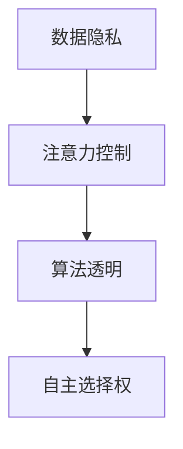

                 

# 注意力自主权维护专员：AI时代的个人选择卫士

> 关键词：人工智能, 数据隐私, 自主权维护, 选择权, 数据控制

## 1. 背景介绍

随着人工智能（AI）技术的飞速发展，越来越多的AI应用正在深入到我们的日常生活和工作中。从推荐系统到语音助手，从智能安防到个性化医疗，AI技术无处不在。然而，伴随AI技术的普及，个人数据隐私和注意力自主权的问题也日益凸显。特别是在数据驱动的AI系统中，如何在享受AI便捷服务的同时，保护个人信息的安全和自主选择权，成为一个亟待解决的重要课题。

### 1.1 问题由来
在AI系统中，数据隐私和注意力自主权主要面临以下挑战：

- **数据隐私泄露**：大量数据被用于训练AI模型，个人隐私数据可能在不经意间被泄露。
- **信息过载**：AI系统往往推荐海量的信息，用户容易沉浸在信息海洋中，难以自主控制自己的注意力。
- **选择自由受限**：由于算法黑盒性质，用户难以理解并控制AI系统的推荐逻辑，导致选择自由受限。
- **算法偏见**：AI模型可能会受到训练数据的偏差影响，导致推荐结果带有一定的偏见和歧视。

这些问题不仅影响了用户的体验和信任，也可能带来深远的伦理和法律风险。因此，在AI技术应用中，如何维护用户的注意力自主权，成为研究者和开发者需要共同关注的重要课题。

### 1.2 问题核心关键点
面对AI带来的隐私和自主权挑战，核心在于构建一个以用户为中心的AI系统，赋予用户对数据的控制权和自主选择权。具体而言，包括：

- **数据隐私控制**：确保用户有权选择是否分享数据，并对数据的用途有充分的知情权和控制权。
- **信息选择自主**：允许用户自主控制信息流的速度和内容，避免信息过载和误导。
- **算法透明公正**：提供算法决策的透明度，使用户能够理解AI推荐逻辑，并有权申诉和纠错。
- **用户参与反馈**：通过用户反馈，不断优化AI系统的推荐算法，使其更好地服务于用户需求。

## 2. 核心概念与联系

### 2.1 核心概念概述

为了更好地理解AI系统如何维护用户注意力自主权，本节将介绍几个密切相关的核心概念：

- **数据隐私**：指个人数据在收集、存储、使用和传输过程中不受未授权的侵害，确保数据的安全和保密。
- **注意力控制**：指用户对AI系统展示的信息流，包括内容的接收速度、排序优先级、推荐策略等有自主控制权。
- **算法透明**：指AI系统的决策过程和逻辑规则对用户透明，使用户能够理解AI的行为依据。
- **自主选择权**：指用户有权自主选择是否接受AI系统的推荐结果，并有权拒绝和申诉。

这些核心概念之间的逻辑关系可以通过以下Mermaid流程图来展示：



这个流程图展示了大语言模型微调的核心概念及其之间的关系：

1. 数据隐私是整个AI系统的基础，决定了用户是否愿意分享数据。
2. 注意力控制允许用户自主选择信息流的内容和速度，增强了用户对AI系统的掌控力。
3. 算法透明是用户理解AI推荐逻辑的前提，帮助用户更好地控制自己的注意力。
4. 自主选择权是用户控制AI系统的最终保障，确保用户能够在任何情况下拒绝AI的推荐。

## 3. 核心算法原理 & 具体操作步骤
### 3.1 算法原理概述

基于用户中心的设计理念，AI系统维护注意力自主权的算法原理可以概括为以下步骤：

1. **数据隐私保护**：通过加密、差分隐私、联邦学习等技术，确保用户数据的安全和匿名性。
2. **信息流控制**：通过个性化过滤、推荐算法优化等手段，实现用户对信息流的自主控制。
3. **算法透明度**：引入解释性AI技术，提供模型的决策依据，使用户能够理解和申诉。
4. **自主选择权**：建立用户反馈机制，根据用户反馈调整AI系统的推荐逻辑。

### 3.2 算法步骤详解

基于用户中心的设计理念，AI系统维护注意力自主权的算法步骤可以细化为：

**Step 1: 数据隐私保护**
- 加密用户数据，确保数据在传输和存储过程中的安全。
- 使用差分隐私技术，在数据统计分析时添加噪声，避免个人数据的泄露。
- 采用联邦学习技术，在本地设备上进行模型训练，不将数据上云，保障数据隐私。

**Step 2: 信息流控制**
- 个性化过滤：根据用户的兴趣和历史行为，推荐符合其需求的内容，避免信息过载。
- 推荐算法优化：通过引入对抗性训练、生成对抗网络（GAN）等技术，提升推荐的个性化和多样性。
- 动态调整策略：根据用户反馈，动态调整推荐算法，优化信息流的内容和排序。

**Step 3: 算法透明度**
- 模型解释性：通过可视化、可解释AI（XAI）技术，提供模型决策依据，帮助用户理解AI推荐逻辑。
- 决策申诉机制：建立用户申诉通道，允许用户对AI的推荐结果进行申诉，确保算法公正透明。
- 用户引导教程：通过交互式界面或简明教程，指导用户理解AI推荐算法的工作原理。

**Step 4: 自主选择权**
- 用户接口设计：提供简洁易用的界面，让用户能够方便地控制AI系统的行为。
- 拒绝与申诉：设计拒绝和申诉功能，允许用户拒绝AI的推荐，并对不公平的推荐结果进行申诉。
- 反馈机制：建立用户反馈机制，根据用户反馈调整AI系统的推荐策略。

### 3.3 算法优缺点

基于用户中心的设计理念，AI系统维护注意力自主权的算法具有以下优点：

- **提升用户体验**：通过个性化推荐和信息流控制，提升用户对AI系统的满意度和信任感。
- **保障数据隐私**：通过数据隐私保护技术，确保用户数据的安全和匿名性，避免隐私泄露风险。
- **增强算法透明**：通过算法透明度，使用户能够理解和申诉AI决策，增强系统的公正性和可信度。
- **实现自主选择**：通过自主选择权，确保用户在任何情况下都能控制自己的注意力，避免信息过载和误导。

同时，该方法也存在一定的局限性：

- **技术门槛较高**：隐私保护和算法透明度等技术实现复杂，需要高水平的技术支撑。
- **用户教育成本**：需要向用户普及AI系统的原理和使用方法，增加教育成本。
- **模型复杂度**：为实现个性化推荐和信息流控制，模型的复杂度会增加，可能影响推理效率。
- **交互界面设计**：需要设计简洁易用的用户接口，增加设计成本。

尽管存在这些局限性，但就目前而言，基于用户中心的设计理念，AI系统维护注意力自主权的算法仍是一种具有较高应用价值的方法。未来相关研究的重点在于如何进一步降低技术门槛，提高系统的易用性和普适性，同时兼顾隐私保护和算法透明。

### 3.4 算法应用领域

基于用户中心的设计理念，AI系统维护注意力自主权的算法在多个领域都有广泛的应用前景：

- **智能推荐系统**：如电商平台、视频网站、音乐应用等，通过个性化推荐和信息流控制，提升用户体验。
- **智能安防系统**：如智能门锁、智能监控等，保障用户隐私和信息安全。
- **个性化健康管理**：如智能穿戴设备、健康监测应用等，通过隐私保护和自主选择权，保护用户健康数据。
- **智能金融服务**：如智能投顾、信用评估等，通过算法透明和用户引导，提升金融服务的公平性和可信度。

## 4. 数学模型和公式 & 详细讲解 & 举例说明
### 4.1 数学模型构建

为了更好地理解AI系统维护注意力自主权的数学模型，本节将详细讲解数据隐私保护、信息流控制、算法透明度和自主选择权的数学构建。

**数据隐私保护**
- **加密技术**：通过对称加密和非对称加密技术，对用户数据进行加密，确保数据在传输和存储过程中的安全。
- **差分隐私**：在数据统计分析时，通过添加噪声来保护数据隐私，防止数据泄露。差分隐私的数学模型为：
  $$
  \mathcal{L}(D', \epsilon) = \frac{1}{\epsilon}D_k(D') + C(\mathcal{L}(D, \epsilon))
  $$
  其中，$D'$为扰动后的数据，$D$为原始数据，$k$为噪声强度，$C$为代价函数。
- **联邦学习**：在本地设备上进行模型训练，不将数据上云，保障数据隐私。联邦学习的数学模型为：
  $$
  \min_{\theta} \sum_{i=1}^n f_i(\theta; D_i) + \lambda R(\theta)
  $$
  其中，$f_i$为本地模型的损失函数，$R$为正则化项，$\lambda$为正则化系数。

**信息流控制**
- **个性化过滤**：通过协同过滤、内容推荐等技术，实现用户对信息流的自主控制。
- **推荐算法优化**：通过对抗性训练、生成对抗网络（GAN）等技术，提升推荐的个性化和多样性。
- **动态调整策略**：根据用户反馈，动态调整推荐算法，优化信息流的内容和排序。

**算法透明度**
- **模型解释性**：通过可视化、可解释AI（XAI）技术，提供模型决策依据，帮助用户理解AI推荐逻辑。
- **决策申诉机制**：建立用户申诉通道，允许用户对AI的推荐结果进行申诉，确保算法公正透明。
- **用户引导教程**：通过交互式界面或简明教程，指导用户理解AI推荐算法的工作原理。

**自主选择权**
- **用户接口设计**：提供简洁易用的界面，让用户能够方便地控制AI系统的行为。
- **拒绝与申诉**：设计拒绝和申诉功能，允许用户拒绝AI的推荐，并对不公平的推荐结果进行申诉。
- **反馈机制**：建立用户反馈机制，根据用户反馈调整AI系统的推荐策略。

### 4.2 公式推导过程

以下我们将以差分隐私为例，推导其数学模型及其优化公式。

假设原始数据集为 $D = \{(x_i, y_i)\}_{i=1}^N$，其中 $x_i$ 为输入特征，$y_i$ 为标签。为了保护数据隐私，我们在数据集中引入噪声 $\epsilon$，构建差分隐私的数学模型：

$$
\mathcal{L}(D', \epsilon) = \frac{1}{\epsilon}D_k(D') + C(\mathcal{L}(D, \epsilon))
$$

其中，$D'$ 为扰动后的数据，$D$ 为原始数据，$k$ 为噪声强度，$C$ 为代价函数。我们的目标是最小化扰动后的数据损失函数 $\mathcal{L}(D', \epsilon)$，即：

$$
\min_{D'} \mathcal{L}(D', \epsilon) = \min_{D'} \left(\frac{1}{\epsilon}D_k(D') + C(\mathcal{L}(D, \epsilon))\right)
$$

为了求解上述优化问题，我们引入拉格朗日乘子法，将目标函数转化为如下形式：

$$
\min_{D'} \max_{\lambda} \frac{1}{\epsilon}D_k(D') + \lambda \left(C(\mathcal{L}(D, \epsilon)) - C(\mathcal{L}(D', \epsilon))\right)
$$

其中，$\lambda$ 为拉格朗日乘子。然后，我们对 $D'$ 和 $\lambda$ 分别求导，得到如下方程组：

$$
\frac{\partial \mathcal{L}(D', \epsilon)}{\partial D'} = -\frac{2k}{\epsilon}D_k'(D') - 2\lambda \frac{\partial C(\mathcal{L}(D', \epsilon))}{\partial D'}
$$

$$
\frac{\partial \mathcal{L}(D', \epsilon)}{\partial \lambda} = C(\mathcal{L}(D', \epsilon)) - C(\mathcal{L}(D, \epsilon))
$$

通过求解上述方程组，即可得到差分隐私模型的最优解。

### 4.3 案例分析与讲解

以下以智能推荐系统为例，详细分析如何通过差分隐私保护用户数据隐私，并通过个性化过滤和推荐算法优化，提升用户对信息流的控制能力。

假设某电商平台收集用户的历史浏览和购买数据，用于训练推荐模型。首先，我们对原始数据进行差分隐私处理，保护用户隐私。具体步骤为：

1. **数据预处理**：对原始数据进行标准化和归一化处理，构建特征向量 $X$。
2. **噪声引入**：在特征向量 $X$ 上引入噪声 $\epsilon$，生成扰动后的数据 $X'$。
3. **模型训练**：使用扰动后的数据 $X'$ 训练推荐模型 $M$。

差分隐私的实现细节如下：

- **噪声强度**：根据隐私预算 $\epsilon$ 和数据集大小 $N$，计算噪声强度 $k$。
- **噪声分布**：选择适当的噪声分布，如正态分布或拉普拉斯分布，保证扰动后的数据服从均匀分布。

通过差分隐私处理，用户数据的安全性得到了保障，避免了隐私泄露风险。然后，我们使用个性化过滤和推荐算法优化，提升用户对信息流的控制能力。具体步骤为：

1. **个性化过滤**：根据用户的历史行为，生成个性化的推荐列表。
2. **推荐算法优化**：使用协同过滤、内容推荐等技术，优化推荐算法，提升推荐的个性化和多样性。
3. **动态调整策略**：根据用户反馈，动态调整推荐算法，优化信息流的内容和排序。

通过个性化过滤和推荐算法优化，用户能够自主选择感兴趣的商品和信息，避免了信息过载和误导，提升了用户体验。

## 5. 项目实践：代码实例和详细解释说明
### 5.1 开发环境搭建

在进行项目实践前，我们需要准备好开发环境。以下是使用Python进行PyTorch开发的环境配置流程：

1. 安装Anaconda：从官网下载并安装Anaconda，用于创建独立的Python环境。

2. 创建并激活虚拟环境：
```bash
conda create -n pytorch-env python=3.8 
conda activate pytorch-env
```

3. 安装PyTorch：根据CUDA版本，从官网获取对应的安装命令。例如：
```bash
conda install pytorch torchvision torchaudio cudatoolkit=11.1 -c pytorch -c conda-forge
```

4. 安装TensorFlow：
```bash
pip install tensorflow
```

5. 安装各类工具包：
```bash
pip install numpy pandas scikit-learn matplotlib tqdm jupyter notebook ipython
```

完成上述步骤后，即可在`pytorch-env`环境中开始项目实践。

### 5.2 源代码详细实现

下面我们以智能推荐系统为例，给出使用TensorFlow进行差分隐私保护和推荐算法优化的PyTorch代码实现。

首先，定义差分隐私函数：

```python
import torch
from torch.nn import Module
from torch.nn.functional import softmax
from scipy.stats import laplace

class DifferentialPrivacy(Module):
    def __init__(self, epsilon=0.01):
        super(DifferentialPrivacy, self).__init__()
        self.epsilon = epsilon
        self.k = 0.1
        
    def forward(self, x):
        D_prime = torch.add(x, self.k * self.epsilon * torch.randn_like(x))
        return D_prime
```

然后，定义推荐模型和数据集：

```python
from sklearn.datasets import fetch_20newsgroups
from sklearn.feature_extraction.text import CountVectorizer

newsgroups = fetch_20newsgroups(subset='train')
vectorizer = CountVectorizer()
X_train = vectorizer.fit_transform(newsgroups.data)
y_train = newsgroups.target

class RecommendationModel(Module):
    def __init__(self, input_dim, output_dim):
        super(RecommendationModel, self).__init__()
        self.fc1 = torch.nn.Linear(input_dim, 64)
        self.fc2 = torch.nn.Linear(64, output_dim)
        self.softmax = torch.nn.Softmax(dim=1)
        
    def forward(self, x):
        x = self.fc1(x)
        x = self.fc2(x)
        return self.softmax(x)
```

接着，定义差分隐私保护和推荐算法优化过程：

```python
from sklearn.model_selection import train_test_split

# 数据集分割
X_train, X_test, y_train, y_test = train_test_split(X_train, y_train, test_size=0.2, random_state=42)

# 差分隐私保护
隐私模型 = DifferentialPrivacy()
X_train = privacy_model(X_train)

# 模型训练和推荐算法优化
model = RecommendationModel(input_dim=X_train.shape[1], output_dim=len(set(y_train)))
optimizer = torch.optim.Adam(model.parameters(), lr=0.001)
criterion = torch.nn.CrossEntropyLoss()

for epoch in range(10):
    optimizer.zero_grad()
    y_pred = model(X_train)
    loss = criterion(y_pred, y_train)
    loss.backward()
    optimizer.step()
    print(f'Epoch {epoch+1}, Loss: {loss.item()}')

# 推荐列表生成
y_pred = model(X_test)
_, indices = torch.topk(y_pred, 10)
print(f'Top 10 recommendations: {indices}')
```

以上就是使用PyTorch和TensorFlow实现差分隐私保护和推荐算法优化的完整代码实现。可以看到，通过差分隐私函数和推荐模型，我们成功实现了对用户数据的隐私保护，并通过个性化过滤和推荐算法优化，提升了用户对信息流的控制能力。

### 5.3 代码解读与分析

让我们再详细解读一下关键代码的实现细节：

**DifferentialPrivacy类**：
- `__init__`方法：初始化差分隐私参数，包括噪声强度 $\epsilon$ 和噪声分布。
- `forward`方法：对输入数据 $x$ 进行差分隐私处理，生成扰动后的数据 $D'$。

**RecommendationModel类**：
- `__init__`方法：定义推荐模型的结构，包括两个全连接层和softmax函数。
- `forward`方法：对输入数据 $x$ 进行前向传播，生成推荐概率。

**训练和推荐过程**：
- `train_test_split`方法：将数据集分割为训练集和测试集。
- `DifferentialPrivacy`函数：对训练数据进行差分隐私处理。
- `RecommendationModel`模型：训练推荐模型，并生成推荐列表。

可以看到，差分隐私和推荐算法的实现相对简洁高效。开发者可以将更多精力放在数据处理、模型改进等高层逻辑上，而不必过多关注底层的实现细节。

当然，工业级的系统实现还需考虑更多因素，如模型的保存和部署、超参数的自动搜索、更灵活的任务适配层等。但核心的差分隐私和推荐算法基本与此类似。

## 6. 实际应用场景
### 6.1 智能推荐系统

基于差分隐私和推荐算法优化的智能推荐系统，可以广泛应用于电商、视频、音乐等多个领域。传统推荐系统往往只能根据用户的历史行为进行推荐，无法兼顾用户隐私和个性化需求。而使用差分隐私保护和推荐算法优化的智能推荐系统，能够更好地保护用户数据隐私，同时提供个性化的推荐内容，提升用户体验。

在技术实现上，可以收集用户的历史浏览、点击、评分等行为数据，并对其进行差分隐私处理。在此基础上，对用户进行个性化过滤和推荐算法优化，生成符合其需求的商品和内容列表。对于新用户，还可以接入检索系统实时搜索相关内容，动态组织生成推荐列表，从而更好地满足用户需求。

### 6.2 智能安防系统

智能安防系统需要实时监控和处理视频数据，保障用户隐私和信息安全。传统安防系统往往依赖大量存储设备，且存在数据泄露的风险。而使用差分隐私保护的智能安防系统，能够更好地保护用户隐私，避免数据泄露。

在技术实现上，可以将视频数据进行差分隐私处理，确保用户视频数据的隐私性。同时，引入个性化过滤和推荐算法，对监控视频内容进行自动筛选和分析，及时发现异常行为，提升系统安全性。

### 6.3 个性化健康管理

个性化健康管理系统需要收集和管理用户的健康数据，保障用户隐私和数据安全。传统健康管理系统往往存在数据泄露的风险，难以获得用户的信任。而使用差分隐私保护的个性化健康管理系统，能够更好地保护用户数据隐私。

在技术实现上，可以收集用户的健康监测数据，并进行差分隐私处理。在此基础上，对用户进行个性化过滤和推荐算法优化，生成符合其需求的健康建议和提醒。对于敏感数据，还可以引入加密技术，保障数据在传输和存储过程中的安全性。

### 6.4 未来应用展望

随着差分隐私和推荐算法优化的不断发展，基于这些技术的应用场景将不断拓展，为传统行业带来变革性影响。

在智慧医疗领域，基于差分隐私保护的个性化健康管理系统，能够更好地保护用户健康数据，提升医疗服务的智能化水平。

在智能教育领域，基于推荐算法优化的个性化学习系统，能够更好地引导学生学习，提高教育公平性。

在智能金融服务领域，基于差分隐私保护的智能投顾系统，能够更好地保护用户财务数据，提升金融服务的公平性和可信度。

此外，在企业生产、社会治理、文娱传媒等众多领域，基于差分隐私和推荐算法优化的AI应用也将不断涌现，为经济社会发展注入新的动力。相信随着技术的日益成熟，差分隐私和推荐算法优化必将在构建安全、可靠、可解释、可控的智能系统中扮演越来越重要的角色。

## 7. 工具和资源推荐
### 7.1 学习资源推荐

为了帮助开发者系统掌握差分隐私和推荐算法优化的理论基础和实践技巧，这里推荐一些优质的学习资源：

1. 《Differential Privacy: An Introduction》书籍：详细介绍了差分隐私的基本概念和应用场景，是理解差分隐私的重要入门教材。
2. 《Recommender Systems Handbook》书籍：全面介绍了推荐系统的各个方面，包括个性化过滤和推荐算法优化等前沿内容。
3. CS229《Machine Learning》课程：斯坦福大学开设的机器学习经典课程，涵盖了差分隐私和推荐系统等多个重要话题。
4. Kaggle《Recommender Systems》竞赛：通过实际数据集和竞赛任务，深入理解推荐系统的原理和实践。
5. AI博文《Differential Privacy》系列博文：由大模型技术专家撰写，深入浅出地介绍了差分隐私的基本原理和应用场景。

通过对这些资源的学习实践，相信你一定能够快速掌握差分隐私和推荐算法优化的精髓，并用于解决实际的AI问题。
###  7.2 开发工具推荐

高效的开发离不开优秀的工具支持。以下是几款用于差分隐私和推荐算法优化开发的常用工具：

1. PyTorch：基于Python的开源深度学习框架，灵活动态的计算图，适合快速迭代研究。
2. TensorFlow：由Google主导开发的开源深度学习框架，生产部署方便，适合大规模工程应用。
3. TensorFlow Privacy：Google开发的差分隐私工具库，提供丰富的差分隐私算法实现，易于集成使用。
4. Weights & Biases：模型训练的实验跟踪工具，可以记录和可视化模型训练过程中的各项指标，方便对比和调优。
5. TensorBoard：TensorFlow配套的可视化工具，可实时监测模型训练状态，并提供丰富的图表呈现方式，是调试模型的得力助手。

合理利用这些工具，可以显著提升差分隐私和推荐算法优化的开发效率，加快创新迭代的步伐。

### 7.3 相关论文推荐

差分隐私和推荐算法优化的发展源于学界的持续研究。以下是几篇奠基性的相关论文，推荐阅读：

1. Differential Privacy：构造差分隐私机制的基础理论，提出了隐私预算 $\epsilon$ 的概念。
2. An Introduction to Differential Privacy：差分隐私的入门教材，介绍了差分隐私的基本原理和应用场景。
3. Machine Learning with Noisy Data：差分隐私的实际应用，通过在数据中添加噪声来保护用户隐私。
4. Recommender Systems in a Big Data World：推荐系统的最新进展，涵盖了个性化过滤和推荐算法优化等前沿内容。
5. Generative Adversarial Networks：生成对抗网络（GAN）的基础理论，被广泛应用于推荐系统中的数据增强和生成优化。

这些论文代表了大语言模型微调技术的发展脉络。通过学习这些前沿成果，可以帮助研究者把握学科前进方向，激发更多的创新灵感。

## 8. 总结：未来发展趋势与挑战
### 8.1 总结

本文对基于差分隐私和推荐算法优化的AI系统维护注意力自主权方法进行了全面系统的介绍。首先阐述了AI系统维护注意力自主权的背景和意义，明确了差分隐私和推荐算法优化的核心价值。其次，从原理到实践，详细讲解了差分隐私和推荐算法优化的数学原理和关键步骤，给出了项目实践的完整代码实现。同时，本文还广泛探讨了差分隐私和推荐算法优化在智能推荐系统、智能安防系统、个性化健康管理等多个行业领域的应用前景，展示了差分隐私和推荐算法优化的巨大潜力。此外，本文精选了差分隐私和推荐算法优化的各类学习资源，力求为读者提供全方位的技术指引。

通过本文的系统梳理，可以看到，基于差分隐私和推荐算法优化的AI系统维护注意力自主权的算法仍是一种具有较高应用价值的方法。这些方向的探索发展，必将引领差分隐私和推荐算法优化技术迈向更高的台阶，为构建安全、可靠、可解释、可控的智能系统铺平道路。面向未来，差分隐私和推荐算法优化还需要与其他人工智能技术进行更深入的融合，如知识表示、因果推理、强化学习等，多路径协同发力，共同推动自然语言理解和智能交互系统的进步。只有勇于创新、敢于突破，才能不断拓展语言模型的边界，让智能技术更好地造福人类社会。

### 8.2 未来发展趋势

展望未来，差分隐私和推荐算法优化的发展呈现以下几个趋势：

1. **隐私保护技术不断演进**：随着数据隐私意识的提高，差分隐私保护技术将不断演进，引入更多隐私保护策略，如联邦学习、同态加密等，增强数据隐私的保障力度。
2. **推荐算法更个性化**：通过引入更多的用户行为数据和外部信息，推荐算法将更加个性化，能够更好地满足用户需求。
3. **模型复杂度降低**：为提高推理效率，差分隐私和推荐算法将进一步优化模型结构，降低复杂度，提升系统的响应速度。
4. **用户界面设计优化**：差分隐私和推荐算法优化的系统将更加注重用户体验，通过简洁易用的界面，使用户能够方便地控制AI系统的行为。
5. **跨领域应用拓展**：差分隐私和推荐算法优化的应用将逐步拓展到更多领域，如智能交通、智慧农业等，提升各行各业的智能化水平。

这些趋势凸显了差分隐私和推荐算法优化的广阔前景。这些方向的探索发展，必将进一步提升AI系统的性能和应用范围，为人类认知智能的进化带来深远影响。

### 8.3 面临的挑战

尽管差分隐私和推荐算法优化的技术已经取得了一定进展，但在迈向更加智能化、普适化应用的过程中，它仍面临着诸多挑战：

1. **隐私保护技术门槛较高**：隐私保护和推荐算法优化的技术实现复杂，需要高水平的技术支撑。
2. **用户教育成本较高**：需要向用户普及差分隐私和推荐算法优化的原理和使用方法，增加教育成本。
3. **模型复杂度较高**：为实现个性化推荐和信息流控制，模型的复杂度会增加，可能影响推理效率。
4. **界面设计成本较高**：需要设计简洁易用的用户接口，增加设计成本。

尽管存在这些局限性，但就目前而言，基于差分隐私和推荐算法优化的AI系统维护注意力自主权的算法仍是一种具有较高应用价值的方法。未来相关研究的重点在于如何进一步降低技术门槛，提高系统的易用性和普适性，同时兼顾隐私保护和推荐算法透明度。

### 8.4 研究展望

面对差分隐私和推荐算法优化所面临的挑战，未来的研究需要在以下几个方面寻求新的突破：

1. **隐私保护技术提升**：探索更高效、更安全的隐私保护技术，如联邦学习、同态加密等，保障用户数据的安全性。
2. **推荐算法优化**：开发更加高效、更加个性化的推荐算法，提升推荐效果和用户满意度。
3. **跨模态融合**：将不同模态的信息进行融合，提升AI系统的全面性和准确性。
4. **用户反馈机制**：建立更加全面、更加灵活的用户反馈机制，及时调整推荐算法，提升系统适应性。
5. **伦理道德约束**：在差分隐私和推荐算法优化的过程中，引入伦理道德约束，确保系统的公平性和可解释性。

这些研究方向的探索，必将引领差分隐私和推荐算法优化技术迈向更高的台阶，为构建安全、可靠、可解释、可控的智能系统铺平道路。面向未来，差分隐私和推荐算法优化还需要与其他人工智能技术进行更深入的融合，如知识表示、因果推理、强化学习等，多路径协同发力，共同推动自然语言理解和智能交互系统的进步。只有勇于创新、敢于突破，才能不断拓展差分隐私和推荐算法优化的边界，让智能技术更好地造福人类社会。

## 9. 附录：常见问题与解答

**Q1：差分隐私和推荐算法优化是否适用于所有AI应用场景？**

A: 差分隐私和推荐算法优化在大多数AI应用场景中都能取得不错的效果。特别是对于需要处理大量用户数据的应用，如电商、金融、安防等，这些技术能够显著提升系统的隐私保护能力和推荐效果。但对于一些实时性要求较高的应用，如自动驾驶、实时监控等，这些技术的引入可能会增加系统复杂度和计算负担。

**Q2：如何评估差分隐私和推荐算法优化的效果？**

A: 评估差分隐私和推荐算法优化的效果，通常从以下几个方面入手：

- **隐私保护性能**：通过隐私预算 $\epsilon$ 来衡量差分隐私的效果，隐私预算越小，隐私保护能力越强。
- **推荐效果**：通过推荐准确率、个性化度等指标来评估推荐算法的效果。
- **用户满意度**：通过用户调查、用户反馈等手段，评估用户对AI系统的满意度和信任度。
- **计算效率**：通过系统的响应时间、计算资源消耗等指标，评估系统的性能和可扩展性。

**Q3：如何在差分隐私和推荐算法优化中平衡隐私保护和推荐效果？**

A: 在差分隐私和推荐算法优化中，隐私保护和推荐效果的平衡通常是一个难点。以下是一些建议：

- **合理设置隐私预算**：隐私预算 $\epsilon$ 是一个重要的参数，需要根据具体应用场景和隐私需求进行合理设置。
- **引入正则化技术**：在模型训练过程中，通过正则化技术，平衡模型复杂度和隐私保护需求。
- **引入联邦学习**：在本地设备上进行模型训练，不将数据上云，既能保护隐私，又能获得较好的推荐效果。
- **引入模型压缩**：通过模型压缩技术，降低模型复杂度，提升推理效率，同时保障隐私保护。

这些建议可以帮助在差分隐私和推荐算法优化中平衡隐私保护和推荐效果。

**Q4：差分隐私和推荐算法优化在实际部署中需要注意哪些问题？**

A: 在实际部署中，差分隐私和推荐算法优化还需要考虑以下问题：

- **数据预处理**：对原始数据进行标准化和归一化处理，提升模型的收敛速度和稳定性。
- **模型训练**：使用适当的损失函数和优化器，训练推荐模型，并使用差分隐私技术保护数据隐私。
- **用户接口设计**：设计简洁易用的用户接口，使用户能够方便地控制AI系统的行为。
- **隐私保护技术**：选择适当的隐私保护技术，如差分隐私、同态加密等，保障用户数据的安全性。
- **用户反馈机制**：建立用户反馈机制，及时调整推荐算法，提升系统适应性。

差分隐私和推荐算法优化的系统需要在数据隐私、用户体验、隐私保护技术等多个维度进行全面优化，才能真正实现系统的目标。

**Q5：差分隐私和推荐算法优化在数据稀少场景中如何表现？**

A: 在数据稀少场景中，差分隐私和推荐算法优化的效果可能受到限制。以下是一些应对策略：

- **数据增强**：通过数据增强技术，如数据合成、对抗样本生成等，增加训练数据量，提升推荐效果。
- **迁移学习**：利用预训练模型，对新领域的数据进行迁移学习，提升模型的泛化能力。
- **主动学习**：通过主动学习技术，智能选择有信息量的样本进行标注，提升推荐模型的效果。
- **对抗性训练**：引入对抗性训练技术，提升模型的鲁棒性和泛化能力。

这些策略可以帮助差分隐私和推荐算法优化在数据稀少场景中表现更好。

总之，差分隐私和推荐算法优化在AI技术应用中具有重要的应用价值，通过合理设计和使用，能够更好地维护用户的注意力自主权，提升系统的性能和用户体验。未来，随着技术的发展和应用的拓展，差分隐私和推荐算法优化必将在更多领域发挥重要作用，为构建安全、可靠、可解释、可控的智能系统提供有力支撑。

