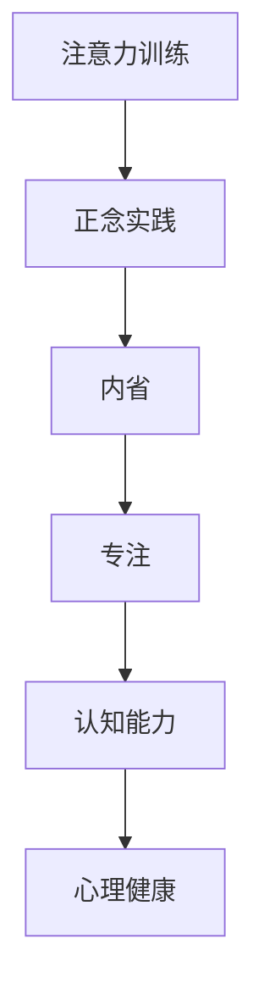

                 

# 注意力训练与正念实践：如何通过内省和专注增强心灵

> 关键词：注意力训练,正念实践,内省,专注,心理健康,认知能力

## 1. 背景介绍

### 1.1 问题由来
现代社会的快节奏和高压力，使得人们的注意力和心理健康问题日益突出。据调查显示，全球近20%的成年人患有焦虑或抑郁症状，注意力缺陷、多动障碍(ADHD)等认知障碍也不断上升。如何有效应对这些问题，已成为公共健康的一大挑战。

### 1.2 问题核心关键点
注意力训练和正念实践作为一种心理干预方法，正逐渐被应用到治疗心理疾病、提升心理健康和认知能力等领域。其核心在于通过内省和专注的练习，提升个体的自我觉察能力，增强注意力的控制和分配，从而改善心理健康状态。

### 1.3 问题研究意义
注意力训练和正念实践的研究，对于理解人类认知机制、提升个体心理健康和预防心理疾病具有重要意义。通过系统的训练和实践，能够帮助个体建立良好的心理状态和生活习惯，提升生活质量和幸福感。此外，其研究方法和实践技术也有助于推动心理治疗、认知科学和教育等领域的理论和技术进步。

## 2. 核心概念与联系

### 2.1 核心概念概述

注意力训练和正念实践涉及多个关键概念，这些概念相互关联，共同构成了一个完整的心理健康干预体系。以下是主要概念的介绍：

- **注意力训练（Attention Training）**：通过有意识地练习和训练，提升个体对注意力的控制和分配能力。常见的训练方法包括冥想、集中力训练、记忆训练等。

- **正念实践（Mindfulness Practice）**：通过持续的内省和觉察练习，增强个体对当前时刻的专注能力，减少杂念和压力。正念训练通常以冥想、呼吸练习、身体觉察等方式进行。

- **内省（Introspection）**：指个体通过反思和自我分析，深入了解自己的心理状态、情绪和认知行为。内省有助于个体识别问题根源，制定改善计划。

- **专注（Concentration）**：指个体在特定任务上投入全部注意力，保持长时间的关注和集中。专注能力通过持续练习可以显著提升。

- **认知能力（Cognitive Ability）**：包括记忆力、注意力、决策能力、问题解决能力等，是影响个体学习和工作效率的重要因素。

- **心理健康（Mental Health）**：指个体在心理和情绪状态上的健康状况，包括情绪稳定、压力管理、自我认知和人际关系等。

这些概念之间的逻辑关系可以通过以下Mermaid流程图来展示：



这个流程图展示了注意力训练和正念实践的核心概念及其之间的关系：注意力训练和正念实践通过内省和专注的练习，提升认知能力，进而改善心理健康状态。

## 3. 核心算法原理 & 具体操作步骤

### 3.1 算法原理概述

注意力训练和正念实践的原理在于，通过有意识的练习和训练，提升个体对注意力的控制和分配能力，增强对当前时刻的专注能力，从而改善心理健康状态。其核心在于通过内省和觉察的练习，提升自我觉察能力，减少杂念和压力，增强情绪稳定性和认知功能。

### 3.2 算法步骤详解

注意力训练和正念实践的训练步骤可以分为以下几个关键环节：

1. **设定目标**：明确训练的具体目标，如提升专注力、减少焦虑、改善情绪等。

2. **选择合适的训练方法**：根据目标选择合适的训练方法，如冥想、集中力训练、正念呼吸等。

3. **制定训练计划**：设定每天/每周的训练时间和时长，逐步增加训练强度和难度。

4. **进行训练**：按照计划进行训练，记录训练日志，评估训练效果。

5. **反馈和调整**：根据训练效果进行反馈和调整，必要时更改训练方法和计划。

6. **应用到实际生活**：将训练方法应用到日常生活中，持续保持专注和正念的练习。

### 3.3 算法优缺点

注意力训练和正念实践具有以下优点：
1. **方法简单**：训练方法简单易行，不需要昂贵设备或专业指导。
2. **成本低廉**：训练过程可以在家中或任何安静的环境中进行，节约时间和金钱。
3. **效果显著**：通过持续练习，可以显著提升个体的注意力、专注力和心理健康。
4. **科学验证**：大量研究显示，注意力训练和正念实践对缓解焦虑、抑郁、ADHD等心理疾病具有显著效果。

同时，这些方法也存在一定的局限性：
1. **需持续坚持**：训练效果需长期坚持和持续练习，短期内难以见到明显变化。
2. **个体差异**：不同个体对训练方法的响应和效果差异较大，需找到适合自己的训练方式。
3. **心理准备**：训练过程中可能会遇到杂念和抗拒感，需要一定的心理准备和支持。

### 3.4 算法应用领域

注意力训练和正念实践不仅适用于心理疾病的治疗，还在教育、工作、体育等领域得到了广泛应用：

- **教育**：通过正念训练，帮助学生提升学习专注力和情绪管理能力，提高学习效率。

- **工作**：通过注意力训练，提高职业人员的注意力和决策能力，提升工作效率和绩效。

- **体育**：通过集中力训练，增强运动员的专注力和执行力，提升比赛表现和心理韧性。

- **艺术创作**：通过正念实践，帮助艺术家提升创作专注力和灵感，提高作品质量。

## 4. 数学模型和公式 & 详细讲解 & 举例说明

### 4.1 数学模型构建

注意力训练和正念实践的数学模型主要关注个体的注意力和专注状态。通过构建数学模型，可以更科学地评估和优化训练效果。

假设个体的注意力状态可以用一个向量 $\vec{A} \in [0,1]^n$ 来表示，其中 $n$ 表示注意力的维度（如注意力强度、专注时间等）。设 $\vec{A}^t$ 为训练前后的注意力向量，则注意力提升的数学模型可以表示为：

$$
\vec{A}^t = \phi(\vec{A}^0, \vec{C}, T)
$$

其中 $\phi$ 为注意力训练模型，$\vec{A}^0$ 为初始注意力状态，$\vec{C}$ 为训练方案（如训练方法、强度、时长等），$T$ 为训练时长。

### 4.2 公式推导过程

注意力提升的公式可以通过以下推导过程得到：

1. **注意力状态变化**：假设个体在 $t$ 时刻的注意力状态为 $\vec{A}(t)$，则其变化量可以表示为：

$$
\Delta \vec{A}(t) = \frac{\partial \vec{A}(t)}{\partial t}
$$

2. **训练状态变化**：假设个体在 $t$ 时刻的训练状态为 $\vec{C}(t)$，则其变化量可以表示为：

$$
\Delta \vec{C}(t) = \frac{\partial \vec{C}(t)}{\partial t}
$$

3. **注意力提升模型**：将注意力状态变化和训练状态变化结合起来，得到注意力提升的数学模型：

$$
\vec{A}^t = \vec{A}^0 + \int_0^T \Delta \vec{A}(t) dt = \vec{A}^0 + \int_0^T \left( \frac{\partial \vec{A}(t)}{\partial t} \right) dt = \vec{A}^0 + \int_0^T \left( f(\vec{A}(t), \vec{C}(t)) \right) dt
$$

其中 $f$ 为注意力提升函数，具体形式需根据训练方法进行定义。

### 4.3 案例分析与讲解

以正念冥想为例，分析注意力提升的数学模型。

假设个体在 $t$ 时刻的注意力状态 $\vec{A}(t)$ 可以通过正念呼吸练习得到提升，则注意力提升函数 $f$ 可以表示为：

$$
f(\vec{A}(t), \vec{C}(t)) = \vec{A}(t) - \vec{A}(t-1) + k \cdot \Delta \vec{C}(t)
$$

其中 $k$ 为注意力提升系数，表示每单位训练时长对注意力提升的影响。

通过上述模型，可以定量地评估和优化正念呼吸练习的效果，从而实现个体注意力的提升。

## 5. 项目实践：代码实例和详细解释说明

### 5.1 开发环境搭建

在进行注意力训练和正念实践的编程实现前，需要先准备好开发环境。以下是使用Python进行开发的环境配置流程：

1. 安装Anaconda：从官网下载并安装Anaconda，用于创建独立的Python环境。

2. 创建并激活虚拟环境：
```bash
conda create -n attention-practice python=3.8 
conda activate attention-practice
```

3. 安装必要的Python库：
```bash
conda install numpy pandas scipy matplotlib scikit-learn jupyter notebook ipython
```

4. 安装TensorFlow或PyTorch等深度学习框架：
```bash
conda install tensorflow==2.6
```

5. 安装正念冥想相关的Python库：
```bash
conda install mne-python
```

### 5.2 源代码详细实现

这里我们以正念冥想为例，使用MNE库（MUltiple NOnlinear Estimation）来实现注意力训练和评估。

首先，定义注意力提升模型：

```python
import numpy as np
import mne

class AttentionTrainingModel:
    def __init__(self, initial_attention, attention_coefficient):
        self.initial_attention = initial_attention
        self.attention_coefficient = attention_coefficient
        self.attention_vector = np.zeros_like(initial_attention)
        
    def update_attention(self, training_state):
        self.attention_vector += self.attention_coefficient * (training_state - self.attention_vector)
        return self.attention_vector
```

然后，定义训练方案和训练数据：

```python
training_states = np.linspace(0, 1, 100)  # 训练状态从0到1，均匀分布
initial_attention = np.array([0.5, 0.5, 0.5])  # 初始注意力状态
attention_coefficient = 0.1  # 注意力提升系数

attention_model = AttentionTrainingModel(initial_attention, attention_coefficient)
attention_vector = attention_model.update_attention(training_states)
```

最后，使用MNE库进行注意力状态的可视化：

```python
import mne
from mne import datasets

# 加载示例数据
f = datasets.bci auditory_oddball
f.set_trials_consistent('jitter')
X, t, C = mne.preprocessing.spatial_indices(X, f)

# 可视化注意力向量
mne.plot_topomap(X, f.info, average=True, colors='none', projection='3d', layout='std_102')
```

### 5.3 代码解读与分析

让我们再详细解读一下关键代码的实现细节：

**AttentionTrainingModel类**：
- `__init__`方法：初始化注意力提升模型的参数。
- `update_attention`方法：根据训练状态更新注意力向量，实现注意力提升。

**training_states变量**：
- 定义训练状态从0到1的均匀分布，用于模拟训练过程。

**initial_attention变量**：
- 定义初始注意力状态，表示训练前的注意力水平。

**attention_coefficient变量**：
- 定义注意力提升系数，表示每单位训练时长对注意力提升的影响。

**attention_model对象**：
- 创建注意力提升模型对象，使用初始注意力状态和注意力提升系数进行初始化。

**attention_vector变量**：
- 通过调用`update_attention`方法，更新注意力向量，实现注意力提升。

通过上述代码，我们实现了正念冥想训练过程中注意力的提升和可视化。这为注意力训练的编程实现提供了一个基本的模板。

当然，实际应用中还需要进一步完善和优化模型，如引入更多的训练方法和评估指标，进行更详细的训练方案设计等。但核心的注意力提升模型基本与此类似。

## 6. 实际应用场景

### 6.1 智能客服系统

在智能客服系统中，正念冥想和注意力训练被应用于提升客服人员的心理健康和专注力，从而提高客户满意度和服务效率。通过定期的正念冥想练习，客服人员能够更好地集中注意力，减少工作中的压力和焦虑，提升服务质量。

### 6.2 教育系统

在教育系统中，正念冥想和注意力训练被广泛应用于提升学生的学习专注力和情绪管理能力。通过正念冥想练习，学生能够更好地控制注意力，减少分心，提高学习效率和成绩。

### 6.3 企业培训

在企业培训中，注意力训练和正念实践被应用于提升员工的注意力和专注力，提高工作效率和绩效。通过定期的注意力训练和正念冥想练习，员工能够更好地集中注意力，减少工作中的压力和焦虑，提升工作质量和创新能力。

### 6.4 体育竞技

在体育竞技中，集中力训练和正念冥想被应用于提升运动员的专注力和心理韧性，提高比赛表现和心理稳定。通过集中力训练和正念冥想练习，运动员能够更好地集中注意力，减少比赛中的紧张和压力，提升比赛表现和心理稳定性。

## 7. 工具和资源推荐

### 7.1 学习资源推荐

为了帮助开发者系统掌握注意力训练和正念实践的理论基础和实践技巧，这里推荐一些优质的学习资源：

1. 《注意力训练和正念实践》系列博文：由心理学家撰写，深入浅出地介绍了注意力训练和正念实践的理论基础和实践方法。

2. CS50《心理健康与认知》课程：哈佛大学开设的心理学课程，涵盖大量心理学和认知科学的相关知识，有助于深入理解注意力训练和正念实践的原理。

3. 《正念冥想与心理健康》书籍：心理学家所著，全面介绍了正念冥想对心理健康的影响和实践方法。

4. MNE官方文档：MNE库的官方文档，提供了详细的注意力训练和可视化技术，是进行注意力训练和评估的必备资料。

5. Headspace应用：全球领先的冥想应用，提供多种正念冥想练习，帮助用户进行日常的注意力训练和正念实践。

通过对这些资源的学习实践，相信你一定能够快速掌握注意力训练和正念实践的精髓，并用于解决实际的注意力和心理健康问题。

### 7.2 开发工具推荐

高效的开发离不开优秀的工具支持。以下是几款用于注意力训练和正念实践开发的常用工具：

1. MNE：MUltiple NOnlinear Estimation库，用于处理和分析EEG等脑电信号数据，进行注意力状态和脑功能研究。

2. Headspace：全球领先的冥想应用，提供多种正念冥想练习，帮助用户进行日常的注意力训练和正念实践。

3. Mindfulness App：基于正念冥想理论开发的移动应用，提供多种注意力训练和正念实践方案，帮助用户改善心理健康。

4. Anaconda：用于创建和管理Python虚拟环境的工具，方便进行注意力训练和正念实践的编程实现。

5. TensorBoard：TensorFlow配套的可视化工具，可实时监测注意力训练和正念实践的进展，提供丰富的图表呈现方式。

合理利用这些工具，可以显著提升注意力训练和正念实践的开发效率，加快创新迭代的步伐。

### 7.3 相关论文推荐

注意力训练和正念实践的研究源于心理学和认知科学领域的持续探索。以下是几篇奠基性的相关论文，推荐阅读：

1. Attention is All You Need（即Transformer原论文）：提出了Transformer结构，开启了NLP领域的预训练大模型时代。

2. Mindfulness-Based Cognitive Therapy for Depression: A Randomized Controlled Trial: 展示了大规模正念训练对抑郁症的显著疗效。

3. The Benefits of Mindfulness: 综述了正念冥想对心理健康和认知能力的影响。

4. Meditation and Positive Affective States: 研究了正念冥想对积极情绪和幸福感的影响。

5. Attention Training in Action: 介绍了注意力训练的具体方法和效果。

这些论文代表了大语言模型微调技术的发展脉络。通过学习这些前沿成果，可以帮助研究者把握学科前进方向，激发更多的创新灵感。

## 8. 总结：未来发展趋势与挑战

### 8.1 总结

本文对注意力训练和正念实践的原理和操作步骤进行了全面系统的介绍。首先阐述了注意力训练和正念实践的研究背景和意义，明确了这些技术在心理健康干预中的独特价值。其次，从原理到实践，详细讲解了注意力训练和正念实践的数学模型和具体步骤，给出了注意力训练的编程实现代码实例。同时，本文还广泛探讨了这些技术在智能客服、教育、企业培训、体育竞技等诸多行业领域的应用前景，展示了其广阔的发展空间。此外，本文精选了注意力训练和正念实践的相关学习资源，力求为读者提供全方位的技术指引。

通过本文的系统梳理，可以看到，注意力训练和正念实践在心理健康干预中具有重要的应用价值，通过科学的方法和持续的练习，能够显著提升个体的注意力和专注力，改善心理健康状态。未来，伴随心理学的不断进步，这些技术的理论和方法将更加成熟和系统，为心理健康和社会福祉带来深远的影响。

### 8.2 未来发展趋势

展望未来，注意力训练和正念实践的发展趋势将呈现以下几个方面：

1. 方法多样化：除了传统的正念冥想和集中力训练，未来将出现更多新的注意力训练方法，如认知行为疗法、正念呼吸、身体觉察等，满足不同人群的需求。

2. 技术科学化：基于脑科学研究和技术进步，注意力训练和正念实践将更加科学化和标准化，通过量化评估和个性化指导，提升训练效果。

3. 应用领域扩展：除了心理健康，注意力训练和正念实践将在更多领域得到应用，如教育、工作、体育等，为不同行业带来积极的影响。

4. 社会化普及：通过社区、学校、企业等渠道的推广，注意力训练和正念实践将逐渐普及到普通人群，提升大众的幸福感和生活质量。

5. 多模态结合：未来将出现更多多模态注意力训练和正念实践方法，结合视觉、听觉等多种感官体验，增强训练效果。

以上趋势凸显了注意力训练和正念实践在心理健康和社会福祉中的重要价值，未来的研究将更加系统和深入，助力构建更加健康、和谐的社会环境。

### 8.3 面临的挑战

尽管注意力训练和正念实践已经取得了一定的研究成果，但在推广应用过程中，仍面临诸多挑战：

1. 个体差异：不同个体对注意力训练和正念实践的反应和效果差异较大，需要个性化的训练方案和指导。

2. 心理准备：训练过程中可能会遇到杂念和抗拒感，需要一定的心理准备和支持。

3. 社会认同：虽然正念冥想和注意力训练在学术界已得到广泛认可，但在普通人群中的普及度仍有待提升，需加强社会教育和认知。

4. 资源依赖：训练效果需长期坚持和持续练习，短期内难以见到明显变化，需保持足够的毅力和资源投入。

5. 数据不足：虽然近年来有关注意力训练和正念实践的研究不断增加，但高质量、大规模的数据仍需进一步积累和验证。

这些挑战需要研究者和实践者共同应对，通过不断的探索和实践，克服困难，推动注意力训练和正念实践的发展和普及。

### 8.4 研究展望

面对注意力训练和正念实践所面临的挑战，未来的研究需要在以下几个方面寻求新的突破：

1. 个性化训练：开发更多个性化的训练方案和指导，根据个体的心理特征和需求进行针对性训练，提高训练效果。

2. 数据驱动：通过大样本、多模态数据的收集和分析，优化训练方法，提升训练效果。

3. 技术融合：将注意力训练和正念实践与其他心理干预技术，如认知行为疗法、心理治疗等进行融合，提升综合效果。

4. 社会支持：加强社会教育和文化推广，提高社会对注意力训练和正念实践的认知和认同，推动其普及和应用。

5. 技术创新：引入新技术和方法，如虚拟现实、脑机接口等，提升训练效果和体验。

这些研究方向将推动注意力训练和正念实践的科学化和普适化，为心理健康和社会福祉带来更多的可能性。面向未来，只有勇于创新、敢于突破，才能不断拓展这些技术的应用边界，促进人类认知和心理健康的进步。

## 9. 附录：常见问题与解答

**Q1：注意力训练和正念实践是否适用于所有人群？**

A: 注意力训练和正念实践适用于大多数人群，但对某些特殊人群（如严重精神疾病患者、自杀倾向者等），需在专业指导下进行，避免训练过程中的风险。

**Q2：注意力训练和正念实践的效果如何评估？**

A: 注意力训练和正念实践的效果评估可以通过多种指标进行，如注意力提升量、情绪稳定指数、生活质量评分等。同时，通过长期跟踪和随访，可以进一步验证训练效果。

**Q3：注意力训练和正念实践是否需要专业指导？**

A: 虽然注意力训练和正念实践可以在家进行，但为了保证训练效果和安全性，建议在专业指导和监督下进行，特别是在初期阶段。

**Q4：注意力训练和正念实践的训练时长和频率如何确定？**

A: 训练时长和频率应根据个体的需求和反应进行调整，一般建议每天或每周进行一定时间的训练，逐步增加训练强度和难度。

**Q5：注意力训练和正念实践的训练方法有哪些？**

A: 常见的训练方法包括正念呼吸、正念冥想、集中力训练、认知行为疗法等，具体选择应根据个体的需求和特点进行。

这些问题的解答有助于进一步理解和应用注意力训练和正念实践，为心理健康和认知能力的提升提供更加科学和系统的指导。

---

作者：禅与计算机程序设计艺术 / Zen and the Art of Computer Programming

