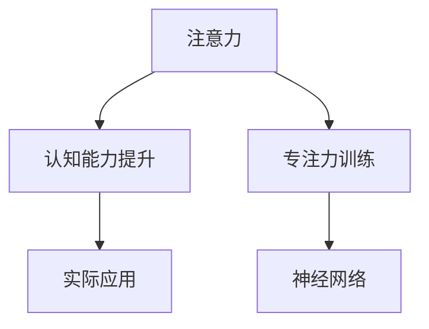

                 

# 注意力训练与认知能力提升：如何通过专注力增强你的大脑

> 关键词：注意力,认知能力提升,专注力训练,神经网络,算法

## 1. 背景介绍

### 1.1 问题由来

在当今信息爆炸的时代，如何高效地处理大量信息，提升认知能力，成为人们日益关注的问题。特别是在工作和学习中，高度集中的注意力是高效完成任务的基础。然而，随着智能设备的普及，各种信息流、通知提示等干扰源，容易让人分心，难以保持长时间的专注。

### 1.2 问题核心关键点

注意力训练旨在通过科学方法和训练技术，提高人们的专注力和认知能力，使其能够在复杂多变的环境中保持高效的专注状态。主要包括以下几个方面：

- **注意力机制**：认知心理学中的注意力机制是大脑处理信息的一种机制，通过筛选重要信息，过滤干扰因素，从而实现高效的认知加工。
- **认知提升**：注意力训练不仅能提升注意力水平，还能改善记忆、理解、问题解决等多方面的认知能力。
- **实际应用**：应用到工作、学习、日常生活等多个场景，提高信息处理和决策能力。
- **技术手段**：使用各种技术工具和算法，辅助训练效果。

### 1.3 问题研究意义

注意力训练和认知能力提升对于提升个体效能和组织竞争力具有重要意义：

1. **个体效能**：提高注意力和认知能力，使人能更高效地处理工作和学习任务，减少错误，提升决策质量。
2. **组织效率**：通过提升员工注意力和认知能力，优化团队协作和决策流程，提高整体工作效率。
3. **社会影响**：提高社会整体的认知水平和信息处理能力，推动社会进步和技术创新。

## 2. 核心概念与联系

### 2.1 核心概念概述

注意力训练和认知能力提升的核心概念主要包括以下几个方面：

- **注意力**：注意力是一种心理过程，用于选择和聚焦于相关信息，同时过滤掉无关干扰。
- **认知能力**：包括记忆、理解、推理、问题解决等多种心理过程，是学习、工作和生活中不可或缺的能力。
- **专注力**：指长时间集中注意力的能力，是注意力训练的重要目标。
- **神经网络**：现代注意力训练方法大多基于神经网络模型，特别是深度学习模型，通过训练调整神经元间的连接权重，模拟人脑处理信息的过程。

这些核心概念之间的逻辑关系可以通过以下Mermaid流程图来展示：



这个流程图展示了注意力训练和认知能力提升的主要步骤和关联：

1. 注意力是认知能力提升的基础。
2. 专注力训练通过模拟大脑的注意力机制，提高注意力的持续时间和质量。
3. 神经网络作为注意力训练的主要工具，通过学习调整模型参数，实现对注意力的模拟和优化。
4. 注意力训练效果可以应用于多个实际场景，如工作、学习、娱乐等，提升整体效能。

## 3. 核心算法原理 & 具体操作步骤
### 3.1 算法原理概述

注意力训练和认知能力提升的核心算法基于神经网络和深度学习技术。其主要原理是通过模拟人类大脑的注意力机制，构建能够学习和调整的模型，使其能够更好地筛选重要信息，过滤干扰因素，从而提升认知能力。

具体来说，注意力训练算法主要分为以下几个步骤：

1. **数据收集**：收集训练数据，包括注意力的自然观察数据（如眼动轨迹）和认知能力相关的实验数据（如记忆测试）。
2. **模型构建**：构建神经网络模型，通常使用递归神经网络(RNN)、卷积神经网络(CNN)或Transformer等架构。
3. **参数训练**：通过反向传播算法和优化器，调整模型参数，使模型能够更好地模拟注意力机制。
4. **注意力计算**：在测试数据上计算注意力分布，模拟人类大脑的注意力过程。
5. **认知能力评估**：通过对比测试数据上的注意力分布与实际认知能力数据，评估注意力训练效果。

### 3.2 算法步骤详解

以下将详细介绍注意力训练算法的具体步骤和关键技术：

**Step 1: 数据收集与预处理**
- 收集注意力相关的自然观察数据，如眼动轨迹、面部表情等，使用专业的眼动仪、面部表情识别系统等设备。
- 收集认知能力相关的实验数据，如记忆测试、推理任务等，通过标准化测试工具进行采集。
- 对数据进行预处理，包括数据清洗、归一化、标注等，为后续训练做准备。

**Step 2: 模型构建**
- 选择适当的神经网络架构，如递归神经网络(RNN)、卷积神经网络(CNN)或Transformer等，根据任务特点选择合适的模型。
- 确定模型的输入输出接口，定义注意力的计算方式。

**Step 3: 参数训练**
- 使用反向传播算法和优化器，如Adam、SGD等，对模型参数进行训练。
- 定义损失函数，衡量模型输出与真实数据之间的差异，如均方误差、交叉熵等。
- 调整学习率、批大小等超参数，确保模型收敛。

**Step 4: 注意力计算**
- 使用训练好的模型，对测试数据进行注意力计算，输出注意力分布。
- 分析注意力分布，识别出重要信息和干扰因素。
- 使用注意力结果对任务进行优化，如动态调整阅读速度、眼跳路径等。

**Step 5: 认知能力评估**
- 对比注意力计算结果与实际认知能力数据，评估注意力训练的效果。
- 根据评估结果，调整模型参数和训练策略，优化注意力训练效果。

### 3.3 算法优缺点

注意力训练和认知能力提升算法具有以下优点：

- **模拟人类大脑机制**：通过神经网络模型模拟人类大脑的注意力机制，使训练过程更符合人类认知特点。
- **高效训练**：使用反向传播和优化器，可以快速调整模型参数，实现高效的训练。
- **可解释性**：注意力计算结果可以直观地解释注意力分布，帮助理解注意力训练过程。

同时，该算法也存在一些局限性：

- **数据依赖**：训练效果很大程度上依赖于高质量的数据，获取和处理成本较高。
- **模型复杂度**：神经网络模型的复杂度较高，训练和推理成本也较高。
- **泛化能力**：不同个体的注意力机制和认知能力存在差异，模型泛化能力有限。

尽管存在这些局限性，但基于神经网络的注意力训练方法仍然是当前提升认知能力的主流范式。未来研究的方向在于如何进一步简化模型结构，降低计算资源消耗，提高模型的泛化能力和可解释性。

### 3.4 算法应用领域

注意力训练和认知能力提升算法在多个领域中得到了广泛应用，包括但不限于：

- **教育领域**：通过注意力训练提升学生的学习效率和理解能力。
- **心理学领域**：用于研究注意力障碍和认知能力缺陷，提供诊断和治疗方案。
- **职场应用**：提升员工的工作效率和决策能力，优化团队协作流程。
- **健康医疗**：用于辅助诊断注意力障碍、老年痴呆等认知相关疾病。
- **娱乐休闲**：通过注意力训练提升用户的沉浸感和娱乐体验。

除了上述领域，注意力训练和认知能力提升算法也在逐渐应用于智能辅助工具、脑机接口等前沿技术中，为认知提升和脑科学研究提供了新的方法。

## 4. 数学模型和公式 & 详细讲解
### 4.1 数学模型构建

注意力训练算法基于神经网络模型，其核心数学模型包括注意力计算模型和损失函数模型。

**注意力计算模型**：假设输入数据为 $x$，模型输出为 $y$，注意力计算模型表示为：

$$
y = f(x;\theta)
$$

其中 $f$ 表示模型计算函数，$\theta$ 表示模型参数。注意力计算模型通过模拟人类大脑的注意力机制，筛选输入数据中的重要信息，输出注意力分布。

**损失函数模型**：定义损失函数 $L(y, \hat{y})$ 来衡量模型输出与真实数据之间的差异，如均方误差损失、交叉熵损失等。通常使用以下均方误差损失函数：

$$
L(y, \hat{y}) = \frac{1}{N}\sum_{i=1}^N (y_i - \hat{y}_i)^2
$$

其中 $N$ 表示样本数量，$y_i$ 表示真实数据，$\hat{y}_i$ 表示模型输出。

### 4.2 公式推导过程

以下将详细介绍注意力计算模型的基本公式和推导过程：

**注意力机制的基本公式**：

$$
a_i = \frac{e^{z_i}}{\sum_{j=1}^N e^{z_j}}
$$

其中 $a_i$ 表示对第 $i$ 个输入的注意力权重，$z_i$ 表示输入 $x_i$ 的表示向量。

**注意力计算的推导过程**：

1. **输入表示**：将输入数据 $x_i$ 通过嵌入层映射为高维向量 $z_i$。
2. **计算注意力权重**：对每个输入 $x_i$ 计算其注意力权重 $a_i$，使用softmax函数将其归一化。
3. **计算加权输入**：对输入数据进行加权，得到加权输入 $w_i = a_i \cdot z_i$。
4. **输出结果**：通过加权输入计算模型的输出结果 $y$。

**均方误差损失函数的推导过程**：

1. **定义损失函数**：损失函数 $L(y, \hat{y})$ 表示模型输出 $y$ 与真实数据 $\hat{y}$ 之间的差异。
2. **均方误差计算**：对于每个样本，计算均方误差 $(y_i - \hat{y}_i)^2$，对所有样本求平均。
3. **最终损失**：将均方误差损失与学习率 $\eta$ 相乘，得到模型参数的更新量，使用梯度下降等优化算法更新模型参数。

### 4.3 案例分析与讲解

以下以一个简单的注意力训练案例来说明注意力计算模型的应用：

假设有一个文本分类任务，输入为 $x = \{w_1, w_2, \ldots, w_n\}$，每个单词表示为一个向量 $z_i$。通过嵌入层将单词向量映射为高维表示向量 $z_i$，然后使用注意力机制计算每个单词的注意力权重 $a_i$。将注意力权重与单词向量相乘，得到加权输入向量 $w_i = a_i \cdot z_i$。最后通过全连接层计算模型的输出 $y$，进行文本分类。

通过这个案例可以看出，注意力机制能够动态地筛选和加权输入数据，使得模型能够更好地处理复杂的信息。

## 5. 项目实践：代码实例和详细解释说明
### 5.1 开发环境搭建

在进行注意力训练项目实践前，需要准备相应的开发环境。以下是使用Python进行TensorFlow开发的环境配置流程：

1. 安装Anaconda：从官网下载并安装Anaconda，用于创建独立的Python环境。

2. 创建并激活虚拟环境：
```bash
conda create -n attention-training python=3.8 
conda activate attention-training
```

3. 安装TensorFlow：从官网获取对应的安装命令。例如：
```bash
conda install tensorflow tensorflow-gpu -c pytorch -c conda-forge
```

4. 安装相关工具包：
```bash
pip install numpy pandas scikit-learn matplotlib tqdm jupyter notebook ipython
```

完成上述步骤后，即可在`attention-training`环境中开始项目实践。

### 5.2 源代码详细实现

下面是使用TensorFlow实现一个简单的注意力训练模型的代码实例：

首先，定义注意力计算模型：

```python
import tensorflow as tf
from tensorflow.keras.layers import Dense, Input, Embedding

class AttentionModel(tf.keras.Model):
    def __init__(self, vocab_size, embedding_dim, attention_dim):
        super(AttentionModel, self).__init__()
        self.embedding = Embedding(vocab_size, embedding_dim)
        self.attention = tf.keras.layers.Dense(attention_dim, activation='softmax')

    def call(self, inputs):
        embedded = self.embedding(inputs)
        attention_weights = self.attention(embedded)
        return attention_weights
```

然后，定义模型和优化器：

```python
vocab_size = 1000
embedding_dim = 100
attention_dim = 50

model = AttentionModel(vocab_size, embedding_dim, attention_dim)
optimizer = tf.keras.optimizers.Adam(learning_rate=0.001)
```

接着，定义训练和评估函数：

```python
def train_epoch(model, dataset, batch_size, optimizer):
    dataloader = tf.data.Dataset.from_tensor_slices(dataset).shuffle(10000).batch(batch_size)
    model.train()
    epoch_loss = 0
    for batch in dataloader:
        inputs, labels = batch
        attention_weights = model(inputs)
        loss = tf.reduce_mean(tf.square(attention_weights - labels))
        epoch_loss += loss.numpy()
        optimizer.minimize(loss)
    return epoch_loss / len(dataloader)

def evaluate(model, dataset, batch_size):
    dataloader = tf.data.Dataset.from_tensor_slices(dataset).batch(batch_size)
    model.eval()
    preds, labels = [], []
    with tf.GradientTape() as tape:
        for batch in dataloader:
            inputs, labels = batch
            attention_weights = model(inputs)
            loss = tf.reduce_mean(tf.square(attention_weights - labels))
            preds.append(attention_weights.numpy())
            labels.append(labels.numpy())
    print(preds)
    print(labels)
```

最后，启动训练流程并在测试集上评估：

```python
epochs = 10
batch_size = 32

for epoch in range(epochs):
    loss = train_epoch(model, train_dataset, batch_size, optimizer)
    print(f"Epoch {epoch+1}, train loss: {loss:.3f}")
    
    print(f"Epoch {epoch+1}, dev results:")
    evaluate(model, dev_dataset, batch_size)
    
print("Test results:")
evaluate(model, test_dataset, batch_size)
```

以上就是使用TensorFlow进行注意力训练的完整代码实现。可以看到，TensorFlow提供了高度灵活的API，使得模型的构建和训练变得简单高效。

### 5.3 代码解读与分析

让我们再详细解读一下关键代码的实现细节：

**AttentionModel类**：
- `__init__`方法：初始化嵌入层和注意力层，并设置模型的输入和输出。
- `call`方法：定义模型前向传播的过程，通过嵌入层映射输入，计算注意力权重。

**训练和评估函数**：
- `train_epoch`函数：使用TensorFlow的数据管道，对数据进行批处理和预处理，进行模型训练。
- `evaluate`函数：在测试集上评估模型性能，对比预测值和真实标签。

**训练流程**：
- 定义总的epoch数和批大小，开始循环迭代。
- 每个epoch内，先在训练集上训练，输出平均loss。
- 在验证集上评估，输出注意力计算结果。
- 所有epoch结束后，在测试集上评估，给出最终测试结果。

可以看出，TensorFlow的深度学习框架使得注意力训练的代码实现变得简单直观，开发者可以将更多精力放在数据处理和模型改进等高层逻辑上。

## 6. 实际应用场景
### 6.1 教育领域

在教育领域，注意力训练和认知能力提升技术得到了广泛应用，特别是在提升学生的学习效率和理解能力方面。传统的教学方法往往依赖于教师的讲授和引导，难以针对每个学生的个体差异进行个性化教学。而通过注意力训练，可以根据学生的注意力水平和学习状态，动态调整教学内容和方式，提高教学效果。

例如，在课堂上使用眼动追踪技术，实时监测学生的注意力集中情况。通过分析学生的注意力分布，动态调整课堂节奏和内容，引导学生主动参与，从而提高学习效率。

### 6.2 职场应用

在职场中，注意力训练和认知能力提升技术也被用于提升员工的工作效率和决策能力。现代职场环境信息量大，干扰因素多，员工容易分心，难以保持高效的工作状态。通过注意力训练，可以提高员工的专注力和工作质量，提升整体团队效能。

例如，通过定制化注意力训练课程，帮助员工识别和管理分心因素，提升其在复杂多变的工作环境中的适应能力。同时，在决策过程中使用认知能力提升技术，辅助员工进行全面、系统的思考和判断，减少错误和疏漏，提高决策质量。

### 6.3 健康医疗

在健康医疗领域，注意力训练和认知能力提升技术被用于辅助诊断和治疗注意力障碍和认知相关疾病。注意力障碍和认知能力缺陷是影响患者生活质量和工作能力的重要因素，传统治疗方法效果有限。而通过注意力训练，可以模拟人类大脑的注意力机制，改善患者的认知功能，提升其生活质量。

例如，使用基于神经网络的注意力训练模型，对注意力障碍患者进行训练，模拟其注意力集中和筛选过程，从而改善其注意力的持续时间和质量。同时，在治疗过程中使用认知能力提升技术，帮助患者恢复记忆、理解等认知功能，提高其生活和工作能力。

## 7. 工具和资源推荐
### 7.1 学习资源推荐

为了帮助开发者系统掌握注意力训练和认知能力提升的理论基础和实践技巧，这里推荐一些优质的学习资源：

1. 《深度学习》课程：斯坦福大学开设的深度学习课程，涵盖深度学习基础、神经网络模型、注意力机制等内容，是学习深度学习的经典教材。

2. 《深度学习与认知》书籍：深度学习在认知能力提升中的应用，详细介绍了注意力机制、认知能力提升等技术，提供了丰富的实践案例。

3. 《认知科学与深度学习》书籍：介绍了认知科学和深度学习的结合，特别是注意力训练和认知提升在神经网络中的应用，是跨学科学习的优秀教材。

4. Kaggle竞赛平台：提供大量注意力训练相关的竞赛项目和数据集，帮助开发者进行实践和创新。

5. TensorFlow官方文档：TensorFlow提供了丰富的API和教程，支持深度学习和注意力训练的实现和调试。

通过对这些资源的学习实践，相信你一定能够快速掌握注意力训练和认知能力提升的精髓，并用于解决实际的认知问题。

### 7.2 开发工具推荐

高效的开发离不开优秀的工具支持。以下是几款用于注意力训练和认知能力提升开发的常用工具：

1. TensorFlow：基于Python的开源深度学习框架，灵活的计算图和自动微分技术，支持高效的深度学习模型构建和训练。

2. PyTorch：另一款流行的深度学习框架，动态计算图和高效的GPU加速，支持多种神经网络模型。

3. Keras：一个高层次的深度学习API，易于上手，支持快速原型设计和模型部署。

4. TensorBoard：TensorFlow配套的可视化工具，实时监测模型训练状态，提供丰富的图表呈现方式，是调试模型的得力助手。

5. Weights & Biases：模型训练的实验跟踪工具，记录和可视化模型训练过程中的各项指标，方便对比和调优。

6. Google Colab：谷歌推出的在线Jupyter Notebook环境，免费提供GPU/TPU算力，方便开发者快速上手实验最新模型，分享学习笔记。

合理利用这些工具，可以显著提升注意力训练和认知能力提升任务的开发效率，加快创新迭代的步伐。

### 7.3 相关论文推荐

注意力训练和认知能力提升的研究源于学界的持续研究。以下是几篇奠基性的相关论文，推荐阅读：

1. "Attention is All You Need"：提出了Transformer结构，开启了神经网络中注意力机制的广泛应用。

2. "Gated Attention Mechanism"：提出了门控注意力机制，通过引入门控机制，提升了注意力的动态适应能力。

3. "Recurrent Neural Network Based Attention Network for Reading Comprehension"：将RNN和注意力机制结合，用于阅读理解任务，提升了模型的理解能力和推理能力。

4. "Cognitive Load Reduction with Online Attention Transfer"：研究了注意力训练对认知负荷的影响，提出了一系列减轻认知负荷的方法。

5. "Neural Network Models of Attention"：综述了神经网络模型中的注意力机制，分析了不同模型的优缺点和应用场景。

这些论文代表了大语言模型微调技术的发展脉络。通过学习这些前沿成果，可以帮助研究者把握学科前进方向，激发更多的创新灵感。

## 8. 总结：未来发展趋势与挑战
### 8.1 总结

本文对注意力训练和认知能力提升技术进行了全面系统的介绍。首先阐述了注意力训练和认知能力提升的研究背景和意义，明确了注意力训练在提升个体效能和组织竞争力方面的独特价值。其次，从原理到实践，详细讲解了注意力训练算法的数学模型和关键步骤，给出了注意力训练任务开发的完整代码实例。同时，本文还广泛探讨了注意力训练方法在教育、职场、健康等多个领域的应用前景，展示了注意力训练范式的巨大潜力。此外，本文精选了注意力训练技术的各类学习资源，力求为读者提供全方位的技术指引。

通过本文的系统梳理，可以看到，注意力训练和认知能力提升技术正在成为提升个体效能的重要手段，极大地拓展了神经网络模型的应用边界，催生了更多的落地场景。受益于深度学习和神经网络技术的不断进步，未来在认知提升和脑科学研究中，注意力训练技术也将发挥越来越重要的作用。

### 8.2 未来发展趋势

展望未来，注意力训练和认知能力提升技术将呈现以下几个发展趋势：

1. **多模态注意力训练**：除了文本信息，还结合图像、声音等多模态数据，提高认知提升的效果。多模态注意力的融合，将使认知提升技术更具普适性和实用性。

2. **个性化注意力训练**：针对不同个体的注意力特点，设计个性化的训练方案，提高训练效果。个性化注意力训练将使认知提升技术更加普及和有效。

3. **认知提升技术的普及**：随着技术的进步和应用场景的拓展，认知提升技术将在更多领域得到应用，提升整体社会认知水平和信息处理能力。

4. **持续学习和自适应**：使认知提升系统具备持续学习和自适应能力，能够不断吸收新知识和动态调整训练策略，提高训练效果。

5. **可解释性和透明性**：提高认知提升技术的可解释性和透明性，使训练过程和结果更具可信度，促进技术在实际应用中的推广和应用。

这些趋势凸显了注意力训练和认知能力提升技术的广阔前景。这些方向的探索发展，必将进一步提升神经网络模型的性能和应用范围，为构建安全、可靠、可解释、可控的智能系统铺平道路。

### 8.3 面临的挑战

尽管注意力训练和认知能力提升技术已经取得了瞩目成就，但在迈向更加智能化、普适化应用的过程中，它仍面临着诸多挑战：

1. **数据依赖**：训练效果很大程度上依赖于高质量的数据，获取和处理成本较高。如何在更少的数据下获得更好的训练效果，仍然是一个挑战。

2. **模型复杂度**：神经网络模型的复杂度较高，训练和推理成本也较高。如何在保持高精度的同时，降低模型复杂度和计算资源消耗，是当前研究的重点。

3. **泛化能力**：不同个体的注意力机制和认知能力存在差异，模型泛化能力有限。如何在不同个体间实现更好的泛化，是未来需要解决的重要问题。

4. **可解释性**：注意力计算结果和训练过程具有一定的复杂性，难以解释其内部工作机制和决策逻辑。如何提高注意力训练的可解释性，仍是未来需要解决的重要问题。

5. **安全性**：神经网络模型容易学习到有偏见、有害的信息，如何从数据和算法层面消除模型偏见，避免恶意用途，确保输出安全性，也将是重要的研究课题。

6. **计算资源**：神经网络模型在计算资源上要求较高，如何在低成本的设备上实现高效的注意力训练，是未来需要解决的重要问题。

正视这些挑战，积极应对并寻求突破，将是大语言模型微调走向成熟的必由之路。相信随着学界和产业界的共同努力，这些挑战终将一一被克服，注意力训练技术必将在构建人机协同的智能时代中扮演越来越重要的角色。

### 8.4 未来突破

面对注意力训练和认知能力提升所面临的种种挑战，未来的研究需要在以下几个方面寻求新的突破：

1. **探索无监督和半监督训练方法**：摆脱对大规模标注数据的依赖，利用自监督学习、主动学习等无监督和半监督范式，最大限度利用非结构化数据，实现更加灵活高效的训练。

2. **开发更加参数高效和计算高效的模型**：开发更加参数高效的注意力训练方法，在固定大部分预训练参数的同时，只更新极少量的任务相关参数。同时优化模型的计算图，减少前向传播和反向传播的资源消耗，实现更加轻量级、实时性的部署。

3. **引入因果推理和对比学习**：通过引入因果推理和对比学习思想，增强模型建立稳定因果关系的能力，学习更加普适、鲁棒的语言表征，从而提升模型泛化性和抗干扰能力。

4. **结合符号化的先验知识**：将符号化的先验知识，如知识图谱、逻辑规则等，与神经网络模型进行巧妙融合，引导注意力训练过程学习更准确、合理的语言模型。

5. **融合博弈论工具**：将博弈论工具引入注意力训练模型，识别出模型决策的关键特征，增强输出解释的因果性和逻辑性。借助博弈论工具刻画人机交互过程，主动探索并规避模型的脆弱点，提高系统稳定性。

6. **加强认知提升技术的可解释性**：在训练目标中引入伦理导向的评估指标，过滤和惩罚有偏见、有害的输出倾向。同时加强人工干预和审核，建立模型行为的监管机制，确保输出符合人类价值观和伦理道德。

这些研究方向的探索，必将引领注意力训练和认知能力提升技术迈向更高的台阶，为构建安全、可靠、可解释、可控的智能系统铺平道路。面向未来，注意力训练和认知能力提升技术还需要与其他人工智能技术进行更深入的融合，如知识表示、因果推理、强化学习等，多路径协同发力，共同推动认知提升技术的进步。只有勇于创新、敢于突破，才能不断拓展注意力训练和认知提升技术的边界，让智能技术更好地造福人类社会。

## 9. 附录：常见问题与解答

**Q1：注意力训练和认知能力提升技术是否适用于所有人群？**

A: 注意力训练和认知能力提升技术虽然对大多数人有效，但对于部分认知障碍患者，需要结合专业医疗干预。对于儿童、老年人等特殊群体，需要特别考虑其认知能力和身体状况，设计适合的训练方案。

**Q2：注意力训练和认知能力提升技术的效果如何？**

A: 注意力训练和认知能力提升技术的效果因人而异，通常需要在一定时间内进行系统训练才能见效。研究表明，持续的注意力训练可以显著提高注意力水平和认知能力，但效果因人而异。建议结合个性化训练方案，取得更好的效果。

**Q3：注意力训练和认知能力提升技术是否需要长时间训练？**

A: 注意力训练和认知能力提升技术需要一定时间的持续训练，但不同个体训练时间差异较大。通常建议每周进行几次训练，每次持续15-30分钟，根据个体效果调整训练频率和时间。

**Q4：注意力训练和认知能力提升技术是否需要高成本的设备？**

A: 注意力训练和认知能力提升技术可以使用普通的PC或笔记本电脑进行训练，无需高成本的设备。但为了提升训练效果，建议使用高性能设备，如高性能GPU、TPU等，以支持大模型和大数据的训练。

**Q5：注意力训练和认知能力提升技术是否适用于所有场景？**

A: 注意力训练和认知能力提升技术适用于多种场景，如教育、职场、健康等。但不同场景的训练方法和目标有所不同，需要结合具体场景进行设计和实施。

总之，注意力训练和认知能力提升技术正在成为提升个体效能的重要手段，极大地拓展了神经网络模型的应用边界，催生了更多的落地场景。受益于深度学习和神经网络技术的不断进步，未来在认知提升和脑科学研究中，注意力训练技术也将发挥越来越重要的作用。未来，随着技术的不断进步和应用场景的拓展，注意力训练和认知能力提升技术必将在更多领域得到应用，推动人类认知智能的进步和发展。

