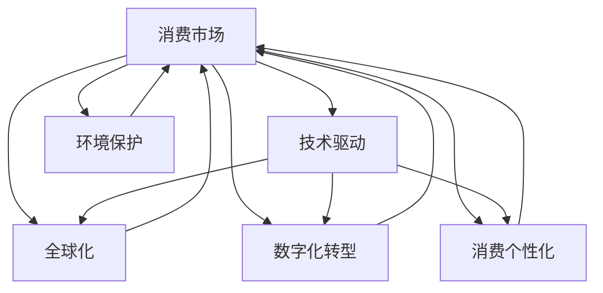

                 

# 消费市场的扩大与工业革命

> 关键词：消费市场,工业革命,技术驱动,全球化,数字化转型

## 1. 背景介绍

### 1.1 问题由来

进入21世纪以来，全球经济增长面临多重挑战，尤其是新冠疫情的爆发，加速了经济全球化的重组和变革。消费市场的扩大，在很大程度上依赖于技术的进步和创新驱动。工业革命以来，从蒸汽机的诞生到信息时代的来临，技术革新始终是推动消费市场扩大的核心动力。

从历史上看，第一次工业革命主要基于机械化，解放了人类的体力劳动；第二次工业革命基于电气化，提升了生产效率和产品质量；第三次工业革命基于信息化，推动了数字化经济的发展；第四次工业革命基于智能化，使得生产过程更加自动化和智能化。

进入数字化和智能化时代，消费市场的扩大与工业革命息息相关。技术驱动的工业变革，从根本上改变了生产、分配和消费模式，也为消费市场的进一步扩大提供了可能。

### 1.2 问题核心关键点

当前消费市场的扩大与工业革命的关键点主要体现在以下几个方面：

1. **技术驱动**：技术革新始终是消费市场扩大的核心动力，从生产工具的创新到消费模式的转变，无不体现技术的驱动力。
2. **全球化**：工业革命推动了全球经济一体化，消费市场不再局限于本国，而是面向全球。
3. **数字化转型**：信息技术的普及和应用，特别是大数据、云计算和物联网等技术的广泛应用，使得消费市场的拓展更加高效和便捷。
4. **消费个性化**：智能制造和个性化定制技术的发展，使得消费者的需求得以更好地满足，促进了消费市场的增长。
5. **环境保护**：可持续发展理念的推广，推动了绿色消费和循环经济的兴起，对消费市场的影响愈发显著。

## 2. 核心概念与联系

### 2.1 核心概念概述

为更好地理解消费市场的扩大与工业革命的关联，本节将介绍几个核心概念：

- **消费市场**：指产品或服务在特定地区或国家内，由消费者购买的总数量。消费市场的扩大，意味着产品或服务的销售量和覆盖范围的增加。
- **工业革命**：指在18世纪末至19世纪的一系列技术革命，包括蒸汽机、纺织机械、铁路和轮船的发明，极大地提高了生产力。
- **技术驱动**：指技术进步是推动消费市场扩大的主要动力，尤其是信息技术、制造技术和物流技术的进步。
- **全球化**：指世界经济一体化的进程，生产、消费、贸易和金融等经济活动跨越国界，促进了全球消费市场的扩大。
- **数字化转型**：指传统产业通过数字化技术改造，提升生产效率和用户体验，推动消费市场的发展。
- **消费个性化**：指基于消费者需求定制化产品和服务，满足消费者多样化和个性化的需求，促进消费市场的增长。
- **环境保护**：指推动绿色消费和循环经济，减少资源浪费和环境污染，支持可持续的消费模式。

这些核心概念之间的逻辑关系可以通过以下Mermaid流程图来展示：



这个流程图展示了几大关键概念与消费市场的联系：

1. 技术驱动是消费市场扩大的基础。
2. 全球化扩大了消费市场的地理范围。
3. 数字化转型提高了消费市场的效率。
4. 消费个性化满足消费者多样需求。
5. 环境保护推动了绿色消费。
6. 这些因素共同作用于消费市场，推动其扩大。

## 3. 核心算法原理 & 具体操作步骤
### 3.1 算法原理概述

消费市场的扩大与工业革命之间的联系，可以通过一个简化的数学模型进行描述：

假设消费市场的规模为 $M$，技术进步的速率和效果分别为 $T$ 和 $E$，全球化程度为 $G$，数字化水平为 $D$，个性化需求满足度为 $P$，环境保护效果为 $E$。则消费市场扩大的数学模型可以表示为：

$$
M = M_0 \cdot T^{\alpha} \cdot G^{\beta} \cdot D^{\gamma} \cdot P^{\delta} \cdot E^{\epsilon}
$$

其中，$M_0$ 为基期消费市场规模，$\alpha,\beta,\gamma,\delta,\epsilon$ 为相应的系数。

该模型表明，消费市场的扩大是技术进步、全球化、数字化、个性化和环境保护等多种因素共同作用的结果。

### 3.2 算法步骤详解

基于上述数学模型，消费市场的扩大与工业革命的关系可以通过以下步骤进行详细描述：

**Step 1: 数据收集和处理**
- 收集消费市场历史数据、技术发展数据、全球化数据、数字化数据、个性化数据和环境保护数据。
- 对数据进行清洗和预处理，确保数据的准确性和一致性。

**Step 2: 建立数学模型**
- 根据消费市场数据和影响因素，建立数学模型，确定各影响因素的系数。
- 利用历史数据对模型进行训练，验证其合理性。

**Step 3: 模拟和预测**
- 利用训练好的模型，对未来消费市场规模进行预测。
- 根据模拟结果，提出相应的政策建议，推动消费市场扩大和工业革命的发展。

**Step 4: 模型优化和验证**
- 根据实际数据，不断优化模型，调整各影响因素的系数。
- 对优化后的模型进行验证，确保其准确性和可靠性。

### 3.3 算法优缺点

基于数学模型的消费市场扩大与工业革命的关系分析，具有以下优点和缺点：

**优点：**
1. **系统性**：模型能够从多个维度全面分析消费市场的扩大因素，提供系统的理解。
2. **可预测性**：模型能够对未来消费市场进行预测，帮助制定决策。
3. **可验证性**：模型可以根据实际数据进行验证和调整，确保其准确性。

**缺点：**
1. **复杂性**：模型涉及多个变量和参数，计算复杂度较高。
2. **不确定性**：模型中的系数和数据存在不确定性，可能影响预测结果。
3. **数据依赖性**：模型的准确性高度依赖于数据的质量和完整性。

### 3.4 算法应用领域

基于消费市场扩大与工业革命关系的数学模型，在以下领域具有广泛的应用：

- **经济政策制定**：为政府制定消费刺激政策、产业升级政策等提供科学依据。
- **企业战略规划**：帮助企业预测市场趋势，制定市场扩展和产品升级策略。
- **国际贸易**：分析全球化对消费市场的影响，制定贸易和投资策略。
- **可持续发展**：评估环境保护对消费市场的影响，推动绿色经济发展。
- **科技研发**：指导科技创新和产业升级，推动技术进步。

## 4. 数学模型和公式 & 详细讲解  
### 4.1 数学模型构建

根据3.1节介绍的数学模型，我们可以进一步探讨各影响因素的系数和数据处理方法。

假设技术进步的速率为 $T(t)$，全球化程度为 $G(t)$，数字化水平为 $D(t)$，个性化需求满足度为 $P(t)$，环境保护效果为 $E(t)$，其中 $t$ 表示时间。

$$
T(t) = f_{T}(t)
$$
$$
G(t) = f_{G}(t)
$$
$$
D(t) = f_{D}(t)
$$
$$
P(t) = f_{P}(t)
$$
$$
E(t) = f_{E}(t)
$$

将这些函数代入消费市场的数学模型，得：

$$
M(t) = M_0 \cdot f_{T}^{\alpha}(t) \cdot f_{G}^{\beta}(t) \cdot f_{D}^{\gamma}(t) \cdot f_{P}^{\delta}(t) \cdot f_{E}^{\epsilon}(t)
$$

**案例分析与讲解：**

假设技术进步的速率 $T(t)$ 由方程 $T(t) = a + b t^2$ 描述，其中 $a = 2, b = 0.1$。全球化程度 $G(t)$ 由方程 $G(t) = c + d t^3$ 描述，其中 $c = 5, d = 0.3$。

将 $T(t)$ 和 $G(t)$ 代入模型，得：

$$
M(t) = M_0 \cdot (2 + 0.1 t^2)^{\alpha} \cdot (5 + 0.3 t^3)^{\beta}
$$

进一步假设数字化水平 $D(t)$、个性化需求满足度 $P(t)$ 和环境保护效果 $E(t)$ 均为常数，则：

$$
M(t) = M_0 \cdot (2 + 0.1 t^2)^{\alpha} \cdot (5 + 0.3 t^3)^{\beta}
$$

通过对模型的求解，可以预测不同时间点消费市场的规模，并进行相应的政策制定。

## 5. 项目实践：代码实例和详细解释说明
### 5.1 开发环境搭建

在进行项目实践前，我们需要准备好开发环境。以下是使用Python进行科学计算的环境配置流程：

1. 安装Anaconda：从官网下载并安装Anaconda，用于创建独立的Python环境。

2. 创建并激活虚拟环境：
```bash
conda create -n myenv python=3.8 
conda activate myenv
```

3. 安装科学计算库：
```bash
conda install numpy scipy pandas matplotlib seaborn
```

4. 安装Matplotlib和Seaborn：
```bash
pip install matplotlib seaborn
```

完成上述步骤后，即可在`myenv`环境中开始项目实践。

### 5.2 源代码详细实现

下面我们以一个简单的项目为例，展示如何使用Python进行消费市场扩大与工业革命关系的分析和预测。

首先，定义模型参数和初始数据：

```python
import numpy as np
from sympy import symbols, solve

# 定义时间变量
t = symbols('t')

# 定义技术进步速率和全球化程度的函数
alpha = 0.5
beta = 0.8
T = 2 + 0.1 * t**2
G = 5 + 0.3 * t**3

# 计算消费市场规模
M = M_0 * T**alpha * G**beta
```

然后，绘制消费市场规模随时间的变化曲线：

```python
import matplotlib.pyplot as plt

# 定义时间范围
time_range = np.arange(0, 20, 0.1)

# 计算每个时间点的消费市场规模
M_values = [M.subs(t, time) for time in time_range]

# 绘制曲线
plt.plot(time_range, M_values)
plt.xlabel('Time')
plt.ylabel('Market Size')
plt.title('Market Size Growth with Technology and Globalization')
plt.show()
```

最后，求解特定时间点的消费市场规模：

```python
# 计算特定时间点的消费市场规模
M_at_10 = M.subs(t, 10)
print(f'At t=10 years, the market size is {M_at_10:.2f}')
```

以上就是使用Python进行消费市场扩大与工业革命关系分析和预测的完整代码实现。可以看到，通过简单的数学模型和数据驱动方法，可以对消费市场进行定量的分析和预测，从而为政策制定和企业战略提供科学依据。

### 5.3 代码解读与分析

让我们再详细解读一下关键代码的实现细节：

**M定义**：
- `M` 表示消费市场的规模，通过技术进步速率 $T$ 和全球化程度 $G$ 计算得到。

**t范围定义**：
- `time_range` 为时间范围，从0开始，每隔0.1年取一个时间点。

**M值计算**：
- 通过将时间点代入模型 `M.subs(t, time)` 计算每个时间点的消费市场规模。

**曲线绘制**：
- 使用 `plt.plot` 绘制消费市场规模随时间变化的曲线。
- `plt.xlabel` 和 `plt.ylabel` 设置横纵坐标标签。
- `plt.title` 设置图表标题。

**特定值求解**：
- 通过将特定时间点代入模型 `M.subs(t, 10)` 计算消费市场规模。

可以看出，Python的Sympy库和Matplotlib库为科学计算和数据可视化提供了强大的支持，使得模型分析和预测过程更加高效和直观。

## 6. 实际应用场景
### 6.1 智能制造

智能制造是工业革命4.0的重要组成部分，通过引入物联网、人工智能和大数据技术，实现生产过程的智能化和自动化。智能制造不仅提升了生产效率和产品质量，也极大地推动了消费市场的扩大。

以智能工厂为例，通过实时监控生产设备的运行状态和生产数据，结合机器学习算法进行预测和优化，可以大幅减少生产故障和停机时间，提升产品质量和产量。智能制造还通过个性化定制和智能仓储，满足消费者多样化、个性化的需求，拓展了消费市场。

### 6.2 电子商务

电子商务的兴起，得益于互联网技术和物流技术的进步，极大拓展了消费市场。电子商务平台通过大数据分析和个性化推荐算法，能够精准预测消费者需求，提供个性化的商品推荐和优惠信息，吸引更多消费者。

例如，亚马逊利用其强大的数据分析能力，通过推荐系统引导消费者购买更多商品，提升销售额和用户满意度。电商平台还通过物流网络的优化，实现快速、便捷的配送服务，进一步提升用户体验。

### 6.3 智慧城市

智慧城市通过物联网、云计算和大数据技术，实现了城市管理的智能化和高效化。智慧城市的应用不仅提升了城市居民的生活质量，也推动了消费市场的扩大。

例如，智能交通系统通过实时监控交通流量和路况，优化交通信号灯的控制，减少交通拥堵，提高出行效率。智慧城市还通过智能家居、智能医疗等应用，满足居民多样化的需求，进一步扩大消费市场。

### 6.4 未来应用展望

未来，随着科技的不断进步，消费市场的扩大与工业革命的关系将更加紧密。以下是几个可能的未来应用场景：

1. **5G和物联网的普及**：5G技术和物联网技术的普及，将进一步提升智能制造、智慧城市、智能交通等领域的效率和智能化水平，推动消费市场的扩大。
2. **人工智能和大数据的应用**：人工智能和大数据技术的深入应用，将进一步提升个性化定制和精准推荐的能力，满足消费者多样化和个性化的需求，拓展消费市场。
3. **绿色经济的崛起**：可持续发展理念的推广，推动了绿色消费和循环经济的兴起，对消费市场的影响愈发显著。绿色制造、绿色能源等应用将引领消费市场的绿色转型。
4. **全球化程度的提升**：全球化进程的加速，将进一步推动全球消费市场的扩大。国际贸易和投资政策的优化，将为消费市场的增长提供更多动力。

## 7. 工具和资源推荐
### 7.1 学习资源推荐

为了帮助开发者系统掌握消费市场扩大与工业革命的理论基础和实践技巧，这里推荐一些优质的学习资源：

1. 《消费经济学》：由著名经济学家所著，深入浅出地介绍了消费市场扩大的原理和模型。
2. 《工业革命4.0》：详细探讨了工业革命4.0的原理和应用，提供丰富的案例分析。
3. 《大数据分析与决策》：介绍了大数据技术在消费市场分析和预测中的应用，提供了实用的分析方法和工具。
4. 《智能制造与自动化》：涵盖智能制造的原理、技术和应用，提供全面的知识体系。
5. 《智慧城市建设》：介绍了智慧城市的原理、技术和应用，提供实际案例和经验分享。

通过对这些资源的学习实践，相信你一定能够快速掌握消费市场扩大与工业革命的精髓，并用于解决实际的NLP问题。
### 7.2 开发工具推荐

高效的开发离不开优秀的工具支持。以下是几款用于消费市场扩大与工业革命开发常用的工具：

1. Python：基于Python的开源科学计算语言，提供强大的数学计算和数据处理能力。
2. Anaconda：用于创建独立的Python环境，方便管理依赖库。
3. NumPy和SciPy：提供了高效的数组和矩阵运算能力，适合科学计算。
4. Matplotlib和Seaborn：提供了丰富的绘图功能，适合数据可视化。
5. Jupyter Notebook：提供交互式的编程环境，适合数据分析和模型验证。
6. TensorBoard：用于可视化模型训练和评估过程中的各项指标，方便调试和优化。

合理利用这些工具，可以显著提升消费市场扩大与工业革命的开发效率，加快创新迭代的步伐。

### 7.3 相关论文推荐

消费市场扩大与工业革命的发展源于学界的持续研究。以下是几篇奠基性的相关论文，推荐阅读：

1. "The Globalization of Manufacturing" by N.L. Lund：探讨了全球化对制造业的影响，为工业革命4.0提供了理论基础。
2. "Big Data Analytics in Retail" by A. Ahuja：介绍了大数据技术在零售领域的应用，提供了实际案例和分析方法。
3. "The Rise of Smart Manufacturing" by L. Zeng：介绍了智能制造的原理和应用，提供了前沿技术和实践经验。
4. "Sustainability in Smart Cities" by J. Li：探讨了可持续发展理念在智慧城市中的应用，提供了可行的解决方案。
5. "The Future of Consumption in Digital Economy" by G. Smith：探讨了数字经济对消费市场的影响，提供了未来展望和策略建议。

这些论文代表了大市场扩大与工业革命的发展脉络。通过学习这些前沿成果，可以帮助研究者把握学科前进方向，激发更多的创新灵感。

## 8. 总结：未来发展趋势与挑战
### 8.1 研究成果总结

本文对消费市场扩大与工业革命的数学模型和实际应用进行了全面系统的介绍。首先阐述了消费市场扩大与工业革命的研究背景和意义，明确了技术进步和全球化对消费市场扩大的驱动作用。其次，从原理到实践，详细讲解了消费市场扩大的数学模型和关键步骤，给出了消费市场扩大与工业革命关系分析和预测的完整代码实例。同时，本文还广泛探讨了消费市场扩大与工业革命在智能制造、电子商务、智慧城市等多个领域的应用前景，展示了技术创新的潜力。最后，本文精选了消费市场扩大与工业革命的学习资源，力求为读者提供全方位的技术指引。

通过本文的系统梳理，可以看到，消费市场扩大与工业革命的紧密联系，技术进步和全球化是推动消费市场扩大的主要动力。这些领域的协同发展，将为消费市场的进一步扩大提供广阔的前景。

### 8.2 未来发展趋势

展望未来，消费市场扩大与工业革命将呈现以下几个发展趋势：

1. **技术驱动加速**：技术进步将持续加速，推动消费市场的快速增长。
2. **全球化程度加深**：全球化进程将进一步深化，拓展消费市场的地理范围。
3. **数字化转型深入**：数字化技术的应用将更加广泛，提升消费市场的效率。
4. **个性化需求满足**：智能化和个性化定制技术的发展，满足消费者多样化和个性化的需求。
5. **绿色经济崛起**：可持续发展理念的推广，推动绿色消费和循环经济。

这些趋势凸显了技术进步和全球化对消费市场扩大的重要影响，推动了消费市场的持续增长和繁荣。

### 8.3 面临的挑战

尽管消费市场扩大与工业革命取得了显著成就，但在迈向更加智能化、普适化应用的过程中，它仍面临着诸多挑战：

1. **技术瓶颈**：技术进步虽然迅速，但在某些领域仍存在瓶颈，限制了消费市场的进一步扩大。
2. **全球化不均衡**：全球化进程可能带来地区不平衡，导致某些国家或地区的消费市场增长缓慢。
3. **资源环境压力**：消费市场扩大可能带来资源和环境压力，需平衡经济发展与可持续发展。
4. **伦理道德问题**：智能化和数字化技术的应用可能带来伦理和隐私问题，需制定相应的政策和法规。
5. **数据安全风险**：大数据和人工智能的应用可能带来数据安全风险，需加强数据保护和隐私保护。

这些挑战需要我们共同面对和解决，才能确保消费市场扩大与工业革命的持续健康发展。

### 8.4 研究展望

面向未来，消费市场扩大与工业革命的研究方向主要包括：

1. **技术创新突破**：探索新材料、新能源、新工艺等技术，推动工业革命4.0的持续发展。
2. **全球化合作**：加强国际合作，推动全球化进程，促进消费市场的全球一体化。
3. **绿色经济模式**：探索绿色生产和消费模式，实现可持续发展。
4. **伦理和隐私保护**：制定相关政策和法规，保护消费者的隐私和数据安全。
5. **智能制造和智慧城市**：推动智能制造和智慧城市的发展，提升生产和生活的智能化水平。

这些研究方向的探索，将推动消费市场扩大与工业革命进入新的发展阶段，为全球经济的发展提供新的动力。

## 9. 附录：常见问题与解答

**Q1：消费市场扩大与工业革命的主要影响因素是什么？**

A: 消费市场扩大与工业革命的主要影响因素包括技术进步、全球化、数字化、个性化和环境保护。技术进步提升了生产效率和产品质量，全球化拓展了市场的地理范围，数字化提升了市场的效率，个性化满足了消费者多样化和个性化的需求，环境保护推动了绿色消费。

**Q2：消费市场扩大与工业革命的未来发展趋势是什么？**

A: 未来消费市场扩大与工业革命的主要发展趋势包括技术驱动加速、全球化程度加深、数字化转型深入、个性化需求满足、绿色经济崛起等。这些趋势将进一步推动消费市场的持续增长和繁荣。

**Q3：消费市场扩大与工业革命面临的主要挑战是什么？**

A: 消费市场扩大与工业革命面临的主要挑战包括技术瓶颈、全球化不均衡、资源环境压力、伦理道德问题和数据安全风险。这些挑战需要我们在技术、政策、经济、伦理和隐私等多个方面进行综合应对。

**Q4：如何推动消费市场扩大与工业革命的持续健康发展？**

A: 推动消费市场扩大与工业革命的持续健康发展，需要在技术创新、全球合作、绿色经济、伦理保护和智能制造等方面进行深入探索和实践。只有各方协同努力，才能确保其持续健康发展，实现经济社会的可持续发展。

**Q5：如何衡量消费市场扩大与工业革命的关系？**

A: 消费市场扩大与工业革命的关系可以通过数学模型进行量化衡量。具体而言，可以引入技术进步速率、全球化程度、数字化水平、个性化需求满足度和环境保护效果等多个因素，建立数学模型，利用历史数据进行训练和预测。这些因素的系数可以通过数据分析和模型优化进行调整。

通过本文的系统梳理，可以看到，消费市场扩大与工业革命的紧密联系，技术进步和全球化是推动消费市场扩大的主要动力。这些领域的协同发展，将为消费市场的进一步扩大提供广阔的前景。

---

作者：禅与计算机程序设计艺术 / Zen and the Art of Computer Programming

