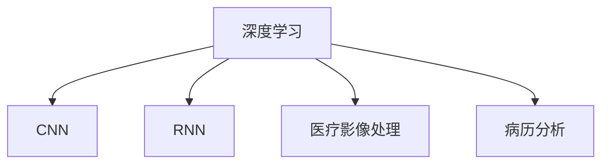

                 

# 深度学习在医疗诊断中的应用

## 1. 背景介绍

### 1.1 问题由来
深度学习技术在医疗诊断中的应用已经取得了显著的成果。随着医疗数据量的激增，传统手工标注的方式难以满足快速准确诊断的需求。深度学习技术可以自动化地从海量的医疗影像、病历等数据中提取有用的信息，辅助医生进行诊断。在深度学习的帮助下，一些如皮肤病、肺部疾病等疾病的诊断精度已经接近甚至超过了人类专家的水平。

### 1.2 问题核心关键点
深度学习在医疗诊断中的应用主要依赖于卷积神经网络（Convolutional Neural Network, CNN）和循环神经网络（Recurrent Neural Network, RNN）等模型。这些模型通过学习医疗数据的特征，实现疾病诊断、病情分析等功能。但在实际应用中，模型面临数据标注难、模型泛化能力不足、隐私保护等问题。

### 1.3 问题研究意义
深度学习在医疗诊断中的应用对于提高医疗服务的效率和质量，降低医疗成本，提升公众健康水平具有重要意义。通过对深度学习模型的研究和应用，可以极大地提升医疗影像、病历等数据的处理能力，使医疗诊断更加高效、精确。同时，深度学习模型的预测能力也能够帮助医生快速、准确地做出诊断决策，辅助医疗决策支持系统的发展。

## 2. 核心概念与联系

### 2.1 核心概念概述

为更好地理解深度学习在医疗诊断中的应用，本节将介绍几个密切相关的核心概念：

- 深度学习（Deep Learning）：基于多层神经网络的学习方法，通过逐层学习数据特征，逐步抽象出高级的表示。深度学习已经广泛应用于计算机视觉、自然语言处理、医疗诊断等多个领域。

- 卷积神经网络（CNN）：一种专门用于处理图像、视频等数据的多层神经网络，通过卷积操作提取空间局部特征。CNN在医学影像分析中广泛应用，能够自动提取图像中的病变部位、边缘信息等。

- 循环神经网络（RNN）：一种能够处理序列数据的网络结构，通过时间步序列的方式捕捉数据的时间依赖性。RNN在医疗时间序列数据如心率、血压等应用中表现优异。

- 医疗影像处理：深度学习在医疗影像处理中的应用，包括病变检测、分割、分类等，是深度学习在医疗诊断中最为成熟的应用之一。

- 病历分析：深度学习技术可以对患者的病历数据进行自动分析，帮助医生快速了解患者病情，辅助诊断决策。

这些核心概念之间的逻辑关系可以通过以下Mermaid流程图来展示：



这个流程图展示了大语言模型的核心概念及其之间的关系：

1. 深度学习通过多层神经网络逐层学习数据特征。
2. CNN用于处理图像、视频等数据，提取空间局部特征。
3. RNN用于处理序列数据，捕捉数据的时间依赖性。
4. 医疗影像处理通过CNN对医疗影像进行病变检测、分割、分类等。
5. 病历分析通过RNN等模型对病历数据进行自动分析，辅助诊断。

这些概念共同构成了深度学习在医疗诊断中的应用框架，使其能够在各个环节发挥强大的数据分析能力。通过理解这些核心概念，我们可以更好地把握深度学习在医疗诊断中的应用方式和优化方向。

## 3. 核心算法原理 & 具体操作步骤
### 3.1 算法原理概述

深度学习在医疗诊断中的应用通常涉及卷积神经网络（CNN）和循环神经网络（RNN）等模型的设计和训练。以医疗影像处理为例，CNN通过卷积层、池化层、全连接层等组成的网络结构，自动提取医疗影像中的病变部位、边缘信息等特征，并通过分类器进行疾病分类。循环神经网络（RNN）通过对时间序列数据的学习，捕捉病历数据中的时间依赖性，实现病情预测和诊断分析等功能。

深度学习在医疗诊断中的应用一般包括以下几个关键步骤：

**Step 1: 数据预处理**
- 收集医疗数据，包括医疗影像、病历文本、时间序列数据等。
- 对数据进行清洗、归一化、标注等预处理，确保数据的质量和一致性。

**Step 2: 模型设计和训练**
- 根据应用需求选择合适的深度学习模型，如CNN、RNN、Transformer等。
- 设计数据输入输出格式，包括数据张量、标签、类别等信息。
- 选择合适的优化器、损失函数、正则化技术等，进行模型训练。

**Step 3: 模型评估和优化**
- 在验证集上评估模型性能，包括准确率、召回率、F1分数等指标。
- 根据评估结果调整模型结构、超参数，进行模型优化。
- 重复Step 2和Step 3，直到模型满足实际应用需求。

**Step 4: 模型部署和应用**
- 将训练好的模型保存为模型文件，便于后续调用。
- 将模型集成到医疗诊断系统中，进行实际应用。
- 持续收集新数据，定期重新训练和优化模型。

以上是深度学习在医疗诊断中的一般流程。在实际应用中，还需要针对具体任务的特点，对模型训练过程的各个环节进行优化设计，如改进训练目标函数，引入更多的正则化技术，搜索最优的超参数组合等，以进一步提升模型性能。

### 3.2 算法步骤详解

**Step 1: 数据预处理**

数据预处理是深度学习应用的关键环节。以医疗影像处理为例，以下是数据预处理的一般步骤：

1. 数据收集：从医院、诊所、在线平台等渠道收集医疗影像数据，包括CT、MRI、X光等影像。

2. 数据清洗：对数据进行去噪、去伪影、校正等处理，确保数据的清晰度和可靠性。

3. 数据标注：为每张影像标注病变部位、病变类型等信息，形成训练集和验证集。标注工作一般由医生完成，质量较高但成本较高。

4. 数据归一化：将数据进行归一化处理，将影像的像素值缩放到0到1之间，确保不同影像的像素值在同一范围内。

5. 数据增强：对数据进行旋转、缩放、翻转等变换，扩充训练集的多样性，防止过拟合。

**Step 2: 模型设计和训练**

以医疗影像分类为例，以下是模型设计和训练的一般步骤：

1. 模型选择：选择适当的深度学习模型，如CNN，定义模型架构，包括卷积层、池化层、全连接层等。

2. 数据输入输出格式定义：将输入数据（医疗影像）转换为模型所需的格式，包括数据张量、标签、类别等信息。

3. 损失函数选择：选择合适的损失函数，如交叉熵损失，衡量模型预测结果与真实标签的差异。

4. 优化器选择：选择合适的优化器，如AdamW、SGD等，设置学习率、批大小等超参数。

5. 正则化技术：引入L2正则、Dropout等正则化技术，防止过拟合。

6. 模型训练：使用训练集进行模型训练，每次迭代更新模型参数，最小化损失函数。

**Step 3: 模型评估和优化**

以医疗影像分类为例，以下是模型评估和优化的一般步骤：

1. 模型评估：在验证集上评估模型性能，计算准确率、召回率、F1分数等指标。

2. 模型优化：根据评估结果，调整模型结构、超参数，进行模型优化。

3. 重复训练：重复Step 2和Step 3，直到模型在验证集上达到满意的性能。

4. 模型测试：在测试集上测试模型性能，评估模型在新数据上的泛化能力。

**Step 4: 模型部署和应用**

以医疗影像分类为例，以下是模型部署和应用的一般步骤：

1. 模型保存：将训练好的模型保存为模型文件，便于后续调用。

2. 模型集成：将模型集成到医疗诊断系统中，如医疗影像诊断软件、电子病历系统等。

3. 实时应用：对新的医疗影像进行实时分类预测，辅助医生诊断。

4. 持续优化：持续收集新数据，定期重新训练和优化模型。

### 3.3 算法优缺点

深度学习在医疗诊断中的应用具有以下优点：

1. 自动化处理医疗数据：深度学习可以自动从海量的医疗数据中提取有用信息，提高数据处理效率，减少人工标注工作。

2. 提高诊断精度：深度学习技术已经在皮肤病、肺部疾病等领域的诊断精度上接近甚至超过了人类专家的水平。

3. 快速诊断：深度学习模型可以实时对医疗影像进行分类和分析，缩短诊断时间。

4. 辅助医生决策：深度学习模型可以作为医生的辅助工具，提供可靠的诊断参考，减轻医生的工作负担。

同时，深度学习在医疗诊断中的应用也存在以下局限性：

1. 数据标注难度大：深度学习模型需要大量标注数据，标注工作繁琐且成本高。

2. 模型泛化能力不足：深度学习模型可能对特定病种或特定影像的泛化能力不足，需要更多的数据和模型优化。

3. 隐私保护问题：医疗数据涉及个人隐私，深度学习模型的训练和使用需要严格的数据保护措施。

4. 计算资源需求高：深度学习模型通常需要较高的计算资源和存储空间，对硬件设备要求较高。

尽管存在这些局限性，但深度学习在医疗诊断中的应用前景广阔，其自动化、高效化和精确化的特点将极大地提升医疗服务的质量和效率。

### 3.4 算法应用领域

深度学习在医疗诊断中的应用涉及多个领域，包括但不限于：

- 医疗影像分析：包括病变检测、分割、分类等，如乳腺癌、肺癌、脑肿瘤等疾病的影像分类。

- 病历分析：对患者的病历数据进行自动分析，提取关键信息，辅助诊断。

- 病情预测：通过对患者的时间序列数据如心率、血压、血糖等进行学习，预测病情发展趋势。

- 基因组学研究：通过对基因序列数据的学习，辅助疾病诊断和治疗方案设计。

- 药物研发：通过深度学习模型对药物分子结构进行分析和预测，加速新药研发。

## 4. 数学模型和公式 & 详细讲解  
### 4.1 数学模型构建

以医疗影像分类为例，以下是深度学习模型的数学模型构建过程。

记医疗影像数据集为 $D=\{(x_i,y_i)\}_{i=1}^N$，其中 $x_i$ 表示医疗影像， $y_i$ 表示疾病标签。定义模型 $M_{\theta}:\mathbb{R}^{h\times w\times c} \rightarrow \{1,2,\cdots,K\}$，其中 $h$、$w$、$c$ 分别表示影像的高度、宽度和通道数， $K$ 表示疾病类别数。模型的参数为 $\theta$。

定义模型在数据样本 $(x,y)$ 上的损失函数为 $\ell(M_{\theta}(x),y)$，则在数据集 $D$ 上的经验风险为：

$$
\mathcal{L}(\theta) = \frac{1}{N} \sum_{i=1}^N \ell(M_{\theta}(x_i),y_i)
$$

常见的损失函数包括交叉熵损失函数，定义如下：

$$
\ell(M_{\theta}(x),y) = -\log M_{\theta}(x)^{y} - \log (1 - M_{\theta}(x))^{1-y}
$$

其中 $y$ 表示真实标签， $M_{\theta}(x)$ 表示模型在输入 $x$ 上的预测概率。

通过反向传播算法，可以得到模型参数 $\theta$ 的梯度，使用梯度下降等优化算法更新参数，最小化损失函数 $\mathcal{L}(\theta)$。

### 4.2 公式推导过程

以医疗影像分类为例，以下是深度学习模型的公式推导过程。

假设医疗影像的大小为 $h\times w\times c$，将医疗影像输入到卷积层进行特征提取，输出特征图大小为 $h'\times w'\times c'$。设卷积层参数为 $\omega$，则卷积操作的数学表达式为：

$$
\text{conv}(\omega, x) = \sum_{i=1}^c \sum_{j=1}^{h'} \sum_{k=1}^{w'} \omega_{i,j,k} \times x_{j',k'}
$$

其中 $x$ 表示输入的特征图， $\omega$ 表示卷积核参数， $j'$ 和 $k'$ 表示特征图的像素位置。

将卷积层的输出作为下一层的输入，通过池化层、全连接层等网络结构进行特征提取和分类，最终输出预测结果 $\hat{y}$。

$$
\hat{y} = M_{\theta}(x) = \sigma(\text{fc}(\text{pool}(\text{conv}(\omega, x))))
$$

其中 $\sigma$ 表示激活函数， $\text{fc}$ 表示全连接层， $\text{pool}$ 表示池化操作。

### 4.3 案例分析与讲解

以医疗影像分类为例，以下是深度学习模型在医疗影像分类任务中的应用案例。

假设一个医疗影像分类任务，训练集包含10000张影像，验证集和测试集各包含2000张影像。将影像的大小调整为 $224\times224$，每张影像有3个通道，即红、绿、蓝三通道。

首先，对训练集进行数据预处理，包括数据清洗、归一化、数据增强等。然后，定义卷积神经网络模型，包括卷积层、池化层、全连接层等。

设置模型参数 $\theta$ 的初始值为随机初始化。使用训练集对模型进行训练，每次迭代更新模型参数，最小化交叉熵损失函数。在验证集上评估模型性能，根据评估结果调整模型超参数，如卷积核大小、池化窗口大小、学习率等。

最后，在测试集上测试模型性能，计算准确率、召回率、F1分数等指标，评估模型在新数据上的泛化能力。

## 5. 项目实践：代码实例和详细解释说明
### 5.1 开发环境搭建

在进行医疗影像分类任务的项目实践前，需要准备好开发环境。以下是使用Python进行TensorFlow开发的环境配置流程：

1. 安装Anaconda：从官网下载并安装Anaconda，用于创建独立的Python环境。

2. 创建并激活虚拟环境：
```bash
conda create -n tf-env python=3.8 
conda activate tf-env
```

3. 安装TensorFlow：根据CUDA版本，从官网获取对应的安装命令。例如：
```bash
conda install tensorflow=2.6
```

4. 安装TensorBoard：
```bash
conda install tensorboard
```

5. 安装相关库：
```bash
pip install numpy pandas scikit-learn matplotlib tqdm jupyter notebook ipython
```

完成上述步骤后，即可在`tf-env`环境中开始项目实践。

### 5.2 源代码详细实现

以下是使用TensorFlow进行医疗影像分类的代码实现。

首先，定义数据预处理函数：

```python
import tensorflow as tf
from tensorflow.keras.preprocessing.image import ImageDataGenerator

def preprocess_image(x):
    x = tf.image.convert_image_dtype(x, tf.float32)
    x /= 255.0
    return x

train_datagen = ImageDataGenerator(preprocessing_function=preprocess_image)
test_datagen = ImageDataGenerator(preprocessing_function=preprocess_image)

train_generator = train_datagen.flow_from_directory(
    'train',
    target_size=(224, 224),
    batch_size=32,
    class_mode='categorical')

test_generator = test_datagen.flow_from_directory(
    'test',
    target_size=(224, 224),
    batch_size=32,
    class_mode='categorical')
```

然后，定义模型：

```python
from tensorflow.keras import layers, models

model = models.Sequential([
    layers.Conv2D(32, (3, 3), activation='relu', input_shape=(224, 224, 3)),
    layers.MaxPooling2D((2, 2)),
    layers.Conv2D(64, (3, 3), activation='relu'),
    layers.MaxPooling2D((2, 2)),
    layers.Conv2D(128, (3, 3), activation='relu'),
    layers.MaxPooling2D((2, 2)),
    layers.Flatten(),
    layers.Dense(128, activation='relu'),
    layers.Dense(5, activation='softmax')
])
```

接着，定义损失函数和优化器：

```python
from tensorflow.keras import losses

loss_fn = losses.CategoricalCrossentropy()
optimizer = tf.keras.optimizers.Adam(learning_rate=0.001)
```

最后，执行训练和评估：

```python
epochs = 10
steps_per_epoch = 10

for epoch in range(epochs):
    for step, (x, y) in enumerate(train_generator):
        with tf.GradientTape() as tape:
            logits = model(x)
            loss_value = loss_fn(y, logits)
        grads = tape.gradient(loss_value, model.trainable_variables)
        optimizer.apply_gradients(zip(grads, model.trainable_variables))
        if (step + 1) % 10 == 0:
            test_loss, test_acc = test_model(test_generator)
            print(f'Epoch {epoch+1}, step {step+1}/{steps_per_epoch}, loss: {loss_value:.4f}, test acc: {test_acc:.4f}')

print(f'Epoch {epochs}, test acc: {test_acc:.4f}')
```

以上代码实现了基于TensorFlow的医疗影像分类任务。可以看到，TensorFlow的API设计使得模型设计和训练过程变得简洁高效。开发者可以将更多精力放在数据处理、模型改进等高层逻辑上，而不必过多关注底层的实现细节。

### 5.3 代码解读与分析

让我们再详细解读一下关键代码的实现细节：

**preprocess_image函数**：
- 定义了一个数据预处理函数，将输入的影像转换为浮点数张量，并进行归一化处理。

**train_datagen和test_datagen**：
- 使用ImageDataGenerator对数据进行增强和归一化，保证数据的一致性和多样性。

**model定义**：
- 定义了一个卷积神经网络模型，包括卷积层、池化层、全连接层等。

**loss_fn和optimizer**：
- 选择了交叉熵损失函数和Adam优化器，用于衡量模型预测结果与真实标签的差异，并优化模型参数。

**训练和评估循环**：
- 在每个epoch内，使用train_generator生成训练数据，通过反向传播更新模型参数，最小化损失函数。
- 在每个batch结束后，评估模型在test_generator上的性能，并输出结果。

可以看到，TensorFlow的Keras API使得模型设计和训练过程变得简洁高效。开发者可以通过少量的代码实现复杂的模型构建和训练流程，提升开发效率。

当然，工业级的系统实现还需考虑更多因素，如模型的保存和部署、超参数的自动搜索、更灵活的任务适配层等。但核心的模型构建和训练逻辑基本与此类似。

## 6. 实际应用场景
### 6.1 智能医疗影像诊断

智能医疗影像诊断是深度学习在医疗诊断中最为成熟的应用之一。通过深度学习模型对医疗影像进行病变检测、分割、分类等，能够辅助医生进行高效、准确的诊断。

在技术实现上，可以收集大量的医疗影像数据，通过标注生成训练集、验证集和测试集。在训练集上对预训练的深度学习模型进行微调，使其能够适应具体的医疗影像诊断任务。微调后的模型可以对新的医疗影像进行实时分类和分析，辅助医生诊断。

### 6.2 病历数据分析

病历数据分析是深度学习在医疗诊断中的另一个重要应用。通过对患者的时间序列数据如心率、血压、血糖等进行学习，可以预测病情发展趋势，辅助医生进行诊断和治疗。

在技术实现上，可以收集患者的历史病历数据，通过标注生成训练集、验证集和测试集。在训练集上对预训练的深度学习模型进行微调，使其能够适应具体的病历数据分析任务。微调后的模型可以对新的病历数据进行实时分析，辅助医生进行诊断和治疗决策。

### 6.3 基因组学研究

基因组学研究是深度学习在医疗诊断中的一种新兴应用。通过对基因序列数据的学习，可以辅助疾病诊断和治疗方案设计。

在技术实现上，可以收集患者的基因序列数据，通过标注生成训练集、验证集和测试集。在训练集上对预训练的深度学习模型进行微调，使其能够适应具体的基因组学研究任务。微调后的模型可以对新的基因序列数据进行实时分析，辅助医生进行诊断和治疗决策。

### 6.4 未来应用展望

随着深度学习技术的发展，未来深度学习在医疗诊断中的应用前景广阔，以下是一些未来应用的展望：

1. 医疗影像增强：通过对医疗影像进行增强和恢复，提高影像质量，辅助医生进行诊断。

2. 疾病预测：通过对时间序列数据的学习，预测疾病发展趋势，辅助医生进行诊断和治疗决策。

3. 基因组学研究：通过对基因序列数据的学习，辅助疾病诊断和治疗方案设计。

4. 智能诊断系统：将深度学习模型与AI技术结合，构建智能诊断系统，提高诊断效率和准确性。

5. 药物研发：通过深度学习模型对药物分子结构进行分析和预测，加速新药研发。

6. 医疗知识图谱：将医疗知识与深度学习模型结合，构建医疗知识图谱，辅助医生进行诊断和治疗决策。

以上展望展示了深度学习在医疗诊断中的广泛应用前景。随着深度学习技术的不断进步，相信其将在更多领域发挥重要作用，提升医疗服务的质量和效率。

## 7. 工具和资源推荐
### 7.1 学习资源推荐

为了帮助开发者系统掌握深度学习在医疗诊断中的应用理论基础和实践技巧，这里推荐一些优质的学习资源：

1. 《深度学习》书籍：Ian Goodfellow等著，全面介绍了深度学习的理论基础和实践技巧，是学习深度学习的经典教材。

2. 《TensorFlow实战》书籍：Manning等著，介绍了TensorFlow的基本用法和实践技巧，适合入门级开发者学习。

3. CS231n《卷积神经网络》课程：斯坦福大学开设的计算机视觉课程，内容全面，覆盖深度学习在图像处理中的应用。

4. DeepMind博客：DeepMind的官方博客，介绍了深度学习在医疗影像、病历分析等领域的最新研究和应用。

5. ArXiv预印本库：收集了大量深度学习在医疗诊断领域的论文，涵盖了最新的研究进展和技术突破。

通过对这些资源的学习实践，相信你一定能够快速掌握深度学习在医疗诊断中的应用精髓，并用于解决实际的医疗问题。
###  7.2 开发工具推荐

高效的开发离不开优秀的工具支持。以下是几款用于深度学习在医疗诊断中应用的常用工具：

1. TensorFlow：由Google主导开发的深度学习框架，生产部署方便，适合大规模工程应用。

2. Keras：基于TensorFlow的高层API，使得模型设计和训练过程变得简洁高效，适合初学者和快速原型开发。

3. PyTorch：由Facebook主导开发的深度学习框架，动态计算图，适合研究性工作。

4. Scikit-learn：基于Python的机器学习库，提供了丰富的算法和工具，适用于各种机器学习任务。

5. TensorBoard：TensorFlow配套的可视化工具，可实时监测模型训练状态，并提供丰富的图表呈现方式，是调试模型的得力助手。

6. Weights & Biases：模型训练的实验跟踪工具，可以记录和可视化模型训练过程中的各项指标，方便对比和调优。

合理利用这些工具，可以显著提升深度学习在医疗诊断中的应用开发效率，加快创新迭代的步伐。

### 7.3 相关论文推荐

深度学习在医疗诊断中的应用源于学界的持续研究。以下是几篇奠基性的相关论文，推荐阅读：

1. AlexNet：ImageNet大规模视觉识别挑战赛的获奖作品，提出了卷积神经网络在图像分类中的重要应用。

2. Inception：提出了Inception模块，提高了卷积神经网络的深度和宽度，提升了图像分类的准确率。

3. RNN应用于医疗时间序列数据：提出了RNN在时间序列数据分析中的应用，提高了病情预测的准确率。

4. 深度学习在医疗影像分析中的应用：介绍了深度学习在医疗影像分析中的具体应用，如病变检测、分割、分类等。

5. 深度学习在基因组学研究中的应用：介绍了深度学习在基因组学研究中的应用，如基因序列分类、基因表达分析等。

这些论文代表了大语言模型微调技术的发展脉络。通过学习这些前沿成果，可以帮助研究者把握学科前进方向，激发更多的创新灵感。

## 8. 总结：未来发展趋势与挑战

### 8.1 总结

本文对深度学习在医疗诊断中的应用进行了全面系统的介绍。首先阐述了深度学习在医疗诊断中的应用背景和意义，明确了深度学习在医疗影像分析、病历分析、基因组学研究等领域的重要价值。其次，从原理到实践，详细讲解了深度学习在医疗诊断中的数学模型和算法步骤，给出了项目实践的完整代码实例。同时，本文还广泛探讨了深度学习在医疗诊断中的实际应用场景，展示了深度学习技术的广泛应用前景。

通过本文的系统梳理，可以看到，深度学习在医疗诊断中的应用前景广阔，其自动化、高效化和精确化的特点将极大地提升医疗服务的质量和效率。未来，深度学习技术将在更多领域发挥重要作用，提升人类生活质量和健康水平。

### 8.2 未来发展趋势

展望未来，深度学习在医疗诊断中的应用将呈现以下几个发展趋势：

1. 模型规模持续增大：随着算力成本的下降和数据规模的扩张，深度学习模型的参数量还将持续增长。超大规模深度学习模型蕴含的丰富特征表示，有望支撑更加复杂多变的医疗诊断任务。

2. 模型泛化能力提升：未来深度学习模型将更加注重模型的泛化能力，通过迁移学习、对抗训练等技术，提升模型在新数据上的泛化性能。

3. 计算资源需求降低：通过模型压缩、模型剪枝等技术，降低深度学习模型的计算资源需求，提升模型的实时性。

4. 数据保护机制完善：深度学习模型的训练和使用需要严格的数据保护措施，未来的应用中需要完善数据隐私保护机制，保障数据安全和隐私。

5. 多模态数据融合：未来的医疗诊断系统将结合多种数据模态，如影像、病历、基因数据等，构建多模态诊断系统，提升诊断精度。

6. 知识图谱辅助诊断：将医疗知识与深度学习模型结合，构建医疗知识图谱，辅助医生进行诊断和治疗决策。

以上趋势凸显了深度学习在医疗诊断中的广泛应用前景。这些方向的探索发展，必将进一步提升深度学习模型的诊断能力和应用范围，为构建安全、可靠、可解释、可控的智能系统铺平道路。

### 8.3 面临的挑战

尽管深度学习在医疗诊断中的应用前景广阔，但在迈向更加智能化、普适化应用的过程中，它仍面临诸多挑战：

1. 数据标注成本高：深度学习模型需要大量标注数据，标注工作繁琐且成本高。

2. 模型泛化能力不足：深度学习模型可能对特定病种或特定影像的泛化能力不足，需要更多的数据和模型优化。

3. 计算资源需求高：深度学习模型通常需要较高的计算资源和存储空间，对硬件设备要求较高。

4. 隐私保护问题：医疗数据涉及个人隐私，深度学习模型的训练和使用需要严格的数据保护措施。

5. 模型可解释性不足：深度学习模型往往被视为"黑盒"系统，难以解释其内部工作机制和决策逻辑。

6. 模型安全性问题：深度学习模型可能学习到有偏见、有害的信息，通过训练传递到下游任务，产生误导性、歧视性的输出。

正视深度学习在医疗诊断中面临的这些挑战，积极应对并寻求突破，将使深度学习技术更加成熟，更广泛地应用于医疗领域。

### 8.4 研究展望

面对深度学习在医疗诊断中面临的挑战，未来的研究需要在以下几个方面寻求新的突破：

1. 探索无监督和半监督学习范式：摆脱对大规模标注数据的依赖，利用自监督学习、主动学习等无监督和半监督范式，最大限度利用非结构化数据，实现更加灵活高效的医疗诊断。

2. 研究参数高效和计算高效的微调范式：开发更加参数高效的微调方法，在固定大部分预训练参数的同时，只更新极少量的任务相关参数。同时优化深度学习模型的计算图，减少前向传播和反向传播的资源消耗，实现更加轻量级、实时性的部署。

3. 引入因果推断和对比学习：通过引入因果推断和对比学习思想，增强深度学习模型建立稳定因果关系的能力，学习更加普适、鲁棒的语言表征，从而提升模型泛化性和抗干扰能力。

4. 融合多种数据模态：将符号化的先验知识，如知识图谱、逻辑规则等，与深度学习模型进行巧妙融合，引导深度学习模型学习更准确、合理的语言模型。同时加强不同模态数据的整合，实现视觉、语音等多模态信息与文本信息的协同建模。

5. 结合因果分析和博弈论工具：将因果分析方法引入深度学习模型，识别出模型决策的关键特征，增强输出解释的因果性和逻辑性。借助博弈论工具刻画人机交互过程，主动探索并规避模型的脆弱点，提高系统稳定性。

6. 纳入伦理道德约束：在模型训练目标中引入伦理导向的评估指标，过滤和惩罚有偏见、有害的输出倾向。同时加强人工干预和审核，建立模型行为的监管机制，确保输出符合人类价值观和伦理道德。

这些研究方向的探索，必将引领深度学习在医疗诊断中应用走向更高的台阶，为构建安全、可靠、可解释、可控的智能系统铺平道路。面向未来，深度学习在医疗诊断中的研究还需要与其他人工智能技术进行更深入的融合，如知识表示、因果推理、强化学习等，多路径协同发力，共同推动深度学习在医疗领域的进步。只有勇于创新、敢于突破，才能不断拓展深度学习模型的边界，让智能技术更好地造福人类社会。

## 9. 附录：常见问题与解答

**Q1：深度学习在医疗诊断中的应用是否适用于所有医疗任务？**

A: 深度学习在医疗诊断中的应用主要适用于图像、时间序列数据等可结构化数据的处理。对于文本数据如病历记录等，深度学习也能处理。但对于一些需要知识图谱、逻辑推理等复杂数据的处理，深度学习的应用效果有限。

**Q2：深度学习模型在医疗诊断中的应用是否存在数据隐私问题？**

A: 深度学习模型的训练和使用需要严格的数据保护措施，以保障数据隐私。通过联邦学习、差分隐私等技术，可以在保证数据隐私的前提下，实现深度学习模型的训练和应用。

**Q3：深度学习在医疗诊断中的应用是否需要大规模数据标注？**

A: 深度学习在医疗诊断中的应用确实需要大量标注数据，标注工作繁琐且成本高。但可以通过迁移学习、主动学习等技术，减少对标注数据的依赖，提高模型的泛化能力。

**Q4：深度学习模型在医疗诊断中的应用是否存在计算资源需求高的问题？**

A: 深度学习模型通常需要较高的计算资源和存储空间，对硬件设备要求较高。但通过模型压缩、模型剪枝等技术，可以降低深度学习模型的计算资源需求，提升模型的实时性。

**Q5：深度学习在医疗诊断中的应用是否存在模型可解释性不足的问题？**

A: 深度学习模型往往被视为"黑盒"系统，难以解释其内部工作机制和决策逻辑。但通过引入可解释性技术如Shapley值、LIME等，可以部分解释深度学习模型的决策过程。

**Q6：深度学习在医疗诊断中的应用是否存在模型安全性问题？**

A: 深度学习模型可能学习到有偏见、有害的信息，通过训练传递到下游任务，产生误导性、歧视性的输出。因此，需要在模型训练目标中引入伦理导向的评估指标，过滤和惩罚有偏见、有害的输出倾向，确保模型输出符合人类价值观和伦理道德。

通过本文的系统梳理，可以看到，深度学习在医疗诊断中的应用前景广阔，其自动化、高效化和精确化的特点将极大地提升医疗服务的质量和效率。未来，深度学习技术将在更多领域发挥重要作用，提升人类生活质量和健康水平。

