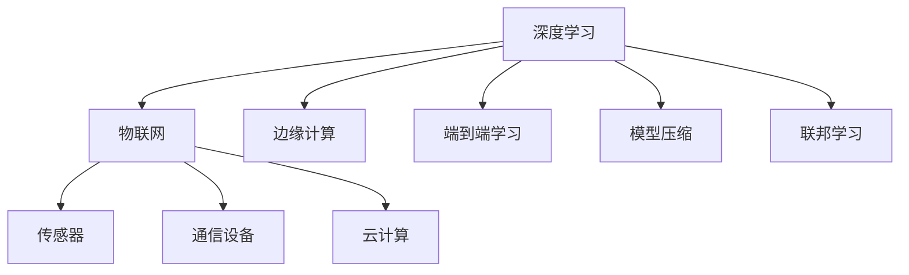

                 

# 深度学习在物联网中的应用

## 1. 背景介绍

随着物联网(IoT)技术的迅猛发展，万物互联时代的到来指日可待。据国际物联网联盟(IIoT)统计，到2025年，全球物联网设备数量将达到1万亿级别。物联网设备多样性和数据规模的激增，为深度学习技术的广泛应用提供了广阔的天地。物联网设备广泛部署在智能家居、工业生产、智慧城市、健康医疗等各个领域，为人类社会带来前所未有的便利与可能。

在这一背景下，深度学习技术在物联网中的应用越来越受到关注。深度学习模型通过大数据训练，具备强大的特征提取和模式识别能力，能够从海量异构数据中提取有价值的信息，为物联网系统提供强有力的支持。文章将系统地介绍深度学习在物联网中的核心应用，并探讨其未来发展方向和面临的挑战。

## 2. 核心概念与联系

### 2.1 核心概念概述

为更好地理解深度学习在物联网中的应用，本节将介绍几个关键概念：

- **深度学习**：基于神经网络的机器学习技术，通过多层非线性变换对数据进行建模，广泛应用于图像识别、语音识别、自然语言处理等领域。

- **物联网**：通过各种物理设备(如传感器、RFID标签、通信设备等)将物体连接在一起，实现数据收集、传输和处理的网络系统。

- **边缘计算**：在物联网设备的本地存储和计算上进行的计算，避免数据上传至云端，降低延迟和成本，提升系统响应速度。

- **端到端学习**：物联网设备之间可以互相学习，从边缘计算环境中提取共性信息，提升整个系统的智能水平。

- **模型压缩**：在保证模型性能的同时，压缩模型参数和计算资源，提升物联网设备的计算效率。

- **联邦学习**：多个物联网设备在本地训练模型，通过联邦聚合算法将模型参数更新传输至云端，实现模型更新和知识共享。

这些核心概念之间的逻辑关系可以通过以下Mermaid流程图来展示：



这个流程图展示了大语言模型的核心概念及其之间的关系：

1. 深度学习通过大数据训练，构建复杂的多层神经网络，具备强大的特征提取和模式识别能力。
2. 物联网设备通过传感器、RFID标签等采集数据，实现设备的互联互通。
3. 边缘计算在本地存储和计算上进行，降低延迟和成本。
4. 端到端学习使得物联网设备之间可以互相学习，提升系统智能。
5. 模型压缩在不损失模型性能的前提下，减小模型参数和计算资源，提升计算效率。
6. 联邦学习通过分散式训练，在多个设备上提升模型性能，实现知识共享。

## 3. 核心算法原理 & 具体操作步骤
### 3.1 算法原理概述

深度学习在物联网中的应用，核心在于其强大的特征提取和模式识别能力。物联网设备通过传感器采集的数据具有多样性、异构性，深度学习模型能够对这些数据进行有效的建模和分析，从中提取有价值的信息，为物联网应用提供支持。

具体而言，深度学习模型在物联网中的应用可以分为以下几个步骤：

1. 数据预处理：对采集的传感器数据进行清洗、归一化、采样等预处理，转化为模型可用的输入数据。
2. 特征提取：通过深度学习模型从原始数据中提取有意义的特征表示，用于后续的分类、预测等任务。
3. 模型训练：在标注数据上训练深度学习模型，使其能够自动学习数据的分布和规律。
4. 模型推理：在新的数据上使用训练好的模型进行推理，得到预测结果。

### 3.2 算法步骤详解

深度学习在物联网中的核心算法流程可以分为以下几个步骤：

**Step 1: 数据采集与预处理**
- 利用传感器、RFID标签等设备采集设备状态、环境参数、用户行为等数据。
- 对采集的数据进行清洗、去噪、归一化等预处理，转化为模型可用的输入数据。
- 对数据进行采样、划分，分为训练集、验证集和测试集，供模型训练和评估使用。

**Step 2: 模型构建与训练**
- 选择合适的深度学习模型架构，如卷积神经网络(CNN)、递归神经网络(RNN)、长短期记忆网络(LSTM)等。
- 在训练集上使用优化算法如Adam、SGD等进行模型训练，最小化损失函数。
- 使用验证集进行模型调参，选择最佳的超参数组合。

**Step 3: 模型优化与推理**
- 对训练好的模型进行参数微调，使用正则化、Dropout、Early Stopping等技术防止过拟合。
- 在测试集上评估模型性能，通过模型压缩等技术优化推理效率。
- 将优化后的模型部署到物联网设备上，进行实时推理和决策。

### 3.3 算法优缺点

深度学习在物联网中的应用具有以下优点：
1. 强大的特征提取能力。深度学习模型能够从复杂多变的数据中提取有价值的特征，为物联网设备提供精确的信息。
2. 泛化能力强。深度学习模型经过大规模数据训练，具备良好的泛化能力，适用于不同环境和场景。
3. 实时性高。深度学习模型在边缘计算环境中运行，响应速度快，适合实时决策。
4. 数据自适应。深度学习模型能够自动适应数据的变化，无需频繁调整参数。

同时，深度学习在物联网中也有一些缺点：
1. 计算资源需求高。深度学习模型参数量大，计算复杂度高，需要高性能计算资源。
2. 数据隐私和安全问题。物联网设备数据敏感，深度学习模型可能泄露隐私信息，存在安全隐患。
3. 模型复杂度高。深度学习模型复杂，难以进行模型解释和调试。
4. 可扩展性差。深度学习模型对硬件要求高，难以在大规模物联网设备上部署。

尽管存在这些局限性，但就目前而言，深度学习在物联网中仍是一种有效的数据处理方法。未来相关研究的重点在于如何进一步降低计算资源需求，提高模型可解释性和安全性，提升模型在边缘计算环境下的性能。

### 3.4 算法应用领域

深度学习在物联网中的应用涉及多个领域，主要包括：

- **智能家居**：利用深度学习模型对家电、灯光、环境数据进行智能分析，实现自动化控制，提高家庭生活质量。
- **工业生产**：通过深度学习对生产设备数据进行监控，预测设备故障，优化生产流程，提高生产效率。
- **智慧城市**：利用深度学习对交通流量、气象数据进行建模和预测，优化城市交通，提升城市管理效率。
- **健康医疗**：利用深度学习对医疗设备采集的数据进行分析和预测，辅助医生诊断和治疗。
- **环境监测**：利用深度学习对环境监测数据进行建模和分析，预测环境变化趋势，制定环境保护措施。

除了上述这些核心领域外，深度学习在物联网中的应用还包括智能物流、农业、能源管理等诸多领域，为各行各业带来智能化升级和创新。

## 4. 数学模型和公式 & 详细讲解  
### 4.1 数学模型构建

本节将使用数学语言对深度学习在物联网中的应用进行更加严格的刻画。

记物联网设备采集的数据为 $x \in \mathcal{X}$，其中 $\mathcal{X}$ 为输入空间。假设已有一个深度学习模型 $M_{\theta}:\mathcal{X} \rightarrow \mathcal{Y}$，其中 $\theta$ 为模型参数。假设训练集为 $D=\{(x_i,y_i)\}_{i=1}^N, x_i \in \mathcal{X}, y_i \in \mathcal{Y}$。

定义模型 $M_{\theta}$ 在数据样本 $(x,y)$ 上的损失函数为 $\ell(M_{\theta}(x),y)$，则在数据集 $D$ 上的经验风险为：

$$
\mathcal{L}(\theta) = \frac{1}{N} \sum_{i=1}^N \ell(M_{\theta}(x_i),y_i)
$$

微调的目标是最小化经验风险，即找到最优参数：

$$
\theta^* = \mathop{\arg\min}_{\theta} \mathcal{L}(\theta)
$$

在实践中，我们通常使用基于梯度的优化算法（如Adam、SGD等）来近似求解上述最优化问题。设 $\eta$ 为学习率，$\lambda$ 为正则化系数，则参数的更新公式为：

$$
\theta \leftarrow \theta - \eta \nabla_{\theta}\mathcal{L}(\theta) - \eta\lambda\theta
$$

其中 $\nabla_{\theta}\mathcal{L}(\theta)$ 为损失函数对参数 $\theta$ 的梯度，可通过反向传播算法高效计算。

### 4.2 公式推导过程

以下我们以图像识别任务为例，推导深度学习模型的损失函数及其梯度的计算公式。

假设模型 $M_{\theta}$ 在输入 $x$ 上的输出为 $\hat{y}=M_{\theta}(x) \in [0,1]$，表示样本属于正类的概率。真实标签 $y \in \{0,1\}$。则二分类交叉熵损失函数定义为：

$$
\ell(M_{\theta}(x),y) = -[y\log \hat{y} + (1-y)\log (1-\hat{y})]
$$

将其代入经验风险公式，得：

$$
\mathcal{L}(\theta) = -\frac{1}{N}\sum_{i=1}^N [y_i\log M_{\theta}(x_i)+(1-y_i)\log(1-M_{\theta}(x_i))]
$$

根据链式法则，损失函数对参数 $\theta_k$ 的梯度为：

$$
\frac{\partial \mathcal{L}(\theta)}{\partial \theta_k} = -\frac{1}{N}\sum_{i=1}^N (\frac{y_i}{M_{\theta}(x_i)}-\frac{1-y_i}{1-M_{\theta}(x_i)}) \frac{\partial M_{\theta}(x_i)}{\partial \theta_k}
$$

其中 $\frac{\partial M_{\theta}(x_i)}{\partial \theta_k}$ 可进一步递归展开，利用自动微分技术完成计算。

在得到损失函数的梯度后，即可带入参数更新公式，完成模型的迭代优化。重复上述过程直至收敛，最终得到适应物联网应用的最优模型参数 $\theta^*$。

## 5. 项目实践：代码实例和详细解释说明
### 5.1 开发环境搭建

在进行深度学习项目实践前，我们需要准备好开发环境。以下是使用Python进行PyTorch开发的环境配置流程：

1. 安装Anaconda：从官网下载并安装Anaconda，用于创建独立的Python环境。

2. 创建并激活虚拟环境：
```bash
conda create -n pytorch-env python=3.8 
conda activate pytorch-env
```

3. 安装PyTorch：根据CUDA版本，从官网获取对应的安装命令。例如：
```bash
conda install pytorch torchvision torchaudio cudatoolkit=11.1 -c pytorch -c conda-forge
```

4. 安装TensorFlow：
```bash
pip install tensorflow
```

5. 安装TensorFlow-GPU版：
```bash
pip install tensorflow-gpu
```

6. 安装PyTorch和其他相关库：
```bash
pip install numpy pandas scikit-learn matplotlib tqdm jupyter notebook ipython
```

完成上述步骤后，即可在`pytorch-env`环境中开始项目实践。

### 5.2 源代码详细实现

下面我们以图像识别任务为例，给出使用PyTorch进行深度学习模型训练的完整代码实现。

首先，导入必要的库和数据集：

```python
import torch
import torch.nn as nn
import torch.optim as optim
import torchvision.transforms as transforms
import torchvision.datasets as datasets

transform = transforms.Compose([
    transforms.ToTensor(),
    transforms.Normalize((0.5,), (0.5,))
])

train_dataset = datasets.CIFAR10(root='./data', train=True, transform=transform, download=True)
test_dataset = datasets.CIFAR10(root='./data', train=False, transform=transform, download=True)
```

然后，定义模型和损失函数：

```python
class Net(nn.Module):
    def __init__(self):
        super(Net, self).__init__()
        self.conv1 = nn.Conv2d(3, 6, 5)
        self.pool = nn.MaxPool2d(2, 2)
        self.conv2 = nn.Conv2d(6, 16, 5)
        self.fc1 = nn.Linear(16 * 5 * 5, 120)
        self.fc2 = nn.Linear(120, 84)
        self.fc3 = nn.Linear(84, 10)

    def forward(self, x):
        x = self.pool(nn.functional.relu(self.conv1(x)))
        x = self.pool(nn.functional.relu(self.conv2(x)))
        x = x.view(-1, 16 * 5 * 5)
        x = nn.functional.relu(self.fc1(x))
        x = nn.functional.relu(self.fc2(x))
        x = self.fc3(x)
        return x

net = Net()
criterion = nn.CrossEntropyLoss()
optimizer = optim.SGD(net.parameters(), lr=0.001, momentum=0.9)
```

接着，定义训练和评估函数：

```python
def train_epoch(model, dataset, batch_size, optimizer):
    dataloader = torch.utils.data.DataLoader(dataset, batch_size=batch_size, shuffle=True)
    model.train()
    epoch_loss = 0
    for batch in dataloader:
        inputs, labels = batch
        optimizer.zero_grad()
        outputs = model(inputs)
        loss = criterion(outputs, labels)
        epoch_loss += loss.item()
        loss.backward()
        optimizer.step()
    return epoch_loss / len(dataloader)

def evaluate(model, dataset, batch_size):
    dataloader = torch.utils.data.DataLoader(dataset, batch_size=batch_size)
    model.eval()
    preds, labels = [], []
    with torch.no_grad():
        for batch in dataloader:
            inputs, labels = batch
            outputs = model(inputs)
            _, preds = outputs.max(1)
            labels = labels.numpy()
            preds = preds.numpy()
            for pred, label in zip(preds, labels):
                preds.append(pred)
                labels.append(label)
                
    print("Accuracy: {:.2f}%".format(100 * sum([int(i == j) for i, j in zip(preds, labels)]) / len(labels)))
```

最后，启动训练流程并在测试集上评估：

```python
epochs = 10
batch_size = 64

for epoch in range(epochs):
    loss = train_epoch(net, train_dataset, batch_size, optimizer)
    print("Epoch {}: train loss: {:.3f}".format(epoch+1, loss))
    
    evaluate(net, test_dataset, batch_size)
    
print("Final results:")
evaluate(net, test_dataset, batch_size)
```

以上就是使用PyTorch进行图像识别任务深度学习模型微调的完整代码实现。可以看到，PyTorch框架提供了丰富的模块和函数，使得模型构建、训练和推理变得简便高效。

### 5.3 代码解读与分析

让我们再详细解读一下关键代码的实现细节：

**Net类**：
- `__init__`方法：初始化模型的参数。
- `forward`方法：定义模型的前向传播过程。

**train_epoch函数**：
- 定义了模型的训练过程，使用DataLoader加载数据集，循环迭代，前向传播计算loss并反向传播更新模型参数。

**evaluate函数**：
- 定义了模型的评估过程，在测试集上计算模型预测准确率，输出结果。

**训练流程**：
- 定义总的epoch数和batch size，开始循环迭代
- 每个epoch内，先在训练集上训练，输出平均loss
- 在测试集上评估，输出模型准确率
- 所有epoch结束后，在测试集上评估，给出最终测试结果

可以看到，PyTorch框架使得深度学习模型的构建和训练变得简洁高效。开发者可以将更多精力放在数据处理、模型改进等高层逻辑上，而不必过多关注底层的实现细节。

## 6. 实际应用场景
### 6.1 智能家居

在智能家居领域，深度学习可以用于智能语音助手、家居设备控制、环境监测等方面。通过深度学习模型，智能家居系统能够自动感知环境变化，实时调整设备状态，提供更加便捷、舒适的家庭生活体验。

具体而言，可以部署深度学习模型在家庭网关上，实时采集语音、温度、湿度等传感器数据，进行语义分析、环境监测等任务。例如，使用卷积神经网络(CNN)对温度、湿度数据进行特征提取和预测，实现智能温控系统；使用循环神经网络(RNN)对语音命令进行识别，实现智能语音控制；使用长短期记忆网络(LSTM)对家庭安防视频进行实时监控，提高家庭安全性。

### 6.2 工业生产

在工业生产领域，深度学习可以用于设备状态监测、生产流程优化、质量检测等方面。通过深度学习模型，工业设备能够自动监控状态，预测故障，优化生产流程，提高生产效率和产品质量。

具体而言，可以部署深度学习模型在工业设备上，实时采集传感器数据，进行状态监测和故障预测。例如，使用卷积神经网络(CNN)对图像数据进行特征提取和分析，实现设备状态监测；使用循环神经网络(RNN)对时间序列数据进行建模和预测，实现故障预测和生产调度；使用长短期记忆网络(LSTM)对生产质量数据进行分析，实现质量检测和优化。

### 6.3 智慧城市

在智慧城市领域，深度学习可以用于交通流量预测、环境监测、城市安全等方面。通过深度学习模型，智慧城市系统能够自动感知城市变化，实时调整管理决策，提高城市管理效率和质量。

具体而言，可以部署深度学习模型在城市管理中心上，实时采集交通流量、气象数据、安防视频等数据，进行实时分析和预测。例如，使用卷积神经网络(CNN)对图像数据进行特征提取和分析，实现交通流量预测；使用循环神经网络(RNN)对时间序列数据进行建模和预测，实现环境监测和气象预报；使用长短期记忆网络(LSTM)对视频数据进行分析，实现城市安全预警。

### 6.4 未来应用展望

随着深度学习技术的不断演进，其在物联网中的应用前景将更加广阔。未来，深度学习在物联网中的应用将呈现以下几个发展趋势：

1. 边缘计算应用增强。深度学习模型将在边缘计算环境中得到广泛应用，降低计算成本和延迟，提升系统响应速度。

2. 联邦学习广泛应用。多个物联网设备将通过联邦学习进行模型联合训练，提升模型的泛化能力和安全性。

3. 端到端学习普及。物联网设备之间将进行互相学习，构建更强大的知识图谱和系统智能。

4. 多模态数据融合。深度学习模型将能够融合视觉、语音、文本等多种模态数据，提升模型对现实世界的理解和建模能力。

5. 实时性要求提高。物联网系统将对实时性要求更高，深度学习模型需要具备更高的推理速度和计算效率。

6. 安全性保障增强。深度学习模型将更加注重数据隐私和安全问题，使用加密技术和联邦学习等方法保障数据安全。

这些趋势将进一步推动深度学习在物联网中的应用，为各行各业带来智能化升级和创新。

## 7. 工具和资源推荐
### 7.1 学习资源推荐

为了帮助开发者系统掌握深度学习在物联网中的应用，这里推荐一些优质的学习资源：

1. 《深度学习入门》系列博文：由深度学习领域专家撰写，从基础到进阶，全面讲解深度学习的基本概念和应用。

2. CS231n《卷积神经网络》课程：斯坦福大学开设的计算机视觉经典课程，涵盖卷积神经网络的各种技术和应用。

3. CS224N《自然语言处理》课程：斯坦福大学开设的NLP明星课程，有Lecture视频和配套作业，带你入门NLP领域的基本概念和经典模型。

4. 《Python深度学习》书籍：由Francois Chollet著，全面介绍深度学习框架Keras的使用和实践。

5. Deep Learning Specialization课程：由Andrew Ng主讲，包含多个深度学习相关课程，从基础到前沿，系统学习深度学习技术。

通过对这些资源的学习实践，相信你一定能够快速掌握深度学习在物联网中的应用精髓，并用于解决实际的NLP问题。

### 7.2 开发工具推荐

高效的开发离不开优秀的工具支持。以下是几款用于深度学习项目开发的常用工具：

1. PyTorch：基于Python的开源深度学习框架，灵活动态的计算图，适合快速迭代研究。大部分深度学习模型都有PyTorch版本的实现。

2. TensorFlow：由Google主导开发的开源深度学习框架，生产部署方便，适合大规模工程应用。同样有丰富的深度学习模型资源。

3. TensorFlow-GPU版：通过GPU加速，大幅提升模型训练速度和推理效率。

4. Weights & Biases：模型训练的实验跟踪工具，可以记录和可视化模型训练过程中的各项指标，方便对比和调优。

5. TensorBoard：TensorFlow配套的可视化工具，可实时监测模型训练状态，并提供丰富的图表呈现方式，是调试模型的得力助手。

6. Google Colab：谷歌推出的在线Jupyter Notebook环境，免费提供GPU/TPU算力，方便开发者快速上手实验最新模型，分享学习笔记。

合理利用这些工具，可以显著提升深度学习项目的开发效率，加快创新迭代的步伐。

### 7.3 相关论文推荐

深度学习在物联网中的应用源于学界的持续研究。以下是几篇奠基性的相关论文，推荐阅读：

1. AlexNet：首个在ImageNet大规模视觉识别挑战中获胜的卷积神经网络模型，标志着深度学习在图像识别领域的突破。

2. YOLOv3：一种快速高效的物体检测模型，能够在实时性要求较高的场景中得到广泛应用。

3. GAN：生成对抗网络，通过深度学习模型生成逼真的图像和视频，为物联网系统提供强大的数据增强功能。

4. Transformer：一种基于自注意力机制的神经网络结构，在自然语言处理领域取得了显著效果。

5. GPT-2：一种基于深度学习的生成模型，能够生成高质量的自然语言文本，为智能对话系统提供支持。

这些论文代表了大语言模型微调技术的发展脉络。通过学习这些前沿成果，可以帮助研究者把握学科前进方向，激发更多的创新灵感。

## 8. 总结：未来发展趋势与挑战

### 8.1 总结

本文对深度学习在物联网中的应用进行了全面系统的介绍。首先阐述了深度学习在物联网中的应用背景和意义，明确了深度学习在数据处理、智能决策等方面的核心价值。其次，从原理到实践，详细讲解了深度学习模型的构建、训练和优化过程，给出了深度学习模型在物联网中的典型应用案例。同时，本文还广泛探讨了深度学习在物联网中的未来发展方向和面临的挑战，强调了其对于物联网智能化升级和行业创新的重要意义。

通过本文的系统梳理，可以看到，深度学习在物联网中的应用正在逐步拓展，成为推动智能城市、工业生产、智慧家居等众多领域发展的关键技术。伴随深度学习技术的不断发展，深度学习在物联网中的应用也将不断深化，为各行各业带来更加智能化、高效化的解决方案。

### 8.2 未来发展趋势

展望未来，深度学习在物联网中的应用将呈现以下几个发展趋势：

1. 模型规模不断增大。随着算力成本的下降和数据规模的扩张，深度学习模型的参数量还将持续增长，构建更大规模、更高性能的模型将成为可能。

2. 数据融合与整合。深度学习模型将能够融合多种模态数据，提升模型对复杂现实世界的理解和建模能力。

3. 实时性和推理效率提升。深度学习模型将在边缘计算环境中运行，提升实时性和推理效率。

4. 安全性与隐私保护。深度学习模型将更加注重数据隐私和安全问题，使用加密技术和联邦学习等方法保障数据安全。

5. 端到端学习普及。物联网设备之间将进行互相学习，构建更强大的知识图谱和系统智能。

6. 多任务学习与迁移学习。深度学习模型将能够在不同任务间进行迁移，提升模型的泛化能力和适用性。

以上趋势凸显了深度学习在物联网中的应用前景，这些方向的探索发展，必将进一步提升深度学习模型在物联网系统中的性能和应用范围。

### 8.3 面临的挑战

尽管深度学习在物联网中的应用已经取得显著进展，但在迈向更加智能化、普适化应用的过程中，它仍面临诸多挑战：

1. 数据采集与标注成本高。深度学习模型需要大量标注数据进行训练，采集和标注成本高，成为制约物联网应用落地的瓶颈。如何利用少样本学习和自监督学习技术，降低对标注数据的依赖，将是一大难题。

2. 模型复杂度高。深度学习模型参数量大，计算复杂度高，需要高性能计算资源。如何降低模型复杂度，提升模型在边缘计算环境下的性能，还需要更多的研究。

3. 模型可解释性差。深度学习模型复杂，难以进行模型解释和调试。如何增强模型的可解释性和可理解性，将是未来的重要研究方向。

4. 数据隐私和安全问题。物联网设备数据敏感，深度学习模型可能泄露隐私信息，存在安全隐患。如何保障数据隐私和安全，将是一个重要的挑战。

5. 模型集成与协同。物联网设备之间需要进行高效协同，构建端到端的智能系统。如何优化模型集成与协同，提高系统整体性能，还需要更多的研究和实践。

这些挑战需要科研人员和工程师共同努力，积极探索并寻求突破，才能使深度学习技术在物联网中发挥更大的作用。

### 8.4 研究展望

面对深度学习在物联网中面临的种种挑战，未来的研究需要在以下几个方面寻求新的突破：

1. 探索无监督学习和半监督学习技术。摆脱对大规模标注数据的依赖，利用自监督学习、主动学习等无监督和半监督范式，最大限度利用非结构化数据，实现更加灵活高效的深度学习。

2. 开发更加轻量级和高效能的深度学习模型。针对边缘计算环境，开发参数少、计算资源消耗低的模型，提升实时性和推理效率。

3. 引入因果分析和博弈论思想。将因果分析方法引入深度学习模型，增强模型的因果推理能力和决策逻辑。

4. 结合符号化的先验知识。将符号化的先验知识，如知识图谱、逻辑规则等，与神经网络模型进行融合，提升模型的知识和推理能力。

5. 纳入伦理道德约束。在模型训练目标中引入伦理导向的评估指标，过滤和惩罚有害的输出倾向，确保模型的行为符合人类价值观和伦理道德。

这些研究方向的探索，必将引领深度学习在物联网中的应用迈向更高的台阶，为构建安全、可靠、可解释、可控的智能系统铺平道路。面向未来，深度学习在物联网中的应用需要与其他人工智能技术进行更深入的融合，如知识表示、因果推理、强化学习等，多路径协同发力，共同推动人工智能技术在垂直行业的规模化落地。只有勇于创新、敢于突破，才能不断拓展深度学习模型的边界，让智能技术更好地造福人类社会。

## 9. 附录：常见问题与解答

**Q1：深度学习在物联网中的应用前景如何？**

A: 深度学习在物联网中的应用前景广阔。随着物联网设备和数据量的激增，深度学习模型能够从中提取有价值的信息，提供强大的决策支持。深度学习技术能够应用于智能家居、工业生产、智慧城市、健康医疗等诸多领域，为各行各业带来智能化升级和创新。

**Q2：深度学习在物联网中的计算资源需求高，如何解决？**

A: 深度学习在物联网中的计算资源需求高，主要原因在于模型参数量大和计算复杂度高。为了降低计算资源需求，可以采用以下几种方法：

1. 参数压缩与稀疏化。通过剪枝、量化等技术减少模型参数量，提升推理速度。
2. 分布式训练。在多个设备上并行训练模型，提升训练速度和计算效率。
3. 边缘计算。在物联网设备本地进行计算，降低延迟和计算资源消耗。

**Q3：如何保障深度学习模型的数据隐私和安全？**

A: 深度学习模型在物联网中的应用需要高度关注数据隐私和安全问题。为了保障数据隐私和安全，可以采用以下几种方法：

1. 数据加密。使用加密技术保护数据在传输和存储过程中的安全。
2. 联邦学习。多个设备在本地训练模型，通过联邦聚合算法进行模型更新，避免数据上传至云端。
3. 差分隐私。在数据采集和训练过程中，通过添加噪声等方式保护数据隐私。
4. 模型微分化。将模型参数拆分成多个部分，防止单一设备泄露过多信息。

**Q4：深度学习模型的可解释性差，如何解决？**

A: 深度学习模型的复杂性导致其可解释性较差。为了增强模型的可解释性，可以采用以下几种方法：

1. 可视化技术。使用可视化工具展示模型内部状态和决策过程，帮助理解和调试模型。
2. 特征解释。通过特征重要性分析等方法，揭示模型内部重要特征和决策逻辑。
3. 模型简化。使用模型压缩等技术，降低模型复杂度，提升可解释性。

**Q5：深度学习模型如何适应不同场景和应用？**

A: 深度学习模型在物联网中的应用场景多样，需要根据具体需求进行适应和优化。可以采用以下几种方法：

1. 迁移学习。在预训练模型的基础上，针对特定任务进行微调，提升模型性能。
2. 少样本学习。利用模型在不同场景下的泛化能力，在少量数据下快速适应新任务。
3. 多任务学习。模型能够在多个相关任务上进行训练，提升泛化能力和适用性。

---

作者：禅与计算机程序设计艺术 / Zen and the Art of Computer Programming

