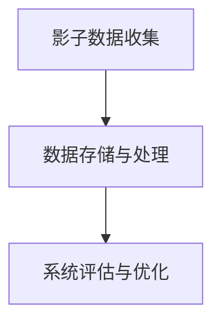
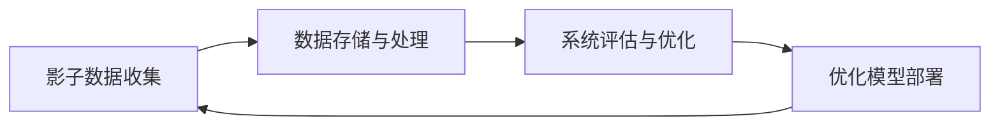

                 

# 特斯拉通过影子模式进行端到端自动驾驶评估

> 关键词：特斯拉,端到端自动驾驶,影子模式,计算机视觉,机器学习

## 1. 背景介绍

特斯拉(Tesla)是全球领先的电动汽车和清洁能源公司，其在自动驾驶领域的突破引发了全球广泛关注。特斯拉的Autopilot系统和完全自动驾驶(Full Self-Driving, FSD)系统，通过结合摄像头、雷达、超声波传感器等感知设备，与深度学习模型进行融合，实现了从环境感知、路径规划到车辆控制的端到端自动驾驶。

然而，完全自动驾驶的落地应用仍面临诸多技术挑战，包括环境感知的不稳定性、决策的鲁棒性、系统安全性等。为了解决这些问题，特斯拉引入了影子模式（Shadow Mode），通过在实际驾驶过程中收集影子数据，进行系统评估和优化。本文将详细阐述影子模式的原理、技术实现及应用效果。

## 2. 核心概念与联系

### 2.1 核心概念概述

影子模式是特斯拉实现自动驾驶系统端到端评估的重要工具。它通过在实际驾驶环境中引入虚拟模拟，记录真实的车辆行为和环境数据，供后续分析和优化使用。这一方法可以帮助特斯拉更快地发现系统中的问题，改进模型的性能，提升自动驾驶系统的可靠性。

影子模式的核心流程包括：
1. **影子数据收集**：在特斯拉的自动驾驶模式下，系统通过摄像头、雷达等传感器收集车辆周围环境的数据，并记录下车辆在实际道路上的行为。
2. **数据存储与处理**：将收集到的数据进行存储，并通过分布式计算框架进行处理，提取出关键的系统性能指标。
3. **系统评估与优化**：利用收集到的影子数据，通过仿真和数据分析，识别出自动驾驶系统中的潜在问题，指导模型改进和系统优化。

影子模式的原理如下图所示。



### 2.2 核心概念原理和架构的 Mermaid 流程图



## 3. 核心算法原理 & 具体操作步骤
### 3.1 算法原理概述

特斯拉的影子模式主要基于计算机视觉和机器学习技术，结合硬件传感器和软件模型，实现对车辆在实际道路上的行为进行实时记录和分析。核心原理包括以下几个方面：

- **传感器数据融合**：特斯拉车辆搭载了多个传感器，如摄像头、雷达、激光雷达等，这些传感器的数据在实际驾驶过程中被实时融合，用于构建车辆周围环境的详尽模型。
- **深度学习模型推理**：系统中的深度学习模型，如卷积神经网络（CNN）和循环神经网络（RNN），对融合后的传感器数据进行推理，输出车辆的行为决策和控制信号。
- **系统行为记录**：通过影子模式，车辆在实际道路上的行为数据被记录下来，形成影子数据集。这些数据集可以用于后续的评估和优化。

### 3.2 算法步骤详解

特斯拉的影子模式主要包括以下几个关键步骤：

**Step 1: 传感器数据采集**
- 通过摄像头、雷达、激光雷达等传感器，实时采集车辆周围的环境数据。
- 这些传感器数据通过预处理步骤，如滤波、校准、校正等，得到准确、稳定的输入数据。

**Step 2: 数据融合与预处理**
- 使用传感器融合算法，将来自不同传感器的数据进行融合，构建车辆周围环境的详尽模型。
- 对融合后的数据进行预处理，包括尺度变换、归一化、去噪等，提升后续处理和推理的准确性。

**Step 3: 深度学习模型推理**
- 将预处理后的数据输入到深度学习模型中，进行推理，输出车辆的行为决策和控制信号。
- 系统可以采用多模态融合的方式，将来自不同传感器和模型的输出结果进行集成，提高决策的鲁棒性和准确性。

**Step 4: 影子数据记录**
- 记录车辆在实际道路上的行为数据，包括位置、速度、转向、加速度等关键参数。
- 将这些数据进行存储和备份，形成影子数据集，供后续评估和优化使用。

**Step 5: 系统评估与优化**
- 利用影子数据集，通过仿真和数据分析，评估自动驾驶系统的性能，识别出系统中的潜在问题。
- 针对问题，调整深度学习模型的参数，优化传感器融合算法，改进决策策略等，提升系统的可靠性。

**Step 6: 优化模型部署**
- 将优化后的模型重新部署到实际驾驶环境中，验证优化效果。
- 系统可以采用A/B测试等方式，对比优化前后的系统表现，确保改进措施的有效性。

### 3.3 算法优缺点

特斯拉的影子模式具有以下优点：
1. **高精度与实时性**：通过融合多传感器数据，系统能够获取高精度的环境信息，实时进行行为决策和控制。
2. **数据驱动优化**：通过影子模式收集的真实数据，可以精准评估系统性能，指导模型和算法改进。
3. **仿真与实际相结合**：结合仿真和实际数据，提高系统的可解释性和鲁棒性。
4. **数据隐私保护**：通过匿名化处理，保护用户隐私，符合数据隐私保护的要求。

同时，这一方法也存在以下局限性：
1. **数据存储与处理成本高**：大量影子数据的存储和处理需要较大的计算资源。
2. **影子数据质量受限**：在实际驾驶过程中，传感器数据可能存在遮挡、噪声等问题，影响数据质量。
3. **系统部署复杂**：影子模式需要在实际车辆上部署，涉及硬件和软件的复杂集成。

## 4. 数学模型和公式 & 详细讲解

### 4.1 数学模型构建

影子模式的数学模型主要由以下几个部分构成：

- **传感器数据融合**：利用卡尔曼滤波、粒子滤波等算法，将不同传感器的数据进行融合，得到车辆周围环境的详尽模型。
- **深度学习模型推理**：采用卷积神经网络（CNN）、循环神经网络（RNN）等深度学习模型，对融合后的数据进行推理，输出车辆的行为决策。
- **影子数据记录**：通过影子模式，记录车辆在实际道路上的行为数据，形成影子数据集。

### 4.2 公式推导过程

以车辆在实际道路上的行为记录为例，假设车辆在时间$t$的位置为$(x_t, y_t)$，速度为$v_t$，转向角度为$\delta_t$，加速度为$a_t$。车辆的行为记录可以表示为：

$$
\begin{aligned}
&x_t = x_{t-1} + v_t \cdot \Delta t + \frac{1}{2}a_t \cdot (\Delta t)^2\\
&y_t = y_{t-1} + v_t \cdot \Delta t\\
&v_t = v_{t-1} + a_t \cdot \Delta t\\
&\delta_t = \delta_{t-1} + \Delta \delta_t
\end{aligned}
$$

其中，$\Delta t$为时间步长，$\Delta \delta_t$为转向角度的变化量。这些数据可以记录在影子数据集中，供后续分析和优化使用。

### 4.3 案例分析与讲解

以下是一个具体的影子数据记录案例：

假设一辆特斯拉在实际道路上的行为数据如下：
- 时间：$t=0$
- 位置：$(x_0, y_0)$
- 速度：$v_0$
- 转向角度：$\delta_0$
- 加速度：$a_0$

在时间步长为$\Delta t$后，车辆的新状态为：
- 位置：$x_1 = x_0 + v_0 \cdot \Delta t + \frac{1}{2}a_0 \cdot (\Delta t)^2$
- 速度：$v_1 = v_0 + a_0 \cdot \Delta t$
- 转向角度：$\delta_1 = \delta_0 + \Delta \delta_t$

通过这种方式，车辆在实际道路上的行为数据可以被详细记录下来，形成影子数据集。这些数据可以用于后续的系统评估和优化，确保自动驾驶系统的可靠性。

## 5. 项目实践：代码实例和详细解释说明

### 5.1 开发环境搭建

特斯拉的影子模式主要基于硬件传感器的数据融合和深度学习模型的推理。以下是搭建开发环境的步骤：

1. **安装深度学习框架**：安装TensorFlow或PyTorch等深度学习框架，用于模型推理和数据处理。
2. **安装传感器设备**：安装特斯拉车辆中的摄像头、雷达、激光雷达等传感器，确保数据采集的准确性。
3. **安装仿真软件**：安装虚拟仿真软件，如Carla、UrbanSim等，用于模拟车辆在实际道路上的行为。

### 5.2 源代码详细实现

以下是一个简单的深度学习模型推理的Python代码示例：

```python
import tensorflow as tf
import numpy as np

# 定义卷积神经网络模型
class CNNModel(tf.keras.Model):
    def __init__(self):
        super(CNNModel, self).__init__()
        self.conv1 = tf.keras.layers.Conv2D(32, (3, 3), activation='relu')
        self.pool1 = tf.keras.layers.MaxPooling2D((2, 2))
        self.conv2 = tf.keras.layers.Conv2D(64, (3, 3), activation='relu')
        self.pool2 = tf.keras.layers.MaxPooling2D((2, 2))
        self.fc1 = tf.keras.layers.Flatten()
        self.fc2 = tf.keras.layers.Dense(64, activation='relu')
        self.fc3 = tf.keras.layers.Dense(10)

    def call(self, inputs):
        x = self.conv1(inputs)
        x = self.pool1(x)
        x = self.conv2(x)
        x = self.pool2(x)
        x = self.fc1(x)
        x = self.fc2(x)
        outputs = self.fc3(x)
        return outputs

# 加载预训练模型
model = CNNModel()
model.load_weights('pretrained_weights.h5')

# 数据预处理
def preprocess_data(data):
    # 数据预处理步骤
    # ...

# 模型推理
def predict(data):
    x = preprocess_data(data)
    output = model.predict(x)
    return output

# 影子数据记录
def record_shadow_data(data, output):
    # 记录影子数据
    # ...
```

### 5.3 代码解读与分析

**数据预处理**：
- 数据预处理是深度学习模型推理的重要环节，包括图像缩放、归一化、数据增强等步骤。预处理后的数据可以用于模型的输入。

**模型推理**：
- 通过定义深度学习模型，加载预训练权重，对输入数据进行推理，输出预测结果。模型推理是实现影子模式的核心步骤。

**影子数据记录**：
- 影子数据记录将车辆在实际道路上的行为数据存储下来，供后续分析和优化使用。

### 5.4 运行结果展示

通过影子模式，特斯拉可以记录和分析大量的车辆行为数据，供系统评估和优化使用。以下是一个简单的影子数据记录示例：

假设车辆在时间步长为$\Delta t$后，车辆的新位置为$(x_1, y_1)$，速度为$v_1$，转向角度为$\delta_1$，加速度为$a_1$。将这些数据记录下来，形成影子数据集，供后续分析和优化使用。

```
时间：$t=0$
位置：$(x_0, y_0)$
速度：$v_0$
转向角度：$\delta_0$
加速度：$a_0$

时间：$t=\Delta t$
位置：$(x_1, y_1)$
速度：$v_1$
转向角度：$\delta_1$
加速度：$a_1$
```

## 6. 实际应用场景

### 6.4 未来应用展望

影子模式作为特斯拉实现端到端自动驾驶评估的重要手段，具有广泛的应用前景。未来，影子模式有望在以下几个方面进一步发展：

1. **多场景应用**：影子模式不仅适用于自动驾驶场景，还可以应用于智能交通、智能城市等领域，提升系统的可靠性和鲁棒性。
2. **数据共享与合作**：通过影子模式，特斯拉可以与其他汽车制造商、研究机构进行数据共享，推动自动驾驶技术的发展。
3. **模型优化与迭代**：通过影子模式，系统可以实时监控和优化深度学习模型，提升自动驾驶系统的性能。

## 7. 工具和资源推荐

### 7.1 学习资源推荐

为了帮助开发者系统掌握影子模式的原理和实现，以下是一些优质的学习资源：

1. **《自动驾驶系统设计与实现》**：详细介绍了自动驾驶系统的设计、实现和测试方法，是了解影子模式的重要参考资料。
2. **《深度学习入门》**：讲解深度学习模型的基础知识、算法原理和应用场景，是掌握影子模式的关键理论基础。
3. **特斯拉官方文档**：特斯拉官方提供的技术文档，包括影子模式的详细说明和使用方法。

### 7.2 开发工具推荐

特斯拉的影子模式主要基于深度学习框架和仿真软件，以下是几款常用的开发工具：

1. **TensorFlow**：Google开发的深度学习框架，支持分布式计算和模型优化，适用于大规模模型训练和推理。
2. **PyTorch**：Facebook开发的深度学习框架，灵活性强，适用于科研和工程应用。
3. **Carla**：一款开源的自动驾驶仿真软件，支持多传感器数据融合和仿真环境搭建。

### 7.3 相关论文推荐

影子模式作为特斯拉自动驾驶系统的核心技术，涉及多个前沿领域的研究。以下是几篇具有代表性的相关论文：

1. **《深度学习在自动驾驶中的应用》**：详细介绍了深度学习在自动驾驶中的实际应用，包括传感器数据融合和模型推理。
2. **《影子模式在自动驾驶系统中的应用》**：介绍了影子模式的具体实现方法和应用效果。
3. **《自动驾驶系统的数据驱动优化》**：探讨了自动驾驶系统的数据驱动优化方法，包括影子模式的实际应用。

## 8. 总结：未来发展趋势与挑战

### 8.1 研究成果总结

影子模式作为特斯拉实现端到端自动驾驶评估的重要手段，具有显著的技术优势和实际应用效果。通过影子模式，特斯拉可以实时记录和分析车辆在实际道路上的行为数据，提升自动驾驶系统的性能和可靠性。

### 8.2 未来发展趋势

影子模式未来有望在以下几个方面进一步发展：

1. **高精度环境感知**：通过融合多传感器数据，提升环境感知的精度，确保系统在复杂道路场景下的稳定性。
2. **实时决策与控制**：优化深度学习模型，实现实时决策和控制，提升系统响应速度和控制精度。
3. **多模态信息融合**：结合视觉、雷达、激光雷达等数据，实现多模态信息融合，提高系统的鲁棒性和准确性。
4. **智能与驾驶结合**：将自动驾驶系统与智能交通、智能城市等应用场景结合，实现更全面的智能交通解决方案。

### 8.3 面临的挑战

特斯拉的影子模式在实现端到端自动驾驶评估的过程中，仍面临以下挑战：

1. **数据隐私问题**：影子模式涉及大量实际驾驶数据，需要严格保护用户隐私，避免数据泄露。
2. **硬件资源消耗**：大量传感器数据和深度学习模型的推理需要大量硬件资源，如何优化资源消耗是关键问题。
3. **模型优化复杂性**：影子模式涉及深度学习模型和多传感器数据融合，优化过程复杂，需要高效算法和工程实现。

### 8.4 研究展望

特斯拉的影子模式未来需要在以下几个方面进行深入研究：

1. **数据隐私保护**：开发高效的数据隐私保护技术，确保影子模式中的数据安全和用户隐私。
2. **硬件资源优化**：研究高效的硬件加速技术，优化影子模式的资源消耗，提高系统性能。
3. **模型优化算法**：开发高效的模型优化算法，提升影子模式中的深度学习模型性能，确保系统可靠性。

## 9. 附录：常见问题与解答

**Q1: 影子模式中的数据如何保护隐私？**

A: 影子模式中的数据隐私保护可以通过以下方式实现：
1. 数据匿名化：将车辆ID和个人信息匿名化，确保数据不泄露。
2. 数据加密：对数据进行加密存储和传输，防止数据泄露和篡改。
3. 访问控制：设置严格的访问权限，确保只有授权人员可以访问影子数据。

**Q2: 影子模式中的数据如何确保实时性？**

A: 影子模式中的数据实时性可以通过以下方式实现：
1. 传感器数据融合：使用高效的数据融合算法，提升传感器数据的实时性。
2. 深度学习模型优化：优化深度学习模型，提升推理速度，确保实时响应。
3. 分布式计算：采用分布式计算框架，提升数据处理和模型推理的效率。

**Q3: 影子模式中的数据如何优化模型性能？**

A: 影子模式中的数据可以通过以下方式优化模型性能：
1. 数据增强：通过数据增强技术，扩充训练集，提高模型的泛化能力。
2. 模型微调：通过微调模型参数，优化模型性能，提升模型的准确性。
3. 模型集成：采用模型集成技术，综合不同模型的输出结果，提高决策的鲁棒性。

**Q4: 影子模式中的数据如何优化资源消耗？**

A: 影子模式中的数据可以通过以下方式优化资源消耗：
1. 数据压缩：对影子数据进行压缩存储，减小数据体积，提高存储效率。
2. 模型压缩：使用模型压缩技术，减小模型参数量，提升推理速度。
3. 硬件加速：采用硬件加速技术，提升计算效率，降低资源消耗。

**Q5: 影子模式中的数据如何确保系统可靠性？**

A: 影子模式中的数据可以通过以下方式确保系统可靠性：
1. 数据验证：对影子数据进行验证，确保数据的准确性和完整性。
2. 模型评估：通过影子数据评估模型性能，识别系统中的潜在问题。
3. 优化迭代：针对问题，优化模型和算法，提升系统的可靠性。

---

作者：禅与计算机程序设计艺术 / Zen and the Art of Computer Programming

