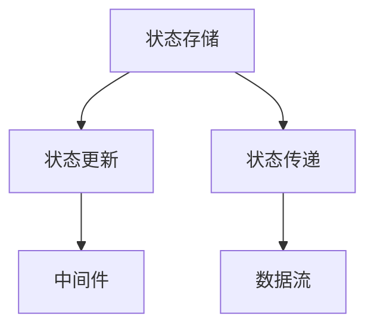

                 

# 状态管理 原理与代码实例讲解

> 关键词：状态管理,React,Redux,Vue,Angular,状态更新,中间件,数据流,Flux,时间旅行

## 1. 背景介绍

### 1.1 问题由来
现代软件系统的复杂性不断提升，单层应用逐渐无法满足需求。多层次、多组件的应用结构，带来了复杂的状态管理问题。如何保持状态的一致性和正确性，如何对状态进行操作和更新，成为每个大型应用开发中的痛点。

状态管理就是对这些问题的答案。它不仅包含状态存储、更新、版本控制等核心功能，还包括状态传递、中间件、数据流管理等辅助功能，是现代应用开发的重要组件。

本文将介绍几种常见状态管理的原理和代码实例，帮助开发者理解状态管理的基本概念和技术实现。

### 1.2 问题核心关键点
- 什么是状态管理？
- 如何设计状态管理系统？
- 几种常见状态管理框架和算法原理
- 状态管理的优缺点
- 状态管理的应用场景
- 未来趋势和挑战

## 2. 核心概念与联系

### 2.1 核心概念概述

状态管理是指对应用的状态进行统一管理和维护，确保应用各个部分之间的状态一致性和正确性。它包括：

- 状态存储：对应用状态进行持久化存储和恢复。
- 状态更新：提供对状态的操作接口，如创建、修改、删除等。
- 状态传递：定义状态之间的通信机制，如父子组件、异步数据等。
- 中间件：在状态更新和传递过程中，提供逻辑拦截、异常处理等功能。
- 数据流：描述状态之间的流向和关系，方便状态追踪和调试。

这些核心概念之间的关系可以通过以下Mermaid流程图来展示：



这个流程图展示了一个典型的状态管理系统架构：状态存储负责持久化应用状态，状态更新提供对状态的操作接口，状态传递定义组件之间的通信机制，中间件提供逻辑拦截和异常处理，数据流描述状态之间的流向和关系。

## 3. 核心算法原理 & 具体操作步骤

### 3.1 算法原理概述

状态管理算法可以从多个维度进行分类，包括状态存储、状态更新、状态传递、中间件和数据流管理等。本文将从状态存储和状态更新两个方面，介绍常见的算法原理和具体操作步骤。

### 3.2 算法步骤详解

#### 3.2.1 状态存储算法
状态存储算法主要涉及如何将应用状态持久化，并在不同的应用实例之间进行共享。

1. **文件存储**：将状态存储在本地文件中，每次启动应用时读取并加载状态。适用于应用数据较小的情况。
2. **数据库存储**：将状态存储在数据库中，如MySQL、MongoDB等。适用于数据量大、需要持久化存储的情况。
3. **分布式存储**：将状态存储在分布式系统中，如Redis、Memcached等。适用于高并发、需要快速读写的情况。

#### 3.2.2 状态更新算法
状态更新算法主要涉及如何对应用状态进行操作和更新。

1. **集中式更新**：将状态更新逻辑集中在状态管理模块中，如Redux、Vuex等。适用于状态变化较为频繁的情况。
2. **分布式更新**：将状态更新逻辑分散在各个组件中，如Flux、MobX等。适用于状态变化较为简单的情况。

#### 3.2.3 状态传递算法
状态传递算法主要涉及如何定义状态之间的通信机制，如父子组件、异步数据等。

1. **父子组件传递**：通过props和事件回调等方式，将状态从父组件传递到子组件。适用于父子组件之间的状态共享。
2. **异步数据传递**：通过网络请求和数据流订阅等方式，将异步数据传递到各个组件。适用于异步数据的状态管理。

### 3.3 算法优缺点

#### 3.3.1 集中式状态管理
优点：
1. 集中控制，便于状态追踪和调试。
2. 支持复杂的状态逻辑，如条件分支、嵌套函数等。

缺点：
1. 单点依赖，容易成为应用的性能瓶颈。
2. 代码复杂度较高，开发和维护成本较高。

#### 3.3.2 分布式状态管理
优点：
1. 无单点依赖，性能更好。
2. 代码简洁，易于开发和维护。

缺点：
1. 状态管理逻辑分散，不易追踪和调试。
2. 对状态变化的支持有限，不易处理复杂逻辑。

### 3.4 算法应用领域

状态管理算法广泛应用在各种类型的应用中，如Web应用、移动应用、桌面应用等。其中，Web应用是应用最为广泛的状态管理领域，常用的框架和算法包括：

1. **React**：通过props和事件回调等方式，将状态传递到子组件。
2. **Redux**：集中式状态管理框架，支持复杂的状态逻辑和中间件。
3. **Vue**：通过props和数据绑定等方式，将状态传递到子组件。
4. **Angular**：通过服务、注入等方式，将状态传递到各个组件。

除了这些框架，还有很多其他的状态管理算法和工具，如Flux、MobX、Mobx-State-Tree等，开发者可以根据实际需求选择合适的工具。

## 4. 数学模型和公式 & 详细讲解

### 4.1 数学模型构建

状态管理的数学模型可以抽象为以下几个关键组件：

- 状态$s$：表示应用当前的状态。
- 操作$o$：表示对状态进行的操作，如创建、修改、删除等。
- 版本$v$：表示状态的版本号，用于状态更新和版本控制。

状态管理的数学模型可以表示为：

$$
s_{v+1} = f(s_v, o_v)
$$

其中$f$表示状态更新函数，$o_v$表示版本号为$v$的操作。

### 4.2 公式推导过程

状态更新函数$f$可以表示为：

$$
f(s_v, o_v) = 
\begin{cases}
s_{v+1} & \text{if } o_v = (c, m) \\
s_v & \text{if } o_v = (d, r)
\end{cases}
$$

其中$c$表示创建操作，$m$表示修改操作，$d$表示删除操作，$r$表示回滚操作。

### 4.3 案例分析与讲解

以Redux为例，介绍状态管理算法的具体实现。

Redux是一个集中式状态管理框架，其核心思想是使用单向数据流管理状态，通过Action和Reducer函数处理状态的创建和修改。具体实现步骤如下：

1. **Action**：表示应用的状态变化，包含类型和数据两部分。

```javascript
const ADD_TODO = 'ADD_TODO';

const addTodo = (text) => {
  return {
    type: ADD_TODO,
    text
  }
}
```

2. **Reducer**：表示状态的更新函数，根据Action类型和数据，更新状态。

```javascript
const initialState = {
  todos: []
};

const todos = (state = initialState.todos, action) => {
  switch (action.type) {
    case ADD_TODO:
      return [...state, action.text];
    default:
      return state;
  }
};
```

3. **Store**：表示状态管理器的核心组件，包含当前状态和状态更新函数。

```javascript
const store = Redux.createStore(todos);
```

4. **监听和更新**：通过订阅和分发Action，实现状态的实时更新和变化。

```javascript
store.subscribe(() => {
  const state = store.getState();
  console.log(state.todos);
});

store.dispatch(addTodo('学习状态管理'));
```

通过以上步骤，Redux实现了集中式状态管理，方便状态追踪和调试，支持复杂的状态逻辑和中间件。

## 5. 项目实践：代码实例和详细解释说明

### 5.1 开发环境搭建

为了实现状态管理，开发者需要选择适合的状态管理工具和框架。以下是一些常用的开发环境搭建步骤：

1. **选择状态管理框架**：选择适合的状态管理工具，如Redux、Vuex、MobX等。
2. **安装相关依赖**：通过npm或yarn安装框架所需的依赖。
3. **配置开发环境**：根据框架的配置要求，配置开发环境，如开发工具、测试工具等。
4. **编写基础代码**：搭建项目的基本框架，如路由、组件等。

### 5.2 源代码详细实现

以下是一个简单的React应用示例，使用Redux实现状态管理。

1. **安装依赖**：

```bash
npm install react react-dom redux react-redux
```

2. **创建Action和Reducer**：

```javascript
const initialState = {
  todos: []
};

const todos = (state = initialState.todos, action) => {
  switch (action.type) {
    case 'ADD_TODO':
      return [...state, action.text];
    default:
      return state;
  }
};

const addTodo = (text) => {
  return {
    type: 'ADD_TODO',
    text
  }
};
```

3. **创建Store**：

```javascript
const store = Redux.createStore(todos);
```

4. **组件代码**：

```javascript
import React, { Component } from 'react';
import { connect } from 'react-redux';

class TodoList extends Component {
  handleAdd = (text) => {
    this.props.addTodo(text);
  }

  render() {
    const { todos } = this.props;
    return (
      <div>
        {todos.map(todo => <p key={todo}>{todo}</p>)}
        <input type="text" onChange={(e) => this.handleAdd(e.target.value)} />
      </div>
    );
  }
}

const mapStateToProps = state => ({
  todos: state.todos
});

const mapDispatchToProps = {
  addTodo
};

export default connect(mapStateToProps, mapDispatchToProps)(TodoList);
```

5. **应用程序入口**：

```javascript
import React from 'react';
import ReactDOM from 'react-dom';
import { Provider } from 'react-redux';
import store from './store';
import TodoList from './TodoList';

ReactDOM.render(
  <Provider store={store}>
    <TodoList />
  </Provider>,
  document.getElementById('root')
);
```

通过以上步骤，开发者可以搭建一个简单的React应用，并使用Redux实现状态管理。

### 5.3 代码解读与分析

以下是对代码的详细解读和分析：

1. **Action**：Action是Redux状态管理的核心，表示应用的状态变化。Action包含类型和数据两部分，如`ADD_TODO`表示添加一个待办事项。

2. **Reducer**：Reducer函数根据Action类型和数据，更新状态。Reducer函数使用`switch`语句处理不同类型的Action，返回更新后的状态。

3. **Store**：Store是Redux状态管理的核心组件，包含当前状态和状态更新函数。通过`createStore`函数，创建和管理应用的状态。

4. **组件代码**：组件代码使用`react-redux`的`connect`函数，将Redux的`mapStateToProps`和`mapDispatchToProps`函数传入组件，将状态和操作函数绑定到组件上，实现状态的实时更新。

5. **应用程序入口**：应用程序入口使用`Provider`组件，将Store对象提供给整个应用，方便组件访问和管理状态。

通过以上分析，可以更好地理解Redux的工作原理和使用方法。

### 5.4 运行结果展示

运行以上代码，可以观察到添加待办事项后，页面上实时更新的效果。

## 6. 实际应用场景

状态管理在实际应用中有很多场景，以下是几个典型的应用场景：

### 6.1 跨组件状态共享

状态管理可以帮助组件之间共享状态，避免全局状态污染。例如，一个电子商务应用中，多个页面需要共享购物车状态，通过状态管理可以将购物车状态保存在Store中，并在需要显示购物车的页面上访问和使用。

### 6.2 异步数据管理

状态管理可以帮助管理异步数据，避免数据不一致和混乱。例如，一个社交网络应用中，需要获取用户的动态数据，通过状态管理可以将异步数据保存在Store中，并在需要显示动态的页面上访问和使用。

### 6.3 事务处理

状态管理可以帮助实现事务处理，确保数据的一致性和完整性。例如，一个金融应用中，需要对用户的交易进行事务处理，通过状态管理可以记录所有交易的操作，并在事务处理完成后返回结果。

## 7. 工具和资源推荐

### 7.1 学习资源推荐

为了帮助开发者深入理解状态管理，以下是一些优质的学习资源：

1. **官方文档**：Redux、Vuex等状态管理框架的官方文档，提供了详细的使用方法和示例代码。
2. **在线课程**：Coursera、Udemy等平台上的状态管理课程，涵盖从基础到高级的内容。
3. **博客和文章**：Stack Overflow、Medium等平台上的状态管理文章，提供实用的开发技巧和案例分析。
4. **社区和论坛**：Reddit、GitHub等社区，提供状态管理的讨论和交流，分享最佳实践和开发经验。

通过这些学习资源，开发者可以全面掌握状态管理的理论知识和实践技巧。

### 7.2 开发工具推荐

为了提高状态管理的开发效率，以下是一些常用的开发工具：

1. **代码编辑器**：如Visual Studio Code、Atom等，提供代码高亮、自动补全等功能，方便开发和调试。
2. **版本控制工具**：如Git、SVN等，提供版本控制和协作开发的功能。
3. **测试工具**：如Jest、Mocha等，提供单元测试和集成测试的功能。
4. **性能分析工具**：如Chrome DevTools、React Developer Tools等，提供性能分析和调试的功能。

这些工具可以帮助开发者更高效地实现和维护状态管理。

### 7.3 相关论文推荐

状态管理的研究涉及多个领域，以下是几篇经典论文，推荐阅读：

1. **Flux architecture: For scalable UI development**：提出Flux架构，将数据流和组件分离，简化状态管理。
2. **The State Machine of State Management**：提出状态机的概念，将状态管理转换为状态机的模型，方便状态追踪和调试。
3. **Data flow state management**：提出数据流管理的方法，通过数据流描述状态之间的流向和关系，方便状态追踪和调试。

这些论文代表了大规模状态管理的发展脉络，通过学习这些前沿成果，可以帮助开发者更好地理解和实现状态管理。

## 8. 总结：未来发展趋势与挑战

### 8.1 总结

本文对状态管理的基本概念和实现方法进行了全面介绍，涵盖状态存储、状态更新、状态传递、中间件和数据流管理等核心内容。通过Redux等框架的代码实例，展示了状态管理的实际应用。

状态管理是现代应用开发的重要组件，通过集中式或分布式的方式管理应用状态，确保应用各个部分之间的状态一致性和正确性。开发者需要根据具体应用场景，选择合适的状态管理工具和框架，并结合代码实例和案例分析，深入理解和掌握状态管理的技术实现。

### 8.2 未来发展趋势

展望未来，状态管理将呈现以下几个发展趋势：

1. **异步状态管理**：异步数据处理将成为状态管理的重要方向，通过数据流和异步操作，提高应用的响应速度和用户体验。
2. **全栈状态管理**：状态管理将从Web应用扩展到移动应用、桌面应用等全栈应用，成为应用开发的重要基础。
3. **智能状态管理**：通过人工智能技术，对状态进行智能分析和优化，提高应用的可维护性和可扩展性。
4. **跨平台状态管理**：状态管理将从单一平台扩展到多平台，实现跨平台的开发和部署。

### 8.3 面临的挑战

尽管状态管理在应用开发中取得了不错的效果，但在实现和应用过程中，仍面临诸多挑战：

1. **复杂度问题**：状态管理系统的设计和实现较为复杂，需要开发者的系统设计和编码能力。
2. **性能问题**：状态管理系统的性能对应用整体性能有重要影响，需要开发者的优化和调优能力。
3. **安全性问题**：状态管理系统对数据的安全性和隐私保护要求较高，需要开发者的安全意识和实践。
4. **兼容性问题**：状态管理系统需要在不同的平台和框架中实现兼容，需要开发者的技术储备和实践经验。

### 8.4 研究展望

未来的状态管理研究需要在以下几个方面寻求新的突破：

1. **异步状态管理**：探索异步数据流和异步操作的管理方法，提高应用的响应速度和用户体验。
2. **智能状态管理**：通过人工智能技术，对状态进行智能分析和优化，提高应用的可维护性和可扩展性。
3. **跨平台状态管理**：实现跨平台的开发和部署，提高应用的可移植性和可扩展性。

这些研究方向的探索，将推动状态管理技术的进一步发展，为应用开发提供更加高效、可靠和智能的状态管理方案。

## 9. 附录：常见问题与解答

**Q1：状态管理对应用性能有什么影响？**

A: 状态管理对应用性能的影响主要体现在以下几个方面：

1. **状态更新频繁**：频繁的状态更新会导致性能瓶颈，需要合理优化状态更新的频率和方式。
2. **数据流传递**：数据流传递会增加网络请求和响应时间，需要合理设计数据流的流向和格式。
3. **中间件拦截**：中间件的拦截和处理会增加额外的计算负担，需要合理选择中间件的类型和数量。

开发者可以通过优化状态更新、合理设计数据流、选择合适的中间件等方式，提高应用性能和用户体验。

**Q2：状态管理对代码复杂度有什么影响？**

A: 状态管理对代码复杂度的影响主要体现在以下几个方面：

1. **状态冗余**：状态管理会导致状态冗余，需要合理管理和优化状态。
2. **代码耦合**：状态管理会增加代码的耦合度，需要合理设计和模块化代码。
3. **调试难度**：状态管理会增加代码的调试难度，需要合理设计状态追踪和调试工具。

开发者可以通过合理管理和优化状态、模块化代码、设计状态追踪和调试工具等方式，降低状态管理对代码复杂度的影响。

**Q3：状态管理对应用的可维护性有什么影响？**

A: 状态管理对应用的可维护性的影响主要体现在以下几个方面：

1. **状态一致性**：状态管理需要确保状态的一致性和正确性，需要合理设计和实现状态更新函数。
2. **状态可控性**：状态管理需要确保状态的可见性和可控性，需要合理设计和实现状态传递机制。
3. **状态可扩展性**：状态管理需要确保状态的可扩展性，需要合理设计和实现状态管理中间件。

开发者可以通过合理设计和实现状态更新函数、状态传递机制、状态管理中间件等方式，提高应用的可维护性和可扩展性。

**Q4：状态管理对应用的安全性有什么影响？**

A: 状态管理对应用的安全性的影响主要体现在以下几个方面：

1. **状态保护**：状态管理需要确保状态的安全性和隐私保护，需要合理设计和实现状态保护机制。
2. **访问控制**：状态管理需要确保状态的访问控制和权限管理，需要合理设计和实现状态访问控制机制。
3. **数据加密**：状态管理需要确保数据的安全性和隐私保护，需要合理设计和实现数据加密机制。

开发者可以通过合理设计和实现状态保护机制、状态访问控制机制、数据加密机制等方式，提高应用的安全性和隐私保护。

**Q5：状态管理对应用的可移植性有什么影响？**

A: 状态管理对应用的可移植性的影响主要体现在以下几个方面：

1. **平台兼容性**：状态管理需要在不同的平台和框架中实现兼容，需要合理设计和实现跨平台状态管理。
2. **工具兼容性**：状态管理需要兼容不同的开发工具和环境，需要合理设计和实现跨工具状态管理。
3. **语言兼容性**：状态管理需要兼容不同的编程语言和技术栈，需要合理设计和实现跨语言状态管理。

开发者可以通过合理设计和实现跨平台状态管理、跨工具状态管理、跨语言状态管理等方式，提高应用的可移植性和可扩展性。

---

作者：禅与计算机程序设计艺术 / Zen and the Art of Computer Programming

