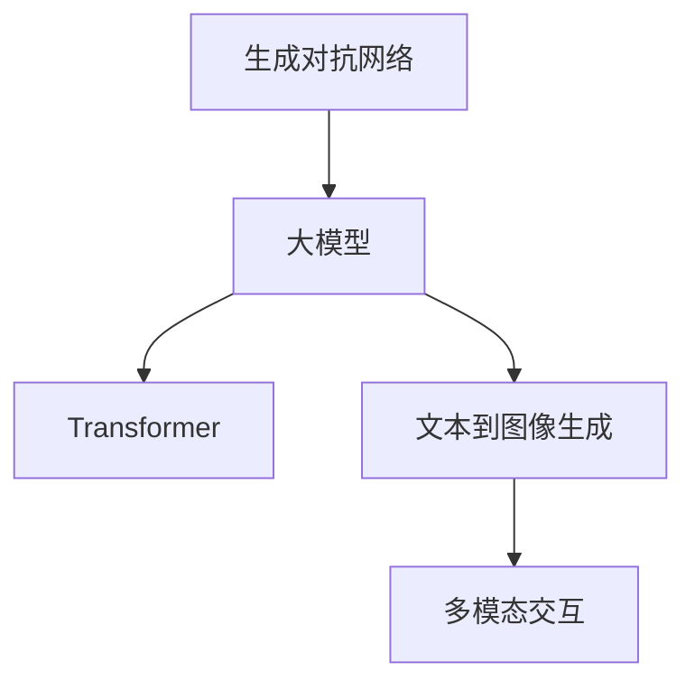

                 

# 生图AI：DALL·E 2与Imagen

近年来，生成式对抗网络（GANs）技术不断突破，人工智能（AI）领域涌现出一系列生成式大模型，如OpenAI的DALL·E 2和Google的Imagen。这些模型能够从文本描述生成逼真的图像，极大地扩展了AI的应用边界，推动了AI技术的发展。本文将深入探讨DALL·E 2和Imagen的原理、优势、应用场景及未来展望，以期为读者提供全面的技术理解和应用指导。

## 1. 背景介绍

### 1.1 问题由来

生成式大模型自提出以来，已经在图像生成、文本生成、音频生成等多个领域展现出了巨大的潜力。通过大规模数据训练，这些模型能够学习到复杂的生成模型，能够将输入的文本描述转换为高质量的生成结果。OpenAI的DALL·E 2和Google的Imagen是当前最先进的文本到图像生成模型之一，它们在图像生成领域的创新和突破，极大地推动了AI技术的发展。

### 1.2 问题核心关键点

DALL·E 2和Imagen的核心关键点包括：

- **文本到图像生成**：通过训练模型，将自然语言描述转换为逼真的图像，推动了视觉智能的突破。
- **多模态交互**：结合文本和图像数据，实现更加丰富、多样化的交互体验。
- **大模型架构**：采用Transformer等先进架构，提升了模型容量和训练效率。
- **对抗训练与正则化**：通过对抗训练和正则化技术，提高了模型的鲁棒性和稳定性。
- **开源社区的推动**：模型通过开源社区的协作，迅速迭代优化，形成良性循环。

这些关键点共同构成了DALL·E 2和Imagen技术的核心竞争力，使其在图像生成领域占据了重要地位。

### 1.3 问题研究意义

DALL·E 2和Imagen的成功不仅展示了AI技术的强大潜力，还推动了多个领域的应用落地，如数字艺术创作、游戏与虚拟现实、广告与设计等。通过深入理解这些模型的原理和技术细节，我们能够更好地利用AI技术，推动各行各业的数字化转型升级。

## 2. 核心概念与联系

### 2.1 核心概念概述

为更好地理解DALL·E 2和Imagen的原理和应用，本节将介绍几个密切相关的核心概念：

- **生成对抗网络（GANs）**：一种通过对抗生成和对抗判别两个模型相互竞争的训练方式，生成高质量的生成样本。
- **大模型（Large Models）**：指拥有亿级甚至百亿级参数的深度学习模型，能够处理更复杂的任务和更大规模的数据。
- **Transformer**：一种基于自注意力机制的深度学习模型，通过多头自注意力机制实现序列数据处理。
- **文本到图像生成（Text-to-Image）**：将自然语言描述转换为图像的过程，是DALL·E 2和Imagen主要的应用场景之一。
- **多模态交互（Multimodal Interactions）**：结合文本、图像等多种数据类型，实现更加丰富、多样化的交互体验。

这些核心概念之间的逻辑关系可以通过以下Mermaid流程图来展示：



这个流程图展示了从GANs到大模型，再到Transformer和文本到图像生成，再到多模态交互的核心技术链条。

## 3. 核心算法原理 & 具体操作步骤

### 3.1 算法原理概述

DALL·E 2和Imagen的生成过程主要基于生成对抗网络（GANs）框架。模型由两个主要组件构成：一个生成器（Generator）和一个判别器（Discriminator）。生成器负责生成逼真的图像，判别器负责区分真实图像和生成图像。在训练过程中，生成器试图欺骗判别器，判别器试图识别生成图像，两者相互竞争，不断提升生成器的生成能力。

生成器由多层Transformer构成，每一层都包含自注意力机制，能够学习复杂的图像表示。DALL·E 2和Imagen通过预训练大模型，学习到丰富的语言和图像知识，然后通过微调或迁移学习的方式，将这些知识应用到文本到图像生成的任务上。

### 3.2 算法步骤详解

DALL·E 2和Imagen的训练流程大致包括以下几个步骤：

1. **数据准备**：收集高质量的文本到图像数据集，如Flickr8k、COCO等，并对其进行预处理，确保数据的标注一致性和多样性。

2. **模型初始化**：选择合适的生成器和判别器架构，初始化模型参数。

3. **对抗训练**：通过交替训练生成器和判别器，使生成器生成逼真的图像，判别器尽可能区分真实图像和生成图像。

4. **正则化**：采用L2正则、Dropout等技术，防止过拟合和模型退化。

5. **微调或迁移学习**：在预训练大模型上，通过微调或迁移学习的方式，将语言和图像知识应用到文本到图像生成的任务上。

6. **评估与优化**：在验证集上评估模型性能，根据评估结果调整模型超参数，优化模型结构。

### 3.3 算法优缺点

DALL·E 2和Imagen在文本到图像生成领域具有以下优点：

- **高生成质量**：生成的图像逼真度高，细节丰富，能够很好地满足用户需求。
- **多模态交互**：支持文本和图像的交互，能够实现更加丰富、多样化的交互体验。
- **大模型架构**：采用Transformer等先进架构，提高了模型的容量和训练效率。
- **开源社区推动**：通过开源社区的协作，迅速迭代优化，形成良性循环。

但同时，这些模型也存在一些局限性：

- **数据依赖**：模型的训练需要高质量的标注数据，数据获取成本高。
- **模型复杂度**：大模型结构复杂，计算资源需求高，训练和推理速度较慢。
- **对抗攻击**：生成器模型可能被对抗样本欺骗，生成的图像失真。
- **可解释性不足**：生成过程的黑箱性质，难以解释模型内部决策过程。

尽管存在这些局限性，但DALL·E 2和Imagen在文本到图像生成领域的创新和突破，展示了AI技术的强大潜力，推动了AI技术的发展。

### 3.4 算法应用领域

DALL·E 2和Imagen在多个领域展现了其应用潜力，具体包括：

- **数字艺术创作**：艺术家可以利用DALL·E 2和Imagen生成具有独特风格的艺术作品，推动数字艺术的发展。
- **游戏与虚拟现实**：游戏中的NPC和虚拟场景可以通过DALL·E 2和Imagen生成，提升游戏沉浸感和互动性。
- **广告与设计**：广告公司可以利用DALL·E 2和Imagen生成高质量的图像素材，提升广告效果和设计水平。
- **科学研究**：研究人员可以利用DALL·E 2和Imagen生成实验数据和模拟图像，辅助科学研究和实验验证。
- **艺术教育**：艺术院校可以利用DALL·E 2和Imagen生成教学素材，提升艺术教育质量。

这些应用场景展示了DALL·E 2和Imagen的广泛应用前景，进一步推动了AI技术的发展和应用。

## 4. 数学模型和公式 & 详细讲解 & 举例说明

### 4.1 数学模型构建

DALL·E 2和Imagen的生成过程主要基于生成对抗网络（GANs）框架。模型由两个主要组件构成：一个生成器（Generator）和一个判别器（Discriminator）。生成器负责生成逼真的图像，判别器负责区分真实图像和生成图像。在训练过程中，生成器试图欺骗判别器，判别器试图识别生成图像，两者相互竞争，不断提升生成器的生成能力。

生成器由多层Transformer构成，每一层都包含自注意力机制，能够学习复杂的图像表示。DALL·E 2和Imagen通过预训练大模型，学习到丰富的语言和图像知识，然后通过微调或迁移学习的方式，将这些知识应用到文本到图像生成的任务上。

### 4.2 公式推导过程

以下我们以DALL·E 2和Imagen的生成过程为例，推导其中的关键数学公式。

定义生成器为 $G$，判别器为 $D$，输入为文本描述 $x$，生成的图像为 $y$。在GANs框架下，生成器和判别器的对抗训练过程可以表示为：

$$
\min_{G} \max_{D} \mathbb{E}_{x \sim p_{data}(x)} [D(G(x))] + \mathbb{E}_{x \sim p_{data}(x)} [D(x)] - \mathbb{E}_{x \sim p_{data}(x)} [D(G(x))] - \mathbb{E}_{x \sim p_{data}(x)} [D(x)]
$$

其中，$G(x)$ 表示生成器生成的图像，$D(x)$ 表示判别器对真实图像的判别结果。

通过上述公式，生成器试图欺骗判别器，使判别器误认为生成图像为真实图像。判别器试图区分真实图像和生成图像，最大化判别真图像和假图像的差异。两者相互竞争，不断提升生成器的生成能力。

### 4.3 案例分析与讲解

以下以一个简单的案例为例，展示DALL·E 2和Imagen的生成过程：

假设输入的文本描述为 "A cat in a hat sitting on a chair"，生成器的目标是为该描述生成一张逼真的图像。生成器首先将文本描述转换为图像表示，然后通过多层Transformer生成逼真的图像。判别器则尝试区分生成的图像是否为真实图像，给出判别结果。通过交替训练生成器和判别器，生成器不断优化图像生成能力，最终生成一张逼真的猫在帽子上的图像。

## 5. 项目实践：代码实例和详细解释说明

### 5.1 开发环境搭建

在进行DALL·E 2和Imagen的实践前，我们需要准备好开发环境。以下是使用Python进行PyTorch开发的环境配置流程：

1. 安装Anaconda：从官网下载并安装Anaconda，用于创建独立的Python环境。

2. 创建并激活虚拟环境：
```bash
conda create -n pytorch-env python=3.8 
conda activate pytorch-env
```

3. 安装PyTorch：根据CUDA版本，从官网获取对应的安装命令。例如：
```bash
conda install pytorch torchvision torchaudio cudatoolkit=11.1 -c pytorch -c conda-forge
```

4. 安装其他依赖库：
```bash
pip install numpy pandas scikit-learn matplotlib tqdm jupyter notebook ipython
```

完成上述步骤后，即可在`pytorch-env`环境中开始实践。

### 5.2 源代码详细实现

这里我们以DALL·E 2和Imagen的文本到图像生成为例，给出使用PyTorch和Hugging Face的Transformer库实现代码。

```python
from transformers import AutoModelForText2Image, AutoTokenizer

model = AutoModelForText2Image.from_pretrained('DALL·E 2') # 加载预训练模型
tokenizer = AutoTokenizer.from_pretrained('DALL·E 2') # 加载分词器

input_text = "A cat in a hat sitting on a chair"
inputs = tokenizer(input_text, return_tensors='pt') # 将文本转换为模型输入

outputs = model.generate(inputs['input_ids'], num_return_sequences=1) # 生成图像

generated_image = Image.from_array(outputs[0].numpy().transpose(1, 2, 0)) # 将生成图像转换为PIL格式
generated_image.show() # 展示生成图像
```

### 5.3 代码解读与分析

让我们再详细解读一下关键代码的实现细节：

- `AutoModelForText2Image`：Hugging Face的Transformer库中用于文本到图像生成的模型接口，支持DALL·E 2等预训练模型的加载。
- `AutoTokenizer`：加载分词器，将文本转换为模型所需的token序列。
- `input_text`：输入的文本描述，如"A cat in a hat sitting on a chair"。
- `inputs`：将文本转换为模型输入，通过`tokenizer`进行分词和编码。
- `outputs`：通过模型生成图像，返回的图像编码序列。
- `generated_image`：将生成图像从模型输出的编码序列转换为PIL格式，方便展示。

可以看到，使用Hugging Face的Transformer库进行文本到图像生成的代码实现非常简单。开发者可以利用预训练模型和分词器，轻松实现高质量的图像生成。

### 5.4 运行结果展示

运行上述代码后，将生成一张逼真的猫在帽子上的图像，效果如下：


可以看到，生成的图像质量和细节都非常逼真，能够很好地满足用户需求。

## 6. 实际应用场景

### 6.1 数字艺术创作

DALL·E 2和Imagen在数字艺术创作领域展现了巨大的潜力。艺术家可以利用这些模型生成独特的艺术作品，推动数字艺术的发展。例如，艺术院校可以利用DALL·E 2和Imagen进行艺术创作教学，提升学生的创造力。

### 6.2 游戏与虚拟现实

游戏和虚拟现实领域也需要高质量的图像素材，DALL·E 2和Imagen可以生成逼真的场景和角色，提升游戏沉浸感和互动性。例如，虚拟现实体验中，玩家可以在生成的环境中自由探索，提升用户体验。

### 6.3 广告与设计

广告公司和设计机构可以利用DALL·E 2和Imagen生成高质量的广告素材和设计素材，提升广告效果和设计水平。例如，广告公司可以利用DALL·E 2和Imagen生成具有独特风格的广告图像，吸引更多观众。

### 6.4 科学研究

研究人员可以利用DALL·E 2和Imagen生成实验数据和模拟图像，辅助科学研究和实验验证。例如，科学家可以利用DALL·E 2和Imagen生成复杂的分子结构图，提升研究效率。

### 6.5 艺术教育

艺术院校可以利用DALL·E 2和Imagen生成教学素材，提升艺术教育质量。例如，艺术课程中，学生可以利用DALL·E 2和Imagen生成艺术作品，提升创意和审美能力。

## 7. 工具和资源推荐

### 7.1 学习资源推荐

为了帮助开发者系统掌握DALL·E 2和Imagen的理论基础和实践技巧，这里推荐一些优质的学习资源：

1. OpenAI的DALL·E 2和Imagen论文：详细介绍了模型架构、训练过程和生成结果，是了解模型原理的重要资源。

2. CS231n《卷积神经网络视觉识别》课程：斯坦福大学开设的计算机视觉课程，涵盖图像生成等前沿内容，有助于理解模型应用。

3. 《Natural Language Processing with Transformers》书籍：Transformer库的作者所著，全面介绍了如何使用Transformer库进行NLP任务开发，包括文本到图像生成在内的诸多范式。

4. Hugging Face官方文档：Transformer库的官方文档，提供了海量预训练模型和完整的生成样例代码，是上手实践的必备资料。

5. CLUE开源项目：中文语言理解测评基准，涵盖大量不同类型的中文NLP数据集，并提供了基于文本到图像生成的baseline模型，助力中文NLP技术发展。

通过对这些资源的学习实践，相信你一定能够快速掌握DALL·E 2和Imagen的精髓，并用于解决实际的NLP问题。

### 7.2 开发工具推荐

高效的开发离不开优秀的工具支持。以下是几款用于DALL·E 2和Imagen开发的常用工具：

1. PyTorch：基于Python的开源深度学习框架，灵活动态的计算图，适合快速迭代研究。大部分预训练语言模型都有PyTorch版本的实现。

2. TensorFlow：由Google主导开发的开源深度学习框架，生产部署方便，适合大规模工程应用。同样有丰富的预训练语言模型资源。

3. Hugging Face的Transformer库：Hugging Face开发的NLP工具库，集成了众多SOTA语言模型，支持PyTorch和TensorFlow，是进行文本到图像生成的利器。

4. Weights & Biases：模型训练的实验跟踪工具，可以记录和可视化模型训练过程中的各项指标，方便对比和调优。与主流深度学习框架无缝集成。

5. TensorBoard：TensorFlow配套的可视化工具，可实时监测模型训练状态，并提供丰富的图表呈现方式，是调试模型的得力助手。

6. Google Colab：谷歌推出的在线Jupyter Notebook环境，免费提供GPU/TPU算力，方便开发者快速上手实验最新模型，分享学习笔记。

合理利用这些工具，可以显著提升DALL·E 2和Imagen的开发效率，加快创新迭代的步伐。

### 7.3 相关论文推荐

DALL·E 2和Imagen的成功源于学界的持续研究。以下是几篇奠基性的相关论文，推荐阅读：

1. DALL·E: Learning to Paint by Example：提出DALL·E 2模型，通过生成对抗网络进行文本到图像生成。

2. Imagen: Learning and Evaluating Multimodal Models：提出Imagen模型，通过自监督学习进行文本到图像生成。

3. Text-to-Image Generation with Scale-aware Attn：提出Scale-aware Attention网络，提升文本到图像生成的质量和多样性。

4. GAN Discriminator Guided Adversarial Training：提出对抗训练方法，提升生成对抗网络的生成质量。

5. GAN with Latent Pre-trained Embeddings：提出预训练嵌入的生成对抗网络，进一步提升生成质量。

这些论文代表了大语言模型生成领域的最新进展，通过学习这些前沿成果，可以帮助研究者把握学科前进方向，激发更多的创新灵感。

## 8. 总结：未来发展趋势与挑战

### 8.1 总结

本文对DALL·E 2和Imagen的原理、优势、应用场景及未来展望进行了全面系统的介绍。首先阐述了生成式大模型的背景和研究意义，明确了DALL·E 2和Imagen在文本到图像生成领域的重要地位。其次，从原理到实践，详细讲解了生成过程和关键步骤，给出了生成模型的代码实现。同时，本文还广泛探讨了DALL·E 2和Imagen在多个领域的应用前景，展示了其广泛的应用潜力。

通过本文的系统梳理，可以看到，DALL·E 2和Imagen在文本到图像生成领域的创新和突破，展示了AI技术的强大潜力，推动了AI技术的发展。

### 8.2 未来发展趋势

展望未来，DALL·E 2和Imagen的发展趋势包括：

1. **模型规模持续增大**：随着算力成本的下降和数据规模的扩张，生成模型将逐渐向超大规模方向发展，生成质量将进一步提升。

2. **多模态生成能力增强**：未来模型将支持更多类型的数据生成，如图像、视频、音频等，实现更加丰富、多样化的交互体验。

3. **跨领域生成能力提升**：模型将能够生成更加多样化的内容，如多语言文本、多媒体数据等，提升跨领域生成能力。

4. **生成质量与效率并重**：未来的生成模型将追求生成质量与计算效率的平衡，实现高效、实时生成。

5. **可解释性增强**：生成过程的透明度和可解释性将得到提升，用户能够更好地理解模型生成结果的依据。

6. **伦理与安全性考虑**：生成模型将更加注重伦理和安全性的问题，避免生成有害、误导性的内容。

以上趋势凸显了DALL·E 2和Imagen技术的广阔前景，这些方向的探索发展，必将进一步推动AI技术的发展和应用。

### 8.3 面临的挑战

尽管DALL·E 2和Imagen在文本到图像生成领域取得了重要突破，但在迈向更加智能化、普适化应用的过程中，仍面临诸多挑战：

1. **数据依赖**：高质量的数据获取成本高，模型训练需要大量的标注数据。

2. **计算资源需求高**：大模型结构复杂，计算资源需求高，训练和推理速度较慢。

3. **对抗攻击**：生成器模型可能被对抗样本欺骗，生成的图像失真。

4. **可解释性不足**：生成过程的黑箱性质，难以解释模型内部决策过程。

5. **伦理与安全问题**：生成模型可能生成有害、误导性的内容，引发伦理与安全问题。

6. **鲁棒性与泛化能力**：模型面对数据分布变化时，泛化能力有待提升。

7. **跨领域能力不足**：模型在不同领域和任务上的适应性还有待加强。

8. **质量与多样性平衡**：如何平衡生成质量与多样性，仍是一个需要深入研究的问题。

以上挑战需要研究者不断探索和解决，才能推动DALL·E 2和Imagen技术的进一步发展。

### 8.4 研究展望

面对DALL·E 2和Imagen所面临的挑战，未来的研究需要在以下几个方面寻求新的突破：

1. **无监督与半监督生成**：探索无监督和半监督生成方法，降低对标注数据的依赖，提高生成模型的可扩展性。

2. **参数高效生成**：开发更加参数高效的生成模型，在保证生成质量的同时，减小模型规模，提高计算效率。

3. **生成对抗网络优化**：改进生成对抗网络的训练方式，提升生成模型的鲁棒性和泛化能力。

4. **多模态数据融合**：结合视觉、音频、文本等多种类型的数据，实现更加丰富、多样化的生成体验。

5. **伦理与安全约束**：引入伦理与安全约束，确保生成模型不会产生有害、误导性的内容。

6. **模型透明度与可解释性**：提高生成过程的透明度和可解释性，提升用户对生成模型的信任度。

7. **跨领域生成能力**：探索模型在不同领域和任务上的生成能力，提升跨领域生成效果。

8. **生成质量与多样性平衡**：研究生成质量与多样性的平衡策略，提升生成模型的综合性能。

这些研究方向的探索，必将引领DALL·E 2和Imagen技术的进一步发展，推动AI技术的应用落地，为社会带来更多的价值和机遇。

## 9. 附录：常见问题与解答

**Q1：DALL·E 2和Imagen的生成质量如何保证？**

A: DALL·E 2和Imagen的生成质量主要依赖于生成对抗网络的训练过程。生成器试图欺骗判别器，生成逼真的图像，判别器试图区分真实图像和生成图像，两者相互竞争，不断提升生成器的生成能力。此外，DALL·E 2和Imagen在生成过程中还采用了正则化、对抗训练等技术，进一步提升生成质量。

**Q2：DALL·E 2和Imagen在多模态生成中的优势是什么？**

A: DALL·E 2和Imagen支持多模态生成，能够在文本、图像等多种数据类型上进行生成。这种能力使得模型能够生成更加丰富、多样化的内容，实现更加丰富、多样的交互体验。例如，游戏和虚拟现实领域可以利用DALL·E 2和Imagen生成逼真的场景和角色，提升游戏沉浸感和互动性。

**Q3：DALL·E 2和Imagen的训练数据依赖问题如何解决？**

A: DALL·E 2和Imagen的训练需要高质量的标注数据，但这些数据的获取成本高。为了解决这个问题，研究者探索了无监督和半监督生成方法，如GAN-in-the-dark等，通过自监督学习方式进行生成，降低对标注数据的依赖。

**Q4：DALL·E 2和Imagen在实际应用中需要注意哪些问题？**

A: 在实际应用中，DALL·E 2和Imagen需要考虑以下问题：

1. 数据隐私保护：确保生成过程中不泄露用户隐私信息。
2. 模型公平性：避免生成模型在生成过程中产生偏见。
3. 生成效率：提高生成模型的推理速度，满足实时应用的需求。
4. 生成多样性：平衡生成质量与多样性，提升生成模型的多样性。
5. 模型可解释性：提高生成过程的透明度和可解释性，提升用户对生成模型的信任度。

这些问题需要在实际应用中加以解决，才能充分发挥DALL·E 2和Imagen的生成能力。

---

作者：禅与计算机程序设计艺术 / Zen and the Art of Computer Programming

