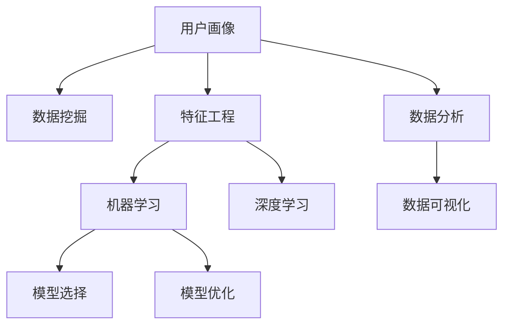

                 

# 用户画像的数据处理与分析

> 关键词：用户画像,数据挖掘,数据分析,机器学习,深度学习,特征工程,数据可视化

## 1. 背景介绍

在当今数字化时代，数据成为了企业宝贵的资产，用户画像（User Persona）作为用户数据的高度抽象和综合，是企业进行市场分析、产品设计、营销推广等决策的关键依据。用户画像不仅能够帮助企业洞察用户行为和需求，还能预测未来趋势，优化产品迭代，提升用户体验。然而，如何从海量数据中提取出有价值的用户画像，是数据科学和人工智能领域的核心挑战之一。

### 1.1 问题由来
随着互联网技术的发展和社交媒体的普及，用户行为数据日益丰富，但数据的数量和多样性也带来了复杂性。传统的统计方法和手工分析已经难以满足需求。机器学习和大数据技术的应用，使自动化分析成为可能，而深度学习方法的引入，进一步提升了用户画像的准确性和全面性。但随之而来的问题是如何有效地处理和分析这些数据，并从中提取有价值的洞察。

### 1.2 问题核心关键点
在用户画像的数据处理与分析过程中，关键问题包括：
- 数据预处理：清洗、归一化、特征选择等。
- 特征工程：提取、组合、降维等。
- 模型选择：选择合适的机器学习或深度学习模型。
- 评估与优化：模型性能的评估与调优。
- 数据可视化：将分析结果直观展示，辅助决策。

## 2. 核心概念与联系

### 2.1 核心概念概述

为更好地理解用户画像的数据处理与分析，本节将介绍几个密切相关的核心概念：

- **用户画像（User Persona）**：指通过数据挖掘和分析得到的目标用户群体的详细描述。包含用户的基本信息、行为习惯、兴趣爱好等。
- **数据挖掘（Data Mining）**：从大规模数据集中发现未知的、有价值的模式和知识的过程。
- **数据分析（Data Analysis）**：利用统计学、数据挖掘和可视化技术，对数据进行深入研究，得出结论。
- **特征工程（Feature Engineering）**：通过数据清洗、转换和选择，提取对模型有意义的特征。
- **机器学习（Machine Learning）**：基于数据和算法，使计算机系统具备从数据中学习规律的能力。
- **深度学习（Deep Learning）**：一种通过多层神经网络进行特征提取和模式识别的学习方式。
- **模型选择与优化**：选择合适的模型结构、超参数，并进行训练与优化。
- **数据可视化（Data Visualization）**：将数据和分析结果以图表、仪表盘等形式展示，便于理解和使用。

这些概念之间的逻辑关系可以通过以下Mermaid流程图来展示：



这个流程图展示了用户画像数据处理与分析的核心流程和各个环节之间的关系。

## 3. 核心算法原理 & 具体操作步骤
### 3.1 算法原理概述

用户画像的数据处理与分析，本质上是一个数据驱动的分析和建模过程。其核心思想是：通过数据挖掘和分析，从原始数据中提取用户画像特征，并选择合适的模型对这些特征进行建模，从而得到目标用户群体的详细描述。

形式化地，假设原始用户数据集为 $D=\{(x_i,y_i)\}_{i=1}^N$，其中 $x_i$ 为用户行为特征，$y_i$ 为用户标签（如性别、年龄等）。用户画像的建模目标是最小化预测误差，即找到最优模型 $M_{\theta}$：

$$
\hat{\theta}=\mathop{\arg\min}_{\theta} \mathcal{L}(M_{\theta},D)
$$

其中 $\mathcal{L}$ 为损失函数，用于衡量模型预测输出与真实标签之间的差异。常用的损失函数包括交叉熵损失、均方误差损失等。

### 3.2 算法步骤详解

用户画像的数据处理与分析，通常包括以下几个关键步骤：

**Step 1: 数据收集与预处理**
- 收集用户行为数据，如点击、购买、浏览记录等。
- 对数据进行清洗、去重、填充缺失值等预处理操作。
- 对数据进行归一化、标准化处理，以保证特征尺度一致。

**Step 2: 特征工程**
- 从原始数据中提取有意义的特征，如行为频率、停留时间、转化率等。
- 对特征进行组合、降维等处理，以减少维度灾难。
- 选择合适的特征选择方法，剔除无关或冗余的特征。

**Step 3: 模型选择与训练**
- 选择合适的机器学习或深度学习模型，如逻辑回归、随机森林、神经网络等。
- 设置模型超参数，如学习率、批量大小、迭代轮数等。
- 使用训练集对模型进行训练，最小化损失函数。

**Step 4: 模型评估与调优**
- 在验证集上评估模型性能，使用准确率、召回率、F1值等指标。
- 根据评估结果调整模型参数，如学习率、正则化系数等。
- 重复训练和调优，直至模型性能满足要求。

**Step 5: 数据可视化**
- 使用数据可视化工具，如Tableau、Power BI、Matplotlib等，将分析结果可视化。
- 制作仪表盘，展示关键指标和变化趋势。
- 制作交互式报告，支持动态查询和筛选。

以上是用户画像数据处理与分析的一般流程。在实际应用中，还需要针对具体任务的特点，对各个环节进行优化设计，如改进特征选择方法、引入更多的正则化技术、搜索最优的超参数组合等，以进一步提升模型性能。

### 3.3 算法优缺点

用户画像的数据处理与分析方法具有以下优点：
1. 高效性：通过自动化处理和分析，节省了大量手工分析和统计工作，提高了效率。
2. 准确性：利用机器学习和深度学习算法，能够从海量数据中提取复杂的用户特征，提升分析的准确性。
3. 可解释性：利用可视化工具，将分析结果直观展示，便于理解和使用。
4. 可操作性：通过模型训练和参数优化，能够动态调整和优化用户画像。

同时，该方法也存在一定的局限性：
1. 依赖数据质量：模型的效果很大程度上取决于原始数据的质量，数据不完整或不准确会影响分析结果。
2. 模型复杂性：深度学习模型需要较多的计算资源和时间，对于大规模数据集可能需要分布式训练。
3. 隐私风险：处理用户数据时需要考虑隐私保护，避免数据泄露和滥用。

尽管存在这些局限性，但就目前而言，用户画像的数据处理与分析方法仍是大数据应用的重要手段。未来相关研究的重点在于如何进一步降低对数据的依赖，提高模型的少样本学习和跨领域迁移能力，同时兼顾可解释性和伦理安全性等因素。

### 3.4 算法应用领域

用户画像的数据处理与分析，在多个领域得到了广泛应用，例如：

- **电子商务**：通过分析用户购物行为和偏好，进行个性化推荐和促销活动。
- **金融行业**：通过分析用户投资和消费行为，进行信用评估和风险管理。
- **市场营销**：通过分析用户反馈和互动数据，进行产品定位和市场推广。
- **社交媒体**：通过分析用户行为和互动数据，进行社区管理和社会分析。
- **医疗健康**：通过分析患者行为和医疗记录，进行疾病预测和健康管理。

除了上述这些经典领域外，用户画像的数据处理与分析也被创新性地应用到更多场景中，如客户流失预测、品牌价值评估、舆情分析等，为数据分析技术带来了新的应用方向。

## 4. 数学模型和公式 & 详细讲解 & 举例说明
### 4.1 数学模型构建

在用户画像的数据处理与分析中，常见的数学模型包括逻辑回归、随机森林、神经网络等。这里以神经网络为例，构建用户画像的数学模型。

假设用户行为数据为 $x$，用户画像特征为 $z$，用户标签为 $y$。使用神经网络模型 $M_{\theta}$ 对 $x$ 进行特征提取，得到特征 $z$，然后使用线性回归模型 $F_{\omega}$ 对 $z$ 进行分类，得到预测标签 $\hat{y}$。神经网络模型的损失函数可以表示为：

$$
\mathcal{L}(\theta,\omega) = \frac{1}{N} \sum_{i=1}^N [(y_i-F_{\omega}(M_{\theta}(x_i)))^2]
$$

其中 $\theta$ 为神经网络的权重参数，$\omega$ 为线性回归模型的权重参数。

### 4.2 公式推导过程

在神经网络模型中，常用的激活函数包括ReLU、sigmoid等。以ReLU激活函数为例，神经网络模型的前向传播过程可以表示为：

$$
z^{(l)} = \sigma(\mathbf{W}^{(l)} \mathbf{x} + \mathbf{b}^{(l)}) \quad l=1,...,L
$$

其中 $L$ 为神经网络层数，$\mathbf{W}^{(l)}$ 为第 $l$ 层的权重矩阵，$\mathbf{b}^{(l)}$ 为第 $l$ 层的偏置向量，$\sigma$ 为激活函数。

神经网络的反向传播过程可以表示为：

$$
\Delta\mathbf{W}^{(l)} = \nabla_{\mathbf{W}^{(l)}} \mathcal{L}(\theta,\omega) \quad l=1,...,L
$$
$$
\Delta\mathbf{b}^{(l)} = \nabla_{\mathbf{b}^{(l)}} \mathcal{L}(\theta,\omega) \quad l=1,...,L
$$
$$
\Delta\theta^{(l)} = \nabla_{\mathbf{W}^{(l)}} \mathcal{L}(\theta,\omega) \quad l=1,...,L
$$
$$
\Delta\omega = \nabla_{\omega} \mathcal{L}(\theta,\omega)
$$

其中 $\nabla_{\cdot}$ 为梯度运算符。

### 4.3 案例分析与讲解

假设有一个电子商务平台，平台希望通过用户行为数据构建用户画像，预测用户的购买意愿。具体步骤如下：

**Step 1: 数据收集与预处理**
- 收集用户浏览、点击、购买记录，包括用户ID、商品ID、时间戳等。
- 对数据进行清洗，去除重复记录和无效数据。
- 对数据进行归一化，将特征值缩放到[0,1]区间。

**Step 2: 特征工程**
- 从原始数据中提取用户行为特征，如浏览频率、浏览时长、购买金额等。
- 对特征进行组合，计算用户的平均购买金额和平均浏览时长。
- 使用主成分分析（PCA）对特征进行降维，减少维度灾难。

**Step 3: 模型选择与训练**
- 选择合适的深度学习模型，如多层感知器（MLP）。
- 设置模型超参数，如学习率、批量大小、迭代轮数等。
- 使用训练集对模型进行训练，最小化损失函数。

**Step 4: 模型评估与调优**
- 在验证集上评估模型性能，使用准确率、召回率、F1值等指标。
- 根据评估结果调整模型参数，如学习率、正则化系数等。
- 重复训练和调优，直至模型性能满足要求。

**Step 5: 数据可视化**
- 使用数据可视化工具，将分析结果直观展示，如用户画像仪表盘。
- 展示关键特征和用户画像，支持动态查询和筛选。

以上步骤展示了使用神经网络模型构建用户画像的详细流程。在实际应用中，还可以结合其他机器学习或深度学习算法，根据具体任务的需求进行优化。

## 5. 项目实践：代码实例和详细解释说明
### 5.1 开发环境搭建

在进行用户画像数据处理与分析实践前，我们需要准备好开发环境。以下是使用Python进行TensorFlow开发的环境配置流程：

1. 安装Anaconda：从官网下载并安装Anaconda，用于创建独立的Python环境。

2. 创建并激活虚拟环境：
```bash
conda create -n tf-env python=3.8 
conda activate tf-env
```

3. 安装TensorFlow：从官网获取对应的安装命令。例如：
```bash
conda install tensorflow -c conda-forge -c pytorch
```

4. 安装各类工具包：
```bash
pip install numpy pandas scikit-learn matplotlib tqdm jupyter notebook ipython
```

完成上述步骤后，即可在`tf-env`环境中开始实践。

### 5.2 源代码详细实现

下面我们以用户画像分析为例，给出使用TensorFlow进行用户画像建模的Python代码实现。

首先，定义用户画像的特征工程函数：

```python
import tensorflow as tf
from sklearn.decomposition import PCA

def feature_engineering(train_dataset):
    # 提取用户ID、商品ID、时间戳等特征
    features = train_dataset['user_id'].values, train_dataset['product_id'].values, train_dataset['timestamp'].values
    
    # 计算用户的平均浏览时长和平均购买金额
    avg_browsing_time = train_dataset['avg_browsing_time'].values
    avg_purchase_amount = train_dataset['avg_purchase_amount'].values
    
    # 将特征合并，并进行归一化处理
    merged_features = np.concatenate([features, [avg_browsing_time, avg_purchase_amount]], axis=1)
    merged_features = (merged_features - merged_features.min()) / (merged_features.max() - merged_features.min())
    
    # 使用PCA进行特征降维
    pca = PCA(n_components=10)
    reduced_features = pca.fit_transform(merged_features)
    
    return reduced_features
```

然后，定义用户画像的神经网络模型：

```python
def build_model(features):
    # 定义输入层
    input_layer = tf.keras.layers.Input(shape=(features.shape[1],))
    
    # 定义多个隐藏层，使用ReLU激活函数
    hidden_layers = [tf.keras.layers.Dense(units=128, activation='relu') for _ in range(3)]
    output_layer = tf.keras.layers.Dense(units=1, activation='sigmoid')
    
    # 构建模型
    model = tf.keras.models.Sequential([
        input_layer,
        *hidden_layers,
        output_layer
    ])
    
    # 编译模型
    model.compile(optimizer='adam', loss='binary_crossentropy', metrics=['accuracy'])
    
    return model
```

接着，定义用户画像的训练与评估函数：

```python
def train_model(model, features, labels):
    # 划分训练集和验证集
    train_features, train_labels = features[:train_size], labels[:train_size]
    val_features, val_labels = features[train_size:], labels[train_size:]
    
    # 训练模型
    history = model.fit(train_features, train_labels, validation_data=(val_features, val_labels), epochs=10, batch_size=32)
    
    # 评估模型
    loss, accuracy = model.evaluate(val_features, val_labels)
    print(f"Validation Loss: {loss:.4f}")
    print(f"Validation Accuracy: {accuracy:.4f}")
    
    return history
```

最后，启动训练流程并在测试集上评估：

```python
from sklearn.model_selection import train_test_split

# 加载数据集
train_dataset = pd.read_csv('train_data.csv')
test_dataset = pd.read_csv('test_data.csv')

# 将数据集划分为训练集和测试集
train_size = int(0.8 * len(train_dataset))
train_features, train_labels = train_dataset.drop('label', axis=1).values, train_dataset['label'].values
val_features, val_labels = train_features[train_size:], train_labels[train_size:]
test_features, test_labels = test_dataset.drop('label', axis=1).values, test_dataset['label'].values

# 特征工程
reduced_features = feature_engineering(train_dataset)

# 构建模型
model = build_model(reduced_features)

# 训练模型
history = train_model(model, reduced_features, train_labels)

# 在测试集上评估模型
test_features, test_labels = feature_engineering(test_dataset)
loss, accuracy = model.evaluate(test_features, test_labels)
print(f"Test Loss: {loss:.4f}")
print(f"Test Accuracy: {accuracy:.4f}")
```

以上就是使用TensorFlow进行用户画像建模的完整代码实现。可以看到，通过TensorFlow，我们可以很方便地构建、训练和评估神经网络模型，实现用户画像的数据处理与分析。

### 5.3 代码解读与分析

让我们再详细解读一下关键代码的实现细节：

**特征工程函数**：
- 提取用户ID、商品ID、时间戳等特征。
- 计算用户的平均浏览时长和平均购买金额。
- 将特征合并，并进行归一化处理。
- 使用主成分分析（PCA）对特征进行降维。

**神经网络模型**：
- 定义输入层，并添加多个隐藏层。
- 使用ReLU激活函数，增加模型的非线性拟合能力。
- 定义输出层，使用sigmoid激活函数，输出概率值。

**训练与评估函数**：
- 划分训练集和验证集。
- 使用训练集对模型进行训练，最小化损失函数。
- 在验证集上评估模型性能，使用准确率和损失函数。

**训练流程**：
- 加载数据集。
- 将数据集划分为训练集和测试集。
- 对训练集进行特征工程，得到降维后的特征。
- 构建神经网络模型。
- 在训练集上训练模型。
- 在验证集上评估模型。
- 在测试集上评估模型。

可以看到，TensorFlow的高级API使得构建和训练神经网络模型变得简洁高效。开发者可以将更多精力放在数据处理、模型改进等高层逻辑上，而不必过多关注底层的实现细节。

当然，工业级的系统实现还需考虑更多因素，如模型的保存和部署、超参数的自动搜索、更灵活的任务适配层等。但核心的用户画像数据处理与分析流程基本与此类似。

## 6. 实际应用场景
### 6.1 智能推荐系统

基于用户画像的数据处理与分析，智能推荐系统能够根据用户的历史行为数据，推荐用户可能感兴趣的商品和服务。例如，电商平台的推荐系统可以通过分析用户浏览、点击、购买记录，构建用户画像，从而进行个性化推荐。

在技术实现上，可以收集用户的行为数据，并对其进行特征工程和模型训练，得到用户画像。在推荐时，输入用户画像和物品信息，通过模型预测用户对该物品的兴趣程度，排序生成推荐列表。对于未见过的商品，还可以结合实时搜索系统，动态生成推荐结果。

### 6.2 客户细分与运营

企业通过用户画像的数据处理与分析，可以更好地细分客户群体，制定针对性的营销策略。例如，零售企业可以根据用户的购买频率、偏好、地理位置等信息，构建不同类型的客户画像，进行精准营销。通过数据分析，企业可以发现潜在的客户细分群体，制定个性化推广方案，提升营销效果。

### 6.3 个性化广告投放

基于用户画像的数据处理与分析，个性化广告投放可以大大提升广告效果。例如，在线广告平台可以根据用户的浏览历史、搜索记录等数据，构建用户画像，预测用户对不同广告的兴趣程度，进行精准投放。通过数据分析，平台可以实时优化广告投放策略，提升广告点击率和转化率。

### 6.4 未来应用展望

随着用户画像的数据处理与分析技术的不断发展，未来的应用将更加广泛和深入。以下是几个可能的发展方向：

- **多模态数据分析**：结合文本、图像、语音等多种数据模态，进行综合分析，提升用户画像的全面性和准确性。
- **实时数据分析**：利用流式处理和实时计算技术，对用户行为数据进行实时分析，快速响应市场变化。
- **跨领域应用**：将用户画像应用到金融、医疗、教育等多个领域，解决实际问题。
- **隐私保护**：在用户画像的数据处理与分析中，引入隐私保护技术，保障用户数据的安全。
- **自动化数据标注**：利用深度学习技术，自动标注和处理海量用户数据，提升数据处理效率。

以上趋势凸显了用户画像数据处理与分析技术的广阔前景。这些方向的探索发展，必将进一步提升数据处理的智能化水平，为用户画像的应用带来更多创新和突破。

## 7. 工具和资源推荐
### 7.1 学习资源推荐

为了帮助开发者系统掌握用户画像的数据处理与分析的理论基础和实践技巧，这里推荐一些优质的学习资源：

1. 《Python数据科学手册》：全面介绍了Python在数据科学中的应用，包括数据处理、特征工程、机器学习等。
2. 《深度学习》（Ian Goodfellow著）：介绍了深度学习的核心概念和应用，是深度学习领域的经典教材。
3. 《机器学习实战》（Peter Harrington著）：结合实际案例，介绍了机器学习算法的实现和应用。
4. Kaggle平台：提供了丰富的数据集和竞赛任务，是实践数据科学和机器学习的好去处。
5. Coursera平台：提供了多个数据科学和机器学习课程，包括斯坦福大学的《机器学习》课程。

通过对这些资源的学习实践，相信你一定能够快速掌握用户画像数据处理与分析的精髓，并用于解决实际的NLP问题。
###  7.2 开发工具推荐

高效的开发离不开优秀的工具支持。以下是几款用于用户画像数据处理与分析开发的常用工具：

1. Python：开源的脚本语言，具有丰富的第三方库和工具，适合数据科学和机器学习开发。
2. TensorFlow：由Google主导开发的开源深度学习框架，具有丰富的API和功能，适合构建复杂模型。
3. Keras：基于TensorFlow等后端的高级API，适合快速构建和训练神经网络模型。
4. Pandas：Python数据处理库，支持数据的清洗、转换和分析。
5. NumPy：Python数学库，支持高效的数组计算和线性代数运算。
6. Scikit-learn：Python机器学习库，提供各种常用算法和工具。
7. Jupyter Notebook：交互式的数据科学笔记本，支持实时计算和代码展示。

合理利用这些工具，可以显著提升用户画像数据处理与分析的开发效率，加快创新迭代的步伐。

### 7.3 相关论文推荐

用户画像的数据处理与分析技术近年来取得了快速发展，以下是几篇奠基性的相关论文，推荐阅读：

1. "A Survey of Data Mining and Statistical Learning Techniques for Customer Segmentation and Profiling"：综述了客户细分和用户画像的多种统计和机器学习技术。
2. "User-Profile Generation with Limited Supervision: An Empirical Evaluation of Machine Learning Techniques"：评估了各种机器学习算法在用户画像生成中的性能。
3. "Generative Adversarial Networks for User-Profile Generation"：提出了生成对抗网络（GAN）在用户画像生成中的应用。
4. "Improving Customer Segmentation with Topic Models"：介绍了主题模型在用户画像生成中的作用。
5. "Deep Learning for Customer Segmentation and Profiling"：探讨了深度学习技术在用户画像生成中的潜力。

这些论文代表了大用户画像数据处理与分析技术的发展脉络。通过学习这些前沿成果，可以帮助研究者把握学科前进方向，激发更多的创新灵感。

## 8. 总结：未来发展趋势与挑战

### 8.1 总结

本文对用户画像的数据处理与分析方法进行了全面系统的介绍。首先阐述了用户画像的重要性和应用价值，明确了数据处理与分析的关键问题。其次，从原理到实践，详细讲解了用户画像的数学模型和算法流程，给出了用户画像建模的完整代码实现。同时，本文还探讨了用户画像在多个领域的应用场景，展示了数据处理与分析技术的广泛应用前景。

通过本文的系统梳理，可以看到，用户画像的数据处理与分析方法正在成为数据科学和人工智能领域的重要范式，极大地拓展了用户数据分析的边界，促进了数据分析技术的落地应用。未来，伴随数据处理与分析技术的持续演进，相信用户画像的应用将更加深入和广泛，为智能决策和智能服务提供更坚实的技术基础。

### 8.2 未来发展趋势

展望未来，用户画像的数据处理与分析技术将呈现以下几个发展趋势：

1. **自动化处理**：自动化数据清洗、特征选择和模型训练，降低数据处理难度，提升数据处理效率。
2. **多模态融合**：结合文本、图像、语音等多种数据模态，进行综合分析，提升用户画像的全面性和准确性。
3. **实时分析**：利用流式处理和实时计算技术，对用户行为数据进行实时分析，快速响应市场变化。
4. **跨领域应用**：将用户画像应用到金融、医疗、教育等多个领域，解决实际问题。
5. **隐私保护**：在用户画像的数据处理与分析中，引入隐私保护技术，保障用户数据的安全。

以上趋势凸显了用户画像数据处理与分析技术的广阔前景。这些方向的探索发展，必将进一步提升数据处理的智能化水平，为用户画像的应用带来更多创新和突破。

### 8.3 面临的挑战

尽管用户画像的数据处理与分析技术已经取得了显著进展，但在迈向更加智能化、普适化应用的过程中，仍面临诸多挑战：

1. **数据质量问题**：用户数据可能存在不完整、不准确或缺失等问题，影响数据分析结果的准确性。
2. **隐私和安全**：处理用户数据时需要考虑隐私保护，避免数据泄露和滥用。
3. **模型复杂性**：深度学习模型需要较多的计算资源和时间，对于大规模数据集可能需要分布式训练。
4. **自动化调参**：如何自动化调优模型参数，提升模型性能，是数据处理与分析技术的重要挑战。

尽管存在这些挑战，但通过不断优化算法和改进工具，用户画像的数据处理与分析技术必将进一步发展和完善，为企业带来更多智能化决策支持。

### 8.4 研究展望

面向未来，用户画像的数据处理与分析技术需要在以下几个方面寻求新的突破：

1. **自动化处理与优化**：引入自动化数据标注、特征选择和模型优化技术，提升数据处理和分析的效率和效果。
2. **多模态融合**：结合多种数据模态，进行多模态用户画像分析，提升数据分析的全面性和准确性。
3. **实时分析与响应**：利用实时计算和流式处理技术，实现用户画像的实时分析和动态调整。
4. **隐私保护与伦理**：引入隐私保护和伦理约束技术，确保用户数据的隐私和安全。

这些研究方向的探索，必将引领用户画像数据处理与分析技术迈向更高的台阶，为智能决策和智能服务提供更坚实的数据基础。面向未来，用户画像的数据处理与分析技术还需要与其他人工智能技术进行更深入的融合，如知识表示、因果推理、强化学习等，多路径协同发力，共同推动数据分析技术的进步。

## 9. 附录：常见问题与解答

**Q1：用户画像的特征工程主要包括哪些步骤？**

A: 用户画像的特征工程通常包括以下几个步骤：
1. 数据收集与预处理：清洗、归一化、填充缺失值等。
2. 特征提取：从原始数据中提取有意义的特征，如行为频率、停留时间、转化率等。
3. 特征组合：将不同的特征进行组合，形成新的特征。
4. 特征降维：使用PCA、LDA等方法对特征进行降维，减少维度灾难。
5. 特征选择：使用相关性分析、特征重要性评分等方法，选择对模型有意义的特征。

通过特征工程，可以从原始数据中提取有意义的特征，提升模型的准确性和泛化能力。

**Q2：用户画像的模型选择与优化需要注意哪些问题？**

A: 用户画像的模型选择与优化需要注意以下几个问题：
1. 数据集划分：将数据集划分为训练集、验证集和测试集，进行模型训练和评估。
2. 超参数调优：选择合适的模型超参数，如学习率、批量大小、迭代轮数等，并进行调优。
3. 正则化：使用L2正则、Dropout等方法，避免过拟合。
4. 模型选择：选择合适的机器学习或深度学习模型，根据任务特点进行优化。
5. 交叉验证：使用交叉验证方法，评估模型的泛化能力。

通过模型选择与优化，可以构建高性能的用户画像模型，提升数据分析的准确性和可靠性。

**Q3：用户画像的数据可视化需要注意哪些问题？**

A: 用户画像的数据可视化需要注意以下几个问题：
1. 选择合适的可视化工具：如Tableau、Power BI、Matplotlib等。
2. 制作简洁直观的图表：避免过于复杂，易于理解和使用。
3. 支持动态查询和筛选：利用交互式工具，提供灵活的数据探索能力。
4. 保护用户隐私：在可视化过程中，避免展示敏感信息，保护用户隐私。

通过数据可视化，可以将用户画像的分析和结果直观展示，辅助决策和分析。

**Q4：用户画像的应用场景有哪些？**

A: 用户画像的应用场景非常广泛，主要包括：
1. 智能推荐系统：通过分析用户行为数据，推荐用户可能感兴趣的商品和服务。
2. 客户细分与运营：通过数据分析，细分客户群体，制定针对性的营销策略。
3. 个性化广告投放：根据用户画像，进行精准广告投放。
4. 舆情分析：通过分析用户反馈和互动数据，进行舆情监测和分析。
5. 个性化医疗：通过用户画像，进行个性化医疗和健康管理。

用户画像的数据处理与分析技术正在逐步渗透到更多领域，为数字化转型提供有力支持。

**Q5：用户画像的隐私保护需要注意哪些问题？**

A: 用户画像的隐私保护需要注意以下几个问题：
1. 数据匿名化：对用户数据进行去标识化处理，保护用户隐私。
2. 访问控制：限制用户数据的访问权限，防止数据泄露。
3. 数据加密：对用户数据进行加密处理，保护数据安全。
4. 法律合规：遵守相关法律法规，保护用户隐私权益。

通过隐私保护技术，可以保障用户数据的安全和隐私，避免数据滥用和泄露。

---

作者：禅与计算机程序设计艺术 / Zen and the Art of Computer Programming

