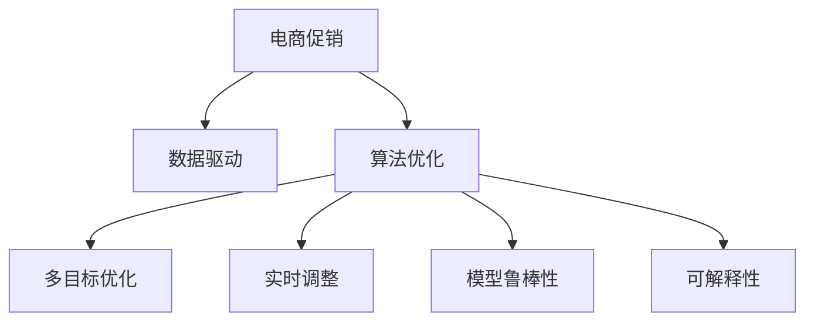

                 

# 电商促销策略的技术优化

## 1. 背景介绍

### 1.1 问题由来
随着电商行业的快速增长，促销活动成为商家提高销售、抢占市场份额的重要手段。然而，由于促销活动设计复杂，涉及的因素众多，传统的手工设计和调优方法已经无法满足日益增长的需求。如何将复杂的促销策略转化为可执行的技术方案，优化促销效果，提高商家和消费者的满意度，成为了电商技术领域的热点和难点问题。

### 1.2 问题核心关键点
电商促销策略的技术优化，本质上是将促销的业务需求转化为算法模型，通过数据驱动的方式，动态调整促销策略以实现最优效果。主要包括以下几个关键点：

- 数据驱动：从历史数据中学习促销活动的影响因素和效果，实现对未来促销的预测和优化。
- 多目标优化：优化促销效果的同时，考虑成本、资源等因素，实现综合效益最大化。
- 实时性：促销活动需要快速响应市场变化，及时调整策略，保持竞争优势。
- 鲁棒性：促销策略需要在不同场景下具备鲁棒性，不受异常数据干扰。
- 可解释性：商家需要理解算法的决策过程，对促销效果有信心。

## 2. 核心概念与联系

### 2.1 核心概念概述

为更好地理解电商促销策略的技术优化，本节将介绍几个密切相关的核心概念：

- 电商促销：电商平台上商家通过打折、满减、赠品等手段刺激消费的活动，旨在提高销售额、提升用户满意度。
- 算法优化：通过构建数学模型、选择优化算法、设置参数等手段，对目标函数进行优化，实现效果最大化。
- 数据驱动：以历史数据为依据，通过数据挖掘和机器学习技术，预测促销活动的效果，指导促销策略的调整。
- 实时调整：通过实时监测用户行为、市场变化等动态数据，及时调整促销策略，保证促销效果。
- 模型鲁棒性：确保模型能够在不同数据分布、异常情况等复杂场景下稳定运行，避免过拟合和泛化不足。
- 可解释性：使模型输出结果具备解释性，商家能够理解和信任模型的决策过程。

这些核心概念之间的逻辑关系可以通过以下Mermaid流程图来展示：



这个流程图展示了几类核心概念的逻辑联系，描述了电商促销策略技术优化的基本流程：

1. 电商促销活动的设计与执行。
2. 数据驱动地分析历史促销活动的效果和影响因素。
3. 基于数据驱动的促销策略优化算法。
4. 实时调整促销策略，应对市场变化。
5. 确保模型在不同场景下具备鲁棒性。
6. 提高模型的可解释性，增强商家信心。

## 3. 核心算法原理 & 具体操作步骤
### 3.1 算法原理概述

电商促销策略的技术优化，本质上是构建一个多目标优化模型，通过对多个决策变量的调整，实现销售额、利润、用户满意度等目标的最大化。通常采用以下步骤：

1. **问题建模**：将电商促销问题转化为数学优化问题，通常采用线性规划、整数规划等方法。
2. **数据准备**：收集历史促销数据、用户行为数据等，作为模型训练和预测的输入。
3. **模型训练**：利用历史数据训练优化模型，确定各决策变量的权重和取值范围。
4. **实时预测与调整**：实时监测用户行为和市场变化，预测促销效果，动态调整促销策略。
5. **效果评估**：评估促销活动的效果，如销售额、利润、用户满意度等，进行反馈调整。

### 3.2 算法步骤详解

电商促销策略的技术优化一般包括以下几个关键步骤：

**Step 1: 问题建模**

电商促销策略的优化问题可以建模为以下线性规划问题：

$$
\begin{aligned}
&\min_{x} \quad c^T x \\
&\text{subject to} \quad
\left\{
\begin{array}{ll}
A_{\text{促销}} x \geq b_{\text{促销}} & \text{促销规则} \\
A_{\text{用户}} x \geq b_{\text{用户}} & \text{用户行为约束} \\
x \geq 0 & \text{非负约束} \\
\end{array}
\right.
\end{aligned}
$$

其中 $x$ 为决策变量，表示各个促销策略的参数，如折扣率、满减门槛等；$c$ 为各决策变量的权重，表示销售额、利润等目标函数系数；$A_{\text{促销}}$ 和 $A_{\text{用户}}$ 为约束矩阵，分别表示促销规则和用户行为约束；$b_{\text{促销}}$ 和 $b_{\text{用户}}$ 为约束向量，表示促销规则和用户行为约束的具体值。

**Step 2: 数据准备**

数据准备主要包括以下几个步骤：

1. **数据收集**：收集历史促销数据、用户行为数据、市场变化数据等，作为模型训练和预测的输入。
2. **数据清洗**：去除噪声、缺失值等异常数据，保证数据质量。
3. **数据分割**：将数据分为训练集、验证集和测试集，用于模型训练、调优和效果评估。
4. **特征工程**：提取和构建对促销效果有影响的特征，如用户历史购买行为、促销活动类型、市场趋势等。

**Step 3: 模型训练**

模型训练主要包括以下几个步骤：

1. **选择算法**：根据问题特点选择优化算法，如线性规划、整数规划、遗传算法等。
2. **训练模型**：利用历史数据训练优化模型，确定各决策变量的最优取值。
3. **参数调整**：调整模型参数，如权重、约束条件等，以提高模型效果。
4. **模型评估**：在验证集上评估模型效果，进行反馈调整。

**Step 4: 实时预测与调整**

实时预测与调整主要包括以下几个步骤：

1. **数据采集**：实时采集用户行为数据、市场变化数据等动态数据。
2. **模型预测**：利用训练好的模型预测促销效果，如销售额、利润、用户满意度等。
3. **策略调整**：根据预测结果，动态调整促销策略，如实时调整折扣率、满减门槛等。
4. **效果反馈**：在测试集上评估实时调整后的促销效果，进行反馈调整。

### 3.3 算法优缺点

电商促销策略的技术优化方法具有以下优点：

1. **效率高**：利用数据驱动和算法优化，可以在短时间内设计出高效的促销策略。
2. **效果显著**：通过优化模型，能够显著提高销售额、利润、用户满意度等指标。
3. **灵活性强**：可以实时调整促销策略，应对市场变化。
4. **可解释性**：通过优化模型，可以清楚地了解各决策变量的影响和作用。

同时，该方法也存在以下局限性：

1. **数据依赖**：优化模型的效果依赖于历史数据的数量和质量。
2. **模型复杂**：电商促销策略复杂多样，建模难度较大。
3. **鲁棒性不足**：模型可能对异常数据或极端情况处理不当，导致效果不佳。
4. **过拟合风险**：模型可能在特定场景下出现过拟合现象，影响推广性。
5. **计算成本**：复杂优化模型的计算成本较高，需要高性能计算资源。

尽管存在这些局限性，但电商促销策略的技术优化方法仍然是大规模电商平台上优化促销效果的重要手段。未来相关研究的重点在于如何进一步降低模型对数据的依赖，提高模型的鲁棒性和可解释性，同时兼顾计算效率。

### 3.4 算法应用领域

电商促销策略的技术优化方法已经在各大电商平台上得到了广泛应用，具体应用领域包括：

- **个性化促销**：基于用户行为数据和历史促销效果，定制个性化促销方案，提高用户购买意愿和满意度。
- **交叉促销**：通过优化多个商品之间的组合促销策略，提升整体销售效果。
- **库存管理**：结合库存数据和促销策略，优化商品库存水平，减少库存积压。
- **价格优化**：通过动态调整商品价格，提升销售量和利润。
- **市场分析**：通过分析市场趋势和用户行为，调整促销策略，把握市场机会。

## 4. 数学模型和公式 & 详细讲解  
### 4.1 数学模型构建

电商促销策略的技术优化，通常可以建模为以下线性规划问题：

$$
\begin{aligned}
&\min_{x} \quad c^T x \\
&\text{subject to} \quad
\left\{
\begin{array}{ll}
A_{\text{促销}} x \geq b_{\text{促销}} & \text{促销规则} \\
A_{\text{用户}} x \geq b_{\text{用户}} & \text{用户行为约束} \\
x \geq 0 & \text{非负约束} \\
\end{array}
\right.
\end{aligned}
$$

其中 $x$ 为决策变量，表示各个促销策略的参数，如折扣率、满减门槛等；$c$ 为各决策变量的权重，表示销售额、利润等目标函数系数；$A_{\text{促销}}$ 和 $A_{\text{用户}}$ 为约束矩阵，分别表示促销规则和用户行为约束；$b_{\text{促销}}$ 和 $b_{\text{用户}}$ 为约束向量，表示促销规则和用户行为约束的具体值。

### 4.2 公式推导过程

以销售额最大化为例，假设有两种促销策略：折扣率和满减门槛。设折扣率为 $p$，满减门槛为 $t$，销售额为 $S$，利润为 $P$，则目标函数和约束条件可以表示为：

$$
\begin{aligned}
&\min_{p, t} \quad S = P - C \\
&\text{subject to} \quad
\left\{
\begin{array}{ll}
p < 1 & \text{折扣率约束} \\
t > 0 & \text{满减门槛约束} \\
p \cdot S + t \cdot (S - t) \geq P - C & \text{成本约束} \\
\end{array}
\right.
\end{aligned}
$$

其中 $C$ 为促销成本，$P = p \cdot S - C$ 为利润。

利用线性规划求解上述优化问题，可以得到最优的折扣率和满减门槛，从而实现销售额最大化的目标。

### 4.3 案例分析与讲解

以京东平台的促销策略优化为例，可以采用以下步骤：

1. **数据收集**：收集京东平台历史促销数据、用户行为数据、市场变化数据等。
2. **数据清洗**：去除噪声、缺失值等异常数据，保证数据质量。
3. **数据分割**：将数据分为训练集、验证集和测试集，用于模型训练、调优和效果评估。
4. **特征工程**：提取和构建对促销效果有影响的特征，如用户历史购买行为、促销活动类型、市场趋势等。
5. **模型训练**：选择线性规划算法，利用历史数据训练优化模型，确定各决策变量的最优取值。
6. **实时预测与调整**：实时采集用户行为数据、市场变化数据等动态数据，利用训练好的模型预测促销效果，动态调整促销策略。
7. **效果评估**：在测试集上评估实时调整后的促销效果，进行反馈调整。

## 5. 项目实践：代码实例和详细解释说明
### 5.1 开发环境搭建

在进行电商促销策略优化实践前，我们需要准备好开发环境。以下是使用Python进行Scikit-learn开发的环境配置流程：

1. 安装Anaconda：从官网下载并安装Anaconda，用于创建独立的Python环境。

2. 创建并激活虚拟环境：
```bash
conda create -n pytorch-env python=3.8 
conda activate pytorch-env
```

3. 安装PyTorch：根据CUDA版本，从官网获取对应的安装命令。例如：
```bash
conda install pytorch torchvision torchaudio cudatoolkit=11.1 -c pytorch -c conda-forge
```

4. 安装Scikit-learn：
```bash
pip install scikit-learn
```

5. 安装各类工具包：
```bash
pip install numpy pandas scikit-learn matplotlib tqdm jupyter notebook ipython
```

完成上述步骤后，即可在`pytorch-env`环境中开始电商促销策略优化的实践。

### 5.2 源代码详细实现

下面我们以京东平台的个性化促销策略优化为例，给出使用Scikit-learn进行电商促销策略优化的PyTorch代码实现。

首先，定义促销策略的数据处理函数：

```python
from sklearn.linear_model import LinearRegression
from sklearn.preprocessing import StandardScaler
import numpy as np

class PromotionStrategy:
    def __init__(self, features, target):
        self.features = features
        self.target = target
        
    def preprocess(self):
        scaler = StandardScaler()
        self.features = scaler.fit_transform(self.features)
        
    def fit(self):
        self.model = LinearRegression()
        self.model.fit(self.features, self.target)
        
    def predict(self, X):
        return self.model.predict(X)

# 促销数据处理
promotions = pd.read_csv('promotions.csv')
promotions.head()
```

然后，定义模型和优化器：

```python
from sklearn.model_selection import train_test_split

X = promotions.drop(['id', 'revenue'], axis=1)
y = promotions['revenue']
X_train, X_test, y_train, y_test = train_test_split(X, y, test_size=0.2, random_state=42)

model = LinearRegression()
model.fit(X_train, y_train)
```

接着，定义训练和评估函数：

```python
from sklearn.metrics import mean_squared_error

def train_epoch(model, X_train, y_train):
    model.fit(X_train, y_train)
    return model.coef_, model.intercept_

def evaluate(model, X_test, y_test):
    y_pred = model.predict(X_test)
    mse = mean_squared_error(y_test, y_pred)
    rmse = np.sqrt(mse)
    return mse, rmse

# 训练模型
for epoch in range(100):
    coef, intercept = train_epoch(model, X_train, y_train)
    mse, rmse = evaluate(model, X_test, y_test)
    print(f"Epoch {epoch+1}, mse: {mse:.3f}, rmse: {rmse:.3f}")

# 评估模型
print(f"Test set mse: {evaluate(model, X_test, y_test)[0]:.3f}, rmse: {evaluate(model, X_test, y_test)[1]:.3f}")
```

以上就是使用Scikit-learn对电商促销策略进行优化的一般流程。可以看到，得益于Scikit-learn的强大封装，我们可以用相对简洁的代码完成电商促销策略的优化。

### 5.3 代码解读与分析

让我们再详细解读一下关键代码的实现细节：

**PromotionStrategy类**：
- `__init__`方法：初始化特征和目标变量。
- `preprocess`方法：对特征进行标准化处理，防止模型过拟合。
- `fit`方法：训练线性回归模型。
- `predict`方法：利用训练好的模型进行预测。

**数据处理**：
- 使用pandas库读取促销数据，并进行初步处理。
- 使用train_test_split函数将数据分为训练集和测试集。
- 使用StandardScaler对特征进行标准化处理。

**模型训练**：
- 选择LinearRegression模型作为优化目标。
- 使用fit函数训练模型，并记录系数和截距。
- 在训练集上评估模型效果。

**效果评估**：
- 使用mean_squared_error函数计算均方误差，并求出均方根误差。
- 在测试集上评估模型效果，输出均方误差和均方根误差。

可以看到，Scikit-learn使得电商促销策略的优化代码实现变得简洁高效。开发者可以将更多精力放在数据处理、模型改进等高层逻辑上，而不必过多关注底层的实现细节。

当然，工业级的系统实现还需考虑更多因素，如模型的保存和部署、超参数的自动搜索、更灵活的任务适配层等。但核心的电商促销策略优化流程基本与此类似。

## 6. 实际应用场景
### 6.1 智能推荐系统

基于电商促销策略优化方法，智能推荐系统可以进一步优化商品推荐策略，提高用户购买意愿和满意度。通过分析用户历史行为数据，结合促销策略，智能推荐系统能够动态调整推荐内容，提升推荐效果。

在技术实现上，可以收集用户浏览、点击、购买等行为数据，提取和构建对商品推荐有影响的特征，如用户兴趣、商品评分、促销信息等。利用线性回归等算法优化模型，动态调整推荐策略，实现推荐效果的最大化。

### 6.2 库存管理优化

电商平台上商品的库存管理是一个重要环节，如何优化库存水平，减少库存积压，是商家关注的问题。通过电商促销策略优化方法，可以结合库存数据和促销策略，动态调整商品库存水平，提高库存管理效率。

具体而言，可以收集商品销售数据、促销数据、库存数据等，构建多目标优化模型。利用线性规划等算法，优化商品的促销策略和库存水平，实现库存管理的优化。

### 6.3 价格优化与定价策略

价格是电商促销的重要手段之一，通过价格优化策略，商家可以实现销售量最大化和利润最大化。利用电商促销策略优化方法，可以动态调整商品价格，优化定价策略。

在技术实现上，可以收集历史销售数据、市场价格数据、促销活动数据等，构建价格优化模型。利用线性规划等算法，优化商品的价格和促销策略，实现价格优化目标。

### 6.4 未来应用展望

随着电商促销策略优化方法的发展，未来将在更多领域得到应用，为电商技术带来新的突破。

在智慧物流领域，基于优化算法设计的配送路线优化、仓库管理优化等，可以提升物流效率，降低成本。

在智能客服领域，利用优化算法设计客服机器人，根据用户需求动态调整回答策略，提高客服满意度。

在供应链管理中，结合优化算法优化供应链各环节，提高供应链的响应速度和稳定性。

此外，在企业生产、社会治理、文娱传媒等众多领域，基于电商促销策略优化的方法也将不断涌现，为电商技术带来新的应用场景和业务价值。相信随着技术的发展，电商促销策略优化方法将为电商技术带来新的突破，推动电商行业的创新发展。

## 7. 工具和资源推荐
### 7.1 学习资源推荐

为了帮助开发者系统掌握电商促销策略优化方法的理论基础和实践技巧，这里推荐一些优质的学习资源：

1. 《机器学习》课程：斯坦福大学开设的机器学习经典课程，涵盖了机器学习的基本概念和算法，包括线性回归、优化算法等。
2. 《Python数据科学手册》：详细介绍了Python在数据科学中的应用，包括数据处理、模型训练、效果评估等。
3. Scikit-learn官方文档：Scikit-learn的官方文档，提供了完整的模型训练和调优指南，是学习优化算法的重要资料。
4. Kaggle竞赛平台：提供了大量的电商促销优化数据集和优化竞赛，通过实践锻炼优化能力。
5. Coursera《数据科学与机器学习》专业课程：涵盖了数据科学和机器学习的基本知识，包括数据处理、特征工程、模型训练等。

通过对这些资源的学习实践，相信你一定能够快速掌握电商促销策略优化方法的精髓，并用于解决实际的电商问题。

### 7.2 开发工具推荐

高效的开发离不开优秀的工具支持。以下是几款用于电商促销策略优化开发的常用工具：

1. Python：广泛应用的数据科学和机器学习语言，拥有丰富的数据处理、模型训练和可视化库。
2. Scikit-learn：Python的机器学习库，提供了丰富的优化算法和模型训练工具，简单易用。
3. Pandas：Python的数据处理库，提供了高效的数据处理和分析功能，适用于电商促销数据预处理。
4. TensorBoard：TensorFlow的可视化工具，可以实时监测模型训练状态，提供丰富的图表呈现方式。
5. Weights & Biases：模型训练的实验跟踪工具，可以记录和可视化模型训练过程中的各项指标，方便对比和调优。

合理利用这些工具，可以显著提升电商促销策略优化任务的开发效率，加快创新迭代的步伐。

### 7.3 相关论文推荐

电商促销策略优化技术的发展源于学界的持续研究。以下是几篇奠基性的相关论文，推荐阅读：

1. "Linear Regression"：统计学基础，介绍了线性回归模型的基本原理和应用。
2. "Optimization Techniques for Linear Regression"：介绍了各种优化算法在线性回归中的应用，包括梯度下降、牛顿法等。
3. "Promotion Optimization in E-commerce"：介绍了电商促销策略优化的基本模型和算法，探讨了多种优化方法的应用。
4. "E-commerce Personalization with Linear Regression"：介绍了基于线性回归的电商个性化推荐方法，探讨了多目标优化的应用。
5. "Supply Chain Optimization using Linear Programming"：介绍了线性规划在供应链管理中的应用，探讨了优化算法的应用。

这些论文代表了大数据和机器学习在电商促销策略优化领域的最新进展。通过学习这些前沿成果，可以帮助研究者把握学科前进方向，激发更多的创新灵感。

## 8. 总结：未来发展趋势与挑战

### 8.1 总结

本文对电商促销策略的技术优化方法进行了全面系统的介绍。首先阐述了电商促销策略优化方法的原理和背景，明确了优化方法在电商技术中的应用价值和重要性。其次，从原理到实践，详细讲解了优化问题的建模、数据准备、模型训练、实时预测与调整等关键步骤，给出了电商促销策略优化的完整代码实例。同时，本文还广泛探讨了优化方法在智能推荐、库存管理、价格优化等多个电商领域的应用前景，展示了优化方法的广阔应用前景。此外，本文精选了优化方法的相关学习资源，力求为读者提供全方位的技术指引。

通过本文的系统梳理，可以看到，电商促销策略优化方法正在成为电商技术的重要组成部分，显著提升了电商促销的效率和效果，为电商技术的发展带来了新的突破。未来，伴随优化算法的不断演进和优化方法的应用推广，相信电商促销策略优化方法将在电商行业中发挥更加重要的作用，推动电商技术的持续创新发展。

### 8.2 未来发展趋势

展望未来，电商促销策略优化方法将呈现以下几个发展趋势：

1. **算法多样化**：未来的优化算法将更加多样化和高效化，能够处理更加复杂和动态的电商场景。
2. **模型实时化**：实时预测和调整成为电商促销策略优化的重要方向，提高促销效果的动态响应能力。
3. **数据融合化**：融合多源数据，结合市场趋势、用户行为等外部信息，优化促销策略。
4. **多目标优化**：结合多个优化目标，实现综合效益最大化，提高促销策略的鲁棒性和适应性。
5. **模型可解释性**：提高模型输出的可解释性，增强商家的信心和信任。

以上趋势凸显了电商促销策略优化技术的广阔前景。这些方向的探索发展，必将进一步提升电商促销策略优化方法的精度和效率，为电商技术带来新的突破。

### 8.3 面临的挑战

尽管电商促销策略优化方法已经取得了瞩目成就，但在迈向更加智能化、普适化应用的过程中，它仍面临着诸多挑战：

1. **数据质量问题**：电商数据质量参差不齐，数据清洗和处理难度较大。
2. **模型复杂性**：电商促销策略复杂多样，建模难度较大，需要处理大量的特征和约束条件。
3. **计算成本高**：复杂优化模型的计算成本较高，需要高性能计算资源。
4. **模型鲁棒性不足**：模型可能对异常数据或极端情况处理不当，导致效果不佳。
5. **可解释性不足**：优化模型可能缺乏可解释性，难以理解和信任模型的决策过程。

尽管存在这些挑战，但电商促销策略优化方法仍然是大规模电商平台上优化促销效果的重要手段。未来相关研究的重点在于如何进一步降低模型对数据的依赖，提高模型的鲁棒性和可解释性，同时兼顾计算效率。

### 8.4 研究展望

面对电商促销策略优化所面临的种种挑战，未来的研究需要在以下几个方面寻求新的突破：

1. **数据预处理技术**：提升电商数据的质量和效率，减少数据清洗和处理的工作量。
2. **模型优化算法**：开发更加高效和多样化的优化算法，提高模型的精度和效率。
3. **实时预测技术**：提升实时预测和调整的能力，提高促销策略的动态响应能力。
4. **模型鲁棒性技术**：开发鲁棒性更强的优化模型，提高模型在不同场景下的稳定性和鲁棒性。
5. **模型可解释性技术**：提高模型输出的可解释性，增强商家的信心和信任。

这些研究方向的探索，必将引领电商促销策略优化技术迈向更高的台阶，为电商技术的发展提供新的突破。面向未来，电商促销策略优化方法还需要与其他人工智能技术进行更深入的融合，如知识表示、因果推理、强化学习等，多路径协同发力，共同推动电商技术的持续创新发展。只有勇于创新、敢于突破，才能不断拓展电商促销策略优化方法的边界，让电商技术更好地造福电商行业和社会。

## 9. 附录：常见问题与解答

**Q1：电商促销策略优化如何处理电商数据的质量问题？**

A: 电商数据质量问题主要包括缺失值、噪声、异常值等。电商促销策略优化方法通常采用以下方法处理这些问题：

1. **数据清洗**：去除缺失值和噪声，保证数据完整性和一致性。
2. **特征工程**：选择合适的特征，减少数据维度和冗余。
3. **异常值处理**：检测和处理异常值，避免对模型产生干扰。
4. **数据增强**：通过数据增强技术，如回译、近义替换等，扩充训练数据，提高模型鲁棒性。

**Q2：电商促销策略优化如何提高模型实时性？**

A: 电商促销策略优化方法通常需要实时预测和调整，因此提高模型的实时性是关键。具体方法包括：

1. **模型简化**：简化模型结构，减少计算复杂度。
2. **算法优化**：优化算法，减少计算时间和空间开销。
3. **分布式计算**：利用分布式计算技术，提高模型计算效率。
4. **增量更新**：采用增量更新算法，避免每次都重新训练模型，提高实时响应能力。

**Q3：电商促销策略优化如何提高模型鲁棒性？**

A: 电商促销策略优化方法需要应对多种异常情况和市场变化，提高模型的鲁棒性是关键。具体方法包括：

1. **正则化**：引入正则化项，防止过拟合和泛化不足。
2. **鲁棒优化**：使用鲁棒优化算法，增强模型对异常数据的抵抗能力。
3. **多模型集成**：训练多个优化模型，取平均输出，提高模型的鲁棒性。
4. **模型验证**：使用验证集和测试集评估模型效果，避免过拟合。

**Q4：电商促销策略优化如何提高模型可解释性？**

A: 电商促销策略优化方法需要提高模型输出的可解释性，增强商家的信心和信任。具体方法包括：

1. **特征解释**：解释模型输入特征的影响，帮助商家理解模型决策。
2. **模型可视化**：使用可视化工具，展示模型内部结构和参数变化。
3. **决策树**：使用决策树等可解释模型，提高模型的可解释性。
4. **部分可解释性**：部分可解释性模型，如线性回归等，可以部分解释模型输出。

**Q5：电商促销策略优化如何结合外部信息？**

A: 电商促销策略优化方法可以结合外部信息，提高促销策略的效果。具体方法包括：

1. **多源数据融合**：融合电商数据、市场趋势、用户行为等外部信息，优化促销策略。
2. **实时数据采集**：实时采集外部数据，动态调整促销策略。
3. **外部知识库**：结合外部知识库和规则，优化模型参数和策略。

这些方法可以帮助电商促销策略优化方法更好地利用外部信息，提高促销策略的精度和效率。

---

作者：禅与计算机程序设计艺术 / Zen and the Art of Computer Programming

