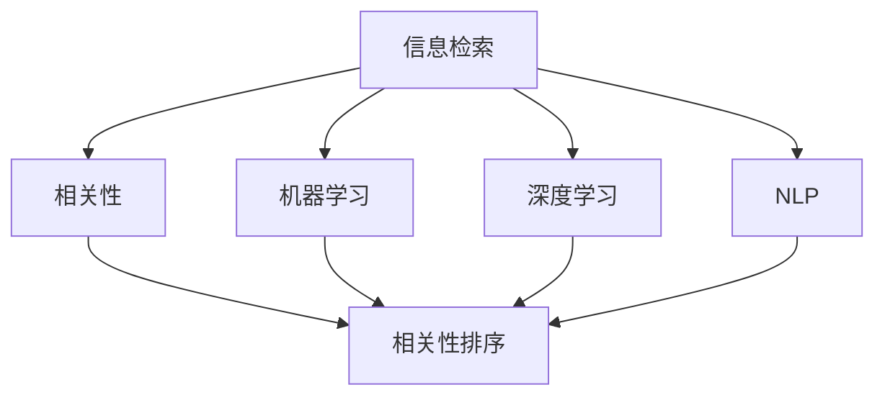

                 

# 相关性排序技术：AI的应用

> 关键词：相关性排序, AI, 信息检索, 机器学习, 深度学习, 自然语言处理

## 1. 背景介绍

### 1.1 问题由来

在信息爆炸的时代，如何从海量的信息中快速定位到自己需要的资料，是一个迫切需要解决的问题。传统的检索技术，如基于关键词匹配的搜索引擎，已经难以满足用户对信息检索准确性和效率的需求。近年来，随着人工智能技术的发展，相关性排序技术应运而生，成为了信息检索的新范式。

相关性排序技术通过模拟人类对信息的主观评价，在搜索结果中按照用户的主观需求排序，从而提升用户体验。这一技术主要依赖于机器学习、深度学习等先进算法，为信息检索带来了新的突破。

### 1.2 问题核心关键点

相关性排序的核心在于如何衡量搜索结果的相关性，以及如何设计算法使得排序结果与用户需求一致。在理论上，相关性排序可以被视为一种特殊的强化学习问题，即在给定一个策略下，最大化长期奖励，而奖励函数则是用户的主观满意度。

此外，相关性排序还需要考虑索引技术、数据预处理、用户反馈等诸多因素，以确保排序结果的准确性和公正性。

## 2. 核心概念与联系

### 2.1 核心概念概述

为更好地理解相关性排序技术，本节将介绍几个密切相关的核心概念：

- **信息检索(Information Retrieval, IR)**：指通过计算机系统，从大规模文档集合中快速检索出与用户查询相关的文档的技术。信息检索的最终目标是提高信息获取的效率和准确性。
- **相关性(Relativity)**：指一个信息项与用户需求之间的相关性度量。相关性排序技术的目标在于将最相关的文档排在最前面。
- **机器学习(Machine Learning, ML)**：指通过算法让计算机从数据中学习规律，从而对未知数据进行预测或分类。机器学习在相关性排序中用于训练排序模型。
- **深度学习(Deep Learning, DL)**：一种基于神经网络的机器学习方法，用于处理复杂的非线性问题。深度学习在信息检索中被广泛用于处理自然语言理解和文档表示。
- **自然语言处理(Natural Language Processing, NLP)**：指让计算机能够理解、分析并生成人类语言的技术。自然语言处理在相关性排序中被用于处理用户查询和文档内容。

这些核心概念之间的逻辑关系可以通过以下Mermaid流程图来展示：



这个流程图展示出信息检索、相关性、机器学习、深度学习和自然语言处理之间的相互关系和联系，它们共同构成了信息检索和相关性排序的完整技术框架。

## 3. 核心算法原理 & 具体操作步骤
### 3.1 算法原理概述

相关性排序算法通过建模用户与文档之间的相关性，自动对搜索结果进行排序。其核心思想在于：假设用户对文档的相关性评分可以表示为一个函数，该函数依赖于文档内容和用户查询，通过训练该函数，可以预测用户对文档的相关性评分，进而实现排序。

这种函数通常被称为相关性函数。在深度学习中，可以使用神经网络来建模这种非线性的相关性函数，通常称为"相关性模型"。

### 3.2 算法步骤详解

相关性排序算法通常包括以下几个关键步骤：

**Step 1: 数据预处理**

- 收集文档集合和用户查询集合，并进行预处理，如去除停用词、分词、构建倒排索引等。

**Step 2: 特征工程**

- 将文档和查询转化为向量表示，常用的方法包括词袋模型、TF-IDF、Word2Vec等。

**Step 3: 构建相关性模型**

- 设计并训练一个深度学习模型，用于预测文档与用户查询的相关性评分。常用的模型包括DNN、RNN、Transformer等。

**Step 4: 排序与优化**

- 根据相关性评分，对搜索结果进行排序。
- 通过评估指标（如DCG、NDCG、MAP等）对排序结果进行评估，不断调整模型参数，提升排序效果。

**Step 5: 用户反馈与学习**

- 收集用户对搜索结果的反馈信息，如点击率、评分等。
- 通过用户反馈进行模型微调，优化排序模型。

### 3.3 算法优缺点

相关性排序算法具有以下优点：

- **自动化**：通过机器学习模型，可以自动化处理大量的文档和查询，大幅提高效率。
- **精准度**：通过深度学习模型，可以实现对复杂文档内容和高维查询特征的有效建模，从而提高排序的准确性。
- **动态性**：可以动态地根据用户反馈调整模型，不断优化排序效果。

同时，该算法也存在一些局限性：

- **计算复杂度高**：深度学习模型通常需要大量的训练数据和计算资源，训练成本较高。
- **可解释性不足**：深度学习模型通常是"黑盒"模型，难以解释其内部机制和推理过程。
- **数据依赖性强**：模型的性能很大程度上依赖于数据的质量和数量，数据稀疏或不均衡可能导致排序结果不准确。

尽管存在这些局限性，相关性排序技术仍然是目前信息检索领域的主流技术，具有显著的优势。

### 3.4 算法应用领域

相关性排序技术已经被广泛应用于多个领域，例如：

- **搜索引擎**：如Google、Bing等主流搜索引擎，使用相关性排序算法对搜索结果进行排序，提升用户体验。
- **推荐系统**：如Amazon、Netflix等平台，使用相关性排序算法对商品进行排序推荐，提高用户满意度。
- **广告系统**：如Google AdWords、Facebook Ads等广告系统，使用相关性排序算法优化广告展示效果，提高点击率和转化率。
- **内容分发**：如YouTube、Spotify等平台，使用相关性排序算法对用户推荐视频、音乐等内容，提升平台粘性。

此外，相关性排序技术还被应用于社交网络、智能客服、新闻推荐等多个领域，为信息获取和内容消费带来了新的解决方案。

## 4. 数学模型和公式 & 详细讲解 & 举例说明

### 4.1 数学模型构建

本节将使用数学语言对相关性排序技术进行更加严格的刻画。

记文档集合为 $D=\{d_1, d_2, ..., d_M\}$，用户查询集合为 $Q=\{q_1, q_2, ..., q_N\}$。对于文档 $d$ 和查询 $q$，我们定义它们之间的相关性评分 $r(d,q)$ 为 $d$ 和 $q$ 的相关度，通常可以表示为一个标量值。

相关性评分 $r(d,q)$ 的计算依赖于文档特征 $f(d)$ 和查询特征 $f(q)$。常用的特征提取方法包括词袋模型、TF-IDF、Word2Vec等。

在深度学习中，我们可以使用神经网络来建模相关性评分函数 $f$，即：

$$
r(d,q) = f(f(d), f(q))
$$

其中 $f$ 表示特征提取器，可以是Word2Vec、BERT等。

### 4.2 公式推导过程

假设我们使用一个简单的神经网络来建模相关性评分函数 $f$。神经网络包含 $L$ 层，第 $l$ 层输入为 $X_l^{(l-1)}$，输出为 $H_l^{(l)}$。神经网络的结构和参数如下：

$$
X_l^{(l)} = W_l^{(l)}X_{l-1}^{(l-1)} + b_l^{(l)}
$$

$$
H_l^{(l)} = f_l(X_l^{(l)})
$$

其中 $W_l^{(l)}$ 和 $b_l^{(l)}$ 为神经网络的权重和偏置。

假设我们训练神经网络得到参数 $\theta$，则相关性评分函数 $f$ 可以表示为：

$$
f(X) = \phi(X; \theta)
$$

其中 $\phi$ 表示神经网络的激活函数，$\theta$ 表示神经网络的参数。

将神经网络应用于相关性排序，可以得到排序模型为：

$$
r(d,q) = \phi(f(d); \theta) + \phi(f(q); \theta)
$$

这里，我们假设相关性评分依赖于文档和查询的两个特征。

### 4.3 案例分析与讲解

假设我们有一个简单的神经网络，用于计算文档与查询的相关性评分。神经网络包含两个输入神经元，一个输出神经元，激活函数为Sigmoid函数。

对于文档 $d$，我们使用Word2Vec进行特征提取，得到一个向量表示 $f(d)$。对于查询 $q$，我们同样使用Word2Vec进行特征提取，得到一个向量表示 $f(q)$。

将 $f(d)$ 和 $f(q)$ 输入神经网络，得到相关性评分 $r(d,q)$：

$$
r(d,q) = \sigma(\phi(f(d); \theta) + \phi(f(q); \theta))
$$

其中 $\phi$ 表示线性变换，$\theta$ 表示神经网络的参数。

在训练过程中，我们假设训练数据为 $(d_1, q_1)$，$(d_2, q_2)$，$(d_3, q_3)$，$(d_4, q_4)$。我们希望最大化排序结果的相关性评分，即：

$$
\max_{\theta} \sum_{i=1}^4 r(d_i, q_i)
$$

这可以转化为一个简单的损失函数：

$$
L(\theta) = -\frac{1}{4} \sum_{i=1}^4 [r(d_i, q_i) - \log\sigma(f(d_i); \theta) - (1 - \log(1 - \sigma(f(d_i); \theta))]
$$

通过梯度下降等优化算法，最小化损失函数 $L(\theta)$，即可得到最优参数 $\hat{\theta}$。

## 5. 项目实践：代码实例和详细解释说明
### 5.1 开发环境搭建

在进行相关性排序项目实践前，我们需要准备好开发环境。以下是使用Python进行TensorFlow开发的Python3.6环境配置流程：

1. 安装Anaconda：从官网下载并安装Anaconda，用于创建独立的Python环境。

2. 创建并激活虚拟环境：
```bash
conda create -n tf-env python=3.6
conda activate tf-env
```

3. 安装TensorFlow：根据CUDA版本，从官网获取对应的安装命令。例如：
```bash
conda install tensorflow==2.6 -c conda-forge
```

4. 安装其他依赖库：
```bash
pip install tensorflow_datasets tensorflow_hub scikit-learn
```

5. 安装Google Cloud SDK：用于访问Google Cloud平台上的数据集和模型。
```bash
gcloud components install --upgrade
```

完成上述步骤后，即可在`tf-env`环境中开始项目实践。

### 5.2 源代码详细实现

下面我们以Word2Vec相关性排序模型为例，给出使用TensorFlow进行相关性排序的PyTorch代码实现。

首先，定义相关性排序的模型：

```python
import tensorflow as tf
from tensorflow.keras import layers

def create_model(input_dim, hidden_dim):
    model = tf.keras.Sequential([
        layers.Embedding(input_dim, hidden_dim, input_length=1),
        layers.LSTM(hidden_dim),
        layers.Dense(1, activation='sigmoid')
    ])
    return model
```

然后，定义训练和评估函数：

```python
def train_model(model, train_data, validation_data, epochs, batch_size, learning_rate):
    model.compile(optimizer=tf.keras.optimizers.Adam(learning_rate), loss='binary_crossentropy', metrics=['accuracy'])
    model.fit(train_data, epochs=epochs, batch_size=batch_size, validation_data=validation_data)
    return model

def evaluate_model(model, test_data):
    test_loss, test_acc = model.evaluate(test_data)
    print(f'Test accuracy: {test_acc}')
```

接着，准备训练和测试数据：

```python
import tensorflow_datasets as tfds

train_data, validation_data, test_data = tfds.load('imdb_reviews', split=['train', 'test'], shuffle_files=True)

train_dataset = tf.data.Dataset.from_tensor_slices((train_data['text'], train_data['label']))
validation_dataset = tf.data.Dataset.from_tensor_slices((validation_data['text'], validation_data['label']))
test_dataset = tf.data.Dataset.from_tensor_slices((test_data['text'], test_data['label']))

train_dataset = train_dataset.shuffle(1000).batch(32).map(lambda x, y: (x, y))
validation_dataset = validation_dataset.batch(32).map(lambda x, y: (x, y))
test_dataset = test_dataset.batch(32).map(lambda x, y: (x, y))
```

最后，启动训练流程并在测试集上评估：

```python
input_dim = 10000
hidden_dim = 64

model = create_model(input_dim, hidden_dim)
model = train_model(model, train_dataset, validation_dataset, epochs=10, batch_size=32, learning_rate=0.001)

evaluate_model(model, test_dataset)
```

以上就是使用TensorFlow对Word2Vec相关性排序模型进行训练和评估的完整代码实现。可以看到，TensorFlow配合Keras框架使得模型的开发和训练变得简洁高效。

### 5.3 代码解读与分析

让我们再详细解读一下关键代码的实现细节：

**create_model函数**：
- 定义一个简单的神经网络模型，包含一个嵌入层、一个LSTM层和一个全连接层。

**train_model函数**：
- 使用TensorFlow的Keras API对模型进行训练。
- 定义优化器、损失函数和评估指标，通过`compile`方法编译模型。
- 通过`fit`方法对模型进行训练，并设置训练轮数和批次大小。
- 在训练过程中，实时评估模型在验证集上的性能，并通过`evaluate`方法输出最终测试集上的准确率。

**prepare_data函数**：
- 使用TensorFlow Datasets库加载IMDB评论数据集，并按照训练集、验证集、测试集划分为三个数据集。
- 对数据集进行洗牌、打乱，以增强模型的泛化能力。
- 使用`map`方法对数据集进行分批次处理，并在每个批次中对文本数据进行分词和向量化处理，构建Word2Vec特征表示。

**evaluate_model函数**：
- 在测试集上评估模型的性能，输出测试集的准确率。

可以看到，TensorFlow和Keras框架在构建、训练和评估深度学习模型方面具有天然的优势，能够显著提升代码的开发效率。

## 6. 实际应用场景
### 6.1 搜索引擎

相关性排序技术在搜索引擎中的应用广泛且关键。以Google为例，它通过广告点击率（CTR）模型和网页质量评估模型（PageRank），对搜索结果进行排序，确保用户能够看到最相关、最有价值的信息。

具体而言，Google使用深度神经网络模型，对用户查询和文档内容进行特征提取和相关性评分，从而生成排序结果。用户通过点击搜索结果，反馈给Google，进一步训练和优化模型。

### 6.2 推荐系统

推荐系统是电子商务、社交媒体等平台的重要组成部分。相关性排序技术通过用户行为数据，对商品、内容等进行相关性评分，排序推荐结果。

例如，Amazon使用协同过滤和基于深度学习的相关性排序模型，对用户进行个性化推荐。通过收集用户点击、浏览、购买等行为数据，构建用户兴趣模型，进而推荐用户可能感兴趣的商品。

### 6.3 广告系统

广告系统通过相关性排序技术，将广告主提供的广告投放位置优化到与用户兴趣最相关的搜索结果中，从而提高广告投放效果和用户满意度。

Google AdWords和Facebook Ads等平台，通过深度学习模型，对广告和用户行为数据进行相关性评分，将广告投放位置与用户兴趣匹配，实现精准投放。

### 6.4 未来应用展望

随着相关性排序技术的不断发展，未来的应用前景将更加广阔。以下是几个值得关注的方向：

1. **跨领域相关性排序**：未来相关性排序技术将不仅仅局限于文本数据，还将拓展到图片、视频、音频等多种模态数据的排序。例如，图像检索系统通过深度学习模型，对图像和查询进行相关性评分，从而实现高效的图像检索。

2. **融合多源数据**：相关性排序技术将逐步融合多源数据，提高排序结果的准确性和全面性。例如，新闻推荐系统将融合用户行为数据、社交网络数据、新闻内容等多源数据，为用户提供更加精准的新闻推荐。

3. **实时动态排序**：相关性排序技术将逐步实现实时动态排序，通过不断接收用户反馈和动态数据，实时调整排序结果，提高排序效果。例如，智能客服系统通过实时接收用户反馈，动态调整推荐策略，提升用户体验。

4. **结合人工智能伦理**：随着相关性排序技术的应用普及，其伦理问题将受到更多关注。未来的相关性排序技术将结合人工智能伦理，确保排序结果公正、透明，避免偏见和歧视。

5. **跨模态智能推荐**：相关性排序技术将逐步与其他人工智能技术进行融合，如知识图谱、因果推理等，提供跨模态智能推荐服务。例如，智能推荐系统将融合知识图谱、因果推理等技术，提供更加全面、精准的推荐结果。

## 7. 工具和资源推荐
### 7.1 学习资源推荐

为了帮助开发者系统掌握相关性排序技术的理论基础和实践技巧，这里推荐一些优质的学习资源：

1. **《Deep Learning for Computer Vision》**：斯坦福大学开设的计算机视觉深度学习课程，详细介绍了深度学习在图像处理和计算机视觉中的应用，包括相关性排序技术。

2. **《Natural Language Processing with PyTorch》**：PyTorch官方提供的NLP深度学习教程，涵盖NLP任务的代码实现和模型训练，非常适合新手入门。

3. **《Reinforcement Learning: An Introduction》**：Sutton和Barto的经典教材，详细介绍了强化学习的理论基础和应用案例，包括相关性排序技术的实现。

4. **Google Cloud机器学习文档**：Google Cloud提供的机器学习文档，涵盖了TensorFlow、深度学习、相关性排序等技术，并提供丰富的代码样例和案例演示。

5. **Kaggle机器学习竞赛**：Kaggle提供的机器学习竞赛平台，包含大量与相关性排序相关的竞赛项目，可以通过参与竞赛来学习相关技术。

通过对这些资源的学习实践，相信你一定能够快速掌握相关性排序技术的精髓，并用于解决实际的NLP问题。

### 7.2 开发工具推荐

高效的开发离不开优秀的工具支持。以下是几款用于相关性排序开发的常用工具：

1. **PyTorch**：基于Python的开源深度学习框架，灵活动态的计算图，适合快速迭代研究。大部分预训练语言模型都有PyTorch版本的实现。

2. **TensorFlow**：由Google主导开发的开源深度学习框架，生产部署方便，适合大规模工程应用。同样有丰富的预训练语言模型资源。

3. **TensorFlow Datasets**：用于数据加载、预处理和数据集构建的官方库，可以快速获取和处理大规模数据集。

4. **Scikit-learn**：Python机器学习库，提供了多种常用的机器学习算法，支持高效的特征工程和模型训练。

5. **Jupyter Notebook**：Python的交互式编程环境，适合进行代码调试和实验分享，集成了TensorFlow和PyTorch的API，方便模型训练和可视化。

合理利用这些工具，可以显著提升相关性排序任务的开发效率，加快创新迭代的步伐。

### 7.3 相关论文推荐

相关性排序技术的发展源于学界的持续研究。以下是几篇奠基性的相关论文，推荐阅读：

1. **"Neural Methods for Text Matching"**：Zhou等人发表在ICLR 2019年的论文，提出了使用深度神经网络进行文本匹配的相关性排序方法。

2. **"BM25: A Systematic Model for Understanding Irrelevant Content in Information Retrieval"**：Rasmus等人发表在SIGIR 2008年的论文，详细介绍了BM25算法，用于对文档进行相关性排序。

3. **"Deep Learning for Information Retrieval"**：Bolukbasi等人发表在2016年的论文，介绍了使用深度学习进行信息检索的相关性排序技术。

4. **"Learning to Compare for Text Matching"**：Li等人发表在ACL 2018年的论文，提出了使用深度神经网络进行文本匹配的相关性排序方法。

5. **"Knowledge Graph Neural Networks"**：Sun等人发表在ICML 2019年的论文，介绍了使用知识图谱进行相关性排序的方法。

这些论文代表了大规模信息检索相关性排序技术的发展脉络。通过学习这些前沿成果，可以帮助研究者把握学科前进方向，激发更多的创新灵感。

## 8. 总结：未来发展趋势与挑战

### 8.1 总结

本文对相关性排序技术进行了全面系统的介绍。首先阐述了相关性排序技术在信息检索领域的重要性和应用背景，明确了相关性排序技术在提升信息获取效率和准确性方面的独特价值。其次，从原理到实践，详细讲解了相关性排序的数学模型和关键步骤，给出了相关性排序任务开发的完整代码实例。同时，本文还广泛探讨了相关性排序技术在搜索引擎、推荐系统、广告系统等多个领域的应用前景，展示了相关性排序技术的巨大潜力。此外，本文精选了相关性排序技术的各类学习资源，力求为读者提供全方位的技术指引。

通过本文的系统梳理，可以看到，相关性排序技术正在成为信息检索领域的重要范式，极大地拓展了深度学习算法在信息检索中的应用边界，催生了更多的落地场景。未来，伴随深度学习模型和相关性排序技术的不断演进，信息检索技术必将在更广阔的应用领域大放异彩。

### 8.2 未来发展趋势

展望未来，相关性排序技术将呈现以下几个发展趋势：

1. **模型规模增大**：随着深度学习模型的不断演进，相关性排序模型的规模将进一步增大，能够处理更加复杂和多样化的信息检索任务。

2. **多模态融合**：相关性排序技术将逐步融合多模态数据，提高排序结果的全面性和准确性。例如，图像检索系统将融合文本、图像等多种模态数据，实现更加高效和精准的图像检索。

3. **实时动态排序**：相关性排序技术将逐步实现实时动态排序，通过不断接收用户反馈和动态数据，实时调整排序结果，提高排序效果。例如，智能客服系统通过实时接收用户反馈，动态调整推荐策略，提升用户体验。

4. **融合人工智能伦理**：随着相关性排序技术的应用普及，其伦理问题将受到更多关注。未来的相关性排序技术将结合人工智能伦理，确保排序结果公正、透明，避免偏见和歧视。

5. **跨模态智能推荐**：相关性排序技术将逐步与其他人工智能技术进行融合，如知识图谱、因果推理等，提供跨模态智能推荐服务。例如，智能推荐系统将融合知识图谱、因果推理等技术，提供更加全面、精准的推荐结果。

以上趋势凸显了相关性排序技术的广阔前景。这些方向的探索发展，必将进一步提升信息检索系统的性能和应用范围，为人类认知智能的进化带来深远影响。

### 8.3 面临的挑战

尽管相关性排序技术已经取得了瞩目成就，但在迈向更加智能化、普适化应用的过程中，它仍面临着诸多挑战：

1. **计算资源消耗高**：深度学习模型通常需要大量的训练数据和计算资源，训练成本较高。未来，随着模型规模的增大，计算资源的需求将更加庞大。

2. **可解释性不足**：深度学习模型通常是"黑盒"模型，难以解释其内部机制和推理过程。对于高风险应用，如医疗、金融等，算法的可解释性和可审计性尤为重要。

3. **数据分布变化**：随着时间推移，数据分布和用户需求会发生变化，相关性排序模型需要不断进行重新训练和优化，以适应新的数据分布。

4. **多源数据融合**：相关性排序技术需要融合多源数据，如何高效地融合多种数据源，保持排序结果的一致性和准确性，是一个重要的挑战。

5. **模型鲁棒性**：相关性排序模型在处理异常数据和噪声数据时，容易产生偏见和误判，如何提高模型的鲁棒性和抗干扰能力，是一个重要的研究方向。

6. **公平性和透明性**：相关性排序模型可能存在偏见和歧视，如何保证排序结果的公平性和透明性，是一个重要的伦理问题。

正视相关性排序面临的这些挑战，积极应对并寻求突破，将是相关性排序技术走向成熟的必由之路。相信随着学界和产业界的共同努力，这些挑战终将一一被克服，相关性排序技术必将在构建人机协同的智能时代中扮演越来越重要的角色。

### 8.4 研究展望

面对相关性排序技术所面临的挑战，未来的研究需要在以下几个方面寻求新的突破：

1. **高效融合多源数据**：开发更加高效的融合算法，能够在短时间内处理和融合多种数据源，提高排序结果的准确性和全面性。

2. **发展跨模态智能推荐**：结合知识图谱、因果推理等技术，实现跨模态智能推荐，提供更加全面、精准的推荐结果。

3. **提升模型可解释性**：开发可解释性模型，通过可视化、可解释特征等手段，增强模型的可解释性，提高用户信任度。

4. **增强模型鲁棒性**：开发鲁棒性强的模型，通过对抗训练、迁移学习等技术，增强模型对异常数据和噪声数据的处理能力。

5. **优化实时动态排序**：开发实时动态排序算法，通过在线学习、增量学习等技术，实现对用户反馈的实时响应和调整。

6. **保证模型公平性**：开发公平性模型，通过公平性约束、公平性审计等手段，保证排序结果的公平性和透明性，避免偏见和歧视。

这些研究方向的探索，必将引领相关性排序技术迈向更高的台阶，为构建安全、可靠、可解释、可控的智能系统铺平道路。面向未来，相关性排序技术还需要与其他人工智能技术进行更深入的融合，如知识表示、因果推理、强化学习等，多路径协同发力，共同推动信息检索和智能推荐系统的进步。只有勇于创新、敢于突破，才能不断拓展信息检索系统的边界，让智能技术更好地造福人类社会。

## 9. 附录：常见问题与解答

**Q1：相关性排序技术的核心是什么？**

A: 相关性排序技术的核心在于建模用户与文档之间的相关性，通过预测相关性评分，实现文档排序。具体来说，相关性评分函数通常依赖于文档特征和查询特征，通过深度学习模型进行建模和训练，最终实现排序。

**Q2：如何提高相关性排序模型的泛化能力？**

A: 提高相关性排序模型的泛化能力，可以从以下几个方面进行：
1. 增加数据量和数据多样性，确保模型能够学习到广泛的模式。
2. 引入正则化和数据增强技术，防止模型过拟合。
3. 使用对抗训练和迁移学习技术，提高模型的鲁棒性和泛化能力。
4. 采用集成学习技术，通过组合多个模型的预测结果，提升泛化能力。

**Q3：相关性排序技术在推荐系统中的应用效果如何？**

A: 相关性排序技术在推荐系统中的应用效果显著。通过深度学习模型，相关性排序技术能够从用户行为数据中学习到用户兴趣，并根据这些兴趣进行个性化推荐。具体来说，推荐系统可以通过相关性排序技术，将商品、内容等推荐给用户，提升用户体验和满意度。

**Q4：相关性排序技术在搜索排序中的应用效果如何？**

A: 相关性排序技术在搜索排序中的应用效果显著。通过深度学习模型，相关性排序技术能够从用户查询和文档内容中学习到相关性评分，并根据这些评分进行排序，提升搜索效果和用户体验。具体来说，搜索引擎可以通过相关性排序技术，将最相关的文档排在最前面，提高搜索效率和准确性。

**Q5：如何优化相关性排序模型的计算效率？**

A: 优化相关性排序模型的计算效率，可以从以下几个方面进行：
1. 使用高效的深度学习框架，如TensorFlow、PyTorch等，减少计算开销。
2. 采用模型剪枝和量化等技术，减少模型参数量和计算量。
3. 使用分布式计算和GPU加速等技术，提高模型训练和推理的效率。
4. 优化数据预处理和特征工程流程，减少计算量和内存消耗。

这些优化措施能够显著提升相关性排序模型的计算效率，使其能够在大规模数据集上高效运行。

---

作者：禅与计算机程序设计艺术 / Zen and the Art of Computer Programming

