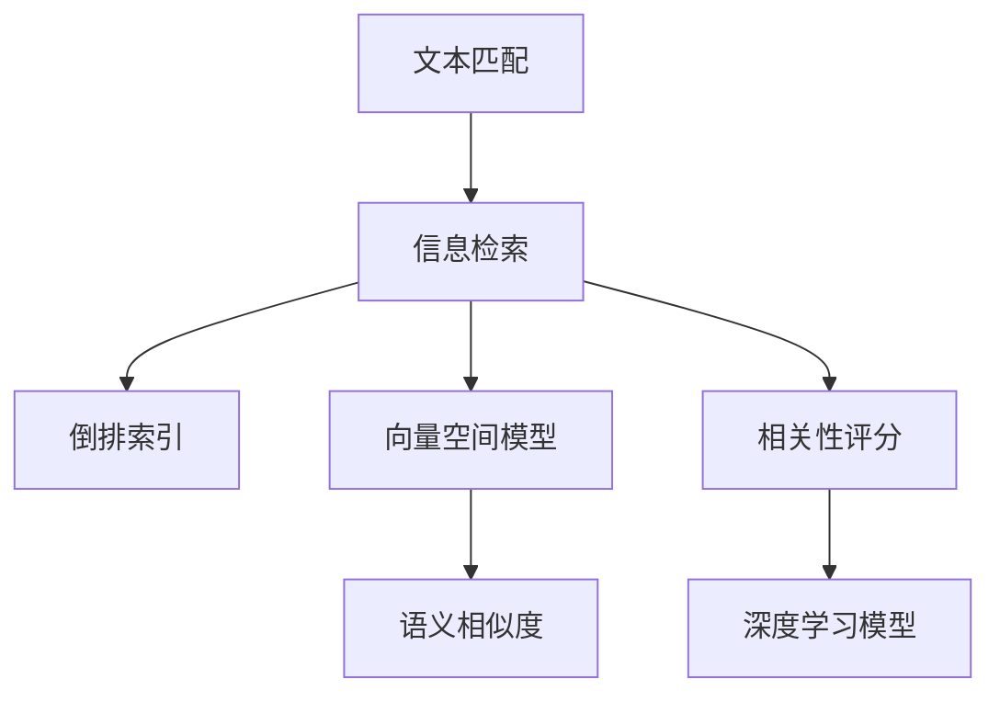

                 

# 相关性评分 原理与代码实例讲解

> 关键词：相关性评分, 文本匹配, 信息检索, 检索技术, 倒排索引, 向量空间模型, 语义相似度, 编码器-解码器模型, 深度学习, 自然语言处理

## 1. 背景介绍

在自然语言处理(Natural Language Processing, NLP)中，文本匹配、信息检索、问答系统、文本摘要等任务都依赖于对文本的相似性度量和排序。相关性评分 (Relevance Score) 是衡量文本与查询之间的相关程度的核心概念，是整个信息检索领域的基础。在搜索引擎、智能问答、内容推荐等应用场景中，相关性评分都发挥着至关重要的作用。

在信息检索过程中，如何准确地量化文本的相关性，提高检索系统的效果，成为了一个重要而复杂的问题。随着深度学习技术的发展，尤其是Transformer模型在文本匹配任务中的成功应用，相关性评分也进入了一个新的发展阶段。本文将系统地介绍相关性评分的原理，并结合代码实例，展示如何使用深度学习模型来提升相关性评分效果。

## 2. 核心概念与联系

### 2.1 核心概念概述

为了更好地理解相关性评分的原理，本节将介绍几个关键概念：

- **文本匹配**：文本匹配是指在大量的文本集合中，找到与查询最相关的文档。文本匹配是信息检索的基础任务，广泛应用于搜索引擎、问答系统、内容推荐等场景。
- **信息检索**：信息检索是指根据用户输入的查询，从数据库或文本库中找到最相关的文档。信息检索的目标是提升用户的信息获取效率。
- **倒排索引**：倒排索引是一种文本数据库的索引方法，通过将查询中的每个词与其出现的文档列表关联起来，加速文本的检索。倒排索引是传统搜索引擎的核心技术之一。
- **向量空间模型**：向量空间模型是一种通过将文本转换为向量，在向量空间中度量文本相似性的方法。该模型广泛应用于信息检索和文本分类任务中。
- **语义相似度**：语义相似度是指两个文本在语义上的一致程度，通常通过向量空间模型或深度学习模型计算。语义相似度是文本匹配和信息检索的重要指标。

这些核心概念之间的联系可以通过以下Mermaid流程图来展示：



该流程图展示了一些核心概念之间的关系：

1. 文本匹配是信息检索的核心任务。
2. 倒排索引和向量空间模型是传统信息检索的两种重要技术。
3. 语义相似度是文本匹配的基础指标，通过向量空间模型或深度学习模型计算。
4. 相关性评分是衡量文本匹配结果的核心指标，用于排序和选择。
5. 深度学习模型是提升相关性评分效果的重要手段。

这些概念共同构成了信息检索和文本匹配的技术框架，使得计算机能够理解和处理自然语言。

## 3. 核心算法原理 & 具体操作步骤

### 3.1 算法原理概述

相关性评分（Relevance Score）是衡量文本与查询之间的相关程度，是信息检索的核心指标。其计算方式可以大致分为两类：

1. **基于统计的评分方法**：如TF-IDF、Okapi BM25等，通过计算文档和查询中关键词的匹配度和文档的重要性，得出评分。
2. **基于机器学习的评分方法**：如学习到排名函数RankNet、PRF等，通过训练数据集来学习一个评分函数，直接计算文档与查询的相关性评分。

本文重点介绍基于深度学习模型的相关性评分方法，特别是使用Transformer模型进行文本匹配的技术。

### 3.2 算法步骤详解

基于深度学习模型的文本匹配主要包含以下几个步骤：

**Step 1: 预处理和编码**
- 将查询和文档进行预处理，去除停用词、标点等噪音，将其转换为词汇序列。
- 使用预训练的Transformer模型将查询和文档转换为向量表示。常用的预训练模型有BERT、GPT、T5等。

**Step 2: 计算相似度**
- 通过计算查询和文档向量之间的语义相似度，得到相关性评分。常用的相似度度量方法包括余弦相似度、欧氏距离等。

**Step 3: 排序和选择**
- 根据计算出的相关性评分对文档进行排序，选择最相关的文档返回给用户。

以下是使用BERT模型进行文本匹配的具体步骤：

1. 准备BERT预训练模型，将查询和文档转换为BERT模型所需的格式。
2. 使用BERT模型分别对查询和文档进行编码，得到查询向量和文档向量。
3. 计算查询向量和文档向量之间的余弦相似度。
4. 根据余弦相似度对文档进行排序，返回最相关的文档。

### 3.3 算法优缺点

基于深度学习模型的文本匹配有以下优点：

- **模型效果好**：深度学习模型可以学习到丰富的语义信息，提升文本匹配的效果。
- **适应性强**：模型可以适应不同的数据分布和应用场景，泛化能力更强。

但同时，这种方法也存在一些缺点：

- **计算资源需求高**：深度学习模型通常需要大量的计算资源进行训练和推理。
- **参数量大**：大型预训练模型参数量庞大，在资源有限的情况下难以部署。
- **可解释性差**：深度学习模型的决策过程不透明，难以解释其内部机制。

### 3.4 算法应用领域

基于深度学习模型的文本匹配技术已经在多个领域得到了广泛应用：

- **搜索引擎**：如Google、Bing等，通过深度学习模型提升搜索结果的相关性。
- **问答系统**：如IBM Watson、Microsoft QnA等，通过深度学习模型理解用户问题，提供准确的回答。
- **内容推荐**：如Amazon、Netflix等，通过深度学习模型推荐用户感兴趣的内容。
- **机器翻译**：如Google Translate、DeepL等，通过深度学习模型进行文本翻译。
- **文本摘要**：如GPT、T5等，通过深度学习模型生成简洁的摘要。

除了这些传统应用外，文本匹配技术还在智能客服、社交网络、新闻推荐等新兴领域展现出巨大的应用潜力。

## 4. 数学模型和公式 & 详细讲解

### 4.1 数学模型构建

在文本匹配任务中，通常将查询和文档表示为高维向量。假设查询向量和文档向量分别为 $q \in \mathbb{R}^d$ 和 $d \in \mathbb{R}^d$。相关性评分可以通过余弦相似度计算：

$$
similarity(q, d) = \frac{q \cdot d}{\|q\|\|d\|}
$$

其中 $q \cdot d$ 为向量点积，$\|q\|$ 和 $\|d\|$ 为向量的范数。

为了提升模型的性能，可以引入编码器-解码器模型，如使用Transformer模型对查询和文档进行编码，再进行相似度计算：

$$
q = \text{Encoder}(q)
$$
$$
d = \text{Encoder}(d)
$$
$$
similarity(q, d) = \frac{q \cdot d}{\|q\|\|d\|}
$$

### 4.2 公式推导过程

以Transformer模型为例，以下是具体的推导过程：

**Step 1: 编码**
假设查询为 $q = (q_1, q_2, \dots, q_n)$，文档为 $d = (d_1, d_2, \dots, d_m)$，其中 $n$ 和 $m$ 分别为查询和文档的长度。使用Transformer模型进行编码：

$$
q' = \text{Encoder}(q)
$$
$$
d' = \text{Encoder}(d)
$$

其中，Encoder模型可以采用BERT、T5等预训练模型。

**Step 2: 计算相似度**
将编码后的查询和文档向量进行余弦相似度计算：

$$
similarity(q', d') = \frac{q' \cdot d'}{\|q'\|\|d'\|}
$$

其中 $q' \cdot d'$ 为向量点积，$\|q'\|$ 和 $\|d'\|$ 为向量的范数。

### 4.3 案例分析与讲解

以BERT模型为例，展示如何使用BERT进行文本匹配。

首先，准备BERT预训练模型和数据集：

```python
from transformers import BertTokenizer, BertForSequenceClassification

tokenizer = BertTokenizer.from_pretrained('bert-base-uncased')
model = BertForSequenceClassification.from_pretrained('bert-base-uncased', num_labels=2)
```

然后，将查询和文档进行预处理，转换为模型所需的格式：

```python
def encode(query, doc):
    inputs = tokenizer(query, doc, return_tensors='pt')
    return inputs['input_ids']
```

接着，使用模型对查询和文档进行编码，并计算相似度：

```python
def calculate_similarity(query, doc):
    q = encode(query, doc)[0]
    d = encode(doc, query)[0]
    scores = model(q, d)
    return scores.item()
```

最后，使用余弦相似度计算查询和文档的相关性评分：

```python
def calculate_cosine_similarity(query, doc):
    q = encode(query, doc)[0]
    d = encode(doc, query)[0]
    return torch.dot(q, d) / (torch.norm(q) * torch.norm(d))
```

通过以上代码，可以方便地使用BERT模型进行文本匹配，计算相关性评分。

## 5. 项目实践：代码实例和详细解释说明

### 5.1 开发环境搭建

在进行文本匹配的实践前，我们需要准备好开发环境。以下是使用Python进行PyTorch开发的环境配置流程：

1. 安装Anaconda：从官网下载并安装Anaconda，用于创建独立的Python环境。

2. 创建并激活虚拟环境：
```bash
conda create -n pytorch-env python=3.8 
conda activate pytorch-env
```

3. 安装PyTorch：根据CUDA版本，从官网获取对应的安装命令。例如：
```bash
conda install pytorch torchvision torchaudio cudatoolkit=11.1 -c pytorch -c conda-forge
```

4. 安装Transformers库：
```bash
pip install transformers
```

5. 安装各类工具包：
```bash
pip install numpy pandas scikit-learn matplotlib tqdm jupyter notebook ipython
```

完成上述步骤后，即可在`pytorch-env`环境中开始文本匹配的实践。

### 5.2 源代码详细实现

下面我们以BERT模型为例，展示如何使用PyTorch进行文本匹配的完整代码实现。

首先，定义BERT预训练模型和数据集：

```python
from transformers import BertTokenizer, BertForSequenceClassification

tokenizer = BertTokenizer.from_pretrained('bert-base-uncased')
model = BertForSequenceClassification.from_pretrained('bert-base-uncased', num_labels=2)
```

然后，定义编码和相似度计算函数：

```python
def encode(query, doc):
    inputs = tokenizer(query, doc, return_tensors='pt')
    return inputs['input_ids']

def calculate_similarity(query, doc):
    q = encode(query, doc)[0]
    d = encode(doc, query)[0]
    scores = model(q, d)
    return scores.item()

def calculate_cosine_similarity(query, doc):
    q = encode(query, doc)[0]
    d = encode(doc, query)[0]
    return torch.dot(q, d) / (torch.norm(q) * torch.norm(d))
```

最后，测试文本匹配效果：

```python
# 测试数据
query = "How is the weather in Paris?"
doc = "The weather in Paris is sunny and warm."

# 计算相似度
similarity_score = calculate_similarity(query, doc)
cosine_similarity_score = calculate_cosine_similarity(query, doc)

# 输出结果
print("Similarity score:", similarity_score)
print("Cosine similarity score:", cosine_similarity_score)
```

通过以上代码，可以方便地使用BERT模型进行文本匹配，并计算相关性评分。

### 5.3 代码解读与分析

让我们再详细解读一下关键代码的实现细节：

**BERT预训练模型和数据集定义**：
- `BertTokenizer.from_pretrained`：用于加载预训练的BERT模型，并进行分词处理。
- `BertForSequenceClassification.from_pretrained`：用于加载预训练的BERT模型，并进行序列分类任务的微调。

**编码函数**：
- `encode`函数：将查询和文档转换为模型所需的格式，即输入到Transformer模型的格式。

**相似度计算函数**：
- `calculate_similarity`函数：使用预训练的BERT模型计算查询和文档的相关性评分。
- `calculate_cosine_similarity`函数：使用余弦相似度计算查询和文档的相关性评分。

**测试代码**：
- 定义测试查询和文档，调用`calculate_similarity`和`calculate_cosine_similarity`函数计算相似度，并输出结果。

可以看到，通过PyTorch和Transformer库，可以轻松地实现文本匹配的代码实现，展示出深度学习模型在文本匹配任务中的强大能力。

## 6. 实际应用场景

### 6.1 智能问答系统

智能问答系统是文本匹配技术的重要应用场景。传统问答系统通常依赖于规则和模板，难以处理复杂和开放性的问题。使用深度学习模型进行文本匹配，可以大幅提升问答系统的智能化水平，使其能够理解自然语言，提供更加准确的回答。

在技术实现上，可以收集用户的问题和答案对，构建监督数据集，并在此基础上对预训练模型进行微调。微调后的模型能够理解用户问题，并从知识库中检索最相关的答案。对于无法回答的问题，系统可以进一步提供错误纠正或生成新的回答。

### 6.2 搜索引擎

搜索引擎是文本匹配技术的主要应用领域之一。传统的搜索引擎通过倒排索引和TF-IDF等方法，对查询和文档进行相似度计算，排序返回最相关的结果。随着深度学习技术的发展，搜索引擎开始采用预训练模型进行文本匹配，提升了搜索结果的相关性和个性化程度。

在实践中，可以将用户查询和文档库中的文本作为输入，使用预训练模型进行编码，计算余弦相似度或通过Transformer模型计算相似度，排序返回最相关的文档。同时，可以使用多轮对话技术，提高搜索体验和效果。

### 6.3 内容推荐系统

内容推荐系统是文本匹配技术的另一个重要应用场景。传统的推荐系统主要依赖于用户行为数据，难以理解文本内容的语义信息。使用深度学习模型进行文本匹配，可以提升推荐系统对文本内容的理解，推荐更加精准和多样化的内容。

在实践中，可以收集用户对内容的浏览、点击、评分等行为数据，将内容表示为向量，并使用预训练模型进行编码。通过计算查询和内容向量之间的相似度，推荐最相关的文章或视频。同时，可以使用多任务学习技术，提升推荐效果。

### 6.4 未来应用展望

随着深度学习技术的发展，基于文本匹配的文本处理技术将不断拓展其应用范围，为信息检索和自然语言处理带来新的突破。

在智能客服领域，文本匹配技术可以用于智能客服系统的构建，提升客户咨询体验和问题解决效率。在智慧医疗领域，文本匹配技术可以用于医疗问答、病历分析等应用，辅助医生诊疗，加速新药开发进程。在智慧教育领域，文本匹配技术可以用于作业批改、学情分析等任务，因材施教，促进教育公平，提高教学质量。

## 7. 工具和资源推荐

### 7.1 学习资源推荐

为了帮助开发者系统掌握文本匹配的理论基础和实践技巧，这里推荐一些优质的学习资源：

1. 《深度学习入门》系列博文：由深度学习专家撰写，深入浅出地介绍了深度学习的基础知识和常见应用，包括文本匹配。

2. 《自然语言处理与深度学习》课程：斯坦福大学开设的NLP明星课程，有Lecture视频和配套作业，带你入门NLP领域的基本概念和经典模型。

3. 《深度学习实战》书籍：介绍了深度学习在多个领域的实战应用，包括文本匹配。

4. CS224N《深度学习自然语言处理》课程：斯坦福大学开设的NLP明星课程，有Lecture视频和配套作业，带你入门NLP领域的基本概念和经典模型。

5. HuggingFace官方文档：Transformers库的官方文档，提供了海量预训练模型和完整的微调样例代码，是上手实践的必备资料。

通过对这些资源的学习实践，相信你一定能够快速掌握文本匹配的精髓，并用于解决实际的NLP问题。

### 7.2 开发工具推荐

高效的开发离不开优秀的工具支持。以下是几款用于文本匹配开发的常用工具：

1. PyTorch：基于Python的开源深度学习框架，灵活动态的计算图，适合快速迭代研究。大部分预训练语言模型都有PyTorch版本的实现。

2. TensorFlow：由Google主导开发的开源深度学习框架，生产部署方便，适合大规模工程应用。同样有丰富的预训练语言模型资源。

3. Transformers库：HuggingFace开发的NLP工具库，集成了众多SOTA语言模型，支持PyTorch和TensorFlow，是进行文本匹配任务的开发的利器。

4. Weights & Biases：模型训练的实验跟踪工具，可以记录和可视化模型训练过程中的各项指标，方便对比和调优。与主流深度学习框架无缝集成。

5. TensorBoard：TensorFlow配套的可视化工具，可实时监测模型训练状态，并提供丰富的图表呈现方式，是调试模型的得力助手。

6. Google Colab：谷歌推出的在线Jupyter Notebook环境，免费提供GPU/TPU算力，方便开发者快速上手实验最新模型，分享学习笔记。

合理利用这些工具，可以显著提升文本匹配任务的开发效率，加快创新迭代的步伐。

### 7.3 相关论文推荐

文本匹配技术的发展源于学界的持续研究。以下是几篇奠基性的相关论文，推荐阅读：

1. Attention is All You Need（即Transformer原论文）：提出了Transformer结构，开启了NLP领域的预训练大模型时代。

2. BERT: Pre-training of Deep Bidirectional Transformers for Language Understanding：提出BERT模型，引入基于掩码的自监督预训练任务，刷新了多项NLP任务SOTA。

3. Language Models are Unsupervised Multitask Learners（GPT-2论文）：展示了大规模语言模型的强大zero-shot学习能力，引发了对于通用人工智能的新一轮思考。

4. Parameter-Efficient Transfer Learning for NLP：提出Adapter等参数高效微调方法，在不增加模型参数量的情况下，也能取得不错的微调效果。

5. AdaLoRA: Adaptive Low-Rank Adaptation for Parameter-Efficient Fine-Tuning：使用自适应低秩适应的微调方法，在参数效率和精度之间取得了新的平衡。

6. Semi-Supervised Sequence Generation with Subword Regularization：提出基于字符级别的预训练模型，提升了模型在少样本任务上的性能。

这些论文代表了大语言模型微调技术的发展脉络。通过学习这些前沿成果，可以帮助研究者把握学科前进方向，激发更多的创新灵感。

## 8. 总结：未来发展趋势与挑战

### 8.1 总结

本文对基于深度学习模型的文本匹配方法进行了全面系统的介绍。首先阐述了文本匹配和相关性评分的背景和意义，明确了深度学习模型在提升文本匹配效果中的独特价值。其次，从原理到实践，详细讲解了深度学习模型在文本匹配中的应用，给出了文本匹配任务开发的完整代码实例。同时，本文还广泛探讨了文本匹配方法在智能问答、搜索引擎、内容推荐等多个领域的应用前景，展示了文本匹配范式的巨大潜力。此外，本文精选了文本匹配技术的各类学习资源，力求为读者提供全方位的技术指引。

通过本文的系统梳理，可以看到，基于深度学习模型的文本匹配技术正在成为NLP领域的重要范式，极大地拓展了文本匹配的应用边界，催生了更多的落地场景。受益于大规模语料的预训练，文本匹配模型以更低的时间和标注成本，在小样本条件下也能取得不俗的效果，有力推动了NLP技术的产业化进程。未来，伴随深度学习技术的发展和应用场景的拓展，文本匹配方法还将迎来新的突破，成为NLP技术的重要组成部分。

### 8.2 未来发展趋势

展望未来，文本匹配技术将呈现以下几个发展趋势：

1. **模型规模持续增大**：随着算力成本的下降和数据规模的扩张，深度学习模型的参数量还将持续增长。超大规模语言模型蕴含的丰富语义信息，有望支撑更加复杂多变的文本匹配任务。

2. **计算资源需求降低**：未来模型将更加轻量化，不需要使用GPU等高性能设备，可以在普通PC上高效运行。同时，模型压缩技术将进一步发展，减小模型体积，提升推理效率。

3. **可解释性提升**：随着模型结构逐渐透明，深度学习模型的决策过程将变得更容易理解，通过可解释性技术，如注意力机制、LIME等，提升模型的可解释性。

4. **多模态匹配崛起**：文本匹配技术将不仅仅局限于文本数据，会进一步拓展到图像、视频、语音等多模态数据匹配。多模态信息的融合，将显著提升模型对现实世界的理解和建模能力。

5. **模型鲁棒性增强**：未来的文本匹配模型将更加注重鲁棒性，面对噪声、伪造等异常数据，依然能够保持稳定的输出。

6. **跨领域匹配能力增强**：模型将能够跨领域进行文本匹配，适应不同的语言、领域和文化。

以上趋势凸显了文本匹配技术的广阔前景。这些方向的探索发展，必将进一步提升文本匹配系统的性能和应用范围，为自然语言理解和智能交互系统的进步提供更多支持。

### 8.3 面临的挑战

尽管文本匹配技术已经取得了瞩目成就，但在迈向更加智能化、普适化应用的过程中，它仍面临着诸多挑战：

1. **标注成本瓶颈**：尽管文本匹配方法对标注数据的需求较低，但对于某些特定领域的任务，仍然需要大量高质量标注数据。如何进一步降低文本匹配对标注样本的依赖，将是一大难题。

2. **计算资源限制**：深度学习模型通常需要大量的计算资源进行训练和推理。如何在有限的计算资源下，优化模型结构，提升训练和推理效率，是重要的研究课题。

3. **模型泛化能力不足**：深度学习模型面对新领域和新数据时，泛化性能往往较差。如何在有限的标注数据下，提升模型的泛化能力，是重要的研究方向。

4. **模型安全性问题**：深度学习模型可能学习到有害信息，如偏见、歧视等，导致不公平的匹配结果。如何提高模型的安全性，确保文本匹配的公正性和公平性，是重要的研究方向。

5. **模型可解释性差**：深度学习模型的决策过程不透明，难以解释其内部机制。如何提高模型的可解释性，增强用户信任，是重要的研究方向。

6. **数据隐私问题**：文本匹配系统需要处理大量的用户数据，如何保护用户隐私，防止数据泄露，是重要的研究方向。

正视文本匹配面临的这些挑战，积极应对并寻求突破，将是大语言模型文本匹配技术走向成熟的必由之路。相信随着学界和产业界的共同努力，这些挑战终将一一被克服，文本匹配技术必将在构建人机协同的智能时代中扮演越来越重要的角色。

### 8.4 未来突破

面对文本匹配技术所面临的种种挑战，未来的研究需要在以下几个方面寻求新的突破：

1. **探索无监督和半监督匹配方法**：摆脱对大规模标注数据的依赖，利用自监督学习、主动学习等无监督和半监督范式，最大限度利用非结构化数据，实现更加灵活高效的匹配。

2. **研究参数高效和计算高效的匹配范式**：开发更加参数高效的匹配方法，在固定大部分预训练参数的同时，只更新极少量的任务相关参数。同时优化匹配模型的计算图，减少前向传播和反向传播的资源消耗，实现更加轻量级、实时性的部署。

3. **引入更多先验知识**：将符号化的先验知识，如知识图谱、逻辑规则等，与神经网络模型进行巧妙融合，引导匹配过程学习更准确、合理的语义表示。同时加强不同模态数据的整合，实现视觉、语音等多模态信息与文本信息的协同建模。

4. **结合因果分析和博弈论工具**：将因果分析方法引入文本匹配模型，识别出模型决策的关键特征，增强输出解释的因果性和逻辑性。借助博弈论工具刻画人机交互过程，主动探索并规避模型的脆弱点，提高系统稳定性。

5. **纳入伦理道德约束**：在匹配模型的训练目标中引入伦理导向的评估指标，过滤和惩罚有害的输出倾向。同时加强人工干预和审核，建立模型行为的监管机制，确保匹配过程的公正性和公平性。

这些研究方向的探索，必将引领文本匹配技术迈向更高的台阶，为自然语言理解和智能交互系统的进步提供更多支持。只有勇于创新、敢于突破，才能不断拓展语言模型的边界，让智能技术更好地造福人类社会。

## 9. 附录：常见问题与解答

**Q1：文本匹配和信息检索有什么区别？**

A: 文本匹配和信息检索是两个紧密相关的概念，但侧重点略有不同。信息检索是指在数据库或文本库中找到与查询最相关的文档。文本匹配则是衡量文本与查询之间的相关程度，是信息检索的核心任务之一。

**Q2：如何选择合适的文本匹配模型？**

A: 选择合适的文本匹配模型需要考虑多个因素：
1. 任务类型：根据任务类型选择适当的模型，如问答系统可以使用预训练的BERT模型，搜索引擎可以使用基于TF-IDF的模型。
2. 数据规模：对于小规模数据集，可以使用轻量级模型，如BERT、T5等；对于大规模数据集，可以使用更大型的模型，如GPT-3、ELECTRA等。
3. 计算资源：根据计算资源选择模型，如CPU上可以使用轻量级模型，GPU上可以使用更大型的模型。
4. 可解释性：根据应用场景选择模型，如医疗、金融等高风险领域需要选择可解释性强的模型。

**Q3：文本匹配模型如何训练？**

A: 文本匹配模型的训练通常包括数据准备、模型加载、编码、相似度计算、优化等步骤：
1. 数据准备：将查询和文档进行预处理，转换为模型所需的格式。
2. 模型加载：加载预训练模型，进行微调或微调后的模型。
3. 编码：使用预训练模型对查询和文档进行编码，得到向量表示。
4. 相似度计算：计算查询和文档向量之间的相似度。
5. 优化：使用优化算法更新模型参数，最小化损失函数。

**Q4：文本匹配模型在实际部署时需要注意哪些问题？**

A: 将文本匹配模型转化为实际应用，还需要考虑以下因素：
1. 模型裁剪：去除不必要的层和参数，减小模型尺寸，加快推理速度。
2. 量化加速：将浮点模型转为定点模型，压缩存储空间，提高计算效率。
3. 服务化封装：将模型封装为标准化服务接口，便于集成调用。
4. 弹性伸缩：根据请求流量动态调整资源配置，平衡服务质量和成本。
5. 监控告警：实时采集系统指标，设置异常告警阈值，确保服务稳定性。
6. 安全防护：采用访问鉴权、数据脱敏等措施，保障数据和模型安全。

通过以上步骤，可以确保文本匹配模型在实际部署中的高效性和稳定性。

---

作者：禅与计算机程序设计艺术 / Zen and the Art of Computer Programming

