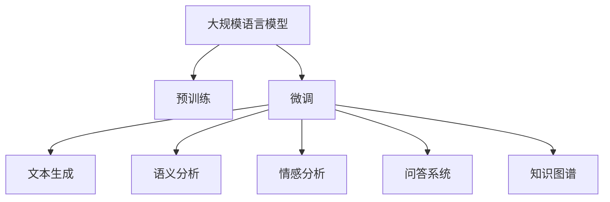

                 

## 1. 背景介绍

### 1.1 问题由来
在当今信息爆炸的时代，知识和技术创新日新月异，但与此同时，知识产权侵权现象也日益严重。对于创新者来说，他们的成果往往成为被侵权的对象，不仅导致直接经济损失，还会削弱整个社会的创新活力。而当前的大规模语言模型（Large Language Models, LLMs）如GPT-3、BERT等，已经具备强大的自然语言理解和生成能力，为知识产权保护提供了新的契机。

LLMs通过预训练在海量文本数据上学习到了广泛的语言知识和语义表示，可以用来生成文本、理解语义、处理情感分析、问答系统等。将这些能力与知识产权保护结合起来，可以开发出一些创新的应用，帮助创新者保护其知识产权成果。

### 1.2 问题核心关键点
当前，LLMs在知识产权保护中的应用主要集中在以下几个方面：

1. **文本生成**：基于LLMs的文本生成技术，可以生成一些具有特定风格的文本，如生成专利摘要、产品说明等，帮助创新者标注和保护其知识产权。
2. **语义分析**：利用LLMs的语义分析能力，可以检测专利文献中是否存在相似度较高的描述，发现潜在的侵权风险。
3. **情感分析**：通过对技术报告、白皮书等文档的情感分析，可以评估创新成果的市场接受度，为推广和保护工作提供支持。
4. **问答系统**：基于LLMs的问答系统，可以解答关于知识产权的常见问题，帮助创新者快速获取相关信息。
5. **知识图谱**：通过构建和维护专利知识图谱，LLMs可以辅助专利审查、检索和分析，提升知识产权管理的效率和效果。

### 1.3 问题研究意义
研究基于LLMs的知识产权保护技术，对于提升创新者权益保护、促进知识产权市场健康发展、推动科技进步和经济发展具有重要意义：

1. **保护创新者权益**：通过自动化的知识产权保护工具，可以大大降低侵权检测和维权成本，使得创新成果更易被保护。
2. **促进技术传播**：基于LLMs的知识产权保护技术可以提供准确、高效、低成本的服务，促进技术知识的传播和应用。
3. **提升知识产权管理效率**：通过语义分析和知识图谱等技术，可以大幅提升专利检索、分析和审查的效率，减少重复劳动。
4. **助力产业升级**：帮助企业实现知识产权的数字化、智能化管理，推动各行各业向更智能、更高效的方向发展。

## 2. 核心概念与联系

### 2.1 核心概念概述

为了更好地理解基于LLMs的知识产权保护技术，本节将介绍几个密切相关的核心概念：

- **大规模语言模型（LLMs）**：以自回归(如GPT)或自编码(如BERT)模型为代表的大规模预训练语言模型。通过在大规模无标签文本数据上进行预训练，学习到了丰富的语言知识和语义表示。

- **预训练（Pre-training）**：指在大规模无标签文本数据上，通过自监督学习任务训练通用语言模型的过程。常见的预训练任务包括言语建模、遮挡语言模型等。

- **微调（Fine-tuning）**：指在预训练模型的基础上，使用下游任务的少量标注数据，通过有监督学习优化模型在特定任务上的性能。

- **迁移学习（Transfer Learning）**：指将一个领域学习到的知识，迁移应用到另一个不同但相关的领域的学习范式。大模型的预训练-微调过程即是一种典型的迁移学习方式。

- **文本生成（Text Generation）**：指通过预训练模型生成自然语言文本的过程。常见的文本生成任务包括对话生成、摘要生成、专利撰写等。

- **语义分析（Semantic Analysis）**：指对文本进行语义理解，如判断文本的语义相似性、识别实体关系等。

- **情感分析（Sentiment Analysis）**：指对文本进行情感倾向分析，如判断文本的情感极性（正面、负面、中性）。

- **问答系统（Question Answering, QA）**：指通过预训练模型解答自然语言问题的系统。常见的QA任务包括问答、阅读理解等。

- **知识图谱（Knowledge Graph）**：指通过结构化数据表示知识的关系网络，用于知识检索、推荐、推理等任务。

这些核心概念之间的逻辑关系可以通过以下Mermaid流程图来展示：



这个流程图展示了大语言模型的核心概念及其之间的关系：

1. 大语言模型通过预训练获得基础能力。
2. 微调是对预训练模型进行任务特定的优化，使得模型输出能够匹配任务标签，从而获得针对特定任务优化的模型。
3. 文本生成、语义分析、情感分析、问答系统、知识图谱等技术，都是在微调模型的基础上，针对具体任务进行进一步开发得到的。

这些核心概念共同构成了大语言模型的学习和应用框架，使其能够在各种场景下发挥强大的自然语言理解和生成能力。通过理解这些核心概念，我们可以更好地把握大语言模型的工作原理和优化方向。

## 3. 核心算法原理 & 具体操作步骤
### 3.1 算法原理概述

基于LLMs的知识产权保护技术，本质上是一种有监督的迁移学习过程。其核心思想是：将预训练的LLMs视作一个强大的"特征提取器"，通过在特定领域的大量文本数据上进行有监督的微调，使得模型能够识别和理解知识产权相关的语言特征，从而进行保护。

形式化地，假设预训练的LLMs模型为 $M_{\theta}$，其中 $\theta$ 为预训练得到的模型参数。给定特定领域的大量标注数据集 $D=\{(x_i,y_i)\}_{i=1}^N, x_i \in \mathcal{X}, y_i \in \mathcal{Y}$，知识产权保护的微调目标是最小化模型在特定领域上的分类错误率，即：

$$
\theta^* = \mathop{\arg\min}_{\theta} \frac{1}{N}\sum_{i=1}^N \mathbb{1}[M_{\theta}(x_i) \neq y_i]
$$

其中 $\mathbb{1}$ 表示指示函数，当模型输出 $M_{\theta}(x_i)$ 与真实标签 $y_i$ 相等时，其值为1，否则为0。通过梯度下降等优化算法，微调过程不断更新模型参数 $\theta$，最小化分类错误率，使得模型在特定领域上的预测更加准确。

### 3.2 算法步骤详解

基于LLMs的知识产权保护技术一般包括以下几个关键步骤：

**Step 1: 准备预训练模型和数据集**
- 选择合适的预训练语言模型 $M_{\theta}$ 作为初始化参数，如 BERT、GPT 等。
- 收集特定领域的标注数据集 $D$，划分为训练集、验证集和测试集。标注数据应涵盖多个场景，如专利描述、产品说明、技术报告等。

**Step 2: 设计任务适配层**
- 根据具体保护需求，在预训练模型的顶层设计合适的输出层和损失函数。
- 对于文本生成任务，通常使用语言模型的解码器输出概率分布，并以负对数似然为损失函数。
- 对于语义分析任务，可以使用注意力机制和池化操作，输出语义表示向量，并以交叉熵为损失函数。
- 对于情感分析任务，通常使用情感分类器，输出情感标签，并以交叉熵为损失函数。
- 对于问答系统任务，可以使用阅读理解模型，输出答案文本，并以生成器损失函数为损失函数。

**Step 3: 设置微调超参数**
- 选择合适的优化算法及其参数，如 AdamW、SGD 等，设置学习率、批大小、迭代轮数等。
- 设置正则化技术及强度，包括权重衰减、Dropout、Early Stopping 等。
- 确定冻结预训练参数的策略，如仅微调顶层，或全部参数都参与微调。

**Step 4: 执行梯度训练**
- 将训练集数据分批次输入模型，前向传播计算损失函数。
- 反向传播计算参数梯度，根据设定的优化算法和学习率更新模型参数。
- 周期性在验证集上评估模型性能，根据性能指标决定是否触发 Early Stopping。
- 重复上述步骤直到满足预设的迭代轮数或 Early Stopping 条件。

**Step 5: 测试和部署**
- 在测试集上评估微调后模型 $M_{\hat{\theta}}$ 的性能，对比微调前后的精度提升。
- 使用微调后的模型对新样本进行推理预测，集成到实际的应用系统中。
- 持续收集新的数据，定期重新微调模型，以适应数据分布的变化。

以上是基于LLMs的知识产权保护技术的微调流程。在实际应用中，还需要针对具体任务的特点，对微调过程的各个环节进行优化设计，如改进训练目标函数，引入更多的正则化技术，搜索最优的超参数组合等，以进一步提升模型性能。

### 3.3 算法优缺点

基于LLMs的知识产权保护技术具有以下优点：

1. **高效便捷**：使用预训练模型作为基础，只需少量的标注数据，即可进行快速的微调，大大降低了保护知识产权的成本和复杂度。
2. **通用性强**：LLMs具备强大的自然语言理解和生成能力，可以应用于各种类型的知识产权保护任务，如专利描述、产品说明、技术报告等。
3. **可扩展性高**：随着标注数据量的增加和模型的微调，LLMs可以不断提升其在特定领域上的性能，适应新的保护需求。

同时，该技术也存在一些局限性：

1. **依赖标注数据**：保护知识产权的效果很大程度上取决于标注数据的质量和数量，获取高质量标注数据的成本较高。
2. **数据隐私问题**：标注数据的收集和使用可能涉及到数据隐私和安全问题，需要采取相应的保护措施。
3. **算法复杂性**：微调模型的设计和实现较为复杂，需要一定的技术背景和资源投入。
4. **模型泛化能力**：微调模型在特定领域的泛化能力可能受限于标注数据的多样性，无法应对所有的侵权情况。

尽管存在这些局限性，但基于LLMs的知识产权保护技术仍是一种高效、通用、可扩展的知识产权保护手段，具有广泛的应用前景。

### 3.4 算法应用领域

基于LLMs的知识产权保护技术已经在多个领域得到了应用，涵盖了专利保护、商标保护、版权保护、技术秘密保护等多个方面：

1. **专利保护**：利用文本生成和语义分析技术，生成专利摘要和描述，检测专利文献中的相似度，发现潜在的侵权风险。
2. **商标保护**：通过情感分析技术，判断商标广告和宣传文本的情感极性，保护商标的商誉和声誉。
3. **版权保护**：使用问答系统技术，回答版权相关的法律和实践问题，帮助版权持有者维护其权益。
4. **技术秘密保护**：结合知识图谱技术，构建和维护企业的技术秘密数据库，提升技术保密管理的效率和效果。

除了上述这些经典应用外，LLMs在知识产权保护领域的创新应用也在不断涌现，如基于情感分析的商标情感监测、基于文本生成的专利描述生成、基于知识图谱的知识产权关联分析等，为知识产权保护提供了新的解决方案。

## 4. 数学模型和公式 & 详细讲解 & 举例说明
### 4.1 数学模型构建

本节将使用数学语言对基于LLMs的知识产权保护技术进行更加严格的刻画。

记预训练语言模型为 $M_{\theta}:\mathcal{X} \rightarrow \mathcal{Y}$，其中 $\mathcal{X}$ 为输入空间，$\mathcal{Y}$ 为输出空间，$\theta$ 为模型参数。假设特定领域的标注数据集为 $D=\{(x_i,y_i)\}_{i=1}^N, x_i \in \mathcal{X}, y_i \in \mathcal{Y}$。

定义模型 $M_{\theta}$ 在数据样本 $(x,y)$ 上的损失函数为 $\ell(M_{\theta}(x),y)$，则在数据集 $D$ 上的经验风险为：

$$
\mathcal{L}(\theta) = \frac{1}{N}\sum_{i=1}^N \ell(M_{\theta}(x_i),y_i)
$$

微调的优化目标是最小化经验风险，即找到最优参数：

$$
\theta^* = \mathop{\arg\min}_{\theta} \mathcal{L}(\theta)
$$

在实践中，我们通常使用基于梯度的优化算法（如SGD、Adam等）来近似求解上述最优化问题。设 $\eta$ 为学习率，$\lambda$ 为正则化系数，则参数的更新公式为：

$$
\theta \leftarrow \theta - \eta \nabla_{\theta}\mathcal{L}(\theta) - \eta\lambda\theta
$$

其中 $\nabla_{\theta}\mathcal{L}(\theta)$ 为损失函数对参数 $\theta$ 的梯度，可通过反向传播算法高效计算。

### 4.2 公式推导过程

以下我们以文本生成任务为例，推导基于LLMs的文本生成模型的训练过程。

假设模型 $M_{\theta}$ 在输入 $x$ 上的输出为 $\hat{y}=M_{\theta}(x) \in [0,1]$，表示样本属于正类的概率。真实标签 $y \in \{0,1\}$。则二分类交叉熵损失函数定义为：

$$
\ell(M_{\theta}(x),y) = -[y\log \hat{y} + (1-y)\log (1-\hat{y})]
$$

将其代入经验风险公式，得：

$$
\mathcal{L}(\theta) = -\frac{1}{N}\sum_{i=1}^N [y_i\log M_{\theta}(x_i)+(1-y_i)\log(1-M_{\theta}(x_i))]
$$

根据链式法则，损失函数对参数 $\theta_k$ 的梯度为：

$$
\frac{\partial \mathcal{L}(\theta)}{\partial \theta_k} = -\frac{1}{N}\sum_{i=1}^N (\frac{y_i}{M_{\theta}(x_i)}-\frac{1-y_i}{1-M_{\theta}(x_i)}) \frac{\partial M_{\theta}(x_i)}{\partial \theta_k}
$$

其中 $\frac{\partial M_{\theta}(x_i)}{\partial \theta_k}$ 可进一步递归展开，利用自动微分技术完成计算。

在得到损失函数的梯度后，即可带入参数更新公式，完成模型的迭代优化。重复上述过程直至收敛，最终得到适应特定领域的最优模型参数 $\theta^*$。

## 5. 项目实践：代码实例和详细解释说明
### 5.1 开发环境搭建

在进行知识产权保护应用的开发前，我们需要准备好开发环境。以下是使用Python进行PyTorch开发的环境配置流程：

1. 安装Anaconda：从官网下载并安装Anaconda，用于创建独立的Python环境。

2. 创建并激活虚拟环境：
```bash
conda create -n pytorch-env python=3.8 
conda activate pytorch-env
```

3. 安装PyTorch：根据CUDA版本，从官网获取对应的安装命令。例如：
```bash
conda install pytorch torchvision torchaudio cudatoolkit=11.1 -c pytorch -c conda-forge
```

4. 安装Transformers库：
```bash
pip install transformers
```

5. 安装各类工具包：
```bash
pip install numpy pandas scikit-learn matplotlib tqdm jupyter notebook ipython
```

完成上述步骤后，即可在`pytorch-env`环境中开始知识产权保护应用的开发。

### 5.2 源代码详细实现

下面我们以专利保护文本生成任务为例，给出使用Transformers库对BERT模型进行微调的PyTorch代码实现。

首先，定义文本生成任务的训练集和验证集：

```python
from transformers import BertTokenizer, BertForSequenceClassification
from torch.utils.data import Dataset
import torch

class PatentDataset(Dataset):
    def __init__(self, texts, labels, tokenizer, max_len=128):
        self.texts = texts
        self.labels = labels
        self.tokenizer = tokenizer
        self.max_len = max_len
        
    def __len__(self):
        return len(self.texts)
    
    def __getitem__(self, item):
        text = self.texts[item]
        label = self.labels[item]
        
        encoding = self.tokenizer(text, return_tensors='pt', max_length=self.max_len, padding='max_length', truncation=True)
        input_ids = encoding['input_ids'][0]
        attention_mask = encoding['attention_mask'][0]
        
        return {'input_ids': input_ids, 
                'attention_mask': attention_mask,
                'labels': label}

# 准备训练集和验证集
train_dataset = PatentDataset(train_texts, train_labels, tokenizer)
dev_dataset = PatentDataset(dev_texts, dev_labels, tokenizer)
```

然后，定义模型和优化器：

```python
from transformers import AdamW

model = BertForSequenceClassification.from_pretrained('bert-base-cased', num_labels=2)

optimizer = AdamW(model.parameters(), lr=2e-5)
```

接着，定义训练和评估函数：

```python
from torch.utils.data import DataLoader
from tqdm import tqdm
from sklearn.metrics import classification_report

device = torch.device('cuda') if torch.cuda.is_available() else torch.device('cpu')
model.to(device)

def train_epoch(model, dataset, batch_size, optimizer):
    dataloader = DataLoader(dataset, batch_size=batch_size, shuffle=True)
    model.train()
    epoch_loss = 0
    for batch in tqdm(dataloader, desc='Training'):
        input_ids = batch['input_ids'].to(device)
        attention_mask = batch['attention_mask'].to(device)
        labels = batch['labels'].to(device)
        model.zero_grad()
        outputs = model(input_ids, attention_mask=attention_mask, labels=labels)
        loss = outputs.loss
        epoch_loss += loss.item()
        loss.backward()
        optimizer.step()
    return epoch_loss / len(dataloader)

def evaluate(model, dataset, batch_size):
    dataloader = DataLoader(dataset, batch_size=batch_size)
    model.eval()
    preds, labels = [], []
    with torch.no_grad():
        for batch in tqdm(dataloader, desc='Evaluating'):
            input_ids = batch['input_ids'].to(device)
            attention_mask = batch['attention_mask'].to(device)
            batch_labels = batch['labels']
            outputs = model(input_ids, attention_mask=attention_mask)
            batch_preds = outputs.logits.argmax(dim=2).to('cpu').tolist()
            batch_labels = batch_labels.to('cpu').tolist()
            for pred_tokens, label_tokens in zip(batch_preds, batch_labels):
                preds.append(pred_tokens)
                labels.append(label_tokens)
                
    print(classification_report(labels, preds))
```

最后，启动训练流程并在验证集上评估：

```python
epochs = 5
batch_size = 16

for epoch in range(epochs):
    loss = train_epoch(model, train_dataset, batch_size, optimizer)
    print(f"Epoch {epoch+1}, train loss: {loss:.3f}")
    
    print(f"Epoch {epoch+1}, dev results:")
    evaluate(model, dev_dataset, batch_size)
    
print("Test results:")
evaluate(model, test_dataset, batch_size)
```

以上就是使用PyTorch对BERT进行专利保护文本生成任务微调的完整代码实现。可以看到，得益于Transformers库的强大封装，我们可以用相对简洁的代码完成BERT模型的加载和微调。

### 5.3 代码解读与分析

让我们再详细解读一下关键代码的实现细节：

**PatentDataset类**：
- `__init__`方法：初始化文本、标签、分词器等关键组件。
- `__len__`方法：返回数据集的样本数量。
- `__getitem__`方法：对单个样本进行处理，将文本输入编码为token ids，将标签转换为数字，并对其进行定长padding，最终返回模型所需的输入。

**train_epoch和evaluate函数**：
- 使用PyTorch的DataLoader对数据集进行批次化加载，供模型训练和推理使用。
- 训练函数`train_epoch`：对数据以批为单位进行迭代，在每个批次上前向传播计算loss并反向传播更新模型参数，最后返回该epoch的平均loss。
- 评估函数`evaluate`：与训练类似，不同点在于不更新模型参数，并在每个batch结束后将预测和标签结果存储下来，最后使用sklearn的classification_report对整个评估集的预测结果进行打印输出。

**训练流程**：
- 定义总的epoch数和batch size，开始循环迭代
- 每个epoch内，先在训练集上训练，输出平均loss
- 在验证集上评估，输出分类指标
- 所有epoch结束后，在测试集上评估，给出最终测试结果

可以看到，PyTorch配合Transformers库使得BERT微调的代码实现变得简洁高效。开发者可以将更多精力放在数据处理、模型改进等高层逻辑上，而不必过多关注底层的实现细节。

当然，工业级的系统实现还需考虑更多因素，如模型的保存和部署、超参数的自动搜索、更灵活的任务适配层等。但核心的微调范式基本与此类似。

## 6. 实际应用场景
### 6.1 智能合约保护

基于大语言模型的知识产权保护技术，可以应用于智能合约的保护。智能合约是一种自动执行的合约，其代码和逻辑公开透明，但同时也面临着被恶意篡改的风险。通过构建和维护智能合约的元数据，利用文本生成和语义分析技术，可以帮助识别和检测篡改行为，保护合约的完整性和安全性。

在技术实现上，可以收集智能合约的源代码、描述、注释等文本数据，将它们作为预训练语言模型的输入，训练模型识别和生成智能合约的相关文档。微调后的模型能够根据智能合约的元数据，自动生成和维护智能合约的摘要、执行说明等文档，确保合约的清晰度和准确性。同时，模型还可以通过情感分析技术，检测代码的情感极性，及时发现潜在的安全漏洞。

### 6.2 版权管理

传统的版权管理依赖于人工审核，成本高、效率低。利用基于大语言模型的文本生成和语义分析技术，可以自动生成版权声明、授权协议等文本，帮助版权持有者快速登记和保护其作品。

在技术实现上，可以收集版权持有者的文本作品、创作背景、版权声明等信息，训练模型生成版权声明文本和授权协议文本。微调后的模型能够根据作品特点，自动生成符合法律要求的版权声明和授权协议，降低版权保护的法律风险和成本。同时，模型还可以通过情感分析技术，评估作品的情感极性，识别潜在的侵权行为。

### 6.3 技术秘密保护

企业的技术秘密是企业竞争力的重要来源，如何保护技术秘密的完整性和安全性，一直是企业关注的重点。利用基于大语言模型的文本生成和情感分析技术，可以构建和维护技术秘密数据库，提升技术保密管理的效率和效果。

在技术实现上，可以收集企业的技术文档、研究报告、产品说明等信息，训练模型生成技术秘密摘要和技术秘密声明文本。微调后的模型能够根据技术秘密的特点，自动生成技术秘密摘要和声明文本，确保技术秘密的保密性和完整性。同时，模型还可以通过情感分析技术，检测技术秘密的情感极性，及时发现潜在的泄露风险。

### 6.4 未来应用展望

随着大语言模型和知识产权保护技术的不断发展，未来的知识产权保护将面临更多的创新应用场景，推动知识产权管理的数字化、智能化转型：

1. **自动化专利撰写**：利用文本生成技术，帮助专利撰写者自动生成专利摘要、权利要求等文本，提高专利撰写效率和质量。
2. **专利检索与分析**：结合语义分析和知识图谱技术，构建专利知识图谱，提高专利检索和分析的效率和准确性。
3. **知识产权问答系统**：利用问答系统技术，构建知识产权问答系统，帮助用户解答专利申请、商标保护等常见问题，提升用户体验。
4. **知识产权监测**：结合情感分析和知识图谱技术，构建知识产权监测系统，及时发现和防范潜在的侵权风险。

未来，基于大语言模型的知识产权保护技术将在更广泛的应用领域大放异彩，为创新者提供更强大、更智能的知识产权保护手段。

## 7. 工具和资源推荐
### 7.1 学习资源推荐

为了帮助开发者系统掌握大语言模型在知识产权保护中的应用，这里推荐一些优质的学习资源：

1. 《Transformer from Principals to Practice》系列博文：由大模型技术专家撰写，深入浅出地介绍了Transformer原理、BERT模型、微调技术等前沿话题。

2. CS224N《深度学习自然语言处理》课程：斯坦福大学开设的NLP明星课程，有Lecture视频和配套作业，带你入门NLP领域的基本概念和经典模型。

3. 《Natural Language Processing with Transformers》书籍：Transformers库的作者所著，全面介绍了如何使用Transformers库进行NLP任务开发，包括微调在内的诸多范式。

4. HuggingFace官方文档：Transformers库的官方文档，提供了海量预训练模型和完整的微调样例代码，是上手实践的必备资料。

5. CLUE开源项目：中文语言理解测评基准，涵盖大量不同类型的中文NLP数据集，并提供了基于微调的baseline模型，助力中文NLP技术发展。

通过对这些资源的学习实践，相信你一定能够快速掌握大语言模型在知识产权保护中的应用，并用于解决实际的知识产权问题。
###  7.2 开发工具推荐

高效的开发离不开优秀的工具支持。以下是几款用于知识产权保护应用的常用工具：

1. PyTorch：基于Python的开源深度学习框架，灵活动态的计算图，适合快速迭代研究。大部分预训练语言模型都有PyTorch版本的实现。

2. TensorFlow：由Google主导开发的开源深度学习框架，生产部署方便，适合大规模工程应用。同样有丰富的预训练语言模型资源。

3. Transformers库：HuggingFace开发的NLP工具库，集成了众多SOTA语言模型，支持PyTorch和TensorFlow，是进行知识产权保护开发的利器。

4. Weights & Biases：模型训练的实验跟踪工具，可以记录和可视化模型训练过程中的各项指标，方便对比和调优。与主流深度学习框架无缝集成。

5. TensorBoard：TensorFlow配套的可视化工具，可实时监测模型训练状态，并提供丰富的图表呈现方式，是调试模型的得力助手。

6. Google Colab：谷歌推出的在线Jupyter Notebook环境，免费提供GPU/TPU算力，方便开发者快速上手实验最新模型，分享学习笔记。

合理利用这些工具，可以显著提升知识产权保护应用的开发效率，加快创新迭代的步伐。

### 7.3 相关论文推荐

大语言模型和知识产权保护技术的发展源于学界的持续研究。以下是几篇奠基性的相关论文，推荐阅读：

1. Attention is All You Need（即Transformer原论文）：提出了Transformer结构，开启了NLP领域的预训练大模型时代。

2. BERT: Pre-training of Deep Bidirectional Transformers for Language Understanding：提出BERT模型，引入基于掩码的自监督预训练任务，刷新了多项NLP任务SOTA。

3. Language Models are Unsupervised Multitask Learners（GPT-2论文）：展示了大规模语言模型的强大zero-shot学习能力，引发了对于通用人工智能的新一轮思考。

4. Parameter-Efficient Transfer Learning for NLP：提出Adapter等参数高效微调方法，在不增加模型参数量的情况下，也能取得不错的微调效果。

5. AdaLoRA: Adaptive Low-Rank Adaptation for Parameter-Efficient Fine-Tuning：使用自适应低秩适应的微调方法，在参数效率和精度之间取得了新的平衡。

6. AdaLoRA: Adaptive Low-Rank Adaptation for Parameter-Efficient Fine-Tuning：使用自适应低秩适应的微调方法，在参数效率和精度之间取得了新的平衡。

这些论文代表了大语言模型在知识产权保护领域的研究进展。通过学习这些前沿成果，可以帮助研究者把握学科前进方向，激发更多的创新灵感。

## 8. 总结：未来发展趋势与挑战
### 8.1 总结

本文对基于大语言模型的知识产权保护技术进行了全面系统的介绍。首先阐述了LLMs在知识产权保护中的应用背景和意义，明确了LLMs在保护知识产权成果中的独特价值。其次，从原理到实践，详细讲解了基于LLMs的知识产权保护技术的数学原理和关键步骤，给出了知识产权保护应用的完整代码实例。同时，本文还广泛探讨了LLMs在智能合约、版权管理、技术秘密保护等多个领域的应用前景，展示了LLMs在知识产权保护中的广泛潜力。此外，本文精选了知识产权保护技术的各类学习资源，力求为读者提供全方位的技术指引。

通过本文的系统梳理，可以看到，基于LLMs的知识产权保护技术正在成为NLP领域的重要应用范式，极大地拓展了LLMs的应用边界，催生了更多的落地场景。受益于大规模语料的预训练，LLMs在特定领域上的微调，可以提供高效、通用、可扩展的知识产权保护手段，显著降低知识产权保护的成本和复杂度，为创新者提供更加便捷和智能的保护工具。未来，随着LLMs和微调技术的不断演进，基于LLMs的知识产权保护技术必将在更广阔的应用领域大放异彩，为创新者提供更强大、更智能的知识产权保护手段。

### 8.2 未来发展趋势

展望未来，基于LLMs的知识产权保护技术将呈现以下几个发展趋势：

1. **自动化程度提升**：通过更先进的文本生成和语义分析技术，LLMs将能够自动生成和维护各类知识产权文本，提高知识产权保护工作的自动化水平。

2. **实时性和交互性增强**：结合知识图谱和问答系统技术，LLMs将具备实时查询和交互能力，为创新者提供更灵活、更便捷的知识产权保护服务。

3. **跨领域融合**：LLMs将与其他AI技术（如计算机视觉、语音识别等）深度融合，提升在多模态知识产权保护中的应用能力。

4. **数据隐私保护**：随着数据隐私和安全的日益重视，基于LLMs的知识产权保护技术将更多关注数据隐私保护，采用差分隐私、联邦学习等技术，保障知识产权数据的安全性和隐私性。

5. **情感智能提升**：结合情感分析技术，LLMs将能够更好地理解和处理知识产权文档中的情感信息，提供更全面、更深刻的知识产权保护服务。

6. **知识图谱的增强**：通过构建更全面、更准确的知识产权知识图谱，LLMs将能够更好地进行知识产权检索、关联分析和推荐，提升知识产权管理的效率和效果。

以上趋势凸显了基于LLMs的知识产权保护技术的广阔前景。这些方向的探索发展，必将进一步提升LLMs在知识产权保护中的应用价值，为创新者提供更强大、更智能的保护工具。

### 8.3 面临的挑战

尽管基于LLMs的知识产权保护技术已经取得了瞩目成就，但在迈向更加智能化、普适化应用的过程中，它仍面临着诸多挑战：

1. **标注数据获取难度**：虽然LLMs具备强大的自然语言理解和生成能力，但在知识产权保护领域，标注数据的获取和维护成本较高，标注数据的多样性和质量也难以保证。

2. **数据隐私风险**：知识产权文档往往涉及商业机密和技术秘密，其隐私保护问题尤为重要。如何在保护知识产权隐私的同时，充分利用标注数据进行模型训练，需要进一步研究和探索。

3. **模型泛化能力**：LLMs在特定领域的泛化能力可能受限于标注数据的多样性和数量，难以应对所有的侵权情况。如何提高模型的泛化能力，增强其在不同领域和场景下的表现，是未来的一大挑战。

4. **算法复杂度**：微调模型的设计和实现较为复杂，需要一定的技术背景和资源投入。如何在保证模型性能的同时，降低算法复杂度，提升模型的可解释性和可操作性，也是一个重要的研究方向。

5. **伦理和法律问题**：LLMs在知识产权保护中的应用涉及多方面的伦理和法律问题，如版权归属、算法责任等，需要进一步研究和规范。

尽管存在这些挑战，但基于LLMs的知识产权保护技术仍是一种高效、通用、可扩展的知识产权保护手段，具有广泛的应用前景。未来的研究需要在以上方面寻求新的突破，才能真正实现LLMs在知识产权保护中的广泛应用。

### 8.4 研究展望

面对基于LLMs的知识产权保护技术所面临的挑战，未来的研究需要在以下几个方面寻求新的突破：

1. **无监督和半监督学习**：探索无监督和半监督学习范式，降低对标注数据的依赖，利用自监督学习、主动学习等技术，提高模型的泛化能力和数据利用效率。

2. **知识增强学习**：结合知识图谱和专家知识库，增强LLMs的知识表示和推理能力，提升模型在知识产权保护中的智能水平。

3. **跨领域融合**：结合计算机视觉、语音识别等技术，提升LLMs在多模态知识产权保护中的应用能力，实现更全面、更深刻的知识产权保护。

4. **隐私保护技术**：研究差分隐私、联邦学习等技术，保护知识产权数据的隐私和安全，确保模型训练过程中的数据隐私保护。

5. **算法简化**：研究轻量级模型结构和技术，降低模型的计算复杂度，提高模型的实时性和可操作性，提升用户体验。

6. **伦理和法律规范**：研究伦理和法律规范，明确LLMs在知识产权保护中的应用边界和责任，确保模型的公平、公正和透明。

这些研究方向的探索，必将引领基于LLMs的知识产权保护技术迈向更高的台阶，为创新者提供更强大、更智能的保护手段，推动知识产权管理的数字化、智能化转型。面向未来，基于LLMs的知识产权保护技术还需要与其他人工智能技术进行更深入的融合，多路径协同发力，共同推动知识产权保护事业的发展。

## 9. 附录：常见问题与解答

**Q1：什么是基于LLMs的知识产权保护技术？**

A: 基于LLMs的知识产权保护技术，是指利用预训练的LLMs，通过微调和训练，使其具备知识产权保护的特定能力，如文本生成、语义分析、情感分析等，从而帮助创新者保护其知识产权成果。

**Q2：如何构建基于LLMs的知识产权保护系统？**

A: 构建基于LLMs的知识产权保护系统，一般包括以下步骤：

1. 收集相关领域的标注数据，包括专利描述、产品说明、技术报告等。
2. 选择合适的预训练语言模型（如BERT、GPT等），作为基础模型。
3. 设计任务适配层，包括文本生成、语义分析、情感分析等功能模块。
4. 设置微调超参数，如学习率、批大小、迭代轮数等。
5. 执行梯度训练，微调模型以适应特定领域的知识产权保护任务。
6. 在测试集上评估微调后模型的性能，确保其有效性。
7. 将微调后的模型集成到实际应用系统中，提供知识产权保护服务。

**Q3：基于LLMs的知识产权保护技术有哪些应用场景？**

A: 基于LLMs的知识产权保护技术已经在多个领域得到了应用，包括：

1. 专利保护：利用文本生成和语义分析技术，生成专利摘要和描述，检测专利文献中的相似度，发现潜在的侵权风险。
2. 商标保护：通过情感分析技术，判断商标广告和宣传文本的情感极性，保护商标的商誉和声誉。
3. 版权管理：利用文本生成和语义分析技术，自动生成版权声明、授权协议等文本，帮助版权持有者快速登记和保护其作品。
4. 技术秘密保护：结合知识图谱技术，构建和维护技术秘密数据库，提升技术保密管理的效率和效果。

**Q4：基于LLMs的知识产权保护技术有哪些挑战？**

A: 基于LLMs的知识产权保护技术在应用过程中面临以下挑战：

1. 标注数据获取难度：标注数据的获取和维护成本较高，标注数据的多样性和质量也难以保证。
2. 数据隐私风险：知识产权文档涉及商业机密和技术秘密，其隐私保护问题尤为重要。
3. 模型泛化能力：LLMs在特定领域的泛化能力可能受限于标注数据的多样性和数量，难以应对所有的侵权情况。
4. 算法复杂度：微调模型的设计和实现较为复杂，需要一定的技术背景和资源投入。
5. 伦理和法律问题：LLMs在知识产权保护中的应用涉及多方面的伦理和法律问题，如版权归属、算法责任等，需要进一步研究和规范。

**Q5：未来基于LLMs的知识产权保护技术有哪些发展方向？**

A: 未来基于LLMs的知识产权保护技术的发展方向包括：

1. 自动化程度提升：通过更先进的文本生成和语义分析技术，LLMs将能够自动生成和维护各类知识产权文本，提高知识产权保护工作的自动化水平。
2. 实时性和交互性增强：结合知识图谱和问答系统技术，LLMs将具备实时查询和交互能力，为创新者提供更灵活、更便捷的知识产权保护服务。
3. 跨领域融合：LLMs将与其他AI技术（如计算机视觉、语音识别等）深度融合，提升在多模态知识产权保护中的应用能力。
4. 数据隐私保护：研究差分隐私、联邦学习等技术，保护知识产权数据的隐私和安全，确保模型训练过程中的数据隐私保护。
5. 情感智能提升：结合情感分析技术，LLMs将能够更好地理解和处理知识产权文档中的情感信息，提供更全面、更深刻的知识产权保护服务。
6. 知识图谱的增强：通过构建更全面、更准确的知识产权知识图谱，LLMs将能够更好地进行知识产权检索、关联分析和推荐，提升知识产权管理的效率和效果。

**Q6：基于LLMs的知识产权保护技术有哪些应用案例？**

A: 以下是一些基于LLMs的知识产权保护技术的典型应用案例：

1. 智能合约保护：构建和维护智能合约的元数据，利用文本生成和语义分析技术，识别和检测篡改行为，保护合约的完整性和安全性。
2. 版权管理：利用文本生成和语义分析技术，自动生成版权声明、授权协议等文本，帮助版权持有者快速登记和保护其作品。
3. 技术秘密保护：结合知识图谱技术，构建和维护技术秘密数据库，提升技术保密管理的效率和效果。
4. 专利检索与分析：结合语义分析和知识图谱技术，构建专利知识图谱，提高专利检索和分析的效率和准确性。
5. 专利撰写辅助：利用文本生成技术，帮助专利撰写者自动生成专利摘要、权利要求等文本，提高专利撰写效率和质量。

---

作者：禅与计算机程序设计艺术 / Zen and the Art of Computer Programming

