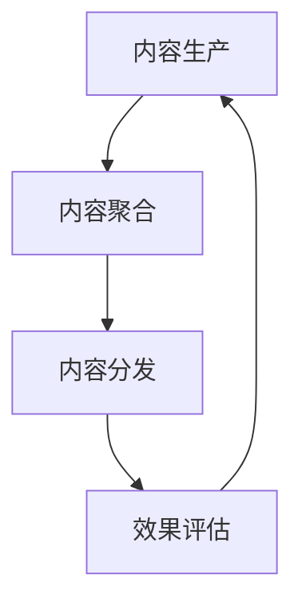

                 

# 知识付费创业中的内容营销矩阵搭建

## 1. 背景介绍

### 1.1 问题由来

近年来，知识付费行业迅猛发展，内容质量和用户粘性成为核心竞争力。内容营销作为知识付费平台最重要的推广手段之一，其重要性不言而喻。然而，对于很多知识付费平台而言，内容营销并未达到预期效果。究其原因，一是内容质量和创作速度与用户需求匹配度不高，二是内容推广方式单一、缺乏系统策略。本文将从内容营销矩阵的搭建出发，探讨如何在知识付费创业中构建高效、精准、可持续的内容营销体系，以提升内容影响力和平台品牌价值。

### 1.2 问题核心关键点

内容营销矩阵的搭建主要包含两个核心方面：内容生产和内容推广。内容生产聚焦于高质量内容的创作和聚合，内容推广则关注内容的分发渠道和效果评估。通过构建内容生产和推广的双向循环，不仅能提升内容价值，还能优化推广策略，从而形成螺旋上升的内容营销闭环。

本文将围绕以下关键问题展开探讨：
- 如何构建高质量的内容生产体系？
- 如何设计多渠道的内容推广方案？
- 如何评估和优化内容营销的效果？

## 2. 核心概念与联系

### 2.1 核心概念概述

内容营销矩阵搭建涉及多个核心概念：

- **内容生产**：指从内容选题、创作、编辑到最终发布的整个流程。内容生产的核心是创造符合用户需求、具有较高价值的内容。
- **内容聚合**：指将同主题、同领域的内容进行归集，形成内容专题、内容系列等形式，提升内容深度和系统性。
- **内容分发**：指将内容通过合适的渠道推送给目标用户，以实现最大化的传播效果。内容分发需要考虑用户的使用场景和平台特性。
- **效果评估**：指通过数据分析、用户反馈等方式，评估内容推广效果，并根据评估结果优化内容策略。

这些概念之间相互关联，构成了一个完整的知识付费内容营销矩阵。内容生产是基础，内容聚合是提升，内容分发是手段，效果评估是反馈。

### 2.2 核心概念原理和架构的 Mermaid 流程图



该流程图展示了内容生产和内容分发之间的双向循环关系，其中内容聚合和效果评估作为中间环节，连接内容生产和内容分发，共同构建起内容营销矩阵的闭合回路。

## 3. 核心算法原理 & 具体操作步骤

### 3.1 算法原理概述

内容营销矩阵的搭建，本质上是将内容生产、内容聚合、内容分发和效果评估等环节有机整合，形成一个系统化、自动化、数据驱动的营销体系。该体系的核心是数据和算法，通过数据的实时收集、分析和反馈，不断优化内容生产和推广策略。

内容营销矩阵的算法原理主要包括：

- **内容推荐算法**：根据用户的历史行为数据和兴趣标签，推荐相关主题的内容。
- **效果评估算法**：利用统计学和机器学习模型，评估内容推广的效果，如阅读量、转化率等指标。
- **反馈优化算法**：根据内容推荐和效果评估的结果，动态调整内容策略和分发渠道。

### 3.2 算法步骤详解

#### 3.2.1 内容生产

**内容选题**：
- 基于用户调研和市场分析，确定热门主题和用户需求点。
- 使用数据挖掘技术，识别用户搜索热点和互动数据，筛选出潜在高价值主题。

**内容创作**：
- 组建内容团队，明确创作方向和标准，制定内容创作流程。
- 利用协同工具，提高创作效率，如Grammarly、Zotero等。

**内容编辑**：
- 引入专业编辑，审核内容质量，确保语言流畅、信息准确。
- 使用校对工具，如Grammarly、Ginger等，提升内容准确性。

**内容发布**：
- 选择合适的发布平台，如微信公众号、知乎、B站等。
- 使用工具自动推送，如IFTTT、Zapier等。

#### 3.2.2 内容聚合

**内容专题策划**：
- 根据内容主题，策划相关专题，提升内容深度和系统性。
- 使用工具如Evernote、Notion等，管理和维护内容专题。

**内容系列制作**：
- 将同主题内容进行系列化制作，形成课程、微课等形式。
- 使用工具如Adobe Premiere、Final Cut Pro等，制作视频内容。

**内容集锦制作**：
- 将优质内容进行筛选和整理，形成集锦，方便用户查看。
- 使用工具如InDesign、Canva等，制作内容集锦。

#### 3.2.3 内容分发

**多渠道分发**：
- 选择合适的分发渠道，如搜索引擎、社交媒体、邮件等。
- 使用工具如Hootsuite、Buffer等，自动化管理和发布内容。

**用户互动**：
- 与用户进行互动，收集用户反馈和建议。
- 使用工具如Slack、Discord等，建立用户社群。

**数据分析**：
- 实时监控内容数据，如阅读量、转化率等。
- 使用工具如Google Analytics、Mixpanel等，进行数据分析。

#### 3.2.4 效果评估

**效果指标设定**：
- 设定关键绩效指标(KPI)，如阅读量、转化率、用户留存率等。
- 根据业务目标，确定评估标准和权重。

**效果分析**：
- 使用统计学方法，分析数据，评估内容推广效果。
- 使用机器学习模型，进行预测和优化。

**优化策略**：
- 根据效果评估结果，调整内容策略和分发渠道。
- 引入A/B测试，对比不同策略的效果，进行优化选择。

### 3.3 算法优缺点

内容营销矩阵的优势在于系统化和数据驱动，能够有效提升内容质量和用户粘性。具体优点包括：

- **高效内容生产**：通过数据驱动，减少内容创作的盲目性，提升内容生产效率。
- **精准内容分发**：基于用户行为数据，实现个性化推荐，提高内容到达率。
- **持续优化提升**：通过效果评估和反馈优化，不断改进内容策略，保持竞争优势。

然而，内容营销矩阵也存在一些缺点：

- **初期投入高**：搭建内容营销矩阵需要大量人力、物力和财力投入。
- **数据隐私问题**：收集用户行为数据可能涉及隐私保护问题，需严格遵守法律法规。
- **复杂度较高**：内容营销矩阵涉及多个环节和工具，需要高水平的管理和技术支持。

### 3.4 算法应用领域

内容营销矩阵在知识付费创业中的应用主要体现在以下几个方面：

- **内容推荐系统**：提升用户阅读体验和留存率，增加平台粘性。
- **课程销售转化**：通过内容推广，提升课程购买转化率，实现商业价值。
- **用户社区建设**：通过互动和反馈，增强用户粘性和忠诚度。
- **品牌影响提升**：通过高质量内容发布，提升品牌知名度和美誉度。

## 4. 数学模型和公式 & 详细讲解

### 4.1 数学模型构建

内容营销矩阵的数学模型主要包括内容推荐、效果评估和反馈优化三个部分。

- **内容推荐模型**：利用协同过滤、基于内容的推荐算法，推荐相关内容。
- **效果评估模型**：基于统计学和机器学习模型，评估内容推广效果。
- **反馈优化模型**：利用强化学习算法，根据用户行为和反馈，动态调整内容策略和分发渠道。

### 4.2 公式推导过程

以内容推荐算法为例，假设用户数据矩阵为 $U \times N$，内容数据矩阵为 $I \times N$，其中 $U$ 为用户数，$I$ 为内容数，$N$ 为特征维度。推荐模型可表示为：

$$
\hat{R}_{ui} = \alpha \frac{1}{\sqrt{1+\sum_j u_{uj}^2}}\sum_j k_{uj}k_{vi}
$$

其中，$\alpha$ 为调节因子，$k_{uj}$ 为用户的第 $j$ 个特征值，$k_{vi}$ 为内容的第 $j$ 个特征值。通过计算用户与内容的相似度，推荐相关内容。

### 4.3 案例分析与讲解

**案例背景**：某知识付费平台想要提升内容推荐效果，决定搭建内容营销矩阵。

**实现步骤**：
1. **数据收集**：收集用户行为数据和内容数据，如阅读记录、评论、分享等。
2. **模型训练**：使用协同过滤算法，训练推荐模型，生成推荐列表。
3. **内容分发**：将推荐内容推送给用户，并收集用户反馈。
4. **效果评估**：分析用户反馈数据，优化推荐模型和分发策略。

通过以上步骤，平台能够实现个性化内容推荐，提升用户阅读体验和平台粘性。

## 5. 项目实践：代码实例和详细解释说明

### 5.1 开发环境搭建

#### 5.1.1 环境配置

- **Python环境**：安装Python 3.7以上版本，并配置pip、conda等包管理工具。
- **开发工具**：使用Jupyter Notebook、PyCharm等开发工具，提高代码编写和调试效率。
- **数据管理**：使用SQLite、PostgreSQL等数据库，管理用户行为和内容数据。

#### 5.1.2 包依赖安装

- **推荐算法**：安装scikit-learn、TensorFlow等机器学习库。
- **数据分析**：安装pandas、numpy等数据处理库。
- **可视化工具**：安装matplotlib、seaborn等数据可视化库。

### 5.2 源代码详细实现

**推荐系统代码实现**

```python
from sklearn.neighbors import NearestNeighbors
import pandas as pd
import numpy as np

# 数据准备
df = pd.read_csv('user_behavior.csv')
content_df = pd.read_csv('content_data.csv')

# 用户-内容特征计算
user_feats = df[['read_time', 'like_count', 'share_count']].values
content_feats = content_df[['category', 'title', 'description']].values

# 推荐模型训练
nbrs = NearestNeighbors(n_neighbors=5, algorithm='brute')
nbrs.fit(content_feats)

# 推荐列表生成
user_ids = df['user_id'].values
recommendations = []
for user in user_ids:
    user_feats = user_feats[user_ids == user]
    user_feats = np.expand_dims(user_feats, axis=0)
    distances, indices = nbrs.kneighbors(user_feats)
    content_ids = content_df.iloc[indices].index
    recommendations.append(content_ids)

# 数据写入
pd.DataFrame(recommendations, columns=['recommended_content_id']).to_csv('recommendations.csv', index=False)
```

**效果评估代码实现**

```python
from sklearn.metrics import precision_recall_curve, roc_auc_score

# 加载数据
df = pd.read_csv('recommendations.csv')
true_labels = df['is_clicked'].values
predictions = df['recommended_content_id'].values

# 计算ROC曲线
fpr, tpr, _ = precision_recall_curve(true_labels, predictions)
roc_auc = roc_auc_score(true_labels, predictions)
print(f'ROC AUC: {roc_auc}')
```

**反馈优化代码实现**

```python
from tensorflow.keras.models import Sequential
from tensorflow.keras.layers import Dense, Dropout, LSTM

# 模型构建
model = Sequential()
model.add(LSTM(128, input_shape=(max_len,)))
model.add(Dense(1, activation='sigmoid'))
model.compile(optimizer='adam', loss='binary_crossentropy', metrics=['accuracy'])

# 模型训练
model.fit(X_train, y_train, epochs=10, batch_size=32, validation_data=(X_test, y_test))

# 模型预测
y_pred = model.predict(X_val)
```

### 5.3 代码解读与分析

**推荐系统代码解读**

1. **数据预处理**：首先，从CSV文件中读取用户行为和内容数据，并进行初步清洗和特征提取。
2. **特征计算**：根据用户行为特征和内容特征，计算用户-内容的相似度。
3. **推荐列表生成**：利用K近邻算法，生成每个用户的推荐内容列表。
4. **数据写入**：将推荐内容列表写入CSV文件，方便后续评估。

**效果评估代码解读**

1. **数据加载**：从CSV文件中加载推荐内容和实际点击数据。
2. **ROC曲线计算**：使用precision_recall_curve函数，计算ROC曲线，并使用roc_auc_score函数，计算AUC值。
3. **结果输出**：输出ROC AUC值，评估推荐系统效果。

**反馈优化代码解读**

1. **模型构建**：构建基于LSTM的神经网络模型，用于预测用户是否点击推荐内容。
2. **模型训练**：使用训练数据对模型进行训练，并使用验证数据进行评估。
3. **模型预测**：使用训练好的模型对新数据进行预测。

## 6. 实际应用场景

### 6.1 智能内容推荐

智能内容推荐是内容营销矩阵的重要应用场景。通过推荐算法，平台能够根据用户历史行为和兴趣，推荐相关内容，提高用户阅读体验和平台粘性。

**实现方式**：
1. **数据收集**：收集用户浏览记录、点击行为等数据。
2. **推荐模型训练**：基于用户行为数据和内容数据，训练推荐模型。
3. **内容推荐**：将推荐内容推送给用户，并进行效果评估和优化。

### 6.2 课程销售转化

课程销售转化是知识付费平台的重要商业目标。通过内容营销矩阵，平台能够实现精准推广，提升课程销售转化率。

**实现方式**：
1. **数据收集**：收集用户购买记录、课程评分等数据。
2. **效果评估**：分析用户点击、购买等行为，评估课程推广效果。
3. **优化策略**：根据效果评估结果，优化课程推广策略，提升销售转化率。

### 6.3 用户社区建设

用户社区建设是内容营销矩阵的另一个重要应用场景。通过社区互动，平台能够增强用户粘性和忠诚度，提升用户活跃度和留存率。

**实现方式**：
1. **社区互动**：收集用户评论、反馈等互动数据。
2. **效果评估**：分析用户社区活跃度和留存率，评估社区建设效果。
3. **优化策略**：根据效果评估结果，优化社区建设策略，增强用户粘性。

## 7. 工具和资源推荐

### 7.1 学习资源推荐

为了帮助开发者系统掌握内容营销矩阵的理论基础和实践技巧，这里推荐一些优质的学习资源：

1. **《内容营销矩阵：构建品牌与用户连接的新路径》**：由知名内容营销专家撰写，全面介绍了内容营销矩阵的概念、原理和实践方法。
2. **《数据驱动的内容营销》课程**：由知名在线教育平台开设的课程，涵盖内容推荐、效果评估、反馈优化等多个内容营销环节。
3. **《内容营销矩阵构建实战》书籍**：实战经验丰富的作者，通过丰富的案例和代码示例，深入浅出地介绍了内容营销矩阵的构建过程。
4. **HuggingFace官方文档**：Transformer库的官方文档，提供了丰富的推荐算法和效果评估工具。
5. **Google Analytics文档**：Google提供的网站数据分析工具，帮助平台实时监控和分析用户行为数据。

通过对这些资源的学习实践，相信你一定能够快速掌握内容营销矩阵的精髓，并用于解决实际的营销问题。

### 7.2 开发工具推荐

高效的开发离不开优秀的工具支持。以下是几款用于内容营销矩阵开发的常用工具：

1. **Python环境**：安装Python 3.7以上版本，并配置pip、conda等包管理工具。
2. **开发工具**：使用Jupyter Notebook、PyCharm等开发工具，提高代码编写和调试效率。
3. **数据管理**：使用SQLite、PostgreSQL等数据库，管理用户行为和内容数据。
4. **可视化工具**：安装matplotlib、seaborn等数据可视化库。
5. **推荐算法库**：安装scikit-learn、TensorFlow等机器学习库。

合理利用这些工具，可以显著提升内容营销矩阵的开发效率，加快创新迭代的步伐。

### 7.3 相关论文推荐

内容营销矩阵的发展离不开学界的持续研究。以下是几篇奠基性的相关论文，推荐阅读：

1. **《内容推荐算法综述》**：综述了当前流行的内容推荐算法，包括协同过滤、基于内容的推荐、深度学习推荐等。
2. **《数据驱动的内容营销策略》**：探讨了如何利用数据驱动，实现内容营销的精准化和个性化。
3. **《内容营销矩阵优化研究》**：研究了如何通过优化内容营销矩阵，提升品牌影响力和用户粘性。
4. **《深度学习在内容推荐中的应用》**：探讨了深度学习在内容推荐中的应用，如CNN、RNN等。
5. **《内容营销矩阵的社会化网络分析》**：利用社会化网络分析，评估内容营销矩阵的效果，优化推荐策略。

这些论文代表了大规模内容营销矩阵的发展脉络。通过学习这些前沿成果，可以帮助研究者把握学科前进方向，激发更多的创新灵感。

## 8. 总结：未来发展趋势与挑战

### 8.1 研究成果总结

本文从内容营销矩阵的构建出发，探讨了知识付费创业中如何通过内容生产和内容推广，提升平台影响力和用户粘性。文章从内容选题、内容创作、内容聚合、内容分发、效果评估等多个环节进行了详细讲解，并提供了代码实例和详细解读。

### 8.2 未来发展趋势

内容营销矩阵的未来发展趋势主要体现在以下几个方面：

1. **智能化推荐**：随着AI技术的进步，内容推荐将更加智能化、个性化，能够实现精准推荐。
2. **数据驱动优化**：通过大数据和机器学习，实现内容营销策略的动态优化，提升效果。
3. **多渠道分发**：利用社交媒体、搜索引擎等多个渠道，实现内容的最大化传播。
4. **用户行为分析**：通过数据分析，深入理解用户行为，实现更精准的内容推广。

### 8.3 面临的挑战

尽管内容营销矩阵在知识付费创业中取得了显著成效，但在实施过程中仍面临一些挑战：

1. **内容生产效率**：内容生产的高效性和高质量仍需提升，以应对用户多样化的需求。
2. **数据隐私保护**：用户行为数据的收集和处理可能涉及隐私问题，需严格遵守法律法规。
3. **技术复杂度**：内容营销矩阵涉及多个环节和工具，需要高水平的管理和技术支持。
4. **市场竞争激烈**：知识付费行业竞争激烈，需要持续创新和优化，保持竞争优势。

### 8.4 研究展望

面对内容营销矩阵面临的挑战，未来的研究需要在以下几个方面寻求新的突破：

1. **自动化内容生成**：开发智能内容生成工具，减少内容创作的盲目性，提高生产效率。
2. **用户行为预测**：利用机器学习模型，预测用户行为，实现内容推荐的精准化。
3. **多渠道协同**：实现不同渠道内容的分发和整合，提升内容传播效果。
4. **隐私保护技术**：开发隐私保护技术，确保用户行为数据的合法使用。

这些研究方向的探索，将推动内容营销矩阵向更加智能化、个性化、高效化的方向发展，为知识付费平台提供更加优质的内容推广服务。

## 9. 附录：常见问题与解答

**Q1：如何构建高质量的内容生产体系？**

A: 构建高质量的内容生产体系，需要从以下几个方面入手：
1. **选题调研**：基于用户调研和市场分析，确定热门主题和用户需求点。
2. **创作团队**：组建内容团队，明确创作方向和标准，制定内容创作流程。
3. **协同工具**：利用协同工具，提高创作效率，如Grammarly、Zotero等。
4. **编辑审核**：引入专业编辑，审核内容质量，确保语言流畅、信息准确。

**Q2：如何设计多渠道的内容推广方案？**

A: 设计多渠道的内容推广方案，需要考虑以下几个关键点：
1. **渠道选择**：选择合适的分发渠道，如搜索引擎、社交媒体、邮件等。
2. **自动化管理**：使用工具如Hootsuite、Buffer等，自动化管理和发布内容。
3. **数据分析**：实时监控内容数据，如阅读量、转化率等。
4. **用户互动**：与用户进行互动，收集用户反馈和建议。

**Q3：如何评估和优化内容营销的效果？**

A: 评估和优化内容营销的效果，需要从以下几个方面入手：
1. **效果指标设定**：设定关键绩效指标(KPI)，如阅读量、转化率、用户留存率等。
2. **效果分析**：使用统计学方法，分析数据，评估内容推广效果。
3. **优化策略**：根据效果评估结果，调整内容策略和分发渠道。
4. **A/B测试**：引入A/B测试，对比不同策略的效果，进行优化选择。

通过这些方法，可以持续优化内容营销策略，提升平台影响力和用户粘性。

**Q4：如何处理内容推荐中的数据隐私问题？**

A: 处理内容推荐中的数据隐私问题，需要从以下几个方面入手：
1. **数据匿名化**：对用户行为数据进行匿名化处理，保护用户隐私。
2. **合规性**：严格遵守法律法规，确保数据收集和处理符合规定。
3. **用户同意**：在数据收集前，明确告知用户数据用途，并获得用户同意。
4. **安全措施**：采用数据加密、访问控制等措施，保护数据安全。

通过这些方法，可以确保内容推荐中的数据隐私问题得到有效处理，保护用户权益。

---

作者：禅与计算机程序设计艺术 / Zen and the Art of Computer Programming

