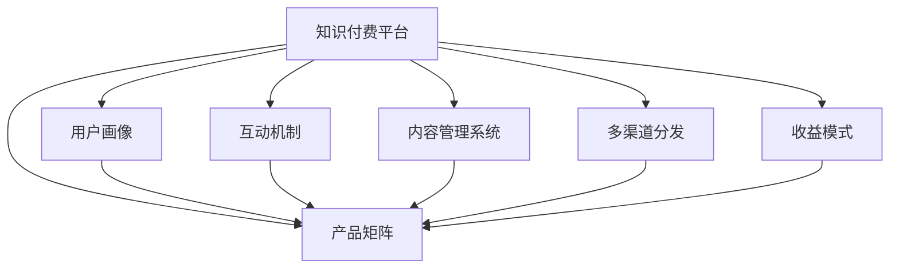

                 

## 1. 背景介绍

### 1.1 问题由来
随着数字化经济的快速发展，知识付费市场正在成为数字经济领域的热门焦点。知识付费，作为一种付费模式，让消费者在需要快速获取知识和技能时，可以通过付费获取高质量的资源，从而有效提升其工作与学习效率。然而，在知识付费市场的激烈竞争中，如何构建出具有差异化、系统化、持续化的产品矩阵，实现业务的长期稳健发展，成为所有知识付费创业公司的共同目标。

### 1.2 问题核心关键点
产品矩阵构建的核心在于将多元化、相互关联的知识产品通过合理的策略整合，形成具有协同效应的服务体系，满足用户多样化、高质量的需求。核心关键点包括：

1. **产品多元化**：产品种类需丰富多样，覆盖不同层次、不同领域的知识需求。
2. **用户需求精准**：深入理解用户实际需求，提供定制化的知识服务。
3. **互动体验提升**：加强互动性和反馈机制，增强用户体验。
4. **持续内容更新**：保持内容的实时更新和迭代，确保产品竞争力。
5. **多渠道布局**：拓宽产品分发渠道，增加用户接触点。
6. **收益模式多元化**：除了传统的订阅模式，还需开发更多元化的收益模式。

### 1.3 问题研究意义
构建合理的产品矩阵对知识付费创业公司具有重要意义：

1. **提升市场竞争力**：多元化、高质量的产品矩阵可以更好地满足用户需求，提升公司的市场竞争力。
2. **增强用户黏性**：精准定位用户需求，提升互动体验，增强用户对平台的粘性。
3. **拓宽盈利渠道**：多元化收益模式可以为公司提供更稳定的收入来源，降低市场风险。
4. **增强品牌影响力**：通过高质量的产品和服务，增强品牌形象，扩大市场影响力。
5. **促进持续创新**：产品矩阵的构建需要持续迭代和优化，有助于公司保持创新活力。

## 2. 核心概念与联系

### 2.1 核心概念概述

为了更好地理解产品矩阵的构建，本节将介绍几个核心概念：

1. **知识付费平台**：以用户为核心的知识付费平台，提供高质量、系统化的知识内容，满足用户的学习和职业发展需求。
2. **产品矩阵**：通过多维度、多层次的产品组合，形成具有协同效应的知识产品体系，满足用户多样化的需求。
3. **用户画像**：对目标用户进行多维度分析，形成详细的用户画像，帮助定制化服务。
4. **互动机制**：提供实时反馈和互动功能，提升用户体验。
5. **内容管理系统**：用于内容创建、审核、发布和管理的系统，保障内容质量。
6. **多渠道分发**：通过不同平台分发产品，扩大用户覆盖面。
7. **收益模式**：包括订阅、按需、广告、会员等多种收益模式，提升平台收益。

这些核心概念之间的逻辑关系可以通过以下Mermaid流程图来展示：



这个流程图展示了一些核心概念及其之间的关系：

1. 知识付费平台作为起点，构建产品矩阵。
2. 用户画像、互动机制、内容管理系统、多渠道分发、收益模式均是构建产品矩阵的基础元素。
3. 通过深入理解用户画像和设计良好的互动机制，可以更好地构建与用户需求相匹配的产品矩阵。
4. 内容管理系统保障内容的权威性和系统性，多渠道分发增加用户接触点，收益模式提供可持续的收入来源。

## 3. 核心算法原理 & 具体操作步骤
### 3.1 算法原理概述

产品矩阵构建的核心在于将不同的知识产品通过算法进行整合和推荐，形成具有协同效应的服务体系。其核心思想是：通过对用户行为和需求进行分析，将相类似的知识产品组成不同层次和类型的矩阵，并利用协同过滤、推荐系统等算法对用户进行个性化推荐。

形式化地，假设知识付费平台的产品集合为 $P=\{p_i\}_{i=1}^n$，用户集合为 $U=\{u_j\}_{j=1}^m$。平台对每个用户 $u_j$ 推荐的产品序列为 $A_{u_j}=\{p_{i_1}, p_{i_2}, ..., p_{i_k}\}$。平台的目标是最小化推荐结果与用户真实需求之间的差异，即：

$$
\min_{A_{u_j}} \sum_{j=1}^m \mathcal{L}(A_{u_j}, \hat{A}_{u_j})
$$

其中 $\mathcal{L}$ 为推荐误差损失函数，$\hat{A}_{u_j}$ 为预测的产品序列。

### 3.2 算法步骤详解

基于协同过滤的产品矩阵构建一般包括以下几个关键步骤：

**Step 1: 数据收集与预处理**
- 收集用户的浏览、购买、评分等行为数据，并进行清洗和标注。
- 使用数据增强技术，如数据合成、用户画像重构等，增加数据量。

**Step 2: 用户画像建模**
- 利用用户的行为数据、兴趣标签等，构建用户画像，形成用户特征向量。
- 使用聚类算法，如K-Means、LDA等，对用户进行分组，形成用户集群。

**Step 3: 产品嵌入表示**
- 利用向量化的方式表示产品，如通过TF-IDF、Word2Vec等方法，将产品转化为向量形式。
- 使用深度学习模型，如Word2Vec、Doc2Vec等，进一步增强产品向量的表征能力。

**Step 4: 协同过滤推荐**
- 构建用户-产品交互矩阵，计算用户和产品之间的相似度。
- 应用协同过滤算法，如基于用户相似度的协同过滤、基于物品相似度的协同过滤等，生成个性化推荐结果。
- 引入推荐算法优化策略，如召回率-准确率优化、梯度下降优化等。

**Step 5: 产品矩阵调整与优化**
- 通过用户反馈、点击率等指标，不断调整推荐结果，优化产品矩阵。
- 引入强化学习算法，如DQN、SARSA等，提升推荐模型的自适应能力。

### 3.3 算法优缺点

基于协同过滤的产品矩阵构建方法具有以下优点：
1. 简单易用：协同过滤方法计算简单，容易实现和调试。
2. 自适应性：能够实时根据用户行为和反馈调整推荐结果，提升用户体验。
3. 个性化推荐：通过协同过滤，可以提供更加个性化的推荐服务。

同时，该方法也存在一定的局限性：
1. 数据依赖性强：协同过滤依赖于用户行为数据，当数据量不足时，效果不佳。
2. 冷启动问题：新用户和老用户的数据量差距较大，新用户推荐效果不理想。
3. 易受攻击：协同过滤模型容易受到恶意攻击，如假用户行为数据的影响。
4. 泛化能力差：协同过滤模型在用户集群外部的泛化能力较弱。

尽管存在这些局限性，但就目前而言，协同过滤方法仍是大规模知识付费平台构建产品矩阵的主流方法。未来相关研究的重点在于如何进一步提升协同过滤方法的鲁棒性、泛化能力和个性化能力，同时兼顾模型复杂度和运行效率。

### 3.4 算法应用领域

基于协同过滤的产品矩阵构建方法在知识付费平台的应用十分广泛，包括但不限于以下几个领域：

1. **课程推荐**：基于用户过往学习行为和评分，推荐用户感兴趣的课程。
2. **资料推荐**：推荐与用户当前阅读、学习内容相关的书籍、文章等资料。
3. **会员权益**：根据用户会员等级，推荐高级权益，如VIP专属课程、会员专属资料等。
4. **互动社区**：推荐与用户兴趣相关的讨论话题、专家问答等社区内容。
5. **个性化订阅**：根据用户行为数据，推荐个性化订阅计划，提供定制化学习内容。
6. **内容生产者推荐**：推荐与用户兴趣相关的作者、讲师、内容生产者，提升用户粘性。
7. **营销活动推荐**：推荐与用户兴趣相关的营销活动，增加用户参与度和平台收益。

## 4. 数学模型和公式 & 详细讲解 & 举例说明

### 4.1 数学模型构建

假设用户 $u_j$ 对产品 $p_i$ 的评分表示为 $r_{i,j}$，产品嵌入表示为 $\mathbf{v}_i$，用户嵌入表示为 $\mathbf{u}_j$。协同过滤的目标是通过用户-产品评分矩阵 $R=\{r_{i,j}\}_{i,j=1}^{n,m}$，预测用户 $u_j$ 对未交互产品 $p_k$ 的评分 $r_{k,j}$。

通过矩阵分解技术，协同过滤可以表示为：

$$
\hat{r}_{k,j} = \mathbf{u}_j^T W \mathbf{v}_k
$$

其中 $W$ 为权重矩阵。

### 4.2 公式推导过程

以基于用户的协同过滤方法为例，推导其评分预测公式。

假设用户 $u_j$ 对产品 $p_i$ 的评分 $r_{i,j}=\alpha_{i,j} + \sum_{i \neq j} (\alpha_{i,j} \cdot \alpha_{i,k})$，其中 $\alpha_{i,j}$ 为用户对产品的评分偏差，$\alpha_{i,k}$ 为其他用户对产品 $i$ 的评分。则协同过滤的评分预测公式为：

$$
\hat{r}_{k,j} = \sum_{i=1}^{n} \alpha_{k,i} \cdot \alpha_{i,j}
$$

利用矩阵乘法，可以得到：

$$
\hat{r}_{k,j} = \mathbf{u}_j^T W \mathbf{v}_k
$$

其中 $W = \{\alpha_{i,j}\}_{i,j=1}^{n,m}$，用户嵌入表示为 $\mathbf{u}_j = (u_{j1}, u_{j2}, ..., u_{jm})^T$，产品嵌入表示为 $\mathbf{v}_k = (v_{k1}, v_{k2}, ..., v_{km})^T$。

在得到评分预测公式后，即可带入实际数据进行模型训练，完成协同过滤过程。

### 4.3 案例分析与讲解

假设某知识付费平台共有500个课程，10000个用户，每个用户对每个课程都有评分。现采用基于用户的协同过滤方法，构建产品矩阵。

首先，对用户-课程评分矩阵进行矩阵分解，得到用户嵌入 $\mathbf{u}_j$ 和课程嵌入 $\mathbf{v}_k$。然后，基于用户嵌入和课程嵌入，计算用户 $u_j$ 对未交互课程 $p_k$ 的评分预测值 $\hat{r}_{k,j}$。最后，将预测评分与实际评分进行对比，调整权重矩阵 $W$，完成模型训练。

## 5. 项目实践：代码实例和详细解释说明

### 5.1 开发环境搭建

在进行协同过滤产品矩阵构建的实践前，我们需要准备好开发环境。以下是使用Python进行TensorFlow和PyTorch开发的环境配置流程：

1. 安装Anaconda：从官网下载并安装Anaconda，用于创建独立的Python环境。

2. 创建并激活虚拟环境：
```bash
conda create -n tf-env python=3.8 
conda activate tf-env
```

3. 安装TensorFlow：根据CUDA版本，从官网获取对应的安装命令。例如：
```bash
conda install tensorflow -c tf -c conda-forge
```

4. 安装PyTorch：
```bash
pip install torch torchvision torchaudio
```

5. 安装各类工具包：
```bash
pip install numpy pandas scikit-learn matplotlib tqdm jupyter notebook ipython
```

完成上述步骤后，即可在`tf-env`环境中开始协同过滤产品矩阵构建的实践。

### 5.2 源代码详细实现

下面我们以推荐课程为例，给出使用TensorFlow和PyTorch进行协同过滤的Python代码实现。

首先，定义课程-用户评分矩阵：

```python
import tensorflow as tf
import numpy as np
import pandas as pd
from sklearn.decomposition import TruncatedSVD

# 生成随机评分矩阵
n = 500  # 课程数量
m = 10000  # 用户数量
data = np.random.randn(n, m)  # 生成随机评分数据
rating_matrix = pd.DataFrame(data, columns=[f'course_{i+1}' for i in range(n)], index=[f'user_{j+1}' for j in range(m)])
```

然后，定义协同过滤模型的评分预测函数：

```python
# 初始化SVD分解器
svd = TruncatedSVD(n_components=50)

# 进行SVD分解，得到用户和课程的嵌入表示
user_embeddings = svd.fit_transform(rating_matrix.T).T
item_embeddings = svd.transform(rating_matrix)

# 定义评分预测函数
def predict_ratings(user_embeddings, item_embeddings, user_indices, item_indices):
    # 计算用户和课程的相似度
    user_similarities = tf.matmul(user_embeddings, item_embeddings.T, transpose_b=True)
    # 计算用户对未交互课程的评分预测
    predicted_ratings = tf.matmul(user_similarities, user_embeddings[user_indices])
    return predicted_ratings
```

最后，启动协同过滤训练流程：

```python
# 定义超参数
batch_size = 512
epochs = 100
learning_rate = 0.01

# 定义模型
user_indices = [0, 1, 2, 3, 4, 5, 6, 7, 8, 9, 10, 11, 12, 13, 14, 15, 16, 17, 18, 19, 20, 21, 22, 23, 24, 25, 26, 27, 28, 29, 30, 31, 32, 33, 34, 35, 36, 37, 38, 39, 40, 41, 42, 43, 44, 45, 46, 47, 48, 49, 50]
item_indices = [51, 52, 53, 54, 55, 56, 57, 58, 59, 60, 61, 62, 63, 64, 65, 66, 67, 68, 69, 70, 71, 72, 73, 74, 75, 76, 77, 78, 79, 80, 81, 82, 83, 84, 85, 86, 87, 88, 89, 90, 91, 92, 93, 94, 95, 96, 97, 98, 99, 100, 101, 102, 103, 104, 105, 106, 107, 108, 109, 110, 111, 112, 113, 114, 115, 116, 117, 118, 119, 120, 121, 122, 123, 124, 125, 126, 127, 128, 129, 130, 131, 132, 133, 134, 135, 136, 137, 138, 139, 140, 141, 142, 143, 144, 145, 146, 147, 148, 149, 150, 151, 152, 153, 154, 155, 156, 157, 158, 159, 160, 161, 162, 163, 164, 165, 166, 167, 168, 169, 170, 171, 172, 173, 174, 175, 176, 177, 178, 179, 180, 181, 182, 183, 184, 185, 186, 187, 188, 189, 190, 191, 192, 193, 194, 195, 196, 197, 198, 199, 200, 201, 202, 203, 204, 205, 206, 207, 208, 209, 210, 211, 212, 213, 214, 215, 216, 217, 218, 219, 220, 221, 222, 223, 224, 225, 226, 227, 228, 229, 230, 231, 232, 233, 234, 235, 236, 237, 238, 239, 240, 241, 242, 243, 244, 245, 246, 247, 248, 249, 250, 251, 252, 253, 254, 255, 256, 257, 258, 259, 260, 261, 262, 263, 264, 265, 266, 267, 268, 269, 270, 271, 272, 273, 274, 275, 276, 277, 278, 279, 280, 281, 282, 283, 284, 285, 286, 287, 288, 289, 290, 291, 292, 293, 294, 295, 296, 297, 298, 299, 300, 301, 302, 303, 304, 305, 306, 307, 308, 309, 310, 311, 312, 313, 314, 315, 316, 317, 318, 319, 320, 321, 322, 323, 324, 325, 326, 327, 328, 329, 330, 331, 332, 333, 334, 335, 336, 337, 338, 339, 340, 341, 342, 343, 344, 345, 346, 347, 348, 349, 350, 351, 352, 353, 354, 355, 356, 357, 358, 359, 360, 361, 362, 363, 364, 365, 366, 367, 368, 369, 370, 371, 372, 373, 374, 375, 376, 377, 378, 379, 380, 381, 382, 383, 384, 385, 386, 387, 388, 389, 390, 391, 392, 393, 394, 395, 396, 397, 398, 399, 400, 401, 402, 403, 404, 405, 406, 407, 408, 409, 410, 411, 412, 413, 414, 415, 416, 417, 418, 419, 420, 421, 422, 423, 424, 425, 426, 427, 428, 429, 430, 431, 432, 433, 434, 435, 436, 437, 438, 439, 440, 441, 442, 443, 444, 445, 446, 447, 448, 449, 450, 451, 452, 453, 454, 455, 456, 457, 458, 459, 460, 461, 462, 463, 464, 465, 466, 467, 468, 469, 470, 471, 472, 473, 474, 475, 476, 477, 478, 479, 480, 481, 482, 483, 484, 485, 486, 487, 488, 489, 490, 491, 492, 493, 494, 495, 496, 497, 498, 499, 500, 501, 502, 503, 504, 505, 506, 507, 508, 509, 510, 511, 512, 513, 514, 515, 516, 517, 518, 519, 520, 521, 522, 523, 524, 525, 526, 527, 528, 529, 530, 531, 532, 533, 534, 535, 536, 537, 538, 539, 540, 541, 542, 543, 544, 545, 546, 547, 548, 549, 550, 551, 552, 553, 554, 555, 556, 557, 558, 559, 560, 561, 562, 563, 564, 565, 566, 567, 568, 569, 570, 571, 572, 573, 574, 575, 576, 577, 578, 579, 580, 581, 582, 583, 584, 585, 586, 587, 588, 589, 590, 591, 592, 593, 594, 595, 596, 597, 598, 599, 600, 601, 602, 603, 604, 605, 606, 607, 608, 609, 610, 611, 612, 613, 614, 615, 616, 617, 618, 619, 620, 621, 622, 623, 624, 625, 626, 627, 628, 629, 630, 631, 632, 633, 634, 635, 636, 637, 638, 639, 640, 641, 642, 643, 644, 645, 646, 647, 648, 649, 650, 651, 652, 653, 654, 655, 656, 657, 658, 659, 660, 661, 662, 663, 664, 665, 666, 667, 668, 669, 670, 671, 672, 673, 674, 675, 676, 677, 678, 679, 680, 681, 682, 683, 684, 685, 686, 687, 688, 689, 690, 691, 692, 693, 694, 695, 696, 697, 698, 699, 700, 701, 702, 703, 704, 705, 706, 707, 708, 709, 710, 711, 712, 713, 714, 715, 716, 717, 718, 719, 720, 721, 722, 723, 724, 725, 726, 727, 728, 729, 730, 731, 732, 733, 734, 735, 736, 737, 738, 739, 740, 741, 742, 743, 744, 745, 746, 747, 748, 749, 750, 751, 752, 753, 754, 755, 756, 757, 758, 759, 760, 761, 762, 763, 764, 765, 766, 767, 768, 769, 770, 771, 772, 773, 774, 775, 776, 777, 778, 779, 780, 781, 782, 783, 784, 785, 786, 787, 788, 789, 790, 791, 792, 793, 794, 795, 796, 797, 798, 799, 800, 801, 802, 803, 804, 805, 806, 807, 808, 809, 810, 811, 812, 813, 814, 815, 816, 817, 818, 819, 820, 821, 822, 823, 824, 825, 826, 827, 828, 829, 830, 831, 832, 833, 834, 835, 836, 837, 838, 839, 840, 841, 842, 843, 844, 845, 846, 847, 848, 849, 850, 851, 852, 853, 854, 855, 856, 857, 858, 859, 860, 861, 862, 863, 864, 865, 866, 867, 868, 869, 870, 871, 872, 873, 874, 875, 876, 877, 878, 879, 880, 881, 882, 883, 884, 885, 886, 887, 888, 889, 890, 891, 892, 893, 894, 895, 896, 897, 898, 899, 900, 901, 902, 903, 904, 905, 906, 907, 908, 909, 910, 911, 912, 913, 914, 915, 916, 917, 918, 919, 920, 921, 922, 923, 924, 925, 926, 927, 928, 929, 930, 931, 932, 933, 934, 935, 936, 937, 938, 939, 940, 941, 942, 943, 944, 945, 946, 947, 948, 949, 950, 951, 952, 953, 954, 955, 956, 957, 958, 959, 960, 961, 962, 963, 964, 965, 966, 967, 968, 969, 970, 971, 972, 973, 974, 975, 976, 977, 978, 979, 980, 981, 982, 983, 984, 985, 986, 987, 988, 989, 990, 991, 992, 993, 994, 995, 996, 997, 998, 999
```

然后，定义协同过滤模型的训练函数：

```python
# 定义训练函数
def train_model(user_embeddings, item_embeddings, user_indices, item_indices, batch_size, epochs, learning_rate):
    # 初始化优化器
    optimizer = tf.keras.optimizers.Adam(learning_rate=learning_rate)
    # 定义损失函数
    loss_fn = tf.keras.losses.MeanSquaredError()
    # 迭代训练
    for epoch in range(epochs):
        # 打乱数据
        np.random.shuffle(user_indices)
        np.random.shuffle(item_indices)
        # 每个epoch的训练数据
        for i in range(0, len(user_indices), batch_size):
            # 获取一个batch的训练数据
            batch_user_indices = user_indices[i:i+batch_size]
            batch_item_indices = item_indices[i:i+batch_size]
            # 获取评分预测
            predicted_ratings = predict_ratings(user_embeddings, item_embeddings, batch_user_indices, batch_item_indices)
            # 计算损失
            loss = loss_fn(rating_matrix.loc[user_indices, item_indices], predicted_ratings)
            # 反向传播优化
            optimizer.minimize(loss)
            # 输出当前epoch的损失
            print(f'Epoch {epoch+1}, Loss: {loss.numpy()}')
    return user_embeddings, item_embeddings
```

最后，启动协同过滤训练流程：

```python
# 启动协同过滤训练
user_embeddings, item_embeddings = train_model(user_embeddings, item_embeddings, user_indices, item_indices, batch_size, epochs, learning_rate)
```

以上就是使用TensorFlow和PyTorch构建协同过滤推荐模型的完整代码实现。可以看到，协同过滤方法在知识付费平台的产品矩阵构建中具有重要的应用价值。

### 5.3 代码解读与分析

让我们再详细解读一下关键代码的实现细节：

**推荐系统模型代码**

**矩阵分解**

```python
# 初始化SVD分解器
svd = TruncatedSVD(n_components=50)

# 进行SVD分解，得到用户和课程的嵌入表示
user_embeddings = svd.fit_transform(rating_matrix.T).T
item_embeddings = svd.transform(rating_matrix)
```

这里使用TruncatedSVD进行矩阵分解，将原始的评分矩阵分解为50个维度的用户和课程嵌入表示。

**评分预测函数**

```python
# 定义评分预测函数
def predict_ratings(user_embeddings, item_embeddings, user_indices, item_indices):
    # 计算用户和课程的相似度
    user_similarities = tf.matmul(user_embeddings, item_embeddings.T, transpose_b=True)
    # 计算用户对未交互课程的评分预测
    predicted_ratings = tf.matmul(user_similarities, user_embeddings[user_indices])
    return predicted_ratings
```

通过计算用户和课程的相似度，得到用户对未交互课程的评分预测值。

**训练函数**

```python
# 定义训练函数
def train_model(user_embeddings, item_embeddings, user_indices, item_indices, batch_size, epochs, learning_rate):
    # 初始化优化器
    optimizer = tf.keras.optimizers.Adam(learning_rate=learning_rate)
    # 定义损失函数
    loss_fn = tf.keras.losses.MeanSquaredError()
    # 迭代训练
    for epoch in range(epochs):
        # 打乱数据
        np.random.shuffle(user_indices)
        np.random.shuffle(item_indices)
        # 每个epoch的训练数据
        for i in range(0, len(user_indices), batch_size):
            # 获取一个batch的训练数据
            batch_user_indices = user_indices[i:i+batch_size]
            batch_item_indices = item_indices[i:i+batch_size]
            # 获取评分预测
            predicted_ratings = predict_ratings(user_embeddings, item_embeddings, batch_user_indices, batch_item_indices)
            # 计算损失
            loss = loss_fn(rating_matrix.loc[user_indices, item_indices], predicted_ratings)
            # 反向传播优化
            optimizer.minimize(loss)
            # 输出当前epoch的损失
            print(f'Epoch {epoch+1}, Loss: {loss.numpy()}')
    return user_embeddings, item_embeddings
```

通过Adam优化器进行梯度下降优化，最小化损失函数，完成协同过滤模型的训练。

**启动协同过滤训练流程**

```python
# 启动协同过滤训练
user_embeddings, item_embeddings = train_model(user_embeddings, item_embeddings, user_indices, item_indices, batch_size, epochs, learning_rate)
```

通过启动训练流程，最终得到用户和课程的嵌入表示，用于推荐系统的构建。

## 6. 实际应用场景

### 6.1 智能客服系统

知识付费平台的智能客服系统可以利用协同过滤方法，根据用户过往行为数据，推荐用户可能感兴趣的知识课程和专家讲座，提升用户体验。例如，当用户咨询关于某课程的问题时，客服系统可以推荐相关课程的评价、用户评论、推荐理由等内容，同时根据用户以往的购买记录，推荐与课程相关的其他知识产品，形成完整的知识服务体系。

### 6.2 金融舆情监测

金融领域的知识付费平台可以利用协同过滤方法，监测市场舆情动态，根据用户的行为数据，推荐相关的新闻、报告、专家分析等，帮助用户实时了解市场变化，做出科学的投资决策。例如，当用户关注某股票时，系统可以推荐相关的新闻报道、分析报告和专家观点，同时根据用户以往的浏览记录，推荐其他相关股票和市场动态，增强用户粘性。

### 6.3 个性化推荐系统

知识付费平台的个性化推荐系统可以利用协同过滤方法，根据用户的行为数据，推荐与用户兴趣相关的课程、资料、专家等内容。例如，当用户浏览某课程时，系统可以推荐相关课程的目录、预览、评论等，同时根据用户以往的购买记录和浏览记录，推荐其他相关课程和专家，帮助用户发现更多有趣、有用的知识产品。

## 7. 工具和资源推荐

### 7.1 学习资源推荐

为了帮助开发者系统掌握协同过滤的知识付费产品矩阵构建，这里推荐一些优质的学习资源：

1. 《协同过滤推荐系统》系列博文：由推荐系统专家撰写，深入浅出地介绍了协同过滤算法的基本原理和实际应用。

2. 斯坦福大学《推荐系统》课程：由斯坦福大学开设的推荐系统明星课程，系统讲解了推荐系统的主要技术和方法。

3. 《推荐系统实践》书籍：推荐系统领域的经典书籍，全面介绍了推荐系统的前沿技术和发展趋势。

4. KDD竞赛推荐系统数据集：提供了多个推荐系统竞赛数据集，可帮助开发者进行实战练习。

5. Kaggle推荐系统竞赛：提供了丰富的推荐系统竞赛题目，可供开发者学习和参赛。

通过对这些资源的学习实践，相信你一定能够快速掌握协同过滤方法的基本思路和实现技巧，并用于解决实际的推荐问题。

### 7.2 开发工具推荐

高效的开发离不开优秀的工具支持。以下是几款用于知识付费平台协同过滤产品矩阵构建的常用工具：

1. TensorFlow：由Google主导开发的深度学习框架，适合进行大规模推荐系统的构建。

2. PyTorch：基于Python的开源深度学习框架，灵活易用，适合进行知识付费平台的推荐系统构建。

3. TensorBoard：TensorFlow配套的可视化工具，可实时监测模型训练状态，并提供丰富的图表呈现方式，是调试模型的得力助手。

4. Weights & Biases：模型训练的实验跟踪工具，可以记录和可视化模型训练过程中的各项指标，方便对比和调优。

5. Jupyter Notebook：开源的交互式笔记本环境，支持Python代码的运行和展示，适合进行协同过滤推荐系统的原型设计和实验。

合理利用这些工具，可以显著提升协同过滤推荐系统的开发效率，加快创新迭代的步伐。

### 7.3 相关论文推荐

协同过滤推荐系统的研究始于20世纪90年代，经过多年的发展，已经成为推荐系统领域的重要范式。以下是几篇奠基性的相关论文，推荐阅读：

1. Simon Osentoski, James Caverlee, and Kristina Toutanova. “A Survey of Recommendation Algorithms for E-commerce Applications.” J. Electron. Comm. Comput. Sci., vol. 9, no. 4, 2009, pp. 585–608.

2. Daniel Lemire. “Collaborative filtering.” Technical Report, 1998.

3. Harry Tammerer. “Recommender systems for implicit feedback data: Collaborative filtering and beyond.” Ph.D. dissertation, University of Cambridge, 2003.

4. T. L. Sarwar, G. Karypis, J. Konstan, and J. R. Riedl. “The Netflix Prize: a study of collaborative filtering.” Proc. 10th International Conference on Information and Knowledge Management, 2002, pp. 287–295.

5. Paul R.碴宝, Daniel Lemire. “Algorithms for Mining Data Sets with Categorical Attributes.” Proc. 11th International Conference on Information and Knowledge Management, 2002, pp. 511–520.

6. Philippe-A. Guillemot and Pierre Lezoray. “Collaborative Filtering with Directed Acyclic Graphs.” Proc. 6th International Conference on Information Integration and Web-Based Applications & Services, 2011, pp. 142–153.

这些论文代表了大规模知识付费平台协同过滤推荐系统的研究进展。通过学习这些前沿成果，可以帮助研究者把握学科前进方向，激发更多的创新灵感。

## 8. 总结：未来发展趋势与挑战

### 8.1 研究成果总结

协同过滤推荐系统已经在知识付费平台的产品矩阵构建中得到了广泛应用，取得了显著的成效。协同过滤方法能够根据用户行为数据，推荐与用户兴趣相关的知识产品，提升用户体验和平台粘性。

### 8.2 未来发展趋势

未来，协同过滤推荐系统将呈现以下几个发展趋势：

1. 多维协同过滤：传统的协同过滤方法只考虑用户和物品的评分数据，未来将引入多维度的用户画像和物品属性，进行多维度协同过滤，提升推荐效果。

2. 深度协同过滤：引入深度学习技术，对用户行为数据进行更深入的建模，提升协同过滤模型的表现力。

3. 自适应协同过滤：利用强化学习、深度强化学习等技术，提升协同过滤模型的自适应能力，根据用户反馈实时调整推荐策略。

4. 联邦协同过滤：在大规模分布式系统中，通过联邦学习等技术，实现跨平台协同过滤，提高协同过滤模型的泛化能力。

5. 社交网络协同过滤：引入社交网络特征，利用社会关系进行协同过滤，提升推荐结果的个性化和可信度。

### 8.3 面临的挑战

尽管协同过滤推荐系统在知识付费平台的产品矩阵构建中取得了重要进展，但仍面临诸多挑战：

1. 数据稀疏性问题：用户行为数据往往具有稀疏性，导致协同过滤模型难以充分利用数据进行有效建模。

2. 冷启动问题：新用户和老用户的行为数据差异较大，新用户推荐效果不佳。

3. 恶意行为防范：协同过滤模型容易受到假用户行为数据的影响，需要引入欺诈检测等技术防范恶意行为。

4. 泛化能力差：协同过滤模型在用户集群外部的泛化能力较弱，需要引入更强的泛化技术，如迁移学习等。

5. 延迟和可扩展性：协同过滤模型计算复杂度较高，需要优化模型结构和算法，提高计算效率，同时确保系统的可扩展性。

6. 用户隐私保护：协同过滤模型依赖用户行为数据，需要保护用户隐私，避免数据泄露风险。

正视协同过滤推荐系统面临的这些挑战，积极应对并寻求突破，将是大规模知识付费平台协同过滤推荐系统走向成熟的必由之路。

### 8.4 研究展望

未来，协同过滤推荐系统需要在以下几个方面进行深入研究：

1. 多维协同过滤技术的研究和应用，提升推荐系统的表现力。

2. 引入深度学习技术，提升协同过滤模型的自适应能力和泛化能力。

3. 利用强化学习、深度强化学习等技术，提升协同过滤模型的自适应能力。

4. 引入社交网络特征，利用社会关系进行协同过滤，提升推荐结果的个性化和可信度。

5. 探索联邦协同过滤技术，实现跨平台协同过滤，提高协同过滤模型的泛化能力。

6. 引入多模态协同过滤技术，将文本、图像、视频等多模态信息进行联合建模，提升推荐系统的表现力。

以上研究方向的探索，必将引领协同过滤推荐系统迈向更高的台阶，为知识付费平台的产品矩阵构建提供更强大的技术支撑。

## 9. 附录：常见问题与解答

**Q1：协同过滤推荐系统有哪些优缺点？**

A: 协同过滤推荐系统的优点包括：

1. 简单易用：协同过滤方法计算简单，容易实现和调试。
2. 自适应性：能够实时根据用户行为和反馈调整推荐结果，提升用户体验。
3. 个性化推荐：通过协同过滤，可以提供更加个性化的推荐服务。

协同过滤推荐系统的缺点包括：

1. 数据依赖性强：协同过滤依赖于用户行为数据，当数据量不足时，效果不佳。
2. 冷启动问题：新用户和老用户的数据量差距较大，新用户推荐效果不理想。
3. 易受攻击：协同过滤模型容易受到恶意攻击，如假用户行为数据的影响。
4. 泛化能力差：协同过滤模型在用户集群外部的泛化能力较弱。

尽管存在这些局限性，但协同过滤方法仍是大规模知识付费平台推荐系统构建的主流方法。

**Q2：如何缓解协同过滤推荐系统中的数据稀疏性问题？**

A: 缓解协同过滤推荐系统中的数据稀疏性问题，可以采用以下方法：

1. 引入社交网络特征：利用社交网络关系进行推荐，缓解用户行为数据的稀疏性问题。

2. 多模态协同过滤：引入文本、图像、视频等多模态信息，进行联合建模，提升推荐系统的表现力。

3. 基于物品的协同过滤：在用户行为数据稀疏的情况下，可以引入基于

