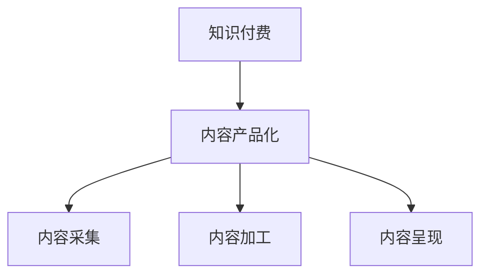

                 

# 知识付费创业的内容产品化策略

在信息爆炸的时代，知识的获取变得越来越容易，但同时，如何有效地筛选、组织、呈现知识，成为摆在我们面前的新挑战。知识付费创业，即通过打造优质的内容产品，实现知识变现，成为越来越多互联网企业探索的方向。本文将从内容产品化的角度，深入探讨知识付费创业的内容策略。

## 1. 背景介绍

### 1.1 问题由来

随着互联网的普及，人们获取知识的方式更加多元化和便捷化。知识的泛在化，让信息的检索和筛选变得更加困难。在这样的背景下，如何提供有价值、高效的知识内容，满足用户的实际需求，成为知识付费创业的关键。

知识付费创业，以内容为核心，通过专业的筛选、组织和呈现，为用户提供有价值的知识信息。这不仅包括提供有深度的知识文章、视频课程，还包括在内容形式、用户体验上的创新，以实现知识的高效传递和精准匹配。

### 1.2 问题核心关键点

知识付费创业的核心在于内容产品化。这要求企业在内容采集、筛选、加工、呈现等环节，形成一套完整的流程和方法论，从而实现内容的增值和变现。其关键点包括：

- **内容采集**：从多样化的渠道和形式中，筛选出有价值的内容资源。
- **内容加工**：对采集的内容进行深度加工，提升其价值和可读性。
- **内容呈现**：通过形式多样的内容产品，使用户能够高效地获取知识。

通过这些环节，企业能够构建起一个闭环的知识生态系统，实现内容的持续创新和知识变现。

### 1.3 问题研究意义

知识付费创业的内容产品化，对于提升知识获取的效率和质量，推动知识经济的繁荣具有重要意义。具体而言：

1. **提高知识获取效率**：通过内容产品化，用户可以更快速地获取到高质量的知识内容，节省搜索时间。
2. **优化知识结构**：企业通过对内容进行深度加工，使其更加结构化和系统化，帮助用户形成系统的知识体系。
3. **促进知识变现**：通过内容产品化，实现知识的高效变现，推动知识经济的产业化进程。
4. **加速知识创新**：内容产品化使得知识创新和传播更加便捷，促进了知识更新和迭代的速度。

## 2. 核心概念与联系

### 2.1 核心概念概述

为更好地理解知识付费创业的内容产品化策略，本节将介绍几个密切相关的核心概念：

- **知识付费**：通过付费机制，为知识内容提供者提供合理回报，同时为知识需求者提供高质量内容服务的商业模式。
- **内容产品化**：将内容从单一的文本、图片、视频等形式，转化为可消费、可传播的产品形态，以实现价值的最大化。
- **内容采集**：从海量的互联网信息中，筛选出有价值的知识内容，建立内容资源库。
- **内容加工**：对采集到的内容进行深度加工，包括内容整合、知识图谱构建、内容验证等，提升内容的价值和可信度。
- **内容呈现**：通过形式多样的内容产品，如文章、视频、课程、音频等，使用户能够高效地获取和消费内容。

这些核心概念之间的逻辑关系可以通过以下Mermaid流程图来展示：



这个流程图展示了知识付费创业的关键流程，从内容采集到内容呈现，企业通过一系列环节实现内容产品化，最终实现知识的变现。

## 3. 核心算法原理 & 具体操作步骤

### 3.1 算法原理概述

知识付费创业的内容产品化，本质上是一个信息筛选和增值的过程。其核心思想是：

- **内容采集**：从互联网的各个角落，收集有价值的知识资源。
- **内容加工**：对收集的内容进行深度加工，去除冗余信息，提炼核心价值，形成系统的知识体系。
- **内容呈现**：通过多样化的形式和渠道，将加工后的内容呈现给用户，实现知识的有效传递和消费。

这一过程可以理解为一种信息增值的过程，即将原始的内容转化为更有价值的知识产品。

### 3.2 算法步骤详解

知识付费创业的内容产品化，一般包括以下几个关键步骤：

**Step 1: 内容采集**

- **数据来源**：选择权威可靠的内容源，如学术论文、行业报告、专家博客等。
- **采集工具**：利用爬虫、API等工具，自动化采集内容数据。
- **内容筛选**：对采集到的内容进行初步筛选，去除低质量、重复的信息。

**Step 2: 内容加工**

- **深度加工**：对内容进行深度加工，包括信息整合、知识图谱构建、内容验证等，提升内容的价值和可信度。
- **内容分类**：对加工后的内容进行分类，建立知识库结构，便于用户检索和浏览。
- **内容验证**：通过专家评审、用户反馈等方式，对内容进行持续验证和更新，确保内容的准确性和时效性。

**Step 3: 内容呈现**

- **内容形式**：根据用户需求和平台特性，选择合适的内容形式，如文章、视频、课程等。
- **内容推荐**：利用算法推荐系统，为用户推荐个性化的内容产品，提升用户体验。
- **互动机制**：增加互动机制，如评论、分享、点赞等，增强用户粘性，促进内容的传播。

### 3.3 算法优缺点

知识付费创业的内容产品化，具有以下优点：

1. **提高知识获取效率**：通过内容产品化，用户可以更快速地获取到高质量的知识内容。
2. **优化知识结构**：对内容进行深度加工，帮助用户形成系统的知识体系。
3. **促进知识变现**：通过内容产品化，实现知识的高效变现。
4. **加速知识创新**：内容产品化使得知识创新和传播更加便捷。

同时，该方法也存在一定的局限性：

1. **依赖高质量内容源**：内容采集和加工的质量很大程度上取决于内容源的权威性和质量。
2. **内容加工成本高**：深度加工内容需要大量的人力和时间，成本较高。
3. **内容形式单一**：内容形式相对单一，难以满足多样化的用户需求。
4. **用户粘性不足**：缺乏互动机制，难以持续提升用户粘性。

尽管存在这些局限性，但就目前而言，内容产品化仍是知识付费创业的主流范式。未来相关研究的重点在于如何进一步降低内容采集和加工的成本，提高内容形式的丰富性和多样性，同时兼顾互动性和用户体验。

### 3.4 算法应用领域

知识付费创业的内容产品化，在多个领域得到了广泛的应用，例如：

- **在线教育**：通过内容产品化，为用户提供高质量的课程和视频，实现知识变现。
- **知识社区**：构建知识社区，通过内容推荐和互动机制，提升用户粘性和知识传播效率。
- **行业报告**：提供行业深度报告，帮助用户了解行业动态，实现知识变现。
- **专业博客**：构建专业博客平台，汇聚行业专家，提供有价值的内容，实现知识变现。

除了上述这些经典应用外，内容产品化还被创新性地应用到更多场景中，如内容聚合、知识图谱构建、个性化推荐等，为知识付费创业提供了更多的可能性。

## 4. 数学模型和公式 & 详细讲解 & 举例说明

### 4.1 数学模型构建

在知识付费创业的内容产品化过程中，可以构建以下数学模型：

- **内容质量评估模型**：用于评估内容的质量和价值，筛选高质量内容。
- **内容推荐模型**：利用算法推荐系统，为用户推荐个性化的内容产品。
- **内容互动模型**：通过用户行为数据，建立用户和内容的互动关系，提升用户粘性。

### 4.2 公式推导过程

以下以内容质量评估模型为例，推导其核心公式：

假设内容集为 $\mathcal{C}$，每个内容的质量为 $q_c$，内容 $c$ 对用户 $u$ 的吸引度为 $a_{uc}$，内容 $c$ 对内容 $c'$ 的相似度为 $s_{cc'}$。内容质量评估模型的目标是最小化内容质量损失，即：

$$
\min_{q_c} \sum_{c\in\mathcal{C}} \frac{1}{N} \sum_{u\in\mathcal{U}} (a_{uc} - q_c)^2
$$

其中 $\mathcal{U}$ 为用户集合，$N$ 为用户数量。

通过对内容 $c$ 的吸引度 $a_{uc}$ 进行加权平均，得到内容的质量评估公式：

$$
q_c = \frac{1}{N} \sum_{u\in\mathcal{U}} (a_{uc} - \alpha_s q_{c'})
$$

其中 $\alpha_s$ 为内容相似度加权系数。

### 4.3 案例分析与讲解

以知识付费创业中的内容推荐为例，展示其核心算法步骤：

1. **用户画像建模**：通过对用户的历史行为数据进行分析，建立用户画像，包括兴趣偏好、消费能力等。
2. **内容特征提取**：对内容进行特征提取，包括关键词、主题、作者等，建立内容特征向量。
3. **相似度计算**：利用余弦相似度、Jaccard相似度等方法，计算内容之间的相似度。
4. **推荐算法设计**：设计推荐算法，如协同过滤、基于内容的推荐等，为用户推荐个性化的内容产品。

**算法步骤**：

1. **计算用户画像**：
   - 通过用户的历史行为数据，构建用户画像 $\mathcal{P}_u$，包括兴趣偏好、消费能力等。
   - 利用TF-IDF等方法，对用户画像进行特征提取，得到用户特征向量 $\mathbf{p}_u$。

2. **内容特征提取**：
   - 对内容 $c$ 进行特征提取，得到内容特征向量 $\mathbf{f}_c$，包括关键词、主题、作者等。
   - 对内容特征向量进行标准化处理，得到内容标准特征向量 $\mathbf{f}_c^*$。

3. **相似度计算**：
   - 利用余弦相似度计算用户画像与内容特征向量之间的相似度 $s_{uc}$。
   - 利用Jaccard相似度计算内容特征向量之间的相似度 $s_{cc'}$。

4. **推荐算法设计**：
   - 根据用户画像和内容特征向量的相似度，设计推荐算法，如协同过滤、基于内容的推荐等，为用户推荐个性化的内容产品。

通过以上步骤，实现基于内容产品化的知识推荐，提升用户满意度，实现知识变现。

## 5. 项目实践：代码实例和详细解释说明

### 5.1 开发环境搭建

在进行内容产品化实践前，我们需要准备好开发环境。以下是使用Python进行项目开发的环境配置流程：

1. 安装Python：从官网下载并安装Python，确保版本稳定。
2. 安装相关的Python库：如numpy、pandas、scikit-learn等，用于数据处理和机器学习。
3. 安装相关的Web框架：如Flask、Django等，用于搭建Web应用平台。
4. 配置数据库：安装MySQL、PostgreSQL等数据库，用于存储内容数据和用户行为数据。

完成上述步骤后，即可在开发环境中开始内容产品化的项目实践。

### 5.2 源代码详细实现

这里我们以内容推荐系统为例，展示如何利用Python和机器学习库实现内容产品化。

首先，定义数据处理函数：

```python
import numpy as np
from sklearn.feature_extraction.text import TfidfVectorizer
from sklearn.metrics.pairwise import cosine_similarity
from sklearn.decomposition import TruncatedSVD

def process_content(content):
    # 内容特征提取
    tfidf = TfidfVectorizer(stop_words='english')
    content_tfidf = tfidf.fit_transform(content)
    
    # 内容相似度计算
    content_similarity = cosine_similarity(content_tfidf)
    
    # 内容降维
    svd = TruncatedSVD(n_components=50)
    content_tfidf_svd = svd.fit_transform(content_tfidf)
    
    return content_similarity, content_tfidf_svd
```

然后，定义推荐函数：

```python
from flask import Flask, request, jsonify

app = Flask(__name__)

def recommend_content(content_similarity, content_tfidf_svd, user_profile):
    # 计算用户画像与内容特征向量的相似度
    user_profile_similarity = cosine_similarity(user_profile, content_tfidf_svd)
    
    # 推荐内容
    top_n = 5
    recommended_contents = np.argsort(user_profile_similarity)[::-1][:top_n]
    
    return recommended_contents
```

最后，启动Web服务，提供推荐接口：

```python
@app.route('/recommend', methods=['POST'])
def recommend():
    data = request.get_json()
    user_profile = data['user_profile']
    content_tfidf_svd = data['content_tfidf_svd']
    content_similarity = data['content_similarity']
    
    recommended_contents = recommend_content(content_similarity, content_tfidf_svd, user_profile)
    
    return jsonify(recommended_contents.tolist())
```

### 5.3 代码解读与分析

让我们再详细解读一下关键代码的实现细节：

**process_content函数**：
- 通过TF-IDF方法对内容进行特征提取，得到内容特征向量。
- 利用余弦相似度计算内容之间的相似度。
- 使用奇异值分解(SVD)对内容特征向量进行降维，减少计算量。

**recommend_content函数**：
- 通过余弦相似度计算用户画像与内容特征向量之间的相似度。
- 根据相似度排序，选取top_n个最相似的内容作为推荐结果。

**Flask应用程序**：
- 通过Flask框架搭建Web应用，提供内容推荐接口。
- 接收用户画像和内容特征向量作为输入，返回推荐结果。

通过以上步骤，实现了基于内容推荐的内容产品化。开发者可以根据具体需求，进一步优化算法和模型，提升推荐效果。

## 6. 实际应用场景

### 6.1 智能教育平台

知识付费创业在智能教育平台中的应用，通过内容产品化，为用户提供个性化的学习资源。智能教育平台能够根据学生的学习行为和偏好，推荐适合的学习内容和资源，帮助学生高效学习，提升学习效果。

### 6.2 企业知识管理系统

在企业知识管理系统中，知识付费创业的内容产品化，可以帮助企业构建知识图谱，实现知识的结构化管理和高效检索。通过内容推荐系统，员工可以快速获取到所需知识，提升工作效率。

### 6.3 在线阅读平台

在线阅读平台通过内容产品化，为用户提供高质量的阅读内容，实现知识变现。平台可以通过内容推荐系统，为用户推荐个性化的文章、书籍和课程，提升用户体验，增加平台粘性。

### 6.4 未来应用展望

随着知识付费创业的内容产品化技术不断发展，未来将在更多领域得到应用，为传统行业带来变革性影响。

在智慧医疗领域，基于内容产品化的知识平台，可以提供高质量的医疗知识和资源，帮助医生和患者更好地理解和处理健康问题。

在智能农业领域，内容产品化可以提供科学种植、养殖知识，提升农业生产的效率和质量。

在智能制造领域，内容产品化可以提供设备维护、生产优化等知识，提升制造业的智能化水平。

此外，在智慧交通、智能家居、智能城市等领域，内容产品化也将发挥重要作用，推动各行各业的数字化转型。

## 7. 工具和资源推荐

### 7.1 学习资源推荐

为了帮助开发者系统掌握内容产品化的理论基础和实践技巧，这里推荐一些优质的学习资源：

1. **《推荐系统实战》**：由KDD大会的推荐系统竞赛获奖者撰写，深入浅出地介绍了推荐系统的原理和实践技巧。
2. **《Python机器学习》**：一本广受欢迎的机器学习入门书籍，详细介绍了机器学习算法和Python实现。
3. **Coursera推荐系统课程**：由斯坦福大学开设的推荐系统课程，提供了系统化的推荐系统学习路径。
4. **Kaggle推荐系统竞赛**：通过参与Kaggle推荐系统竞赛，积累实战经验和数据分析能力。
5. **《内容推荐系统》**：一本详细介绍内容推荐系统的书籍，涵盖了内容推荐的核心算法和实现细节。

通过对这些资源的学习实践，相信你一定能够快速掌握内容产品化的精髓，并用于解决实际的推荐问题。

### 7.2 开发工具推荐

高效的开发离不开优秀的工具支持。以下是几款用于内容产品化开发的常用工具：

1. **Python**：通用的编程语言，支持多种科学计算和机器学习库。
2. **Jupyter Notebook**：交互式编程环境，支持Python、R等多种语言，便于数据处理和模型实验。
3. **Flask/Django**：流行的Web框架，支持快速搭建Web应用，提供API接口。
4. **TensorFlow/Keras**：深度学习框架，支持高效的模型训练和部署。
5. **MySQL/PostgreSQL**：关系型数据库，支持高效的数据存储和管理。
6. **Elasticsearch**：分布式搜索引擎，支持高效的文本检索和推荐。

合理利用这些工具，可以显著提升内容产品化任务的开发效率，加快创新迭代的步伐。

### 7.3 相关论文推荐

内容产品化的发展源于学界的持续研究。以下是几篇奠基性的相关论文，推荐阅读：

1. **《推荐系统：基础与实践》**：全面介绍了推荐系统的理论和算法，提供了丰富的实践案例。
2. **《基于用户画像的内容推荐算法》**：提出基于用户画像的内容推荐算法，提升了推荐效果。
3. **《基于协同过滤的内容推荐系统》**：提出协同过滤推荐算法，通过用户行为数据实现推荐。
4. **《基于内容的推荐系统》**：详细介绍了基于内容的推荐算法，包括TF-IDF、奇异值分解等方法。
5. **《深度学习在推荐系统中的应用》**：介绍了深度学习在推荐系统中的最新应用，如神经协同过滤、深度矩阵分解等。

这些论文代表了大语言模型微调技术的发展脉络。通过学习这些前沿成果，可以帮助研究者把握学科前进方向，激发更多的创新灵感。

## 8. 总结：未来发展趋势与挑战

### 8.1 总结

本文对知识付费创业的内容产品化策略进行了全面系统的介绍。首先阐述了内容产品化的背景和意义，明确了内容产品化在知识付费创业中的核心地位。其次，从原理到实践，详细讲解了内容产品化的数学模型和操作步骤，给出了内容推荐系统的代码实现。同时，本文还广泛探讨了内容产品化在智能教育、企业知识管理、在线阅读等领域的实际应用前景，展示了内容产品化的巨大潜力。此外，本文精选了内容产品化的各类学习资源，力求为读者提供全方位的技术指引。

通过本文的系统梳理，可以看到，内容产品化策略是知识付费创业的核心关键。这一策略通过内容采集、加工、呈现等环节，实现知识的增值和变现。未来，伴随内容产品化技术的不断演进，知识付费创业必将在多个领域得到深入应用，推动知识经济的繁荣和发展。

### 8.2 未来发展趋势

展望未来，内容产品化技术将呈现以下几个发展趋势：

1. **内容形式多样化**：随着用户需求的多样化，内容产品化将更加注重内容形式的创新和多样化，如视频、音频、虚拟现实等。
2. **用户个性化提升**：通过深度学习和数据分析，内容产品化将进一步提升个性化推荐的效果，实现精准的内容匹配。
3. **知识图谱构建**：内容产品化将逐步引入知识图谱技术，实现知识的结构化管理和高效检索。
4. **跨领域融合**：内容产品化将与其他技术进行更深入的融合，如自然语言处理、计算机视觉等，实现跨领域的知识创新。
5. **人工智能驱动**：内容产品化将更多地引入人工智能技术，提升内容自动生成和智能推荐的能力。

以上趋势凸显了内容产品化技术的广阔前景。这些方向的探索发展，必将进一步提升内容产品化的效果和应用范围，为知识付费创业带来新的突破。

### 8.3 面临的挑战

尽管内容产品化技术已经取得了显著进展，但在迈向更加智能化、普适化应用的过程中，仍面临诸多挑战：

1. **内容采集和加工成本高**：高质量内容采集和加工需要大量的人力和时间，成本较高。
2. **内容质量和多样性不足**：内容质量和多样性很大程度上依赖于内容源的质量和数量，难以全面覆盖用户需求。
3. **个性化推荐效果有待提升**：推荐算法仍需进一步优化，提升推荐效果和用户满意度。
4. **用户粘性不足**：内容产品化需要进一步提升用户粘性，增加用户参与度和互动性。
5. **技术和数据安全**：内容产品化需要确保技术和数据的安全性，防止数据泄露和攻击。

尽管存在这些挑战，但通过不断的技术创新和应用实践，相信内容产品化技术能够克服这些难题，推动知识付费创业的发展。

### 8.4 研究展望

面对内容产品化技术面临的挑战，未来的研究需要在以下几个方面寻求新的突破：

1. **自动化内容采集**：开发自动化内容采集工具，提高内容采集的效率和质量。
2. **深度内容加工**：通过深度学习和大数据分析，提升内容加工的效率和质量。
3. **多样化内容呈现**：结合自然语言处理、计算机视觉等技术，实现内容形式的创新和多样化。
4. **精准个性化推荐**：引入协同过滤、深度学习等算法，提升个性化推荐的效果和准确性。
5. **增强用户互动**：通过增强用户互动机制，提升用户粘性和参与度。

这些研究方向的探索，必将引领内容产品化技术迈向更高的台阶，为知识付费创业提供更加全面和高效的内容解决方案。面向未来，内容产品化技术还需要与其他人工智能技术进行更深入的融合，如知识表示、因果推理、强化学习等，多路径协同发力，共同推动内容产品化技术的进步。只有勇于创新、敢于突破，才能不断拓展内容产品化的边界，让知识付费创业走向更加广阔的市场。

## 9. 附录：常见问题与解答

**Q1：内容产品化如何降低内容采集和加工的成本？**

A: 内容产品化可以通过自动化内容采集工具和深度内容加工算法，降低内容采集和加工的成本。例如，使用爬虫和API接口自动化采集内容，利用自然语言处理和大数据分析提升内容加工的效率和质量。

**Q2：内容推荐系统如何提升个性化推荐的效果？**

A: 内容推荐系统可以通过深度学习和数据分析，提升个性化推荐的效果。例如，使用协同过滤算法，根据用户行为数据推荐相似内容。引入深度学习算法，如神经协同过滤、深度矩阵分解等，提升推荐算法的精度和鲁棒性。

**Q3：内容产品化如何增强用户粘性？**

A: 内容产品化可以通过增强用户互动机制，提升用户粘性。例如，增加评论、分享、点赞等互动机制，使用户能够参与内容生成和评论，增强用户粘性。

**Q4：内容产品化如何保障数据安全？**

A: 内容产品化需要确保技术和数据的安全性，防止数据泄露和攻击。例如，使用数据加密、访问控制等技术，确保数据安全。建立严格的隐私保护机制，确保用户隐私不被侵犯。

**Q5：内容产品化如何实现跨领域融合？**

A: 内容产品化可以通过引入跨领域知识图谱、多模态数据融合等技术，实现跨领域的知识创新和传播。例如，结合自然语言处理、计算机视觉等技术，实现内容形式的创新和多样化。

通过以上问答，可以看到，内容产品化在知识付费创业中扮演着关键角色。内容采集、加工、呈现等环节的有效实施，将极大地提升知识的获取效率和质量，推动知识经济的繁荣和发展。面对未来的挑战和机遇，只有不断创新和优化，才能实现内容产品化的可持续发展，助力知识付费创业的持续成长。

---

作者：禅与计算机程序设计艺术 / Zen and the Art of Computer Programming

