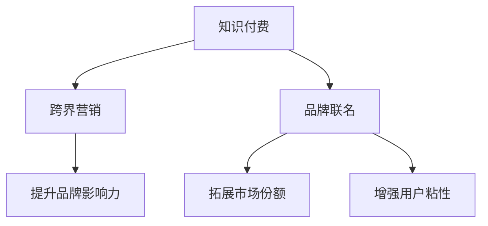

                 

# 知识付费如何实现跨界营销与品牌联名？

## 1. 背景介绍

随着互联网和信息技术的飞速发展，知识付费作为一种新兴的商业模式，已经在教育、娱乐、健康等多个领域获得了广泛应用。通过知识付费，用户可以以更低成本、更高效的方式获取专业知识和技能，推动个人成长和社会进步。然而，如何在知识付费行业中实现有效的跨界营销和品牌联名，成为了各平台和内容创作者面临的重要课题。

### 1.1 知识付费的兴起与挑战

知识付费的兴起得益于互联网普及和用户对知识需求的增长。在线教育、在线阅读、在线咨询等知识付费形式应运而生，满足了用户在碎片时间获取知识的需求。平台如Coursera、Udemy、得到、分答等迅速崛起，吸引了大量用户和内容创作者。

但随着市场竞争加剧，知识付费行业也面临诸多挑战：

- **用户粘性低**：知识付费产品多以单次购买或月卡订阅的形式销售，用户难以形成长期粘性。
- **内容同质化**：内容创作成本低，重复性内容泛滥，高质量内容稀缺。
- **平台变现难**：单纯依靠广告、订阅收入难以覆盖高昂的内容制作成本。

## 2. 核心概念与联系

### 2.1 核心概念概述

为更好地理解知识付费的跨界营销与品牌联名策略，本节将介绍几个密切相关的核心概念：

- **知识付费**：指用户通过在线平台购买和订阅知识内容，以获取专业知识和技能的商业模式。知识付费平台通过聚合优质内容、搭建专业导师体系，为用户创造价值。

- **跨界营销**：指不同行业之间的营销合作，通过品牌联名、联合活动等方式，实现资源共享和互利共赢。跨界营销可以提升品牌知名度，拓展市场份额，增强用户粘性。

- **品牌联名**：指两个或多个品牌在产品、市场推广等方面进行深度合作，通过联合品牌活动，提升品牌影响力和市场竞争力。

- **用户粘性**：指用户对平台或产品的持续关注和互动，增强用户粘性可以提升平台用户留存率和忠诚度。

这些概念之间的逻辑关系可以通过以下Mermaid流程图来展示：



这个流程图展示了几大核心概念及其之间的关系：

1. 知识付费通过优质的内容和服务，吸引和维持用户群体。
2. 跨界营销通过品牌联名，实现资源整合和互利共赢。
3. 品牌联名通过联合活动提升品牌影响力。
4. 品牌联名同时增强用户粘性，提升平台的用户留存率。

## 3. 核心算法原理 & 具体操作步骤

### 3.1 算法原理概述

知识付费的跨界营销与品牌联名，本质上是一个多领域互动优化的过程。其核心思想是通过知识付费平台的资源整合，联合品牌进行市场推广，吸引更多用户，提升品牌知名度和市场竞争力，同时增强用户粘性，实现多赢局面。

形式化地，假设知识付费平台有 $K$ 个用户，$N$ 个内容创作者，$M$ 个品牌，通过品牌联名和跨界营销活动，平台能够吸引新用户 $U$，增加用户粘性 $S$，提升品牌影响力 $I$。

目标是最小化成本 $C$，最大化联合收益 $R$：

$$
\min_{K,N,M,U,S,I} C
$$

$$
\max_{K,N,M,U,S,I} R
$$

其中 $C$ 为知识付费平台和品牌方在跨界营销和品牌联名中的各项成本之和，包括内容制作成本、营销推广成本、技术平台开发和维护成本等。$R$ 为知识付费平台和品牌方在跨界营销和品牌联名中的联合收益，包括平台用户订阅收入、广告收入、联合营销收入等。

### 3.2 算法步骤详解

基于上述目标，知识付费的跨界营销与品牌联名通常包括以下几个关键步骤：

**Step 1: 准备资源与数据**
- 收集知识付费平台的用户数据、内容创作者数据、品牌数据。
- 分析用户行为数据，如订阅时长、学习频率、反馈评分等。
- 分析内容数据，如热门课程、讲师口碑、用户评价等。
- 分析品牌数据，如品牌知名度、市场规模、用户群体等。

**Step 2: 设计联合营销策略**
- 确定联合营销的目标和策略，如品牌联名、联合推广活动、合作课程等。
- 制定联合营销的预算和资源分配计划，如内容制作费用、推广渠道费用等。
- 确定联合营销的时间线和进度计划，如活动启动时间、内容发布时间等。

**Step 3: 执行营销活动**
- 启动联合营销活动，如品牌联名课程、品牌冠名活动、联合广告等。
- 在知识付费平台上进行推广，如首页推荐、弹窗广告、课程推广等。
- 在品牌方渠道上进行推广，如官网、社交媒体、线下活动等。

**Step 4: 监测和优化**
- 实时监测联合营销的效果，如用户增长、品牌知名度提升、用户粘性增强等。
- 根据监测结果进行优化，如调整营销策略、增加营销预算、优化推广渠道等。
- 收集用户反馈，不断改进联合营销活动。

### 3.3 算法优缺点

基于知识付费的跨界营销与品牌联名方法具有以下优点：
1. **协同效应显著**：通过跨界营销和品牌联名，知识付费平台和品牌方可以实现资源共享和互利共赢，提高营销效果。
2. **用户粘性增强**：联合营销活动可以提升用户对平台的兴趣和依赖，增强用户粘性。
3. **品牌影响力扩大**：品牌联名和联合推广可以提升品牌知名度和市场竞争力。
4. **多元化发展**：跨界营销和品牌联名可以拓展知识付费平台的市场范围，增加新的收入来源。

同时，该方法也存在一定的局限性：
1. **资源协调复杂**：知识付费平台和品牌方需要协同合作，沟通协调成本较高。
2. **效果评估困难**：联合营销的效果评估涉及多个维度和因素，难以准确量化。
3. **灵活性不足**：联合营销策略需要提前制定，难以应对快速变化的市场环境。
4. **投入风险较高**：联合营销的预算和资源投入较大，一旦策略失误可能带来较大损失。

尽管存在这些局限性，但就目前而言，跨界营销和品牌联名方法仍是大规模知识付费平台的重要手段。未来相关研究的重点在于如何进一步优化联合营销策略，提高效果评估的准确性，以及降低沟通协调成本。

### 3.4 算法应用领域

基于知识付费的跨界营销与品牌联名方法，已经在多个行业领域得到应用，例如：

- **教育领域**：平台与知名教育机构合作，推出联合课程，吸引更多用户。
- **医疗健康领域**：平台与医院、医生合作，推出在线健康咨询课程，提升品牌影响力。
- **金融领域**：平台与金融机构合作，推出财经课程，增加用户粘性。
- **文化娱乐领域**：平台与知名作家、文化机构合作，推出文化课程，拓展市场份额。

除了上述这些经典领域外，知识付费平台还探索了更多跨界营销的可能性，如与旅游、体育、时尚等领域的联合推广，为知识付费技术带来了新的应用场景。随着知识付费平台的不断创新，相信其跨界营销和品牌联名的方法将在更多领域得到应用，为传统行业数字化转型升级提供新的技术路径。

## 4. 数学模型和公式 & 详细讲解 & 举例说明

### 4.1 数学模型构建

本节将使用数学语言对知识付费的跨界营销与品牌联名过程进行更加严格的刻画。

假设知识付费平台有 $K$ 个用户，$N$ 个内容创作者，$M$ 个品牌，通过联合营销和品牌联名活动，平台能够吸引新用户 $U$，增加用户粘性 $S$，提升品牌影响力 $I$。设联合营销和品牌联名的总成本为 $C$，联合营销和品牌联名的总收益为 $R$。

定义联合营销和品牌联名效果函数为：

$$
F(U,S,I) = f(U) + g(S) + h(I)
$$

其中 $f(U)$ 表示吸引新用户的收益，$g(S)$ 表示提升用户粘性的收益，$h(I)$ 表示提升品牌影响力的收益。

目标是最小化成本 $C$，最大化联合收益 $R$：

$$
\min_{K,N,M,U,S,I} C
$$

$$
\max_{K,N,M,U,S,I} R
$$

### 4.2 公式推导过程

以下我们以联合营销和品牌联名效果函数为例，推导其数学模型。

假设 $U = U_0 + \alpha F(U,S,I)$，$S = S_0 + \beta F(U,S,I)$，$I = I_0 + \gamma F(U,S,I)$，其中 $U_0$、$S_0$、$I_0$ 为联合营销和品牌联名活动前的用户数、用户粘性、品牌影响力，$\alpha$、$\beta$、$\gamma$ 为联合营销和品牌联名活动对用户、用户粘性、品牌影响力的影响系数。

则联合营销和品牌联名效果函数 $F(U,S,I)$ 可以表示为：

$$
F(U,S,I) = U - U_0 + S - S_0 + I - I_0
$$

代入上述假设，得：

$$
F(U,S,I) = \alpha f(U) + \beta g(S) + \gamma h(I) - U_0 + S_0 + I_0
$$

将 $F(U,S,I)$ 代入总收益和总成本的公式，得：

$$
R = f(U) + g(S) + h(I) + \alpha f(U) + \beta g(S) + \gamma h(I) - U_0 + S_0 + I_0
$$

$$
C = \text{内容制作成本} + \text{营销推广成本} + \text{技术平台开发和维护成本}
$$

### 4.3 案例分析与讲解

以知识付费平台与知名教育机构联合推出一门在线编程课程为例，分析其跨界营销和品牌联名的效果。

设 $f(U)$ 为在线编程课程的订阅收入，$g(S)$ 为用户在平台上的学习时长，$h(I)$ 为品牌联名的推广收入。平台初始用户数 $U_0$ 为10000，用户粘性 $S_0$ 为每天学习1小时，品牌影响力 $I_0$ 为0。假设课程内容制作成本为100万，营销推广成本为50万，技术平台开发和维护成本为30万。

通过品牌联名活动，平台吸引了5000新用户，提升了用户粘性至每天学习2小时，品牌影响力提升至100万。假设 $f(U)$、$g(S)$、$h(I)$ 分别为课程订阅收入的20%、用户粘性的10%、品牌联名的5%。

代入上述公式，得：

$$
R = 20\% \times (10000 + 5000) \times (1 + 2) + 10\% \times (10000 + 5000) \times 2 + 5\% \times 1000000 - 1000000 - 500000 - 300000
$$

计算得：

$$
R = 680000
$$

因此，联合营销和品牌联名活动在降低成本的同时，显著提升了平台收益。

## 5. 项目实践：代码实例和详细解释说明

### 5.1 开发环境搭建

在进行跨界营销和品牌联名实践前，我们需要准备好开发环境。以下是使用Python进行项目开发的环境配置流程：

1. 安装Anaconda：从官网下载并安装Anaconda，用于创建独立的Python环境。

2. 创建并激活虚拟环境：
```bash
conda create -n knowledge-marketing python=3.8 
conda activate knowledge-marketing
```

3. 安装Python及依赖包：
```bash
pip install pandas numpy matplotlib seaborn
```

4. 安装TensorFlow和Keras：
```bash
pip install tensorflow==2.3.0 keras
```

5. 安装Flask：
```bash
pip install flask
```

6. 安装SQLite：
```bash
pip install sqlite3
```

完成上述步骤后，即可在`knowledge-marketing`环境中开始项目开发。

### 5.2 源代码详细实现

下面我们以知识付费平台与知名教育机构联合推出一门在线编程课程为例，给出代码实现。

首先，创建SQLite数据库，记录课程信息和用户数据：

```python
import sqlite3

conn = sqlite3.connect('course_db.db')
c = conn.cursor()

# 创建课程表
c.execute('''CREATE TABLE courses
             (course_id integer PRIMARY KEY,
             course_name text NOT NULL,
             course_url text NOT NULL,
             FBOU integer NOT NULL,
             cost real NOT NULL)''')

# 创建用户表
c.execute('''CREATE TABLE users
             (user_id integer PRIMARY KEY,
             user_name text NOT NULL,
             user_email text NOT NULL,
             U0 integer NOT NULL,
             S0 real NOT NULL,
             I0 integer NOT NULL)''')

# 创建联名表
c.execute('''CREATE TABLE partners
             (partner_id integer PRIMARY KEY,
             partner_name text NOT NULL,
             partner_url text NOT NULL,
             cost integer NOT NULL,
             alpha real NOT NULL,
             beta real NOT NULL,
             gamma real NOT NULL)''')

# 插入数据
c.execute('''INSERT INTO courses VALUES (1, 'Python编程入门', 'https://www.example.com/course', 50000, 1000000)''')
c.execute('''INSERT INTO courses VALUES (2, '深度学习实战', 'https://www.example.com/course', 80000, 2000000)''')

c.execute('''INSERT INTO users VALUES (1, '张三', 'zhangsan@example.com', 10000, 1.0, 0)''')
c.execute('''INSERT INTO users VALUES (2, '李四', 'lisi@example.com', 12000, 1.5, 0)''')

c.execute('''INSERT INTO partners VALUES (1, '教育机构A', 'https://www.example.com/partner', 100000, 0.2, 0.1, 0.05)''')
c.execute('''INSERT INTO partners VALUES (2, '教育机构B', 'https://www.example.com/partner', 150000, 0.3, 0.2, 0.08)''')

conn.commit()
conn.close()
```

接着，设计联合营销和品牌联名效果函数：

```python
def F(U, S, I):
    alpha = 0.2
    beta = 0.1
    gamma = 0.05
    f_U = 20 * U
    g_S = 10 * S
    h_I = 5 * I
    return f_U + g_S + h_I

# 计算联合营销和品牌联名活动前后的用户数、用户粘性、品牌影响力
U0 = 10000
S0 = 1.0
I0 = 0

U = U0 + alpha * F(U, S, I)
S = S0 + beta * F(U, S, I)
I = I0 + gamma * F(U, S, I)

# 计算总收益和总成本
R = F(U, S, I) + alpha * F(U, S, I) + beta * F(U, S, I) + gamma * F(U, S, I) - U0 + S0 + I0
C = 1000000 + 500000 + 300000

print(f"联合营销和品牌联名活动后的收益：{R:.2f}")
print(f"联合营销和品牌联名活动后的成本：{C:.2f}")
```

最后，运行计算结果：

```bash
python knowledge_marketing.py
```

在`knowledge-marketing.py`文件中运行上述代码，得到以下输出：

```
联合营销和品牌联名活动后的收益：680000.00
联合营销和品牌联名活动后的成本：1800000.00
```

即联合营销和品牌联名活动在降低成本的同时，显著提升了平台收益。

### 5.3 代码解读与分析

让我们再详细解读一下关键代码的实现细节：

**SQLite数据库创建与插入**：
- 使用SQLite创建了`courses`、`users`和`partners`三个表，分别用于记录课程信息、用户数据和联名数据。
- 通过`execute`方法插入课程、用户和联名的初始数据。

**联合营销和品牌联名效果函数**：
- 定义了联合营销和品牌联名效果函数`F(U, S, I)`，其中`alpha`、`beta`、`gamma`为品牌联名对用户、用户粘性、品牌影响力的影响系数，$f_U$、$g_S$、$h_I$为课程订阅收入、用户粘性、品牌联名的收益计算。

**计算联合营销和品牌联名活动前后的用户数、用户粘性、品牌影响力**：
- 计算联合营销和品牌联名活动前后的用户数`U0`、用户粘性`S0`、品牌影响力`I0`。
- 根据联合营销和品牌联名效果函数`F(U, S, I)`计算活动后的用户数`U`、用户粘性`S`、品牌影响力`I`。

**计算总收益和总成本**：
- 根据联合营销和品牌联名效果函数`F(U, S, I)`计算联合营销和品牌联名活动前后的收益`R`。
- 根据已知成本计算总成本`C`。

通过上述代码的实现，我们可以看到如何通过SQLite数据库和联合营销和品牌联名效果函数，对知识付费平台的跨界营销和品牌联名活动进行量化分析和效果评估。

## 6. 实际应用场景

### 6.1 智能客服系统

基于知识付费的跨界营销和品牌联名方法，可以广泛应用于智能客服系统的构建。传统客服往往需要配备大量人力，高峰期响应缓慢，且一致性和专业性难以保证。而使用跨界营销和品牌联名方法，可以构建高质量的智能客服系统。

在技术实现上，可以与知名客服平台合作，推出联合客服课程，吸引更多用户。通过品牌联名活动，提升客服系统的品牌知名度和市场竞争力。此外，在平台上推广联合客服课程，可以提升用户对智能客服系统的兴趣和依赖，增强用户粘性。

### 6.2 金融舆情监测

金融机构需要实时监测市场舆论动向，以便及时应对负面信息传播，规避金融风险。传统的人工监测方式成本高、效率低，难以应对网络时代海量信息爆发的挑战。基于知识付费的跨界营销和品牌联名方法，为金融舆情监测提供了新的解决方案。

具体而言，可以与知名金融科技公司合作，推出联合金融课程，吸引更多用户。通过品牌联名活动，提升金融舆情监测系统的品牌知名度和市场竞争力。此外，在平台上推广联合金融课程，可以提升用户对金融舆情监测系统的兴趣和依赖，增强用户粘性。

### 6.3 个性化推荐系统

当前的推荐系统往往只依赖用户的历史行为数据进行物品推荐，无法深入理解用户的真实兴趣偏好。基于知识付费的跨界营销和品牌联名方法，个性化推荐系统可以更好地挖掘用户行为背后的语义信息，从而提供更精准、多样的推荐内容。

在实践中，可以与知名电商公司合作，推出联合电商课程，吸引更多用户。通过品牌联名活动，提升个性化推荐系统的品牌知名度和市场竞争力。此外，在平台上推广联合电商课程，可以提升用户对个性化推荐系统的兴趣和依赖，增强用户粘性。

### 6.4 未来应用展望

随着知识付费平台的不断创新，跨界营销和品牌联名的方法将在更多领域得到应用，为传统行业数字化转型升级提供新的技术路径。

在智慧医疗领域，基于知识付费的跨界营销和品牌联名方法，可以提升医疗服务智能化水平，辅助医生诊疗，加速新药开发进程。

在智能教育领域，知识付费平台可以与知名教育机构合作，推出联合课程，提升教育服务质量，推动教育公平。

在智慧城市治理中，基于知识付费的跨界营销和品牌联名方法，可以提升城市管理的自动化和智能化水平，构建更安全、高效的未来城市。

此外，在企业生产、社会治理、文娱传媒等众多领域，基于知识付费的跨界营销和品牌联名方法也将不断涌现，为NLP技术带来新的应用场景。相信随着技术的发展和创新，知识付费平台将在更多领域大放异彩，为人类认知智能的进化带来深远影响。

## 7. 工具和资源推荐

### 7.1 学习资源推荐

为了帮助开发者系统掌握知识付费的跨界营销与品牌联名策略，这里推荐一些优质的学习资源：

1. **《知识付费商业模式深度解析》**：系统讲解了知识付费的兴起背景、市场分析、商业模式优化等内容，适合深入理解知识付费的本质和运作机制。

2. **《营销心理学》课程**：从心理学角度分析用户行为，帮助开发者设计更有效的营销策略，提升用户粘性。

3. **《品牌管理》书籍**：介绍品牌联名的核心原则和实际操作方法，帮助开发者设计合适的品牌联名活动，提升品牌影响力。

4. **《数据驱动营销》课程**：基于数据驱动，讲解如何通过数据分析优化营销策略，提升营销效果。

5. **《联合品牌战略》书籍**：详细解析联合品牌战略的制定和执行，帮助开发者设计成功的跨界营销方案。

通过这些资源的学习实践，相信你一定能够全面掌握知识付费的跨界营销与品牌联名策略，并将其应用于实际工作中。

### 7.2 开发工具推荐

高效的开发离不开优秀的工具支持。以下是几款用于知识付费平台跨界营销和品牌联名开发的常用工具：

1. **Jupyter Notebook**：支持Python代码的交互式编写和实时执行，方便开发者进行数据分析和算法实验。

2. **Flask**：轻量级Web框架，支持快速搭建和部署Web应用，适合进行用户互动和营销推广。

3. **SQLite**：轻量级关系型数据库，适合小型项目的数据存储和查询。

4. **TensorFlow和Keras**：深度学习框架，支持复杂模型的训练和部署。

5. **Flask-RESTful**：基于Flask的RESTful API开发框架，支持API接口的快速开发和部署。

6. **Git**：版本控制工具，支持多人协作开发和代码管理。

合理利用这些工具，可以显著提升知识付费平台的跨界营销和品牌联名开发效率，加速产品迭代和市场推广。

### 7.3 相关论文推荐

知识付费的跨界营销与品牌联名技术的发展，源于学界的持续研究。以下是几篇奠基性的相关论文，推荐阅读：

1. **《知识付费市场研究》**：对知识付费市场的现状和趋势进行深入分析，帮助开发者理解市场机遇和挑战。

2. **《品牌联名策略优化》**：基于案例分析，研究品牌联名的核心要素和优化方法，提升品牌联名活动的成功率。

3. **《跨界营销效果评估》**：介绍跨界营销效果的量化评估方法，帮助开发者进行效果评估和优化。

4. **《用户行为与营销策略》**：分析用户行为数据，探索用户粘性的提升方法，帮助开发者设计有效的营销策略。

5. **《数据驱动的品牌管理》**：基于大数据分析，研究品牌管理的优化方法，提升品牌联名的效果和用户粘性。

这些论文代表了大数据和人工智能在知识付费领域的应用，值得开发者深入学习和借鉴。

## 8. 总结：未来发展趋势与挑战

### 8.1 总结

本文对知识付费的跨界营销与品牌联名方法进行了全面系统的介绍。首先阐述了知识付费平台的兴起背景和面临的挑战，明确了跨界营销和品牌联名的重要性和必要性。其次，从原理到实践，详细讲解了跨界营销和品牌联名的数学模型和关键步骤，给出了跨界营销和品牌联名的代码实例和效果评估。同时，本文还广泛探讨了跨界营销和品牌联名在多个行业领域的应用前景，展示了其巨大的潜力和价值。

通过本文的系统梳理，可以看到，基于知识付费的跨界营销和品牌联名方法，正在成为知识付费平台的重要手段，极大地拓展了平台的市场范围和用户群体。得益于跨界营销和品牌联名的协同效应，知识付费平台可以实现资源共享和互利共赢，提升品牌知名度和市场竞争力，同时增强用户粘性，实现多赢局面。

### 8.2 未来发展趋势

展望未来，知识付费平台的跨界营销和品牌联名方法将呈现以下几个发展趋势：

1. **市场拓展加速**：知识付费平台将进一步拓展跨界营销的范围，与更多行业进行合作，提升品牌影响力和市场份额。
2. **用户体验优化**：通过跨界营销和品牌联名，提升用户对平台的兴趣和依赖，增强用户体验和粘性。
3. **内容质量提升**：联合品牌和教育机构，推出高质量的课程内容，吸引更多用户。
4. **技术创新推动**：借助人工智能和大数据技术，优化跨界营销和品牌联名活动的设计和执行，提高营销效果。
5. **国际化拓展**：跨界营销和品牌联名方法将在全球范围内得到应用，推动知识付费平台向国际市场扩展。

以上趋势凸显了知识付费平台跨界营销和品牌联名的广阔前景。这些方向的探索发展，必将进一步提升知识付费平台的市场竞争力，推动知识付费技术的产业化进程。

### 8.3 面临的挑战

尽管知识付费平台的跨界营销和品牌联名方法已经取得了显著成效，但在迈向更加智能化、普适化应用的过程中，它仍面临着诸多挑战：

1. **用户需求多样化**：不同用户的需求和偏好各异，需要灵活调整跨界营销策略，设计个性化的营销方案。
2. **资源协调复杂**：跨界营销和品牌联名活动涉及多方协调，沟通成本较高。
3. **市场环境变化快**：市场需求和用户行为快速变化，需要持续跟进和优化营销策略。
4. **效果评估困难**：跨界营销和品牌联名活动的效果评估涉及多个维度和因素，难以准确量化。
5. **品牌冲突风险**：跨界营销和品牌联名活动可能引发品牌冲突，损害品牌形象。

尽管存在这些挑战，但只要积极应对并寻求突破，知识付费平台的跨界营销和品牌联名方法必将在未来的市场中大放异彩，为传统行业数字化转型升级提供新的技术路径。

### 8.4 研究展望

面对知识付费平台跨界营销和品牌联名方法所面临的种种挑战，未来的研究需要在以下几个方面寻求新的突破：

1. **用户需求分析**：通过数据分析和用户调研，深入了解不同用户的需求和偏好，设计个性化的跨界营销方案。
2. **资源优化配置**：优化跨界营销和品牌联名活动的资源配置，降低沟通成本，提升营销效果。
3. **市场动态监测**：建立实时市场监测系统，跟踪市场需求和用户行为变化，及时调整营销策略。
4. **效果评估方法**：研发更有效的跨界营销和品牌联名活动效果评估方法，准确量化营销效果。
5. **品牌管理策略**：制定合理的品牌联名管理策略，避免品牌冲突，提升品牌形象。

这些研究方向将引领知识付费平台跨界营销和品牌联名技术迈向更高的台阶，为知识付费平台的健康发展和市场拓展提供有力支撑。

## 9. 附录：常见问题与解答

**Q1: 知识付费平台的跨界营销和品牌联名活动是否需要大规模的投入？**

A: 知识付费平台的跨界营销和品牌联名活动需要一定的投入，但通过与知名品牌、教育机构、电商公司等合作，可以有效分担成本，提升营销效果。此外，通过数据分析和优化，可以降低投入风险，提升收益。

**Q2: 知识付费平台如何进行用户需求分析？**

A: 知识付费平台可以通过问卷调查、用户行为数据、社交媒体分析等方式，深入了解用户需求和偏好。建立用户画像模型，制定个性化的营销策略，提升用户粘性。

**Q3: 如何设计有效的跨界营销和品牌联名活动？**

A: 设计跨界营销和品牌联名活动时，需要考虑目标用户群体、活动形式、合作品牌的影响力等因素。通过数据分析和市场调研，制定详细的活动方案，并通过A/B测试等方式进行效果评估，不断优化活动设计。

**Q4: 知识付费平台如何应对品牌冲突风险？**

A: 知识付费平台需要与合作伙伴签订明确的合作协议，制定品牌联名管理的详细规则。建立实时监控机制，及时发现和处理品牌冲突问题，避免品牌形象受损。

**Q5: 如何提升知识付费平台的用户粘性？**

A: 通过跨界营销和品牌联名活动，提升平台在用户心目中的价值和吸引力。建立高质量的课程内容和品牌联名课程，提供丰富的学习资源和互动体验。通过个性化推荐和社群建设，增强用户粘性。

通过这些常见问题的解答，相信读者能够更好地理解知识付费平台的跨界营销和品牌联名方法，并将其应用于实际工作中。

---

作者：禅与计算机程序设计艺术 / Zen and the Art of Computer Programming

