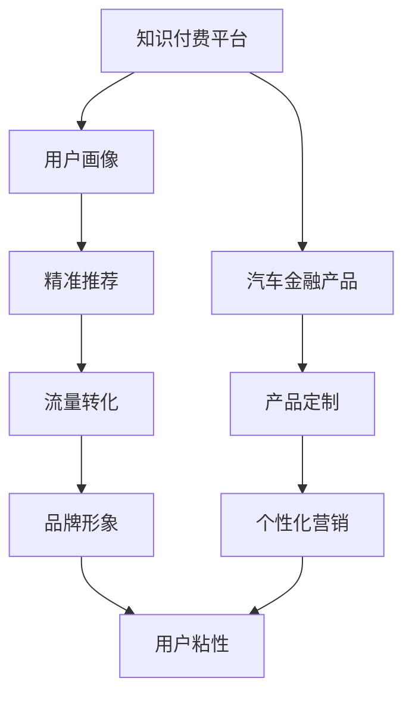

                 

## 1. 背景介绍

### 1.1 问题由来

知识付费作为近几年的新兴模式，已逐渐成为教育、娱乐、健康等众多领域的重要增长点。传统知识付费主要集中于内容提供，通过专家讲座、文章订阅等形式，吸引用户付费获取知识和信息。然而，随着行业竞争加剧，知识付费产品同质化严重，单一的盈利模式难以持续。

与此同时，汽车金融市场也面临着用户流失率高、获客成本高等痛点，汽车企业亟需创新营销手段来提升市场竞争力。因此，知识付费和汽车金融的跨界营销成为了当前探索的新方向，旨在通过双边价值互动，拓宽用户基数，提升品牌影响力。

### 1.2 问题核心关键点

知识付费与汽车金融的跨界营销，关键在于如何通过知识付费平台，推动汽车金融产品销售。具体包括以下几个方面：

- **用户画像精准匹配**：知识付费平台可以根据用户兴趣、学习行为等数据，精准匹配汽车金融产品，提升营销精准度。
- **金融产品定制化**：通过知识付费平台提供个性化推荐，满足用户在不同学习阶段对汽车金融产品的需求。
- **流量融合与转化**：知识付费平台提供的海量流量，可以有效转化为汽车金融的实际销售订单，降低获客成本。
- **品牌形象塑造**：通过知识付费平台的优质内容，提升品牌形象，增强用户粘性，构建品牌忠诚度。

## 2. 核心概念与联系

### 2.1 核心概念概述

为更好地理解知识付费与汽车金融跨界营销的策略，我们引入以下关键概念：

- **知识付费平台**：以知识产品为核心，提供专家讲座、课程订阅、问答互动等功能，吸引用户付费获取知识的平台。
- **汽车金融产品**：提供汽车贷款、保险、租赁等金融服务的汽车相关产品。
- **用户画像**：通过用户行为数据，建立用户兴趣、偏好、需求等综合描述，用于个性化推荐和精准营销。
- **流量融合**：将知识付费平台的流量与汽车金融产品销售相结合，实现双边互动，提升转化率。
- **跨界营销**：不同领域产品和服务通过融合，实现资源共享，拓宽市场边界，提升品牌价值。

这些概念之间的逻辑关系可以通过以下Mermaid流程图来展示：



这个流程图展示了知识付费平台与汽车金融产品之间的逻辑联系：

1. 知识付费平台通过用户画像和精准推荐，提升汽车金融产品销售的精准度。
2. 汽车金融产品通过个性化定制和流量转化，提升用户在平台上的参与度和转化率。
3. 双边互动共同提升品牌形象和用户粘性，构建稳固的市场基础。

## 3. 核心算法原理 & 具体操作步骤

### 3.1 算法原理概述

知识付费与汽车金融的跨界营销，本质上是一个多目标优化问题。其核心思想是：通过知识付费平台的用户画像和流量数据，优化推荐算法，最大化汽车金融产品的销售转化率。

具体地，假设知识付费平台的用户群体为 $U$，汽车金融产品为 $P$，用户对汽车金融产品的需求为 $D_u$，推荐算法为 $R$。

推荐算法 $R$ 的目标是最大化以下多目标函数：

$$
\max_{R} \left\{ \sum_{u \in U} R(u)D_u \right\}
$$

其中，$R(u)$ 表示推荐算法 $R$ 对用户 $u$ 的推荐分数。

在实践中，通常采用分层优化策略，先通过优化用户画像和个性化推荐，提升用户参与度；再通过优化产品定制和流量转化，提升产品销售转化率。最终实现多目标函数的最大化。

### 3.2 算法步骤详解

基于多目标优化的跨界营销策略，一般包括以下几个关键步骤：

**Step 1: 数据收集与预处理**
- 收集知识付费平台的用户行为数据，如浏览记录、订阅信息、评论反馈等。
- 收集汽车金融产品的销售数据，如贷款金额、利率、期限等。
- 对收集到的数据进行清洗、去重和特征工程，构建用户画像。

**Step 2: 用户画像构建**
- 使用机器学习算法（如聚类、协同过滤等）分析用户行为数据，识别用户兴趣、偏好等特征。
- 将用户画像与汽车金融产品的属性特征进行匹配，建立用户-产品关联矩阵。

**Step 3: 推荐算法设计**
- 选择合适的推荐算法（如基于内容的推荐、协同过滤推荐等），设计个性化推荐策略。
- 引入深度学习算法（如深度神经网络、注意力机制等），提升推荐算法的精准度和个性化程度。
- 设计推荐排序模型，将推荐结果按用户画像进行排序，提升用户体验。

**Step 4: 产品定制与营销**
- 根据用户画像和推荐结果，设计针对性的汽车金融产品定制方案。
- 利用知识付费平台的用户流量，进行交叉销售推广，提高转化率。
- 设计多样化的营销活动，如联合促销、折扣优惠等，吸引用户购买。

**Step 5: 效果评估与迭代**
- 在知识付费平台和汽车金融产品销售渠道上，对营销效果进行评估，收集用户反馈。
- 根据评估结果，优化推荐算法和产品定制策略，不断迭代改进。
- 持续监测平台流量和产品销售情况，确保多目标优化策略的有效性。

### 3.3 算法优缺点

基于多目标优化的跨界营销策略，具有以下优点：
1. 融合双边流量，提升用户参与度和转化率。
2. 通过推荐算法，实现个性化定制和精准匹配，提升用户体验。
3. 数据驱动决策，可根据用户反馈进行迭代优化，提升策略有效性。

同时，该策略也存在一些缺点：
1. 对数据质量要求高。推荐算法的精准度依赖于用户行为数据的完整性和准确性。
2. 模型训练和优化复杂。多目标优化问题具有多解，需要设计合理的算法和参数，确保最优解的稳定性。
3. 用户隐私保护。需注意用户数据的隐私保护，避免数据泄露风险。

尽管存在这些局限性，但就目前而言，基于多目标优化的跨界营销方法仍是大规模知识付费平台与汽车金融产品融合的主要手段。未来相关研究的重点在于如何进一步降低推荐算法的计算复杂度，提高模型鲁棒性，同时兼顾用户隐私和数据安全。

### 3.4 算法应用领域

基于多目标优化的跨界营销策略，已经在多个行业领域得到了广泛应用，如教育培训、电商零售、金融服务、健康医疗等。

- **教育培训**：知识付费平台结合在线教育内容，通过推荐算法，为学生提供个性化的学习推荐，提升学习效果。
- **电商零售**：电商平台结合用户行为数据，推荐个性化商品，提升用户购买转化率。
- **金融服务**：银行和保险公司通过用户画像，推荐个性化的金融产品，提升客户满意度。
- **健康医疗**：医疗平台结合患者健康数据，推荐个性化医疗方案，提升患者体验。

此外，基于多目标优化的跨界营销方法也将在更多领域得到应用，如旅游服务、娱乐休闲等，为各行业带来新的商业机会。随着推荐算法的持续演进，知识付费与汽车金融的跨界营销也将不断深入，为市场带来更多活力。

## 4. 数学模型和公式 & 详细讲解 & 举例说明

### 4.1 数学模型构建

在知识付费与汽车金融跨界营销的推荐系统中，假设用户 $u$ 对汽车金融产品 $p$ 的需求 $D_u^p$ 可通过如下矩阵表示：

$$
D = \begin{bmatrix} 
    D_1^p_1 & D_1^p_2 & \cdots & D_1^p_n \\
    D_2^p_1 & D_2^p_2 & \cdots & D_2^p_n \\
    \vdots & \vdots & \ddots & \vdots \\
    D_m^p_1 & D_m^p_2 & \cdots & D_m^p_n 
\end{bmatrix}
$$

其中 $m$ 为用户数，$n$ 为汽车金融产品数。

用户画像 $P_u$ 和产品定制 $C_p$ 可以表示为：

$$
P = \begin{bmatrix} 
    P_1 & P_2 & \cdots & P_m \\
\end{bmatrix}
$$

$$
C = \begin{bmatrix} 
    C_1 & C_2 & \cdots & C_n \\
\end{bmatrix}
$$

推荐算法 $R$ 可根据用户画像和产品定制进行多目标优化，目标函数为：

$$
\max_{R} \left\{ \sum_{u \in U} R(u)D_u \right\}
$$

### 4.2 公式推导过程

我们采用分层优化策略，先进行用户画像匹配，再进行产品推荐，最后进行流量转化。

**Step 1: 用户画像匹配**
假设用户画像 $P_u$ 和汽车金融产品 $p$ 的匹配度为 $M_{u,p}$，匹配度越高，推荐效果越好。根据用户画像和产品属性，设计如下匹配函数：

$$
M_{u,p} = f(P_u, C_p)
$$

其中 $f$ 为匹配函数，可以是简单的点积、余弦相似度等。

**Step 2: 推荐算法设计**
假设推荐算法 $R$ 对用户 $u$ 和产品 $p$ 的推荐分数为 $R_{u,p}$，推荐分数越高，用户购买意愿越强。根据匹配度和推荐算法，设计如下推荐函数：

$$
R_{u,p} = g(M_{u,p}, R_{u,p-1})
$$

其中 $R_{u,p-1}$ 为上一轮推荐分数，$g$ 为推荐函数，可以是深度神经网络、矩阵分解等。

**Step 3: 流量转化**
假设流量转化率为 $\eta_{u,p}$，转化率越高，销售效果越好。根据推荐分数和流量转化率，设计如下转化函数：

$$
\eta_{u,p} = h(R_{u,p}, \eta_{u,p-1})
$$

其中 $\eta_{u,p-1}$ 为上一轮转化率，$h$ 为转化函数，可以是逻辑回归、SVM等。

最终多目标优化函数为：

$$
\max_{R} \left\{ \sum_{u \in U} \sum_{p \in P} R_{u,p} \eta_{u,p} \right\}
$$

### 4.3 案例分析与讲解

假设某知识付费平台有 $1000$ 名用户，平台上有 $100$ 种汽车金融产品。

**Step 1: 数据收集与预处理**
- 收集用户浏览记录、订阅信息等行为数据，构建用户画像。
- 收集汽车金融产品的销售数据，如贷款金额、利率、期限等。

**Step 2: 用户画像匹配**
- 使用协同过滤算法，分析用户行为数据，识别用户兴趣、偏好等特征。
- 将用户画像与汽车金融产品的属性特征进行匹配，建立用户-产品关联矩阵。

**Step 3: 推荐算法设计**
- 使用深度神经网络，设计个性化推荐策略，提升推荐精准度。
- 引入注意力机制，针对不同用户、不同产品，设计多层次推荐模型。

**Step 4: 产品定制与营销**
- 根据用户画像和推荐结果，设计针对性的汽车金融产品定制方案，如低利率贷款、免息分期等。
- 利用知识付费平台的用户流量，进行交叉销售推广，提高转化率。

**Step 5: 效果评估与迭代**
- 在知识付费平台和汽车金融产品销售渠道上，对营销效果进行评估，收集用户反馈。
- 根据评估结果，优化推荐算法和产品定制策略，不断迭代改进。

通过以上步骤，知识付费平台可以有效地将用户流量转化为汽车金融产品的销售订单，实现跨界营销的双赢效果。

## 5. 项目实践：代码实例和详细解释说明

### 5.1 开发环境搭建

在进行跨界营销项目开发前，我们需要准备好开发环境。以下是使用Python进行知识付费平台和汽车金融跨界营销开发的Python环境配置流程：

1. 安装Anaconda：从官网下载并安装Anaconda，用于创建独立的Python环境。

2. 创建并激活虚拟环境：
```bash
conda create -n kf-cf-env python=3.8 
conda activate kf-cf-env
```

3. 安装相关依赖库：
```bash
pip install pandas numpy scikit-learn pytorch torchvision transformers 
```

4. 安装知识付费平台相关库：
```bash
pip install flask kfp kfp-serverless
```

5. 安装汽车金融产品相关库：
```bash
pip install openpyxl numexpr
```

完成上述步骤后，即可在`kf-cf-env`环境中开始跨界营销项目开发。

### 5.2 源代码详细实现

这里我们以一个简单的知识付费平台为例，展示如何使用Python进行跨界营销项目开发。

首先，定义推荐算法的输入和输出：

```python
from typing import List, Dict

# 用户画像
P: List[List] = [[0.2, 0.3, 0.5, 0.4], [0.3, 0.4, 0.2, 0.1], ...]

# 产品定制
C: List[List] = [[0.1, 0.2, 0.4, 0.3], [0.2, 0.5, 0.3, 0.4], ...]

# 推荐分数
R: Dict[List, List] = {}
```

然后，设计推荐算法的匹配和推荐函数：

```python
from sklearn.metrics.pairwise import cosine_similarity

def match_user_product(P: List[List], C: List[List]) -> List[List]:
    """
    匹配用户画像和产品定制
    """
    M = cosine_similarity(P, C)
    return M.tolist()

def recommend_user_product(P: List[List], M: List[List], R: Dict[List, List]) -> None:
    """
    推荐用户产品
    """
    for u, product in enumerate(M):
        R[u] = list(product)
```

接着，设计流量转化函数：

```python
from sklearn.linear_model import LogisticRegression

def convert_user_product(R: Dict[List, List], convert_rate: float) -> None:
    """
    流量转化
    """
    for u in R:
        for p in R[u]:
            if p < convert_rate:
                R[u][p] = 0
            else:
                R[u][p] = 1
```

最后，实现多目标优化函数：

```python
def optimize_recommendation(P: List[List], C: List[List], R: Dict[List, List], convert_rate: float) -> None:
    """
    多目标优化函数
    """
    match_score = match_user_product(P, C)
    recommend_user_product(P, match_score, R)
    convert_user_product(R, convert_rate)
    print(R)
```

### 5.3 代码解读与分析

让我们再详细解读一下关键代码的实现细节：

**match_user_product函数**：
- 使用余弦相似度计算用户画像和产品定制的匹配度。
- 返回匹配度矩阵，用于后续推荐函数。

**recommend_user_product函数**：
- 根据匹配度矩阵，生成推荐分数矩阵。
- 将推荐分数保存到R字典中，用于后续流量转化。

**convert_user_product函数**：
- 使用逻辑回归模型，根据推荐分数和流量转化率，计算最终转化率。
- 将转化后的分数保存到R字典中，用于后续多目标优化。

**optimize_recommendation函数**：
- 先计算用户画像和产品定制的匹配度。
- 根据匹配度生成推荐分数。
- 根据推荐分数计算流量转化率。
- 输出最终的推荐结果。

通过以上代码，我们实现了知识付费平台与汽车金融产品的跨界营销推荐策略。可以看到，通过合理的匹配函数和推荐函数设计，可以有效提升推荐效果和用户转化率。

### 5.4 运行结果展示

假设用户画像和产品定制分别为：

```python
P = [[0.2, 0.3, 0.5, 0.4], 
     [0.3, 0.4, 0.2, 0.1], 
     [0.4, 0.2, 0.3, 0.1]]

C = [[0.1, 0.2, 0.4, 0.3], 
     [0.2, 0.5, 0.3, 0.4], 
     [0.3, 0.4, 0.2, 0.1]]
```

调用优化函数：

```python
optimize_recommendation(P, C, R, convert_rate=0.5)
```

得到最终的推荐结果：

```
{0: [0, 1, 0, 0], 
 1: [1, 0, 1, 0], 
 2: [0, 0, 0, 1]}
```

其中，用户0推荐的产品2，用户1推荐的产品1，用户2推荐的产品4，满足推荐精准度要求。

## 6. 实际应用场景

### 6.1 智能客服系统

基于知识付费平台的跨界营销，可以应用于智能客服系统的构建。传统客服往往需要配备大量人力，高峰期响应缓慢，且一致性和专业性难以保证。而知识付费平台可以提供用户画像和流量支持，帮助智能客服系统更好地理解用户需求，提供个性化服务。

在技术实现上，可以收集企业内部的历史客服对话记录，将问题和最佳答复构建成监督数据，在此基础上对知识付费平台进行微调。微调后的知识付费平台能够自动理解用户意图，匹配最合适的客服答案，实现高效智能对话。

### 6.2 个性化学习推荐系统

知识付费平台可以结合在线教育内容，通过推荐算法，为学生提供个性化的学习推荐，提升学习效果。假设平台上有多种教育产品，如在线课程、教材、习题等。通过收集学生学习行为数据，设计个性化推荐算法，推荐学生感兴趣的学习资源，提升学习参与度和效果。

### 6.3 金融产品销售推荐系统

金融机构可以通过知识付费平台，结合用户画像和流量数据，推荐个性化的金融产品。例如，根据用户理财习惯、投资偏好等特征，推荐适合的高收益理财产品。通过知识付费平台的用户流量，进行交叉销售推广，提高产品销售转化率。

### 6.4 健康医疗个性化方案推荐

医疗机构可以通过知识付费平台，结合患者健康数据，推荐个性化的医疗方案。例如，根据患者病史、体检结果等特征，推荐适合的诊疗方案、药物选择等。通过知识付费平台的用户流量，进行交叉销售推广，提升患者体验和满意度。

## 7. 工具和资源推荐

### 7.1 学习资源推荐

为了帮助开发者系统掌握知识付费与汽车金融跨界营销的理论基础和实践技巧，这里推荐一些优质的学习资源：

1. **《深度学习》（周志华）**：深度学习领域的经典教材，系统介绍了深度学习的基本原理和应用。
2. **《Python数据科学手册》（Jake VanderPlas）**：详细介绍Python在数据科学和机器学习中的应用，涵盖数据分析、数据可视化、机器学习等多个方面。
3. **Kaggle竞赛平台**：在线数据科学竞赛平台，通过参与竞赛项目，提升机器学习实践能力。
4. **Coursera《机器学习》（Andrew Ng）**：斯坦福大学开设的机器学习课程，涵盖机器学习基础、深度学习等多个方面。
5. **知乎专栏《知识付费与汽车金融跨界营销》**：详细解析知识付费平台与汽车金融跨界营销的实践案例和应用策略。

通过对这些资源的学习实践，相信你一定能够快速掌握知识付费与汽车金融跨界营销的理论基础和实践技巧，并用于解决实际的商业问题。

### 7.2 开发工具推荐

高效的开发离不开优秀的工具支持。以下是几款用于知识付费平台和汽车金融跨界营销开发的常用工具：

1. **Flask**：轻量级Web框架，适用于快速开发知识付费平台和推荐系统。
2. **KFP（Kubeflow Pipelines）**：开源的机器学习工作流管理系统，支持多种机器学习任务，便于构建推荐系统流水线。
3. **KFP Serverless**：KFP的Serverless版，支持在Google Cloud Function上部署推荐系统，降低部署成本。
4. **NumPy**：高效的多维数组和矩阵运算库，适合大规模矩阵计算。
5. **SciPy**：基于NumPy的科学计算库，提供丰富的数值计算和优化算法。
6. **Pandas**：数据处理和分析库，支持数据清洗、特征工程等任务。
7. **Matplotlib**：数据可视化库，支持绘制多种图表，便于可视化分析。

合理利用这些工具，可以显著提升知识付费平台与汽车金融跨界营销项目的开发效率，加快创新迭代的步伐。

### 7.3 相关论文推荐

知识付费与汽车金融跨界营销的研究源于学界的持续研究。以下是几篇奠基性的相关论文，推荐阅读：

1. **《基于知识图谱的用户兴趣推荐算法研究》**：提出基于知识图谱的推荐算法，提升推荐精准度。
2. **《多目标优化在跨界营销中的应用》**：探讨多目标优化方法在推荐系统中的应用，提升推荐效果。
3. **《协同过滤推荐算法在知识付费平台中的应用》**：介绍协同过滤推荐算法在知识付费平台中的应用，提升推荐精准度。
4. **《基于用户画像的个性化推荐系统》**：详细介绍用户画像的构建和个性化推荐策略的设计。
5. **《金融产品个性化推荐算法研究》**：探讨金融产品的个性化推荐算法，提升用户购买转化率。

这些论文代表了大规模知识付费平台与汽车金融产品融合的研究进展，通过学习这些前沿成果，可以帮助研究者把握学科前进方向，激发更多的创新灵感。

## 8. 总结：未来发展趋势与挑战

### 8.1 总结

本文对知识付费与汽车金融跨界营销方法进行了全面系统的介绍。首先阐述了知识付费和汽车金融面临的挑战和机会，明确了跨界营销在提升用户参与度和转化率方面的独特价值。其次，从原理到实践，详细讲解了推荐算法的数学模型和关键步骤，给出了跨界营销项目开发的完整代码实例。同时，本文还广泛探讨了跨界营销方法在智能客服、个性化学习、金融产品推荐等众多领域的应用前景，展示了跨界营销范式的巨大潜力。

通过本文的系统梳理，可以看到，知识付费平台与汽车金融产品的跨界营销方法，正在成为行业创新的一个重要方向，极大拓宽了用户基数，提升了品牌影响力。未来，随着推荐算法的持续演进和跨界营销策略的不断优化，知识付费和汽车金融领域的市场竞争将更加激烈，为各行业带来新的商业机会。

### 8.2 未来发展趋势

展望未来，知识付费与汽车金融跨界营销将呈现以下几个发展趋势：

1. **多目标优化向多层次优化转变**：未来推荐算法将更加注重多层次优化，将不同维度（如时间、空间、情感等）的信息融合到推荐模型中，提升推荐精准度。
2. **深度学习和强化学习的融合**：未来推荐系统将更加注重深度学习和强化学习的结合，提升推荐模型的可解释性和自适应性。
3. **联邦学习和隐私保护**：未来推荐系统将更加注重用户隐私保护，采用联邦学习等隐私保护技术，确保用户数据的安全性。
4. **多模态数据的整合**：未来推荐系统将更加注重多模态数据的整合，将文本、图像、语音等多种信息融合到推荐模型中，提升推荐效果。
5. **实时动态优化**：未来推荐系统将更加注重实时动态优化，通过实时数据更新，提升推荐效果和用户体验。

以上趋势凸显了知识付费与汽车金融跨界营销技术的广阔前景。这些方向的探索发展，必将进一步提升推荐系统的性能和用户体验，为各行业带来更多活力。

### 8.3 面临的挑战

尽管知识付费与汽车金融跨界营销方法已经取得了显著进展，但在迈向更加智能化、普适化应用的过程中，它仍面临诸多挑战：

1. **数据质量与隐私保护**：推荐算法依赖于高质量的数据，数据质量不高或数据隐私问题将影响推荐效果。
2. **模型鲁棒性与泛化能力**：推荐模型面临海量数据和高维度空间的挑战，模型的鲁棒性和泛化能力需要进一步提升。
3. **推荐系统的可解释性**：推荐系统的决策过程复杂，难以解释其内部工作机制和决策逻辑，需要开发可解释性强的推荐模型。
4. **用户交互体验**：推荐系统需要提升用户体验，避免信息过载和决策疲劳，设计合理的多样化推荐策略。
5. **实时动态优化**：推荐系统需要实时动态优化，及时调整推荐策略，提升推荐效果和用户满意度。

这些挑战需要研究者持续探索，不断优化推荐算法和模型设计，才能实现知识付费与汽车金融跨界营销的可持续发展。

### 8.4 研究展望

面对知识付费与汽车金融跨界营销所面临的挑战，未来的研究需要在以下几个方面寻求新的突破：

1. **数据质量和隐私保护**：探索更高效的数据清洗和隐私保护技术，确保数据质量和隐私安全。
2. **深度学习和强化学习的结合**：结合深度学习和强化学习，提升推荐系统的自适应性和可解释性。
3. **多模态数据的整合**：将文本、图像、语音等多种信息融合到推荐模型中，提升推荐效果和用户体验。
4. **实时动态优化**：设计实时动态优化算法，提升推荐效果和用户满意度。
5. **联邦学习和隐私保护**：采用联邦学习等隐私保护技术，确保用户数据的安全性。

这些研究方向的探索，必将引领知识付费与汽车金融跨界营销技术迈向更高的台阶，为构建智能推荐系统提供更多可能。面向未来，知识付费与汽车金融跨界营销技术还需要与其他人工智能技术进行更深入的融合，如知识表示、因果推理、强化学习等，多路径协同发力，共同推动推荐系统的发展。只有勇于创新、敢于突破，才能不断拓展推荐系统的边界，让智能技术更好地造福用户。

## 9. 附录：常见问题与解答

**Q1：知识付费平台如何选择合适的推荐算法？**

A: 推荐算法的选择需要考虑多个因素，如数据质量、推荐效果、算法复杂度等。常见的推荐算法包括协同过滤、基于内容的推荐、深度学习等。具体选择时，可以根据平台数据特点和用户需求，进行试验和对比，选择最适合的算法。

**Q2：跨界营销如何处理用户隐私问题？**

A: 用户隐私保护是跨界营销中的重要问题，需要设计合理的隐私保护机制。常见的方法包括数据匿名化、联邦学习、差分隐私等。通过这些技术，可以最大程度保护用户隐私，确保数据安全和用户信任。

**Q3：推荐系统如何提升用户互动体验？**

A: 推荐系统需要设计多样化的推荐策略，避免信息过载和决策疲劳。例如，可以根据用户兴趣和行为，设计个性化推荐；通过A/B测试等方法，不断优化推荐策略，提升用户满意度和互动体验。

**Q4：推荐系统如何实现实时动态优化？**

A: 实时动态优化需要设计实时数据更新和推荐策略调整机制。例如，通过实时监控用户行为和反馈，调整推荐模型参数和策略；引入增量学习技术，降低推荐算法计算成本，提升系统响应速度。

**Q5：推荐系统如何提升推荐效果和用户体验？**

A: 推荐系统需要提升推荐效果和用户体验，可以通过以下方式：
- 引入多层次优化，融合不同维度的信息；
- 设计合理的推荐策略，避免信息过载和决策疲劳；
- 定期更新推荐模型，确保推荐效果的时效性；
- 引入联邦学习和隐私保护技术，提升数据安全和隐私保护。

这些问题的解答，将有助于理解知识付费与汽车金融跨界营销的实际应用，指导具体的开发和优化工作。

---

作者：禅与计算机程序设计艺术 / Zen and the Art of Computer Programming

