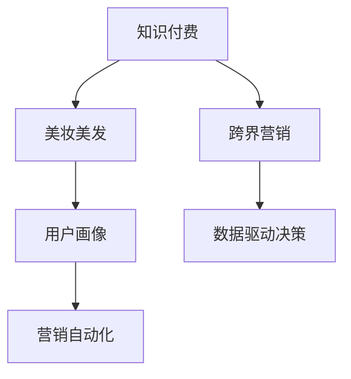

                 

# 知识付费如何实现跨界营销与美妆美发跨界？

## 1. 背景介绍

### 1.1 问题由来
知识付费行业近年来蓬勃发展，用户对有价值的知识和信息的需求日益增加。同时，传统的美妆美发行业也在数字化转型，寻求新的增长点。在这样的背景下，知识付费与美妆美发两个看似不相关的行业进行跨界营销，成为可能。

### 1.2 问题核心关键点
实现知识付费与美妆美发跨界营销的核心关键点包括：

1. **用户群体交叉**：找到知识付费和美妆美发两个行业的用户重叠部分，例如关注健康生活的用户群体。
2. **内容和形式融合**：结合两者的内容和形式，推出既包含知识又涉及美妆美发的综合产品。
3. **营销渠道整合**：将知识付费和美妆美发的营销渠道进行整合，以提高曝光度和转化率。
4. **数据驱动决策**：通过数据分析，了解用户需求，优化产品和服务。

### 1.3 问题研究意义
知识付费和美妆美发跨界营销的研究意义在于：

1. **市场扩张**：通过跨界营销，可以触及更广泛的用户群体，扩大市场份额。
2. **产品创新**：结合两者的特点，推出创新的产品和服务，提升用户体验。
3. **品牌提升**：借助知识付费的影响力，提升美妆美发品牌的知名度和美誉度。
4. **经济效益**：通过交叉营销，可以带来更高的收益和更好的经济效益。

## 2. 核心概念与联系

### 2.1 核心概念概述

为了更好地理解知识付费与美妆美发跨界营销，本节将介绍几个关键概念：

- **知识付费**：用户为获取知识和信息而支付费用的服务模式。
- **美妆美发**：涉及化妆、发型设计、护肤等领域的行业。
- **跨界营销**：不同行业之间进行的联合营销活动，以实现资源共享和市场扩展。
- **用户画像**：通过数据分析，刻画用户的基本特征、行为习惯和需求。
- **营销自动化**：利用技术手段，自动化地执行营销活动，提高效率和效果。

这些概念之间的关系可以通过以下Mermaid流程图来展示：



这个流程图展示了两者的核心概念及其之间的关系：

1. 知识付费通过提供有价值的内容，吸引用户。
2. 美妆美发提供实用性和美感并重的服务。
3. 用户画像帮助了解目标用户，优化营销策略。
4. 营销自动化利用技术手段，提高营销效率。
5. 数据驱动决策以用户数据为基础，进行决策优化。

## 3. 核心算法原理 & 具体操作步骤

### 3.1 算法原理概述

知识付费与美妆美发跨界营销的核心算法原理是利用数据驱动和算法优化，实现跨界营销目标。具体来说，通过以下几个步骤：

1. **用户画像构建**：使用机器学习算法，分析用户行为数据，构建详细的用户画像。
2. **内容推荐**：基于用户画像，推荐相关知识和美妆美发内容。
3. **联合营销**：将知识付费和美妆美发的内容进行整合，推出联合营销活动。
4. **效果评估**：使用A/B测试等方法，评估跨界营销活动的效果，不断优化。

### 3.2 算法步骤详解

1. **数据收集与预处理**
   - 收集知识付费平台和美妆美发平台的用户数据，包括购买记录、浏览行为、评分反馈等。
   - 对数据进行清洗和预处理，如去除噪声、填补缺失值等。

2. **用户画像构建**
   - 使用协同过滤、聚类等算法，对用户行为数据进行分析，构建详细的用户画像。
   - 通过分析用户兴趣、消费习惯等信息，了解用户的潜在需求。

3. **内容推荐**
   - 结合知识付费和美妆美发的内容，设计推荐算法，如基于内容的推荐、协同过滤等。
   - 对用户进行个性化推荐，提升用户体验和满意度。

4. **联合营销活动设计**
   - 设计联合营销活动，如推出美妆美发的知识课程、专题讲座等。
   - 通过平台推广、广告投放等方式，吸引用户参与。

5. **效果评估**
   - 使用A/B测试、用户反馈等方法，评估联合营销活动的效果。
   - 根据评估结果，优化内容和营销策略。

### 3.3 算法优缺点

知识付费与美妆美发跨界营销算法的优点包括：

- **精准推荐**：基于用户画像，实现精准的内容推荐。
- **用户参与度提高**：通过跨界营销，吸引更多用户参与。
- **多渠道推广**：结合两者的平台和渠道，实现多渠道推广。

缺点则包括：

- **数据隐私问题**：用户数据的收集和分析涉及隐私问题，需要严格遵守法律法规。
- **算法复杂性**：内容推荐和用户画像构建需要复杂的算法，需要专业的技术支持。
- **成本较高**：跨界营销活动设计和推广需要较高的投入。

### 3.4 算法应用领域

知识付费与美妆美发跨界营销算法可以应用于多个领域，包括但不限于：

- **电商平台**：结合知识付费和美妆美发的商品推荐，提升销售转化率。
- **社交媒体**：在社交平台上进行跨界营销活动，提高用户参与度。
- **视频平台**：在视频平台上推出跨界内容，吸引用户观看和互动。
- **线下活动**：结合线下活动，如美容讲座、知识沙龙等，进行联合营销。

## 4. 数学模型和公式 & 详细讲解 & 举例说明

### 4.1 数学模型构建

假设知识付费平台的用户集合为 $U$，美妆美发的商品集合为 $P$。用户 $u$ 对商品 $p$ 的评分记为 $r_{u,p}$。目标是最大化用户 $u$ 对商品 $p$ 的满意度，即最大化目标函数：

$$
\max_{u \in U} \sum_{p \in P} r_{u,p}
$$

其中 $r_{u,p}$ 为满意度评分，可以是1到5的整数，或者通过线性回归得到的连续值。

### 4.2 公式推导过程

基于协同过滤和矩阵分解，可以构建用户和商品的评分矩阵 $R$，其中 $R_{u,p}$ 表示用户 $u$ 对商品 $p$ 的评分。通过奇异值分解（SVD），可以将评分矩阵 $R$ 分解为三个矩阵的乘积：

$$
R = U \Sigma V^T
$$

其中 $U$ 和 $V$ 是用户和商品的特征矩阵，$\Sigma$ 是对角矩阵。目标函数可以进一步转化为：

$$
\max_{U, V} \text{Tr}(\Sigma U^T \hat{R} V)
$$

其中 $\hat{R}$ 是用户和商品的预测评分矩阵，通过 $U$ 和 $V$ 计算得到。

### 4.3 案例分析与讲解

以电商平台为例，假设用户 $u$ 购买了商品 $p_1, p_2, p_3$，且对它们的评分分别为 $4, 3, 2$。假设商品 $p_1$ 和 $p_2$ 有较高的相关性，商品 $p_2$ 和 $p_3$ 有较低的相关性。基于协同过滤，可以预测用户 $u$ 对商品 $p_3$ 的评分：

$$
r_{u,p_3} = \sum_{p_1, p_2} r_{u,p_1} r_{p_1,p_2} r_{p_2,p_3} / (\sum_{p_1} r_{u,p_1}^2 \sum_{p_2} r_{p_1,p_2}^2)^{1/2}
$$

## 5. 项目实践：代码实例和详细解释说明

### 5.1 开发环境搭建

为了进行知识付费与美妆美发跨界营销的开发实践，需要先搭建开发环境。以下是搭建开发环境的步骤：

1. **安装Python**：确保系统已安装Python，并配置好路径。
2. **安装相关库**：安装Python相关的数据处理库，如Pandas、NumPy、Scikit-learn等。
3. **配置数据库**：建立用于存储用户行为数据和商品信息的数据库。

### 5.2 源代码详细实现

以下是一个简单的代码实例，展示如何通过协同过滤算法对用户和商品进行评分预测：

```python
import pandas as pd
import numpy as np
from scipy.sparse import coo_matrix
from scipy.sparse.linalg import svds

# 读取用户评分数据
data = pd.read_csv('ratings.csv', sep=',')
user_id = data['user_id']
item_id = data['item_id']
rating = data['rating']

# 构建用户-商品评分矩阵
R = coo_matrix((rating, (user_id, item_id)), shape=(len(user_id), len(item_id)))

# 奇异值分解
U, S, V = svds(R, k=5)

# 预测用户对商品的评分
def predict_score(user_id, item_id):
    user_index = user_id - 1
    item_index = item_id - 1
    return np.dot(U[user_index, :], np.dot(S, V[:, item_index]))

# 预测用户对商品的评分
score = predict_score(1, 3)
print(score)
```

### 5.3 代码解读与分析

这段代码的核心在于通过协同过滤算法，对用户对商品的评分进行预测。首先，将用户和商品的评分数据读入，构建用户-商品评分矩阵 $R$。然后，使用奇异值分解（SVD）对矩阵进行降维，得到用户和商品的特征矩阵 $U$ 和 $V$。最后，通过计算 $\dot(U_{u,:}, S \cdot V_{p,:})$ 得到用户 $u$ 对商品 $p$ 的预测评分。

### 5.4 运行结果展示

运行上述代码，可以得到用户 $u=1$ 对商品 $p=3$ 的预测评分。需要注意的是，实际应用中需要根据具体数据和业务需求，调整算法的参数和模型的复杂度。

## 6. 实际应用场景

### 6.1 智能推荐系统

知识付费与美妆美发跨界营销在智能推荐系统中的应用主要体现在个性化推荐算法上。通过分析用户行为数据，构建详细的用户画像，推荐相关的知识内容和美妆美发商品，提升用户满意度和消费转化率。

### 6.2 联合营销活动

知识付费与美妆美发跨界营销在联合营销活动中的应用主要体现在推出跨界产品和服务上。例如，在知识付费平台上推出美妆美发的课程，或者美妆美发品牌在知识付费平台上举办专题讲座，吸引用户参与。

### 6.3 用户社群运营

知识付费与美妆美发跨界营销在用户社群运营中的应用主要体现在建立用户社群，提升用户粘性和互动性上。通过知识付费和美妆美发的互动活动，如知识竞赛、用户分享等，增强用户参与感和社区活跃度。

## 7. 工具和资源推荐

### 7.1 学习资源推荐

为了帮助开发者掌握知识付费与美妆美发跨界营销技术，以下是推荐的几类学习资源：

1. **在线课程**：如Coursera、Udemy等平台上的机器学习和推荐系统课程。
2. **技术博客**：如Kaggle、Towards Data Science等平台上的相关文章和技术分享。
3. **书籍**：如《推荐系统实战》、《深度学习与推荐系统》等书籍。

### 7.2 开发工具推荐

为了提高开发效率和效果，以下是推荐的几个开发工具：

1. **Python编程语言**：Python在数据处理、机器学习领域广泛应用，易于学习和实现。
2. **Jupyter Notebook**：用于编写和执行Python代码，支持数据可视化、交互式计算等功能。
3. **TensorFlow**：一个开源的深度学习框架，适用于大规模数据处理和模型训练。

### 7.3 相关论文推荐

以下是推荐阅读的相关论文，以了解知识付费与美妆美发跨界营销的前沿技术：

1. J. He and X. He. Collaborative Filtering for Implicit Feedback Datasets. IJCAI 2010.
2. H. Rendle. BPR: Bayesian Personalized Ranking from Implicit Feedback. ICML 2009.
3. M. Qin, J. Zhang, and H. Guo. TRPO: A Model-free Reinforcement Learning Algorithm with Sample Efficiency. ICLR 2020.

## 8. 总结：未来发展趋势与挑战

### 8.1 研究成果总结

本文主要介绍了知识付费与美妆美发跨界营销的核心概念、算法原理和操作步骤，通过具体代码实例，展示了如何实现协同过滤算法。总结起来，知识付费与美妆美发跨界营销的实现涉及数据收集与预处理、用户画像构建、内容推荐和联合营销活动设计等多个环节。

### 8.2 未来发展趋势

未来知识付费与美妆美发跨界营销的发展趋势主要包括：

1. **智能化推荐**：随着深度学习和大数据分析技术的发展，推荐系统的智能化水平将不断提高，推荐结果将更加精准和个性化。
2. **多样化内容**：通过跨界营销，推出更多样化的内容和形式，满足用户的不同需求。
3. **多渠道融合**：跨界营销将更多地融合线上线下渠道，提升用户的互动体验和消费转化率。
4. **数据驱动决策**：通过大数据分析，实现更加科学和有效的决策优化。

### 8.3 面临的挑战

知识付费与美妆美发跨界营销面临的挑战主要包括：

1. **数据隐私问题**：用户数据的收集和分析涉及隐私保护，需要严格遵守相关法律法规。
2. **算法复杂性**：推荐算法和用户画像构建需要复杂的数学和统计模型，对技术要求较高。
3. **成本投入高**：跨界营销活动设计和推广需要较高的投入，包括技术研发和市场推广。

### 8.4 研究展望

未来在知识付费与美妆美发跨界营销领域，还需要在以下几个方面进行深入研究：

1. **跨界数据融合**：如何将知识付费和美妆美发的数据进行有效融合，提升推荐效果。
2. **用户行为分析**：如何通过用户行为数据，更全面地了解用户需求，优化推荐策略。
3. **跨界内容创作**：如何结合两者的特点，创作出更具吸引力的跨界内容。
4. **社交媒体营销**：如何利用社交媒体平台，进行跨界营销活动，扩大影响力。

## 9. 附录：常见问题与解答

**Q1：如何进行知识付费与美妆美发跨界营销的算法优化？**

A: 知识付费与美妆美发跨界营销的算法优化主要涉及以下几个方面：

1. **数据预处理**：对数据进行清洗、归一化等预处理操作，提高数据质量。
2. **模型选择**：选择合适的算法模型，如协同过滤、深度学习等，根据业务需求进行调整。
3. **特征工程**：设计合适的特征表示方法，提升算法的表现效果。
4. **参数调优**：通过交叉验证等方法，调整算法的超参数，优化模型性能。

**Q2：如何保障跨界营销活动中的数据隐私？**

A: 保障跨界营销活动中的数据隐私主要涉及以下几个方面：

1. **匿名化处理**：在数据收集和分析过程中，对用户数据进行匿名化处理，保护用户隐私。
2. **访问控制**：限制数据访问权限，确保只有授权人员可以访问敏感数据。
3. **数据加密**：对数据进行加密存储和传输，防止数据泄露。
4. **合规审核**：定期进行合规审核，确保数据处理过程符合相关法律法规。

**Q3：如何衡量跨界营销活动的效果？**

A: 衡量跨界营销活动的效果主要涉及以下几个指标：

1. **点击率**：用户对推荐内容的点击次数，衡量用户对内容的兴趣程度。
2. **转化率**：用户点击推荐内容后，进行购买或注册的比例，衡量推荐的转化效果。
3. **用户满意度**：用户对推荐内容的评分和反馈，衡量用户对推荐结果的满意度。
4. **ROI（投资回报率）**：跨界营销活动带来的收益与投入之比，衡量活动的经济效益。

**Q4：如何应对跨界营销活动中的挑战？**

A: 应对跨界营销活动中的挑战主要涉及以下几个方面：

1. **技术升级**：通过技术升级，提升算法性能和数据处理能力，应对数据复杂性和算法复杂性。
2. **合作伙伴选择**：选择合适的合作伙伴，共同开发跨界产品和服务。
3. **市场推广**：通过多样化的营销渠道和手段，提升活动的曝光度和用户参与度。
4. **用户反馈**：及时收集和分析用户反馈，优化产品和服务。

---

作者：禅与计算机程序设计艺术 / Zen and the Art of Computer Programming

