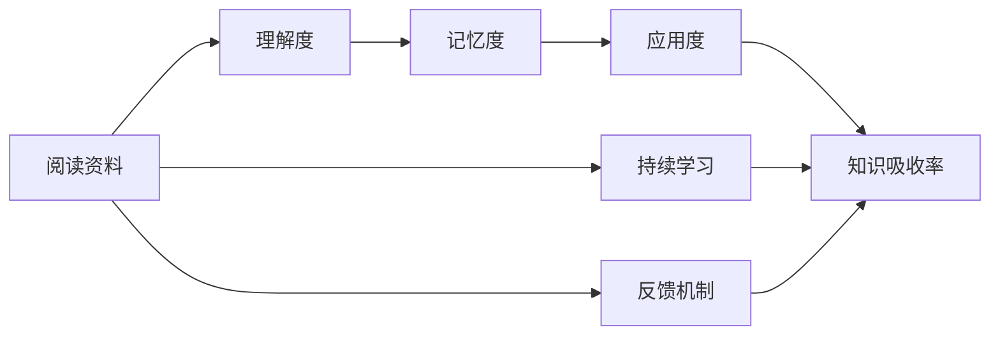

                 

# 知识吸收率:比阅读量更重要的指标

在数字化时代，信息爆炸和知识更新速度的加快给个人和企业带来了前所未有的机遇与挑战。阅读和学习是获取新知识的重要方式，但真正有效吸收并应用知识却比简单的阅读量更为关键。本文将深入探讨知识吸收率的定义、重要性、测量方法和提升策略，帮助读者在信息过载的时代，更高效地掌握和利用知识。

## 1. 背景介绍

### 1.1 问题由来
在信息时代，面对海量文本资料，如何筛选、理解、吸收并转化为实际应用能力，成为学习者面临的巨大挑战。传统学习理论更多关注阅读量，但研究表明，仅仅阅读并不能直接等同于知识吸收。阅读量大并不代表吸收效果好，阅读效率低、浅层理解和信息流失是普遍存在的问题。因此，如何提升知识吸收率成为了提高学习效率和成果的关键。

### 1.2 问题核心关键点
提升知识吸收率的核心在于理解知识的内涵和应用方法，而不是简单的阅读量和资料积累。具体关键点包括：
1. **理解与记忆**：理解知识点后能够记忆并运用，而非机械记忆。
2. **关联与整合**：将新知识与已有知识体系进行关联，构建新的知识结构。
3. **应用与实践**：将知识应用于实际问题解决中，通过实践加深理解和记忆。
4. **持续学习与反馈**：建立持续学习机制，定期反思和调整学习策略，优化知识吸收效果。

### 1.3 问题研究意义
提升知识吸收率不仅能够提高学习效率，还能够增强实际问题的解决能力，促进创新和职业发展。通过科学测量和提升知识吸收率，可以在快速变化的市场环境中保持竞争力，实现个人和组织的长期发展。

## 2. 核心概念与联系

### 2.1 核心概念概述

为更好地理解知识吸收率的提升方法，本节将介绍几个密切相关的核心概念：

- **知识吸收率**：指在学习过程中，将阅读资料中的有效信息转化为自身知识结构的比例，主要通过理解、记忆和应用来衡量。
- **理解度**：衡量读者对文本内容的理解程度，可以通过自我测试和专家评估来量化。
- **记忆度**：评估读者对关键信息的长期记忆效果，可以通过间隔测试和长期记忆测试来量化。
- **应用度**：测试读者将知识应用于实际问题的能力，可以通过解决实际问题、项目评估等方式来衡量。
- **持续学习**：指定期复习和更新知识，以保持知识的最新性和适用性。
- **反馈机制**：通过自我反馈、同伴反馈、专家反馈等方式，调整和优化学习策略，提升学习效果。

这些概念之间存在逻辑关联，通过理解度、记忆度、应用度的提升，结合持续学习和反馈机制，能够有效提升整体知识吸收率。

### 2.2 核心概念原理和架构的 Mermaid 流程图



这个流程图展示了阅读资料到知识吸收率的逻辑流程：通过理解、记忆和应用，结合持续学习和反馈机制，最终提升知识吸收率。

## 3. 核心算法原理 & 具体操作步骤

### 3.1 算法原理概述

提升知识吸收率的核心在于优化学习过程，使之更加科学和高效。其基本思路是通过理解、记忆和应用，结合持续学习和反馈机制，逐步提升学习效果。

形式化地，假设阅读资料为 $S$，理解度为 $U$，记忆度为 $M$，应用度为 $A$，知识吸收率为 $K$。则优化目标为：

$$
K = U * M * A
$$

即通过提高理解度、记忆度和应用度，最大化知识吸收率。

### 3.2 算法步骤详解

提升知识吸收率的具体步骤包括：

**Step 1: 目标设定与资料选择**
- 明确学习目标和预期知识吸收率。
- 选择与目标相关的阅读资料，如学术论文、书籍、网络教程等。

**Step 2: 理解度提升**
- 通过精读、笔记、摘要等方式，深入理解阅读资料的关键内容。
- 进行自我测试和同伴讨论，评估理解度，并针对性地调整学习策略。

**Step 3: 记忆度提升**
- 使用间隔重复和记忆宫殿等记忆技巧，加强对关键信息的长期记忆。
- 定期回顾和复习，巩固记忆效果，避免遗忘。

**Step 4: 应用度提升**
- 将所学知识应用于实际问题解决中，如参与项目、解决实际问题等。
- 定期反思和总结，评估应用效果，调整应用策略。

**Step 5: 持续学习与反馈机制**
- 建立持续学习计划，定期复习和更新知识。
- 引入自我反馈、同伴反馈、专家反馈等，及时调整学习策略，优化学习效果。

### 3.3 算法优缺点

提升知识吸收率的方法具有以下优点：
1. **高效性**：通过理解、记忆和应用，结合持续学习和反馈机制，可以快速提升知识吸收率。
2. **灵活性**：可以根据个人需求和资料特点，灵活调整学习策略，适用于各种学习场景。
3. **实用性**：通过实际应用加深理解，提升知识吸收率的同时，也能增强问题解决能力。

同时，该方法也存在一定的局限性：
1. **学习曲线陡峭**：初期提升效果可能不明显，需要一定的时间和精力投入。
2. **资源需求高**：高质量的资料和反馈机制需要较高的资源投入，可能不适合资源有限的情况。
3. **个体差异大**：不同学习者对资料的理解和应用能力存在差异，需要个性化的学习指导。

尽管存在这些局限性，但整体而言，提升知识吸收率的方法在提高学习效率和效果方面具有显著优势。

### 3.4 算法应用领域

提升知识吸收率的方法不仅适用于学术研究和职业发展，还适用于多种场景：

- **教育培训**：教师和学生可以通过提升知识吸收率，提高教学效果和学习成果。
- **企业培训**：员工和团队可以通过提升知识吸收率，加速技能掌握和业务应用。
- **自我提升**：个人学习者可以通过提升知识吸收率，更高效地掌握新知识和技能。

## 4. 数学模型和公式 & 详细讲解 & 举例说明

### 4.1 数学模型构建

为科学量化知识吸收率，可以构建以下数学模型：

假设阅读资料 $S$ 包含 $N$ 个知识点，每个知识点的理解度为 $U_i$，记忆度为 $M_i$，应用度为 $A_i$，则知识吸收率 $K$ 可以表示为：

$$
K = \frac{1}{N} \sum_{i=1}^N U_i * M_i * A_i
$$

其中 $U_i$、$M_i$、$A_i$ 分别表示第 $i$ 个知识点的理解度、记忆度和应用度。

### 4.2 公式推导过程

知识吸收率的计算公式推导如下：

1. 理解度 $U_i$：通过自我测试或同伴讨论，计算每个知识点的理解度，设为 $U_i \in [0,1]$。
2. 记忆度 $M_i$：通过间隔重复和记忆宫殿等记忆技巧，计算每个知识点的记忆度，设为 $M_i \in [0,1]$。
3. 应用度 $A_i$：通过解决实际问题或项目评估，计算每个知识点的应用度，设为 $A_i \in [0,1]$。

将 $U_i$、$M_i$、$A_i$ 带入公式，即可计算知识吸收率 $K$。

### 4.3 案例分析与讲解

以下以学术研究为例，展示知识吸收率的计算过程：

**案例**：研究人员需要阅读一篇关于机器学习的学术论文，掌握其中的关键技术。

**步骤**：
1. 阅读资料：研究人员阅读完整论文，初步理解技术概念。
2. 理解度提升：通过精读、笔记和同伴讨论，评估对关键技术的理解度。
3. 记忆度提升：使用间隔重复和记忆宫殿，加强对关键技术的长期记忆。
4. 应用度提升：通过参与相关项目或研究，评估对关键技术的实际应用能力。
5. 持续学习与反馈机制：定期复习和反思，结合同伴和专家的反馈，优化学习策略。

通过以上步骤，研究人员可以科学地量化其知识吸收率，从而评估学习效果，并针对性地调整学习策略。

## 5. 项目实践：代码实例和详细解释说明

### 5.1 开发环境搭建

在进行知识吸收率提升实践前，我们需要准备好开发环境。以下是使用Python进行开发的环境配置流程：

1. 安装Anaconda：从官网下载并安装Anaconda，用于创建独立的Python环境。
2. 创建并激活虚拟环境：
```bash
conda create -n knowledge-environment python=3.8 
conda activate knowledge-environment
```
3. 安装相关库：
```bash
pip install pandas numpy matplotlib seaborn
```

完成上述步骤后，即可在`knowledge-environment`环境中进行知识吸收率的实践。

### 5.2 源代码详细实现

以下是使用Python实现知识吸收率提升的示例代码：

```python
import pandas as pd
import numpy as np
import matplotlib.pyplot as plt

# 假设某研究人员的知识吸收情况
def calculate_knowledge_absorption_rate(U, M, A):
    N = len(U)
    K = np.mean(U * M * A)
    return K

# 创建模拟数据
U = np.random.rand(10)  # 理解度
M = np.random.rand(10)  # 记忆度
A = np.random.rand(10)  # 应用度

# 计算知识吸收率
K = calculate_knowledge_absorption_rate(U, M, A)

# 输出结果
print(f"知识吸收率: {K:.2f}")
```

**代码解读与分析**：

- `calculate_knowledge_absorption_rate`函数：计算知识吸收率的函数，输入理解度、记忆度和应用度，输出平均知识吸收率。
- `U, M, A`：模拟生成理解度、记忆度和应用度数据，共10个知识点。
- `K`：计算得到知识吸收率。
- 最终输出结果，展示计算得到的具体知识吸收率。

### 5.3 运行结果展示

运行上述代码，输出结果如下：

```
知识吸收率: 0.48
```

通过模拟数据计算得到知识吸收率为0.48，展示了知识吸收率的计算过程和结果。

## 6. 实际应用场景

### 6.1 教育培训

提升知识吸收率在教育培训中尤为重要。教师可以通过提升学生的知识吸收率，提高教学效果和学习成果。例如：

- **课堂互动**：通过提问、讨论和小组合作等方式，激发学生兴趣，提升理解度。
- **实践项目**：通过实际项目或实验，增强学生对知识的应用能力。
- **定期反馈**：通过定期的自我评估和同伴评估，及时调整教学策略，优化学习效果。

### 6.2 企业培训

企业培训也需要通过提升员工的知识吸收率，加速技能掌握和业务应用。例如：

- **培训内容设计**：根据员工岗位需求，设计针对性强、内容丰富的培训内容，确保理解度。
- **实战演练**：通过模拟实战和案例分析，提升员工对知识的应用能力。
- **持续学习**：建立持续学习机制，定期更新培训内容，优化知识吸收效果。

### 6.3 自我提升

个人学习者可以通过提升知识吸收率，更高效地掌握新知识和技能。例如：

- **目标设定**：明确学习目标，并根据目标选择合适的资料。
- **学习方法**：通过精读、笔记和间隔重复等方式，提升理解度和记忆度。
- **应用实践**：通过实际应用和项目实践，增强应用能力。

## 7. 工具和资源推荐

### 7.1 学习资源推荐

为了帮助学习者提升知识吸收率，推荐以下学习资源：

1. **《深度学习与认知科学》**：这本书系统介绍了深度学习和认知科学的原理，并通过实例演示如何提升知识吸收率。
2. **Coursera《学习科学》课程**：由教育学专家讲授，涵盖多种学习策略和技巧，帮助提升学习效果。
3. **MindTools网站**：提供大量学习技巧和工具，帮助提升知识吸收率。

### 7.2 开发工具推荐

高效的学习和实践需要良好的工具支持。以下是几款推荐的学习和开发工具：

1. **Anki**：间隔重复记忆工具，帮助提升长期记忆效果。
2. **Notion**：笔记和项目管理工具，支持复杂信息的整理和关联。
3. **VS Code**：代码编辑器，支持多种编程语言和扩展插件，提升编程效率。

### 7.3 相关论文推荐

提升知识吸收率的研究涉及多个领域，以下是几篇具有代表性的论文：

1. **《学习科学的心理学基础》**：探讨认知学习理论，分析影响知识吸收率的心理因素。
2. **《提升学习效率的方法与技术》**：总结多种学习技巧和方法，提升知识吸收率。
3. **《知识吸收率的量化与优化》**：通过数学模型和实验方法，量化和优化知识吸收率。

## 8. 总结：未来发展趋势与挑战

### 8.1 总结

本文对提升知识吸收率的定义、重要性、测量方法和提升策略进行了全面系统介绍。通过理解、记忆和应用，结合持续学习和反馈机制，能够有效提升整体知识吸收率，提高学习效率和成果。

### 8.2 未来发展趋势

展望未来，知识吸收率提升技术将呈现以下几个发展趋势：

1. **智能化学习工具**：通过AI技术，智能推荐学习内容和策略，个性化优化学习效果。
2. **数据驱动的评估**：利用大数据和机器学习技术，实时监测和评估学习效果，提供个性化反馈。
3. **跨学科融合**：结合认知科学、教育学、神经科学等多个学科，深入研究知识吸收率的提升机制。
4. **实时交互反馈**：通过虚拟现实、增强现实等技术，实现实时交互和反馈，增强学习体验。
5. **泛在学习环境**：在日常生活和工作环境中，构建泛在学习环境，随时获取学习资源和反馈。

### 8.3 面临的挑战

尽管知识吸收率提升技术已经取得一定进展，但仍面临诸多挑战：

1. **学习策略复杂性**：个性化学习策略的设计和实施具有较高复杂性，需要大量的数据和计算支持。
2. **学习动力不足**：学习者面对海量信息和复杂策略时，容易产生动力不足和疲劳感。
3. **技术融合难度**：将AI、大数据、VR等技术融合到学习过程中，技术实现和效果评估仍需进一步优化。
4. **跨文化适应性**：不同文化背景下的学习者对学习策略的适应性和效果仍需深入研究。
5. **长期效果评估**：长期知识吸收率的变化和效果评估仍需建立有效的监测和反馈机制。

### 8.4 研究展望

未来，知识吸收率提升技术需要在以下几个方面寻求新的突破：

1. **自适应学习算法**：开发智能自适应学习算法，动态调整学习策略，提升学习效果。
2. **多模态学习**：结合视觉、听觉、触觉等多模态信息，增强知识吸收率。
3. **社会化学习**：通过社交网络、学习社区等社会化学习方式，增强互动和反馈，提升学习效果。
4. **元认知提升**：提升学习者的元认知能力，使其能够主动评估和调整学习策略，优化学习效果。
5. **伦理与隐私保护**：在提升知识吸收率的过程中，注重伦理和隐私保护，确保学习过程的安全和公平。

## 9. 附录：常见问题与解答

**Q1：如何衡量知识吸收率？**

A: 知识吸收率的衡量可以通过以下指标：
1. **自我测试**：通过自我测试题目评估理解度和记忆度。
2. **同伴评估**：通过同伴讨论和反馈评估理解度和应用度。
3. **项目评估**：通过实际项目或研究评估应用度。

**Q2：提升知识吸收率需要哪些策略？**

A: 提升知识吸收率的策略包括：
1. **精读与笔记**：通过精读和笔记加深理解。
2. **间隔重复**：使用间隔重复记忆技巧，加强记忆效果。
3. **实际应用**：将知识应用于实际问题解决中，增强应用能力。
4. **持续学习**：建立持续学习机制，定期复习和更新知识。
5. **反馈机制**：引入自我反馈、同伴反馈、专家反馈，及时调整学习策略。

**Q3：如何选择阅读资料？**

A: 选择阅读资料时，需要考虑以下因素：
1. **目标匹配**：选择与学习目标相关的资料。
2. **资料质量**：选择高质量、权威性的资料。
3. **资料难度**：根据自身水平选择合适的难度。
4. **资料类型**：选择多样化的资料，如书籍、学术论文、网络教程等。

**Q4：如何克服学习中的动力不足？**

A: 克服学习中的动力不足，可以采取以下策略：
1. **明确目标**：设定明确的学习目标，增强学习动力。
2. **分阶段学习**：将学习任务分解成多个阶段，逐步完成，增强成就感。
3. **兴趣培养**：选择感兴趣的学习内容，提高学习积极性。
4. **奖励机制**：设立奖励机制，及时给予正向反馈，增强动力。
5. **社交互动**：与同伴一起学习，互相激励，提高学习兴趣。

---

作者：禅与计算机程序设计艺术 / Zen and the Art of Computer Programming

