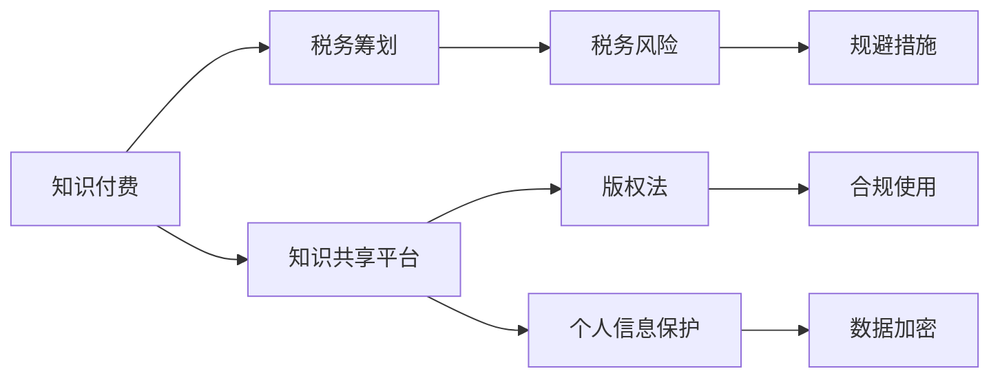

                 

# 知识经济下知识付费的税务筹划与风险规避

## 1. 背景介绍

在知识经济时代，知识付费作为一种新兴的经济模式，受到越来越多用户的青睐。随着移动互联网和信息技术的发展，各种在线教育平台、知识分享平台等纷纷涌现，为知识付费提供了广阔的市场空间。但随之而来的，是越来越多的税务问题和风险。如何合理规划税务，规避潜在风险，成为知识付费行业发展的关键。

## 2. 核心概念与联系

### 2.1 核心概念概述

在知识经济下，知识付费涉及的主要概念包括：

- 知识付费：用户通过支付费用获取特定知识和信息，如在线课程、电子书、文章等。
- 税务筹划：利用法律规定的税收优惠政策，合理规划收入和支出，降低税务负担。
- 税务风险：因违反税务法规或使用不当税务筹划方式，可能面临的税务惩罚或损失。
- 知识共享平台：如知乎、得到、喜马拉雅等，提供知识付费服务的中介平台。
- 版权法：涉及知识付费产品版权归属、使用、保护等法律问题。
- 个人信息保护：用户隐私和个人信息的保护。

这些概念之间存在密切联系，共同构成了知识经济下知识付费的税务筹划与风险规避框架。

### 2.2 核心概念原理和架构的 Mermaid 流程图



这个流程图展示了知识付费、税务筹划、税务风险、知识共享平台、版权法、个人信息保护以及规避措施之间的联系：

1. 知识付费通过知识共享平台提供给用户，涉及版权法和个人信息保护。
2. 税务筹划需要在法律允许范围内合理规划税务，降低税务负担。
3. 税务风险可能因违反税务法规或不当税务筹划产生。
4. 知识共享平台需确保版权合法使用，并保护用户隐私。
5. 规避措施用于防止税务风险和法律风险。

## 3. 核心算法原理 & 具体操作步骤

### 3.1 算法原理概述

税务筹划的核心思想是：利用法律规定的税收优惠政策，合理规划收入和支出，降低税务负担。其基本流程如下：

1. 收集和分析相关税务法规。
2. 识别和评估税务筹划机会。
3. 制定和实施税务筹划方案。
4. 监测和调整税务筹划方案。

税务筹划的原理基于税法规定，通过合法手段减少税务负担，达到合理的税务筹划效果。

### 3.2 算法步骤详解

1. **信息收集与分析**
   - 收集税法、法规、政策等相关信息。
   - 分析现有收入、支出和税务记录，了解当前的税务状况。

2. **机会识别**
   - 评估可能的税务筹划机会，如享受税收优惠、延迟纳税等。
   - 确定最适合的税务筹划方式，如个人退休账户、教育储蓄账户等。

3. **方案制定与实施**
   - 制定详细的税务筹划方案，包括具体的纳税计划、投资策略等。
   - 实施税务筹划方案，确保税务合规。

4. **方案监测与调整**
   - 定期监测税务筹划方案的执行情况，确保其持续有效。
   - 根据实际情况和政策变化调整税务筹划方案。

### 3.3 算法优缺点

**优点**：
- 合理规划税务，降低税务负担。
- 提高资金使用效率，增加财富积累。
- 减少税务风险，避免不必要的税务损失。

**缺点**：
- 税务筹划需要专业知识和经验，实施复杂。
- 税务筹划过程可能引发法律风险，需注意合规性。
- 税务筹划效果受多种因素影响，存在不确定性。

### 3.4 算法应用领域

税务筹划和风险规避主要应用于以下领域：

- 企业税务筹划：如税收优惠政策、投资结构优化等。
- 个人税务筹划：如教育储蓄、退休账户等。
- 知识付费平台：如课程定价、税收抵扣等。

## 4. 数学模型和公式 & 详细讲解 & 举例说明

### 4.1 数学模型构建

税务筹划的数学模型主要基于税法规定和财务理论构建，核心目标是最大化税务效益。假设有一项年度收入为 $R$，应纳税所得额为 $A$，税率为 $t$，则应纳税额 $T$ 可以表示为：

$$
T = A \times t
$$

税务筹划的目标是最大化税务效益 $E$，即最大化税后净收入 $R - T$：

$$
E = R - T = R - A \times t
$$

税务筹划的效果取决于收入 $R$、应纳税所得额 $A$ 和税率 $t$ 的调整。

### 4.2 公式推导过程

1. **收入规划**
   - 通过合理调整收入来源和时间，如将部分收入转移到税率较低的账户或推迟收入确认时间。
   
2. **支出规划**
   - 通过优化支出结构，如增加免税或低税率支出，减少高税率支出。

3. **投资规划**
   - 通过合理投资，如使用退休账户、教育储蓄账户等，进行税务优化。

4. **损失规划**
   - 通过合理配置资产，如使用资产减值准备等，减少应纳税所得额。

### 4.3 案例分析与讲解

假设某知识付费平台通过一系列税务筹划，实现了年度收入 $R=1000$ 万元，应纳税所得额 $A=500$ 万元，税率为 $t=20\%$。

1. **收入规划**
   - 将部分收入转移到低税率账户，如教育储蓄账户，减少应税收入。
   - 推迟部分收入确认时间，如通过分期收款方式，分散应税收入。

2. **支出规划**
   - 增加免税支出，如研发费用、员工培训费用等。
   - 减少高税率支出，如旅游费用、高端办公场所租赁费用等。

3. **投资规划**
   - 使用退休账户，如个人退休账户（IRA），进行税务优化。
   - 投资于免税或低税率资产，如国债、市政债券等。

4. **损失规划**
   - 配置资产，如使用资产减值准备，减少应纳税所得额。

通过以上规划，该平台实际应纳税所得额 $A' = 450$ 万元，应纳税额 $T' = A' \times t = 450 \times 20\% = 90$ 万元，税务效益 $E = R - T' = 1000 - 90 = 910$ 万元。

## 5. 项目实践：代码实例和详细解释说明

### 5.1 开发环境搭建

税务筹划涉及复杂的税务法规和财务模型，需要专业的软件工具支持。以下是开发环境搭建的步骤：

1. **安装Python环境**
   - 安装Anaconda或Miniconda，创建虚拟环境。

2. **安装税务规划工具**
   - 安装税务规划软件，如TaxAct、TurboTax等。
   - 安装Python税务规划库，如PyTax、PyFinance等。

3. **安装财务模型工具**
   - 安装财务模型库，如Pandas、NumPy等，用于数据分析和模型构建。

4. **安装数据可视化工具**
   - 安装数据可视化库，如Matplotlib、Seaborn等，用于数据可视化。

### 5.2 源代码详细实现

以下是一个简单的Python税务筹划示例，演示如何计算应纳税所得额和应纳税额：

```python
import pandas as pd
from sympy import symbols, Eq, solve

# 定义变量
R, A, t = symbols('R A t')

# 定义应纳税额公式
T = A * t

# 假设应纳税所得额为500万元，税率为20%
A_value = 500
t_value = 0.2

# 计算应纳税额
T_value = T.subs({A: A_value, t: t_value})
print(f"应纳税额：{T_value}")
```

### 5.3 代码解读与分析

1. **数据处理**
   - 使用Pandas库，将税务数据导入DataFrame格式，方便处理和分析。

2. **模型构建**
   - 使用Sympy库，定义应纳税额公式，构建税务规划模型。

3. **数据可视化**
   - 使用Matplotlib和Seaborn库，绘制税务筹划效果的图表，直观展示。

4. **结果展示**
   - 根据输入的应纳税所得额和税率，自动计算应纳税额，并输出结果。

## 6. 实际应用场景

### 6.1 企业税务筹划

企业税务筹划主要通过合理规划收入、支出、投资等，达到税务优化。例如，通过使用研发费用加计扣除、利用税收优惠政策等，实现税收减免。

### 6.2 个人税务筹划

个人税务筹划主要通过合理规划工资、奖金、投资等，达到税务优化。例如，通过使用教育储蓄账户、个人退休账户等，实现税务减免。

### 6.3 知识付费平台税务筹划

知识付费平台税务筹划主要通过合理定价、税收抵扣等，达到税务优化。例如，通过使用会员制度、课程分期付款等，分散应税收入。

### 6.4 未来应用展望

未来，税务筹划将进一步普及和深入，技术手段也将更加多样化和智能化。例如，使用人工智能和大数据分析，进行实时税务规划和风险评估。

## 7. 工具和资源推荐

### 7.1 学习资源推荐

- **税务规划书籍**：如《税务筹划与风险规避》《企业税务规划实务》等。
- **在线课程**：如Coursera、Udemy上的税务规划课程。
- **税务规划论坛**：如中国税务网、税务通等，获取最新税务政策。

### 7.2 开发工具推荐

- **Python税务规划库**：如PyTax、PyFinance等，支持Python税务规划。
- **税务软件**：如TurboTax、TaxAct等，提供一站式的税务规划服务。
- **数据可视化工具**：如Matplotlib、Seaborn等，用于数据展示和分析。

### 7.3 相关论文推荐

- **税务筹划方法**：如《税务筹划优化研究》《企业税务规划的策略和方法》等。
- **税务风险评估**：如《税务风险管理与规避》《企业税务风险评估与应对》等。
- **知识付费平台税务合规**：如《知识付费平台税务合规与风险规避》《知识付费平台税务优化策略》等。

## 8. 总结：未来发展趋势与挑战

### 8.1 研究成果总结

税务筹划和风险规避是知识经济下知识付费的重要保障。通过合理规划税务，可以降低税务负担，提高资金使用效率。但税务筹划和风险规避涉及复杂的法律和财务知识，需慎重实施。

### 8.2 未来发展趋势

未来，税务筹划将更加智能化和数据化，使用人工智能和大数据分析进行实时优化和风险评估。税务筹划的技术手段将更加多样化，使用更多先进工具和软件，提升税务筹划效果。

### 8.3 面临的挑战

税务筹划和风险规避面临的主要挑战包括：

- 法律和政策变化迅速，需及时调整税务规划策略。
- 税务筹划需要专业知识，需具备高水平的技术能力。
- 税务筹划效果受多种因素影响，存在不确定性。

### 8.4 研究展望

未来研究需要在以下方面进行探索：

- 实时税务规划和风险评估：利用大数据和人工智能技术，实时优化税务筹划方案，提高税务规划效果。
- 税务规划的合规性：确保税务规划方案符合法律规定，避免法律风险。
- 税务筹划的多层次设计：结合个人、企业、平台等多层次需求，进行综合税务规划。

## 9. 附录：常见问题与解答

**Q1：知识付费平台如何进行税务筹划？**

A: 知识付费平台可以通过合理定价、税收抵扣、使用教育储蓄账户等，实现税务优化。具体措施包括：

- 利用会员制度，通过会员订阅费用进行税务优化。
- 使用分期付款方式，分散应税收入。
- 配置教育储蓄账户，进行税务减免。

**Q2：税务筹划是否需要专业技能？**

A: 税务筹划涉及复杂的税务法规和财务知识，需要具备一定的专业技能。非专业知识的税务筹划可能存在风险，需慎重实施。

**Q3：税务筹划和风险规避的难点是什么？**

A: 税务筹划和风险规避的主要难点包括：

- 法律和政策变化迅速，需及时调整税务规划策略。
- 税务筹划效果受多种因素影响，存在不确定性。

**Q4：税务筹划工具有哪些？**

A: 税务筹划工具主要包括：

- 税务规划软件：如TurboTax、TaxAct等，提供一站式的税务规划服务。
- Python税务规划库：如PyTax、PyFinance等，支持Python税务规划。
- 数据分析工具：如Pandas、NumPy等，用于数据处理和分析。

**Q5：税务筹划的效果如何评估？**

A: 税务筹划效果主要通过税务效益（即税后净收入）进行评估。可通过计算应纳税所得额、应纳税额和税后净收入等指标，进行定量分析。

---

作者：禅与计算机程序设计艺术 / Zen and the Art of Computer Programming

