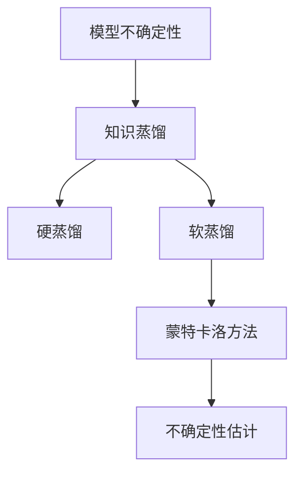

                 

## 1. 背景介绍

### 1.1 问题由来
模型不确定性（Model Uncertainty）是机器学习领域的一个基本问题，尤其是对于深度学习模型而言，由于其高度的非线性特征和高维度空间，模型的不确定性难以精确估计。这种不确定性体现在多个方面，如预测值的精度、预测的置信度、对异常值的鲁棒性等，直接影响到模型的可信度和实用性。传统上，模型不确定性评估常常依赖于复杂的统计方法，如贝叶斯方法、蒙特卡洛模拟等，但这些方法计算复杂，且难以在大规模模型中高效应用。

近年来，随着深度学习的发展，知识蒸馏（Knowledge Distillation）成为缓解模型不确定性的一种重要手段。知识蒸馏的基本思想是将一个已经训练好的复杂模型（称为"老师模型"）的知识迁移到另一个较为简单的模型（称为"学生模型"）上，通过"老师"对"学生"的指导，使得"学生"能够快速收敛，并在保持高精度的同时，具备更低的复杂度和计算负担，从而实现对模型不确定性的改善。

### 1.2 问题核心关键点
知识蒸馏的核心在于如何有效地将"老师模型"的知识迁移到"学生模型"上。常见的方法包括硬蒸馏（Hard Distillation）和软蒸馏（Soft Distillation）。

- **硬蒸馏**：直接使用老师模型的输出作为标签，对学生模型进行监督训练。这种方法简单易行，但忽略了老师模型预测的不确定性，可能会引入过多的噪声。
- **软蒸馏**：除了使用老师模型的预测作为标签，还同时使用老师模型的输出分布，对学生模型进行约束，以更好地保留老师模型的不确定性信息。

本文主要介绍软蒸馏方法，并详细分析其对模型不确定性估计的改善效果。

## 2. 核心概念与联系

### 2.1 核心概念概述

为更好地理解知识蒸馏对模型不确定性估计的改善效果，本节将介绍几个密切相关的核心概念：

- **模型不确定性（Model Uncertainty）**：指模型对未知数据的预测中，存在一定的不确定性，即对于同样的输入，模型可能给出不同的输出或预测概率。这种不确定性可以由模型的内部结构和训练过程等多种因素引起。
- **知识蒸馏（Knowledge Distillation）**：将一个已经训练好的复杂模型（老师模型）的知识迁移到另一个较为简单的模型（学生模型）上，以提高学生模型的泛化能力和不确定性估计能力。
- **硬蒸馏（Hard Distillation）**：直接使用老师模型的输出作为标签，对学生模型进行监督训练。
- **软蒸馏（Soft Distillation）**：在硬蒸馏的基础上，进一步利用老师模型的输出分布，对学生模型进行约束，以更好地保留老师模型的不确定性信息。
- **蒙特卡洛方法（Monte Carlo Methods）**：一种基于随机采样的统计方法，常用于估计模型的置信区间和不确定性。

这些核心概念之间的逻辑关系可以通过以下Mermaid流程图来展示：



这个流程图展示了一个从模型不确定性到知识蒸馏，再到不确定性估计的逻辑流程：

1. 模型不确定性通过知识蒸馏方法进行缓解。
2. 硬蒸馏和软蒸馏是知识蒸馏的具体方法。
3. 蒙特卡洛方法常用于进一步估计模型的置信区间和不确定性。
4. 不确定性估计提供了模型不确定性的量化指标。

这些概念共同构成了模型不确定性评估和缓解的基本框架，帮助我们更好地理解和应用知识蒸馏方法。

## 3. 核心算法原理 & 具体操作步骤

### 3.1 算法原理概述

知识蒸馏的核心理念是将一个复杂模型的知识迁移到另一个简单模型上，以提高简单模型的预测性能。软蒸馏方法通过同时考虑老师模型的预测和输出分布，对学生模型进行约束，以更好地保留老师模型的不确定性信息。

其核心算法流程如下：

1. **选择老师模型**：选择一个已经训练好的复杂模型作为老师模型。
2. **设计损失函数**：设计一个损失函数，使得学生模型的输出尽可能接近老师模型的输出，同时保留老师模型的不确定性。
3. **训练学生模型**：使用损失函数对学生模型进行监督训练，使其学习老师模型的知识。
4. **评估不确定性**：使用蒙特卡洛方法等统计方法，评估学生模型的不确定性估计效果。

### 3.2 算法步骤详解

**Step 1: 选择老师模型**
老师模型的选择对知识蒸馏效果至关重要。一般选择已经训练好的性能较高的复杂模型，如ResNet、VGG等。

**Step 2: 设计损失函数**
损失函数的设计需要同时考虑老师模型的预测和输出分布。假设老师模型的输出为$p_t(x)$，学生模型的输出为$p_s(x)$，则常见的损失函数包括：

- 均方误差损失（MSE Loss）：$L_{MSE} = \frac{1}{N} \sum_{i=1}^N (p_s(x_i) - p_t(x_i))^2$
- 分类交叉熵损失（CE Loss）：$L_{CE} = -\frac{1}{N} \sum_{i=1}^N p_t(x_i) \log p_s(x_i)$
- 广义中心损失（GCL Loss）：$L_{GCL} = -\frac{1}{N} \sum_{i=1}^N p_t(x_i) \log p_s(x_i) + (1-p_t(x_i)) \log (1-p_s(x_i))$
- 最大熵损失（MaxEnt Loss）：$L_{MaxEnt} = -H(p_t(x)) - H(p_s(x))$，其中$H(p(x)) = -\int p(x) \log p(x) dx$为熵

这些损失函数的设计目标不同，MSE Loss和CE Loss关注预测精度的匹配，而GCL Loss和MaxEnt Loss则更注重老师模型输出分布的保留。

**Step 3: 训练学生模型**
使用损失函数对学生模型进行监督训练。通常使用梯度下降等优化算法，逐步更新学生模型的参数，使得损失函数最小化。

**Step 4: 评估不确定性**
使用蒙特卡洛方法等统计方法，评估学生模型的不确定性。常用的方法包括：

- 蒙特卡洛方法：通过随机采样生成大量新样本，计算学生模型对新样本的预测结果和置信区间。
- 贝叶斯方法：通过先验分布和似然函数，推导学生模型的不确定性分布。
- 期望最大化方法（EM Algorithm）：通过最大似然估计和正则化项，优化学生模型的不确定性估计。

### 3.3 算法优缺点

知识蒸馏在缓解模型不确定性方面具有以下优点：

- **泛化能力提升**：通过知识蒸馏，学生模型能够学习老师模型的泛化能力，提高对未知数据的预测精度。
- **模型复杂度降低**：学生模型通常比老师模型更简单，计算负担更小，更适合实际部署。
- **不确定性估计改善**：软蒸馏方法通过保留老师模型的不确定性信息，提高了学生模型的不确定性估计能力。

但同时也存在一些缺点：

- **训练复杂度增加**：知识蒸馏需要额外设计损失函数，训练过程更复杂，计算资源消耗更大。
- **过度拟合风险**：学生模型可能会过度拟合老师模型，导致过拟合问题。
- **教师模型选择问题**：选择不当的老师模型可能导致知识蒸馏效果不佳。

### 3.4 算法应用领域

知识蒸馏方法已经在多个领域得到广泛应用，例如：

- **计算机视觉**：用于图像分类、目标检测、图像分割等任务，如将ResNet的知识蒸馏到轻量级网络如MobileNet上。
- **自然语言处理**：用于文本分类、情感分析、机器翻译等任务，如将BERT的知识蒸馏到GPT中。
- **语音识别**：用于语音命令识别、语音合成等任务，如将DeepSpeech的知识蒸馏到MobileSpeech中。
- **推荐系统**：用于个性化推荐、广告推荐等任务，如将复杂模型如XGBoost的知识蒸馏到轻量级模型如MLP上。

除了上述这些经典任务外，知识蒸馏还被创新性地应用到更多场景中，如动态模型压缩、模型迁移学习等，为模型的高效部署和知识复用提供了新的思路。

## 4. 数学模型和公式 & 详细讲解 & 举例说明

### 4.1 数学模型构建

知识蒸馏的数学模型可以表示为：

假设老师模型为 $f_t(x)$，学生模型为 $f_s(x)$，训练集为 $D=\{(x_i,y_i)\}_{i=1}^N$，其中 $x_i$ 为输入，$y_i$ 为标签。

目标是最小化损失函数 $L(f_s,f_t)$：

$$
L(f_s,f_t) = \alpha L_{MSE} + \beta L_{CE} + \gamma L_{GCL} + \delta L_{MaxEnt}
$$

其中 $\alpha, \beta, \gamma, \delta$ 为不同损失函数的权重系数，控制各自对总损失的贡献。

### 4.2 公式推导过程

以分类任务为例，假设老师模型的输出为 $p_t(x)$，学生模型的输出为 $p_s(x)$，则常见的损失函数包括：

- 均方误差损失（MSE Loss）：
$$
L_{MSE} = \frac{1}{N} \sum_{i=1}^N (p_s(x_i) - p_t(x_i))^2
$$

- 分类交叉熵损失（CE Loss）：
$$
L_{CE} = -\frac{1}{N} \sum_{i=1}^N p_t(x_i) \log p_s(x_i)
$$

- 广义中心损失（GCL Loss）：
$$
L_{GCL} = -\frac{1}{N} \sum_{i=1}^N p_t(x_i) \log p_s(x_i) + (1-p_t(x_i)) \log (1-p_s(x_i))
$$

- 最大熵损失（MaxEnt Loss）：
$$
L_{MaxEnt} = -H(p_t(x)) - H(p_s(x))
$$

其中 $H(p(x)) = -\int p(x) \log p(x) dx$ 为熵。

在训练过程中，使用梯度下降等优化算法对学生模型进行监督训练：

$$
\theta_s \leftarrow \theta_s - \eta \nabla_{\theta_s}L(f_s,f_t)
$$

其中 $\eta$ 为学习率，$\theta_s$ 为学生模型的参数。

### 4.3 案例分析与讲解

以图像分类任务为例，展示知识蒸馏的实现流程。

假设老师模型为ResNet，学生模型为MobileNet。通过以下步骤进行知识蒸馏：

1. 加载老师模型和学生模型。
2. 使用老师模型的输出作为标签，对学生模型进行监督训练，最小化MSE Loss和CE Loss。
3. 使用老师模型的输出分布，对学生模型进行约束，最小化GCL Loss和MaxEnt Loss。
4. 使用蒙特卡洛方法或贝叶斯方法，评估学生模型的不确定性。

## 5. 项目实践：代码实例和详细解释说明

### 5.1 开发环境搭建

在进行知识蒸馏实践前，我们需要准备好开发环境。以下是使用Python进行TensorFlow开发的环境配置流程：

1. 安装Anaconda：从官网下载并安装Anaconda，用于创建独立的Python环境。

2. 创建并激活虚拟环境：
```bash
conda create -n tf-env python=3.8 
conda activate tf-env
```

3. 安装TensorFlow：根据CUDA版本，从官网获取对应的安装命令。例如：
```bash
conda install tensorflow -c tensorflow -c conda-forge
```

4. 安装Keras：
```bash
pip install keras
```

5. 安装各类工具包：
```bash
pip install numpy pandas scikit-learn matplotlib tqdm jupyter notebook ipython
```

完成上述步骤后，即可在`tf-env`环境中开始知识蒸馏实践。

### 5.2 源代码详细实现

下面我们以图像分类任务为例，给出使用TensorFlow对ResNet和MobileNet进行知识蒸馏的代码实现。

首先，定义模型和损失函数：

```python
import tensorflow as tf
from tensorflow.keras import layers, models
from tensorflow.keras.losses import MeanSquaredError, CategoricalCrossentropy, KLDivergence

def create_resnet_model(input_shape):
    # 构建ResNet模型
    model = models.Sequential()
    model.add(layers.Conv2D(64, (3, 3), activation='relu', input_shape=input_shape))
    # ...
    return model

def create_mobilenet_model(input_shape):
    # 构建MobileNet模型
    model = models.Sequential()
    model.add(layers.Conv2D(32, (3, 3), activation='relu', input_shape=input_shape))
    # ...
    return model

def create_distillation_model(teacher_model, student_model):
    # 构建知识蒸馏模型
    # 将学生模型的输出作为老师模型的标签
    label_layer = layers.Lambda(lambda x: teacher_model(x))
    label_layer.set_name('label_layer')
    
    # 将老师模型的输出作为约束条件
    output_layer = teacher_model.layers[-1]
    output_layer.set_name('output_layer')
    
    # 将学生模型的输出与老师模型的输出进行比较
    softmax_layer = layers.Lambda(lambda x: tf.nn.softmax(x))
    softmax_layer.set_name('softmax_layer')
    
    # 定义损失函数
    mse_loss = MeanSquaredError()
    ce_loss = CategoricalCrossentropy()
    gcl_loss = KLDivergence()
    maxent_loss = KLDivergence()
    
    def distillation_loss(y_true, y_pred):
        mse_loss_val = mse_loss(y_pred, y_true)
        ce_loss_val = ce_loss(y_pred, y_true)
        gcl_loss_val = gcl_loss(y_pred, y_true)
        maxent_loss_val = maxent_loss(y_pred, y_true)
        return mse_loss_val + ce_loss_val + gcl_loss_val + maxent_loss_val
    
    model = models.Model(inputs=teacher_model.input, outputs=distillation_loss)
    model.compile(optimizer='adam', loss=distillation_loss)
    return model

# 加载ResNet和MobileNet模型
resnet_model = create_resnet_model(input_shape=(224, 224, 3))
mobilenet_model = create_mobilenet_model(input_shape=(224, 224, 3))

# 构建知识蒸馏模型
distillation_model = create_distillation_model(resnet_model, mobilenet_model)
```

然后，训练学生模型：

```python
import numpy as np
from tensorflow.keras.datasets import cifar10

# 加载CIFAR-10数据集
(x_train, y_train), (x_test, y_test) = cifar10.load_data()

# 归一化数据
x_train = x_train.astype('float32') / 255
x_test = x_test.astype('float32') / 255

# 训练学生模型
distillation_model.fit(x_train, y_train, epochs=10, batch_size=64, validation_data=(x_test, y_test))
```

### 5.3 代码解读与分析

让我们再详细解读一下关键代码的实现细节：

**create_resnet_model和create_mobilenet_model函数**：
- 分别定义了ResNet和MobileNet模型的构建函数，用于加载并构建老师和学生模型。

**create_distillation_model函数**：
- 定义了一个新的模型，将学生模型的输出作为老师模型的标签，同时将老师模型的输出作为约束条件，用于计算损失函数。

**distillation_loss函数**：
- 定义了一个自定义的损失函数，综合了均方误差损失、分类交叉熵损失、广义中心损失和最大熵损失，用于指导学生模型的训练。

在训练过程中，使用了Adam优化器和自定义的损失函数distillation_loss，对学生模型进行监督训练。同时，通过CIFAR-10数据集进行验证和测试，确保模型的泛化能力和不确定性估计效果。

## 6. 实际应用场景

### 6.1 动态模型压缩

知识蒸馏在动态模型压缩中发挥了重要作用。对于大规模深度学习模型，其计算负担和存储需求往往过高，难以在移动设备等资源有限的场景中运行。通过知识蒸馏，可以将大规模模型的知识迁移到轻量级模型中，实现模型压缩和加速。

在实际应用中，可以通过以下步骤进行动态模型压缩：

1. 选择一个大规模的复杂模型作为老师模型。
2. 设计一个轻量级的学生模型，如MobileNet、SqueezeNet等。
3. 使用知识蒸馏方法，将老师模型的知识迁移到学生模型上。
4. 使用压缩技术，如剪枝、量化、蒸馏等，进一步优化学生模型。
5. 部署优化后的学生模型，实现资源节省和速度提升。

### 6.2 模型迁移学习

知识蒸馏在模型迁移学习中同样具有重要应用。不同领域和任务之间的知识共享，可以加速模型的训练和泛化能力。通过知识蒸馏，将一个领域或任务的模型知识迁移到另一个领域或任务中，可以有效提升新模型的性能。

在实际应用中，可以通过以下步骤进行模型迁移学习：

1. 选择一个在源任务上表现良好的复杂模型作为老师模型。
2. 设计一个适合新任务的轻量级学生模型，如MobileNet、SqueezeNet等。
3. 使用知识蒸馏方法，将老师模型的知识迁移到学生模型上。
4. 在新任务上进行微调，进一步优化学生模型。
5. 部署优化后的学生模型，实现跨领域迁移和应用。

## 7. 工具和资源推荐

### 7.1 学习资源推荐

为了帮助开发者系统掌握知识蒸馏的理论基础和实践技巧，这里推荐一些优质的学习资源：

1. **《Knowledge Distillation: A Survey》**：一篇综述论文，详细介绍了知识蒸馏的基本原理和应用场景。

2. **《Distillation, Stacking, and Joint Training of Deep Neural Networks》**：一本科幻书，深入浅出地讲解了知识蒸馏的原理和实践方法。

3. **Coursera《Deep Learning Specialization》**：由Andrew Ng教授开设的深度学习课程，详细讲解了深度学习中的知识蒸馏方法。

4. **Udacity《Deep Reinforcement Learning Nanodegree》**：一门强化学习课程，讲解了知识蒸馏在强化学习中的应用。

5. **Kaggle《Knowledge Distillation Tutorials》**：Kaggle提供的知识蒸馏教程，包括代码实现和案例分析。

通过对这些资源的学习实践，相信你一定能够快速掌握知识蒸馏的精髓，并用于解决实际的机器学习问题。

### 7.2 开发工具推荐

高效的开发离不开优秀的工具支持。以下是几款用于知识蒸馏开发的常用工具：

1. **TensorFlow**：由Google主导开发的深度学习框架，支持分布式训练和动态图模式，适合大规模模型训练。

2. **Keras**：TensorFlow的高层API，易于上手，支持快速原型开发。

3. **PyTorch**：由Facebook开发的深度学习框架，支持动态图模式，适合快速迭代研究。

4. **MXNet**：由Apache开发的深度学习框架，支持分布式训练和多语言支持，适合跨平台应用。

5. **JAX**：由Google开发的自动微分库，支持高效计算和自动并行化，适合高性能计算。

合理利用这些工具，可以显著提升知识蒸馏任务的开发效率，加快创新迭代的步伐。

### 7.3 相关论文推荐

知识蒸馏方法在深度学习领域的发展始于1982年的一篇重要论文《A Simple Method to Train Neural Networks with Fewer Examples》。此后，相关研究不断涌现，推动了深度学习技术的进步。以下是几篇奠基性的相关论文，推荐阅读：

1. **《Knowledge Distillation》**：提出知识蒸馏的基本思想，详细讲解了其原理和应用场景。

2. **《Distilling the Knowledge in a Neural Network》**：提出Hinton蒸馏方法，通过将老师模型的输出作为标签，指导学生模型的训练。

3. **《Distillation》**：提出软蒸馏方法，同时考虑老师模型的预测和输出分布，进一步提升了学生模型的性能。

4. **《Distillation for Generalization without Memorization》**：提出多模态知识蒸馏方法，将图像、文本等多种模态的知识进行融合。

5. **《Knowledge Distillation with Z-Score Regularization》**：提出Z-Score蒸馏方法，通过引入输出分布的均值和方差作为约束条件，进一步提升了学生模型的性能。

这些论文代表了大规模知识蒸馏方法的发展脉络。通过学习这些前沿成果，可以帮助研究者把握学科前进方向，激发更多的创新灵感。

## 8. 总结：未来发展趋势与挑战

### 8.1 总结

本文对知识蒸馏缓解模型不确定性进行了全面系统的介绍。首先阐述了模型不确定性的基本概念和知识蒸馏的基本思想，明确了知识蒸馏在提升模型泛化能力和不确定性估计能力方面的独特价值。其次，从原理到实践，详细讲解了知识蒸馏的数学模型和关键步骤，给出了知识蒸馏任务开发的完整代码实例。同时，本文还广泛探讨了知识蒸馏方法在动态模型压缩、模型迁移学习等多个领域的应用前景，展示了知识蒸馏范式的巨大潜力。

通过本文的系统梳理，可以看到，知识蒸馏方法在机器学习领域具有广泛的应用场景和显著的效果提升。通过知识蒸馏，可以有效地缓解模型不确定性，提升模型的泛化能力和不确定性估计能力，为实际应用提供了更加可靠和高效的工具。

### 8.2 未来发展趋势

展望未来，知识蒸馏技术将呈现以下几个发展趋势：

1. **多模态知识蒸馏**：将图像、文本、语音等多种模态的信息进行融合，提升模型的综合性能。
2. **自适应知识蒸馏**：根据不同任务的特点，自动选择最合适的知识蒸馏方法，提高蒸馏效果。
3. **分布式知识蒸馏**：在大规模分布式环境中，通过知识蒸馏实现模型的同步更新和知识共享。
4. **混合蒸馏**：结合知识蒸馏和迁移学习、对抗训练等方法，进一步提升模型的泛化能力和鲁棒性。
5. **因果知识蒸馏**：通过引入因果推断方法，增强模型对因果关系的理解和建模能力。
6. **元知识蒸馏**：通过学习模型的学习过程，生成通用的知识蒸馏策略，实现模型自动优化。

以上趋势凸显了知识蒸馏技术的广泛应用前景，必将推动深度学习技术在各个领域的发展和应用。

### 8.3 面临的挑战

尽管知识蒸馏技术已经取得了瞩目成就，但在迈向更加智能化、普适化应用的过程中，它仍面临着诸多挑战：

1. **计算资源消耗大**：知识蒸馏通常需要训练两个模型，且计算复杂度较高，对计算资源的需求较大。
2. **蒸馏效果依赖于老师模型**：老师模型的选择对知识蒸馏效果有直接影响，如何选择高质量的老师模型仍然是一个挑战。
3. **过度拟合问题**：学生模型可能会过度拟合老师模型，导致过拟合问题，影响泛化能力。
4. **知识传递问题**：如何有效地将老师模型的知识传递给学生模型，仍然是一个开放问题。
5. **不确定性估计准确性**：如何准确估计模型的不确定性，仍然是一个挑战。

### 8.4 研究展望

面对知识蒸馏面临的这些挑战，未来的研究需要在以下几个方面寻求新的突破：

1. **高效知识蒸馏**：开发更加高效的蒸馏方法，减少计算资源消耗，提高知识传递的准确性。
2. **自适应蒸馏**：结合自适应学习方法和知识蒸馏，实现自动选择最合适的蒸馏方法。
3. **因果蒸馏**：结合因果推断方法，增强模型的因果关系理解和建模能力。
4. **元蒸馏**：通过学习模型的学习过程，生成通用的知识蒸馏策略，实现模型自动优化。
5. **混合蒸馏**：结合知识蒸馏和迁移学习、对抗训练等方法，进一步提升模型的泛化能力和鲁棒性。
6. **模型压缩与蒸馏**：结合模型压缩和知识蒸馏，实现高效模型压缩和知识迁移。

这些研究方向的探索，必将引领知识蒸馏技术迈向更高的台阶，为构建高效、智能、普适的机器学习系统铺平道路。面向未来，知识蒸馏技术还需要与其他人工智能技术进行更深入的融合，如因果推理、强化学习等，多路径协同发力，共同推动机器学习技术的发展和应用。只有勇于创新、敢于突破，才能不断拓展知识蒸馏的边界，让机器学习技术更好地造福人类社会。

## 9. 附录：常见问题与解答

**Q1：知识蒸馏是否适用于所有深度学习模型？**

A: 知识蒸馏方法在深度学习领域中具有广泛的应用，适用于各种类型的模型，如卷积神经网络、循环神经网络、深度强化学习模型等。

**Q2：如何选择高质量的老师模型？**

A: 高质量的老师模型通常具备以下特点：
1. 在源任务上表现良好，拥有丰富的知识。
2. 模型结构复杂，具备较强的泛化能力。
3. 模型参数量较大，知识丰富。
4. 在目标任务上能够提供较好的基线效果。

**Q3：知识蒸馏是否会影响模型泛化能力？**

A: 知识蒸馏通常会提升模型的泛化能力。通过知识蒸馏，学生模型能够学习到老师模型的泛化能力，从而提升对未知数据的预测精度。但需要注意，选择不合适的老师模型或蒸馏方法，可能会对模型的泛化能力产生负面影响。

**Q4：知识蒸馏是否会引入额外的噪声？**

A: 知识蒸馏可能会引入额外的噪声，尤其是硬蒸馏方法。可以通过选择适当的损失函数和正则化方法，减少噪声的影响。

**Q5：知识蒸馏是否会影响模型的计算负担？**

A: 知识蒸馏通常会增加模型的计算负担，特别是硬蒸馏方法。但通过合理的蒸馏策略和正则化方法，可以有效地控制计算资源消耗，提升蒸馏效果。

---

作者：禅与计算机程序设计艺术 / Zen and the Art of Computer Programming

