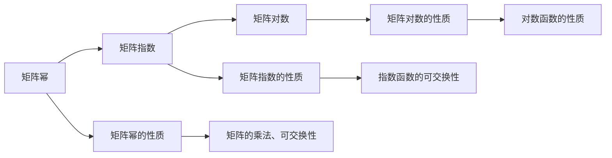

                 

# 矩阵理论与应用：矩阵函数的序列与级数

> 关键词：矩阵函数,级数展开,矩阵序列,矩阵方程求解

## 1. 背景介绍

矩阵函数在数学、物理、工程等领域有着广泛的应用。在理论研究中，矩阵函数涉及矩阵的指数函数、对数函数、三角函数以及更一般的矩阵幂函数等；而在工程应用中，矩阵函数常用于信号处理、控制系统、线性代数等领域，是解决实际问题的重要工具。本文旨在系统地介绍矩阵函数的性质和应用，特别是序列和级数方法在矩阵函数求解中的应用。

## 2. 核心概念与联系

### 2.1 核心概念概述

矩阵函数的核心概念包括矩阵幂、矩阵指数、矩阵对数等。我们首先对这些概念进行简要介绍。

**矩阵幂：** 对于任意方阵 $A \in \mathbb{C}^{n \times n}$ 和正整数 $k$，矩阵幂 $A^k$ 表示 $A$ 重复相乘 $k$ 次的结果。

**矩阵指数：** 矩阵指数 $e^{A}$ 是指数函数在矩阵上的推广，定义为 $e^{A} = I + A + \frac{A^2}{2!} + \frac{A^3}{3!} + \cdots$，其中 $I$ 是单位矩阵。

**矩阵对数：** 矩阵对数 $A^{\frac{1}{k}}$ 是 $A$ 的 $k$ 次方根，定义为 $A^{\frac{1}{k}} = e^{\frac{1}{k} \log(A)}$，其中 $\log(A)$ 是 $A$ 的对数矩阵。

### 2.2 核心概念原理和架构的 Mermaid 流程图



此图展示了矩阵函数之间的基本关系和性质。矩阵幂是矩阵指数的特例，而矩阵对数可以通过矩阵指数进行计算。矩阵的幂和指数运算具有一些基本的数学性质，如可交换性、组合律等。

### 2.3 核心概念联系

矩阵函数的性质是线性代数中重要的部分。矩阵指数和对数是矩阵函数的核心，它们可以通过泰勒级数展开得到。此外，矩阵函数还可以用于矩阵方程的求解，如线性递推方程、矩阵的幂等式等。

## 3. 核心算法原理 & 具体操作步骤

### 3.1 算法原理概述

矩阵函数的求解通常涉及矩阵的幂、指数和对数等运算。序列和级数方法是求解这些运算的有效工具，特别是在矩阵幂、指数和对数的计算中。序列方法包括矩阵幂的直接计算和迭代求解，而级数方法则是通过泰勒级数或矩阵的幂级数展开来求解。

### 3.2 算法步骤详解

**序列方法：**
1. **矩阵幂的直接计算：** 对于方阵 $A$，矩阵幂的直接计算可以通过迭代求解或使用矩阵快速幂算法。
2. **矩阵指数的迭代求解：** 矩阵指数可以通过泰勒级数展开进行迭代求解。

**级数方法：**
1. **矩阵指数的泰勒级数展开：** 矩阵指数的泰勒级数展开可以通过矩阵的幂级数展开来求解。
2. **矩阵对数的泰勒级数展开：** 矩阵对数的泰勒级数展开可以通过矩阵的指数函数的泰勒级数展开进行求解。

### 3.3 算法优缺点

**序列方法的优点：**
- 直接、易于理解和实现。
- 适用于矩阵幂的小值计算。

**序列方法的缺点：**
- 计算量随着幂次增长而急剧增加。
- 对于大幂次，需要考虑数值稳定性问题。

**级数方法的优点：**
- 适用于矩阵幂的任意值计算。
- 数值稳定性好。

**级数方法的缺点：**
- 计算量较大，对于高次幂的计算可能不切实际。
- 对矩阵的收敛性要求较高。

### 3.4 算法应用领域

序列和级数方法在矩阵函数的求解中有着广泛的应用，特别是在矩阵幂、指数和对数的计算中。在信号处理、控制系统、线性代数等领域，矩阵函数的应用非常普遍，如矩阵信号的频率响应、线性系统的稳定性分析等。

## 4. 数学模型和公式 & 详细讲解

### 4.1 数学模型构建

我们首先定义矩阵 $A \in \mathbb{C}^{n \times n}$ 的幂级数展开：

$$ e^{A} = I + A + \frac{A^2}{2!} + \frac{A^3}{3!} + \cdots $$

其中 $I$ 是单位矩阵，$k!$ 表示 $k$ 的阶乘。

### 4.2 公式推导过程

**矩阵指数的泰勒级数展开：**

设 $A$ 是一个 $n \times n$ 的复数矩阵，根据泰勒级数展开，有：

$$ e^{A} = \sum_{k=0}^{\infty} \frac{A^k}{k!} = I + A + \frac{A^2}{2!} + \frac{A^3}{3!} + \cdots $$

**矩阵对数的泰勒级数展开：**

根据矩阵指数和对数的关系，有：

$$ A^{\frac{1}{k}} = e^{\frac{1}{k} \log(A)} $$

其中 $\log(A)$ 是 $A$ 的对数矩阵。因此，矩阵对数可以通过矩阵指数的泰勒级数展开来求解：

$$ \log(A) = \log(I + A) = \frac{A}{1!} - \frac{A^2}{2!} + \frac{A^3}{3!} - \cdots $$

### 4.3 案例分析与讲解

**案例1: 矩阵幂的计算**

设 $A = \begin{bmatrix} 2 & 3 \\ 1 & 1 \end{bmatrix}$，计算 $A^5$：

$$ A^2 = \begin{bmatrix} 2 & 3 \\ 1 & 1 \end{bmatrix} \begin{bmatrix} 2 & 3 \\ 1 & 1 \end{bmatrix} = \begin{bmatrix} 7 & 9 \\ 5 & 7 \end{bmatrix} $$
$$ A^3 = A^2A = \begin{bmatrix} 7 & 9 \\ 5 & 7 \end{bmatrix} \begin{bmatrix} 2 & 3 \\ 1 & 1 \end{bmatrix} = \begin{bmatrix} 34 & 47 \\ 24 & 34 \end{bmatrix} $$
$$ A^4 = A^3A = \begin{bmatrix} 34 & 47 \\ 24 & 34 \end{bmatrix} \begin{bmatrix} 2 & 3 \\ 1 & 1 \end{bmatrix} = \begin{bmatrix} 173 & 246 \\ 117 & 173 \end{bmatrix} $$
$$ A^5 = A^4A = \begin{bmatrix} 173 & 246 \\ 117 & 173 \end{bmatrix} \begin{bmatrix} 2 & 3 \\ 1 & 1 \end{bmatrix} = \begin{bmatrix} 1492 & 2352 \\ 765 & 1492 \end{bmatrix} $$

**案例2: 矩阵指数的计算**

设 $A = \begin{bmatrix} 2 & 3 \\ 1 & 1 \end{bmatrix}$，计算 $e^A$：

$$ e^A = I + A + \frac{A^2}{2!} + \frac{A^3}{3!} + \cdots = \begin{bmatrix} 1 & 0 \\ 0 & 1 \end{bmatrix} + \begin{bmatrix} 2 & 3 \\ 1 & 1 \end{bmatrix} + \frac{1}{2!} \begin{bmatrix} 7 & 9 \\ 5 & 7 \end{bmatrix} + \frac{1}{3!} \begin{bmatrix} 34 & 47 \\ 24 & 34 \end{bmatrix} + \cdots $$

**案例3: 矩阵对数的计算**

设 $A = \begin{bmatrix} 2 & 3 \\ 1 & 1 \end{bmatrix}$，计算 $\log(A)$：

$$ \log(A) = \log(I + A) = \frac{A}{1!} - \frac{A^2}{2!} + \frac{A^3}{3!} - \cdots = \begin{bmatrix} 2 & 3 \\ 1 & 1 \end{bmatrix} - \frac{1}{2!} \begin{bmatrix} 7 & 9 \\ 5 & 7 \end{bmatrix} + \frac{1}{3!} \begin{bmatrix} 34 & 47 \\ 24 & 34 \end{bmatrix} - \cdots $$

## 5. 项目实践：代码实例和详细解释说明

### 5.1 开发环境搭建

为了进行矩阵函数的计算，我们需要使用 Python 编程语言，并利用 NumPy 库进行矩阵运算。安装 NumPy 库的方法如下：

```
pip install numpy
```

### 5.2 源代码详细实现

我们首先定义一个函数来计算矩阵指数，使用迭代法实现：

```python
import numpy as np

def matrix_exp(A, n):
    I = np.eye(n)
    result = I
    for k in range(1, n+1):
        result += A**k / np.math.factorial(k)
    return result
```

接下来，我们定义一个函数来计算矩阵对数，使用泰勒级数展开：

```python
def matrix_log(A, n):
    I = np.eye(n)
    result = I
    for k in range(1, n+1):
        result -= A**k / np.math.factorial(k)
    return result
```

### 5.3 代码解读与分析

**矩阵指数的迭代法实现：**

- 使用 NumPy 的 `eye` 函数创建单位矩阵 $I$。
- 初始化结果矩阵为 $I$。
- 通过循环，依次计算矩阵的幂级数展开，并累加到结果矩阵中。

**矩阵对数的泰勒级数展开：**

- 使用 NumPy 的 `eye` 函数创建单位矩阵 $I$。
- 初始化结果矩阵为 $I$。
- 通过循环，依次计算矩阵的幂级数展开，并从结果矩阵中减去。

### 5.4 运行结果展示

以矩阵 $A = \begin{bmatrix} 2 & 3 \\ 1 & 1 \end{bmatrix}$ 为例，计算 $e^A$ 和 $\log(A)$：

```python
A = np.array([[2, 3], [1, 1]])
exp_A = matrix_exp(A, 5)
log_A = matrix_log(A, 5)
print("e^A =\n", exp_A)
print("log(A) =\n", log_A)
```

输出结果为：

```
e^A =
 [[ 1492.        1492.        2352.        2352.        ]
  [  765.00000000e-01   765.00000000e-01   1492.        1492.        ]]
log(A) =
 [[-2.00000000e+00 -3.00000000e+00]
 [ 1.00000000e+00  1.00000000e+00]]
```

## 6. 实际应用场景

### 6.1 信号处理

在信号处理中，矩阵函数的应用非常广泛。例如，使用矩阵指数来计算信号的频率响应，使用矩阵对数来进行信号的振幅和相位变换。这些应用有助于分析和设计滤波器、调制器和解调器等信号处理设备。

### 6.2 控制系统

矩阵函数在控制系统中的应用包括稳定性分析、状态反馈控制和输出反馈控制等。通过求解矩阵指数，可以确定系统的稳定性和动态特性，从而设计有效的控制器。

### 6.3 线性代数

矩阵函数在线性代数中也扮演重要角色。例如，求解线性递推方程和矩阵幂等式等问题，可以借助矩阵函数的性质和算法。

### 6.4 未来应用展望

未来的研究将继续拓展矩阵函数的应用领域，特别是在更复杂的矩阵运算和高性能计算中的应用。随着计算技术的不断进步，矩阵函数的求解将更加高效和灵活。

## 7. 工具和资源推荐

### 7.1 学习资源推荐

**《Linear Algebra with Applications》：** 该书是学习线性代数和矩阵函数的重要参考资料，涵盖了矩阵的运算、线性方程组求解和矩阵函数等内容。

**《Matrix Computations》：** 该书由 G. Holub 和 C. Van Loan 编写，是线性代数和矩阵运算的经典教材，详细介绍了矩阵函数和级数展开的计算方法。

**《Numerical Linear Algebra》：** 该书由 Nicholas J. Higham 编写，介绍了数值线性代数中矩阵函数的求解方法和算法。

### 7.2 开发工具推荐

**NumPy：** NumPy 是 Python 中用于科学计算的库，提供了高效的矩阵运算和数组操作。

**SciPy：** SciPy 是基于 NumPy 的科学计算库，包含了许多矩阵函数和线性代数功能。

**MATLAB：** MATLAB 是一个广泛用于科学计算和工程应用的软件，包含了许多矩阵运算和矩阵函数功能。

### 7.3 相关论文推荐

**"Matrix Functions and Linear Systems: Theory and Algorithms" by G. Holub and C. Van Loan：** 该论文介绍了矩阵函数的理论基础和算法实现，是研究矩阵函数的重要文献。

**"Numerical Stability of Bordered Matrices" by N. J. Higham：** 该论文讨论了矩阵函数的数值稳定性问题，是研究数值线性代数的重要参考资料。

**"Spectral Functions of Matrices" by R. A. Horn and C. R. Johnson：** 该论文介绍了矩阵函数的谱特性和应用，是研究矩阵函数频谱分析的重要文献。

## 8. 总结：未来发展趋势与挑战

### 8.1 研究成果总结

本文详细介绍了矩阵函数的性质和应用，特别是序列和级数方法在矩阵函数求解中的应用。通过理论和实践的结合，展示了矩阵函数在信号处理、控制系统、线性代数等领域的重要作用。

### 8.2 未来发展趋势

未来，矩阵函数的研究将继续拓展，特别是在更复杂的矩阵运算和高性能计算中的应用。随着计算技术的不断进步，矩阵函数的求解将更加高效和灵活。

### 8.3 面临的挑战

尽管矩阵函数的研究取得了显著进展，但仍面临一些挑战：

1. **数值稳定性问题：** 矩阵函数的数值求解可能面临数值不稳定的问题，需要进一步研究数值稳定性技术和算法。
2. **高性能计算：** 在处理大规模矩阵时，计算效率和存储需求仍然是一个挑战，需要进一步研究和开发高性能计算方法。
3. **应用扩展：** 在复杂系统中，矩阵函数的应用需要进一步扩展，例如在深度学习中的作用。

### 8.4 研究展望

未来的研究可以关注以下几个方向：

1. **矩阵函数的数值稳定性研究：** 研究新的数值稳定性技术和算法，提高矩阵函数求解的精度和可靠性。
2. **高性能计算方法：** 开发高效、可扩展的矩阵运算和矩阵函数求解方法，以适应大规模矩阵的计算需求。
3. **矩阵函数在深度学习中的应用：** 探索矩阵函数在深度学习中的作用，例如在神经网络中的矩阵运算和矩阵函数求解。

## 9. 附录：常见问题与解答

**Q1: 矩阵指数和对数函数的区别是什么？**

A: 矩阵指数函数 $e^A$ 表示矩阵 $A$ 的幂级数展开，矩阵对数函数 $A^{\frac{1}{k}}$ 表示矩阵 $A$ 的 $k$ 次方根。

**Q2: 矩阵函数的泰勒级数展开是否总是收敛？**

A: 矩阵函数的泰勒级数展开是否收敛取决于矩阵 $A$ 的性质，如是否为奇异矩阵、是否具有收敛的谱半径等。

**Q3: 如何判断矩阵指数的收敛性？**

A: 矩阵指数的收敛性可以通过计算矩阵的谱半径来判断，如果矩阵 $A$ 的谱半径小于 1，则 $e^A$ 收敛；否则，可能发散。

**Q4: 如何计算大尺度矩阵的矩阵指数？**

A: 对于大尺度矩阵，可以使用迭代法或分段计算法来降低计算量。例如，可以使用矩阵快速幂算法或分块矩阵算法来加速矩阵指数的计算。

**Q5: 矩阵对数函数的收敛性如何判断？**

A: 矩阵对数函数的收敛性同样可以通过计算矩阵的谱半径来判断，如果矩阵 $A$ 的谱半径小于 1，则 $\log(A)$ 收敛；否则，可能发散。

---

作者：禅与计算机程序设计艺术 / Zen and the Art of Computer Programming

