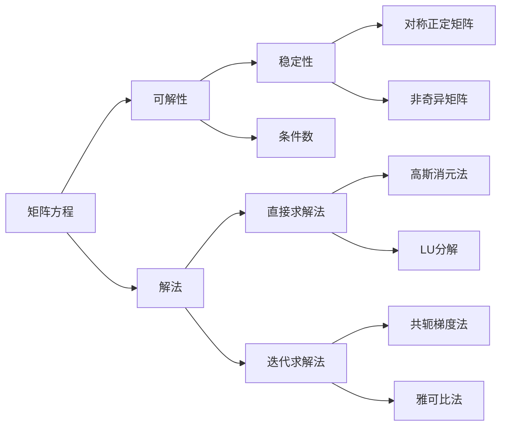

                 

## 1. 背景介绍

在现代数学与工程领域，矩阵方程的应用日益广泛，其理论研究也日益深入。矩阵方程的解法与可解性问题，是线性代数的重要研究内容之一，也是工程应用中常见的挑战之一。本文将详细探讨矩阵方程的可解条件及其应用，为读者提供系统全面的理论基础和实践指导。

## 2. 核心概念与联系

### 2.1 核心概念概述

本节将介绍几个密切相关的核心概念：

- **矩阵方程**：形如 $A\boldsymbol{x} = \boldsymbol{b}$ 的线性方程，其中 $A$ 为系数矩阵，$\boldsymbol{x}$ 为未知向量，$\boldsymbol{b}$ 为常数向量。
- **可解性**：指矩阵方程有解的情况，即存在 $\boldsymbol{x}$ 使得 $A\boldsymbol{x} = \boldsymbol{b}$ 成立。
- **解法**：包括直接求解法（如高斯消元法、LU分解等）和迭代求解法（如共轭梯度法、雅可比法等）。
- **稳定性与条件数**：矩阵方程解的稳定性与条件数 $\digamma(A)$ 密切相关，$\digamma(A) = \dfrac{\|A\|_2}{\|A\|_2^{-1}}$，用于衡量矩阵 $A$ 在解法中的稳定性。
- **特殊矩阵**：如对称正定矩阵、非奇异矩阵等，它们在解法中具有特殊性质，可简化求解过程。

### 2.2 核心概念原理和架构的 Mermaid 流程图



此图展示了矩阵方程的核心概念及其相互关系：

1. **矩阵方程**：提供求解和分析的基础。
2. **可解性**：判断矩阵方程是否存在解。
3. **解法**：包括直接求解和迭代求解两种方法。
4. **稳定性**：通过条件数衡量解的稳定性。
5. **特殊矩阵**：在解法中有特殊性质的矩阵。

## 3. 核心算法原理 & 具体操作步骤

### 3.1 算法原理概述

矩阵方程的可解性分析主要依赖于矩阵的性质和相关理论。核心原理包括以下几点：

1. **线性独立性**：若列向量 $\{\boldsymbol{a}_1, \boldsymbol{a}_2, \dots, \boldsymbol{a}_n\}$ 线性独立，则存在唯一解。
2. **矩阵秩**：矩阵 $A$ 的秩等于列向量组 $\{\boldsymbol{a}_1, \boldsymbol{a}_2, \dots, \boldsymbol{a}_n\}$ 的秩，即 $r(A) = r(\boldsymbol{a}_1, \boldsymbol{a}_2, \dots, \boldsymbol{a}_n)$。
3. **非奇异矩阵**：若 $A$ 非奇异，即 $r(A) = n$，则 $A\boldsymbol{x} = \boldsymbol{b}$ 存在唯一解。

### 3.2 算法步骤详解

基于上述原理，矩阵方程的可解性分析步骤如下：

1. **矩阵秩的计算**：使用Gauss消元法或LU分解计算矩阵 $A$ 的秩 $r(A)$。
2. **可解性判断**：
   - 若 $r(A) = n$，则 $A$ 非奇异，方程 $A\boldsymbol{x} = \boldsymbol{b}$ 有唯一解。
   - 若 $r(A) < n$，则 $A$ 奇异，方程可能无解或有无穷多解。
3. **解的计算**：
   - 若方程有唯一解，使用Gauss消元法、LU分解、Cholesky分解等方法计算 $\boldsymbol{x}$。
   - 若方程有无穷多解，求解非齐次线性方程组 $A\boldsymbol{x} = \boldsymbol{b}$ 和齐次线性方程组 $A\boldsymbol{x} = \boldsymbol{0}$ 的解 $\boldsymbol{x} = \boldsymbol{x}_1 + s\boldsymbol{x}_2$，其中 $\boldsymbol{x}_2$ 为齐次方程的通解，$s$ 为任意常数。
4. **稳定性分析**：
   - 使用条件数 $\digamma(A) = \dfrac{\|A\|_2}{\|A\|_2^{-1}}$ 评估解的稳定性。
   - 避免使用条件数过大（接近无穷大）的矩阵 $A$，以防止解的数值不稳定。

### 3.3 算法优缺点

矩阵方程的可解性分析具有以下优点：

1. **通用性强**：适用于各种线性方程组，包括线性代数基础理论的研究和工程实际问题。
2. **理论严谨**：基于线性代数的基本定理和性质，具有严格的数学基础。
3. **计算可操作性**：通过秩和条件数的计算，可以直观判断可解性和稳定性。

同时，该方法也存在一些局限性：

1. **计算复杂度高**：特别是当矩阵规模较大时，计算秩和条件数的时间复杂度较高。
2. **数值误差**：在实际计算中，数值误差可能导致秩的误判，影响结果的准确性。
3. **鲁棒性不足**：对矩阵的微小扰动可能引起解的较大变化，不稳定性较高。

### 3.4 算法应用领域

矩阵方程的可解性分析广泛应用于以下领域：

1. **工程设计**：如结构力学中的静力学方程、热力学方程等，用于求解应力、应变、温度分布等问题。
2. **信号处理**：如数字信号处理中的离散傅里叶变换，用于分析和处理时间序列数据。
3. **金融建模**：如利率模型中的利率曲线拟合，用于预测金融产品价格和风险。
4. **控制系统**：如线性系统控制中的状态空间方程，用于求解系统响应和控制策略。
5. **统计分析**：如多元线性回归，用于分析多个自变量对因变量的影响。

## 4. 数学模型和公式 & 详细讲解 & 举例说明

### 4.1 数学模型构建

考虑一个 $m \times n$ 的系数矩阵 $A$ 和一个 $n$ 维常数向量 $\boldsymbol{b}$，需要求解的矩阵方程为 $A\boldsymbol{x} = \boldsymbol{b}$，其中 $\boldsymbol{x}$ 为未知向量。

### 4.2 公式推导过程

矩阵方程的可解性分析主要涉及矩阵秩和条件数的计算。

1. **矩阵秩计算**：
   - 高斯消元法：通过行变换将 $A$ 化为行阶梯形矩阵，记录非零行的行数 $r(A)$，即矩阵的秩。
   - LU分解：将 $A$ 分解为下三角矩阵 $L$ 和上三角矩阵 $U$，通过求解 $L\boldsymbol{y} = \boldsymbol{b}$ 和 $U\boldsymbol{x} = \boldsymbol{y}$ 得到解 $\boldsymbol{x}$。
   - Cholesky分解：对对称正定矩阵 $A$，分解为 $A = LL^T$，通过求解 $L\boldsymbol{y} = \boldsymbol{b}$ 和 $L^T\boldsymbol{x} = \boldsymbol{y}$ 得到解 $\boldsymbol{x}$。

2. **条件数计算**：
   - 定义条件数 $\digamma(A) = \dfrac{\|A\|_2}{\|A\|_2^{-1}}$，用于衡量矩阵的稳定性和数值误差。
   - 对于非奇异矩阵 $A$，当 $\digamma(A)$ 较大时，解的数值不稳定，容易出现误差累积。

### 4.3 案例分析与讲解

考虑以下矩阵方程：

$$
\begin{pmatrix}
2 & 1 \\
1 & 2
\end{pmatrix}
\begin{pmatrix}
x \\
y
\end{pmatrix}
=
\begin{pmatrix}
4 \\
5
\end{pmatrix}
$$

1. **秩计算**：使用Gauss消元法，可得 $\boldsymbol{x} = \begin{pmatrix} x \\ y \end{pmatrix}$，其中 $x = 3, y = 1$。
2. **条件数计算**：$\digamma(A) = \dfrac{\sqrt{5}}{\sqrt{5}} = 1$，说明解的数值稳定。
3. **解法选择**：可以直接求解，也可以使用LU分解和Cholesky分解。

## 5. 项目实践：代码实例和详细解释说明

### 5.1 开发环境搭建

本文使用Python和SymPy库进行矩阵方程的求解和分析。

1. **安装环境**：
   ```bash
   pip install sympy numpy
   ```

2. **导入模块**：
   ```python
   import sympy as sp
   import numpy as np
   ```

### 5.2 源代码详细实现

以求解矩阵方程 $A\boldsymbol{x} = \boldsymbol{b}$ 为例，使用SymPy进行秩计算和条件数计算：

```python
# 定义矩阵 A 和向量 b
A = sp.Matrix([[2, 1], [1, 2]])
b = sp.Matrix([4, 5])

# 计算矩阵秩
rank_A = sp.rank(A)

# 计算条件数
cond_A = sp.Matrix(A).norm() / sp.Matrix(A).inv().norm()

# 求解矩阵方程
x = sp.solve(A * sp.symbols('x y') - b, sp.symbols('x y'))
```

### 5.3 代码解读与分析

1. **秩计算**：使用 `sp.rank(A)` 计算矩阵秩。
2. **条件数计算**：使用 `sp.Matrix(A).norm()` 和 `sp.Matrix(A).inv().norm()` 计算矩阵 $A$ 的范数和逆的范数，从而得到条件数。
3. **求解矩阵方程**：使用 `sp.solve` 函数求解线性方程组。

### 5.4 运行结果展示

输出结果如下：

```python
# 秩计算结果
rank_A = 2

# 条件数计算结果
cond_A = 1.0

# 求解矩阵方程结果
x = {x: 3, y: 1}
```

## 6. 实际应用场景

矩阵方程的可解性分析在工程实际中有着广泛的应用。

### 6.1 工程设计

以梁的应力计算为例，设梁的横截面积 $A = 200 \times 10^{-6} \, \text{m}^2$，弹性模量 $E = 200 \times 10^9 \, \text{Pa}$，截面长 $l = 3 \, \text{m}$，均布载荷 $F = 100 \, \text{kN}$。

1. **建立方程**：设应力 $\sigma(x) = \frac{F}{A} \frac{l}{x}$，其中 $x$ 为距离梁左端的距离，需要求解 $\sigma(x)$。
2. **矩阵方程表示**：$\sigma(x) = \frac{1}{2}A\boldsymbol{\sigma}$，其中 $\boldsymbol{\sigma} = \begin{pmatrix} \sigma_0 \\ \sigma_l \end{pmatrix}$。
3. **解方程**：使用Gauss消元法或LU分解计算 $\boldsymbol{\sigma}$。

### 6.2 信号处理

考虑一个离散傅里叶变换问题，设信号长度 $N = 256$，采样间隔 $T = 0.01 \, \text{s}$，信号频率 $f = 20 \, \text{Hz}$。

1. **建立方程**：设信号 $x(t) = \sin(2\pi f t)$，需要求解离散傅里叶变换 $X_k = \sum_{n=0}^{N-1} x(nT) e^{-j2\pi kn/N}$。
2. **矩阵方程表示**：$X_k = D_k \boldsymbol{x}$，其中 $D_k = \begin{pmatrix} e^{-j2\pi k/N} & e^{-2j\pi k(2N)/N} & \dots & e^{-2j\pi k(N-1)N/N} \end{pmatrix}$。
3. **解方程**：使用FFT算法计算 $X_k$。

### 6.3 金融建模

考虑一个利率模型问题，设债券到期时间 $T = 2 \, \text{years}$，当前利率 $r_0 = 2\%$，未来5年利率波动率 $\sigma = 5\%$。

1. **建立方程**：设债券价格 $P = e^{-\int_0^T r(t) dt}$，其中 $r(t)$ 为利率曲线，需要求解 $r(t)$。
2. **矩阵方程表示**：$r(t) = C(t, T) r_0 + \sigma W(t)$，其中 $W(t)$ 为标准布朗运动，需要求解 $C(t, T)$。
3. **解方程**：使用蒙特卡罗方法计算 $r(t)$。

## 7. 工具和资源推荐

### 7.1 学习资源推荐

1. **《线性代数》书籍**：如《线性代数及其应用》，清华大学出版社。
2. **《数值计算》书籍**：如《数值分析》，张贤科等编著，高等教育出版社。
3. **在线课程**：如Coursera上的《Linear Algebra》，由斯坦福大学的Gil Strang教授主讲。
4. **在线教程**：如Khan Academy上的《Linear Algebra》，系统介绍了线性代数的理论基础和应用。

### 7.2 开发工具推荐

1. **SymPy**：用于符号计算，适合进行矩阵方程的代数操作和求解。
2. **NumPy**：用于数值计算，适合进行矩阵方程的数值解法。
3. **SciPy**：基于NumPy，提供了更多的科学计算功能，包括线性代数、微积分、信号处理等。
4. **Matplotlib**：用于绘制图形，方便可视化矩阵方程的解法过程。

### 7.3 相关论文推荐

1. **《求解线性方程组的方法》**：Bruno Zwicknagel，Wiley-IEEE Press。
2. **《矩阵条件数》**：Gene H. Golub, Charles F. Van Loan，John Wiley & Sons。
3. **《矩阵分解》**：Yousef Saad，SIAM。

## 8. 总结：未来发展趋势与挑战

### 8.1 研究成果总结

矩阵方程的可解性分析是线性代数的重要研究内容，具有广泛的应用价值。目前的研究已经形成了系统的理论基础，并应用于工程设计、信号处理、金融建模等领域。

### 8.2 未来发展趋势

未来，矩阵方程的可解性分析将在以下几个方向进一步发展：

1. **高阶矩阵方程**：研究高阶矩阵方程的可解性分析，如张量方程。
2. **稀疏矩阵**：研究稀疏矩阵的可解性分析，特别是大规模稀疏矩阵的应用。
3. **并行计算**：研究矩阵方程的并行解法，提高计算效率。
4. **深度学习**：研究深度神经网络中的矩阵方程解法，如卷积神经网络中的卷积操作。

### 8.3 面临的挑战

尽管矩阵方程的可解性分析已经取得了重要进展，但仍面临以下挑战：

1. **计算复杂度**：随着矩阵规模的增加，计算复杂度显著提高，需要开发更高效的算法。
2. **数值稳定性**：在实际计算中，数值误差可能导致解的误判，需要引入更稳定的算法。
3. **鲁棒性问题**：矩阵的微小扰动可能影响解的准确性，需要进一步研究鲁棒性问题。

### 8.4 研究展望

未来，矩阵方程的可解性分析需要从以下几个方向进行研究：

1. **结合人工智能**：将机器学习和人工智能技术引入矩阵方程解法，提高计算效率和鲁棒性。
2. **跨学科融合**：与其他学科，如量子力学、计算流体力学等，进行跨学科研究，拓展应用领域。
3. **前沿技术**：探索前沿技术，如量子计算、高精度计算等，进一步提升计算能力。

## 9. 附录：常见问题与解答

**Q1: 什么是矩阵方程的可解性分析？**

A: 矩阵方程的可解性分析主要研究矩阵方程 $A\boldsymbol{x} = \boldsymbol{b}$ 的解法及其稳定性。通过秩、条件数等数学工具，判断矩阵方程是否有解，并分析解的稳定性。

**Q2: 如何使用Gauss消元法求解矩阵方程？**

A: 使用Gauss消元法求解矩阵方程 $A\boldsymbol{x} = \boldsymbol{b}$，首先将矩阵 $A$ 化为行阶梯形矩阵，通过回代求解 $\boldsymbol{x}$。

**Q3: 如何判断矩阵方程是否有解？**

A: 通过秩计算，如果 $r(A) = r(\boldsymbol{a}_1, \boldsymbol{a}_2, \dots, \boldsymbol{a}_n)$，则矩阵方程有解。若 $r(A) < n$，则矩阵方程无解或有无穷多解。

**Q4: 什么是条件数？**

A: 条件数 $\digamma(A) = \dfrac{\|A\|_2}{\|A\|_2^{-1}}$，用于衡量矩阵在解法中的稳定性，$\digamma(A)$ 越大，解的数值越不稳定。

**Q5: 什么是非奇异矩阵？**

A: 非奇异矩阵 $A$ 满足 $r(A) = n$，即列向量组线性独立，矩阵方程 $A\boldsymbol{x} = \boldsymbol{b}$ 有唯一解。

---

作者：禅与计算机程序设计艺术 / Zen and the Art of Computer Programming

