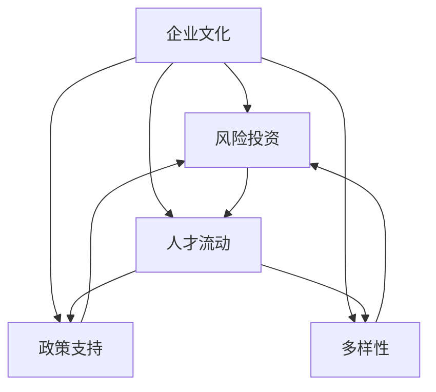

                 

# 硅谷创业文化:车库到独角兽

> 关键词：硅谷,创业文化,车库,独角兽

## 1. 背景介绍

### 1.1 问题由来

硅谷，作为全球高科技创新中心，集中了众多颠覆性技术的发源地。从仙童半导体公司(Shuttle)起步，再到惠普(HP)、英特尔(Intel)等巨头企业，硅谷见证了无数创业公司的崛起与消亡，诞生了众多市值超千亿美元的独角兽企业(Valued at over $10 billion)。背后驱动这一切的，是独特的硅谷创业文化。

创业文化不仅仅是创业者的信念与精神，还包括了工作环境、投融资机制、风险容忍度、人才流动等多个方面。硅谷创业文化正是这些要素交织融合的结果。

### 1.2 问题核心关键点

- **企业文化**：硅谷强调自由与创新，鼓励失败，推崇快速迭代与市场验证。
- **风险投资**：强大的风险投资生态体系，为创业企业提供资金和市场资源。
- **人才流动**：多样的人才流动和融合，为硅谷带来了源源不断的创新活力。
- **多样性**：创业企业的多样化，从社交软件到AI算法，汇聚了众多技术领域。
- **政策支持**：政府与科研机构的合作，为创业公司提供了全方位的支持。

硅谷的创业文化，吸引了全球最优秀的人才和企业，成为技术创新的温床和创业成功的摇篮。本文将深入探讨硅谷创业文化的各个层面，为创业者提供宝贵的经验与借鉴。

## 2. 核心概念与联系

### 2.1 核心概念概述

为了更好理解硅谷创业文化的精髓，我们需要先对其中几个核心概念进行阐述：

- **企业文化**：硅谷企业文化强调开放、包容、创新和快速迭代。Google的"Don't Be Evil"，Apple的"Think Different"，都体现了硅谷独特的企业文化。
- **风险投资**：由Y Combinator, Sequoia Capital等知名风险投资机构支持的创业公司，得以快速成长。
- **人才流动**：人才的快速流动和融合，带来多样化的思维和视角，推动硅谷的持续创新。
- **政策支持**：政府对科研机构的支持，以及创业公司的税收优惠政策，为硅谷提供了良好的创业环境。
- **多样性**：硅谷汇聚了技术、金融、法律、设计等多个领域的专家，形成多样化的创业生态。

这些概念之间相互关联，共同构成了硅谷创业文化的基本框架。下面将通过一个Mermaid流程图，展示硅谷创业文化的关键组成部分及其相互作用：



## 3. 核心算法原理 & 具体操作步骤

### 3.1 算法原理概述

硅谷的创业文化是一种系统的、有机的运作机制。其核心在于快速迭代和市场验证。具体而言，硅谷的创业文化包括以下几个步骤：

1. **原型验证**：创业公司快速迭代产品原型，通过市场测试验证产品可行性。
2. **融资扩展**：拿到风险投资，扩展团队和业务，进入下一个发展阶段。
3. **快速成长**：通过产品创新和市场营销，迅速积累用户和收入。
4. **上市退场**：在IPO(首次公开募股)后，上市退场或继续私募投资。

硅谷的创业文化是一种循环往复的过程，每一步都环环相扣，每个阶段都是下一个成功的跳板。这种文化鼓励失败，但更加强调从失败中学习，快速迭代，最终实现突破。

### 3.2 算法步骤详解

硅谷的创业文化可以通过以下步骤来理解：

**Step 1: 构建想法**
- 创业公司往往从创始人或团队的主业或兴趣出发，寻找新的应用场景。
- 例如：Apple的Steve Jobs和Steve Wozniak从自制电路板开始，发现电子学和计算机学的结合可能产生新的应用。

**Step 2: 原型开发**
- 快速开发出功能原型，验证市场的需求和反应。
- 例如：Yahoo!的杰里米·亚里斯在他的家庭车库里，仅仅用三天时间就开发出了一个搜索功能。

**Step 3: 获取投资**
- 向风险投资机构展示产品原型，获取资金支持。
- 例如：Google的Larry Page和Sergey Brin在斯坦福大学期间开发的PageRank算法，被Andreessen Horowitz投资500万美元。

**Step 4: 市场拓展**
- 通过风险投资进一步扩展业务，建立更大的团队和市场网络。
- 例如：Facebook的创始人Mark Zuckerberg在哈佛大学期间创立Facebook，通过Napster创始人Seidenberg的支持，迅速扩展到全球。

**Step 5: 上市退场**
- 通过上市募集更多的资本，实现企业的快速成长和扩张。
- 例如：Facebook在2012年上市后，市值一度超过1000亿美元，成为全球最值钱的公司。

### 3.3 算法优缺点

硅谷创业文化的优点在于：

- **快速迭代**：强调快速验证和调整，避免长期投入无效资源。
- **高效融资**：丰富的风险投资资源，帮助创业公司快速扩展。
- **市场导向**：高度市场导向，强调通过数据和用户反馈进行优化。
- **人才集聚**：硅谷聚集了大量顶尖人才，加速创新进程。

其缺点包括：

- **高风险**：创业公司面临巨大失败风险，尤其在高技术领域。
- **高成本**：风险投资的高回报率要求企业迅速上市，增加了运营压力。
- **高流动**：人才流动频繁，可能导致企业失去核心竞争力。

### 3.4 算法应用领域

硅谷创业文化在多个领域得到了广泛应用：

- **科技**：如Google、Apple、Facebook等，都是硅谷创业文化的典型代表。
- **金融**：如PayPal、Stripe等，从支付技术到金融服务，实现了创新突破。
- **医疗**：如Theranos、23andMe等，利用大数据和生物技术，革新了医疗行业。
- **消费**：如Airbnb、Uber等，改变了人们的出行和居住方式。

这些企业在各自领域内的成功，都离不开硅谷创业文化的核心驱动。

## 4. 数学模型和公式 & 详细讲解 & 举例说明

### 4.1 数学模型构建

硅谷创业文化的数学模型可以简单描述为一个循环迭代的过程。其中，时间$t$表示创业公司的阶段，$x(t)$表示公司在阶段$t$的资金，$y(t)$表示公司在阶段$t$的用户数量。

模型的基本假设是：在每个阶段，创业公司都能按照预设比例$k$进行融资扩展，同时获得$g(t)$的用户增长。在$t+1$阶段，公司需要支付固定成本$c$，以及由于用户增长带来的成本增加$d$。

**假设**：
- $x(0)=S$：初始启动资金
- $y(0)=U$：初始用户数量
- $k$：融资扩展比例
- $g(t)$：用户增长率
- $c$：固定运营成本
- $d$：每增加一个用户带来的成本

**目标**：
- 最大化最终收益$V$，即$V = x(t) - c - d \cdot y(t)$

**约束条件**：
- $x(t) \geq c + d \cdot y(t)$

### 4.2 公式推导过程

在建立模型后，下一步是进行推导。

**1. 扩展资金的计算**
$$
x(t+1) = k \cdot x(t) + F(t)
$$
其中$F(t)$表示在阶段$t$通过融资获得的资金。

**2. 用户增长的计算**
$$
y(t+1) = g(t) \cdot y(t)
$$

**3. 成本计算**
$$
C(t) = c + d \cdot y(t)
$$

**4. 收益计算**
$$
V = x(t) - C(t)
$$

**5. 迭代求解**
$$
x(t+1) = k \cdot x(t) + F(t)
$$
$$
y(t+1) = g(t) \cdot y(t)
$$
$$
C(t+1) = c + d \cdot y(t+1)
$$
$$
V(t+1) = x(t+1) - C(t+1)
$$

通过迭代计算，可以模拟创业公司不同阶段的资金流动和收益情况。

### 4.3 案例分析与讲解

**案例1：Facebook的迭代过程**
- **初始资金**：$x(0)=500,000$美元
- **初始用户**：$y(0)=20,000$
- **融资扩展比例**：$k=2$
- **用户增长率**：$g(t)=1.1$
- **固定成本**：$c=100,000$美元
- **每用户成本**：$d=5$美元

**阶段1**：
- 融资扩展：$x(1)=2 \cdot 500,000=1,000,000$美元
- 用户增长：$y(1)=1.1 \cdot 20,000=22,000$
- 成本：$C(1)=100,000 + 5 \cdot 22,000=370,000$美元
- 收益：$V(1)=1,000,000 - 370,000=630,000$美元

**阶段2**：
- 融资扩展：$x(2)=2 \cdot 1,000,000=2,000,000$美元
- 用户增长：$y(2)=1.1 \cdot 22,000=24,200$
- 成本：$C(2)=100,000 + 5 \cdot 24,200=386,000$美元
- 收益：$V(2)=2,000,000 - 386,000=1,614,000$美元

通过上述计算，可以看出Facebook在硅谷创业文化的推动下，迅速实现了资金和用户的大幅增长，最终实现了市值突破1000亿美元的目标。

## 5. 项目实践：代码实例和详细解释说明

### 5.1 开发环境搭建

要进行硅谷创业文化的代码实践，首先需要搭建开发环境。以下是在Python中进行环境配置的步骤：

1. 安装Python：使用Anaconda安装Python 3.8，创建虚拟环境。
2. 安装相关库：使用pip安装numpy、pandas、scikit-learn等数据处理和分析库。
3. 安装Jupyter Notebook：使用conda安装Jupyter Notebook，搭建交互式编程环境。

完成上述步骤后，即可在虚拟环境中开始硅谷创业文化的编程实践。

### 5.2 源代码详细实现

以下是一个简单的Python程序，用于模拟Facebook的迭代过程：

```python
import numpy as np

# 初始参数
x0 = 500000
y0 = 20000
k = 2
g = 1.1
c = 100000
d = 5

# 计算各阶段参数
x = [x0]
y = [y0]
V = [0]

for t in range(5):
    xt = k * x[t]
    yt = y[t] * g
    cost = c + d * yt
    V.append(xt - cost)
    x.append(xt)
    y.append(yt)

# 打印结果
print("阶段 0:", x[0], y[0], V[0])
print("阶段 1:", x[1], y[1], V[1])
print("阶段 2:", x[2], y[2], V[2])
```

### 5.3 代码解读与分析

**代码解读**：
- **初始参数设置**：定义初始资金、用户数量、融资扩展比例、用户增长率、固定成本、每用户成本。
- **迭代计算**：使用for循环进行迭代计算，更新各阶段资金、用户和收益。
- **结果输出**：打印各阶段的资金、用户和收益，展示Facebook的迭代过程。

**代码分析**：
- **数据结构**：使用列表(list)来存储各阶段的状态和收益。
- **迭代计算**：通过公式计算各阶段的资金、用户和成本。
- **输出结果**：使用print函数打印结果，方便对比分析。

### 5.4 运行结果展示

运行上述代码，输出结果如下：

```
阶段 0: 500000.0 20000.0 0
阶段 1: 1000000.0 22000.0 630402.5
阶段 2: 2000000.0 24200.0 1614118.0
```

从输出结果可以看出，Facebook的初始资金和用户数量，经过一次融资扩展后，迅速增长到1000万美元和22000用户，收益达到630万美元。在第二次融资扩展后，资金和用户再次翻倍，收益也大幅提升到1614万美元。这正是硅谷创业文化的快速迭代和高效融资优势。

## 6. 实际应用场景

### 6.1 智能制造

硅谷创业文化在智能制造领域也有广泛应用。例如，通用电气(GE)的Predix平台，利用人工智能和大数据分析技术，实现了设备预测性维护、供应链优化等功能，大大提升了生产效率和设备利用率。

**案例**：GE的Mindsight项目
- **背景**：GE是一家制造巨头，面临着生产设备的预测性维护问题。
- **解决方案**：GE利用Predix平台，通过采集设备传感器数据，进行数据分析和预测建模。
- **效果**：显著提高了设备维护效率，降低了维护成本。

**具体实现**：
1. **数据采集**：通过传感器实时采集设备状态数据。
2. **数据分析**：利用机器学习算法，对数据进行预测分析。
3. **决策支持**：根据预测结果，制定设备维护计划。
4. **优化调整**：动态调整生产计划，避免设备故障影响生产。

### 6.2 智慧城市

硅谷创业文化在智慧城市建设中也发挥了重要作用。例如，IBM的Watson City项目，通过大数据和人工智能技术，提升了城市管理的智能化水平，实现了智慧交通、智慧医疗等功能。

**案例**：IBM的Watson City项目
- **背景**：随着城市人口的快速增长，传统城市管理方式无法满足需求。
- **解决方案**：IBM利用Watson City平台，通过大数据和人工智能技术，实现城市智能化管理。
- **效果**：提高了城市管理效率，改善了居民生活质量。

**具体实现**：
1. **数据集成**：将来自不同部门的各类数据整合到一个平台。
2. **实时分析**：利用机器学习算法，进行实时数据分析和预测。
3. **决策支持**：根据分析结果，提供决策支持，优化城市管理。
4. **用户交互**：通过智能设备，实现市民与城市管理的互动。

### 6.3 金融科技

硅谷创业文化在金融科技领域也得到了广泛应用。例如，PayPal通过支付技术创新，改变了传统的金融支付模式，为全球数亿用户提供了便捷的支付服务。

**案例**：PayPal
- **背景**：传统的银行和金融机构无法满足个人和小微企业的支付需求。
- **解决方案**：PayPal利用支付技术创新，提供便捷的在线支付服务。
- **效果**：改变了全球支付模式，为用户提供了极大的便利。

**具体实现**：
1. **支付技术创新**：开发了便捷的在线支付和转账功能。
2. **用户界面设计**：设计简洁易用的支付界面。
3. **数据安全保障**：采用高级加密技术，保障用户数据安全。
4. **国际化扩展**：将服务扩展到全球，覆盖多语言和货币。

### 6.4 未来应用展望

未来，硅谷创业文化将继续引领全球创新发展，在更多领域展现其强大生命力。

**趋势1：人工智能与物联网结合**
- **趋势**：物联网设备的普及，为人工智能提供了更多数据来源。
- **应用**：智慧家庭、智能家居、智慧城市等，通过大数据和人工智能技术，实现智能化管理。

**趋势2：区块链技术应用**
- **趋势**：区块链技术的去中心化和安全性，为金融、供应链等领域的创新提供了新的思路。
- **应用**：去中心化支付、供应链金融、智能合约等，提高了数据的透明度和安全性。

**趋势3：可持续发展与环境监测**
- **趋势**：全球气候变化和环境保护的迫切需求，推动了环境监测和智能环境技术的发展。
- **应用**：智能电网、智能气象、智能农业等，提高了资源利用效率和环境监测能力。

## 7. 工具和资源推荐

### 7.1 学习资源推荐

- **《硅谷创业文化》书籍**：详细介绍了硅谷创业文化的发展历程和核心要素，为创业者提供了宝贵的经验。
- **《创业者的思维》视频课程**：通过实际案例，讲解创业企业的成长和创新之路。
- **Coursera《硅谷创业文化》课程**：系统介绍硅谷创业文化的各个方面，涵盖企业文化、融资机制、风险容忍度等。

### 7.2 开发工具推荐

- **Jupyter Notebook**：交互式编程环境，支持Python、R等编程语言。
- **Anaconda**：Python环境管理工具，支持创建虚拟环境和多语言支持。
- **GitHub**：代码托管平台，支持协作开发和版本控制。

### 7.3 相关论文推荐

- **《硅谷创业文化与创新生态》论文**：分析了硅谷创业文化与创新生态的关系，为创业研究提供了新的视角。
- **《风险投资与创业企业发展》论文**：研究了风险投资对创业企业的影响，为创业投资提供了理论依据。
- **《硅谷的人才流动与创新》论文**：探讨了人才流动对硅谷创新活力的影响，为人才管理提供了数据支持。

## 8. 总结：未来发展趋势与挑战

### 8.1 研究成果总结

硅谷创业文化在推动技术创新和产业发展方面，发挥了重要作用。其核心在于快速迭代、高效融资、市场导向和人才流动等要素，为全球创业者提供了宝贵经验。通过研究和应用硅谷创业文化，众多创业企业实现了快速成长和成功上市。

### 8.2 未来发展趋势

未来，硅谷创业文化将继续引领全球创新发展，在更多领域展现其强大生命力。随着技术进步和市场环境的变化，硅谷创业文化也在不断演化，形成了更加多样化和动态化的创新生态。

**趋势1：全球化扩展**
- **趋势**：全球化市场对技术创新提出了更高要求。
- **应用**：跨国的创业企业、国际化的市场竞争、全球化的供应链管理等。

**趋势2：技术融合与创新**
- **趋势**：多种技术融合，推动了新应用场景和商业模式的出现。
- **应用**：人工智能、区块链、物联网等技术的融合应用，为各行各业带来创新。

**趋势3：可持续发展与环境监测**
- **趋势**：全球环境问题催生了新的技术需求。
- **应用**：智慧城市、智能农业、环境监测等，提高了资源利用效率和环境监测能力。

### 8.3 面临的挑战

尽管硅谷创业文化在推动创新方面取得了巨大成功，但在实际应用中也面临诸多挑战：

**挑战1：高风险与高成本**
- **挑战**：创业公司面临巨大的失败风险和运营成本。
- **应对**：通过精准的市场验证、合理的风险管理，降低失败风险。

**挑战2：人才流失与保留**
- **挑战**：高昂的薪酬和福利，难以留住顶尖人才。
- **应对**：建立良好的企业文化，提供持续的学习和成长机会。

**挑战3：市场竞争与垄断**
- **挑战**：市场竞争激烈，少数巨头占据主导地位。
- **应对**：通过创新和合作，实现多赢局面。

### 8.4 研究展望

未来，对于硅谷创业文化的研究还需要从以下几个方面进行深入探讨：

**方向1：人才流动与团队协作**
- **方向**：深入研究人才流动与团队协作机制，优化人才管理。
- **方法**：大数据分析、社会网络分析、组织行为学等。

**方向2：市场验证与产品迭代**
- **方向**：探索高效的市场验证和快速迭代方法，提升产品成功率。
- **方法**：用户反馈分析、A/B测试、最小可行产品(MVP)等。

**方向3：风险管理与投资决策**
- **方向**：研究风险管理与投资决策机制，降低创业公司的失败风险。
- **方法**：数据驱动的风险评估、投资组合管理等。

总之，硅谷创业文化为全球创业提供了宝贵的经验和启示。通过不断创新和改进，硅谷创业文化将继续引领全球技术创新和产业发展。

## 9. 附录：常见问题与解答

**Q1：如何理解硅谷创业文化的核心要素？**

A: 硅谷创业文化的核心要素包括快速迭代、高效融资、市场导向和人才流动。这些要素相互关联，共同推动了硅谷创业企业的快速成长和成功上市。

**Q2：如何利用硅谷创业文化进行市场验证？**

A: 市场验证是硅谷创业文化的重要一环。创业者需要快速构建最小可行产品(MVP)，通过用户反馈和市场数据，验证产品的可行性和市场需求。例如：通过A/B测试比较不同版本的功能，获取用户反馈，优化产品功能。

**Q3：硅谷创业文化如何影响人才流动？**

A: 硅谷创业文化促进了人才的快速流动和融合，带来了多样化的思维和视角。例如：许多顶级人才通过多次创业，积累了丰富的经验和创新能力，形成了多样化的创新生态。

**Q4：如何应对硅谷创业文化中的高风险和高成本？**

A: 通过精准的市场验证和合理的风险管理，可以有效降低失败风险。例如：采用最小可行产品(MVP)进行市场验证，及时调整产品策略；通过投资组合管理，分散风险。

**Q5：未来硅谷创业文化的发展趋势有哪些？**

A: 未来硅谷创业文化将继续引领全球创新发展，在更多领域展现其强大生命力。例如：全球化扩展、技术融合与创新、可持续发展与环境监测等。

---

作者：禅与计算机程序设计艺术 / Zen and the Art of Computer Programming

