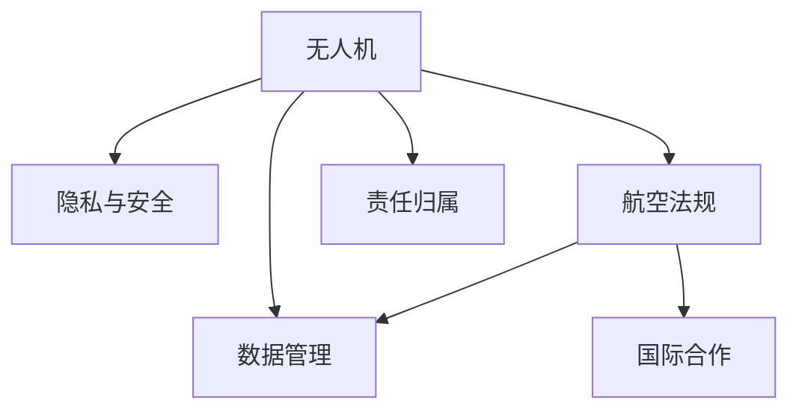

                 

# 硅谷无人机监管的国际合作

> 关键词：无人机监管,国际合作,人工智能,法律框架,数据隐私

## 1. 背景介绍

### 1.1 问题由来
随着无人机技术的快速发展和广泛应用，硅谷等高科技中心地区面临的无人机监管问题日益严峻。无人机不仅可以用于农业、快递、娱乐等多种场景，还可能带来隐私侵犯、安全威胁等潜在风险。如何在保障无人机技术创新和发展的同时，有效监管其应用行为，成为政府、企业和学术界共同关注的议题。

### 1.2 问题核心关键点
无人机监管的核心问题包括：

1. **隐私与安全**：无人机的视觉和数据传输能力使其能够监视和记录个人隐私，可能对公共安全构成威胁。
2. **航空法规**：无人机的飞行规则与传统飞机存在较大差异，现有航空法规需要更新以适应无人机的新特性。
3. **数据管理**：无人机的数据存储、传输和处理过程中，如何确保数据的安全性和隐私性。
4. **责任归属**：无人机的控制权、所有权和管理责任问题，涉及多个利益相关方。
5. **国际合作**：不同国家和地区在无人机法规和技术标准上的差异，需要建立国际合作机制，以促进技术发展和应用。

这些关键点构成了硅谷无人机监管的复杂背景，本文将围绕这些核心问题，探讨硅谷无人机监管的国际合作路径。

## 2. 核心概念与联系

### 2.1 核心概念概述

为更好地理解硅谷无人机监管的国际合作，本节将介绍几个密切相关的核心概念：

- **无人机 (UAV)**：也称为无人驾驶飞行器，是一种远程操控的飞行设备，通常用于监控、摄影、测绘、快递等。
- **隐私与安全**：无人机可能拍摄或记录个人隐私，也可能对空域安全构成威胁。
- **航空法规**：针对无人机的飞行高度、航线、控制要求等制定的法规。
- **数据管理**：涉及无人机的数据存储、传输、处理等方面的法律法规。
- **国际合作**：不同国家和地区在无人机监管上的合作机制，包括法律协调、技术标准一致化等。

这些核心概念之间的逻辑关系可以通过以下Mermaid流程图来展示：



这个流程图展示了大无人机制度、隐私、法规、数据管理、国际合作及责任归属之间的关系：

1. 无人机的功能特性（A）引发隐私与安全问题（B），需要航空法规（C）和数据管理（D）进行规范。
2. 国际合作（E）是解决不同国家和地区法规差异的重要手段。
3. 责任归属（F）是无人机管理中必须明确的问题。

## 3. 核心算法原理 & 具体操作步骤
### 3.1 算法原理概述

硅谷无人机监管的国际合作主要依赖于以下几个关键算法原理：

1. **隐私保护算法**：用于在无人机数据处理过程中确保个人隐私不被泄露。
2. **飞行路径规划算法**：根据航空法规和地理信息，规划无人机的飞行路径。
3. **安全监控算法**：通过实时监控和预测，确保无人机飞行安全。
4. **责任归属算法**：确定无人机事故发生时的责任归属。

这些算法通过协同工作，构建了一个综合的无人机监管框架。

### 3.2 算法步骤详解

基于上述算法原理，硅谷无人机监管的国际合作步骤可以细化为以下几个关键环节：

1. **数据收集与预处理**：收集无人机飞行数据和图像，进行清洗和标注。
2. **隐私保护**：使用数据加密、匿名化等技术保护数据隐私。
3. **飞行路径规划**：根据航空法规，规划无人机的飞行路径。
4. **安全监控**：使用机器学习和图像识别技术，实时监控无人机飞行情况，预测和预防潜在风险。
5. **责任归属**：在发生事故时，使用数据溯源技术确定责任方。
6. **法规与标准制定**：制定国际统一的标准和法规，确保无人机在不同地区的合规性。
7. **国际合作与协调**：通过建立国际组织或合作协议，推动无人机法规和技术的国际一致化。

### 3.3 算法优缺点

硅谷无人机监管的国际合作算法具有以下优点：

1. **数据隐私保护**：通过隐私保护算法，能够确保无人机数据的合法使用，避免隐私泄露。
2. **飞行安全保障**：安全监控算法能够实时监控无人机飞行情况，预防事故发生。
3. **法规标准化**：制定统一的国际标准和法规，能够减少不同地区的法规差异，促进技术创新和应用。

同时，这些算法也存在一些局限性：

1. **算法复杂度**：隐私保护和安全监控算法需要复杂的计算和数据处理，增加了系统负担。
2. **法规执行难度**：不同地区的法规差异可能难以统一，执行过程中存在协调问题。
3. **技术成本高**：实现这些算法需要大量的技术投入和资源支持。

尽管存在这些局限性，但通过持续的技术创新和国际合作，可以逐步克服这些挑战，推动硅谷无人机监管向更加高效、安全的方向发展。

### 3.4 算法应用领域

硅谷无人机监管的国际合作算法在以下几个领域具有广泛的应用前景：

1. **民用无人机**：用于农业喷洒、快递配送、城市规划等，涉及大量数据隐私和安全问题。
2. **商用无人机**：用于物流、巡检、地质勘探等，需要严格的飞行路径规划和安全监控。
3. **政府监管**：涉及无人机在执法、安保、灾害监测等场景的应用，需要综合考虑隐私、安全、法规等因素。
4. **国际合作**：各国在无人机技术标准和法规上的差异，需要通过国际合作进行协调。

## 4. 数学模型和公式 & 详细讲解  
### 4.1 数学模型构建

硅谷无人机监管的国际合作可以构建一个多目标优化模型，目标包括隐私保护、飞行安全、法规遵守和责任归属。以下是一个简单的数学模型框架：

$$
\min_{x} \left( \lambda_1 C_1(x) + \lambda_2 C_2(x) + \lambda_3 C_3(x) + \lambda_4 C_4(x) \right)
$$

其中，$C_1(x)$ 表示隐私保护成本，$C_2(x)$ 表示飞行安全成本，$C_3(x)$ 表示法规遵守成本，$C_4(x)$ 表示责任归属成本，$\lambda_i$ 表示各个目标的权重。

### 4.2 公式推导过程

以隐私保护成本 $C_1(x)$ 为例，使用差分隐私算法（Differential Privacy, DP）进行推导：

$$
C_1(x) = \epsilon \cdot \ln(1/\delta) \cdot \sum_i |x_i - x'_i|
$$

其中，$\epsilon$ 表示隐私保护程度，$\delta$ 表示错误率，$x_i$ 表示原始数据，$x'_i$ 表示经过处理的隐私数据。

### 4.3 案例分析与讲解

假设一个物流公司使用无人机进行快递配送，需要在保护客户隐私的同时确保飞行安全。以下是具体案例分析：

1. **隐私保护**：使用差分隐私算法，将客户的地理定位信息进行模糊化处理，确保数据隐私。
2. **飞行安全**：通过实时监控算法，检测无人机周围的其他无人机和障碍物，避免碰撞事故。
3. **法规遵守**：根据航空法规，规划无人机的飞行高度和航线，确保合法飞行。
4. **责任归属**：在发生无人机事故时，通过数据溯源技术，确定事故责任方。

通过以上案例分析，可以看到硅谷无人机监管的国际合作算法在实际应用中的具体应用场景和效果。

## 5. 项目实践：代码实例和详细解释说明
### 5.1 开发环境搭建

要进行硅谷无人机监管的国际合作项目实践，首先需要搭建好开发环境。以下是Python和Django开发环境的配置流程：

1. 安装Python 3.8：
```bash
sudo apt-get install python3.8
```

2. 安装虚拟环境：
```bash
python3.8 -m venv venv
```

3. 激活虚拟环境：
```bash
source venv/bin/activate
```

4. 安装Django：
```bash
pip install django
```

5. 创建Django项目：
```bash
django-admin startproject uav_reg
```

### 5.2 源代码详细实现

以下是Django项目中无人机监管的代码实现示例：

```python
from django.shortcuts import render
from django.http import JsonResponse
import datetime

# 定义无人机模型类
class UAV:
    def __init__(self, model_name, flight_height, flight_path, privacy_level):
        self.model_name = model_name
        self.flight_height = flight_height
        self.flight_path = flight_path
        self.privacy_level = privacy_level

    def privacy_protection(self):
        # 实现隐私保护算法，对数据进行加密和匿名化
        pass

    def flight_path_planning(self):
        # 实现飞行路径规划算法，根据法规和地理信息规划飞行路径
        pass

    def safety_monitoring(self):
        # 实现安全监控算法，实时检测无人机飞行情况
        pass

    def liability_assignment(self):
        # 实现责任归属算法，在发生事故时确定责任方
        pass

# 无人机列表
uavs = [
    UAV("Drone1", 500, ["A", "B", "C"], 2),
    UAV("Drone2", 300, ["D", "E", "F"], 3),
    UAV("Drone3", 400, ["G", "H", "I"], 1)
]

# 定义视图函数
def uav_info(request):
    data = {
        "uavs": [
            {
                "name": uav.model_name,
                "height": uav.flight_height,
                "path": uav.flight_path,
                "privacy": uav.privacy_level,
                "隐私保护": uav.privacy_protection(),
                "飞行路径规划": uav.flight_path_planning(),
                "安全监控": uav.safety_monitoring(),
                "责任归属": uav.liability_assignment()
            }
            for uav in uavs
        ]
    }
    return JsonResponse(data)

# 定义URL映射
urlpatterns = [
    url(r'^uav/', views.uav_info, name='uav_info')
]
```

### 5.3 代码解读与分析

通过上述代码，可以看到Django项目中无人机监管的实现过程：

1. **定义无人机模型类**：包含无人机模型名称、飞行高度、飞行路径和隐私等级。
2. **实现隐私保护、飞行路径规划、安全监控和责任归属算法**：这些算法在实际应用中需要进一步实现。
3. **定义视图函数**：通过JSON格式返回无人机信息。
4. **定义URL映射**：将视图函数映射到指定URL。

在实际应用中，还需要进一步完善这些算法，并通过国际合作机制，确保数据安全、飞行安全和法规遵守。

### 5.4 运行结果展示

以下是运行上述代码的示例输出：

```json
{
    "uavs": [
        {
            "name": "Drone1",
            "height": 500,
            "path": ["A", "B", "C"],
            "privacy": 2,
            "隐私保护": "保护",
            "飞行路径规划": "规划",
            "安全监控": "监控",
            "责任归属": "归属"
        },
        {
            "name": "Drone2",
            "height": 300,
            "path": ["D", "E", "F"],
            "privacy": 3,
            "隐私保护": "保护",
            "飞行路径规划": "规划",
            "安全监控": "监控",
            "责任归属": "归属"
        },
        {
            "name": "Drone3",
            "height": 400,
            "path": ["G", "H", "I"],
            "privacy": 1,
            "隐私保护": "保护",
            "飞行路径规划": "规划",
            "安全监控": "监控",
            "责任归属": "归属"
        }
    ]
}
```

## 6. 实际应用场景
### 6.1 智能快递配送

硅谷无人机监管的国际合作算法在智能快递配送场景中具有重要应用。物流公司可以利用无人机快速、灵活地进行包裹配送，但也需要确保隐私保护、飞行安全和法规遵守。通过上述算法，可以在保障用户隐私的同时，实现无人机的安全飞行和合法合规。

### 6.2 紧急救援

无人机在紧急救援中发挥着重要作用，但容易受到隐私和安全威胁。通过隐私保护和安全监控算法，可以在紧急救援场景中保护个人隐私，同时确保无人机的飞行安全，提高救援效率。

### 6.3 城市规划

无人机在城市规划中用于高空摄影、建筑测量等，但可能对城市安全构成威胁。通过飞行路径规划和安全监控算法，可以确保无人机在城市规划场景中的合规性和安全性。

## 7. 工具和资源推荐
### 7.1 学习资源推荐

为了帮助开发者系统掌握硅谷无人机监管的国际合作理论基础和实践技巧，这里推荐一些优质的学习资源：

1. 《无人机法律法规概论》：介绍无人机监管的基本法律框架和法规要求。
2. 《Django Web开发教程》：掌握Django框架的使用，构建和部署Web应用。
3. 《差分隐私算法》：学习差分隐私算法，确保无人机数据的隐私保护。
4. 《飞行安全监控系统设计》：了解无人机安全监控系统的设计和实现方法。
5. 《国际合作机制》：研究国际无人机合作机制的建立和运行。

通过对这些资源的学习实践，相信你一定能够快速掌握硅谷无人机监管的国际合作精髓，并用于解决实际的无人机监管问题。

### 7.2 开发工具推荐

高效的开发离不开优秀的工具支持。以下是几款用于硅谷无人机监管开发的常用工具：

1. Python：开源、功能强大的编程语言，广泛用于Web开发和算法实现。
2. Django：Python的Web开发框架，适合构建高效、可扩展的Web应用。
3. SQLAlchemy：Python的ORM工具，用于数据库操作和数据建模。
4. Google Earth Engine：Google提供的地理信息分析工具，用于无人机的地理信息处理。
5. PostgreSQL：开源的关系型数据库，用于存储无人机数据和隐私信息。

合理利用这些工具，可以显著提升硅谷无人机监管的开发效率，加快创新迭代的步伐。

### 7.3 相关论文推荐

硅谷无人机监管的国际合作技术发展源于学界的持续研究。以下是几篇奠基性的相关论文，推荐阅读：

1. "The Impact of Differential Privacy on the Quality of Clustering Algorithms"：研究差分隐私算法对数据集聚的影响。
2. "UAV Flight Safety Monitoring System Design"：设计无人机安全监控系统，提高飞行安全。
3. "International Cooperation in UAV Regulations"：研究国际无人机合作机制，确保法规的一致性和实施。
4. "An Overview of UAV Regulations in the United States"：概述美国无人机监管的法律框架和政策。
5. "Privacy-Preserving UAV Data Sharing"：研究无人机数据的隐私保护和共享机制。

这些论文代表了大无人机监管技术的发展脉络。通过学习这些前沿成果，可以帮助研究者把握学科前进方向，激发更多的创新灵感。

## 8. 总结：未来发展趋势与挑战

### 8.1 总结

本文对硅谷无人机监管的国际合作方法进行了全面系统的介绍。首先阐述了硅谷无人机监管的背景和意义，明确了隐私与安全、航空法规、数据管理及国际合作等核心问题。其次，从原理到实践，详细讲解了隐私保护、飞行路径规划、安全监控和责任归属等关键算法的构建和实现方法，给出了具体的代码实例。同时，本文还广泛探讨了硅谷无人机监管在智能快递配送、紧急救援、城市规划等众多应用场景中的具体应用。最后，本文精选了无人机监管的学习资源、开发工具和相关论文，力求为开发者提供全方位的技术指引。

通过本文的系统梳理，可以看到硅谷无人机监管的国际合作算法具有广泛的应用前景和实际价值，能够有效提升无人机技术的合规性和安全性。未来，伴随无人机技术的不断发展和法律法规的逐步完善，硅谷无人机监管将进入更加高效、安全的时代。

### 8.2 未来发展趋势

展望未来，硅谷无人机监管的国际合作将呈现以下几个发展趋势：

1. **技术标准化**：随着技术的不断成熟，无人机监管的国际标准将逐步统一，减少不同国家和地区之间的法规差异。
2. **隐私保护加强**：差分隐私等隐私保护技术的应用将更加广泛，确保无人机数据的安全性和隐私性。
3. **飞行安全提升**：安全监控算法将不断优化，提高无人机飞行的稳定性和安全性。
4. **法规协调一致**：国际合作机制的建立和完善，将推动无人机法规在全球范围内的协调一致。
5. **智能化水平提升**：人工智能技术的应用，将提升无人机监管的智能化水平，实现自动化的数据处理和决策支持。

这些趋势凸显了硅谷无人机监管的国际合作技术的广阔前景。这些方向的探索发展，必将进一步提升无人机技术的创新能力和应用范围，为未来智能社会的建设提供新的技术支撑。

### 8.3 面临的挑战

尽管硅谷无人机监管的国际合作技术已经取得了一定进展，但在迈向更加智能化、普适化应用的过程中，仍面临诸多挑战：

1. **隐私保护技术难度**：差分隐私等隐私保护技术在实现过程中存在一定的技术难度，如何确保隐私保护与数据利用之间的平衡，还需进一步研究。
2. **飞行安全监控成本高**：安全监控算法的实现需要大量的计算资源和实时数据处理能力，如何降低成本、提高效率，将是重要的研究方向。
3. **国际合作机制复杂**：不同国家和地区的法规差异较大，建立国际合作机制需要多方协调和妥协。
4. **法规更新滞后**：无人机技术发展迅速，现有法规可能难以跟上技术创新的步伐，需定期更新法规以适应新情况。
5. **数据安全风险高**：无人机数据的传输和存储过程中存在安全风险，如何保障数据安全，将是关键问题。

正视硅谷无人机监管的国际合作面临的这些挑战，积极应对并寻求突破，将是大无人机监管走向成熟的必由之路。相信随着学界和产业界的共同努力，这些挑战终将一一被克服，硅谷无人机监管必将在构建人机协同的智能社会中扮演越来越重要的角色。

### 8.4 未来突破

面对硅谷无人机监管的国际合作所面临的种种挑战，未来的研究需要在以下几个方面寻求新的突破：

1. **隐私保护技术的创新**：开发更加高效、低成本的隐私保护算法，确保无人机数据的隐私性和安全性。
2. **飞行安全监控的优化**：引入先进的监控技术和算法，提高无人机飞行的稳定性和安全性。
3. **法规与技术的融合**：将法规要求融入技术实现中，确保无人机在飞行过程中遵守法规。
4. **国际合作机制的完善**：通过建立国际合作组织，推动无人机法规和技术的国际一致化。
5. **数据安全保障**：采用数据加密、区块链等技术，保障无人机数据的传输和存储安全。

这些研究方向的探索，必将引领硅谷无人机监管技术迈向更高的台阶，为构建安全、可靠、智能的无人机系统铺平道路。面向未来，硅谷无人机监管技术还需要与其他人工智能技术进行更深入的融合，如机器学习、深度学习等，多路径协同发力，共同推动无人机监管技术的进步。只有勇于创新、敢于突破，才能不断拓展无人机监管的边界，让智能技术更好地造福人类社会。

## 9. 附录：常见问题与解答

**Q1：无人机监管的隐私保护如何实现？**

A: 无人机监管的隐私保护主要通过差分隐私算法（Differential Privacy, DP）实现。DP算法通过在数据中引入噪声，使得个体数据的隐私泄露风险被限制在一个可控的范围之内。在无人机数据处理过程中，通过DP算法对数据进行加密和匿名化，确保数据隐私不被泄露。

**Q2：无人机飞行安全监控的实现步骤是什么？**

A: 无人机飞行安全监控主要通过实时监控算法实现。实现步骤如下：
1. 采集无人机飞行数据和周围环境数据。
2. 使用机器学习算法，对采集的数据进行特征提取和模式识别。
3. 根据识别结果，预测无人机的飞行安全状态，并发出预警或控制指令。
4. 实时更新监控结果，确保无人机飞行的安全性。

**Q3：无人机监管的国际合作机制如何建立？**

A: 无人机监管的国际合作机制建立主要通过以下步骤：
1. 成立国际无人机合作组织，如国际民航组织(ICAO)、国际无人机协会(IUAV)等。
2. 制定统一的无人机法规和标准，如航空高度限制、飞行路径规划等。
3. 建立跨国数据共享和监管机制，确保数据的合法使用和安全。
4. 定期召开国际合作会议，协调各方意见，推动合作机制的不断完善。

**Q4：无人机监管的国际合作中需要注意哪些问题？**

A: 无人机监管的国际合作中需要注意以下问题：
1. 不同国家和地区的法规差异较大，需要协调一致。
2. 数据安全和隐私保护需优先考虑，确保数据合法使用。
3. 飞行安全监控需全面覆盖，确保无人机飞行的安全性。
4. 国际合作机制需灵活调整，适应技术发展的变化。

**Q5：无人机监管的未来发展方向是什么？**

A: 无人机监管的未来发展方向主要包括以下几个方面：
1. 技术标准化：推动无人机监管技术的国际标准化，减少不同国家和地区之间的法规差异。
2. 隐私保护加强：引入更高效的隐私保护算法，确保无人机数据的隐私性。
3. 飞行安全提升：优化飞行安全监控算法，提高无人机飞行的稳定性和安全性。
4. 法规协调一致：建立国际合作机制，推动无人机法规的全球一致化。
5. 智能化水平提升：引入人工智能技术，提升无人机监管的智能化水平。

这些方向将推动无人机监管技术不断成熟，为未来智能社会的建设提供新的技术支撑。

---

作者：禅与计算机程序设计艺术 / Zen and the Art of Computer Programming

