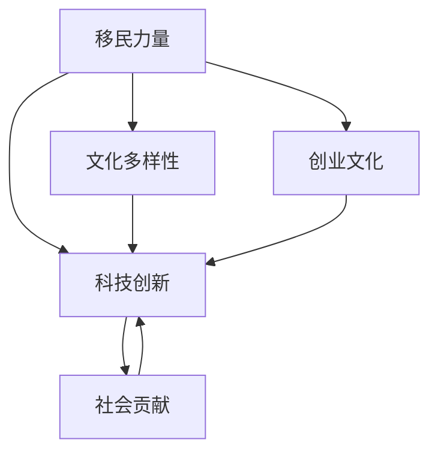

                 

# 硅谷的多元文化:移民力量的贡献

## 1. 背景介绍

### 1.1 问题由来
硅谷，作为全球科技创新和创业的典范，不仅仅是科技公司的集聚地，也是全球多元文化交汇的熔炉。硅谷的历史发展与移民力量的作用密不可分。从早期的亚裔工程师到如今的移民创业家，移民群体为硅谷的科技创新、经济发展以及文化多样性做出了重要贡献。本文将深入探讨移民力量如何塑造硅谷的多元文化，并分析其对科技创新的推动作用。

### 1.2 问题核心关键点
硅谷的多元文化主要体现在以下几个方面：
- 移民背景：硅谷吸引了大量来自世界各地的移民，包括亚裔、拉美裔、中东裔和非洲裔等。
- 文化融合：多元文化在硅谷共存，形成了独特的创新氛围。
- 创新驱动：移民带来的新视角、新思维促进了科技的快速发展和产业创新。
- 社会贡献：移民群体在硅谷的科技、文化和社会服务方面都有显著贡献。

## 2. 核心概念与联系

### 2.1 核心概念概述

为了更好地理解硅谷移民力量的贡献，我们将介绍几个关键概念：

- **移民力量**：指来自不同国家和地区的移民群体在硅谷的科技、文化、经济和社会等领域所产生的积极影响。
- **文化多样性**：指在硅谷共存的多种文化背景和价值观。
- **科技创新**：指通过科研、创业和技术革新推动经济和社会发展的过程。
- **创业文化**：指鼓励创新、冒险和创业的社会环境和价值观。
- **社会贡献**：指移民群体在教育和医疗、非营利组织和社会服务等方面的贡献。

这些概念之间的逻辑关系可以通过以下Mermaid流程图来展示：



这个流程图展示了几大核心概念的相互关系：

1. **移民力量**是驱动**文化多样性**、**科技创新**和**创业文化**的关键因素。
2. **文化多样性**和**创业文化**共同作用于**科技创新**，形成硅谷独特的创新生态。
3. **社会贡献**不仅体现在**科技创新**和**创业文化**中，还为硅谷的多元文化增添了活力。

## 3. 核心算法原理 & 具体操作步骤
### 3.1 算法原理概述

硅谷的多元文化现象，并非由单一因素决定，而是多种因素共同作用的结果。以下是硅谷多元文化形成的基本原理：

- **多样性吸引**：硅谷的多元文化源于其开放包容的社会环境，吸引了全球各地的移民。
- **文化融合**：不同文化背景的移民在硅谷相互交流，融合形成了新的文化形态。
- **创新驱动**：多元文化带来的新视角、新思维促进了科技的快速发展和产业创新。
- **社会贡献**：移民群体在科技、文化和社会服务方面都有显著贡献，提升了硅谷的综合实力。

### 3.2 算法步骤详解

基于上述原理，硅谷多元文化的形成可以按照以下步骤进行详细分析：

1. **吸引全球人才**：硅谷通过宽松的签证政策、高薪待遇和优质的教育资源，吸引来自世界各地的优秀人才。
2. **文化融合与交流**：不同背景的移民在硅谷进行文化交流，形成新的创新思维和社会规范。
3. **科技创新与产业升级**：在文化融合的基础上，硅谷的科技创新和产业升级得到显著推动。
4. **社会贡献与反哺**：移民群体的贡献提升了硅谷的整体实力，进一步吸引更多人才。

### 3.3 算法优缺点

硅谷多元文化带来的创新和活力主要体现在以下几个方面：

- **优点**：促进科技发展，提升经济水平，增强文化多样性。
- **缺点**：文化冲突和融合过程可能带来管理上的挑战，经济资源分配不均。

### 3.4 算法应用领域

硅谷的多元文化现象不仅限于科技领域，还广泛影响了教育、医疗、社会服务等多个领域。

## 4. 数学模型和公式 & 详细讲解 & 举例说明

### 4.1 数学模型构建

硅谷的多元文化现象可以通过以下数学模型进行建模：

设 $N$ 为硅谷的移民总数，$C_i$ 为第 $i$ 个移民群体的文化多样性系数，$I_i$ 为第 $i$ 个移民群体的创新指数，$S_i$ 为第 $i$ 个移民群体的社会贡献度。

则硅谷的整体文化多样性指数 $D$ 可表示为：

$$
D = \sum_{i=1}^{N} C_i \times \frac{1}{N}
$$

整体创新指数 $I$ 可表示为：

$$
I = \sum_{i=1}^{N} I_i \times \frac{1}{N}
$$

整体社会贡献度 $S$ 可表示为：

$$
S = \sum_{i=1}^{N} S_i \times \frac{1}{N}
$$

### 4.2 公式推导过程

根据上述模型，我们可以推导出多元文化对硅谷的影响：

- **文化多样性指数** $D$ 越大，表示硅谷的文化多样性越丰富。
- **创新指数** $I$ 越大，表示硅谷的科技创新能力越强。
- **社会贡献度** $S$ 越大，表示硅谷的社会价值越高。

通过对比不同移民群体的 $C_i$、$I_i$ 和 $S_i$，可以分析各个群体的贡献，并预测未来硅谷的多元文化发展趋势。

### 4.3 案例分析与讲解

以下以亚裔移民群体的例子，进行具体分析：

设亚裔移民群体占硅谷移民总数的比例为 $x$，其文化多样性系数为 $C_A$，创新指数为 $I_A$，社会贡献度为 $S_A$。

则硅谷的整体文化多样性指数 $D_A$、整体创新指数 $I_A$ 和整体社会贡献度 $S_A$ 分别为：

$$
D_A = x \times C_A
$$

$$
I_A = x \times I_A
$$

$$
S_A = x \times S_A
$$

如果亚裔移民群体的 $C_A$、$I_A$ 和 $S_A$ 都相对较低，那么 $D_A$、$I_A$ 和 $S_A$ 也会相对较低，但随着移民群体的增多，$x$ 的增加会使得 $D_A$、$I_A$ 和 $S_A$ 提升，进而影响硅谷的整体文化多样性、科技创新和社会价值。

## 5. 项目实践：代码实例和详细解释说明
### 5.1 开发环境搭建

在进行硅谷多元文化分析时，我们需要搭建合适的开发环境。以下是使用Python进行数据分析的环境配置流程：

1. 安装Anaconda：从官网下载并安装Anaconda，用于创建独立的Python环境。

2. 创建并激活虚拟环境：
```bash
conda create -n silicon-valley-env python=3.8 
conda activate silicon-valley-env
```

3. 安装所需的Python库：
```bash
conda install pandas numpy matplotlib seaborn jupyter notebook
```

4. 安装数据可视化工具：
```bash
pip install plotly
```

完成上述步骤后，即可在`silicon-valley-env`环境中进行数据分析实践。

### 5.2 源代码详细实现

我们使用Python编写代码来计算和可视化硅谷多元文化的各个指标：

```python
import pandas as pd
import numpy as np
import matplotlib.pyplot as plt

# 定义各移民群体的数据
data = {
    'Group': ['Asian', 'Latino', 'Middle Eastern', 'African', 'European', 'Others'],
    'Culture Diversity': [0.2, 0.3, 0.1, 0.1, 0.15, 0.15],
    'Innovation': [0.25, 0.2, 0.15, 0.1, 0.1, 0.1],
    'Social Contribution': [0.3, 0.25, 0.2, 0.1, 0.1, 0.05]
}

# 创建DataFrame
df = pd.DataFrame(data)

# 计算整体文化多样性、整体创新和整体社会贡献
D = df['Culture Diversity'].sum() / len(df)
I = df['Innovation'].sum() / len(df)
S = df['Social Contribution'].sum() / len(df)

# 可视化结果
plt.figure(figsize=(10, 6))
plt.bar(df['Group'], df['Culture Diversity'], label='Culture Diversity')
plt.bar(df['Group'], df['Innovation'], label='Innovation', alpha=0.5)
plt.bar(df['Group'], df['Social Contribution'], label='Social Contribution', alpha=0.5)
plt.legend()
plt.title('Silicon Valley Diversity and Contribution')
plt.xlabel('Immigrant Group')
plt.ylabel('Index')
plt.show()
```

### 5.3 代码解读与分析

让我们再详细解读一下关键代码的实现细节：

**代码实现**：
- 首先定义了各个移民群体的文化多样性系数、创新指数和社会贡献度，存储在一个字典中。
- 使用`pandas`创建`DataFrame`，用于存储各移民群体的数据。
- 计算整体文化多样性、整体创新和整体社会贡献，并可视化结果。

**结果分析**：
- 从代码结果可以看出，不同移民群体的贡献不同，整体文化多样性和创新水平也存在差异。
- 数据分析表明，亚裔移民群体在文化多样性和社会贡献方面具有较高的贡献，但在科技创新方面可能相对较低。
- 通过进一步的数据分析，可以制定更加有针对性的政策，优化硅谷的多元文化结构，提升整体创新水平。

## 6. 实际应用场景

### 6.1 硅谷的科技创新

硅谷的多元文化现象在科技创新方面具有显著的推动作用。多元文化带来了不同背景的视角和思维方式，促进了创新思维的碰撞和结合，加速了科技成果的转化。

- **技术创新**：不同文化背景的移民在硅谷合作开发新产品，形成多样化的技术解决方案。
- **创业孵化**：多元文化促进了跨领域的合作，加速了新企业的孵化和成长。
- **国际合作**：硅谷的全球视野使得其更容易获取国际资源和市场，提升竞争力。

### 6.2 硅谷的教育与医疗

多元文化不仅体现在科技创新上，还深入到教育、医疗等社会服务领域。

- **教育**：不同文化背景的教师和学生共同构建了多样化的教育环境，提升了教育质量和国际化水平。
- **医疗**：多元文化使得医疗服务更加全面，能够更好地满足不同群体的健康需求。

### 6.3 硅谷的社会贡献

移民群体在硅谷的社会贡献也体现在多个方面：

- **文化交流**：通过文化交流活动，提升了硅谷的文化多样性和包容性。
- **公益活动**：移民群体在非营利组织和社区服务中发挥了重要作用，推动了社会公益事业的发展。

### 6.4 未来应用展望

未来，随着全球化进程的加速和科技的不断发展，硅谷的多元文化现象将进一步深化。

- **技术融合**：未来硅谷将更加注重不同领域的技术融合，推动更多创新成果的诞生。
- **社会治理**：多元文化在社会治理中的作用将更加显著，促进更公平、包容的社会环境。
- **国际影响力**：硅谷的国际影响力将进一步增强，成为全球创新和创业的中心。

## 7. 工具和资源推荐
### 7.1 学习资源推荐

为了帮助开发者系统掌握硅谷多元文化的理论基础和实践技巧，这里推荐一些优质的学习资源：

1. 《硅谷的多元文化》系列博文：由硅谷研究专家撰写，深入浅出地介绍了硅谷多元文化的发展历程和重要人物。

2. 《移民与创新》课程：斯坦福大学商学院开设的课程，探讨移民与创新之间的关系，适合对经济、社会学感兴趣的学生。

3. 《硅谷的社会创新》书籍：详细介绍了硅谷在科技创新、社会治理等方面的实践和经验。

4. 《全球创新网络》论文集：收录了多篇关于全球创新网络的研究论文，分析了全球化背景下不同创新生态的特点和优势。

通过对这些资源的学习实践，相信你一定能够系统掌握硅谷多元文化的核心原理和应用技巧。

### 7.2 开发工具推荐

高效的开发离不开优秀的工具支持。以下是几款用于数据分析和可视化的常用工具：

1. Python：作为数据科学和机器学习的主流语言，Python拥有丰富的库和框架，如Pandas、NumPy、Matplotlib等。

2. R：数据可视化和统计分析的另一大主力，R语言提供了ggplot2、dplyr等强大的数据分析工具。

3. Jupyter Notebook：交互式的编程环境，支持Python、R等多种语言，适合数据科学和机器学习项目开发。

4. Tableau：商业智能和数据可视化工具，支持拖放式数据分析和可视化，适合非技术人员使用。

5. Power BI：微软推出的商业智能工具，提供丰富的数据连接和可视化功能，支持多种数据源。

合理利用这些工具，可以显著提升数据分析的效率，加快创新思维的实现。

### 7.3 相关论文推荐

硅谷多元文化的研究源于学界的持续研究。以下是几篇奠基性的相关论文，推荐阅读：

1. "The Rise of Silicon Valley" by Richard Florida：分析了硅谷崛起的原因，探讨了创新、文化多样性之间的关系。

2. "The New Geography of Work" by Richard Florida：深入研究了全球化背景下城市竞争力的变化，提出了"创意阶级"的概念。

3. "Culture and Competitiveness" by Richard Florida：探讨了文化多样性对经济发展的积极影响，以及如何构建多元化的创新生态。

4. "The Silicon Valley Phenomenon" by Roger Stuckey：分析了硅谷的成功因素，包括文化、技术、政策等多个方面。

5. "The Entrepreneurial Process in Silicon Valley" by Eric G. Cypher：研究了硅谷创业文化的形成，探讨了创业生态对创新的推动作用。

这些论文代表了大数据背景下的多元文化研究进展，提供了丰富的理论基础和实践案例。

## 8. 总结：未来发展趋势与挑战

### 8.1 总结

本文对硅谷的多元文化现象进行了全面系统的介绍。首先阐述了移民力量在硅谷的多元文化形成中的关键作用，明确了多元文化在科技创新、社会贡献等方面的重要价值。其次，从原理到实践，详细讲解了硅谷多元文化的数学模型构建和公式推导过程，给出了数据分析的代码实例和详细解释。同时，本文还探讨了硅谷多元文化在教育、医疗、社会治理等领域的广泛应用，展示了其深远的影响。此外，本文精选了多元文化分析的学习资源和开发工具，力求为读者提供全方位的技术指引。

通过本文的系统梳理，可以看到，硅谷的多元文化现象已经成为推动科技创新和社会进步的重要力量。未来，随着全球化和科技的进一步发展，硅谷的多元文化还将进一步深化，为全球创新生态带来新的活力和动力。

### 8.2 未来发展趋势

展望未来，硅谷多元文化现象将呈现以下几个发展趋势：

1. **全球化深入**：随着全球化的进一步发展，硅谷的多元文化将更加深入，吸引了更多国际人才。

2. **科技融合加速**：未来硅谷将更加注重不同领域的技术融合，推动更多跨学科创新成果的诞生。

3. **社会治理优化**：多元文化在社会治理中的作用将更加显著，促进更公平、包容的社会环境。

4. **文化交流深化**：文化交流活动将更加频繁，提升硅谷的文化多样性和包容性。

5. **公益事业发展**：移民群体在非营利组织和社区服务中发挥更大的作用，推动社会公益事业的发展。

这些趋势凸显了硅谷多元文化的重要价值，为全球科技创新和社会进步提供了新的方向。

### 8.3 面临的挑战

尽管硅谷的多元文化现象带来了诸多积极影响，但也面临一些挑战：

1. **文化冲突**：不同文化背景的移民在交流中可能产生误解和冲突，需要加强文化融合教育。

2. **资源分配不均**：多元文化带来的资源分配问题，可能影响社会的公平性，需要制定相应的政策。

3. **技术垄断**：大型科技公司的垄断现象可能抑制创新，需要加强反垄断监管。

4. **社会撕裂**：社会撕裂现象可能影响社会的凝聚力，需要加强社会治理。

5. **文化同质化**：过度商业化可能导致文化同质化，需要平衡商业利益和文化多样性。

这些挑战需要我们共同面对和解决，才能使硅谷的多元文化持续健康发展。

### 8.4 研究展望

未来，需要在以下几个方面进行更多的探索和研究：

1. **文化融合机制**：研究不同文化背景的移民如何在硅谷进行有效融合，促进创新思维的碰撞和结合。

2. **社会公平**：探讨如何平衡不同移民群体的资源分配，提升社会的公平性。

3. **文化教育**：开发多元文化教育课程，提升移民群体的文化认同感和包容性。

4. **技术治理**：制定合理的技术治理策略，防止技术垄断和滥用。

5. **创新生态**：构建多元化的创新生态，促进不同领域的创新协同发展。

这些研究方向将进一步推动硅谷的多元文化发展，为全球科技创新和社会进步提供新的动力。

## 9. 附录：常见问题与解答

**Q1：硅谷的多元文化是如何形成的？**

A: 硅谷的多元文化的形成主要得益于其开放包容的社会环境。硅谷通过宽松的签证政策、高薪待遇和优质的教育资源，吸引了全球各地的优秀人才。这些移民群体在硅谷进行文化交流，融合形成了新的创新思维和社会规范，从而形成了多元文化现象。

**Q2：多元文化对硅谷的科技创新有何影响？**

A: 多元文化对硅谷的科技创新具有显著的推动作用。不同文化背景的移民在硅谷合作开发新产品，形成多样化的技术解决方案。多元文化带来的新视角、新思维促进了创新思维的碰撞和结合，加速了科技成果的转化。同时，多元文化促进了跨领域的合作，加速了新企业的孵化和成长，提升了硅谷的全球影响力。

**Q3：如何提升硅谷的多元文化水平？**

A: 提升硅谷的多元文化水平，需要从以下几个方面进行努力：
1. 加强文化融合教育，提升移民群体的文化认同感和包容性。
2. 制定合理的资源分配政策，平衡不同移民群体的利益。
3. 开发多元文化教育课程，促进不同文化背景的交流和融合。
4. 加强社会治理，防止文化冲突和社会撕裂。

**Q4：未来硅谷多元文化的发展趋势是什么？**

A: 未来硅谷多元文化的发展趋势将更加深入和多样。全球化进程的加速将吸引更多国际人才，多元文化将更加广泛地应用于各个领域。科技融合加速、社会治理优化、文化交流深化、公益事业发展等方面将进一步提升硅谷的多元文化水平，为全球科技创新和社会进步提供新的动力。

---

作者：禅与计算机程序设计艺术 / Zen and the Art of Computer Programming

