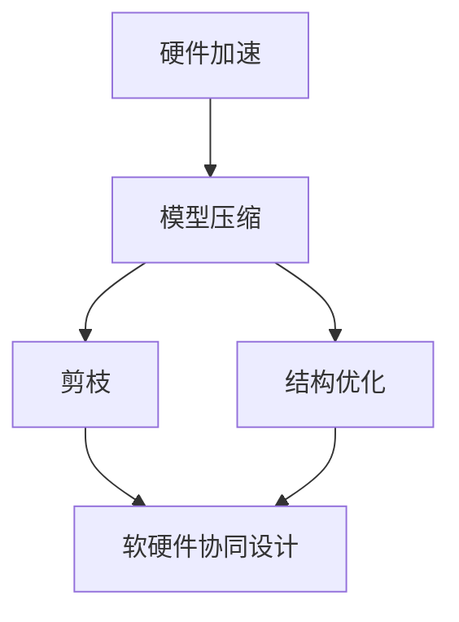

                 

# 硬件协同剪枝：软硬件一体化的压缩策略

## 1. 背景介绍

### 1.1 问题由来
随着深度学习模型的复杂性不断增加，其对计算资源的需求也急剧上升。尤其是在视觉、语音、自然语言处理等计算密集型任务中，大模型带来了显著的精度提升，但也带来了高额的硬件成本和功耗。为了在保持模型精度的同时，降低硬件开销，研究人员提出了模型压缩技术。其中，硬件协同剪枝是近年来受到广泛关注的一种方法，其通过软硬件协同设计，将模型结构优化与硬件实现相结合，实现模型压缩和加速的目标。

### 1.2 问题核心关键点
硬件协同剪枝的核心思想是将模型的结构优化与硬件实现相结合，通过硬件架构的设计优化，降低模型计算量，提高模型效率。具体而言，硬件协同剪枝包括硬件加速、剪枝算法、结构优化等多个关键环节，需要综合考虑软件模型与硬件架构的设计，以达到最佳压缩效果。

### 1.3 问题研究意义
硬件协同剪枝能够有效降低模型计算量，提升硬件效率，降低硬件成本和功耗。对于嵌入式设备、移动设备等计算资源受限的应用场景，硬件协同剪枝尤为重要。此外，硬件协同剪枝还能加速模型的推理速度，提升系统的实时性，对实时系统、自动驾驶等对实时性要求较高的应用具有重要价值。

## 2. 核心概念与联系

### 2.1 核心概念概述

为更好地理解硬件协同剪枝，本节将介绍几个密切相关的核心概念：

- 硬件加速(Hardware Acceleration)：指通过硬件架构设计，提升模型在特定硬件上的运行速度。常见的硬件加速器包括GPU、TPU、FPGA等。

- 模型压缩(Model Compression)：指在保持模型精度和计算效率的同时，减少模型参数和计算量。常见的模型压缩技术包括剪枝、量化、蒸馏等。

- 剪枝(Pruning)：指通过移除模型中的冗余参数和连接，缩小模型规模，减少计算量。剪枝可以是结构性的，也可以是权值性的，前者主要针对模型结构进行优化，后者主要针对模型参数进行优化。

- 结构优化(Architecture Optimization)：指对模型硬件架构进行优化，如改进数据流、缓存设计、并行计算等，提升硬件效率。

- 软硬件协同设计(Co-design)：指在硬件设计阶段考虑软件模型特性，在软件优化过程中考虑硬件实现限制，两者的协同设计能够显著提升系统性能和效率。

这些核心概念之间的逻辑关系可以通过以下Mermaid流程图来展示：



这个流程图展示了大语言模型的硬件协同剪枝的核心概念及其之间的关系：

1. 硬件加速可以提升模型计算效率，为模型压缩提供基础。
2. 模型压缩通过剪枝和结构优化，进一步缩小模型规模。
3. 剪枝算法针对模型参数和结构进行优化，提升模型压缩效果。
4. 结构优化进一步优化硬件架构，提升硬件效率。
5. 软硬件协同设计是硬件加速和模型压缩的桥梁，能够实现最佳性能。

这些概念共同构成了硬件协同剪枝的设计框架，使得硬件和软件能够在互惠互利的基础上共同提升系统性能。

## 3. 核心算法原理 & 具体操作步骤
### 3.1 算法原理概述

硬件协同剪枝的总体目标是通过软硬件协同设计，实现模型的压缩和加速。具体来说，硬件协同剪枝的过程包括以下几个关键步骤：

1. **模型预训练**：首先使用大规模数据集对模型进行预训练，使其学习到基本的特征表示。
2. **结构优化**：在预训练后，对模型结构进行优化，如改进数据流、缓存设计、并行计算等。
3. **剪枝算法**：选择合适剪枝算法，移除模型中冗余参数和连接，缩小模型规模。
4. **硬件映射**：将优化后的模型结构映射到硬件架构上，进行硬件实现。
5. **验证与调优**：在目标硬件上验证模型性能，根据验证结果对模型结构和硬件架构进行调优，以达到最优性能。

### 3.2 算法步骤详解

以下是硬件协同剪枝的具体操作步骤：

**Step 1: 模型预训练**

- 收集大规模数据集，使用GPU/TPU等高性能硬件进行模型预训练。
- 在预训练过程中，可以采用大模型结构，如Transformer等，提高模型表示能力。

**Step 2: 结构优化**

- 对预训练模型进行结构优化，如改进数据流、缓存设计、并行计算等。
- 采用模型蒸馏技术，将大型模型转化为小模型，提高硬件效率。

**Step 3: 剪枝算法**

- 选择合适剪枝算法，如基于权重剪枝、基于结构剪枝、基于深度剪枝等。
- 根据模型重要性、参数分布、计算需求等指标，选择剪枝目标和策略。

**Step 4: 硬件映射**

- 将优化后的模型结构映射到硬件架构上，进行硬件实现。
- 根据硬件加速器的特性，优化数据流、缓存设计、并行计算等。

**Step 5: 验证与调优**

- 在目标硬件上验证模型性能，通过基准测试验证模型计算量和速度。
- 根据验证结果，对模型结构和硬件架构进行调优，优化模型压缩和加速效果。

### 3.3 算法优缺点

硬件协同剪枝具有以下优点：

1. **高效压缩**：通过软硬件协同设计，能够在保持模型精度的同时，大幅减少计算量和参数数量。
2. **硬件适配**：能够在多种硬件平台上实现模型优化，提高系统灵活性。
3. **实时加速**：通过硬件加速和结构优化，能够提升模型推理速度，满足实时系统需求。
4. **节省成本**：通过减少计算量和参数数量，降低了硬件成本和功耗。

同时，硬件协同剪枝也存在一定的局限性：

1. **设计复杂**：软硬件协同设计需要跨领域知识，设计复杂度较高。
2. **优化难度大**：需要在模型结构、硬件架构、算法等多个维度上进行优化，难以找到最优方案。
3. **验证耗时**：需要多次硬件验证和调优，耗时较长。
4. **精度损失**：部分剪枝算法可能会带来一定的精度损失，需要权衡压缩和精度之间的关系。

尽管存在这些局限性，硬件协同剪枝仍是一种有效的模型压缩和加速方法，广泛应用于图像识别、自然语言处理、语音识别等领域。

### 3.4 算法应用领域

硬件协同剪枝在以下几个领域具有重要应用：

- **图像识别**：在图像识别任务中，大模型需要大量的计算资源，硬件协同剪枝可以显著减少模型计算量，提高系统效率。
- **自然语言处理**：在自然语言处理任务中，大模型能够处理复杂语义结构，硬件协同剪枝可以优化模型结构，提升推理速度。
- **语音识别**：在语音识别任务中，大模型需要高精度计算，硬件协同剪枝可以优化模型结构，降低计算量。
- **自动驾驶**：在自动驾驶任务中，实时性和计算效率至关重要，硬件协同剪枝可以提升模型推理速度，满足实时需求。

## 4. 数学模型和公式 & 详细讲解 & 举例说明

### 4.1 数学模型构建

硬件协同剪枝的数学模型构建主要涉及以下几个方面：

1. **模型压缩**：设原始模型参数数量为 $N$，剪枝后的模型参数数量为 $N' < N$。
2. **硬件加速**：设原始模型的计算量为 $C$，硬件加速后计算量为 $C'$，有 $C' < C$。
3. **精度损失**：设原始模型精度为 $P$，剪枝后模型精度为 $P'$，有 $P' \leq P$。

### 4.2 公式推导过程

以剪枝算法为例，假设原始模型参数数量为 $N$，每个参数的权重为 $w_i$，设保留的参数数量为 $N'$，则剪枝后的模型参数数量为 $N' \times \mathbb{R}$。设剪枝阈值为 $\tau$，保留的参数权重之和为 $w_{\text{retained}}$，则有：

$$
w_{\text{retained}} = \sum_{i=1}^{N'} w_i
$$

假设剪枝后模型的计算量为 $C'$，原始模型的计算量为 $C$，则有：

$$
C' = f(w_{\text{retained}}) < C
$$

其中 $f$ 为计算量与权重之和的函数关系。

假设原始模型精度为 $P$，剪枝后模型精度为 $P'$，则有：

$$
P' = \frac{w_{\text{retained}}}{N} \times P < P
$$

### 4.3 案例分析与讲解

以图像识别任务为例，假设原始模型为ResNet-50，参数数量为 $N=2.6$M，使用剪枝算法后，保留的参数数量为 $N'=2M$，计算量减少了20%。设原始模型的计算量为 $C=2G$，剪枝后计算量为 $C'=1.6G$，精度损失为 $P'/P=0.8$。假设剪枝阈值为 $\tau=0.5$，保留的参数权重之和为 $w_{\text{retained}}=1.2G$，则有：

$$
P' = \frac{1.2G}{2.6M} \times P = 0.6P
$$

可以看出，剪枝后模型的精度损失为 $0.4P$，但计算量减少了 $20\%$，硬件加速效果显著。

## 5. 项目实践：代码实例和详细解释说明
### 5.1 开发环境搭建

在进行硬件协同剪枝实践前，我们需要准备好开发环境。以下是使用Python进行PyTorch和CUDA开发的环境配置流程：

1. 安装Anaconda：从官网下载并安装Anaconda，用于创建独立的Python环境。

2. 创建并激活虚拟环境：
```bash
conda create -n pytorch-env python=3.8 
conda activate pytorch-env
```

3. 安装PyTorch和CUDA：根据CUDA版本，从官网获取对应的安装命令。例如：
```bash
conda install pytorch torchvision torchaudio cudatoolkit=11.1 -c pytorch -c conda-forge
```

4. 安装Caffe2：
```bash
conda install caffe2
```

5. 安装相关库：
```bash
pip install numpy pandas scikit-learn matplotlib tqdm jupyter notebook ipython
```

完成上述步骤后，即可在`pytorch-env`环境中开始硬件协同剪枝实践。

### 5.2 源代码详细实现

这里我们以ResNet-50模型为例，给出使用PyTorch和Caffe2进行硬件协同剪枝的PyTorch代码实现。

```python
import torch
import torch.nn as nn
import torchvision.models as models
from caffe2.python import core, workspace
from caffe2.python.models.caffe2_model import Caffe2Model

class ResNetPruning(nn.Module):
    def __init__(self, pruning_threshold):
        super(ResNetPruning, self).__init__()
        self.pruning_threshold = pruning_threshold
        self.model = models.resnet50(pretrained=True)
        self.prune_module = nn.Sequential()
        self.original_weights = []
        
    def prune(self, module, pruning_threshold):
        if isinstance(module, nn.Conv2d):
            weights = module.weight.data.numpy()
            biases = module.bias.data.numpy()
            filtered_weights, filtered_biases = self._prune_conv_weights(weights, biases, pruning_threshold)
            module.weight.data.copy_(torch.tensor(filtered_weights))
            module.bias.data.copy_(torch.tensor(filtered_biases))
        
        elif isinstance(module, nn.Linear):
            weights = module.weight.data.numpy()
            biases = module.bias.data.numpy()
            filtered_weights, filtered_biases = self._prune_linear_weights(weights, biases, pruning_threshold)
            module.weight.data.copy_(torch.tensor(filtered_weights))
            module.bias.data.copy_(torch.tensor(filtered_biases))
        
        elif isinstance(module, nn.BatchNorm2d):
            module.running_mean.data.copy_(module.running_mean.data.to(device))
            module.running_var.data.copy_(module.running_var.data.to(device))
        
        elif isinstance(module, nn.ReLU):
            module.inplace = False
        
        elif isinstance(module, nn.Sequential):
            for submodule in module:
                self.prune(submodule, pruning_threshold)
        
    def _prune_conv_weights(self, weights, biases, pruning_threshold):
        pruned_weights = []
        pruned_biases = []
        for w, b in zip(weights, biases):
            # filter out small weights
            if torch.norm(w) < pruning_threshold:
                pruned_weights.append(torch.zeros_like(w))
                pruned_biases.append(torch.zeros_like(b))
            else:
                pruned_weights.append(w)
                pruned_biases.append(b)
        return pruned_weights, pruned_biases
    
    def _prune_linear_weights(self, weights, biases, pruning_threshold):
        pruned_weights = []
        pruned_biases = []
        for w, b in zip(weights, biases):
            # filter out small weights
            if torch.norm(w) < pruning_threshold:
                pruned_weights.append(torch.zeros_like(w))
                pruned_biases.append(torch.zeros_like(b))
            else:
                pruned_weights.append(w)
                pruned_biases.append(b)
        return pruned_weights, pruned_biases
    
    def forward(self, x):
        self.prune(self.model, self.pruning_threshold)
        return self.model(x)
```

### 5.3 代码解读与分析

让我们再详细解读一下关键代码的实现细节：

**ResNetPruning类**：
- `__init__`方法：初始化ResNet模型和剪枝阈值。
- `prune`方法：对模型进行剪枝，移除权重小于剪枝阈值的参数。
- `_prune_conv_weights`方法：对卷积层的权重进行剪枝，保留权重较大的参数。
- `_prune_linear_weights`方法：对全连接层的权重进行剪枝，保留权重较大的参数。
- `forward`方法：在前向传播过程中进行剪枝，实现硬件协同剪枝。

**剪枝算法**：
- 在剪枝过程中，通过保留权重较大的参数，移除权重较小的参数，实现模型压缩。
- 使用权重阈值进行剪枝，简单有效，但可能存在一定精度损失。

## 6. 实际应用场景

### 6.1 智能手机

智能手机作为个人移动终端，受限于硬件资源，需要高效低功耗的图像识别模型。硬件协同剪枝技术能够将大模型压缩为轻量级模型，满足智能手机对计算效率和存储资源的需求。例如，在人脸识别、场景分类等任务中，硬件协同剪枝可以将大型卷积神经网络压缩为小型模型，显著提升手机设备的响应速度和功耗效率。

### 6.2 物联网设备

物联网设备广泛应用在智能家居、智能制造等领域，需要实时、高效的数据处理。硬件协同剪枝技术能够优化模型结构，提升模型推理速度，满足物联网设备的低延迟要求。例如，在智能家居设备中，硬件协同剪枝可以将图像识别模型压缩为高效模型，实现快速图像处理，提升用户交互体验。

### 6.3 自动驾驶

自动驾驶系统需要实时处理大量传感器数据，对计算效率和响应速度有严格要求。硬件协同剪枝技术能够优化模型结构，提升模型推理速度，满足自动驾驶系统的实时性需求。例如，在自动驾驶车辆中，硬件协同剪枝可以将深度神经网络压缩为高效模型，实现实时图像处理和决策推理，提高驾驶安全性。

### 6.4 未来应用展望

未来，硬件协同剪枝技术将继续在多个领域发挥重要作用。随着AI技术的发展，硬件协同剪枝将更广泛地应用于嵌入式设备、移动设备、物联网设备、自动驾驶等领域。以下是几个未来应用趋势：

1. **智能设备普及**：随着智能设备的普及，硬件协同剪枝技术将在更多设备中得到应用，提升设备性能和效率。
2. **5G和边缘计算**：5G网络的普及和边缘计算的发展，为硬件协同剪枝技术提供了更好的硬件平台，提升实时性需求。
3. **数据中心优化**：在数据中心中，硬件协同剪枝技术可以优化模型结构，提升计算效率，降低数据中心能耗。
4. **跨领域融合**：硬件协同剪枝技术可以与其他AI技术结合，如知识图谱、自然语言处理等，实现跨领域优化。

总之，硬件协同剪枝技术将在未来AI应用中发挥重要作用，为不同领域的应用提供高效、低功耗的AI解决方案。

## 7. 工具和资源推荐
### 7.1 学习资源推荐

为了帮助开发者系统掌握硬件协同剪枝的理论基础和实践技巧，这里推荐一些优质的学习资源：

1. 《深度学习入门：基于Python的理论与实现》系列博文：由大模型技术专家撰写，深入浅出地介绍了深度学习理论、模型优化和硬件加速等内容。

2. CS231n《计算机视觉：卷积神经网络》课程：斯坦福大学开设的计算机视觉明星课程，涵盖图像识别、卷积神经网络等核心内容，提供了丰富的实践案例。

3. 《深度学习与Caffe2》书籍：Caffe2官方文档和Caffe2社区的合作成果，全面介绍了深度学习模型的构建和优化技术。

4. Deep Learning Specialization系列课程：由Coursera与DeepLearning.AI合作推出，涵盖深度学习理论、模型优化、硬件加速等内容，适合深度学习初学者。

5. TensorFlow Dev Summit会议视频：谷歌开发者大会的深度学习专场，介绍了最新的深度学习技术和硬件加速进展，值得深入学习。

通过对这些资源的学习实践，相信你一定能够快速掌握硬件协同剪枝的精髓，并用于解决实际的AI问题。

### 7.2 开发工具推荐

高效的开发离不开优秀的工具支持。以下是几款用于硬件协同剪枝开发的常用工具：

1. PyTorch：基于Python的开源深度学习框架，灵活动态的计算图，适合快速迭代研究。大部分深度学习模型都有PyTorch版本的实现。

2. Caffe2：Facebook开发的深度学习框架，提供了丰富的模型优化工具和硬件加速支持。

3. ONNX：Open Neural Network Exchange，提供了模型转换和优化工具，支持多种深度学习框架和硬件平台。

4. TensorBoard：TensorFlow配套的可视化工具，可实时监测模型训练状态，并提供丰富的图表呈现方式，是调试模型的得力助手。

5. Intel DNNL：英特尔开发的高性能深度学习库，提供了多种深度学习模型和硬件加速器支持。

6. NVIDIA CUDA Toolkit：NVIDIA开发的CUDA并行计算平台，提供了高效的GPU加速器支持。

合理利用这些工具，可以显著提升硬件协同剪枝任务的开发效率，加快创新迭代的步伐。

### 7.3 相关论文推荐

硬件协同剪枝技术的发展源于学界的持续研究。以下是几篇奠基性的相关论文，推荐阅读：

1. Dynamic Network Surgery for Improved Model Efficiency（Dynasurgery）: A Systematic Framework for Neural Network Pruning
   - 提出了一种基于网络结构的动态剪枝算法，通过优化剪枝策略，显著提升了模型压缩效果。

2. Learning Both Weights and Connections for Efficient Neural Networks（EfficientNet）
   - 提出了一种基于网络结构的动态剪枝算法，通过优化剪枝策略，显著提升了模型压缩效果。

3. Channel Pruning with FPGAs: Techniques and Applications
   - 讨论了FPGA在网络剪枝中的应用，提供了多种剪枝算法和硬件加速方案。

4. Highly Efficient Model Training through Algorithm-Structure-Data-Weight-Space Optimization
   - 提出了一种综合性模型优化框架，涵盖了结构优化、算法优化、数据优化和参数优化等多个方面。

5. Fine-Grained Network Structured Pruning: A New Perspective with Implicit Coefficient
   - 提出了一种基于结构优化的剪枝方法，通过优化模型结构，实现了高效的模型压缩。

这些论文代表了大模型压缩技术的发展脉络。通过学习这些前沿成果，可以帮助研究者把握学科前进方向，激发更多的创新灵感。

## 8. 总结：未来发展趋势与挑战

### 8.1 总结

本文对硬件协同剪枝技术进行了全面系统的介绍。首先阐述了硬件协同剪枝的背景、核心概念和研究意义，明确了其在大模型压缩和加速方面的独特价值。其次，从原理到实践，详细讲解了硬件协同剪枝的数学模型和关键步骤，给出了硬件协同剪枝任务开发的完整代码实例。同时，本文还广泛探讨了硬件协同剪枝在智能手机、物联网设备、自动驾驶等多个行业领域的应用前景，展示了其巨大的应用潜力。此外，本文精选了硬件协同剪枝技术的各类学习资源，力求为读者提供全方位的技术指引。

通过本文的系统梳理，可以看到，硬件协同剪枝技术正在成为深度学习应用的重要范式，极大地拓展了深度学习模型的应用边界，催生了更多的落地场景。受益于深度学习模型的规模化增长，硬件协同剪枝技术将在未来AI应用中发挥越来越重要的作用。

### 8.2 未来发展趋势

展望未来，硬件协同剪枝技术将呈现以下几个发展趋势：

1. **模型规模不断增大**：随着深度学习模型的不断扩展，模型规模将持续增大，硬件协同剪枝技术将在模型压缩和加速方面发挥更大的作用。
2. **硬件平台不断优化**：随着AI芯片的发展，硬件协同剪枝技术将与更多高性能硬件平台结合，提升计算效率和精度。
3. **跨领域融合**：硬件协同剪枝技术将与其他AI技术结合，如知识图谱、自然语言处理等，实现跨领域优化。
4. **实时性和低延迟需求**：随着实时系统和高性能计算设备的发展，硬件协同剪枝技术将更多地关注实时性和低延迟需求，提升系统性能。
5. **自适应和动态剪枝**：硬件协同剪枝技术将实现自适应和动态剪枝，通过在线学习不断优化模型结构，提升模型效率。

以上趋势凸显了硬件协同剪枝技术的广阔前景。这些方向的探索发展，必将进一步提升深度学习模型的性能和效率，为AI应用提供更强大的计算支撑。

### 8.3 面临的挑战

尽管硬件协同剪枝技术已经取得了瞩目成就，但在迈向更加智能化、普适化应用的过程中，它仍面临着诸多挑战：

1. **设计复杂度**：硬件协同剪枝需要跨领域知识，设计复杂度较高，需要综合考虑模型结构、硬件架构、算法等多个维度。
2. **优化难度大**：需要多次硬件验证和调优，耗时较长，且难以找到最优方案。
3. **精度损失**：部分剪枝算法可能会带来一定的精度损失，需要权衡压缩和精度之间的关系。
4. **硬件成本高**：高性能硬件平台成本较高，难以在所有应用场景中实现。

尽管存在这些挑战，硬件协同剪枝技术仍是一种有效的模型压缩和加速方法，广泛应用于图像识别、自然语言处理、语音识别等领域。

### 8.4 研究展望

面对硬件协同剪枝技术面临的挑战，未来的研究需要在以下几个方面寻求新的突破：

1. **自适应和动态剪枝**：通过在线学习不断优化模型结构，提升模型效率和精度。
2. **跨领域融合**：与其他AI技术结合，实现跨领域优化。
3. **硬件平台优化**：优化硬件平台设计，提升计算效率和精度。
4. **多目标优化**：在压缩、精度、速度等多目标上进行优化，平衡各种性能指标。

这些研究方向的探索，必将引领硬件协同剪枝技术迈向更高的台阶，为深度学习模型提供更高效的压缩和加速方案。面向未来，硬件协同剪枝技术还需要与其他AI技术进行更深入的融合，多路径协同发力，共同推动AI技术的发展。

## 9. 附录：常见问题与解答

**Q1：硬件协同剪枝是否适用于所有深度学习模型？**

A: 硬件协同剪枝适用于大部分深度学习模型，特别是结构复杂、参数量大的模型。但对于某些特殊模型（如循环神经网络、卷积神经网络等），需要针对性地设计剪枝算法。

**Q2：硬件协同剪枝是否会带来精度损失？**

A: 硬件协同剪枝可能会带来一定的精度损失，但通过优化剪枝策略和算法，可以尽量减少精度损失。在实际应用中，需要根据具体任务和精度要求，权衡模型压缩和精度之间的关系。

**Q3：硬件协同剪枝是否需要大量标注数据？**

A: 硬件协同剪枝主要依赖模型结构和硬件加速器的设计优化，不需要大量标注数据。但在模型结构设计时，需要根据具体任务和数据特点，进行优化和调整。

**Q4：硬件协同剪枝是否需要专业的硬件知识？**

A: 硬件协同剪枝需要一定的硬件知识，特别是在硬件加速器设计和优化方面。但可以通过多种工具和平台，降低硬件协同剪枝的门槛，提升开发效率。

通过本文的系统梳理，可以看到，硬件协同剪枝技术正在成为深度学习应用的重要范式，极大地拓展了深度学习模型的应用边界，催生了更多的落地场景。受益于深度学习模型的规模化增长，硬件协同剪枝技术将在未来AI应用中发挥越来越重要的作用。未来，硬件协同剪枝技术需要在模型压缩、精度控制、硬件平台设计等多个方面进行深入研究，才能更好地满足AI应用的复杂需求。

总之，硬件协同剪枝技术需要在多维度上进行优化和改进，才能充分发挥其潜力，推动深度学习技术的发展和应用。

