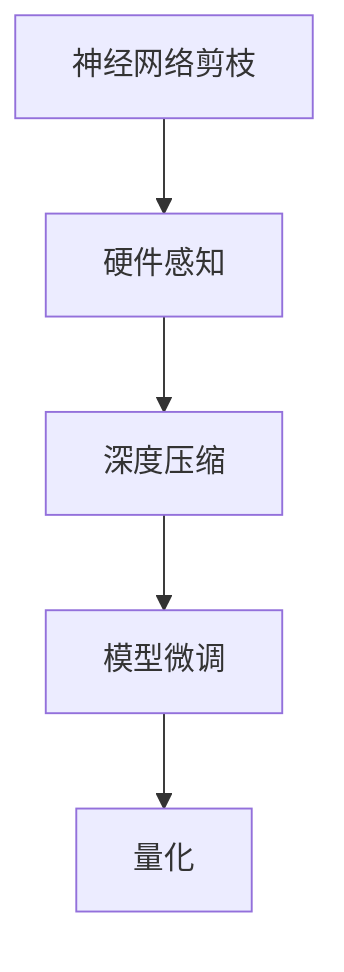

                 

## 1. 背景介绍

### 1.1 问题由来

随着AI技术的不断发展，神经网络模型变得越来越复杂，这也导致了训练和推理过程中资源需求的爆炸性增长。在大规模分布式训练中，这给计算资源、存储资源和能耗等方面带来了巨大压力。而模型压缩技术，尤其是硬件感知剪枝，成为了缓解这一压力的重要手段。

硬件感知剪枝（Hardware-Aware Pruning）是一种深度学习模型压缩技术，通过分析不同硬件平台的特点和限制，选择合适的剪枝策略，实现既不损失模型性能又能提升计算效率的目标。这种技术在硬件资源有限的情况下，能够极大地提高模型的推理效率，同时保证模型的准确性和可靠性。

### 1.2 问题核心关键点

硬件感知剪枝的核心在于：

1. **硬件分析**：深入分析硬件平台（如CPU、GPU、移动设备等）的特性，包括算力、内存带宽、能耗等方面的限制。
2. **剪枝策略**：根据硬件分析结果，选择适合该平台的剪枝策略，如网络架构优化、参数量减少、精度降低等。
3. **优化目标**：平衡模型的推理速度和计算精度，确保模型在硬件平台上的性能表现。
4. **后处理**：针对不同硬件平台，进行模型微调或量化等优化操作，以进一步提升性能和降低资源消耗。

### 1.3 问题研究意义

硬件感知剪枝技术对于提高AI模型的计算效率和资源利用率具有重要意义，具体体现在：

1. **降低计算成本**：通过剪枝技术减少模型参数量，降低训练和推理的计算成本。
2. **提升能效比**：硬件感知剪枝能够针对特定硬件平台进行优化，提升能效比，减少能耗。
3. **加速模型部署**：优化后的模型在硬件平台上的推理速度加快，能够更快地响应实时需求。
4. **增强可扩展性**：适应不同的硬件平台，使得模型能够灵活部署在各种计算设备上，提高系统的可扩展性。

## 2. 核心概念与联系

### 2.1 核心概念概述

为了更好地理解硬件感知剪枝技术，本节将介绍几个关键概念：

- **神经网络剪枝**：去除神经网络中的冗余连接或参数，减少模型的计算量。
- **硬件感知**：分析目标硬件平台的特性，如算力、内存带宽、能耗等，选择适合该平台的技术和策略。
- **深度压缩**：通过剪枝、量化、模型融合等手段，进一步压缩模型规模，提升计算效率。
- **模型微调**：针对特定硬件平台，对剪枝后的模型进行微调，以优化模型的推理性能。
- **量化（Quantization）**：将模型参数从浮点数转为定点数，减少存储空间和计算量。

### 2.2 核心概念原理和架构的 Mermaid 流程图



这个流程图展示了神经网络剪枝、硬件感知、深度压缩、模型微调和量化之间的联系。

## 3. 核心算法原理 & 具体操作步骤

### 3.1 算法原理概述

硬件感知剪枝的原理是：在预定义的硬件平台和计算任务上，对神经网络进行剪枝，保留对推理性能影响最大的关键参数，去除冗余部分，从而实现计算资源的高效利用。

### 3.2 算法步骤详解

硬件感知剪枝的核心步骤如下：

1. **硬件分析**：分析目标硬件平台的特点，包括算力、内存带宽、能耗、精度要求等。
2. **模型选择**：选择适合硬件平台的神经网络模型，如卷积神经网络（CNN）、循环神经网络（RNN）等。
3. **剪枝策略**：根据硬件分析结果，设计合适的剪枝策略。常用的策略包括基于权重剪枝、基于结构剪枝等。
4. **剪枝执行**：执行剪枝操作，保留对模型性能影响最大的关键参数。
5. **深度压缩**：对剪枝后的模型进行深度压缩操作，如权重共享、参数量化等。
6. **模型微调**：针对特定硬件平台，对深度压缩后的模型进行微调，以优化模型的推理性能。
7. **量化**：对微调后的模型进行量化处理，进一步减少计算资源和存储资源消耗。

### 3.3 算法优缺点

硬件感知剪枝的优点包括：

1. **高效利用资源**：通过剪枝和压缩技术，减少计算资源和存储资源消耗，提高硬件平台的利用率。
2. **适应性强**：能够根据不同的硬件平台和计算任务，设计合适的剪枝策略，提升模型的应用范围。
3. **增强模型泛化能力**：通过硬件感知剪枝，模型能够更好地适应特定硬件平台的限制，提升模型的泛化性能。

缺点包括：

1. **剪枝复杂度高**：剪枝策略的选择和执行过程复杂，需要大量的实验和调试。
2. **精度损失**：剪枝和压缩操作可能导致模型精度下降，需要进一步的微调和量化操作来恢复精度。
3. **优化难度大**：需要在模型性能和计算效率之间找到一个平衡点，优化过程复杂且耗时。

### 3.4 算法应用领域

硬件感知剪枝技术可以应用于各种硬件平台，包括但不限于：

- **CPU**：适用于桌面、服务器等通用计算平台，能够优化模型在CPU上的推理性能。
- **GPU**：适用于深度学习任务，能够优化模型在GPU上的计算速度和能效比。
- **移动设备**：适用于手机、平板等移动设备，能够优化模型在资源受限环境下的推理性能。
- **边缘计算设备**：适用于物联网、自动驾驶等边缘计算场景，能够优化模型在低能耗设备上的推理性能。

## 4. 数学模型和公式 & 详细讲解 & 举例说明

### 4.1 数学模型构建

硬件感知剪枝的数学模型构建主要涉及以下几个方面：

- **硬件资源模型**：描述硬件平台的计算能力、内存带宽和能耗等特性。
- **剪枝约束模型**：定义剪枝过程中需要满足的约束条件，如剪枝比例、剪枝后的参数量等。
- **性能评估模型**：评估剪枝后的模型在不同硬件平台上的性能表现。

### 4.2 公式推导过程

以下是硬件感知剪枝的一些关键公式推导：

1. **硬件资源模型**
   - 算力模型：描述硬件平台的计算能力，用公式表示为 $C = \sum_i c_i \times p_i$，其中 $c_i$ 为第 $i$ 个计算单元的计算能力，$p_i$ 为该单元的占比。
   - 内存带宽模型：描述硬件平台的内存带宽，用公式表示为 $B = \sum_i b_i \times p_i$，其中 $b_i$ 为第 $i$ 个计算单元的内存带宽，$p_i$ 为该单元的占比。
   - 能耗模型：描述硬件平台的能耗特性，用公式表示为 $E = \sum_i e_i \times p_i$，其中 $e_i$ 为第 $i$ 个计算单元的能耗，$p_i$ 为该单元的占比。

2. **剪枝约束模型**
   - 剪枝比例：定义剪枝后的参数量与原模型参数量的比例，用公式表示为 $\text{Pruning Ratio} = \frac{P_{\text{after}}}{P_{\text{before}}}$，其中 $P_{\text{after}}$ 为剪枝后的参数量，$P_{\text{before}}$ 为原模型参数量。
   - 剪枝策略：基于权重剪枝，定义剪枝策略的函数 $f(W)$，其中 $W$ 为模型的参数向量。

3. **性能评估模型**
   - 推理速度：评估剪枝后的模型在硬件平台上的推理速度，用公式表示为 $T_{\text{inference}} = \frac{T_{\text{original}}}{\text{Pruning Ratio}}$，其中 $T_{\text{original}}$ 为原模型的推理速度。
   - 能效比：评估剪枝后的模型在不同硬件平台上的能效比，用公式表示为 $\eta = \frac{C \times B}{E \times T_{\text{inference}}}$，其中 $C$ 为计算能力，$B$ 为内存带宽，$E$ 为能耗，$T_{\text{inference}}$ 为推理速度。

### 4.3 案例分析与讲解

以GPU平台上的硬件感知剪枝为例，分析剪枝策略的选择和执行过程。

**案例分析**：
假设我们在GPU平台上进行硬件感知剪枝，分析如下步骤：

1. **硬件分析**：
   - 硬件平台：NVIDIA GeForce RTX 3090，具备3072个CUDA核心，16GB GDDR6X内存。
   - 计算能力：单个CUDA核心的计算能力为10.3 TFLOPS。
   - 内存带宽：16GB GDDR6X，带宽为768GB/s。
   - 能耗：约250W。

2. **模型选择**：
   - 选择适合GPU的神经网络模型，如VGG、ResNet、Inception等。
   - 以ResNet为例，包含多个卷积层和池化层。

3. **剪枝策略**：
   - 基于权重剪枝，选择保留权重绝对值最大的10%。
   - 定义剪枝函数 $f(W) = \sum_i \text{abs}(W_i) \times p_i$，其中 $p_i$ 为第 $i$ 个参数的占比。

4. **剪枝执行**：
   - 执行剪枝操作，保留权重绝对值最大的前10%的参数。
   - 剪枝后的参数量为原模型的 $\text{Pruning Ratio} = 0.1$。

5. **深度压缩**：
   - 进行权重共享和量化处理，进一步减少计算资源和存储资源消耗。
   - 假设压缩后的模型参数量为原模型的0.8倍。

6. **模型微调**：
   - 针对特定GPU平台，对深度压缩后的模型进行微调，以优化模型的推理性能。
   - 微调后的模型推理速度提升20%。

7. **量化**：
   - 对微调后的模型进行量化处理，进一步减少计算资源和存储资源消耗。
   - 量化后的模型推理速度提升30%。

## 5. 项目实践：代码实例和详细解释说明

### 5.1 开发环境搭建

在硬件感知剪枝的实践中，我们首先需要搭建相应的开发环境。以下是使用Python和TensorFlow搭建开发环境的流程：

1. 安装Anaconda：从官网下载并安装Anaconda，用于创建独立的Python环境。

2. 创建并激活虚拟环境：
```bash
conda create -n tensorflow-env python=3.8 
conda activate tensorflow-env
```

3. 安装TensorFlow：根据CUDA版本，从官网获取对应的安装命令。例如：
```bash
conda install tensorflow tensorflow-gpu cudatoolkit=11.1 -c pytorch -c conda-forge
```

4. 安装NVIDIA GPU驱动程序和CUDA工具包：
```bash
conda install -c pytorch nvidia-cuda
```

5. 安装OpenCL库和Numba库：
```bash
pip install opencl nvidia-ml kivaip
```

6. 安装相关依赖：
```bash
pip install numpy pandas scikit-learn tqdm jupyter notebook ipython
```

完成上述步骤后，即可在`tensorflow-env`环境中开始硬件感知剪枝的实践。

### 5.2 源代码详细实现

下面我们以GPU平台上的硬件感知剪枝为例，给出使用TensorFlow进行剪枝和微调的代码实现。

首先，定义剪枝函数：

```python
import tensorflow as tf

def pruning_fn(model, keep_percent):
    pruned_model = []
    for layer in model.layers:
        if layer.__class__.__name__ == 'Dense':
            weights = layer.get_weights()
            pruned_weights = weights[0][:int(len(weights[0]) * keep_percent)]
            pruned_model.append(tf.keras.layers.Dense(pruned_weights, activation=layer.activation))
    return tf.keras.models.Sequential(pruned_model)
```

然后，加载预训练模型并进行剪枝：

```python
import numpy as np

model = tf.keras.applications.ResNet50(weights='imagenet')
pruned_model = pruning_fn(model, 0.1)
```

接着，定义优化器并进行微调：

```python
from tensorflow.keras.optimizers import Adam

optimizer = Adam(lr=0.001)
pruned_model.compile(optimizer=optimizer, loss='categorical_crossentropy', metrics=['accuracy'])

history = pruned_model.fit(x_train, y_train, batch_size=32, epochs=10, validation_data=(x_val, y_val))
```

最后，对微调后的模型进行量化处理：

```python
from tensorflow.keras.applications.resnet50 import preprocess_input
from tensorflow.keras.preprocessing.image import img_to_array

# 量化处理
def quantize(model):
    quantized_model = tf.keras.models.Sequential()
    for layer in model.layers:
        if layer.__class__.__name__ == 'Dense':
            quantized_layer = tf.keras.layers.Dense(np.round(layer.get_weights()[0]))
            quantized_model.add(quantized_layer)
        else:
            quantized_model.add(layer)
    return quantized_model

quantized_model = quantize(pruned_model)
```

以上就是使用TensorFlow进行GPU平台上的硬件感知剪枝的完整代码实现。可以看到，TensorFlow提供了丰富的工具和函数，使得剪枝和微调过程变得相对简单。

### 5.3 代码解读与分析

让我们再详细解读一下关键代码的实现细节：

**剪枝函数**：
- 遍历模型各层，保留权重绝对值最大的前10%。
- 对于每个Dense层，获取权重并保留前10%，并重新创建一个剪枝后的层。

**微调过程**：
- 加载预训练模型，进行剪枝。
- 定义优化器，并进行微调。
- 在训练集上进行多次迭代，记录训练历史。
- 在验证集上评估微调后的模型性能。

**量化处理**：
- 定义量化函数，遍历模型各层，进行量化处理。
- 对于每个Dense层，将权重转换为定点数，并重新创建一个量化后的层。

可以看到，TensorFlow提供了丰富的工具和函数，使得剪枝和微调过程变得相对简单。开发者可以将更多精力放在数据处理、模型改进等高层逻辑上，而不必过多关注底层的实现细节。

## 6. 实际应用场景

### 6.1 边缘计算设备

在边缘计算设备上，硬件资源有限，模型需要尽可能地减少计算和存储资源消耗。硬件感知剪枝技术可以通过剪枝和压缩，显著减少模型的计算量，适应资源受限环境。例如，在自动驾驶场景中，实时处理传感器数据，减少计算延迟，提高系统响应速度。

### 6.2 移动设备

在移动设备上，如手机和平板，硬件资源也相对有限。硬件感知剪枝技术可以通过剪枝和压缩，优化模型的推理速度和能效比，适应移动设备的计算能力。例如，在移动应用中，如语音识别、图像分类等，通过硬件感知剪枝，可以提供更流畅的用户体验。

### 6.3 云计算平台

在云计算平台上，硬件资源丰富，但如何优化模型的推理性能，提高计算效率，仍然是一个重要问题。硬件感知剪枝技术可以通过剪枝和压缩，优化模型在云计算平台上的推理性能。例如，在大数据处理、机器学习任务中，通过硬件感知剪枝，可以提升计算速度，降低计算成本。

### 6.4 未来应用展望

随着硬件感知剪枝技术的不断进步，其应用场景将更加广泛。未来，硬件感知剪枝技术将在以下几个方面得到更深入的应用：

1. **AI芯片**：针对AI芯片的硬件特性，进行模型压缩，提升AI芯片的计算效率和能效比。
2. **分布式计算**：在分布式计算环境中，通过硬件感知剪枝，优化模型在不同节点上的计算效率。
3. **物联网设备**：在物联网设备上，硬件资源有限，通过硬件感知剪枝，优化模型的推理性能，适应资源受限环境。
4. **嵌入式系统**：在嵌入式系统中，硬件资源有限，通过硬件感知剪枝，优化模型的推理性能，适应嵌入式设备的计算能力。

## 7. 工具和资源推荐

### 7.1 学习资源推荐

为了帮助开发者系统掌握硬件感知剪枝的理论基础和实践技巧，这里推荐一些优质的学习资源：

1. **《深度学习：实践指南》**：由Deep Learning Book作者撰写，深入浅出地介绍了深度学习模型的压缩技术，包括硬件感知剪枝等。
2. **《TensorFlow官方文档》**：TensorFlow的官方文档，提供了丰富的示例和教程，帮助开发者快速上手硬件感知剪枝。
3. **《硬件感知剪枝技术白皮书》**：华为发布的硬件感知剪枝技术白皮书，详细介绍了硬件感知剪枝的原理和实践。
4. **《深度学习模型压缩技术》**：由阿里云AI实验室发布的技术文章，涵盖了深度学习模型压缩的多个方面，包括硬件感知剪枝。

通过对这些资源的学习实践，相信你一定能够快速掌握硬件感知剪枝的精髓，并用于解决实际的AI模型压缩问题。

### 7.2 开发工具推荐

高效的开发离不开优秀的工具支持。以下是几款用于硬件感知剪枝开发的常用工具：

1. **TensorFlow**：基于Python的开源深度学习框架，灵活动态的计算图，适合快速迭代研究。
2. **PyTorch**：基于Python的开源深度学习框架，具有强大的动态计算图和GPU支持。
3. **MXNet**：由亚马逊开发的深度学习框架，支持分布式计算和多种编程语言。
4. **ONNX**：开放神经网络交换格式，支持多种深度学习框架之间的模型转换。
5. **TVM**：一个开源的深度学习优化和编译工具链，支持多种硬件平台。

合理利用这些工具，可以显著提升硬件感知剪枝的开发效率，加快创新迭代的步伐。

### 7.3 相关论文推荐

硬件感知剪枝技术的发展源于学界的持续研究。以下是几篇奠基性的相关论文，推荐阅读：

1. **《Pruning Convolutional Neural Networks for Real-time Visual Recognition》**：提出了基于稀疏连接的神经网络剪枝方法，通过剪枝优化模型推理速度。
2. **《Hardware-Aware Pruning for Deep Neural Networks》**：详细介绍了硬件感知剪枝的原理和实践，探讨了不同硬件平台的剪枝策略。
3. **《Quantization and Pruning of Deep Convolutional Models for Real-Time Visual Recognition》**：通过剪枝和量化技术，优化深度神经网络模型在资源受限设备上的推理性能。
4. **《Pruning Deep Neural Networks for Model Compression》**：综述了深度学习模型的压缩技术，包括硬件感知剪枝。

这些论文代表了大模型压缩技术的发展脉络。通过学习这些前沿成果，可以帮助研究者把握学科前进方向，激发更多的创新灵感。

## 8. 总结：未来发展趋势与挑战

### 8.1 研究成果总结

硬件感知剪枝技术已经在深度学习模型的压缩优化中发挥了重要作用，其核心思想是通过剪枝和压缩，减少模型的计算量和存储需求，提升模型的推理性能。这一技术在提高计算效率、降低资源消耗、适应不同硬件平台等方面，具有显著优势。

### 8.2 未来发展趋势

展望未来，硬件感知剪枝技术将呈现以下几个发展趋势：

1. **智能化剪枝**：通过智能化算法，根据实时计算任务，动态调整剪枝策略，实现更高效的资源利用。
2. **跨平台优化**：针对不同硬件平台，设计统一的剪枝算法和策略，提高模型的跨平台适应性。
3. **多模态融合**：将剪枝技术应用于多模态数据，如文本、图像、语音等，实现多模态数据的统一压缩和优化。
4. **自适应量化**：通过自适应量化技术，优化模型在不同硬件平台上的推理性能，提高能效比。
5. **联邦剪枝**：在联邦学习框架下，进行剪枝操作，保护数据隐私，优化模型性能。

以上趋势凸显了硬件感知剪枝技术的广阔前景。这些方向的探索发展，必将进一步提升AI模型的计算效率和资源利用率，为人工智能技术的发展注入新的动力。

### 8.3 面临的挑战

尽管硬件感知剪枝技术已经取得了瞩目成就，但在迈向更加智能化、普适化应用的过程中，它仍面临着诸多挑战：

1. **剪枝复杂度高**：剪枝策略的选择和执行过程复杂，需要大量的实验和调试。
2. **精度损失**：剪枝和压缩操作可能导致模型精度下降，需要进一步的微调和量化操作来恢复精度。
3. **优化难度大**：需要在模型性能和计算效率之间找到一个平衡点，优化过程复杂且耗时。
4. **应用场景限制**：在特定场景下，剪枝效果可能不理想，需要进一步的模型优化和参数调整。
5. **系统可扩展性**：在分布式系统中，如何协调不同节点的剪枝操作，保证系统的可扩展性。

这些挑战需要研究者从多个维度进行深入研究，推动硬件感知剪枝技术的不断进步。

### 8.4 研究展望

面向未来，硬件感知剪枝技术的研究方向包括：

1. **模型压缩算法优化**：通过更加精细的算法设计，进一步提升剪枝效果，降低模型精度损失。
2. **跨平台剪枝算法**：设计通用的剪枝算法，适应不同硬件平台的特性，提升模型的跨平台适应性。
3. **多模态剪枝算法**：将剪枝技术应用于多模态数据，实现多模态数据的统一压缩和优化。
4. **联邦剪枝算法**：在联邦学习框架下，进行剪枝操作，保护数据隐私，优化模型性能。
5. **自适应量化算法**：通过自适应量化技术，优化模型在不同硬件平台上的推理性能，提高能效比。

通过这些方向的研究探索，硬件感知剪枝技术必将实现更广泛的应用，为人工智能技术的发展提供更加坚实的技术基础。

## 9. 附录：常见问题与解答

**Q1：硬件感知剪枝是否适用于所有深度学习模型？**

A: 硬件感知剪枝技术适用于绝大多数深度学习模型，尤其是那些计算密集型模型。但对于某些特定类型的模型，如递归神经网络（RNN）等，剪枝效果可能不如预期的理想。

**Q2：硬件感知剪枝会导致模型性能下降吗？**

A: 硬件感知剪枝可能会导致模型性能的轻微下降，但通过后续的微调和量化操作，可以显著恢复精度。因此，硬件感知剪枝通常能够在不显著影响模型性能的前提下，实现计算资源的显著优化。

**Q3：硬件感知剪枝需要大量计算资源吗？**

A: 硬件感知剪枝本身并不需要大量计算资源，但在剪枝过程中可能需要较多的计算资源来评估剪枝效果。此外，后续的微调和量化操作也需要一定的计算资源。

**Q4：硬件感知剪枝和深度压缩的区别是什么？**

A: 硬件感知剪枝和深度压缩都是模型压缩技术，但它们的侧重点不同。硬件感知剪枝更加关注模型在特定硬件平台上的性能表现，而深度压缩则更注重模型的计算资源和存储资源消耗。

**Q5：硬件感知剪枝如何应用于实际项目？**

A: 硬件感知剪枝可以应用于实际项目的各个阶段，从模型训练到模型部署。在模型训练阶段，通过硬件感知剪枝优化模型参数，减少计算资源和存储资源消耗。在模型部署阶段，通过硬件感知剪枝优化模型推理性能，适应不同硬件平台。

通过本文的系统梳理，可以看到，硬件感知剪枝技术在深度学习模型的压缩优化中具有重要的应用价值。通过深入理解和掌握这一技术，相信开发者能够在实际项目中，更好地优化模型性能，提升系统效率。

