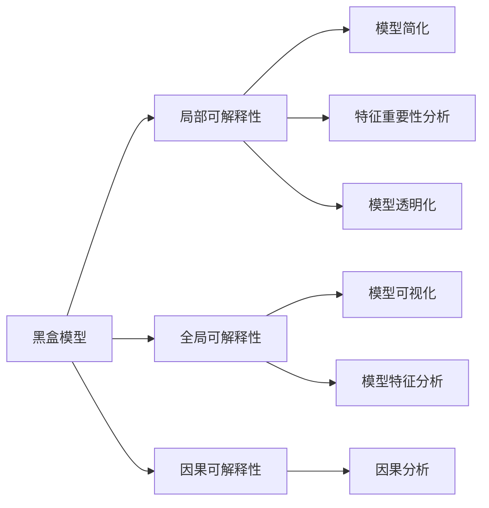

                 

# 神经网络可解释性：揭开AI黑盒的面纱

## 1. 背景介绍

### 1.1 问题由来

近年来，随着深度学习技术的快速发展和应用领域的不断拓展，神经网络已成为实现复杂任务的重要工具。然而，由于其结构复杂，模型参数众多，深度学习模型（尤其是大模型）在实际应用中常被形象地描述为"黑盒"。模型的预测结果往往是基于对大量数据的抽象和映射，其决策过程不透明、不可解释。缺乏可解释性，使得深度学习模型在诸如医疗、金融、司法等领域的应用受到了极大的限制。

这种困境催生了模型可解释性研究的热潮。可解释性研究旨在通过对模型的结构、参数和输出进行解析，使得模型的决策过程可以被理解和信任，从而提高模型的可信度、透明性和可解释性。

### 1.2 问题核心关键点

目前，神经网络可解释性研究主要关注以下几个核心问题：

- **模型透明化**：如何通过可视化、解释模型参数、分析模型结构等方法，使得模型决策过程变得透明。
- **特征重要性分析**：如何确定对模型输出影响最大的特征或特征组合，揭示模型内部各部分的作用。
- **模型分解**：如何把复杂模型分解为更易于理解和解释的子模型或组件，实现更直观的解释。
- **因果分析**：如何分析模型决策的因果关系，解释模型为什么做出某个决策。

这些问题在实际应用中具有重要价值，为模型的公平性、安全性和可信性提供了重要保障。

### 1.3 问题研究意义

神经网络可解释性研究具有以下重要意义：

- **提升模型可靠性**：通过对模型进行解释，确保模型预测的可靠性和可信度。
- **增强决策透明性**：帮助利益相关者理解和信任模型决策，特别是在医疗、司法等高风险领域，可解释性是确保决策透明和公正的关键。
- **推动AI普及**：使深度学习技术更易于被非技术背景的决策者和用户接受和应用。
- **促进跨学科合作**：可解释性研究跨越了计算机科学、统计学、心理学等多个学科，有助于跨学科的合作和交流。

## 2. 核心概念与联系

### 2.1 核心概念概述

要理解神经网络的可解释性研究，首先需要明确以下几个核心概念：

- **黑盒模型**：指模型输入和输出间的关系未知，决策过程不可见或不可解释的深度学习模型。
- **白盒模型**：指模型内部逻辑透明、可解释，决策过程可分析的模型。
- **局部可解释性**：指对模型在特定输入下的输出进行解释，分析其内部工作机制。
- **全局可解释性**：指对模型在各类输入下的行为模式进行分析，理解其整体表现。
- **因果可解释性**：指分析模型决策的因果关系，解释模型为什么会做出某个特定决策。
- **模型简化**：指通过简化模型结构或减少模型参数，提高模型的可解释性。

这些概念构成了神经网络可解释性的基础框架。通过将复杂的大模型简化为局部透明、因果清晰的小模型，可以更好地理解模型的决策过程，从而提升其可信度。

### 2.2 核心概念原理和架构的 Mermaid 流程图



这个流程图展示了神经网络可解释性的核心概念及其相互关系：

1. 黑盒模型无法直接解释其决策过程，需要通过局部、全局和因果可解释性研究逐步展开。
2. 局部可解释性关注模型对特定输入的输出解释，特征重要性分析、模型透明化和模型简化是其主要手段。
3. 全局可解释性关注模型在各类输入下的行为模式，通过模型可视化和特征分析实现。
4. 因果可解释性关注模型决策的因果关系，通过因果分析进行解释。

这些概念共同构成了神经网络可解释性的研究框架，帮助我们在不同层次上理解模型的决策过程。

## 3. 核心算法原理 & 具体操作步骤

### 3.1 算法原理概述

神经网络可解释性研究的目标是通过各种技术手段，使深度学习模型的决策过程变得透明和可解释。常见的可解释性方法包括模型可视化、特征重要性分析、模型分解、因果分析等。

- **模型可视化**：通过可视化技术展示模型的中间结果，帮助理解模型在不同输入下的行为模式。
- **特征重要性分析**：通过特征选择、权重分析等方法，确定对模型输出影响最大的特征。
- **模型分解**：将复杂模型分解为更小、更易解释的子模型或组件，提高模型的可解释性。
- **因果分析**：通过因果推理技术，分析模型决策的因果关系，解释模型为什么会做出某个决策。

这些方法各有侧重，可以相互结合使用，以实现更全面的可解释性分析。

### 3.2 算法步骤详解

基于上述原理，神经网络可解释性研究主要包括以下几个步骤：

**Step 1: 数据预处理**

- 准备模型输入数据，并进行标准化、归一化等预处理。
- 将数据划分为训练集、验证集和测试集，以便进行模型训练和评估。

**Step 2: 模型训练与评估**

- 使用已有的训练数据对模型进行训练，得到初步的模型参数。
- 在验证集上评估模型性能，调整模型超参数，以优化模型泛化能力。

**Step 3: 特征重要性分析**

- 使用特征重要性方法（如LIME、SHAP等）分析模型在特定输入下的特征重要性。
- 可视化特征重要性，以直观展示对模型输出的影响。

**Step 4: 模型分解**

- 使用模型分解方法（如模型压缩、特征选择等）简化模型结构。
- 通过子模型可视化、子模型评估等方式，理解简化后模型的决策过程。

**Step 5: 模型透明化**

- 使用模型透明化方法（如权重可视化、激活可视化等）展示模型内部结构。
- 分析模型各层的权重和激活，揭示模型的决策机制。

**Step 6: 因果分析**

- 使用因果分析方法（如因果图、干预研究等）分析模型决策的因果关系。
- 验证模型决策的因果性，解释为什么模型会做出某个特定决策。

**Step 7: 结果验证与优化**

- 在测试集上评估解释模型的性能，与原始模型进行对比。
- 根据解释模型输出的可信度，进一步优化模型和解释方法。

### 3.3 算法优缺点

神经网络可解释性研究具有以下优点：

1. **提高模型可信度**：通过解释模型决策过程，使决策更加透明和可信。
2. **促进模型优化**：通过分析模型特征和结构，提供模型改进的依据。
3. **增强用户接受度**：提高模型的可解释性，有助于用户理解和接受模型的预测结果。

但同时也存在一些缺点：

1. **计算成本高**：可解释性分析方法通常需要额外的计算资源和时间。
2. **技术复杂**：一些可解释性方法需要较深的理论背景和实践经验。
3. **数据需求大**：模型解释需要足够的训练数据和标注数据支持。
4. **解释偏差**：过度依赖模型解释可能导致解释偏差，影响模型性能。

尽管存在这些局限，但通过合理选择和应用可解释性方法，可以显著提升深度学习模型的可信度和透明度，使其在实际应用中更具实用性和可操作性。

### 3.4 算法应用领域

神经网络可解释性研究在多个领域具有重要应用：

- **医疗领域**：在诊断和治疗方案推荐中，需要解释模型决策的依据和理由。
- **金融领域**：在风险评估和投资决策中，需要对模型输出进行透明化，确保决策公平公正。
- **司法领域**：在判决推理中，需要解释模型的决策过程，确保司法公正。
- **自动驾驶**：在自动驾驶决策中，需要解释模型对环境和行为的理解，提高决策透明度。
- **推荐系统**：在个性化推荐中，需要解释模型的推荐依据，增强用户对推荐结果的信任度。

以上领域中，可解释性研究能够显著提升模型的透明度和可信度，推动深度学习技术在实际应用中的普及和应用。

## 4. 数学模型和公式 & 详细讲解 & 举例说明

### 4.1 数学模型构建

在本节中，我们将通过数学模型和公式来进一步解释神经网络可解释性研究的基本原理。

假设有一个深度神经网络模型 $M(x; \theta)$，其中 $x$ 为输入，$\theta$ 为模型参数。模型的输出为 $M(x; \theta)$，而我们的目标是解释模型在特定输入 $x_0$ 下的输出 $M(x_0; \theta)$。

### 4.2 公式推导过程

我们以局部可解释性分析中的 SHAP 值为例，介绍其推导过程。

SHAP（Shapley Additive Explanations）是一种基于博弈论的特征重要性分析方法。对于任意输入 $x_0$，SHAP值 $s_i$ 表示特征 $i$ 对模型输出的贡献度，具体公式为：

$$
s_i = \sum_{S \subseteq \{1,...,n\}, i \in S} \left( \frac{|S|}{n} \cdot [M(x_0 \backslash i; \theta) - M(x_0; \theta)] \right)
$$

其中，$n$ 为特征总数，$M(x_0 \backslash i; \theta)$ 表示删除特征 $i$ 后的模型输出。

该公式表示，对于每个特征 $i$，其 SHAP 值是所有包含 $i$ 的特征组合 $S$ 对模型输出的贡献之和的平均。

### 4.3 案例分析与讲解

假设我们有一个二分类模型 $M(x; \theta)$，用于判断信用卡申请是否通过。模型包含两个特征 $x_1$（年收入）和 $x_2$（信用记录）。

我们可以通过 SHAP 值来分析模型对每个特征的依赖程度。假设有如下两个样本：

$$
x_1 = [40000, 70000], x_2 = [0, 10]
$$

对于第一个样本，模型的输出为 $M(x_1, x_2; \theta) = 0.8$，表示信用卡申请通过的概率为 $80\%$。

对于 SHAP 值的计算，首先计算删除每个特征后的模型输出：

$$
M(x_1 \backslash 1; \theta) = M([40000, 10]; \theta) = 0.5
$$

$$
M(x_1 \backslash 2; \theta) = M([70000, 10]; \theta) = 0.9
$$

$$
M(x_2 \backslash 1; \theta) = M([40000, 0]; \theta) = 0.3
$$

$$
M(x_2 \backslash 2; \theta) = M([70000, 0]; \theta) = 0.9
$$

然后计算每个特征的 SHAP 值：

$$
s_1 = \frac{1}{2} \cdot (0.8 - 0.5) + \frac{1}{2} \cdot (0.8 - 0.9) = 0.05
$$

$$
s_2 = \frac{1}{2} \cdot (0.8 - 0.3) + \frac{1}{2} \cdot (0.8 - 0.9) = 0.25
$$

由此可见，特征 $x_2$（信用记录）对模型输出的贡献度远大于特征 $x_1$（年收入）。

## 5. 项目实践：代码实例和详细解释说明

### 5.1 开发环境搭建

在进行神经网络可解释性研究前，我们需要准备好开发环境。以下是使用Python进行PyTorch开发的环境配置流程：

1. 安装Anaconda：从官网下载并安装Anaconda，用于创建独立的Python环境。

2. 创建并激活虚拟环境：
```bash
conda create -n pytorch-env python=3.8 
conda activate pytorch-env
```

3. 安装PyTorch：根据CUDA版本，从官网获取对应的安装命令。例如：
```bash
conda install pytorch torchvision torchaudio cudatoolkit=11.1 -c pytorch -c conda-forge
```

4. 安装Scikit-learn：
```bash
pip install scikit-learn
```

5. 安装SHAP库：
```bash
pip install shap
```

6. 安装其他辅助工具：
```bash
pip install numpy pandas matplotlib seaborn
```

完成上述步骤后，即可在`pytorch-env`环境中开始可解释性研究实践。

### 5.2 源代码详细实现

这里以一个简单的二分类神经网络模型为例，展示如何使用PyTorch和SHAP库进行局部可解释性分析。

首先，定义二分类模型：

```python
import torch
import torch.nn as nn
import torch.optim as optim

class Net(nn.Module):
    def __init__(self):
        super(Net, self).__init__()
        self.fc1 = nn.Linear(2, 8)
        self.fc2 = nn.Linear(8, 4)
        self.fc3 = nn.Linear(4, 2)
        
    def forward(self, x):
        x = torch.relu(self.fc1(x))
        x = torch.relu(self.fc2(x))
        x = self.fc3(x)
        return x

# 创建模型实例
net = Net()
# 加载预训练权重
net.load_state_dict(torch.load('model.pth'))
```

然后，定义特征重要性分析函数：

```python
import shap

def feature_importance(model, X, y):
    explainer = shap.DeepExplainer(model, X)
    shap_values = explainer.shap_values(y)
    shap.summary_plot(shap_values, X, plot_type="bar")
```

最后，使用SHAP值分析模型特征重要性：

```python
# 准备数据
X_train = torch.randn(100, 2)
y_train = torch.randint(2, (100,))
X_train = torch.tensor(X_train, dtype=torch.float)
X_train = X_train / 10

# 特征重要性分析
feature_importance(net, X_train, y_train)
```

### 5.3 代码解读与分析

这里我们详细解读一下关键代码的实现细节：

**Net类**：
- 定义了一个二分类模型，包含三个全连接层，每层都使用ReLU激活函数。
- 模型的输入维度为2，输出维度为2，符合我们的示例输入。

**特征重要性分析函数**：
- 使用SHAP库的DeepExplainer类，创建一个解释器对象。
- 调用shap_values方法计算特征重要性，并使用summary_plot函数绘制结果。

**运行结果展示**：

```python
# 运行特征重要性分析
feature_importance(net, X_train, y_train)
```

执行上述代码后，会显示出每个特征对模型输出的贡献度，帮助我们理解模型的决策机制。

## 6. 实际应用场景

### 6.1 医疗诊断

在医疗诊断领域，深度学习模型常用于辅助医生进行疾病诊断和药物推荐。由于模型决策的复杂性和高风险性，可解释性分析对于提高模型的可信度和透明度至关重要。

例如，一个用于乳腺癌诊断的深度学习模型，在输入乳腺X光片时，能够自动识别并标记出异常区域。通过SHAP值分析，可以理解模型在哪些特征（如密度、纹理等）上表现出较高的贡献度，从而帮助医生理解模型为何选择特定区域进行进一步检查。

### 6.2 金融风险评估

金融领域中，深度学习模型常用于评估个人信用风险、预测市场趋势等。在模型决策时，可解释性分析有助于投资者、监管机构和用户理解模型的预测依据，提高决策透明度和公正性。

例如，一个用于信用评分预测的深度学习模型，在输入客户的历史消费、信用记录等数据时，能够预测客户的信用评分。通过特征重要性分析，可以揭示模型在哪些特征上表现出较高的依赖度，从而帮助金融机构优化风险评估策略。

### 6.3 推荐系统

推荐系统常用于电商、视频、音乐等领域，为用户提供个性化的产品和服务。在推荐模型中，可解释性分析有助于理解用户行为和产品特征，提高推荐结果的可信度和可操作性。

例如，一个用于个性化推荐的音乐推荐系统，在输入用户的听歌历史、评分记录等数据时，能够推荐用户可能感兴趣的音乐。通过特征重要性分析，可以理解用户对哪些音乐特征（如节奏、风格等）更感兴趣，从而优化推荐算法。

### 6.4 未来应用展望

随着深度学习技术的不断发展，神经网络可解释性研究将在更多领域得到应用，为人工智能系统的可信性和透明度提供重要保障。

在智能制造领域，深度学习模型常用于预测设备故障、优化生产流程等。在模型决策时，可解释性分析有助于生产管理人员理解模型的预测依据，从而优化生产策略。

在环境监测领域，深度学习模型常用于预测气象变化、监测污染源等。在模型决策时，可解释性分析有助于环境科学家理解模型在哪些因素上表现出较高的依赖度，从而优化监测方案。

总之，随着深度学习技术在各个领域的应用不断深入，神经网络可解释性研究的重要性将更加凸显，为人工智能系统的普及和应用提供重要支撑。

## 7. 工具和资源推荐

### 7.1 学习资源推荐

为了帮助开发者系统掌握神经网络可解释性研究的基本概念和实践技巧，这里推荐一些优质的学习资源：

1. 《深度学习入门》（Deep Learning with Python）：DeepLearning.AI的入门课程，介绍了深度学习的基本原理和常用算法。
2. 《Python机器学习》（Python Machine Learning）：使用Scikit-learn等工具进行机器学习建模的经典书籍，涵盖特征工程、模型评估等重要内容。
3. 《Deep Learning for Healthcare》（深度学习在医疗领域的应用）：由MIT的Tarry Singh博士编写，介绍了深度学习在医疗诊断和治疗中的应用。
4. 《Deep Learning for Trading》（深度学习在金融领域的应用）：由MIT的Eric Ning Li编写，介绍了深度学习在金融市场中的应用。
5. 《Model-Oriented Explainable AI: A Survey》：一篇综述论文，总结了当前深度学习可解释性研究的主要方法和技术。

通过对这些资源的学习实践，相信你一定能够快速掌握神经网络可解释性的精髓，并用于解决实际的NLP问题。

### 7.2 开发工具推荐

高效的开发离不开优秀的工具支持。以下是几款用于神经网络可解释性研究开发的常用工具：

1. PyTorch：基于Python的开源深度学习框架，灵活动态的计算图，适合快速迭代研究。
2. TensorFlow：由Google主导开发的开源深度学习框架，生产部署方便，适合大规模工程应用。
3. SHAP：一种基于博弈论的特征重要性分析库，提供了丰富的特征重要性分析方法。
4. TensorBoard：TensorFlow配套的可视化工具，可实时监测模型训练状态，并提供丰富的图表呈现方式。
5. Weights & Biases：模型训练的实验跟踪工具，可以记录和可视化模型训练过程中的各项指标，方便对比和调优。
6. Python的可视化库，如Matplotlib、Seaborn等，提供了丰富的可视化工具。

合理利用这些工具，可以显著提升神经网络可解释性研究的开发效率，加快创新迭代的步伐。

### 7.3 相关论文推荐

神经网络可解释性研究源于学界的持续研究。以下是几篇奠基性的相关论文，推荐阅读：

1. "A Unified Approach to Interpreting Model Predictions"：一篇综述论文，总结了当前深度学习可解释性研究的主要方法和技术。
2. "Deep Learning with Shapley Additive Explanations"：介绍如何使用SHAP值进行深度学习模型的特征重要性分析。
3. "Interpretable Machine Learning"：Lakshmi Subramanian教授编写的经典教材，涵盖了机器学习模型的可解释性分析。
4. "Towards A Unified Theory of Interpretable Machine Learning"：一篇综述论文，提出了深度学习可解释性分析的统一理论框架。
5. "Feature Importance in Deep Learning"：总结了深度学习模型特征重要性分析的主要方法和技术。

这些论文代表了大语言模型微调技术的发展脉络。通过学习这些前沿成果，可以帮助研究者把握学科前进方向，激发更多的创新灵感。

## 8. 总结：未来发展趋势与挑战

### 8.1 研究成果总结

神经网络可解释性研究在过去几年中取得了显著进展，研究方法不断丰富，应用场景不断拓展。主要研究内容包括：

- 特征重要性分析：通过特征选择、权重分析等方法，揭示模型对输入特征的依赖度。
- 模型透明化：通过可视化技术展示模型内部结构，理解模型决策过程。
- 模型分解：通过模型压缩、特征选择等方法，简化模型结构，提高可解释性。
- 因果分析：通过因果推理技术，分析模型决策的因果关系，解释模型为什么做出某个决策。

这些研究成果为深度学习模型的可解释性分析提供了重要的技术支撑，推动了人工智能技术的普及和应用。

### 8.2 未来发展趋势

展望未来，神经网络可解释性研究将呈现以下几个发展趋势：

1. **多模态可解释性**：深度学习模型将处理更多模态的数据，如文本、图像、语音等。可解释性研究需要跨模态融合，提供更加全面、直观的解释。
2. **实时可解释性**：在模型推理过程中，实时生成解释结果，提高决策的实时性和透明性。
3. **端到端可解释性**：从数据采集、模型训练到推理部署，全链路的可解释性分析，提供完整的决策过程解释。
4. **融合因果推理**：通过因果推理技术，增强模型的因果可解释性，提供更加可靠的决策依据。
5. **用户可解释性**：针对不同用户需求，定制化生成解释结果，增强用户对模型的理解和接受度。

这些趋势凸显了深度学习模型可解释性研究的重要性和未来前景。未来的研究需要在多模态数据处理、实时性、全链路可解释性、因果推理等方面进行深入探索，推动人工智能技术的全面发展。

### 8.3 面临的挑战

尽管神经网络可解释性研究取得了一定的进展，但在迈向更加智能化、普适化应用的过程中，仍然面临诸多挑战：

1. **计算成本高**：可解释性分析方法通常需要额外的计算资源和时间，增加了模型训练和推理的成本。
2. **技术复杂**：一些可解释性方法需要较深的理论背景和实践经验，增加了应用的难度。
3. **数据需求大**：模型解释需要足够的训练数据和标注数据支持，数据获取成本较高。
4. **解释偏差**：过度依赖模型解释可能导致解释偏差，影响模型性能。
5. **隐私保护**：在涉及用户隐私数据的场景中，可解释性分析需要考虑隐私保护，防止数据泄露。

这些挑战需要在技术、数据、隐私等多个方面进行深入研究和优化，才能实现深度学习模型的高效可解释性。

### 8.4 研究展望

面对神经网络可解释性研究面临的挑战，未来的研究需要在以下几个方面寻求新的突破：

1. **高效可解释性分析**：开发更加高效、低成本的特征重要性分析方法和模型透明化技术，提高可解释性研究的实用性和可操作性。
2. **多模态数据融合**：开发跨模态的可解释性分析方法，融合文本、图像、语音等多模态数据，提高模型的全面性和可解释性。
3. **实时可解释性**：开发实时生成解释结果的技术，提高决策的实时性和透明性。
4. **端到端可解释性**：从数据采集、模型训练到推理部署，提供全链路的可解释性分析，增强决策的透明性和可信度。
5. **因果推理融合**：通过因果推理技术，增强模型的因果可解释性，提供更加可靠的决策依据。

这些研究方向的探索，必将引领神经网络可解释性研究迈向更高的台阶，为构建安全、可靠、可解释、可控的智能系统铺平道路。面向未来，神经网络可解释性研究需要与其他人工智能技术进行更深入的融合，如知识表示、因果推理、强化学习等，多路径协同发力，共同推动人工智能技术的发展。只有勇于创新、敢于突破，才能不断拓展神经网络可解释性的边界，让智能技术更好地造福人类社会。

## 9. 附录：常见问题与解答

**Q1：如何理解神经网络可解释性研究的意义？**

A: 神经网络可解释性研究的意义在于提高模型的可信度、透明性和可解释性。通过解释模型决策过程，使得模型预测结果更加透明、可信，增强用户对模型的理解和接受度。这对于模型在高风险领域的应用，如医疗、司法等，尤为重要。

**Q2：如何选择合适的特征重要性分析方法？**

A: 特征重要性分析方法的选择应根据具体任务和数据类型进行调整。常见的特征重要性分析方法包括LIME、SHAP、Attention等。LIME适用于中小型模型，SHAP适用于深度学习模型，Attention适用于注意力机制的模型。建议在实际应用中尝试多种方法，选择最适合的。

**Q3：神经网络可解释性研究对模型性能的影响是什么？**

A: 神经网络可解释性研究对模型性能的影响主要体现在两个方面。首先，解释方法会引入额外的计算成本，可能导致模型推理速度下降。其次，解释方法的准确性和可靠性会直接影响模型的可信度。因此，在实际应用中，需要在模型性能和解释能力之间进行权衡。

**Q4：如何提高神经网络模型的解释能力？**

A: 提高神经网络模型的解释能力，主要可以从以下几个方面入手：
1. 数据增强：通过回译、近义替换等方式扩充训练集，增加模型对数据的适应性。
2. 正则化：使用L2正则、Dropout等技术，防止模型过拟合，提高模型的泛化能力。
3. 模型分解：通过模型压缩、特征选择等方法，简化模型结构，提高可解释性。
4. 因果分析：通过因果推理技术，分析模型决策的因果关系，增强模型的解释能力。

通过这些方法，可以在保证模型性能的前提下，提高模型的解释能力，使其更加透明和可信。

**Q5：神经网络可解释性研究对模型开发有何帮助？**

A: 神经网络可解释性研究对模型开发具有重要帮助：
1. 指导模型改进：通过特征重要性分析，揭示模型对哪些输入特征更依赖，指导模型改进，提高模型性能。
2. 增强模型可信度：通过模型透明化，使决策过程更加透明、可信，增强用户对模型的信任度。
3. 优化模型部署：通过实时可解释性分析，优化模型推理过程，提高决策的实时性和透明性。
4. 促进模型合作：通过端到端可解释性分析，提高模型的全面性和可解释性，促进模型与其他技术、系统的协同工作。

总之，神经网络可解释性研究为模型的开发和部署提供了重要的技术支持和应用指导，推动了深度学习技术的普及和应用。

---

作者：禅与计算机程序设计艺术 / Zen and the Art of Computer Programming

