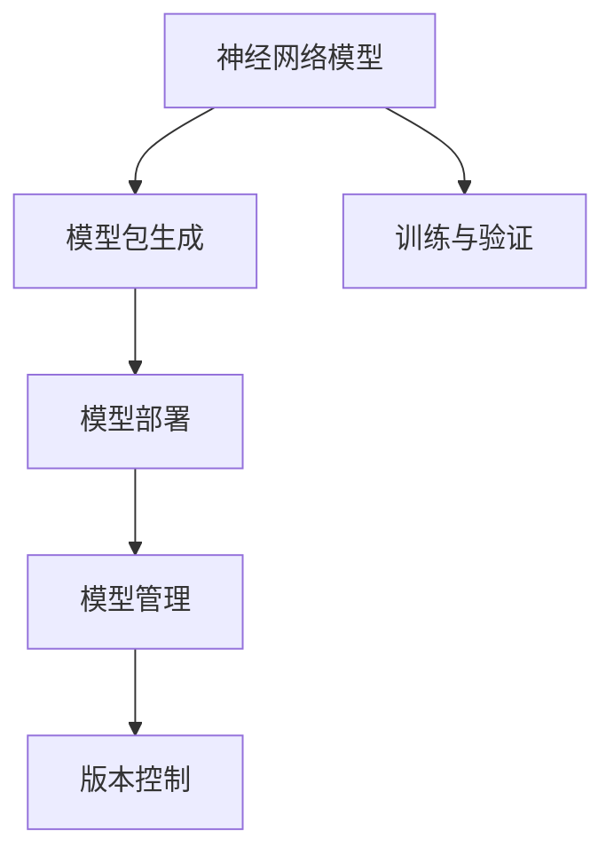

                 

## 1. 背景介绍

在人工智能模型领域，尤其是深度学习模型，近年来取得了巨大的进展，包括神经网络模型的广泛应用。这些模型广泛应用于图像识别、自然语言处理、语音识别等领域，并取得了显著的成功。然而，随着模型复杂度的增加，神经网络模型的包管理和部署变得更加复杂。在本文中，我们将探讨神经网络模型的包管理和部署所面临的新挑战，以及如何应对这些挑战。

## 2. 核心概念与联系

### 2.1 核心概念概述

在讨论神经网络模型的包管理和部署之前，我们需要理解几个关键概念：

- **神经网络模型（Neural Network Model）**：指由多个神经元（节点）组成的计算图，用于学习输入数据的特征，并产生输出。

- **模型包（Model Package）**：指将神经网络模型的参数、结构、训练代码等打包成单个可执行文件的过程，便于模型的部署和管理。

- **模型部署（Model Deployment）**：指将训练好的模型转化为可运行的服务，供应用程序或平台使用的过程。

- **模型管理（Model Management）**：指对模型包进行维护、更新、版本控制等过程，确保模型的正确性和安全性。

- **版本控制（Version Control）**：指对模型包进行不同版本的跟踪和管理，确保模型的稳定性和可复现性。

### 2.2 核心概念联系

神经网络模型的包管理和部署涉及到多个关键概念，它们之间的联系如下：

- 模型包的生成是将神经网络模型的参数和结构转换为可执行代码的过程，这需要版本控制来管理不同版本的模型包。
- 模型部署是将模型包转化为可运行的服务，需要进行包管理和版本控制，以确保部署的模型是正确的和最新的。
- 模型管理不仅包括对模型包的管理，还需要对模型性能、安全性和合规性进行监控。

这些概念之间的关系可以用以下 Mermaid 流程图表示：



## 3. 核心算法原理 & 具体操作步骤

### 3.1 算法原理概述

神经网络模型的包管理和部署涉及以下几个主要步骤：

1. 模型训练和验证。
2. 模型包的生成。
3. 模型部署。
4. 模型管理和更新。

### 3.2 算法步骤详解

#### 3.2.1 模型训练和验证

- **数据准备**：收集和标注用于训练和验证的数据集。
- **模型设计**：选择合适的模型结构和超参数。
- **训练过程**：使用训练数据集对模型进行训练，并使用验证数据集进行验证和调整。
- **模型评估**：使用测试数据集评估模型的性能。

#### 3.2.2 模型包的生成

- **模型保存**：将训练好的模型参数和结构保存为模型包。
- **版本控制**：为每个模型包指定版本号，并进行版本控制。

#### 3.2.3 模型部署

- **环境准备**：准备模型部署的环境，如服务器、操作系统、运行库等。
- **模型加载**：加载模型包，并进行必要的初始化。
- **推理过程**：使用模型进行推理，产生预测结果。

#### 3.2.4 模型管理和更新

- **模型版本控制**：维护不同版本的模型包，确保每个版本的模型都是可用的。
- **模型更新**：根据需求和反馈，更新和维护模型。
- **模型监控**：监控模型的性能、准确性和安全性。

### 3.3 算法优缺点

#### 3.3.1 优点

1. **提高部署效率**：模型包管理可以自动化模型部署过程，减少部署时间和成本。
2. **保证模型一致性**：模型版本控制可以确保每个模型都是一致的，减少因版本不同导致的问题。
3. **提高安全性**：模型管理和版本控制可以确保模型是安全的，减少潜在的安全风险。

#### 3.3.2 缺点

1. **复杂性增加**：模型包管理和部署涉及多个步骤和组件，增加了系统的复杂性。
2. **性能影响**：模型包的生成和加载可能会影响模型的推理性能。
3. **资源需求高**：模型包管理和部署需要高性能的服务器和存储设备。

### 3.4 算法应用领域

神经网络模型的包管理和部署在多个领域都有应用，包括但不限于：

- **计算机视觉**：用于图像识别、目标检测等任务。
- **自然语言处理**：用于文本分类、情感分析等任务。
- **语音识别**：用于语音转文本、语音指令识别等任务。
- **医疗**：用于医学影像分析、疾病预测等任务。

## 4. 数学模型和公式 & 详细讲解 & 举例说明

### 4.1 数学模型构建

神经网络模型的数学模型通常包括输入层、隐藏层和输出层。以下是一个简单的神经网络模型：

$$
y = f(\sum_{i=1}^{n} w_i x_i + b)
$$

其中，$x_i$ 为输入数据，$w_i$ 为权重，$b$ 为偏置，$f$ 为激活函数。

### 4.2 公式推导过程

#### 4.2.1 前向传播

前向传播是神经网络模型中一个重要的概念。在给定输入数据的情况下，模型通过前向传播计算出输出结果。以下是一个简单的前向传播过程：

1. 输入层：$x_i$。
2. 隐藏层：$y = f(\sum_{i=1}^{n} w_i x_i + b)$。
3. 输出层：$y_{out} = f(\sum_{i=1}^{n} w_i y + b)$。

#### 4.2.2 反向传播

反向传播是神经网络模型中另一个重要的概念。在给定输出结果的情况下，模型通过反向传播计算出输入数据和权重之间的误差，并调整权重以最小化误差。以下是一个简单的反向传播过程：

1. 计算误差：$E = (y_{out} - y_{true})^2$。
2. 计算梯度：$\frac{\partial E}{\partial w_i} = 2(y_{out} - y_{true})f'(y_{out})f'(y_{out})x_i$。
3. 更新权重：$w_i = w_i - \alpha \frac{\partial E}{\partial w_i}$。

### 4.3 案例分析与讲解

以下是一个简单的神经网络模型案例分析：

- **输入数据**：$x = [0.5, 0.7, 0.2]$。
- **权重和偏置**：$w = [0.1, 0.3, 0.2]$，$b = 0.5$。
- **激活函数**：$f(x) = \tanh(x)$。

#### 4.3.1 前向传播

计算输出结果：

$$
y = \tanh(0.1 \cdot 0.5 + 0.3 \cdot 0.7 + 0.2 \cdot 0.2 + 0.5) = 0.76
$$

#### 4.3.2 反向传播

假设输出结果为0.8，真实结果为0.7，计算误差：

$$
E = (0.8 - 0.7)^2 = 0.01
$$

计算梯度：

$$
\frac{\partial E}{\partial w_1} = 2 \cdot 0.01 \cdot \tanh'(0.76) \cdot \tanh'(0.76) \cdot 0.5 = 0.005
$$

$$
\frac{\partial E}{\partial w_2} = 2 \cdot 0.01 \cdot \tanh'(0.76) \cdot \tanh'(0.76) \cdot 0.7 = 0.007
$$

$$
\frac{\partial E}{\partial w_3} = 2 \cdot 0.01 \cdot \tanh'(0.76) \cdot \tanh'(0.76) \cdot 0.2 = 0.002
$$

更新权重：

$$
w_1 = 0.1 - 0.001 \cdot 0.005 = 0.104
$$

$$
w_2 = 0.3 - 0.001 \cdot 0.007 = 0.294
$$

$$
w_3 = 0.2 - 0.001 \cdot 0.002 = 0.198
$$

## 5. 项目实践：代码实例和详细解释说明

### 5.1 开发环境搭建

在进行神经网络模型的包管理和部署之前，我们需要准备好开发环境。以下是使用 Python 和 TensorFlow 进行环境搭建的步骤：

1. 安装 Python：从官网下载并安装 Python 3.6 或更高版本。
2. 安装 TensorFlow：使用以下命令安装 TensorFlow 2.0 或更高版本：

   ```bash
   pip install tensorflow==2.0
   ```

3. 安装其他依赖：

   ```bash
   pip install numpy scikit-learn matplotlib
   ```

### 5.2 源代码详细实现

以下是一个简单的神经网络模型代码实现：

```python
import tensorflow as tf
import numpy as np

# 定义神经网络模型
class NeuralNetwork(tf.keras.Model):
    def __init__(self):
        super(NeuralNetwork, self).__init__()
        self.dense1 = tf.keras.layers.Dense(64, activation='relu')
        self.dense2 = tf.keras.layers.Dense(10, activation='softmax')

    def call(self, x):
        x = self.dense1(x)
        x = self.dense2(x)
        return x

# 训练数据
x_train = np.array([[0.5, 0.7, 0.2]])
y_train = np.array([0.7])

# 创建模型
model = NeuralNetwork()

# 编译模型
model.compile(optimizer=tf.keras.optimizers.Adam(learning_rate=0.01),
              loss=tf.keras.losses.MeanSquaredError(),
              metrics=[tf.keras.metrics.MeanAbsoluteError()])

# 训练模型
model.fit(x_train, y_train, epochs=10)

# 保存模型
model.save('neural_network.h5')
```

### 5.3 代码解读与分析

**NeuralNetwork 类**：
- `__init__` 方法：初始化模型的层次结构。
- `call` 方法：定义模型的前向传播过程。

**训练数据**：
- `x_train`：输入数据。
- `y_train`：标签。

**模型编译**：
- `optimizer`：定义优化器。
- `loss`：定义损失函数。
- `metrics`：定义评价指标。

**模型训练**：
- `fit` 方法：训练模型。

**模型保存**：
- `save` 方法：保存模型。

## 6. 实际应用场景

### 6.1 计算机视觉

神经网络模型在计算机视觉领域有广泛的应用，如图像分类、目标检测等任务。这些任务通常需要大量的数据和计算资源，因此模型的包管理和部署尤为重要。

### 6.2 自然语言处理

神经网络模型在自然语言处理领域也有广泛的应用，如文本分类、情感分析等任务。这些任务通常需要处理大量的文本数据，因此模型的包管理和部署也是必不可少的。

### 6.3 语音识别

神经网络模型在语音识别领域也有广泛的应用，如语音转文本、语音指令识别等任务。这些任务通常需要处理大量的音频数据，因此模型的包管理和部署也是必不可少的。

### 6.4 未来应用展望

随着神经网络模型的不断发展和应用，未来的包管理和部署将面临更多的挑战和机遇。以下是对未来应用展望的几点思考：

1. **模型的跨平台部署**：未来需要更多的跨平台部署解决方案，使得模型可以在不同的硬件和操作系统上运行。
2. **模型的动态更新**：未来需要更多的动态更新机制，使得模型可以及时地适应新的数据和需求。
3. **模型的自动优化**：未来需要更多的自动优化工具，使得模型可以在运行时动态调整参数，提升性能。

## 7. 工具和资源推荐

### 7.1 学习资源推荐

为了帮助开发者系统掌握神经网络模型的包管理和部署，这里推荐一些优质的学习资源：

1. **TensorFlow 官方文档**：提供了详细的模型训练、包管理和部署指南。
2. **PyTorch 官方文档**：提供了详细的模型训练、包管理和部署指南。
3. **深度学习入门与实践**：一本非常好的深度学习入门书籍，涵盖模型训练、包管理和部署的全面内容。
4. **Model Versioning with TensorFlow 2.0**：介绍如何在 TensorFlow 2.0 中进行模型版本控制。
5. **Docker for Data Science**：介绍如何在 Docker 中进行模型部署和管理。

### 7.2 开发工具推荐

以下是几款用于神经网络模型包管理和部署的常用工具：

1. **TensorFlow**：由 Google 主导的深度学习框架，支持模型的训练、包管理和部署。
2. **PyTorch**：由 Facebook 主导的深度学习框架，支持模型的训练、包管理和部署。
3. **Docker**：一个开源的容器化平台，支持模型的部署和管理。
4. **Kubeflow**：一个开源的机器学习平台，支持模型的训练、部署和管理。

### 7.3 相关论文推荐

以下是几篇奠基性的相关论文，推荐阅读：

1. **ImageNet Classification with Deep Convolutional Neural Networks**：介绍使用卷积神经网络模型进行图像分类的基本方法。
2. **Natural Language Processing with TensorFlow**：介绍使用 TensorFlow 进行自然语言处理的基本方法。
3. **TensorFlow: A System for Large-Scale Machine Learning**：介绍 TensorFlow 的基本原理和使用方法。
4. **Model Versioning with TensorFlow 2.0**：介绍如何在 TensorFlow 2.0 中进行模型版本控制。

## 8. 总结：未来发展趋势与挑战

### 8.1 研究成果总结

本文探讨了神经网络模型的包管理和部署所面临的新挑战，并提出了相应的解决方案。通过对神经网络模型的全面介绍，我们深入理解了模型的训练、包管理和部署流程，并分析了模型的优缺点和应用领域。

### 8.2 未来发展趋势

未来神经网络模型的包管理和部署将面临更多的挑战和机遇。以下是未来发展趋势的几点思考：

1. **模型的跨平台部署**：未来需要更多的跨平台部署解决方案，使得模型可以在不同的硬件和操作系统上运行。
2. **模型的动态更新**：未来需要更多的动态更新机制，使得模型可以及时地适应新的数据和需求。
3. **模型的自动优化**：未来需要更多的自动优化工具，使得模型可以在运行时动态调整参数，提升性能。

### 8.3 面临的挑战

尽管神经网络模型的包管理和部署已经取得了一定的进展，但在迈向更加智能化、普适化应用的过程中，它仍面临诸多挑战：

1. **复杂性增加**：神经网络模型的包管理和部署涉及多个步骤和组件，增加了系统的复杂性。
2. **性能影响**：模型包的生成和加载可能会影响模型的推理性能。
3. **资源需求高**：模型包管理和部署需要高性能的服务器和存储设备。

### 8.4 研究展望

为了应对这些挑战，未来的研究需要在以下几个方面寻求新的突破：

1. **简化模型包管理**：研究如何简化模型包的生成和加载过程，减少复杂性和资源消耗。
2. **提高模型性能**：研究如何提高模型的推理性能，减少因包管理导致的性能损失。
3. **优化模型部署**：研究如何优化模型部署过程，提高部署效率和可扩展性。

## 9. 附录：常见问题与解答

**Q1: 神经网络模型包管理和部署的重要性是什么？**

A: 神经网络模型的包管理和部署是模型应用过程中的重要环节，它确保了模型的一致性、稳定性和安全性。包管理使得模型易于部署、更新和维护，部署使得模型可以运行在实际的应用场景中。

**Q2: 神经网络模型包管理和部署面临哪些挑战？**

A: 神经网络模型包管理和部署面临以下挑战：
1. 复杂性增加：涉及多个步骤和组件，增加了系统的复杂性。
2. 性能影响：模型包的生成和加载可能会影响模型的推理性能。
3. 资源需求高：需要高性能的服务器和存储设备。

**Q3: 如何简化模型包管理？**

A: 简化模型包管理的方法包括：
1. 使用模型框架提供的高级 API，简化模型的构建过程。
2. 使用自动化工具，如 Docker、Kubernetes，简化模型的部署和维护。
3. 使用模型版本控制，确保不同版本的模型一致。

**Q4: 如何提高模型性能？**

A: 提高模型性能的方法包括：
1. 使用高效的前向传播和反向传播算法。
2. 使用分布式训练和模型并行，提升训练速度和推理速度。
3. 使用模型压缩和剪枝技术，减少模型大小和计算量。

**Q5: 如何优化模型部署？**

A: 优化模型部署的方法包括：
1. 使用容器化技术，如 Docker，简化模型的部署过程。
2. 使用自动化部署工具，如 Kubernetes，提高模型的可扩展性和可靠性。
3. 使用缓存和预加载技术，减少模型的加载时间。

---

作者：禅与计算机程序设计艺术 / Zen and the Art of Computer Programming

