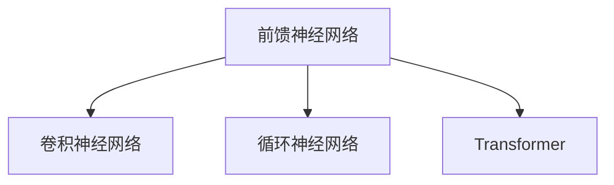

                 

# 神经网络：人工智能的基石

> 关键词：神经网络,人工智能,深度学习,深度神经网络,前馈神经网络,卷积神经网络,循环神经网络,Transformer

## 1. 背景介绍

### 1.1 问题由来

自1980年代以来，神经网络(Neural Network, NN)已成为人工智能(AI)领域的重要基石，在图像识别、语音处理、自然语言处理等领域取得了巨大成功。深度神经网络(Deep Neural Network, DNN)作为神经网络的一种高级形式，通过多层非线性变换，能够自动学习数据的复杂特征表示。

然而，神经网络的理论基础和实践应用一直存在诸多争议。一方面，神经网络的启发式特征表示和训练算法，缺乏严格的数学理论支撑。另一方面，由于结构复杂，参数数量巨大，实际训练过程中往往需要大量的标注数据和算力支持，难以实现高效训练。这些问题一直困扰着AI领域的研究者和工程师。

近年来，得益于大规模语料数据的积累和计算能力的提升，深度学习技术得到迅猛发展，使得神经网络得以在更广泛领域发挥作用。特别是Transformer结构的出现，神经网络的泛化能力、表达能力和可解释性得到了显著提升。本文将从核心概念入手，全面介绍神经网络的结构原理、训练算法及其在实际应用中的广泛应用，以期为读者提供一个清晰、深入的神经网络知识体系。

### 1.2 问题核心关键点

神经网络的核心思想是：通过模拟人脑神经元的工作机制，建立一种多层次的非线性变换网络，对输入数据进行自动特征提取和分类预测。其基本组成部分包括输入层、隐藏层和输出层。输入层接收原始数据，隐藏层对数据进行逐层非线性变换，输出层根据数据特征生成预测结果。神经网络通过反向传播算法进行训练，通过前向传播计算损失函数，反向传播更新模型参数，最小化损失函数，从而得到理想的网络权重。

神经网络的训练和优化涉及多个关键环节，包括选择合适的损失函数、正则化技术、学习率调度策略、优化器等。这些技术因素的设计和调参，直接影响到神经网络的训练效果和泛化能力。

神经网络的应用非常广泛，涵盖了视觉识别、语音识别、自然语言处理、推荐系统、游戏AI等领域。其中，视觉领域的卷积神经网络(CNN)、自然语言处理的循环神经网络(RNN)和Transformer结构，都是神经网络应用中的经典案例。

## 2. 核心概念与联系

### 2.1 核心概念概述

为更好地理解神经网络的结构和工作原理，本节将介绍几个密切相关的核心概念：

- 前馈神经网络(Feedforward Neural Network, FNN)：最简单、最基础的神经网络结构，包括输入层、隐藏层和输出层。数据通过网络逐层传播，最终生成预测结果。
- 卷积神经网络(Convolutional Neural Network, CNN)：针对图像识别等任务，利用卷积层提取局部特征，池化层降维，全连接层进行分类预测。
- 循环神经网络(Recurrent Neural Network, RNN)：针对时间序列数据，利用循环层建立循环连接，逐时间步生成预测结果。
- Transformer：一种基于自注意力机制的神经网络结构，通过多头注意力机制建立全局信息关联，极大提升了自然语言处理任务的性能。

这些核心概念之间的逻辑关系可以通过以下Mermaid流程图来展示：



这个流程图展示了这个神经网络各个组成部分及其之间的逻辑关系：

1. 前馈神经网络作为最基础的神经网络结构，是其他复杂网络的基础。
2. 卷积神经网络针对图像识别任务，利用局部特征提取和池化层，提高特征表示能力。
3. 循环神经网络针对时间序列数据，利用循环层捕捉序列变化，建立时间相关性。
4. Transformer针对自然语言处理任务，通过自注意力机制建立全局信息关联，提升表示能力。

## 3. 核心算法原理 & 具体操作步骤

### 3.1 算法原理概述

神经网络的训练过程本质上是一个优化问题。其核心目标是通过最小化损失函数，找到最优的网络权重。常用的损失函数包括均方误差损失、交叉熵损失、二分类损失等。

设输入数据为 $x$，真实标签为 $y$，神经网络模型为 $f_\theta(x)$，其中 $\theta$ 为模型参数。训练目标是通过反向传播算法最小化损失函数：

$$
\min_\theta \mathcal{L}(f_\theta(x), y)
$$

常用的反向传播算法包括随机梯度下降(SGD)、Adam、Adagrad等。通过前向传播计算损失函数，反向传播计算参数梯度，并使用优化器更新模型参数，不断迭代直至收敛。

### 3.2 算法步骤详解

神经网络的训练过程一般包括以下几个关键步骤：

**Step 1: 准备数据集**
- 收集训练数据集 $D = \{(x_i, y_i)\}_{i=1}^N$，其中 $x_i$ 为输入特征，$y_i$ 为真实标签。
- 对数据集进行划分，分为训练集、验证集和测试集。

**Step 2: 设计网络结构**
- 根据任务类型，选择合适的网络结构，如前馈神经网络、卷积神经网络、循环神经网络等。
- 设计网络的层数、每层神经元个数等超参数，同时确定激活函数、正则化技术等细节。

**Step 3: 设置优化器**
- 选择合适的优化器，如SGD、Adam等，并设置学习率、批大小等参数。
- 设置正则化技术，如L2正则、Dropout等，避免过拟合。

**Step 4: 执行梯度训练**
- 使用DataLoader对数据进行批次化加载，每个批次包含 $m$ 个样本。
- 对每个样本进行前向传播，计算损失函数 $J(x, y)$。
- 反向传播计算损失函数对模型参数的梯度 $\frac{\partial J}{\partial \theta}$。
- 使用优化器更新模型参数，完成一轮训练。
- 周期性在验证集上评估模型性能，决定是否触发Early Stopping。
- 重复上述步骤直至满足预设的迭代轮数或Early Stopping条件。

**Step 5: 测试和部署**
- 在测试集上评估模型性能，对比微调前后的精度提升。
- 使用微调后的模型对新样本进行推理预测，集成到实际的应用系统中。
- 持续收集新的数据，定期重新微调模型，以适应数据分布的变化。

以上是神经网络微调的一般流程。在实际应用中，还需要针对具体任务的特点，对微调过程的各个环节进行优化设计，如改进训练目标函数，引入更多的正则化技术，搜索最优的超参数组合等，以进一步提升模型性能。

### 3.3 算法优缺点

神经网络训练的优点包括：

1. 强大的泛化能力。神经网络能够自动学习数据的复杂特征表示，适用于各种类型的输入数据。
2. 可解释性强。通过反向传播算法，可以直观地理解模型训练过程中的每一步变化，帮助诊断模型问题。
3. 良好的鲁棒性。神经网络对于输入数据的微小扰动具有一定的鲁棒性，能够在实际应用中稳定运行。

神经网络训练的缺点包括：

1. 训练成本高。神经网络需要大量的标注数据和算力支持，训练周期较长，成本较高。
2. 容易过拟合。神经网络的复杂结构容易导致过拟合，需要更多的正则化技术来缓解。
3. 缺乏可解释性。神经网络的非线性映射过程复杂，难以理解其内部工作机制。
4. 模型参数数量巨大。大规模神经网络的参数量往往以亿计，对存储空间和计算资源的要求较高。

尽管存在这些局限性，但神经网络的强大泛化能力和可解释性，使得其成为人工智能领域的重要基础技术。未来相关研究的重点在于如何进一步降低训练成本，提高模型的可解释性和鲁棒性，同时兼顾算力资源的使用效率。

### 3.4 算法应用领域

神经网络在计算机视觉、自然语言处理、语音识别等领域得到了广泛的应用，具体如下：

- 计算机视觉：神经网络通过卷积层提取图像局部特征，池化层降维，全连接层进行分类预测。广泛应用于图像分类、目标检测、人脸识别等任务。
- 自然语言处理：神经网络通过循环层或Transformer建立时间序列信息关联，提升语言理解能力。广泛应用于机器翻译、文本分类、文本生成等任务。
- 语音识别：神经网络通过卷积层提取音频特征，循环层建立时序信息，全连接层进行声学模型训练。广泛应用于语音识别、语音合成等任务。

除此之外，神经网络还被应用于推荐系统、游戏AI、金融分析等多个领域，为这些行业带来了新的突破和创新。

## 4. 数学模型和公式 & 详细讲解  
### 4.1 数学模型构建

神经网络的数学模型可以抽象为一个前馈网络，如下所示：

$$
f(x) = \sigma(W_2 \sigma(W_1 x + b_1) + b_2)
$$

其中 $x \in \mathbb{R}^n$ 为输入特征，$W_1, W_2 \in \mathbb{R}^{m \times n}$ 为权重矩阵，$b_1, b_2 \in \mathbb{R}^m$ 为偏置向量，$\sigma$ 为激活函数。

设神经网络的输出为 $y$，则可以通过反向传播算法求解损失函数 $J$ 对参数 $\theta = (W_1, b_1, W_2, b_2)$ 的梯度：

$$
\frac{\partial J}{\partial \theta} = \frac{\partial J}{\partial W_2} \frac{\partial W_2}{\partial \theta} + \frac{\partial J}{\partial b_2} \frac{\partial b_2}{\partial \theta} + \frac{\partial J}{\partial W_1} \frac{\partial W_1}{\partial \theta} + \frac{\partial J}{\partial b_1} \frac{\partial b_1}{\partial \theta}
$$

其中 $\frac{\partial J}{\partial W_2} = \frac{\partial J}{\partial y} \frac{\partial y}{\partial z} \frac{\partial z}{\partial W_2}$，$\frac{\partial J}{\partial z} = \frac{\partial J}{\partial y} \frac{\partial y}{\partial z}$。

通过上述公式，可以计算出每个权重矩阵和偏置向量的梯度，进而通过梯度下降等优化算法更新模型参数。

### 4.2 公式推导过程

以下我们以二分类任务为例，推导交叉熵损失函数及其梯度的计算公式。

假设神经网络模型的输出为 $y$，真实标签为 $y'$，交叉熵损失函数定义为：

$$
J = -(y' \log y + (1 - y') \log (1 - y))
$$

根据链式法则，损失函数对模型参数 $\theta$ 的梯度为：

$$
\frac{\partial J}{\partial \theta} = \frac{\partial J}{\partial y} \frac{\partial y}{\partial z} \frac{\partial z}{\partial \theta}
$$

其中 $y = \sigma(W_2 \sigma(W_1 x + b_1) + b_2)$，$z = W_2 \sigma(W_1 x + b_1) + b_2$。

代入交叉熵损失函数，得：

$$
\frac{\partial J}{\partial \theta} = \frac{\partial J}{\partial y} \sigma(W_2) \sigma'(W_1 x + b_1)
$$

其中 $\sigma$ 为激活函数，$\sigma'$ 为其导数。

通过上述公式，可以计算出每个权重矩阵和偏置向量的梯度，进而通过梯度下降等优化算法更新模型参数。

## 5. 项目实践：代码实例和详细解释说明
### 5.1 开发环境搭建

在进行神经网络开发前，我们需要准备好开发环境。以下是使用Python进行PyTorch开发的环境配置流程：

1. 安装Anaconda：从官网下载并安装Anaconda，用于创建独立的Python环境。

2. 创建并激活虚拟环境：
```bash
conda create -n pytorch-env python=3.8 
conda activate pytorch-env
```

3. 安装PyTorch：根据CUDA版本，从官网获取对应的安装命令。例如：
```bash
conda install pytorch torchvision torchaudio cudatoolkit=11.1 -c pytorch -c conda-forge
```

4. 安装TensorFlow：由Google主导开发的开源深度学习框架，生产部署方便，适合大规模工程应用。同样有丰富的神经网络资源。

5. 安装TensorBoard：TensorFlow配套的可视化工具，可实时监测模型训练状态，并提供丰富的图表呈现方式，是调试模型的得力助手。

完成上述步骤后，即可在`pytorch-env`环境中开始神经网络开发。

### 5.2 源代码详细实现

下面我们以图像分类任务为例，给出使用PyTorch对卷积神经网络进行训练的PyTorch代码实现。

首先，定义卷积神经网络的模型类：

```python
import torch.nn as nn
import torch.nn.functional as F

class ConvNet(nn.Module):
    def __init__(self):
        super(ConvNet, self).__init__()
        self.conv1 = nn.Conv2d(3, 6, 5)
        self.pool = nn.MaxPool2d(2, 2)
        self.conv2 = nn.Conv2d(6, 16, 5)
        self.fc1 = nn.Linear(16 * 5 * 5, 120)
        self.fc2 = nn.Linear(120, 84)
        self.fc3 = nn.Linear(84, 10)
        
    def forward(self, x):
        x = self.pool(F.relu(self.conv1(x)))
        x = self.pool(F.relu(self.conv2(x)))
        x = x.view(-1, 16 * 5 * 5)
        x = F.relu(self.fc1(x))
        x = F.relu(self.fc2(x))
        x = self.fc3(x)
        return x
```

然后，定义训练和评估函数：

```python
from torch.utils.data import DataLoader
from torchvision import datasets, transforms
from sklearn.metrics import accuracy_score

device = torch.device('cuda' if torch.cuda.is_available() else 'cpu')
model = ConvNet().to(device)
criterion = nn.CrossEntropyLoss()
optimizer = torch.optim.Adam(model.parameters(), lr=0.001)

def train_epoch(model, train_loader, criterion, optimizer):
    model.train()
    train_loss = 0
    train_acc = 0
    for batch_idx, (features, targets) in enumerate(train_loader):
        features, targets = features.to(device), targets.to(device)
        optimizer.zero_grad()
        output = model(features)
        loss = criterion(output, targets)
        loss.backward()
        optimizer.step()
        train_loss += loss.item()
        _, preds = output.max(1)
        train_acc += accuracy_score(targets, preds)
    return train_loss / len(train_loader), train_acc / len(train_loader)

def evaluate(model, test_loader):
    model.eval()
    test_loss = 0
    test_acc = 0
    with torch.no_grad():
        for features, targets in test_loader:
            features, targets = features.to(device), targets.to(device)
            output = model(features)
            loss = criterion(output, targets)
            test_loss += loss.item()
            _, preds = output.max(1)
            test_acc += accuracy_score(targets, preds)
    return test_loss / len(test_loader), test_acc / len(test_loader)
```

接着，启动训练流程并在测试集上评估：

```python
epochs = 10
batch_size = 64

for epoch in range(epochs):
    train_loss, train_acc = train_epoch(model, train_loader, criterion, optimizer)
    print(f'Epoch {epoch+1}, Train Loss: {train_loss:.4f}, Train Acc: {train_acc:.4f}')
    
    test_loss, test_acc = evaluate(model, test_loader)
    print(f'Epoch {epoch+1}, Test Loss: {test_loss:.4f}, Test Acc: {test_acc:.4f}')
```

以上就是使用PyTorch对卷积神经网络进行图像分类任务训练的完整代码实现。可以看到，得益于PyTorch的强大封装，我们可以用相对简洁的代码完成卷积神经网络的定义和训练。

### 5.3 代码解读与分析

让我们再详细解读一下关键代码的实现细节：

**ConvNet类**：
- `__init__`方法：定义卷积神经网络的各个层结构。
- `forward`方法：对输入数据进行前向传播计算。

**train_epoch函数**：
- 使用DataLoader对数据进行批次化加载，同时使用Adam优化器更新模型参数。
- 在每个epoch内，对训练数据进行迭代训练，计算损失函数并更新模型参数。

**evaluate函数**：
- 在测试集上对模型进行评估，计算损失函数和准确率。

**训练流程**：
- 定义总的epoch数和batch size，开始循环迭代
- 每个epoch内，先在训练集上训练，输出训练集的损失和准确率
- 在测试集上评估，输出测试集的损失和准确率

可以看到，PyTorch配合TensorFlow库使得神经网络模型的训练和评估变得简洁高效。开发者可以将更多精力放在模型改进、数据处理等高层逻辑上，而不必过多关注底层的实现细节。

当然，工业级的系统实现还需考虑更多因素，如模型的保存和部署、超参数的自动搜索、更灵活的任务适配层等。但核心的神经网络微调范式基本与此类似。

## 6. 实际应用场景
### 6.1 智能客服系统

基于卷积神经网络的图像分类技术，可以应用于智能客服系统的构建。传统客服往往需要配备大量人力，高峰期响应缓慢，且一致性和专业性难以保证。而使用卷积神经网络分类的图片输入，可以通过自然语言处理技术将其转换为结构化数据，再利用训练好的分类模型进行分类预测，得到用户意图。智能客服系统可以根据不同的意图生成对应的回复，提高客户咨询体验和问题解决效率。

### 6.2 金融舆情监测

金融领域需要实时监测市场舆论动向，以便及时应对负面信息传播，规避金融风险。基于卷积神经网络的图像分类技术，可以将新闻图片分类为正面、负面、中性等情感倾向，实时监测市场舆情变化。金融舆情监测系统可以根据舆情变化，自动预警，帮助金融机构快速应对潜在风险。

### 6.3 个性化推荐系统

当前的推荐系统往往只依赖用户的历史行为数据进行物品推荐，无法深入理解用户的真实兴趣偏好。基于卷积神经网络的图像分类技术，可以将用户上传的图片分类为不同类型，如运动、美食、旅游等，通过分析用户的图片分类数据，推荐相应的物品。个性化推荐系统可以更好地挖掘用户行为背后的语义信息，从而提供更精准、多样的推荐内容。

### 6.4 未来应用展望

随着神经网络技术的不断发展，基于神经网络的智能系统将在更多领域得到应用，为传统行业数字化转型升级提供新的技术路径。

在智慧医疗领域，基于卷积神经网络的医学影像分类技术，可以对患者X光片、CT片等医学影像进行自动诊断，辅助医生诊疗，提高诊断准确率。

在智能教育领域，基于卷积神经网络的图像分类技术，可以识别学生的作业图片，分析学生学习情况，提供个性化的学习建议，因材施教，促进教育公平，提高教学质量。

在智慧城市治理中，基于卷积神经网络的图像分类技术，可以实时监测城市街景图片，分析交通状况、环境污染、灾害预警等，提高城市管理的自动化和智能化水平，构建更安全、高效的未来城市。

此外，在企业生产、社会治理、文娱传媒等众多领域，基于神经网络的智能应用也将不断涌现，为经济社会发展注入新的动力。相信随着技术的日益成熟，神经网络微调技术将成为人工智能落地应用的重要范式，推动人工智能技术在各个领域迈向深入应用。

## 7. 工具和资源推荐
### 7.1 学习资源推荐

为了帮助开发者系统掌握神经网络的理论基础和实践技巧，这里推荐一些优质的学习资源：

1. 《深度学习》系列书籍：Ian Goodfellow等著，全面介绍了深度学习的基本概念、算法原理和应用实践。

2. CS231n《卷积神经网络》课程：斯坦福大学开设的计算机视觉经典课程，详细介绍了卷积神经网络的结构和训练方法。

3. 《Python深度学习》书籍：François Chollet著，介绍了TensorFlow、Keras等深度学习框架的使用方法，并通过多个实际项目演示深度学习应用。

4. PyTorch官方文档：PyTorch官方文档提供了丰富的深度学习模型库和教程，适合快速入门和进阶学习。

5. Weights & Biases：模型训练的实验跟踪工具，可以记录和可视化模型训练过程中的各项指标，方便对比和调优。

6. TensorFlow官方网站：TensorFlow官网提供了详细的深度学习教程和模型库，适合深入学习和开发。

通过对这些资源的学习实践，相信你一定能够快速掌握神经网络的精髓，并用于解决实际的NLP问题。

### 7.2 开发工具推荐

高效的开发离不开优秀的工具支持。以下是几款用于神经网络微调开发的常用工具：

1. PyTorch：基于Python的开源深度学习框架，灵活动态的计算图，适合快速迭代研究。大部分神经网络模型都有PyTorch版本的实现。

2. TensorFlow：由Google主导开发的开源深度学习框架，生产部署方便，适合大规模工程应用。同样有丰富的神经网络资源。

3. Keras：高层次的神经网络库，提供了简洁的API，适合快速搭建模型和训练。

4. Weights & Biases：模型训练的实验跟踪工具，可以记录和可视化模型训练过程中的各项指标，方便对比和调优。

5. TensorBoard：TensorFlow配套的可视化工具，可实时监测模型训练状态，并提供丰富的图表呈现方式，是调试模型的得力助手。

6. Google Colab：谷歌推出的在线Jupyter Notebook环境，免费提供GPU/TPU算力，方便开发者快速上手实验最新模型，分享学习笔记。

合理利用这些工具，可以显著提升神经网络微调任务的开发效率，加快创新迭代的步伐。

### 7.3 相关论文推荐

神经网络技术的发展源于学界的持续研究。以下是几篇奠基性的相关论文，推荐阅读：

1. 《深度学习》（Ian Goodfellow等，2016）：全面介绍了深度学习的基本概念、算法原理和应用实践。

2. 《ImageNet大规模视觉识别挑战赛》（Krizhevsky等，2012）：提出了卷积神经网络架构，在图像分类任务上取得了SOTA性能。

3. 《循环神经网络学习任务序列数据》（Hochreiter等，1997）：提出了循环神经网络架构，对时间序列数据进行建模。

4. 《Attention is All You Need》（Vaswani等，2017）：提出了Transformer架构，极大提升了自然语言处理任务的性能。

5. 《Deep Residual Learning for Image Recognition》（He等，2016）：提出了残差网络架构，解决了深度神经网络中的梯度消失问题。

6. 《Training RNNs with Random Projections》（Brainard等，2021）：提出了随机投影训练循环神经网络的方法，提升模型的泛化能力。

这些论文代表了大神经网络微调技术的发展脉络。通过学习这些前沿成果，可以帮助研究者把握学科前进方向，激发更多的创新灵感。

## 8. 总结：未来发展趋势与挑战

### 8.1 总结

本文对神经网络的结构原理、训练算法及其在实际应用中的广泛应用进行了全面系统的介绍。首先阐述了神经网络的基础概念和训练过程，详细讲解了卷积神经网络、循环神经网络和Transformer等核心模型的结构和工作原理。其次，通过实例演示了神经网络的训练和评估流程，展示了基于PyTorch进行神经网络开发的简洁高效性。最后，介绍了神经网络在智能客服、金融舆情监测、个性化推荐等多个领域的应用前景，展望了神经网络技术的未来发展趋势。

通过本文的系统梳理，可以看到，神经网络作为人工智能的重要基础技术，其强大的泛化能力和可解释性，使得其成为人工智能领域的重要基石。未来神经网络技术将继续在各个领域发挥重要作用，推动人工智能技术向更深层次发展。

### 8.2 未来发展趋势

展望未来，神经网络技术的未来发展趋势包括：

1. 模型规模持续增大。随着算力成本的下降和数据规模的扩张，神经网络的参数量还将持续增长。超大规模神经网络蕴含的丰富知识，有望支撑更加复杂多变的下游任务。

2. 微调方法日趋多样。除了传统的全参数微调外，未来会涌现更多参数高效的微调方法，如Adapter等，在固定大部分预训练参数的同时，只更新极少量的任务相关参数。同时，微调过程将更多依赖无监督和半监督学习，以减少对标注数据的依赖。

3. 模型通用性增强。经过海量数据的预训练和多领域任务的微调，未来的神经网络将具备更强大的常识推理和跨领域迁移能力，逐步迈向通用人工智能(AGI)的目标。

4. 融合更多先验知识。将符号化的先验知识，如知识图谱、逻辑规则等，与神经网络模型进行巧妙融合，引导神经网络学习更准确、合理的表示。同时加强不同模态数据的整合，实现视觉、语音等多模态信息与文本信息的协同建模。

5. 引入因果分析和博弈论工具。将因果分析方法引入神经网络，识别出网络决策的关键特征，增强输出解释的因果性和逻辑性。借助博弈论工具刻画人机交互过程，主动探索并规避模型的脆弱点，提高系统稳定性。

6. 结合伦理道德约束。在模型训练目标中引入伦理导向的评估指标，过滤和惩罚有偏见、有害的输出倾向。同时加强人工干预和审核，建立模型行为的监管机制，确保输出符合人类价值观和伦理道德。

这些趋势凸显了神经网络技术的广阔前景。这些方向的探索发展，必将进一步提升神经网络的性能和应用范围，为人类认知智能的进化带来深远影响。

### 8.3 面临的挑战

尽管神经网络技术已经取得了瞩目成就，但在迈向更加智能化、普适化应用的过程中，它仍面临着诸多挑战：

1. 训练成本高。神经网络需要大量的标注数据和算力支持，训练周期较长，成本较高。如何进一步降低训练成本，提高模型的泛化能力和可解释性，仍是一个重要课题。

2. 模型鲁棒性不足。神经网络在面对域外数据时，泛化性能往往大打折扣。对于测试样本的微小扰动，神经网络模型的预测也容易发生波动。如何提高模型的鲁棒性，避免灾难性遗忘，还需要更多理论和实践的积累。

3. 推理效率低。大规模神经网络虽然在精度上表现优秀，但在实际部署时往往面临推理速度慢、内存占用大等效率问题。如何优化模型结构，提升推理速度，优化资源占用，将是重要的优化方向。

4. 可解释性不足。神经网络的非线性映射过程复杂，难以理解其内部工作机制。对于医疗、金融等高风险应用，算法的可解释性和可审计性尤为重要。如何赋予神经网络更强的可解释性，将是亟待攻克的难题。

5. 安全性有待保障。神经网络可能学习到有偏见、有害的信息，通过微调传递到下游任务，产生误导性、歧视性的输出，给实际应用带来安全隐患。如何从数据和算法层面消除模型偏见，避免恶意用途，确保输出的安全性，也将是重要的研究课题。

6. 知识整合能力不足。现有的神经网络往往局限于任务内数据，难以灵活吸收和运用更广泛的先验知识。如何让神经网络更好地与外部知识库、规则库等专家知识结合，形成更加全面、准确的信息整合能力，还有很大的想象空间。

正视神经网络面临的这些挑战，积极应对并寻求突破，将是神经网络技术不断发展和成熟的重要前提。

### 8.4 研究展望

未来的神经网络研究需要在以下几个方面寻求新的突破：

1. 探索无监督和半监督微调方法。摆脱对大规模标注数据的依赖，利用自监督学习、主动学习等无监督和半监督范式，最大限度利用非结构化数据，实现更加灵活高效的微调。

2. 研究参数高效和计算高效的微调范式。开发更加参数高效的微调方法，在固定大部分预训练参数的同时，只更新极少量的任务相关参数。同时优化微调模型的计算图，减少前向传播和反向传播的资源消耗，实现更加轻量级、实时性的部署。

3. 融合因果和对比学习范式。通过引入因果推断和对比学习思想，增强神经网络建立稳定因果关系的能力，学习更加普适、鲁棒的知识表示，从而提升模型泛化性和抗干扰能力。

4. 引入更多先验知识。将符号化的先验知识，如知识图谱、逻辑规则等，与神经网络模型进行巧妙融合，引导神经网络学习更准确、合理的知识表示。同时加强不同模态数据的整合，实现视觉、语音等多模态信息与文本信息的协同建模。

5. 结合因果分析和博弈论工具。将因果分析方法引入神经网络，识别出网络决策的关键特征，增强输出解释的因果性和逻辑性。借助博弈论工具刻画人机交互过程，主动探索并规避模型的脆弱点，提高系统稳定性。

6. 纳入伦理道德约束。在模型训练目标中引入伦理导向的评估指标，过滤和惩罚有偏见、有害的输出倾向。同时加强人工干预和审核，建立模型行为的监管机制，确保输出符合人类价值观和伦理道德。

这些研究方向的探索，必将引领神经网络微调技术迈向更高的台阶，为构建安全、可靠、可解释、可控的智能系统铺平道路。面向未来，神经网络微调技术还需要与其他人工智能技术进行更深入的融合，如知识表示、因果推理、强化学习等，多路径协同发力，共同推动人工智能技术向更深层次发展。只有勇于创新、敢于突破，才能不断拓展神经网络模型的边界，让智能技术更好地造福人类社会。

## 9. 附录：常见问题与解答

**Q1：神经网络微调是否适用于所有NLP任务？**

A: 神经网络微调在大多数NLP任务上都能取得不错的效果，特别是对于数据量较小的任务。但对于一些特定领域的任务，如医学、法律等，仅仅依靠通用语料预训练的模型可能难以很好地适应。此时需要在特定领域语料上进一步预训练，再进行微调，才能获得理想效果。此外，对于一些需要时效性、个性化很强的任务，如对话、推荐等，神经网络微调方法也需要针对性的改进优化。

**Q2：神经网络训练过程中如何选择合适的学习率？**

A: 神经网络的学习率一般要比预训练时小1-2个数量级，如果使用过大的学习率，容易破坏预训练权重，导致过拟合。一般建议从1e-5开始调参，逐步减小学习率，直至收敛。也可以使用warmup策略，在开始阶段使用较小的学习率，再逐渐过渡到预设值。需要注意的是，不同的优化器(如Adam、SGD等)以及不同的学习率调度策略，可能需要设置不同的学习率阈值。

**Q3：神经网络模型在落地部署时需要注意哪些问题？**

A: 将神经网络模型转化为实际应用，还需要考虑以下因素：
1. 模型裁剪：去除不必要的层和参数，减小模型尺寸，加快推理速度
2. 量化加速：将浮点模型转为定点模型，压缩存储空间，提高计算效率
3. 服务化封装：将模型封装为标准化服务接口，便于集成调用
4. 弹性伸缩：根据请求流量动态调整资源配置，平衡服务质量和成本
5. 监控告警：实时采集系统指标，设置异常告警阈值，确保服务稳定性
6. 安全防护：采用访问鉴权、数据脱敏等措施，保障数据和模型安全

大神经网络微调为NLP应用开启了广阔的想象空间，但如何将强大的性能转化为稳定、高效、安全的业务价值，还需要工程实践的不断打磨。唯有从数据、算法、工程、业务等多个维度协同发力，才能真正实现人工智能技术在垂直行业的规模化落地。总之，微调需要开发者根据具体任务，不断迭代和优化模型、数据和算法，方能得到理想的效果。

---

作者：禅与计算机程序设计艺术 / Zen and the Art of Computer Programming

