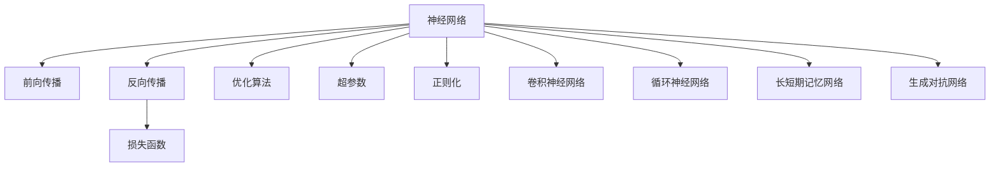

                 

# 神经网络：改变世界的技术

## 1. 背景介绍

### 1.1 问题由来
神经网络（Neural Networks, NN）是当前机器学习领域中最为成熟和广泛应用的技术之一，它模拟了人脑神经元之间的连接和信息传递机制，通过多层非线性映射实现了对复杂数据的高效建模和处理。自上世纪八十年代以来，神经网络经历了从浅层感知机到深度学习的发展，逐步显现出强大的数据处理能力。

近年来，随着深度学习技术的迅猛发展，尤其是大容量数据和高性能计算的推动，神经网络模型在计算机视觉、自然语言处理、语音识别等多个领域取得了突破性进展，深刻改变了人工智能（AI）技术和应用的面貌。例如，在图像识别任务中，基于深度卷积神经网络（CNN）的模型已经在图像分类、目标检测、语义分割等方面取得了比人类专家更高的准确率；在自然语言处理领域，基于循环神经网络（RNN）和长短时记忆网络（LSTM）的模型在机器翻译、文本生成、对话系统等任务上展示了卓越的表现。

神经网络技术的崛起，不仅推动了科技产业的转型升级，也为社会各个领域带来了深远的影响，从医疗健康、金融服务到教育娱乐，神经网络在助力各行各业数字化转型的过程中，展示了其强大的潜力。

### 1.2 问题核心关键点
神经网络技术的核心在于通过多层非线性变换，从原始数据中提取高效且具有层次性的特征表示，用于解决各类实际问题。其核心优势包括：

1. **强大的特征学习能力**：神经网络能够自动学习数据中的高层次特征，从而实现对复杂模式的建模。
2. **可扩展性强**：神经网络可以通过添加更多层和神经元，适应更复杂的任务和更丰富的数据。
3. **端到端学习**：神经网络能够通过反向传播算法自动优化模型参数，实现从输入到输出的端到端学习。
4. **泛化能力**：神经网络通过大量数据训练，能够泛化到未见过的数据，解决实际问题。

### 1.3 问题研究意义
神经网络技术的研究和应用，对于推动人工智能技术的突破与普及，提升人类社会的生活质量和工作效率，具有重要的意义：

1. **提升生产力**：神经网络技术的应用，可以大幅提高自动化和智能化水平，减少对人力的依赖，提升生产效率。
2. **促进创新**：神经网络提供了一种全新的技术手段，推动了新产业和新业态的发展，促进了科技创新的进程。
3. **改善服务体验**：通过神经网络技术，能够提供更加个性化、高效和精准的服务，改善用户体验。
4. **推动社会进步**：神经网络技术在医疗、教育、交通等多个领域的应用，有助于提升社会整体福祉，促进社会的公平与和谐。
5. **开拓研究前沿**：神经网络技术的发展，推动了人工智能基础研究领域的深入，为解决复杂的理论问题提供了新的思路和工具。

## 2. 核心概念与联系

### 2.1 核心概念概述

为了更好地理解神经网络技术的核心原理和架构，本节将介绍几个密切相关的核心概念：

- **神经网络（Neural Network, NN）**：由大量人工神经元（即节点）组成的网络结构，用于处理和预测数据。
- **前向传播（Forward Propagation）**：将输入数据从网络输入层逐层传递到输出层的过程，每层通过非线性函数对输入进行处理。
- **反向传播（Backpropagation）**：计算模型输出误差，并根据误差反向调整网络参数的过程。
- **损失函数（Loss Function）**：衡量模型预测与真实标签之间的差异，用于优化模型的目标函数。
- **优化算法（Optimization Algorithm）**：通过迭代调整模型参数，最小化损失函数的技术，如梯度下降、Adam等。
- **超参数（Hyperparameters）**：模型训练过程中需要手动设定的参数，如学习率、批量大小等，对模型性能有重要影响。
- **正则化（Regularization）**：防止模型过拟合的技术，如L1正则、Dropout等。
- **卷积神经网络（Convolutional Neural Networks, CNN）**：用于图像处理的神经网络，通过卷积和池化操作提取图像特征。
- **循环神经网络（Recurrent Neural Networks, RNN）**：处理序列数据的神经网络，通过循环连接实现对序列模式的学习。
- **长短期记忆网络（Long Short-Term Memory Networks, LSTM）**：一种特殊的RNN结构，用于处理长序列数据，避免了传统RNN的梯度消失问题。
- **生成对抗网络（Generative Adversarial Networks, GANs）**：通过生成器和判别器的对抗过程，生成高质量的伪造数据。

这些核心概念之间的逻辑关系可以通过以下Mermaid流程图来展示：



这个流程图展示了几类核心概念之间的关系：

1. 神经网络通过前向传播处理输入数据，输出预测结果。
2. 反向传播计算模型预测与真实标签之间的误差。
3. 损失函数衡量预测结果的准确性。
4. 优化算法通过迭代调整网络参数，最小化损失函数。
5. 超参数和正则化技术辅助优化算法提高模型性能。
6. 卷积神经网络、循环神经网络、长短期记忆网络和生成对抗网络是神经网络的不同变种，用于处理不同类型的任务。

这些概念共同构成了神经网络技术的核心框架，使其能够高效地处理和预测各种复杂数据。

## 3. 核心算法原理 & 具体操作步骤
### 3.1 算法原理概述

神经网络的核心算法原理主要包括前向传播和反向传播两个过程。以下是这两个过程的详细介绍：

#### 3.1.1 前向传播

前向传播是将输入数据从输入层逐层传递到输出层的过程。假设神经网络由$n$层组成，每一层包含$m$个神经元，网络结构可以用下图表示：


前向传播的计算过程如下：

1. 输入数据经过输入层，送入第一层神经元。
2. 每一层神经元将输入数据通过激活函数进行处理，输出结果传递给下一层神经元。
3. 最终输出层的输出结果即为神经网络的预测结果。

激活函数是神经网络中重要的组成部分，常用的激活函数包括Sigmoid、ReLU、Tanh等，其作用是引入非线性变换，使神经网络能够处理非线性模式。

#### 3.1.2 反向传播

反向传播是通过计算输出误差，反向调整网络参数的过程。具体步骤如下：

1. 计算输出层与真实标签之间的误差，使用损失函数衡量。
2. 从输出层开始，根据误差反向计算每一层的梯度。
3. 使用梯度下降等优化算法，根据梯度更新模型参数。

反向传播的核心是链式法则，它将输出误差通过链式规则逐层传递到输入层，计算每个参数对输出误差的贡献。

### 3.2 算法步骤详解

神经网络的训练和预测过程主要包括以下几个关键步骤：

**Step 1: 准备数据集**

- 收集并预处理训练数据集，包括数据清洗、数据增强、数据标准化等步骤。
- 划分数据集为训练集、验证集和测试集，确保模型在未见过的数据上仍能保持良好性能。

**Step 2: 设计神经网络结构**

- 选择合适的网络结构，如卷积神经网络（CNN）、循环神经网络（RNN）等，根据任务需求设计网络层数和每层神经元个数。
- 选择合适的激活函数和优化算法，设定超参数，如学习率、批量大小等。

**Step 3: 进行前向传播**

- 将训练数据输入神经网络，通过前向传播计算预测结果。
- 记录每层的输出值，以便后续反向传播计算梯度。

**Step 4: 计算损失函数**

- 使用损失函数（如均方误差、交叉熵等）计算预测结果与真实标签之间的误差。
- 将误差反向传播到前向传播过程中记录的每一层输出值。

**Step 5: 反向传播更新参数**

- 根据误差梯度，使用优化算法（如梯度下降、Adam等）更新模型参数。
- 定期在验证集上评估模型性能，避免过拟合。

**Step 6: 预测新数据**

- 将新数据输入训练好的神经网络，进行预测。
- 根据模型输出结果，做出决策或生成新数据。

### 3.3 算法优缺点

神经网络技术在处理复杂数据方面展现了强大的优势，但也存在一些局限性：

#### 3.3.1 优点

1. **强大的特征提取能力**：神经网络能够自动学习数据的高级特征表示，适用于处理复杂模式。
2. **适应性广**：适用于多种数据类型，包括图像、文本、语音等。
3. **可解释性强**：通过可视化工具，可以观察神经网络的中间特征，理解其决策过程。
4. **并行计算能力强**：神经网络可以通过GPU、TPU等并行计算硬件加速训练和推理过程。

#### 3.3.2 缺点

1. **模型复杂度高**：神经网络参数量庞大，训练过程复杂，对计算资源要求高。
2. **过拟合风险高**：神经网络容易过拟合，尤其是在数据量不足的情况下。
3. **泛化能力有限**：模型的泛化能力依赖于数据质量，当训练数据与测试数据分布差异较大时，效果不佳。
4. **可解释性不足**：深度神经网络通常被视为"黑箱"，难以解释其内部工作机制。
5. **对噪声敏感**：神经网络对输入数据的噪声较为敏感，输入数据质量不高时，模型性能会受到影响。

### 3.4 算法应用领域

神经网络技术在多个领域得到了广泛应用，以下是几个典型应用场景：

**计算机视觉**

- **图像分类**：如识别物体、场景等。卷积神经网络（CNN）被广泛应用于图像分类任务。
- **目标检测**：如在图像中定位物体位置。R-CNN、YOLO等目标检测算法基于CNN实现。
- **语义分割**：如在图像中划分不同物体的区域。U-Net、DeepLab等语义分割算法基于CNN实现。

**自然语言处理**

- **机器翻译**：如将一种语言翻译成另一种语言。基于循环神经网络（RNN）和长短期记忆网络（LSTM）的机器翻译模型，如Seq2Seq、Transformer等。
- **文本生成**：如自动生成新闻、文章等。基于循环神经网络（RNN）和长短期记忆网络（LSTM）的文本生成模型，如GPT、T5等。
- **情感分析**：如分析文本情感倾向。基于卷积神经网络（CNN）和循环神经网络（RNN）的情感分析模型，如TextCNN、LSTM等。

**语音识别**

- **语音识别**：如将语音转换成文本。基于卷积神经网络（CNN）和循环神经网络（RNN）的语音识别模型，如DeepSpeech、WaveNet等。
- **语音合成**：如生成自然流畅的语音。基于生成对抗网络（GAN）和变分自编码器（VAE）的语音合成模型，如Tacotron、WaveRNN等。

## 4. 数学模型和公式 & 详细讲解  
### 4.1 数学模型构建

神经网络的数学模型主要由输入层、隐藏层和输出层组成，其计算过程可以通过如下数学公式进行表示：

假设神经网络有$n$层，第$i$层的神经元数为$m_i$，输入数据为$\mathbf{x}$，输出数据为$\mathbf{y}$，则前向传播的计算过程可以表示为：

$$
\mathbf{a}^{(l)} = f(\mathbf{W}^{(l)}\mathbf{a}^{(l-1)} + \mathbf{b}^{(l)})
$$

其中，$\mathbf{a}^{(l)}$表示第$l$层的输出值，$\mathbf{W}^{(l)}$表示第$l$层的权重矩阵，$\mathbf{b}^{(l)}$表示第$l$层的偏置向量，$f(\cdot)$表示激活函数。

假设第$i$层的输出为$\mathbf{a}^{(i)}$，第$i$层的权重矩阵为$\mathbf{W}^{(i)}$，第$i$层的偏置向量为$\mathbf{b}^{(i)}$，则反向传播的计算过程可以表示为：

$$
\frac{\partial \mathcal{L}}{\partial \mathbf{W}^{(i)}} = \frac{\partial \mathcal{L}}{\partial \mathbf{a}^{(i+1)}} \frac{\partial \mathbf{a}^{(i+1)}}{\partial \mathbf{a}^{(i)}} \frac{\partial \mathbf{a}^{(i)}}{\partial \mathbf{W}^{(i)}}
$$

其中，$\frac{\partial \mathcal{L}}{\partial \mathbf{a}^{(i)}}$表示第$i$层对损失函数的偏导数，$\frac{\partial \mathbf{a}^{(i)}}{\partial \mathbf{W}^{(i)}}$表示第$i$层的激活函数对权重的偏导数。

### 4.2 公式推导过程

为了更好地理解神经网络模型的计算过程，这里以最简单的全连接神经网络为例，推导前向传播和反向传播的具体公式。

假设神经网络有$n$层，第$i$层的神经元数为$m_i$，输入数据为$\mathbf{x}$，输出数据为$\mathbf{y}$，则前向传播的计算过程可以表示为：

$$
\mathbf{a}^{(1)} = f(\mathbf{W}^{(1)}\mathbf{x} + \mathbf{b}^{(1)})
$$

$$
\mathbf{a}^{(i)} = f(\mathbf{W}^{(i)}\mathbf{a}^{(i-1)} + \mathbf{b}^{(i)}, i \in [2, n])
$$

假设第$i$层的输出为$\mathbf{a}^{(i)}$，第$i$层的权重矩阵为$\mathbf{W}^{(i)}$，第$i$层的偏置向量为$\mathbf{b}^{(i)}$，则反向传播的计算过程可以表示为：

$$
\frac{\partial \mathcal{L}}{\partial \mathbf{W}^{(i)}} = \frac{\partial \mathcal{L}}{\partial \mathbf{a}^{(i)}} \frac{\partial \mathbf{a}^{(i)}}{\partial \mathbf{W}^{(i)}} = \frac{\partial \mathcal{L}}{\partial \mathbf{a}^{(i)}} f'(\mathbf{W}^{(i)}\mathbf{a}^{(i-1)} + \mathbf{b}^{(i)})
$$

其中，$f'(\cdot)$表示激活函数的导数。

### 4.3 案例分析与讲解

以下以一个简单的二分类问题为例，演示神经网络的训练过程：

**问题描述**

给定一个包含$N$个样本的训练集$\{(\mathbf{x}_i, y_i)\}_{i=1}^N$，其中$\mathbf{x}_i \in \mathbb{R}^d$表示输入特征向量，$y_i \in \{0, 1\}$表示标签，任务是训练一个二分类器，使得模型能够正确预测新样本的标签。

**模型设计**

假设我们设计一个包含$n=2$层的全连接神经网络，每一层的神经元个数分别为$m_1=5$和$m_2=1$。使用ReLU作为激活函数，交叉熵损失函数作为优化目标。

**训练过程**

1. 初始化模型参数$\mathbf{W}^{(1)}$和$\mathbf{W}^{(2)}$，以及偏置向量$\mathbf{b}^{(1)}$和$\mathbf{b}^{(2)}$。
2. 对每个样本$\mathbf{x}_i$，进行前向传播计算，得到输出$\mathbf{a}^{(2)}$。
3. 计算损失函数$\mathcal{L}$，并根据梯度下降算法更新模型参数。
4. 重复步骤2-3，直至模型收敛。

## 5. 项目实践：代码实例和详细解释说明
### 5.1 开发环境搭建

在进行神经网络项目实践前，我们需要准备好开发环境。以下是使用Python进行TensorFlow开发的环境配置流程：

1. 安装Anaconda：从官网下载并安装Anaconda，用于创建独立的Python环境。

2. 创建并激活虚拟环境：
```bash
conda create -n tf-env python=3.8 
conda activate tf-env
```

3. 安装TensorFlow：根据CUDA版本，从官网获取对应的安装命令。例如：
```bash
conda install tensorflow tensorflow-estimator tensorflow-probability -c pytorch -c conda-forge
```

4. 安装各类工具包：
```bash
pip install numpy pandas scikit-learn matplotlib tqdm jupyter notebook ipython
```

完成上述步骤后，即可在`tf-env`环境中开始神经网络项目的开发。

### 5.2 源代码详细实现

这里我们以手写数字识别为例，给出使用TensorFlow对全连接神经网络进行训练的代码实现。

首先，定义数据处理函数：

```python
import tensorflow as tf
import numpy as np

def load_mnist_data(batch_size=64, train_size=60000):
    # 加载MNIST数据集
    (x_train, y_train), (x_test, y_test) = tf.keras.datasets.mnist.load_data()
    
    # 将数据归一化到[0, 1]区间
    x_train = x_train / 255.0
    x_test = x_test / 255.0
    
    # 将标签转换为one-hot编码
    y_train = tf.keras.utils.to_categorical(y_train, 10)
    y_test = tf.keras.utils.to_categorical(y_test, 10)
    
    # 随机打乱训练数据
    np.random.shuffle(x_train)
    np.random.shuffle(y_train)
    
    # 将数据集划分为训练集和验证集
    train_size = int(train_size * 0.7)
    x_train, x_val = x_train[:train_size], x_train[train_size:]
    y_train, y_val = y_train[:train_size], y_train[train_size:]
    
    # 将数据转换为TensorFlow的张量
    x_train = tf.convert_to_tensor(x_train, dtype=tf.float32)
    y_train = tf.convert_to_tensor(y_train, dtype=tf.int32)
    x_val = tf.convert_to_tensor(x_val, dtype=tf.float32)
    y_val = tf.convert_to_tensor(y_val, dtype=tf.int32)
    
    # 定义批次大小
    x_train_batch = tf.data.Dataset.from_tensor_slices(x_train).batch(batch_size).prefetch(1)
    y_train_batch = tf.data.Dataset.from_tensor_slices(y_train).batch(batch_size).prefetch(1)
    x_val_batch = tf.data.Dataset.from_tensor_slices(x_val).batch(batch_size).prefetch(1)
    y_val_batch = tf.data.Dataset.from_tensor_slices(y_val).batch(batch_size).prefetch(1)
    
    return x_train_batch, y_train_batch, x_val_batch, y_val_batch

def to_one_hot(y):
    return tf.one_hot(y, 10)

```

然后，定义模型和优化器：

```python
class Net(tf.keras.Model):
    def __init__(self, num_classes):
        super(Net, self).__init__()
        self.dense1 = tf.keras.layers.Dense(128, activation=tf.nn.relu)
        self.dense2 = tf.keras.layers.Dense(num_classes, activation=tf.nn.softmax)
    
    def call(self, x):
        x = self.dense1(x)
        x = self.dense2(x)
        return x

def build_model(input_shape, num_classes):
    model = Net(num_classes)
    model.compile(optimizer='adam', loss='categorical_crossentropy', metrics=['accuracy'])
    return model

```

接着，定义训练和评估函数：

```python
def train_model(model, x_train_batch, y_train_batch, x_val_batch, y_val_batch, epochs=10, batch_size=64):
    for epoch in range(epochs):
        print(f"Epoch {epoch+1}")
        train_loss = 0.0
        train_acc = 0.0
        val_loss = 0.0
        val_acc = 0.0
        
        for i in range(0, len(x_train_batch)):
            with tf.GradientTape() as tape:
                logits = model(x_train_batch[i])
                loss = tf.keras.losses.categorical_crossentropy(y_train_batch[i], logits)
            grads = tape.gradient(loss, model.trainable_variables)
            optimizer.apply_gradients(zip(grads, model.trainable_variables))
            
            train_loss += loss.numpy()
            train_acc += tf.keras.metrics.categorical_accuracy(y_train_batch[i], logits).numpy()
            
        for i in range(0, len(x_val_batch)):
            logits = model(x_val_batch[i])
            val_loss += tf.keras.losses.categorical_crossentropy(y_val_batch[i], logits).numpy()
            val_acc += tf.keras.metrics.categorical_accuracy(y_val_batch[i], logits).numpy()
        
        print(f"Train loss: {train_loss / len(x_train_batch)}")
        print(f"Train accuracy: {train_acc / len(x_train_batch)}")
        print(f"Validation loss: {val_loss / len(x_val_batch)}")
        print(f"Validation accuracy: {val_acc / len(x_val_batch)}")
        
def evaluate_model(model, x_val_batch, y_val_batch):
    logits = model(x_val_batch)
    val_loss = tf.keras.losses.categorical_crossentropy(y_val_batch, logits).numpy()
    val_acc = tf.keras.metrics.categorical_accuracy(y_val_batch, logits).numpy()
    print(f"Validation loss: {val_loss}")
    print(f"Validation accuracy: {val_acc}")
    
```

最后，启动训练流程并在测试集上评估：

```python
x_train_batch, y_train_batch, x_val_batch, y_val_batch = load_mnist_data(batch_size=64, train_size=60000)
model = build_model(input_shape=(28, 28), num_classes=10)
train_model(model, x_train_batch, y_train_batch, x_val_batch, y_val_batch, epochs=10, batch_size=64)
evaluate_model(model, x_val_batch, y_val_batch)
```

以上就是使用TensorFlow对全连接神经网络进行手写数字识别的完整代码实现。可以看到，通过TensorFlow提供的高级API，我们可以非常简便地构建和训练神经网络模型，并实现模型评估。

### 5.3 代码解读与分析

让我们再详细解读一下关键代码的实现细节：

**load_mnist_data函数**：
- 加载MNIST数据集，将其归一化并转换为TensorFlow的张量。
- 将标签转换为one-hot编码，并进行随机打乱。
- 将数据集划分为训练集和验证集，并定义批次大小。

**Net类**：
- 定义一个包含两个全连接层的神经网络。
- 第一个层使用ReLU激活函数，第二个层使用softmax激活函数。

**build_model函数**：
- 定义神经网络模型，并使用Adam优化器和交叉熵损失函数进行编译。

**train_model函数**：
- 对每个批次进行前向传播和反向传播，更新模型参数。
- 计算训练集和验证集的损失和准确率，并打印输出。

**evaluate_model函数**：
- 计算验证集的损失和准确率，并打印输出。

**主函数**：
- 加载数据，构建模型，训练和评估模型。

## 6. 实际应用场景

### 6.1 计算机视觉

计算机视觉是神经网络技术的重要应用领域之一。以下是几个典型应用场景：

**图像分类**

- **对象识别**：如识别图片中的物体，如汽车、猫、狗等。使用卷积神经网络（CNN）进行图像分类任务，如AlexNet、VGGNet等。
- **场景分类**：如识别图片中的场景，如城市、自然风光等。使用卷积神经网络（CNN）进行场景分类任务，如GoogleNet、InceptionNet等。

**目标检测**

- **物体检测**：如在图片中定位物体的位置。使用区域卷积神经网络（R-CNN）、YOLO等目标检测算法，基于CNN实现。
- **人脸检测**：如在图片中检测人脸的位置和关键点。使用单阶段检测器（SSD）、Faster R-CNN等目标检测算法，基于CNN实现。

**图像分割**

- **语义分割**：如在图片中划分不同物体的区域。使用语义分割算法，如U-Net、DeepLab等，基于CNN实现。

### 6.2 自然语言处理

自然语言处理是神经网络技术的另一重要应用领域。以下是几个典型应用场景：

**机器翻译**

- **文本翻译**：如将一种语言翻译成另一种语言。使用序列到序列（Seq2Seq）模型，基于RNN和LSTM实现。
- **语音翻译**：如将语音转换成文本，再进行翻译。使用端到端语音识别（ASR）和机器翻译（MT）的组合模型，基于CNN和RNN实现。

**文本生成**

- **文本摘要**：如将长文本压缩成简短摘要。使用摘要算法，如Seq2Seq、Transformer等，基于RNN和LSTM实现。
- **对话系统**：如构建机器人对话系统。使用对话生成算法，如Seq2Seq、Transformer等，基于RNN和LSTM实现。

**情感分析**

- **情感分类**：如分析文本情感倾向。使用文本分类算法，如TextCNN、LSTM等，基于CNN和RNN实现。

### 6.3 语音识别

语音识别是神经网络技术在声音处理领域的重要应用之一。以下是几个典型应用场景：

**语音识别**

- **文本转语音（TTS）**：如将文本转换成自然流畅的语音。使用变分自编码器（VAE）和生成对抗网络（GAN）的组合模型，基于CNN和RNN实现。
- **语音识别**：如将语音转换成文本。使用卷积神经网络（CNN）和循环神经网络（RNN）的组合模型，如DeepSpeech、WaveNet等。

### 6.4 未来应用展望

随着神经网络技术的不断进步，未来的应用场景将更加广泛，包括但不限于以下领域：

**自动驾驶**

- **图像识别**：如识别道路、车辆、行人等。使用卷积神经网络（CNN）进行图像识别任务，如YOLO、SSD等。
- **语音识别**：如识别驾驶员的语音命令。使用语音识别算法，如DeepSpeech、WaveNet等。

**智能医疗**

- **医学影像分析**：如分析X光片、CT等医学影像。使用卷积神经网络（CNN）进行图像分类和分割任务，如ResNet、U-Net等。
- **病历分析**：如分析患者病历，预测病情发展。使用序列到序列（Seq2Seq）模型，基于RNN和LSTM实现。

**智能教育**

- **智能评测**：如自动批改学生作业。使用文本分类算法，如TextCNN、LSTM等，基于CNN和RNN实现。
- **个性化推荐**：如推荐学习资源。使用协同过滤算法，基于神经网络实现。

## 7. 工具和资源推荐
### 7.1 学习资源推荐

为了帮助开发者系统掌握神经网络技术的理论基础和实践技巧，这里推荐一些优质的学习资源：

1. **《深度学习》课程**：斯坦福大学Andrew Ng教授的深度学习课程，系统介绍了深度学习的基本概念、模型和算法，是入门深度学习的不二之选。
2. **《动手学深度学习》书籍**：由李沐等人编写，从基础理论到实践应用，深入浅出地介绍了深度学习技术，包含丰富的代码实现。
3. **TensorFlow官方文档**：TensorFlow的官方文档提供了详尽的API文档和教程，是学习TensorFlow的最佳资源。
4. **Keras官方文档**：Keras的官方文档提供了简单易用的API，适合快速原型开发。
5. **PyTorch官方文档**：PyTorch的官方文档提供了详细的教程和示例，是学习神经网络技术的必备资源。

通过对这些资源的学习实践，相信你一定能够快速掌握神经网络技术的精髓，并用于解决实际的NLP问题。

### 7.2 开发工具推荐

高效的开发离不开优秀的工具支持。以下是几款用于神经网络微调开发的常用工具：

1. **TensorFlow**：由Google主导开发的开源深度学习框架，功能强大，生态丰富，支持GPU/TPU加速，是神经网络开发的常用工具。
2. **PyTorch**：由Facebook主导开发的深度学习框架，易于使用，具有动态计算图和丰富的深度学习功能。
3. **Keras**：基于TensorFlow和Theano的高级API，提供了简单易用的神经网络构建和训练工具。
4. **MXNet**：由Amazon开发的深度学习框架，支持多种语言和硬件，具有高效的分布式训练能力。
5. **Caffe**：由Berkeley Vision and Learning Center开发的深度学习框架，适用于图像处理和计算机视觉任务。

合理利用这些工具，可以显著提升神经网络模型的开发效率，加快创新迭代的步伐。

### 7.3 相关论文推荐

神经网络技术的发展源于学界的持续研究。以下是几篇奠基性的相关论文，推荐阅读：

1. **ImageNet Classification with Deep Convolutional Neural Networks**：AlexNet论文，引入了深度卷积神经网络，开启了深度学习在计算机视觉领域的革命。
2. **Deep Learning for Natural Language Processing**：提出使用RNN和LSTM进行文本生成的想法，奠定了神经网络在自然语言处理领域的应用基础。
3. **Attention is All You Need**：提出Transformer模型，采用了自注意力机制，大幅度提升了序列到序列（Seq2Seq）任务的性能。
4. **Generative Adversarial Nets**：提出生成对抗网络（GAN），通过生成器和判别器的对抗过程，生成高质量的伪造数据。
5. **Image Captioning with Visual Attention**：提出使用CNN和LSTM结合的模型，进行图像描述生成，展示了神经网络在图像和语言处理结合上的潜力。

这些论文代表了大神经网络技术的发展脉络。通过学习这些前沿成果，可以帮助研究者把握学科前进方向，激发更多的创新灵感。

## 8. 总结：未来发展趋势与挑战

### 8.1 总结

本文对神经网络技术的核心原理和实际应用进行了全面系统的介绍。首先阐述了神经网络技术的起源和发展，明确了其强大的特征提取能力和广泛的应用前景。其次，从原理到实践，详细讲解了神经网络模型的构建和训练过程，给出了神经网络模型训练的完整代码实现。同时，本文还广泛探讨了神经网络技术在计算机视觉、自然语言处理、语音识别等多个领域的应用场景，展示了神经网络技术的巨大潜力。此外，本文精选了神经网络技术的各类学习资源，力求为读者提供全方位的技术指引。

通过本文的系统梳理，可以看到，神经网络技术在处理复杂数据方面展现了强大的优势，通过深度学习和反向传播算法，能够高效地从数据中提取高级特征，实现各种复杂任务的建模和预测。未来，随着技术的不断进步，神经网络技术必将在更广阔的领域发挥更大的作用，推动人工智能技术的全面普及。

### 8.2 未来发展趋势

展望未来，神经网络技术的发展趋势将呈现以下几个方向：

1. **模型规模不断增大**：随着计算资源的丰富，神经网络模型将越来越大，能够处理更复杂的任务。
2. **模型结构不断优化**：未来的神经网络将更加注重模型结构的设计，引入更多的自注意力机制和残差连接等技巧，提升模型的性能和泛化能力。
3. **迁移学习的应用推广**：迁移学习将进一步普及，通过在大规模数据集上预训练模型，然后在特定任务上进行微调，减少对标注数据的依赖，提升模型的泛化能力。
4. **多模态学习的应用推广**：神经网络技术将与计算机视觉、语音识别等其他模态技术结合，实现多模态数据的协同建模和处理。
5. **深度强化学习的应用推广**：神经网络与强化学习结合，实现更加智能的决策和控制，推动人工智能技术的进一步突破。

这些趋势将使得神经网络技术在未来具有更广泛的应用前景，为社会的各个领域带来更多的变革和创新。

### 8.3 面临的挑战

尽管神经网络技术已经取得了显著的进展，但在实际应用中仍面临诸多挑战：

1. **模型复杂度高**：神经网络模型的参数量巨大，训练和推理过程复杂，对计算资源要求高。
2. **过拟合风险高**：神经网络容易过拟合，尤其是在数据量不足的情况下。
3. **泛化能力有限**：模型的泛化能力依赖于数据质量，当训练数据与测试数据分布差异较大时，效果不佳。
4. **可解释性不足**：深度神经网络通常被视为"黑箱"，难以解释其内部工作机制。
5. **计算资源消耗大**：神经网络模型训练和推理过程资源消耗大，对计算硬件要求高。

### 8.4 研究展望

面对神经网络技术所面临的挑战，未来的研究需要在以下几个方面寻求新的突破：

1. **无监督和半监督学习的应用推广**：探索无监督和半监督学习的方法，利用自监督学习、主动学习等技术，最大程度利用数据资源，减少对标注数据的依赖。
2. **参数高效和计算高效的方法**：开发更加参数高效和计算高效的神经网络模型，如网络剪枝、量化加速等，提高模型训练和推理效率。
3. **多模态数据的整合**：引入更多先验知识，结合计算机视觉、语音识别等技术，实现多模态数据的协同建模和处理。
4. **因果学习和强化学习的应用推广**：结合因果学习和强化学习技术，提升神经网络的决策和控制能力，推动人工智能技术的进一步突破。
5. **模型可解释性的提升**：引入更多可解释性技术，如可视化工具、因果分析等，提升神经网络模型的可解释性和可解释性。

这些研究方向将使得神经网络技术在未来更具通用性和普适性，为构建智能系统提供更可靠的技术基础。面向未来，神经网络技术还需要与其他人工智能技术进行更深入的融合，如知识表示、因果推理、强化学习等，多路径协同发力，共同推动人工智能技术的进步。

## 9. 附录：常见问题与解答

**Q1：神经网络技术是否适用于所有NLP任务？**

A: 神经网络技术在处理复杂数据方面展现了强大的优势，适用于多种NLP任务，包括文本分类、序列标注、机器翻译等。但对于一些特定领域的任务，如医学、法律等，仅依赖通用语料预训练的模型可能难以很好地适应。此时需要在特定领域语料上进一步预训练，再进行微调，才能获得理想效果。

**Q2：神经网络模型的训练过程中，如何选择超参数？**

A: 神经网络模型的训练过程中，超参数的选择对模型的性能有重要影响。通常需要根据任务特点和数据规模，选择合适的网络结构、激活函数、优化器等超参数。常用的超参数选择方法包括网格搜索、随机搜索、贝叶斯优化等。

**Q3：神经网络模型在实际部署时需要注意哪些问题？**

A: 神经网络模型在实际部署时，需要注意以下问题：

1. 模型裁剪：去除不必要的层和参数，减小模型尺寸，加快推理速度。
2. 量化加速：将浮点模型转为定点模型，压缩存储空间，提高计算效率。
3. 服务化封装：将模型封装为标准化服务接口，便于集成调用。
4. 弹性伸缩：根据请求流量动态调整资源配置，平衡服务质量和成本。
5. 监控告警：实时采集系统指标，设置异常告警阈值，确保服务稳定性。
6. 安全防护：采用访问鉴权、数据脱敏等措施，保障数据和模型安全。

**Q4：神经网络模型在训练过程中，如何解决过拟合问题？**

A: 神经网络模型在训练过程中，过拟合是一个常见的问题。为了解决过拟合问题，可以采用以下方法：

1. 数据增强：通过回译、近义替换等方式扩充训练集。
2. 正则化：使用L1正则、Dropout、Early Stopping等方法，防止模型过度适应小规模训练集。
3. 对抗训练：加入对抗样本，提高模型鲁棒性。
4. 参数高效微调：只调整少量模型参数，而固定大部分预训练权重不变，以提高微调效率，避免过拟合。

这些方法往往需要根据具体任务和数据特点进行灵活组合，以达到最佳效果。

**Q5：神经网络模型在实际应用中，如何提高泛化能力？**

A: 神经网络模型在实际应用中，提高泛化能力的方法包括：

1. 使用更多的数据：增加训练数据，使得模型能够更好地泛化。
2. 数据增强：通过数据扩充和增强技术，丰富训练数据的多样性。
3. 使用正则化技术：引入L1正则、Dropout等正则化技术，防止模型过拟合。
4. 使用迁移学习：在预训练模型基础上进行微调，利用预训练模型的知识，提高模型的泛化能力。
5. 使用集成学习：通过组合多个模型的预测结果，提升模型的泛化能力。

通过以上方法，可以在一定程度上提高神经网络模型的泛化能力，使其在未见过的数据上仍能保持良好性能。

---

作者：禅与计算机程序设计艺术 / Zen and the Art of Computer Programming

